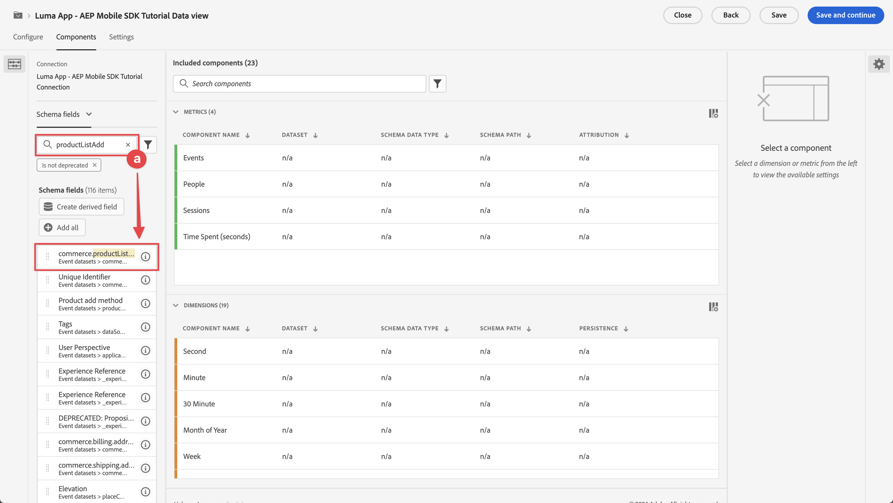
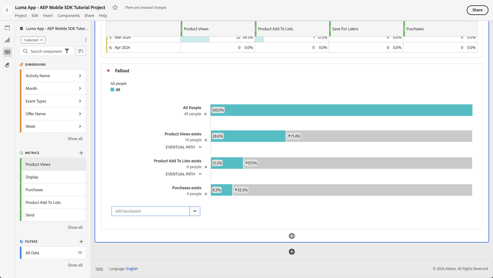

# Customer Journey Analytics을 사용하여 보고 및 분석

Customer Journey Analytics과의 모바일 앱 상호 작용을 보고하고 분석하는 방법에 대해 알아봅니다.

이전 단원에서 수집하여 Platform Edge Network으로 전송한 모바일 앱 이벤트 데이터는 데이터스트림에 구성된 서비스로 전달됩니다. [Experience Platform에 데이터 보내기](platform.md) 단원을 따랐다면 해당 데이터는 이제 Experience Platform 데이터 집합에 저장되고 Customer Journey Analytics이 보고 및 분석에 사용할 수 있습니다.

Adobe Analytics과 달리, Customer Journey Analytics *은(는) Experience Platform에서 만든 데이터 세트의 데이터를 사용합니다*. 데이터는 Adobe Experience Platform Mobile SDK를 사용하여 Customer Journey Analytics으로 직접 전송되지 않고 데이터 세트로 전송됩니다. 그런 다음 Reporting and Analysis 프로젝트에서 사용할 데이터 세트를 선택할 수 있도록 Customer Journey Analytics에서 연결이 구성됩니다.

자습서의 이 단원은 Luma 자습서 앱에서 캡처한 데이터를 보고하고 분석하는 데 중점을 둡니다. Customer Journey Analytics의 고유한 기능 중 하나는 고객 여정에 대한 심도 있는 통찰력을 얻기 위해 여러 소스(CRM, 판매 지점, 로열티 애플리케이션, 콜 센터)와 채널(웹, 모바일, 오프라인)의 데이터를 결합하는 것입니다. 이 기능은 이 단원에서 다루지 않습니다. 자세한 내용은 [Customer Journey Analytics 개요](https://experienceleague.adobe.com/en/docs/analytics-platform/using/cja-overview/cja-overview)를 참조하십시오.

## 전제 조건

조직이 프로비저닝되고 Customer Journey Analytics에 대한 권한이 부여되어야 합니다. Customer Journey Analytics에 대한 관리자 액세스 권한이 있어야 합니다.

## 학습 목표

이 단원에서는 다음 작업을 수행합니다.

- 연결을 만들어 Customer Journey Analytics에 사용할 Experience Platform에서 데이터 세트를 정의합니다.
- 데이터 보기를 만들어 보고 및 분석을 위해 데이터 세트의 데이터를 준비합니다
- 프로젝트를 만들어 모바일 앱의 데이터를 분석할 수 있도록 보고서와 시각화를 작성합니다.

이 순서는 의도적인 것입니다. 연결은 데이터 세트를 사용하고 데이터 보기는 연결을 사용합니다.

## 연결 만들기

Customer Journey Analytics의 연결은 보고 및 분석에 사용할 Experience Platform의 데이터 세트(및 이러한 데이터 세트 내의 데이터)를 정의합니다.

1. 오른쪽 상단의 앱  메뉴를 사용하여 Customer Journey Analytics 인터페이스로 이동합니다.

1. 상단 메뉴 모음에서 **[!UICONTROL 연결]**&#x200B;을 선택합니다.

1. 연결 인터페이스에서 **[!UICONTROL 목록]** 탭을 선택하십시오. 기존 연결 목록이 표시됩니다.

1. **[!UICONTROL 새 연결 만들기]**&#x200B;를 선택합니다.

1. **[!UICONTROL 연결 설정]**&#x200B;의 **[!UICONTROL 연결]** > **[!UICONTROL 제목 없는 연결]** 화면에서

   1. **[!UICONTROL 연결 이름]**&#x200B;을 입력하십시오(예: `Luma App - AEP Mobile SDK Tutorial Connection`).
   2. **[!UICONTROL 연결 설명]**&#x200B;을 입력하십시오(예: `Connection for the Luma app used in the AEP Mobile SDK tutorial`).

      **[!UICONTROL 데이터 설정]**&#x200B;에서:

   3. 모바일 앱 데이터를 수집하는 데 사용한 샌드박스를 선택합니다(예: **[!UICONTROL 모바일 및 웹 SDK 과정]**).
   4. **[!UICONTROL 일일 평균 이벤트 수]**&#x200B;에서 **[!UICONTROL 100만 미만]**&#x200B;을(를) 선택합니다.

   5. **[!UICONTROL 데이터 세트 추가]**&#x200B;를 선택하여 Customer Journey Analytics에 사용할 Experience Platform에서 데이터 세트를 선택합니다.

      

   6. **[!UICONTROL 데이터 세트 추가]** 마법사에서 **[!UICONTROL 데이터 세트 선택]** 단계,

      1. 다음 데이터 세트를 선택합니다.

         - **[!UICONTROL Luma 모바일 앱 이벤트 데이터 세트]**, Experience Platform 단원에서 [데이터 세트 만들기](platform.md#create-a-dataset) 섹션의 일부로 만든 데이터 세트.
         - **[!UICONTROL ODE DecisionEvents - *샌드박스 이름*] Decisioning**
         - **[!UICONTROL AJO 푸시 추적 이벤트 데이터 세트]**

      1. **[!UICONTROL 다음]**&#x200B;을 선택합니다.

         

   7. **[!UICONTROL 데이터 세트 추가]** 마법사, **[!UICONTROL 데이터 세트 설정]** 단계에서는 각 이벤트 데이터 세트에 대한 세부 정보를 정의해야 합니다.
      1. 올바른 설정을 위해 다음 표를 참조하십시오.

         | 데이터 세트 | 개인 ID ① | 타임스탬프 ② | 데이터 소스 유형 ③ | 모든 새 데이터 ④ 가져오기 | 기존의 모든 데이터 ⑤ 채우기 |
         |---|---|---|---|---|---|
         | Luma 모바일 앱 이벤트 데이터 세트 | identityMap | 타임스탬프 | 모바일 앱 데이터 | 활성화 | 활성화 |
         | ODE DecisionEvents - *샌드박스 이름* 의사 결정 | identityMap | 타임스탬프 | 모바일 앱 데이터 | 활성화 | 활성화 |
         | AJO 푸시 추적 경험 이벤트 데이터 세트 | identityMap | 타임스탬프 | 모바일 앱 데이터 | 활성화 | 활성화 |

      1. **[!UICONTROL 데이터 세트 추가]**&#x200B;를 선택합니다.

         

1. **[!UICONTROL 연결]** > **[!UICONTROL Luma 앱 - AEP Mobile SDK 튜토리얼 연결]**&#x200B;에서 **[!UICONTROL 저장]**&#x200B;을 선택하여 연결을 저장합니다.

   

이제 연결을 정의하고 Customer Journey Analytics이 데이터 세트의 데이터를 자체 내부 데이터베이스에 추가합니다. 이 데이터 수집은 데이터의 양에 따라 시간이 걸릴 수 있습니다. 튜토리얼 앱의 경우, 데이터가 Customer Journey Analytics에 표시될 때까지 2시간 정도 예측합니다.

연결 상태를 보려면:

1. Customer Journey Analytics의 주 인터페이스에서 **[!UICONTROL 연결]**&#x200B;을(를) 선택하십시오.
1. 연결 이름을 선택합니다(예: **[!UICONTROL Luma 앱 - AEP 모바일 SDK 튜토리얼 연결]**).

**[!UICONTROL 연결]** > **[!UICONTROL Luma 앱 - AEP Mobile SDK 자습서 연결]**&#x200B;에서 다음을 볼 수 있습니다.

1. 추가된 총 레코드, 건너뛴 레코드 및 삭제된 레코드에 대한 정보입니다. **[!UICONTROL 모든 데이터 세트]**&#x200B;를 선택하고 적절한 기간을 선택하여 연결에 대한 세부 정보를 확인하십시오. 을 사용하여 기간을 선택하는 대화 상자를 열 수 있습니다.
1. 추가된 레코드, 건너뛴 레코드, 삭제된 레코드 등에 대한 개별 데이터 세트에 대한 정보입니다.

   

## 데이터 보기 만들기

Customer Journey Analytics에 데이터 세트에서 레코드가 추가되면 데이터 보기를 만들어 보고할 데이터의 구성 요소를 정의할 수 있습니다.

데이터 보기는 연결에서 데이터를 해석하는 방법을 결정할 수 있도록 해주는 Customer Journey Analytics과 관련된 컨테이너입니다. 연결에서 Analysis Workspace의 구성 요소(차원, 지표)로 정의한 데이터 세트에서 표준 및 스키마 필드를 구성할 수 있습니다.

Customer Journey Analytics의 데이터 보기는 연결에서 데이터를 올바르게 설정하고 정의하는 데 엄청난 유연성을 제공합니다. 이 자습서에서는 보고 및 분석에 필요한 기능만 사용합니다. 자세한 내용은 [데이터 보기](https://experienceleague.adobe.com/en/docs/analytics-platform/using/cja-dataviews/data-views)를 참조하세요.

데이터 보기를 만들려면 다음을 수행하십시오.

1. 오른쪽 상단의 앱  메뉴를 사용하여 Customer Journey Analytics 인터페이스로 이동합니다.

1. 상단 메뉴 모음에서 **[!UICONTROL 데이터 보기]**&#x200B;를 선택합니다.
1. **[!UICONTROL 새 데이터 보기 만들기]**&#x200B;를 선택합니다.
1. **[!UICONTROL 데이터 보기 >]**&#x200B;에서 **[!UICONTROL 구성]** 탭이 선택되어 있는지 확인하십시오.

   1. 연결 설정 드롭다운 목록에서 연결을 선택합니다(예: **[!UICONTROL Luma 앱 - AEP Mobile SDK 튜토리얼 연결]**).
   1. 데이터 보기의 이름(예: `Luma App - AEP Mobile SDK Tutorial Data view`)을 입력하십시오.
   1. **[!UICONTROL 저장 후 계속]**&#x200B;을 선택하세요.

      

1. **[!UICONTROL Luma 앱 - AEP 모바일 SDK 자습서 데이터 보기]**&#x200B;의 **[!UICONTROL 구성 요소]** 탭에서 모바일 앱에 대해 보고할 때 사용할 지표와 차원을 정의할 수 있습니다. 기본적으로 데이터 보기에 대해 많은 표준 지표 및 차원(구성 요소와 함께 지칭됨)이 이미 구성되어 있습니다. 그러나 데이터 보기에는 더 많은 구성 요소가 필요합니다.  이전에 정의한 스키마 또는 기본 제공 스키마에서 스키마 필드를 추가하려면([스키마 만들기](create-schema.md) 단원 참조) 다음 작업을 구성 요소(차원 또는 지표)로 수행하십시오.

   1. 스키마 필드 찾기:

      -  ***[!UICONTROL 스키마 필드 검색]*** 검색 필드를 사용하여 구성 요소를 검색합니다. 예: `productListAdd` 또는

        

      -  **[!UICONTROL 이벤트 데이터 세트]**  내의 스키마 필드로 이동합니다.  예:  **[!UICONTROL 이벤트 데이터 세트]**   **[!UICONTROL 상거래]**   **[!UICONTROL 제품 목록 추가]** 

        

   1. 스키마 필드 창에서 특정 스키마 필드를 드래그하여 [!UICONTROL 포함된 구성 요소] 창의 **[!UICONTROL DIMENSION]** 또는 **[!UICONTROL 지표]** 목록에 놓습니다.

      

   1. 구성 요소의 설정을 구성할 수 있습니다. 오른쪽 창에서 구성 요소를 선택하고 설정을 구성합니다.  예를 들어 오른쪽 창의 **[!UICONTROL 구성 요소 설정]** > **[!UICONTROL 구성 요소 이름]** 필드를 사용하여 **[!UICONTROL commerce.productListAdds]**&#x200B;의 이름을 `Product Add To Lists`로 바꿀 수 있습니다.

      

      또는 **[!UICONTROL 제외 값 포함]**&#x200B;을 구성하십시오.

      

   1. 이제 데이터 보기에 필드를 추가하고 결과 구성 요소를 구성하는 방법을 이해했으므로 아래 표를 사용하여 지표 또는 차원으로 추가할 스키마 필드 목록을 확인하십시오. 아래 표의 **스키마 경로** 열 값을 사용하여 특정 스키마 필드를 검색하거나 해당 스키마 필드로 이동합니다. 지표 및 차원이 추가되면 **[!UICONTROL 구성 요소 이름]**&#x200B;이나 **[!UICONTROL INCLUDE EXCLUDE 값]**&#x200B;을(를) 정의하는 것과 같이 구성 요소에 특정 설정이 필요한지 여부를 테이블의 **구성 요소 설정** 열 값을 확인합니다.

      **지표**

      | 구성 요소 이름 | 데이터 세트 | 스키마 데이터 유형 | 스키마 경로 | 구성 요소 설정 |
      |---|---|---|---|---|
      | 닫기 | AJO 푸시 추적 경험 이벤트 데이터 세트, Luma 모바일 앱 이벤트 데이터 세트 | 정수 | _experience.decisioning. propositionEventType.dismissing | 구성 요소 이름: `Dismiss` |
      | 구독 취소 | AJO 푸시 추적 경험 이벤트 데이터 세트, Luma 모바일 앱 이벤트 데이터 세트 | 정수 | _experience.decisioning. propositionEventType.unsubscribe | 구성 요소 이름: `Unsubscribe` |
      | 트리거 | AJO 푸시 추적 경험 이벤트 데이터 세트, Luma 모바일 앱 이벤트 데이터 세트 | 정수 | _experience.decisioning. propositionEventType.트리거 | 구성 요소 이름: `Trigger` |
      | 표시 | AJO 푸시 추적 경험 이벤트 데이터 세트, Luma 모바일 앱 이벤트 데이터 세트 | 정수 | _experience.decisioning. propositionEventType.display | 구성 요소 이름: `Display` |
      | 보내기 | AJO 푸시 추적 경험 이벤트 데이터 세트, Luma 모바일 앱 이벤트 데이터 세트 | 정수 | _experience.decisioning. propositionEventType.send | 구성 요소 이름: `Send` |
      | 상호 작용 | AJO 푸시 추적 경험 이벤트 데이터 세트, Luma 모바일 앱 이벤트 데이터 세트 | 정수 | _experience.decisioning. propositionEventType.interact | 구성 요소 이름: `Interact` |
      | 위치 이벤트 | AJO 푸시 추적 경험 이벤트 데이터 세트, Luma 모바일 앱 이벤트 데이터 세트, ODE DecisionEvents - mobile-and-web-sdk-courses 의사 결정 | 문자열 | 이벤트 유형 | 구성 요소 이름: `Location Events`   |
      | 제품 보기 | Luma 모바일 앱 이벤트 데이터 세트 | 더블 | commerce.productViews.value | 구성 요소 이름: `Product Views` |
      | 목록에 제품 추가 | Luma 모바일 앱 이벤트 데이터 세트 | 더블 | commerce.productListAdds.value | 구성 요소 이름: `Product Add To Lists` |
      | 구매 | Luma 모바일 앱 이벤트 데이터 세트 | 더블 | commerce.purchases.value | 구성 요소 이름: `Purchases` |
      | 나중에 저장 | Luma 모바일 앱 이벤트 데이터 세트 | 더블 | commerce.saveForLaters.value | 구성 요소 이름: `Save For Laters` |
      | 앱 상호 작용 | Luma 모바일 앱 이벤트 데이터 세트 | 더블 | _techmarketingdemos.appInformation. appInteraction.appAction.value | 구성 요소 이름: `App Interactions` |
      | 화면 보기 | Luma 모바일 앱 이벤트 데이터 세트 | 더블 | _techmarketingdemos.appInformation. appStateDetails.screenView.value | 구성 요소 이름: `Screen Views` |

      {style="table-layout:auto"}

      >[!NOTE]
      >
      >위치 이벤트 지표에 대한 스키마 필드에서 **[!UICONTROL INCLUDE EXCLUDE VALUES]**&#x200B;을(를) 사용하여 `location`이(가) 포함된 이벤트 유형을 계산하는 방법을 참고하십시오.

      위의 표에 있는 모든 스키마 필드를 지표 구성 요소로 추가한 후에는 **[!UICONTROL METRICS]**&#x200B;에 대한 데이터 보기 구성이 아래에 일치해야 합니다.

      

      **DIMENSION**

      | 구성 요소 이름 | 데이터 세트 | 스키마 데이터 유형 | 스키마 경로 | 구성 요소 설정 |
      |---|---|---|---|---|
      | 구/군/시 | AJO 푸시 추적 경험 이벤트 데이터 세트, Luma 모바일 앱 이벤트 데이터 세트 | 문자열 | placeContext.geo.city | 구성 요소 이름: `City` |
      | 이벤트 유형 | AJO 푸시 추적 경험 이벤트 데이터 세트, Luma 모바일 앱 이벤트 데이터 세트, ODE DecisionEvents - mobile-and-web-sdk-courses 의사 결정 | 문자열 | eventType | 구성 요소 이름: `Event Types` |
      | 결정 옵션 이름 | AJO 푸시 추적 경험 이벤트 데이터 세트, Luma 모바일 앱 이벤트 데이터 세트, ODE DecisionEvents - mobile-and-web-sdk-courses 의사 결정 | 문자열 | _experience.decisioning. propositions.items.name | 구성 요소 이름: `Decision Option Name` |
      | 앱 상호 작용 이름 | Luma 모바일 앱 이벤트 데이터 세트 | 문자열 | _techmarketingdemos.appInformation. appInteraction.name | 구성 요소 이름: `App Interaction Name` |
      | 화면 이름 | Luma 모바일 앱 이벤트 데이터 세트 | 문자열 | _techmarketingdemos.appInformation. appStateDetails.screenName | 구성 요소 이름: `Screen Name` |
      | 활동 이름 | ODE DecisionEvents - 모바일 및 웹 SDK 과정 의사 결정 | 문자열 | _experience.decisioning. propositionDetails.activity.name | 구성 요소 이름: `Activity Name` |
      | 오퍼 이름 | ODE DecisionEvents - 모바일 및 웹 SDK 과정 의사 결정 | 문자열 | _experience.decisioning. propositionDetails.selections.name | 구성 요소 이름: `Offer Name` |

      {style="table-layout:auto"}

      위 표의 모든 스키마 필드를 차원 구성 요소로 추가한 후에는 **[!UICONTROL DIMENSION]**&#x200B;에 대한 데이터 보기 구성이 아래에 일치해야 합니다.

      

   1. **[!UICONTROL 저장 후 계속]**&#x200B;을 선택하세요.

1. **[!UICONTROL Luma 앱 - AEP Mobile SDK 자습서 데이터 보기]**&#x200B;의 **[!UICONTROL 설정]** 탭을 사용하여 필터 및 세션 설정을 구성할 수 있습니다. 이 자습서에서는 추가 구성이 필요하지 않습니다.

   - **[!UICONTROL 저장 후 완료]**&#x200B;를 선택합니다.

데이터 보기를 정의했으며 보고서 및 시각화 작성을 시작하기 위한 모든 것이 준비되었습니다.

## 프로젝트 만들기

Workspace 프로젝트는 Customer Journey Analytics에서 보고서 및 시각화를 작성하는 데 사용됩니다. 포괄적인 보고서와 매력적인 시각화를 구축할 수 있는 가능성은 여러 가지가 있지만, 이는 이 자습서의 범위를 벗어납니다. 자세한 내용은 [Workspace 개요](https://experienceleague.adobe.com/en/docs/customer-journey-analytics-learn/tutorials/analysis-workspace/workspace-projects/analysis-workspace-overview) 및 [새 프로젝트 빌드](https://experienceleague.adobe.com/en/docs/customer-journey-analytics-learn/tutorials/analysis-workspace/workspace-projects/build-a-new-project)를 참조하십시오.

단원의 이 섹션에서는 다음에 대한 보고서 및 시각화를 표시하는 프로젝트를 만듭니다.

- 앱 사용: 화면 및 앱 상호 작용에 대한 정보 사용.
- Commerce: 제품 보기와 같은 상거래 이벤트를 사용하여 장바구니에 추가 및 구매
- 오퍼: 앱에 표시된 오퍼 이벤트를 사용합니다.
- 스토어 방문: 앱의 (시뮬레이션된) 지오펜스 이벤트 사용.

프로젝트를 만들려면 다음 작업을 수행하십시오.

1. 오른쪽 상단의 앱  메뉴를 사용하여 Customer Journey Analytics 인터페이스로 이동합니다.

1. 상단 메뉴 모음에서 **[!UICONTROL Workspace]**&#x200B;을(를) 선택합니다.

1. **[!UICONTROL 프로젝트 만들기]**&#x200B;를 선택합니다.

   1. 팝업 대화 상자에서 **[!UICONTROL 빈 Workspace 프로젝트]**&#x200B;를 선택합니다.

   1. **[!UICONTROL 만들기]**&#x200B;를 선택합니다.

      

1. **[!UICONTROL 새 프로젝트]** 인터페이스가 표시됩니다. 이 인터페이스에서는 보고서와 시각화를 빌드합니다.

1. 프로젝트 이름(**[!UICONTROL 새 프로젝트]**)을 선택하고 고유한 프로젝트 이름을 제공하십시오. 예: `Luma App - AEP Mobile SDK Tutorial Project`.
   

1. 프로젝트를 저장하려면 **[!UICONTROL 프로젝트]** > **[!UICONTROL 저장]**을 선택합니다.
   

1. **[!UICONTROL 저장]** 대화 상자에서 다른 필드는 모두 무시하고 **[!UICONTROL 저장]**을 선택합니다.
   

>[!IMPORTANT]
>
>   정기적으로 프로젝트를 저장해야 합니다. 그렇지 않으면 변경 사항이 손실됩니다. **[!UICONTROL ctrl + s]**(Windows) 또는 **[!UICONTROL ⌘(cmd) + s]**(macOS)을 사용하여 프로젝트를 빠르게 저장할 수 있습니다.

이제 프로젝트를 설정했습니다. 자유 형식 테이블은 기본적으로 제공됩니다. 구성 요소를 추가하기 전에 자유 형식 패널이 올바른 데이터 보기 및 기간을 사용하고 있는지 확인하십시오.

1. 드롭다운 목록에서 데이터 보기를 선택합니다. 예: **[!UICONTROL Luma 앱 - AEP 모바일 SDK 튜토리얼 데이터 보기]**. 목록에서 데이터 보기를 볼 수 없는 경우 드롭다운 목록 하단에서 **[!UICONTROL 모두 표시]**를 선택합니다.
   

1. 패널에 적절한 기간을 정의하려면 기본 사전 설정 **[!UICONTROL 이번 달]**&#x200B;을(를) 선택하고 사용자 지정 시작 및 종료 날짜를 입력하거나 **[!UICONTROL 사전 설정]**(예: **[!UICONTROL 지난 6개월]**)을 사용하고 **[!UICONTROL 적용]**을(를) 선택합니다.
   

### 앱 사용

이제 앱 사용 방법에 대해 보고할 준비가 되었습니다. 앱 상호 작용을 등록하는 데 필요한 코드를 앱에 추가했으며 앱에서 사용되는 화면을 추가했습니다([이벤트 추적](events.md) 단원 참조). 이제 이 데이터에 대해 보고하려고 합니다.

#### 화면 이름

앱에서 본 화면에 대해 보고하려면:

1. **[!UICONTROL 자유 형식]** 패널의 이름을 `App Usage`(으)로 바꾸십시오.

1. **[!UICONTROL 자유 형식 테이블]**&#x200B;의 이름을 `Screen Names`(으)로 바꾸십시오.

1. **[!UICONTROL 지표]** 목록 아래에서 **[!UICONTROL 모두 표시]**&#x200B;를 선택합니다.

1. **[!UICONTROL 화면 보기]** 구성 요소를 [!UICONTROL _여기에&#x200B;**지표**(또는 다른 구성 요소_)]을(를) 끌어다 놓습니다.
   
이제 자유 형식 테이블에 선택한 기간의 각 날에 대한 화면 보기가 표시됩니다. 하지만 앱에서 사용되는 다양한 각 화면의 화면 보기 수를 표시하려고 합니다.

1. 구성 요소의 **[!UICONTROL DIMENSION]** 목록을 표시하려면 를 선택하여 구성 요소 레일에서  **[!UICONTROL 지표]** 필터를 제거하십시오.
   

1. **[!UICONTROL DIMENSION]** 목록 아래에서 **[!UICONTROL 모두 표시]**&#x200B;를 선택합니다.

1. **[!UICONTROL 일]** 헤더에 **[!UICONTROL 화면 이름]** 구성 요소를 끌어다 놓습니다. 이 작업에는 차원의 교체를 나타내는  **[!UICONTROL 바꾸기]**이 표시됩니다.
   

보고서의 첫 번째 자유 형식 테이블이 완료되었습니다.

>[!NOTE]
>
>계속하기 전에 프로젝트를 저장하십시오.

#### 앱 상호 작용

다음으로, 사용자가 앱과 상호 작용하는 방식을 보고하는 자유 형식 테이블을 작성합니다.

1. 를 선택하고 팝업 에서 새 자유 형식 테이블을 추가합니다.
   

1. **[!UICONTROL 자유 형식 테이블(2)]**&#x200B;의 이름을 `App Interactions`(으)로 바꾸십시오.

1. [!UICONTROL _여기에&#x200B;**지표**(또는 다른 구성 요소_)]에서 **[!UICONTROL 앱 상호 작용]** 지표를 끌어서 놓습니다.

1. **[!UICONTROL 일]** 헤더에 **[!UICONTROL 앱 상호 작용 이름]** 차원을 끌어다 놓아 이 차원을 바꿉니다.

이제 앱 상호 작용을 보여주는 두 번째 보고서가 준비되었습니다.

주로 로그인 화면에서만 `MobileSDK.shared.sendAppInteractionEvent(actionName: "<actionName>")` API 호출을 구현했기 때문에 정보가 제한됩니다. 이 API 호출을 앱의 더 많은 화면에 추가하면 이 보고서가 더 많은 정보를 얻을 수 있습니다.

>[!NOTE]
>
>계속하기 전에 프로젝트를 저장하십시오.

### Commerce

이제 앱에서 발생하는 상거래 이벤트에 대해 별도의 패널에 보고하려고 합니다.

#### Commerce 이벤트

1. 현재 [!UICONTROL 앱 사용] 패널 외부에서 를 선택하여 새 패널을 만듭니다.
   

1. 적절한 기간을 선택해야 합니다.

1. 새 자유 형식 테이블을 만들려면  **[!UICONTROL 자유 형식 테이블]**을 선택하십시오.
   

1. **[!UICONTROL Panel]**&#x200B;의 이름을 `Commerce`(으)로 바꾸십시오.

1. **[!UICONTROL 자유 형식 테이블]**&#x200B;의 이름을 `Commerce Events`(으)로 바꾸십시오.

1. **[!UICONTROL 제품 보기]** 지표를 드래그하여 [!UICONTROL _여기에&#x200B;**지표**(또는 다른 구성 요소_)]에 놓습니다.

1. **[!UICONTROL 목록에 제품 추가]** 지표를 **[!UICONTROL 제품 보기]** 열 오른쪽에 끌어다 놓아 이 열을 자유 형식 테이블에 삽입하십시오. 열을 삽입할 때 **[!UICONTROL + Add]**(파란색)이 표시되는지 확인합니다.
   

1. 이전 단계를 반복하여 **[!UICONTROL 나중에 저장]** 지표와 **[!UICONTROL 구매]** 지표를 자유 형식 테이블에 추가합니다.

1. **[!UICONTROL 일]** 차원 위에 **[!UICONTROL 월]** 차원을 끌어다 놓아 보고를 일별에서 월별로 변경합니다.

Commerce 이벤트 보고서가 완료되었습니다.

>[!NOTE]
>
>계속하기 전에 프로젝트를 저장하십시오.

#### 폴아웃

다음으로, 제품을 본 사용자가 이러한 제품을 장바구니에 추가한 수와 장바구니에서 나중에 이러한 제품을 저장한 사용자 수를 표시하는 상거래 단계에 대한 폴아웃 시각화를 작성합니다.

1. **[!UICONTROL Commerce]** 패널에서 를 선택하고 팝업에서 (폴아웃 시각화를 나타냄)을 선택합니다.

1. [!UICONTROL *터치포인트 추가*] 드롭다운 목록에서 **[!UICONTROL 제품 보기]**를 선택합니다.
   
또는 **[!UICONTROL 폴아웃]** 시각화에서 **[!UICONTROL 제품 보기]** 차원을 **[!UICONTROL 모든 사람]** 차원 아래에 끌어다 놓을 수 있습니다.

1. **[!UICONTROL 목록에 제품 추가]** 및 **[!UICONTROL 구매]** 차원에 대해 위의 단계를 반복합니다.

폴아웃 시각화 보고서가 완료되었습니다.

>[!NOTE]
>
>계속하기 전에 프로젝트를 저장하십시오.

### 오퍼

앱 사용자에게 표시되는 오퍼 수와 오퍼에 대해 보고하려고 합니다.

#### 월별 개요

1. 현재 Commerce 패널 외부에서 를 선택하여 새 패널을 만듭니다.

1. **[!UICONTROL 패널]**&#x200B;의 이름을 `Offers`(으)로 바꾸십시오.

1. 적절한 기간을 선택해야 합니다.

1.  자유 형식 테이블을 선택하여 새 자유 형식 테이블을 만듭니다.

1. **[!UICONTROL 자유 형식 테이블]**&#x200B;의 이름을 `Monthly Overview`(으)로 바꾸십시오.

1. **[!UICONTROL 디스플레이]** 지표를 드래그하여 [!UICONTROL _여기에&#x200B;**지표**(또는 다른 구성 요소_)]에 놓습니다.

1. **[!UICONTROL 일]** 열에 **[!UICONTROL 월]** 차원을 끌어다 놓아 차원을 바꿉니다.

오퍼에 대한 월별 개요가 완료되었습니다.

>[!NOTE]
>
>계속하기 전에 프로젝트를 저장하십시오.

#### 사람들에게 제공

또한 어떤 오퍼가 앱 사용자에게 어떤 숫자로 표시되었는지 보여 주는 보고서를 만들 수 있습니다.

1. **[!UICONTROL 오퍼]** 패널에서 를 선택하고 팝업에서 을 선택하여 새 자유 형식 테이블을 추가합니다.

1. **[!UICONTROL 자유 형식 테이블(2)]**&#x200B;의 이름을 `People`(으)로 바꾸십시오.

1. **[!UICONTROL 사람]** 지표를 드래그하여 [!UICONTROL _여기에&#x200B;**지표**(또는 다른 구성 요소_)]에 놓습니다.

1. **[!UICONTROL 일]** 열에서 **[!UICONTROL 활동 이름]**&#x200B;을(를) 끌어다 놓아 차원을 바꾸십시오.

1. 행을 마우스 오른쪽 단추로 클릭하여 [의사 결정 관리를 사용하여 오퍼 만들기 및 표시](journey-optimizer-offers.md) 단원에서 정의한 오퍼 결정 중 하나 이상을 식별합니다. 예: **[!UICONTROL Luma - 모바일 앱 결정]**.

1. 컨텍스트 메뉴에서 **[!UICONTROL 분류]** > **[!UICONTROL Dimension]** > **[!UICONTROL 오퍼 이름]**을 선택합니다. 이 옵션을 선택하면 활동 이름 차원이 오퍼 이름으로 분류됩니다.
   

사람들에게 오퍼 보고서가 완료되었습니다.

>[!NOTE]
>
>계속하기 전에 프로젝트를 저장하십시오.

### 방문 횟수 저장

마지막으로 스토어 방문에 대해 보고하려 합니다.

1. 새 패널을 만들려면 현재 오퍼 패널 외부의 를 선택하십시오.

1. **[!UICONTROL 패널]**&#x200B;의 이름을 `Store Visits`(으)로 바꾸십시오.

1. 적절한 기간을 선택해야 합니다.

1.  자유 형식 테이블을 선택하여 새 자유 형식 테이블을 만듭니다.

1. **[!UICONTROL 자유 형식 테이블]**&#x200B;의 이름을 `Store Entries / Exits Across Cities`(으)로 바꾸십시오.

1. **[!UICONTROL 위치 이벤트]** 지표를 드래그하여 [!UICONTROL _여기에&#x200B;**지표**(또는 다른 구성 요소_)]에 놓습니다. 이제 보고서에 앱에서 발생한 모든 위치 이벤트의 일일 개요가 표시됩니다. 이 차원을 [데이터 보기](#create-a-data-view)의 일부로 구체적으로 구성한 방법을 기억하십시오.

1. **[!UICONTROL 일]** 열 헤더에 **[!UICONTROL City]** 차원을 끌어다 놓아 차원을 바꿉니다. 이제 보고서에 위치 이벤트의 도시가 표시됩니다.

1. 연결된 도시가 없는 지리적 위치 이벤트를 제거하려면 를 선택하고 **[!UICONTROL 검색]** 팝업에서 **[!UICONTROL 값 없음 포함]**&#x200B;을 해제한 다음 **[!UICONTROL 적용]**&#x200B;을 선택합니다.

   

   이 작업은 보고서에서 **[!UICONTROL 값 없음]** 행을 제거합니다.

1. 표에서 모든 행을 선택하고 마우스 오른쪽 단추를 클릭한 다음 컨텍스트 메뉴에서 분류 > Dimension > 이벤트 유형 을 선택합니다.

스토어 방문 보고서가 완료되었습니다. [위치](places.md) 단원에서 이러한 위치를 정의한 대로 사용자가 스토어 위치 주변에 들어오고 나가는 것을 보여주는 보고서가 있습니다.

실제로 매장을 방문하는 사람들에 대해 보고하려는 경우, 비콘을 사용할 수 있습니다. 하지만 지리적 위치 데이터에 대한 보고의 개념을 포착했으면 합니다.

## 다음 단계

이제 Customer Journey Analytics을 사용하여 모바일 앱 사용, 상호 작용 등을 보고하고 시각화하는 방법에 대한 기본 지식이 있어야 합니다.

>[!SUCCESS]
>
>
>Adobe Experience Platform Mobile SDK에 대해 학습하는 데 시간을 투자해 주셔서 감사합니다. 질문이 있거나 일반적인 피드백을 공유하고 싶거나 향후 콘텐츠에 대한 제안이 있는 경우 이 [Experience League 커뮤니티 토론 게시물](https://experienceleaguecommunities.adobe.com/t5/adobe-experience-platform-data/tutorial-discussion-implement-adobe-experience-cloud-in-mobile/td-p/443796)에서 공유하십시오.

다음: **[결론 및 다음 단계](conclusion.md)**
