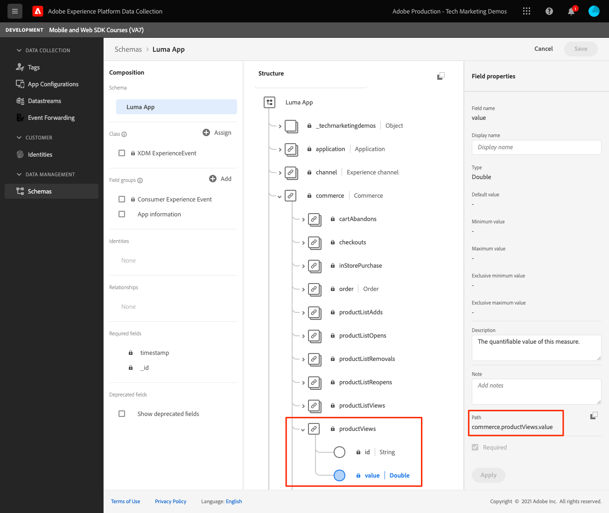

# 이벤트

모바일 앱에서 이벤트를 추적하는 방법을 알아봅니다.

Edge Network 확장은 Experience Events를 Platform Edge Network에 전송하는 API를 제공합니다. 경험 이벤트는 XDM ExperienceEvent 스키마 정의를 따르는 데이터가 포함된 객체입니다. 보다 간단하게 모바일 앱에서 사람들이 하는 작업을 캡처합니다. Platform Edge Network에서 데이터를 수신하면 Adobe Analytics 및 Experience Platform과 같은 데이터 스트림에 구성된 애플리케이션 및 서비스에 데이터를 전달할 수 있습니다. 추가 정보 [경험 이벤트](https://aep-sdks.gitbook.io/docs/getting-started/initialize-the-sdk) 를 참조하십시오.

## 전제 조건

* 필요한 SDK로 PodFile을 업데이트했습니다.
* AppDelegate에 등록된 확장입니다.
* 개발 AppId를 사용하도록 MobileCore를 구성했습니다.
* 가져온 SDK
* 위의 변경 사항으로 앱을 빌드하고 실행했습니다.

## 학습 목표

이 단원에서는 다음 작업을 수행합니다.

* 스키마를 기반으로 XDM 데이터를 구성하는 방법을 이해합니다.
* 표준 필드 그룹을 기반으로 XDM 이벤트를 전송합니다.
* 사용자 지정 필드 그룹을 기반으로 XDM 이벤트를 전송합니다.
* XDM 구매 이벤트를 보냅니다.
* 보증으로 검증.

## 경험 이벤트 구성

Adobe Experience Platform Edge 확장은 이전에 정의한 XDM 스키마를 따르는 이벤트를 Adobe Experience Platform Edge Network에 보낼 수 있습니다.

이 과정은 다음과 같습니다.

1. 추적하려는 모바일 앱 상호 작용을 식별합니다.

1. 스키마를 검토하고 적절한 이벤트를 식별합니다.

1. 스키마를 검토하고 이벤트를 설명하는 데 사용해야 하는 추가 필드를 식별합니다.

1. 데이터 개체를 구성하고 채웁니다.

1. 이벤트 만들기 및 보내기.

1. 유효성 검사.

몇 가지 예를 살펴보겠습니다.

### 예 #1 - 표준 필드 그룹

샘플 앱에서 구현하지 않고 다음 예를 검토하십시오.

1. 스키마에서 수집하려는 이벤트를 식별합니다. 이 예에서는 제품 보기를 추적하고 있습니다.
   

1. 개체 구성을 시작합니다.

   ```swift
   var xdmData: [String: Any] = [
       "eventType": "commerce.productViews",
       "commerce": [
           "productViews": [
           "value": 1
           ]
       ]
   ]
   ```

   * eventType: 발생한 이벤트에 대해 설명하고 [알려진 값](https://github.com/adobe/xdm/blob/master/docs/reference/classes/experienceevent.schema.md#xdmeventtype-known-values) 가능한 경우
   * commerce.productViews.value: 이벤트의 숫자 값을 제공합니다. 부울(또는 Adobe Analytics의 &quot;카운터&quot;)인 경우 값은 항상 1이 됩니다. 숫자 또는 통화 이벤트인 경우 값은 1보다 클 수 있습니다.

1. 스키마에서 이벤트와 관련된 추가 데이터를 식별합니다. 이 예제에서 다음을 포함합니다 `productListItems` 전자 상거래 관련 이벤트에 사용되는 표준 필드 세트입니다.
   
   * 주의 사항 `productListItems` 는 여러 제품을 제공할 수 있는 배열입니다.

1. xdmData 개체를 확장하여 보조 데이터를 포함합니다.

   ```swift
   var xdmData: [String: Any] = [
       "eventType": "commerce.productViews",
           "commerce": [
           "productViews": [
               "value": 1
           ]
       ],
       "productListItems": [
           [
               "name":  productName,
               "SKU": sku,
               "priceTotal": priceString,
               "quantity": 1
           ]
       ]
   ]
   ```

1. 데이터 구조를 사용하여 `ExperienceEvent`:

   ```swift
   let productViewEvent = ExperienceEvent(xdm: xdmData)
   ```

1. 이벤트 및 데이터를 Platform Edge Network에 보냅니다.

   ```swift
   Edge.sendEvent(experienceEvent: productViewEvent)
   ```

### 예 #2 - 사용자 지정 필드 그룹

샘플 앱에서 구현하지 않고 다음 예를 검토하십시오.

1. 스키마에서 수집하려는 이벤트를 식별합니다. 이 예에서 앱 작업 이벤트 및 이름으로 구성된 &quot;앱 상호 작용&quot;을 추적합니다.
   

1. 개체 구성을 시작합니다.

   >[!NOTE]
   >
   >  표준 필드 그룹은 항상 개체 루트에서 시작됩니다.
   >
   >  사용자 지정 필드 그룹은 항상 이 예제의 Experience Cloud 조직 &quot;_techmarketingdemos&quot;에 고유한 개체 아래에 시작됩니다.

   ```swift
   var xdmData: [String: Any] = [
   "_techmarketingdemos": [
       "appInformation": [
           "appInteraction": [
               "name": actionName,
               "appAction": [
                   "value": 1
                   ]
               ]
           ]
       ]
   ]
   ```

   아니면...

   ```swift
   var xdmData: [String: Any] = [:]
   xdmData["_techmarketingdemos"] = [
       "appInformation": [
           "appInteraction": [
               "name": actionName,
               "appAction": [
                   "value": 1
               ]
           ]
       ]
   ]
   ```

1. 데이터 구조를 사용하여 `ExperienceEvent`.

   ```swift
   let appInteractionEvent = ExperienceEvent(xdm: xdmData)
   ```

1. 이벤트 및 데이터를 Platform Edge Network에 보냅니다.

   ```swift
   Edge.sendEvent(experienceEvent: appInteractionEvent)
   ```

### Luma 앱에 화면 보기 추적 추가

위의 예에서는 XDM 데이터 개체를 구성할 때 사고 프로세스를 설명했으면 합니다. 다음으로 Luma 앱에서 화면 보기 추적을 추가합니다.

1. 다음으로 이동 `Home.swift`.
1. 다음 코드를 `viewDidAppear(...)`.

   ```swift
           let stateName = "luma: content: ios: us: en: home"
           var xdmData: [String: Any] = [:]
           //Page View
           xdmData["_techmarketingdemos"] = [
               "appInformation": [
                   "appStateDetails": [
                       "screenType": "App",
                       "screenName": stateName,
                       "screenView": [
                           "value": 1
                       ]
                   ]
               ]
           ]
           let experienceEvent = ExperienceEvent(xdm: xdmData)
           Edge.sendEvent(experienceEvent: experienceEvent)
   ```

1. 앱의 각 화면에 대해 반복합니다. `stateName` 할 수 있습니다.


### 유효성 검사

1. 를 검토합니다. [설정 지침](assurance.md) 섹션에서 시뮬레이터나 장치를 Assurance에 연결합니다.
1. 작업을 수행하고 다음 `hitReceived` 이벤트 `com.adobe.edge.konductor` 공급업체
1. 이벤트를 선택하고 의 XDM 데이터를 검토하십시오 `messages` 개체.
   

### 예 #3 - purchase

이 예에서 사용자가 다음 구매를 성공적으로 수행했다고 가정합니다.

* 제품 #1 - 요가 매트.
   * $49.99 x1
   * SKU: 5829년
* 제품 #2 - 물병.
   * 10.00달러 x3
   * SKU: 9841년
* 주문 총액: US$79.99
* 고유 주문 Id: 298234720
* 결제 유형: 비자 신용 카드
* 고유 지급 거래 Id: 847361

#### 스키마

사용할 관련 스키마 필드는 다음과 같습니다.

* eventType: &quot;commerce.purchases&quot;
* commerce.purchases
* commerce.order
* productsListItems
* _techmarketingdemos.appStateDetails(사용자 지정)

>[!TIP]
>
>사용자 지정 필드 그룹은 항상 Experience Cloud 조직 식별자 아래에 배치됩니다.
>
>&quot;_techmarketingdemos&quot;가 조직의 고유 값으로 대체됩니다.


#### 코드

다음은 앱에서 XDM 개체를 구성하고 전송하는 방법입니다.

```swift
let stateName = "luma: content: ios: us: en: orderconfirmation"
let currencyCode = "USD"
let orderTotal = "79.99"
let paymentType = "Visa Credit Card"
let orderId = "298234720"
let paymentTransactionId = "847361"
var xdmData: [String: Any] = [
  "eventType": "commerce.purchases",
  "commerce": [
    "purchases": [
      "value": 1
    ],
    "order": [
      "currencyCode": currencyCode,
      "priceTotal": orderTotal,
      "purchaseID": orderId,
      "purchaseOrderNumber": orderId,
      "payments": [ //Assuming only 1 payment type is used
        [
          "currencyCode": currencyCode,
          "paymentAmount": orderTotal,
          "paymentType": paymentType,
          "transactionID": paymentTransactionId
        ]
      ]
    ]
  ],
  "productListItems": [
      [
          "name":  "Yoga Mat",
          "SKU": "5829",
          "priceTotal": "49.99",
          "quantity": 1
      ],
      [
        "name":  "Water Bottle",
        "SKU": "9841",
        "priceTotal": "30.00",
        "quantity": 3
      ]
  ]
]

//Custom field group
xdmData["_techmarketingdemos"] = [
  "appInformation": [
    "appStateDetails": [
      "screenType": "App",
      "screenName": stateName,
      "screenView": [
        "value": 1
      ]
    ]
  ]
]
let experienceEvent = ExperienceEvent(xdm: xdmData)
Edge.sendEvent(experienceEvent: experienceEvent)
```

>[!NOTE]
>
>명확성을 위해 모든 값이 하드코딩됩니다. 실제 환경에서는 값이 동적으로 채워집니다.


### Luma 앱에서 구현

Luma 샘플 앱에 데이터 수집을 추가하기 시작하려면 모든 도구가 있어야 합니다. 다음은 따를 수 있는 가상의 추적 요구 사항 목록입니다.

* 각 화면 보기를 추적합니다.
   * 스키마 필드: screenType, screenName, screenView
* 비상거래 작업을 추적합니다.
   * 스키마 필드: appInteraction.name, appAction
* 상거래 작업:
   * 제품 페이지: productViews
   * 장바구니에 추가: productListAdds
   * 장바구니에서 제거: productListRemoval
   * 체크 아웃 시작: 체크아웃
   * 장바구니 보기: productListViews
   * Wishlist에 추가: saveForLaters
   * 구매: 구매, 주문

>[!TIP]
>
>를 검토합니다. [완전히 구현된 앱](https://github.com/Adobe-Marketing-Cloud/Luma-iOS-Mobile-App) 추가 예

### 유효성 검사

1. 를 검토합니다. [설정 지침](assurance.md) 섹션에서 시뮬레이터나 장치를 Assurance에 연결합니다.

1. 작업을 수행하고 다음 `hitReceived` 이벤트 `com.adobe.edge.konductor` 공급업체

1. 이벤트를 선택하고 의 XDM 데이터를 검토하십시오 `messages` 개체.
   

## Analytics 및 Platform으로 이벤트 보내기

이제 이벤트를 수집하여 Platform Edge Network로 전송했으므로, 이러한 이벤트는 사용자 [데이터 스트림](create-datastream.md). 나중에 이 데이터를 [Adobe Analytics](analytics.md) 및 [Adobe Experience Platform](platform.md).

다음: **[WebViews](web-views.md)**

>[!NOTE]
>
>Adobe Experience Platform Mobile SDK에 대한 학습에 시간을 내주셔서 감사합니다. 질문이 있거나 일반 피드백을 공유하거나 향후 컨텐츠에 대한 제안 사항이 있는 경우 해당 정보를 공유하십시오 [Experience League 커뮤니티 토론 게시물](https://experienceleaguecommunities.adobe.com/t5/adobe-experience-platform-launch/tutorial-discussion-implement-adobe-experience-cloud-in-mobile/td-p/443796)