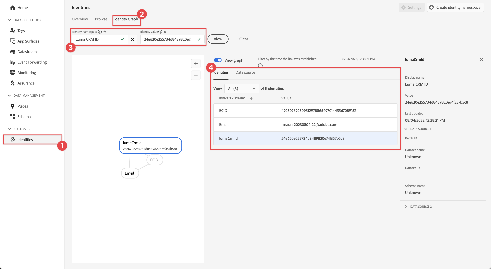

# ID 데이터 수집

모바일 앱에서 ID 데이터를 수집하는 방법에 대해 알아봅니다.

Adobe Experience Platform Identity Service를 사용하면 디바이스와 시스템 간에 ID를 연결하여 고객과 고객의 행동을 더 잘 볼 수 있으므로 효과적인 개인 디지털 경험을 실시간으로 제공할 수 있습니다. ID 필드와 네임스페이스는 서로 다른 데이터 소스를 함께 연결하여 360도 실시간 고객 프로필을 만드는 접착제입니다.

설명서에서 [ID 확장](https://developer.adobe.com/client-sdks/documentation/identity-for-edge-network/) 및 [ID 서비스](https://experienceleague.adobe.com/docs/experience-platform/identity/home.html?lang=ko-KR)에 대해 자세히 알아보세요.

## 전제 조건

* SDK가 설치 및 구성된 앱을 빌드하고 실행했습니다.

## 학습 목표

이 단원에서는 다음 작업을 수행합니다.

* 사용자 지정 ID 네임스페이스를 설정합니다.
* ID를 업데이트합니다.
* ID 그래프의 유효성을 검사합니다.
* ECID 및 기타 ID를 가져옵니다.


## 사용자 정의 ID 네임스페이스 설정

ID 네임스페이스는 [ID 서비스](https://experienceleague.adobe.com/docs/experience-platform/identity/home.html?lang=ko-KR)의 구성 요소로서 ID가 관련되는 컨텍스트의 지표 역할을 합니다. 예를 들어 `name@email.com`의 값을 전자 메일 주소로 또는 `443522`의 값을 숫자 CRM ID로 구분합니다.

>[!NOTE]
>
>Mobile SDK는 앱이 설치되면 자체 네임스페이스에 ECID(Experience Cloud ID)라는 고유 ID를 생성합니다. 이 ECID는 모바일 장치의 영구 메모리에 저장되고 모든 히트와 함께 전송됩니다. 사용자가 앱을 제거할 때 또는 Mobile SDK 전역 개인 정보 상태를 옵트아웃으로 설정할 때 ECID가 제거됩니다. 샘플 Luma 앱에서는 앱을 제거하고 다시 설치하여 고유한 ECID로 새 프로필을 만들어야 합니다.


새 ID 네임스페이스를 만들려면 다음 작업을 수행하십시오.

1. 데이터 수집 인터페이스의 왼쪽 레일 탐색에서 **[!UICONTROL ID]**&#x200B;를 선택합니다.
1. **[!UICONTROL 신원 네임스페이스 만들기]**&#x200B;를 선택합니다.
1. **[!UICONTROL 표시 이름]**/`Luma CRM ID`과(와) **[!UICONTROL ID 기호]** 값 `lumaCRMId`을(를) 제공하십시오.
1. **[!UICONTROL 장치 간 ID]**&#x200B;을(를) 선택하십시오.
1. **[!UICONTROL 만들기]**&#x200B;를 선택합니다.

   


## ID 업데이트

사용자가 앱에 로그인할 때 표준 ID(이메일)와 사용자 지정 ID(Luma CRM ID)를 모두 업데이트하려고 합니다.

1. Xcode 프로젝트 탐색기에서 **[!DNL Luma]** > **[!DNL Luma]** > **[!DNL Utils]** > **[!UICONTROL MobileSDK]**(으)로 이동하여 `func updateIdentities(emailAddress: String, crmId: String)` 함수 구현을 찾습니다. 다음 코드를 함수에 추가합니다.

   ```swift
   // Set up identity map, add identities to map and update identities
   let identityMap: IdentityMap = IdentityMap()
   
   let emailIdentity = IdentityItem(id: emailAddress, authenticatedState: AuthenticatedState.authenticated)
   let crmIdentity = IdentityItem(id: crmId, authenticatedState: AuthenticatedState.authenticated)
   identityMap.add(item:emailIdentity, withNamespace: "Email")
   identityMap.add(item: crmIdentity, withNamespace: "lumaCRMId")
   
   Identity.updateIdentities(with: identityMap)
   ```

   이 코드:

   1. 빈 `IdentityMap` 개체를 만듭니다.

      ```swift
      let identityMap: IdentityMap = IdentityMap()
      ```

   1. 전자 메일 및 CRM ID에 대해 `IdentityItem` 개체를 설정합니다.

      ```swift
      let emailIdentity = IdentityItem(id: emailAddress, authenticatedState: AuthenticatedState.authenticated)
      let crmIdentity = IdentityItem(id: crmId, authenticatedState: AuthenticatedState.authenticated)
      ```

   1. 이 `IdentityItem` 개체를 `IdentityMap` 개체에 추가합니다.

      ```swift
      identityMap.add(item:emailIdentity, withNamespace: "Email")
      identityMap.add(item: crmIdentity, withNamespace: "lumaCRMId")
      ```

   1. `Identity.updateIdentities` API 호출의 일부로 `IdentityItem` 개체를 Edge Network에게 보냅니다.

      ```swift
      Identity.updateIdentities(with: identityMap) 
      ```

1. Xcode 프로젝트 탐색기에서 **[!DNL Luma]** > **[!DNL Luma]** > **[!DNL Views]** > **[!DNL General]** > **[!UICONTROL LoginSheet]**(으)로 이동하여 **[!UICONTROL 로그인]** 단추를 선택할 때 실행할 코드를 찾습니다. 다음 코드를 추가합니다.

   ```swift
   // Update identities
   MobileSDK.shared.updateIdentities(emailAddress: currentEmailId, crmId: currentCRMId)                             
   ```


>[!NOTE]
>
>한 번의 `updateIdentities` 호출로 여러 ID를 보낼 수 있습니다. 이전에 전송된 ID를 수정할 수도 있습니다.


## ID 제거

[`Identity.removeIdentity`](https://developer.adobe.com/client-sdks/documentation/identity-for-edge-network/api-reference/#removeidentity) API를 사용하여 저장된 클라이언트측 ID 맵에서 ID를 제거할 수 있습니다. ID 확장은 Edge Network에 대한 식별자 전송을 중지합니다. 이 API를 사용해도 서버측 ID 그래프에서 식별자가 제거되지는 않습니다. ID 그래프에 대한 자세한 내용은 [ID 그래프 보기](https://experienceleague.adobe.com/docs/platform-learn/tutorials/identities/view-identity-graphs.html?lang=en)를 참조하십시오.

1. Xcode 프로젝트 탐색기에서 **[!DNL Luma]** > **[!DNL Luma]** > **[!DNL Utils]** > **[!UICONTROL MobileSDK]**(으)로 이동하여 `func removeIdentities(emailAddress: String, crmId: String)` 함수에 다음 코드를 추가합니다.

   ```swift
   // Remove identities and reset email and CRM Id to their defaults
   Identity.removeIdentity(item: IdentityItem(id: emailAddress), withNamespace: "Email")
   Identity.removeIdentity(item: IdentityItem(id: crmId), withNamespace: "lumaCRMId")
   currentEmailId = "testUser@gmail.com"
   currentCRMId = "112ca06ed53d3db37e4cea49cc45b71e"
   ```

1. Xcode 프로젝트 탐색기에서 **[!DNL Luma]** > **[!DNL Luma]** > **[!DNL Views]** > **[!DNL General]** > **[!UICONTROL LoginSheet]**(으)로 이동하여 **[!UICONTROL 로그아웃]** 단추를 선택할 때 실행할 코드를 찾습니다. 다음 코드를 추가합니다.

   ```swift
   // Remove identities
   MobileSDK.shared.removeIdentities(emailAddress: currentEmailId, crmId: currentCRMId)                  
   ```


## Assurance를 사용한 유효성 검사

1. [설치 지침](assurance.md#connecting-to-a-session) 섹션을 검토하여 시뮬레이터 또는 장치를 Assurance에 연결하십시오.
1. Luma 앱에서
   1. **[!UICONTROL 홈]** 탭을 선택하고 확인 아이콘을 왼쪽으로 이동합니다.
   1. 다음 항목 선택 오른쪽 상단의  아이콘

      

   1. 이메일 주소와 CRM ID를 제공하거나
   1. 선택 : **[!UICONTROL 전자 메일]** 및 **[!UICONTROL CRM ID]**&#x200B;을 임의로 생성합니다.
   1. **[!UICONTROL 로그인]**&#x200B;을 선택합니다.

      


1. Assurance 웹 인터페이스에서 **[!UICONTROL com.adobe.grifcon.mobile]** 공급업체의 **[!UICONTROL Edge ID 업데이트 ID]** 이벤트를 확인하십시오.
1. 이벤트를 선택하고 **[!UICONTROL ACPExtensionEventData]** 개체에서 데이터를 검토합니다. 업데이트한 ID가 표시됩니다.
   

## ID 그래프로 유효성 검사

[Experience Platform 단원](platform.md)의 단계를 완료하면 플랫폼 ID 그래프 뷰어에서 ID 캡처를 확인할 수 있습니다.

1. 데이터 수집 UI에서 **[!UICONTROL ID]**&#x200B;을(를) 선택합니다.
1. 상단 표시줄에서 **[!UICONTROL ID 그래프]**&#x200B;를 선택합니다.
1. `Luma CRM ID`을(를) **[!UICONTROL ID 네임스페이스]**(으)로 입력하고 CRM ID(예: `24e620e255734d8489820e74f357b5c8`)를 **[!UICONTROL ID 값]**(으)로 입력하십시오.
1. **[!UICONTROL ID]**&#x200B;이(가) 나열되어 있습니다.

   

>[!INFO]
>
>앱에는 ECID를 재설정하는 코드가 없습니다. 즉, 응용 프로그램을 제거하고 다시 설치하는 경우에만 ECID를 재설정하고 새 ECID로 새 프로필을 효과적으로 만들 수 있습니다. 식별자 재설정을 구현하려면 [`Identity.resetIdentities`](https://developer.adobe.com/client-sdks/documentation/mobile-core/identity/api-reference/#resetidentities) 및 [`MobileCore.resetIdentities`](https://developer.adobe.com/client-sdks/documentation/mobile-core/api-reference/#resetidentities) API 호출을 참조하십시오. 그러나 푸시 알림 식별자를 사용할 때는([푸시 알림 보내기](journey-optimizer-push.md) 참조) 해당 식별자가 디바이스에서 다른 &#39;고정&#39; 프로필 식별자가 됩니다.


>[!SUCCESS]
>
>이제 Adobe Experience Platform을 사용하여 Edge Network 및 (설정 시) ID를 업데이트하도록 앱을 설정했습니다.
>
>Adobe Experience Platform Mobile SDK에 대해 학습하는 데 시간을 투자해 주셔서 감사합니다. 질문이 있거나 일반적인 피드백을 공유하고 싶거나 향후 콘텐츠에 대한 제안이 있는 경우 이 [Experience League 커뮤니티 토론 게시물](https://experienceleaguecommunities.adobe.com/t5/adobe-experience-platform-data/tutorial-discussion-implement-adobe-experience-cloud-in-mobile/td-p/443796)에서 공유하십시오.

다음: **[프로필 데이터 수집](profile.md)**
