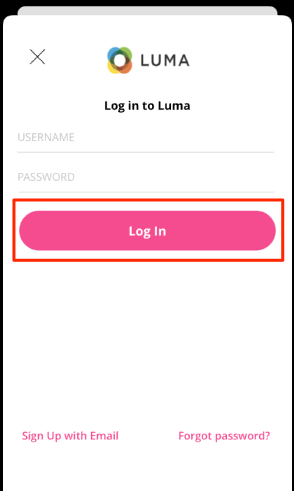

# 신원

모바일 앱에서 ID 데이터를 수집하는 방법에 대해 알아봅니다.

Adobe Experience Platform Identity Service를 사용하면 디바이스와 시스템 간에 ID를 연결하여 고객과 고객의 행동을 더 잘 볼 수 있으므로 효과적인 개인 디지털 경험을 실시간으로 제공할 수 있습니다. ID 필드와 네임스페이스는 서로 다른 데이터 소스를 함께 연결하여 360도 실시간 고객 프로필을 만드는 접착제입니다.

에 대해 자세히 알아보기 [ID 확장](https://developer.adobe.com/client-sdks/documentation/identity-for-edge-network/) 및 [id 서비스](https://experienceleague.adobe.com/docs/experience-platform/identity/home.html?lang=ko) 설명서에서 참조하십시오.

## 사전 요구 사항

* SDK가 설치 및 구성된 앱을 빌드하고 실행했습니다.

## 학습 목표

이 단원에서는 다음 작업을 수행합니다.

* 표준 ID를 업데이트합니다.
* 사용자 지정 ID를 설정합니다.
* 사용자 지정 ID를 업데이트합니다.
* ID 그래프의 유효성을 검사합니다.
* ECID 및 기타 ID를 가져옵니다.

## 표준 ID 업데이트

로그인할 때 사용자의 ID 맵을 업데이트하여 시작합니다.

1. 다음으로 이동 `Login.swift` luma 앱을 다운로드하여 호출된 함수를 찾은 경우 `loginButt`.

   Luma 샘플 앱에는 사용자 이름 또는 암호 유효성 검사가 없습니다. 버튼을 눌러 &quot;로그인&quot;하면 됩니다.

1. 만들기 `IdentityMap` 및 `IdentityItem`.

   ```swift
   let identityMap: IdentityMap = IdentityMap()
   let emailIdentity = IdentityItem(id: emailAddress, authenticatedState: AuthenticatedState.authenticated)
   ```

1. 추가 `IdentityItem` (으)로 `IdentityMap`

   ```swift
   identityMap.add(item:emailIdentity, withNamespace: "Email")
   ```

1. 호출 `updateIdentities` Platform Edge Network로 데이터를 전송합니다.

   ```swift
   Identity.updateIdentities(with: identityMap)
   ```

>[!NOTE]
>
>하나의 updateIdentities 호출에서 여러 ID를 보낼 수 있습니다. 이전에 전송된 ID를 수정할 수도 있습니다.


## 사용자 정의 ID 네임스페이스 설정

ID 네임스페이스는 의 구성 요소입니다. [ID 서비스](https://experienceleague.adobe.com/docs/experience-platform/identity/home.html?lang=ko-KR) id가 연관되는 컨텍스트의 지표 역할을 합니다. 예를 들어 이메일 주소로 &quot;name@email.com&quot; 값을 구별하거나 숫자 CRM ID로 &quot;443522&quot;값을 구별합니다.

1. 데이터 수집 인터페이스에서 다음을 선택합니다. **[!UICONTROL ID]** 왼쪽 레일 탐색에서
1. **[!UICONTROL 신원 네임스페이스 만들기]**&#x200B;를 선택합니다.
1. 다음을 제공합니다. **[!UICONTROL 표시 이름]** / `Luma CRM ID` 및 **[!UICONTROL ID 심볼]** 값 `lumaCrmId`.
1. 선택 **[!UICONTROL 교차 장치 ID]**.
1. **[!UICONTROL 만들기]**&#x200B;를 선택합니다.


## 사용자 정의 ID 업데이트

사용자 정의 ID를 만들었으므로 이제 를 수정하여 수집을 시작하십시오. `updateIdentities` 이전 단계에서 추가한 코드. IdentityItem을 만들어 IdentityMap에 추가하기만 하면 됩니다. 전체 코드 블록의 형태는 다음과 같습니다.

```swift
//Hardcoded identity values
let emailAddress = "testuser@gmail.com"
let crmId = "112ca06ed53d3db37e4cea49cc45b71e"

// Create identity map
let identityMap: IdentityMap = IdentityMap()
// Add email (standard)
let emailIdentity = IdentityItem(id: emailAddress, authenticatedState: AuthenticatedState.authenticated)
identityMap.add(item:emailIdentity, withNamespace: "Email")
// Add lumaCrmId (custom)
let crmIdentity = IdentityItem(id: crmId, authenticatedState: AuthenticatedState.authenticated)
identityMap.add(item: crmIdentity, withNamespace: "lumaCrmId")
// Update
Identity.updateIdentities(with: identityMap)
```

## ID 제거

다음을 사용할 수 있습니다. `removeIdentity` 저장된 클라이언트측 IdentityMap에서 id를 제거합니다. ID 확장은 Edge 네트워크에 대한 식별자 전송을 중지합니다. 이 API를 사용해도 서버측 사용자 프로필 그래프 또는 ID 그래프에서 식별자가 제거되지 않습니다.

다음 추가 `removeIdentity` 로그아웃 단추 코드 클릭 `Account.swift`.

```swift
// Logout
let logout = UIAlertAction(title: "Logout", style: .destructive, handler: { (action) -> Void in
    isLoggedIn = false;
    ////Hardcoded identity values
    let emailAddress = "testuser@gmail.com"
    let crmId = "112ca06ed53d3db37e4cea49cc45b71e"
    // Adobe Experience Platform - Remove Identity
    Identity.removeIdentity(item: IdentityItem(id: emailAddress), withNamespace: "Email")
    Identity.removeIdentity(item: IdentityItem(id: crmId), withNamespace: "lumaCrmId")
})
```

>[!NOTE]
>위의 예에서, `crmId` 및 `emailAddress` 는 하드코딩되어 있지만 실제 앱에서는 값이 동적입니다.

## Assurance를 통해 유효성 검사

1. 리뷰 [설치 지침](assurance.md) 시뮬레이터 또는 장치를 Assurance에 연결하고 연결합니다.
1. 앱에서 오른쪽 하단의 계정 아이콘을 선택합니다.

   
1. 다음 항목 선택 **로그인** 단추를 클릭합니다.
1. 사용자 이름과 암호를 입력할 수 있는 옵션이 제공됩니다. 둘 다 선택 사항이며 간단하게 선택할 수 있습니다. **로그인**.

   
1. 에 대한 Assurance 웹 UI를 살펴봅니다. `Edge Identity Update Identities` 다음에서 이벤트 발생 `com.adobe.griffon.mobile` 공급업체.
1. 이벤트를 선택하고 `ACPExtensionEventData` 개체. 업데이트한 ID가 표시됩니다.
   

## ID 그래프로 유효성 검사

의 단계를 완료하면 [Experience Platform 레슨](platform.md)또한 플랫폼 ID 그래프 뷰어에서 ID 캡처를 확인할 수 있습니다.


다음: **[프로필](profile.md)**

>[!NOTE]
>
>Adobe Experience Platform Mobile SDK에 대해 학습하는 데 시간을 투자해 주셔서 감사합니다. 질문이 있거나, 일반적인 피드백을 공유하거나, 향후 콘텐츠에 대한 제안이 있는 경우 이에 대해 공유하십시오. [Experience League 커뮤니티 토론 게시물](https://experienceleaguecommunities.adobe.com/t5/adobe-experience-platform-launch/tutorial-discussion-implement-adobe-experience-cloud-in-mobile/td-p/443796)