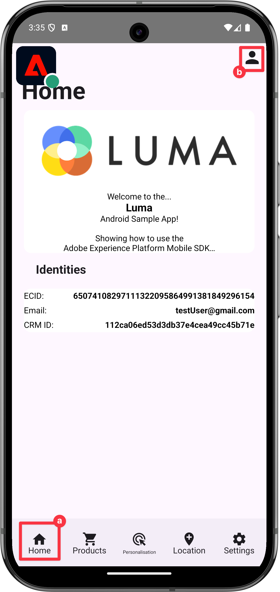

# ID 데이터 수집

모바일 앱에서 ID 데이터를 수집하는 방법에 대해 알아봅니다.

Adobe Experience Platform Identity Service를 사용하면 고객 및 고객 행동을 더 잘 볼 수 있습니다. 이 서비스를 통해 디바이스와 시스템 간에 ID를 연결하여 효과적인 개인 디지털 경험을 실시간으로 전달할 수 있습니다. ID 필드와 네임스페이스는 서로 다른 데이터 소스를 함께 연결하여 360도 실시간 고객 프로필을 만드는 접착제입니다.

설명서에서 [ID 확장](https://developer.adobe.com/client-sdks/documentation/identity-for-edge-network/) 및 [ID 서비스](https://experienceleague.adobe.com/ko/docs/experience-platform/identity/home)에 대해 자세히 알아보세요.

## 전제 조건

* SDK가 설치 및 구성된 앱을 빌드하고 실행했습니다.

## 학습 목표

이 단원에서는 다음 작업을 수행합니다.

* 사용자 지정 ID 네임스페이스를 설정합니다.
* ID를 업데이트합니다.
* ID 그래프의 유효성을 검사합니다.
* ECID 및 기타 ID를 가져옵니다.


## 사용자 정의 ID 네임스페이스 설정

ID 네임스페이스는 [ID 서비스](https://experienceleague.adobe.com/ko/docs/experience-platform/identity/home)의 구성 요소로서 ID가 관련되는 컨텍스트의 지표 역할을 합니다. 예를 들어 `name@email.com`의 값을 전자 메일 주소로 또는 `443522`의 값을 숫자 CRM ID로 구분합니다.

>[!NOTE]
>
>Mobile SDK은 앱이 설치되면 자체 네임스페이스에 ECID(Experience Cloud ID)라는 고유한 ID를 생성합니다. 이 ECID는 모바일 장치의 영구 메모리에 저장되고 모든 히트와 함께 전송됩니다. 사용자가 앱을 설치하거나 Mobile SDK 전역 개인 정보 상태를 옵트아웃으로 설정하면 ECID가 제거됩니다. 샘플 Luma 앱에서는 앱을 제거하고 다시 설치하여 고유한 ECID로 새 프로필을 만들어야 합니다.


새 ID 네임스페이스를 만들려면 다음 작업을 수행하십시오.

1. 데이터 수집 인터페이스의 왼쪽 레일 탐색에서 **[!UICONTROL ID]**&#x200B;를 선택합니다.
1. **[!UICONTROL ID 네임스페이스 만들기]**&#x200B;를 선택합니다.
1. **[!UICONTROL 표시 이름]**/`Luma CRM ID`과(와) **[!UICONTROL ID 기호]** 값 `lumaCRMId`을(를) 제공하십시오.
1. **[!UICONTROL 장치 간 ID]**&#x200B;을(를) 선택하십시오.
1. **[!UICONTROL 만들기]**&#x200B;를 선택합니다.

   {zoomable="yes"}


## ID 업데이트

사용자가 앱에 로그인할 때 표준 ID(이메일)와 사용자 지정 ID(Luma CRM ID)를 모두 업데이트하려고 합니다.

>[!BEGINTABS]

>[!TAB iOS]

1. Xcode 프로젝트 탐색기에서 **[!DNL Luma]** > **[!DNL Luma]** > **[!DNL Utils]** > **[!UICONTROL MobileSDK]**(으)로 이동하여 `func updateIdentities(emailAddress: String, crmId: String)` 함수 구현을 찾습니다. 다음 코드를 함수에 추가합니다.

   ```swift
   // Set up identity map, add identities to map and update identities
   let identityMap: IdentityMap = IdentityMap()
   
   let emailIdentity = IdentityItem(id: emailAddress, authenticatedState: AuthenticatedState.authenticated)
   let crmIdentity = IdentityItem(id: crmId, authenticatedState: AuthenticatedState.authenticated)
   identityMap.add(item:emailIdentity, withNamespace: "Email")
   identityMap.add(item: crmIdentity, withNamespace: "lumaCRMId")
   
   Identity.updateIdentities(with: identityMap)
   ```

   이 코드:

   1. 빈 `IdentityMap` 개체를 만듭니다.

      ```swift
      let identityMap: IdentityMap = IdentityMap()
      ```

   1. 전자 메일 및 CRM ID에 대해 `IdentityItem` 개체를 설정합니다.

      ```swift
      let emailIdentity = IdentityItem(id: emailAddress, authenticatedState: AuthenticatedState.authenticated)
      let crmIdentity = IdentityItem(id: crmId, authenticatedState: AuthenticatedState.authenticated)
      ```

   1. 이 `IdentityItem` 개체를 `IdentityMap` 개체에 추가합니다.

      ```swift
      identityMap.add(item:emailIdentity, withNamespace: "Email")
      identityMap.add(item: crmIdentity, withNamespace: "lumaCRMId")
      ```

   1. `IdentityItem` API 호출의 일부로 `Identity.updateIdentities` 개체를 Edge Network으로 보냅니다.

      ```swift
      Identity.updateIdentities(with: identityMap) 
      ```

1. Xcode 프로젝트 탐색기에서 **[!DNL Luma]** > **[!DNL Luma]** > **[!DNL Views]** > **[!DNL General]** > **[!UICONTROL LoginSheet]**(으)로 이동하여 **[!UICONTROL 로그인]** 단추를 선택할 때 실행할 코드를 찾습니다. 다음 코드를 추가합니다.

   ```swift
   // Update identities
   MobileSDK.shared.updateIdentities(emailAddress: currentEmailId, crmId: currentCRMId)                             
   ```


>[!TAB Android]

1. Android Studio 탐색기에서 **[!UICONTROL Android]**  > **[!DNL app]** > **[!DNL kotlin+java]** > **[!DNL com.adobe.luma.tutorial.android]** > **[!UICONTROL 모델]** > **[!UICONTROL MobileSDK]**(으)로 이동하여 `fun updateIdentities(emailAddress: String, crmId: String) ` 함수 구현을 찾으십시오. 다음 코드를 함수에 추가합니다.

   ```kotlin
   // Set up identity map, add identities to map and update identities
   val identityMap = IdentityMap()
   
   val emailIdentity = IdentityItem(emailAddress, AuthenticatedState.AUTHENTICATED, true)
   val crmIdentity = IdentityItem(crmId, AuthenticatedState.AUTHENTICATED, true)
   identityMap.addItem(emailIdentity, "Email")
   identityMap.addItem(crmIdentity, "lumaCRMId")
   
   Identity.updateIdentities(identityMap)
   ```

   이 코드:

   1. 빈 `IdentityMap` 개체를 만듭니다.

      ```kotlin
      val identityMap = IdentityMap()
      ```

   1. 전자 메일 및 CRM ID에 대해 `IdentityItem` 개체를 설정합니다.

      ```kotlin
      val emailIdentity = IdentityItem(emailAddress, AuthenticatedState.AUTHENTICATED, true)
      val crmIdentity = IdentityItem(crmId, AuthenticatedState.AUTHENTICATED, true)
      ```

   1. 이 `IdentityItem` 개체를 `IdentityMap` 개체에 추가합니다.

      ```kotlin
      identityMap.addItem(emailIdentity, "Email")
      identityMap.addItem(crmIdentity, "lumaCRMId")
      ```

   1. `IdentityItem` API 호출의 일부로 `Identity.updateIdentities` 개체를 Edge Network으로 보냅니다.

      ```kotlin
      Identity.updateIdentities(identityMap)
      ```

1. Android Studio 탐색기에서 **[!UICONTROL Android]**  > **[!DNL app]** > **[!DNL kotlin+java]** > **[!DNL com.adobe.luma.tutorial.android]** > **[!UICONTROL 보기]** > **[!UICONTROL LoginSheet.kt]**(으)로 이동하여 **[!UICONTROL 로그인]** 단추를 선택할 때 실행할 코드를 찾습니다. 다음 코드를 추가합니다.

   ```kotlin
   // Update identities
   MobileSDK.shared.updateIdentities(
      MobileSDK.shared.currentEmailId.value,
      MobileSDK.shared.currentCRMId.value
   )                             
   ```


>[!ENDTABS]


>[!NOTE]
>
>한 번의 `updateIdentities` 호출로 여러 ID를 보낼 수 있습니다. 이전에 전송된 ID를 수정할 수도 있습니다.


## ID 제거

[`Identity.removeIdentity`](https://developer.adobe.com/client-sdks/documentation/identity-for-edge-network/api-reference/#removeidentity) API를 사용하여 저장된 클라이언트측 ID 맵에서 ID를 제거할 수 있습니다. ID 확장은 Edge Network에 대한 식별자 전송을 중지합니다. 이 API를 사용해도 서버측 ID 그래프에서 식별자가 제거되지는 않습니다. ID 그래프에 대한 자세한 내용은 [ID 그래프 보기](https://experienceleague.adobe.com/ko/docs/platform-learn/tutorials/identities/view-identity-graphs)를 참조하십시오.


>[!BEGINTABS]

>[!TAB iOS]

1. Xcode 프로젝트 탐색기에서 **[!DNL Luma]** > **[!DNL Luma]** > **[!DNL Utils]** > **[!UICONTROL MobileSDK]**(으)로 이동하여 `func removeIdentities(emailAddress: String, crmId: String)` 함수에 다음 코드를 추가합니다.

   ```swift
   // Remove identities and reset email and CRM Id to their defaults
   Identity.removeIdentity(item: IdentityItem(id: emailAddress), withNamespace: "Email")
   Identity.removeIdentity(item: IdentityItem(id: crmId), withNamespace: "lumaCRMId")
   currentEmailId = "testUser@gmail.com"
   currentCRMId = "b642b4217b34b1e8d3bd915fc65c4452"
   ```

1. Xcode 프로젝트 탐색기에서 **[!DNL Luma]** > **[!DNL Luma]** > **[!DNL Views]** > **[!DNL General]** > **[!UICONTROL LoginSheet]**(으)로 이동하여 **[!UICONTROL 로그아웃]** 단추를 선택할 때 실행할 코드를 찾습니다. 다음 코드를 추가합니다.

   ```swift
   // Remove identities
   MobileSDK.shared.removeIdentities(emailAddress: currentEmailId, crmId: currentCRMId)                  
   ```

>[!TAB Android]

1. Android Studio 탐색기에서 **[!UICONTROL Android]**  > **[!DNL app]** > **[!DNL kotlin+java]** > **[!DNL com.adobe.luma.tutorial.android]** > **[!UICONTROL 모델]** > **[!UICONTROL MobileSDK]**(으)로 이동하고 `fun removeIdentities(emailAddress: String, crmId: String)` 함수에 다음 코드를 추가합니다.

   ```kotlin
   // Remove identities and reset email and CRM Id to their defaults
   Identity.removeIdentity(IdentityItem(emailAddress), "Email")
   Identity.removeIdentity(IdentityItem(crmId), "lumaCRMId")
   currentEmailId.value = "testUser@gmail.com"
   currentCRMId.value = "112ca06ed53d3db37e4cea49cc45b71e"
   ```

1.Android Studio 탐색기에서 **[!DNL app]** > **[!DNL kotlin+java]** > **[!DNL com.adobe.luma.tutorial.android]** > **[!UICONTROL 보기]** > **[!UICONTROL LoginSheet.kt]**(으)로 이동하여 **[!UICONTROL 로그아웃]** 단추를 선택할 때 실행할 코드를 찾습니다. 다음 코드를 추가합니다.

```kotlin
// Remove identities
MobileSDK.shared.removeIdentities(
   MobileSDK.shared.currentEmailId.value,
   MobileSDK.shared.currentCRMId.value
)              
```


>[!ENDTABS]

## Assurance를 사용한 유효성 검사

1. [설치 지침](assurance.md#connecting-to-a-session) 섹션을 검토하여 시뮬레이터 또는 장치를 Assurance에 연결하십시오.
1. Luma 앱에서
   1. **[!UICONTROL 홈]** 탭을 선택하고 Assurance 아이콘을 왼쪽으로 이동합니다.
   1. 오른쪽 상단에서  아이콘을 선택합니다.

>[!BEGINTABS]

>[!TAB iOS]


>[!TAB Android]



>[!ENDTABS]

1. 이메일 주소와 CRM ID를 제공하거나
1. **[!UICONTROL A 선택 |]**(iOS) 또는 **[!UICONTROL 무작위 이메일 생성]**(Android)을 사용하여 **[!UICONTROL 이메일]** 및 **[!UICONTROL CRM ID]**&#x200B;을 임의로 생성합니다.
1. **[!UICONTROL 로그인]**&#x200B;을 선택합니다.

>[!BEGINTABS]

>[!TAB iOS]


>[!TAB Android]


>[!ENDTABS]

Assurance으로 돌아가기:

1. Assurance 웹 인터페이스에서 **[!UICONTROL com.adobe.grifcon.mobile]** 공급업체의 **[!UICONTROL Edge ID 업데이트 ID]** 이벤트를 검사합니다.
1. 이벤트를 선택하고 **[!UICONTROL ACPExtensionEventData]** 개체에서 데이터를 검토합니다. 업데이트한 ID가 표시됩니다.
   {zoomable="yes"}

## ID 그래프로 유효성 검사

[Experience Platform 단원](platform.md)의 단계를 완료하면 Experience Platform ID 그래프 뷰어에서 ID 캡처를 확인할 수 있습니다.

1. 데이터 수집 UI에서 **[!UICONTROL ID]**&#x200B;을(를) 선택합니다.
1. 상단 표시줄에서 **[!UICONTROL ID 그래프]**&#x200B;를 선택합니다.
1. `Luma CRM ID`을(를) **[!UICONTROL ID 네임스페이스]**(으)로 입력하고 CRM ID(예: `24e620e255734d8489820e74f357b5c8`)를 **[!UICONTROL ID 값]**(으)로 입력하십시오.
1. **[!UICONTROL ID]**&#x200B;이(가) 나열되어 있습니다.

   {zoomable="yes"}

>[!INFO]
>
>앱에 ECID를 재설정하는 코드가 없습니다. 응용 프로그램을 제거하고 다시 설치하는 경우에만 ECID를 재설정하고 새 ECID로 새 프로필을 효과적으로 만들 수 있습니다. 식별자 재설정을 구현하려면 [`Identity.resetIdentities`](https://developer.adobe.com/client-sdks/documentation/mobile-core/identity/api-reference/#resetidentities) 및 [`MobileCore.resetIdentities`](https://developer.adobe.com/client-sdks/documentation/mobile-core/api-reference/#resetidentities) API 호출을 참조하십시오. 푸시 알림 식별자를 사용하는 경우([푸시 알림 보내기](journey-optimizer-push.md) 참조) 해당 식별자는 디바이스에서 다른 &#39;고정&#39; 프로필 식별자가 됩니다.


>[!SUCCESS]
>
>이제 Edge Network 및 Adobe Experience Platform에서 ID를 업데이트하도록 앱을 설정했습니다(설정 시).
>
>Adobe Experience Platform Mobile SDK에 대해 학습하는 데 시간을 투자해 주셔서 감사합니다. 질문이 있거나 일반적인 피드백을 공유하고 싶거나 향후 콘텐츠에 대한 제안이 있는 경우 이 [Experience League 커뮤니티 토론 게시물](https://experienceleaguecommunities.adobe.com/t5/adobe-experience-platform-data/tutorial-discussion-implement-adobe-experience-cloud-in-mobile/td-p/443796?profile.language=ko)에서 공유하십시오.

다음: **[프로필 데이터 수집](profile.md)**
