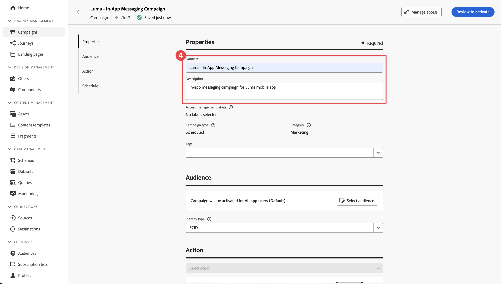

# 인앱 메시지 만들기 및 보내기

Experience Platform Mobile SDK 및 Journey Optimizer을 사용하여 모바일 앱용 인앱 메시지를 만드는 방법을 알아봅니다.

Journey Optimizer을 사용하면 캠페인을 만들어 타깃팅된 대상자에게 인앱 메시지를 보낼 수 있습니다. Journey Optimizer의 캠페인은 다양한 채널을 사용하여 특정 대상에게 일회성 콘텐츠를 전달하는 데 사용됩니다. 캠페인을 사용하면 작업을 동시에 즉시 또는 지정된 일정에 따라 수행합니다. 여정([Journey Optimizer 푸시 알림](journey-optimizer-push.md) 단원 참조)를 사용하면 작업이 순서대로 실행됩니다.


Journey Optimizer을 사용하여 인앱 메시지를 보내기 전에 적절한 구성 및 통합이 제대로 되어 있는지 확인해야 합니다. Journey Optimizer의 인앱 메시지 데이터 흐름을 이해하려면 [설명서](https://experienceleague.adobe.com/docs/journey-optimizer/using/in-app/inapp-configuration.html?lang=en)를 참조하세요.

>[!NOTE]
>
>이 단원은 선택 사항이며 인앱 메시지를 전송하려는 Journey Optimizer 사용자에게만 적용됩니다.


## 전제 조건

* SDK가 설치 및 구성된 앱을 빌드하고 실행했습니다.
* Adobe Experience Platform용 앱을 설정합니다.
* [여기](https://experienceleague.adobe.com/docs/journey-optimizer/using/push/push-config/push-configuration.html)에 설명된 대로 Journey Optimizer에 대한 액세스 및 충분한 사용 권한. 또한 다음 Journey Optimizer 기능에 대한 충분한 권한이 필요합니다.
   * 캠페인을 관리합니다.
* 테스트를 위한 물리적 iOS 장치 또는 시뮬레이터.


## 학습 목표

이 단원에서는 다음과 같은 작업을 수행합니다

* AJO에서 앱 표면 을 만듭니다.
* Journey Optimizer 태그 확장 설치 및 구성
* 앱을 업데이트하여 Journey Optimizer 태그 확장을 등록합니다.
* Assurance에서 설정의 유효성을 검사합니다.
* Journey Optimizer에서 나만의 캠페인 및 인앱 메시지 경험을 정의합니다.
* 앱 내에서 고유한 인앱 메시지를 보냅니다.

## 설정

>[!TIP]
>
>[Journey Optimizer 푸시 메시지](journey-optimizer-push.md) 단원의 일부로 환경을 이미 설정한 경우 이 설정 섹션의 일부 단계를 이미 수행했을 수 있습니다.


### 데이터 수집에서 앱 표면 추가

1. [데이터 수집 인터페이스](https://experience.adobe.com/data-collection/)의 왼쪽 패널에서 **[!UICONTROL 앱 표면]**&#x200B;을 선택합니다.
1. 구성을 만들려면 **[!UICONTROL 앱 표면 만들기]**를 선택하십시오.
   
1. 구성에 대한 **[!UICONTROL 이름]**&#x200B;을(를) 입력하십시오(예: `Luma App Tutorial` ).
1. **[!UICONTROL 모바일 응용 프로그램 구성]**&#x200B;에서 **[!UICONTROL Apple iOS]**&#x200B;을(를) 선택합니다.
1. **[!UICONTROL 앱 ID(iOS 번들 ID)]** 필드에 모바일 앱 번들 ID를 입력합니다. 예: `com.adobe.luma.tutorial.swiftui`.
1. **[!UICONTROL 저장]**&#x200B;을 선택합니다.

   

### 데이터 스트림 구성 업데이트

모바일 앱에서 Edge Network으로 전송된 데이터가 Journey Optimizer으로 전달되도록 하려면 Experience Edge 구성을 업데이트하십시오.


1. 데이터 수집 UI에서 **[!UICONTROL 데이터스트림]**&#x200B;을(를) 선택하고 데이터스트림(예: **[!DNL Luma Mobile App]**)을 선택합니다.
1. **[!UICONTROL Experience Platform]**&#x200B;에 대해 를 선택하고 상황에 맞는 메뉴에서  **[!UICONTROL 편집]**&#x200B;을 선택합니다.
1. **[!UICONTROL 데이터스트림]** >  > **[!UICONTROL Adobe Experience Platform]** 화면에서 **[!UICONTROL Adobe Journey Optimizer]**&#x200B;을(를) 선택했는지 확인하십시오. 자세한 내용은 [Adobe Experience Platform 설정](https://experienceleague.adobe.com/docs/experience-platform/datastreams/configure.html?lang=en#aep)을 참조하세요.
1. 데이터스트림 구성을 저장하려면 **[!UICONTROL 저장]**&#x200B;을 선택합니다.


   


### Journey Optimizer 태그 확장 설치

앱이 Journey Optimizer에서 작동하려면 태그 속성을 업데이트해야 합니다.

1. **[!UICONTROL 태그]** > **[!UICONTROL 확장]** > **[!UICONTROL 카탈로그]**(으)로 이동합니다.
1. 속성을 엽니다(예: **[!DNL Luma Mobile App Tutorial]**).
1. **[!UICONTROL 카탈로그]**&#x200B;를 선택하십시오.
1. **[!UICONTROL Adobe Journey Optimizer]** 확장을 검색합니다.
1. 확장을 설치합니다.

앱에서 인앱 메시지를 사용하는 경우 *only*, **[!UICONTROL 확장 설치]** 또는 **[!UICONTROL 확장 구성]**&#x200B;에서는 아무것도 구성할 필요가 없습니다. 그러나 자습서에서 [푸시 알림](journey-optimizer-push.md) 단원을 이미 따랐다면 **[!UICONTROL 개발]** 환경의 경우 **[!UICONTROL AJO 푸시 추적 경험 이벤트 데이터 세트]** 데이터 세트가 **[!UICONTROL 이벤트 데이터 세트]** 목록에서 선택되었음을 알 수 있습니다.


### 앱에서 Journey Optimizer 구현

이전 단원에서 설명한 대로 모바일 태그 확장을 설치하면 구성만 제공됩니다. 그런 다음 메시징 SDK를 설치하고 등록해야 합니다. 이 단계가 명확하지 않으면 [SDK 설치](install-sdks.md) 섹션을 검토하십시오.

>[!NOTE]
>
>[SDK 설치](install-sdks.md) 섹션을 완료한 경우 SDK가 이미 설치되어 있으므로 이 단계를 건너뛸 수 있습니다.
>

1. Xcode에서 [AEP Messaging](https://github.com/adobe/aepsdk-messaging-ios)이(가) 패키지 종속성의 패키지 목록에 추가되어 있는지 확인하십시오. [Swift 패키지 관리자](install-sdks.md#swift-package-manager)를 참조하세요.
1. Xcode 프로젝트 탐색기에서 **[!DNL Luma]** > **[!DNL Luma]** > **[!UICONTROL AppDelegate]**(으)로 이동합니다.
1. `AEPMessaging`이(가) 가져오기 목록의 일부인지 확인하십시오.

   `import AEPMessaging`

1. `Messaging.self`이(가) 등록 중인 확장 배열의 일부인지 확인하십시오.

   ```swift
   let extensions = [
       AEPIdentity.Identity.self,
       Lifecycle.self,
       Signal.self,
       Edge.self,
       AEPEdgeIdentity.Identity.self,
       Consent.self,
       UserProfile.self,
       Places.self,
       Messaging.self,
       Optimize.self,
       Assurance.self
   ]
   ```


## Assurance를 사용하여 설정 유효성 검사

1. [설치 지침](assurance.md#connecting-to-a-session) 섹션을 검토하여 시뮬레이터 또는 장치를 Assurance에 연결하십시오.
1. Assurance UI에서 **[!UICONTROL 구성]**을 선택합니다.
   
1. **[!UICONTROL 인앱 메시지]** 옆에 있는  단추를 선택하세요.
1. **[!UICONTROL 저장]**을 선택합니다.
   
1. 왼쪽 탐색에서 **[!UICONTROL 인앱 메시지]**&#x200B;를 선택합니다.
1. **[!UICONTROL 유효성 검사]** 탭을 선택합니다. 오류가 발생하지 않는지 확인합니다.

   


## 고유한 인앱 메시지 만들기

고유한 인앱 메시지를 만들려면 발생하는 이벤트를 기반으로 인앱 메시지를 트리거하는 캠페인을 Journey Optimizer에서 정의해야 합니다. 이러한 이벤트는 다음과 같을 수 있습니다.

* Adobe Experience Platform으로 전송된 데이터,
* 모바일 코어 일반 API를 통한 작업, 상태 또는 PII 데이터 수집과 같은 코어 추적 이벤트
* 시작, 설치, 업그레이드, 닫기 또는 충돌과 같은 애플리케이션 라이프사이클 이벤트
* 관심 영역 입력 또는 종료와 같은 지리적 위치 이벤트.

이 자습서에서는 Mobile Core 일반 및 확장 독립적인 API([Mobile Core 일반 API](https://developer.adobe.com/client-sdks/documentation/mobile-core/#mobile-core-generic-apis) 참조)를 사용하여 사용자 화면, 작업 및 PII 데이터의 이벤트 추적을 용이하게 합니다. 이러한 API에 의해 생성된 이벤트는 SDK 이벤트 허브에 게시되고 확장에서 사용할 수 있습니다. SDK 이벤트 허브는 등록된 확장 및 내부 모듈 목록, 등록된 이벤트 리스너 목록 및 공유 상태 데이터베이스를 유지 관리하며 모든 Mobile Platform SDK 확장에 연결된 핵심 데이터 구조를 제공합니다.

SDK 이벤트 허브는 등록된 확장에서 이벤트 데이터를 게시하고 수신하여 Adobe 및 서드파티 솔루션과의 통합을 단순화합니다. 예를 들어 최적화 확장이 설치되면, 모든 요청 및 Journey Optimizer - 의사 결정 관리 오퍼 엔진과의 상호 작용은 이벤트 허브에 의해 처리됩니다.

1. Journey Optimizer UI의 왼쪽 레일에서 **[!UICONTROL 캠페인]**&#x200B;을 선택합니다.
1. **[!UICONTROL 캠페인 만들기]**&#x200B;를 선택합니다.
1. **[!UICONTROL 캠페인 만들기]** 화면에서:
   1. **[!UICONTROL 인앱 메시지]**&#x200B;를 선택하고 **[!UICONTROL 앱 표면]** 목록에서 앱 표면을 선택합니다(예: **[!DNL Luma Mobile App]**).
   1. **[!UICONTROL 만들기]** 선택
      
1. Campaign 정의 화면의 **[!UICONTROL 속성]**&#x200B;에서 캠페인에 대한 **[!UICONTROL 이름]**(예: `Luma - In-App Messaging Campaign`)과 **[!UICONTROL 설명]**(예: `In-app messaging campaign for Luma app`)을 입력하십시오.
   
1. **[!UICONTROL 작업]**(으)로 스크롤한 다음 **[!UICONTROL 콘텐츠 편집]**&#x200B;을 선택합니다.
1. **[!UICONTROL 인앱 메시지]** 화면에서:
   1. **[!UICONTROL 모달]**&#x200B;을(를) **[!UICONTROL 메시지 레이아웃]**(으)로 선택합니다.
   2. **[!UICONTROL 미디어 URL]**&#x200B;에 대해 `https://luma.enablementadobe.com/content/dam/luma/en/logos/Luma_Logo.png`을(를) 입력하십시오.
   3. **[!UICONTROL 머리글]**(예: `Welcome to this Luma In-App Message`)을 입력하고 **[!UICONTROL 본문]**(예: `Triggered by pushing that button in the app...`)을 입력하십시오.
   4. **[!UICONTROL Button #1 텍스트(기본)]**(으)로 **[!UICONTROL Dismiss]**&#x200B;을(를) 입력하십시오.
   5. 미리보기가 어떻게 업데이트되는지 확인합니다.
   6. **[!UICONTROL 활성화하려면 검토]**를 선택하십시오.
      
1. **[!UICONTROL 활성화 검토(Luma - 인앱 메시지 캠페인)]** 화면에서 **[!UICONTROL 일정]** 타일의 을(를) 선택합니다.
   
1. **[!DNL Luma - In-App Messaging Campaign]** 화면으로 돌아가서  **[!UICONTROL 트리거 편집]**&#x200B;을(를) 선택하십시오.
1. **[!UICONTROL 인앱 메시지 트리거]** 대화 상자에서 인앱 메시지를 트리거하는 추적 작업의 세부 사항을 구성합니다.
   1. **[!UICONTROL 응용 프로그램 시작 이벤트]**&#x200B;를 제거하려면  를 선택하십시오.
   1.  **[!UICONTROL 조건 추가]**&#x200B;를 반복적으로 사용하여 **[!UICONTROL 메시지 표시]**&#x200B;에 대한 다음 논리를 빌드합니다.
   1. **[!UICONTROL 완료]**를 클릭합니다.
      

   **[!UICONTROL Action]**&#x200B;이(가) `in-app`이고 동작이 있는 **[!UICONTROL 컨텍스트 데이터]**&#x200B;가 `"showMessage" : "true"`의 키 값 쌍인 추적 동작을 정의했습니다.

1. **[!DNL Luma - In-App Messaging Campaign]** 화면으로 돌아가서 **[!UICONTROL 활성화하려면 검토]**&#x200B;를 선택합니다.
1. **[!UICONTROL 활성화 검토(Luma - 인앱 메시지 캠페인)]** 화면에서 **[!UICONTROL 활성화]**&#x200B;를 선택합니다.
1. **[!UICONTROL 캠페인]** 목록에 **[!UICONTROL Live]** 상태의 **[!DNL Luma - In-App Messaging Campaign]**이(가) 표시됩니다.
   


## 인앱 메시지 트리거

인앱 메시지를 보낼 수 있는 모든 구성 요소가 준비되었습니다. 남은 것은 앱에서 이 인앱 메시지를 트리거하는 방법입니다.

1. Xcode 프로젝트 탐색기에서 **[!DNL Luma]** > **[!DNL Luma]** > **[!DNL Utils]** > **[!UICONTROL MobileSDK]**(으)로 이동합니다. `func sendTrackAction(action: String, data: [String: Any]?)` 함수를 찾고 `action` 및 `data` 매개 변수를 기반으로 [`MobileCore.track`](https://developer.adobe.com/client-sdks/documentation/mobile-core/api-reference/#trackaction) 함수를 호출하는 다음 코드를 추가합니다.


   ```swift
   // Send trackAction event
   MobileCore.track(action: action, data: data)
   ```

1. Xcode Project Navigator에서 **[!DNL Luma]** > **[!DNL Luma]** > **[!DNL Views]** > **[!DNL General]** > **[!UICONTROL ConfigView]**(으)로 이동합니다. 인앱 메시지 단추에 대한 코드를 찾아 다음 코드를 추가합니다.

   ```swift
   // Setting parameters and calling function to send in-app message
   Task {
       MobileSDK.shared.sendTrackAction(action: "in-app", data: ["showMessage": "true"])
   }
   ```

## 앱을 사용하여 유효성 검사

1. 을 사용하여 시뮬레이터나 Xcode의 실제 장치에서 앱을 다시 빌드하고 실행합니다.

1. **[!UICONTROL 설정]** 탭으로 이동합니다.

1. **[!UICONTROL 인앱 메시지]**&#x200B;를 탭합니다. 인앱 메시지가 앱에 표시되는 것을 볼 수 있습니다.

   


## Assurance에서 구현 유효성 검사

Assurance UI에서 인앱 메시지의 유효성을 검사할 수 있습니다.

1. [설치 지침](assurance.md#connecting-to-a-session) 섹션을 검토하여 시뮬레이터 또는 장치를 Assurance에 연결하십시오.
1. **[!UICONTROL 인앱 메시지]**&#x200B;를 선택합니다.
1. **[!UICONTROL 이벤트 목록]**&#x200B;을 선택하세요.
1. **[!UICONTROL 메시지 표시]** 항목을 선택하십시오.
1. Inspect은 원시 이벤트, 특히 인앱 메시지의 전체 레이아웃과 콘텐츠를 포함하는 `html`을(를) 포함합니다.
   


## 다음 단계

관련 있고 적용 가능한 경우 인앱 메시지 추가를 시작할 수 있는 모든 도구가 있어야 합니다. 예를 들어 앱에서 추적 중인 특정 상호 작용을 기반으로 제품을 홍보할 수 있습니다.

>[!SUCCESS]
>
>Experience Platform Mobile SDK용 Journey Optimizer 및 Journey Optimizer 확장을 사용하여 인앱 메시지를 활성화하고 인앱 메시지 캠페인을 추가했습니다.
>
>Adobe Experience Platform Mobile SDK에 대해 학습하는 데 시간을 투자해 주셔서 감사합니다. 질문이 있거나 일반적인 피드백을 공유하고 싶거나 향후 콘텐츠에 대한 제안이 있는 경우 이 [Experience League 커뮤니티 토론 게시물](https://experienceleaguecommunities.adobe.com/t5/adobe-experience-platform-data/tutorial-discussion-implement-adobe-experience-cloud-in-mobile/td-p/443796)에서 공유하십시오.

다음: **[오퍼 만들기 및 표시](journey-optimizer-offers.md)**
