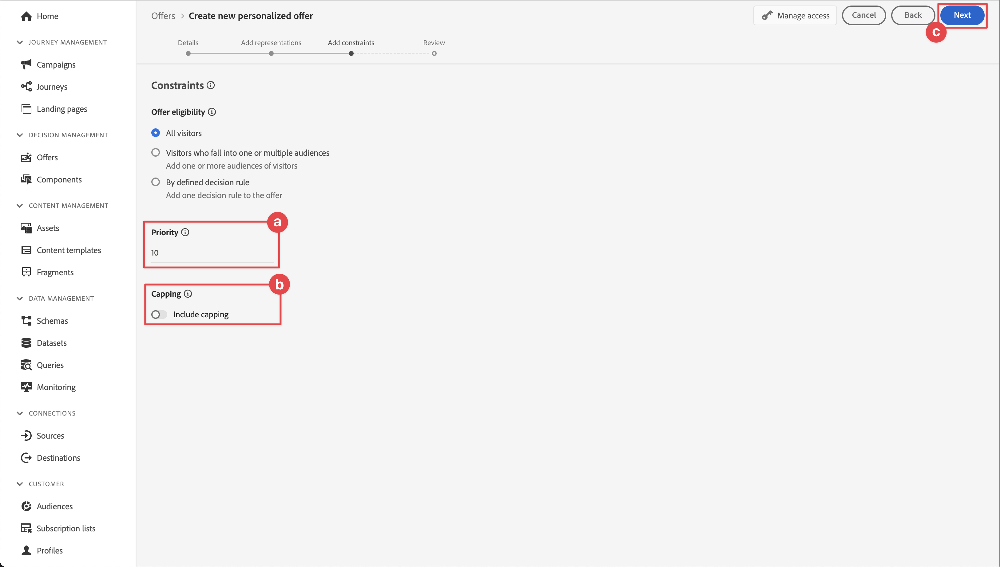
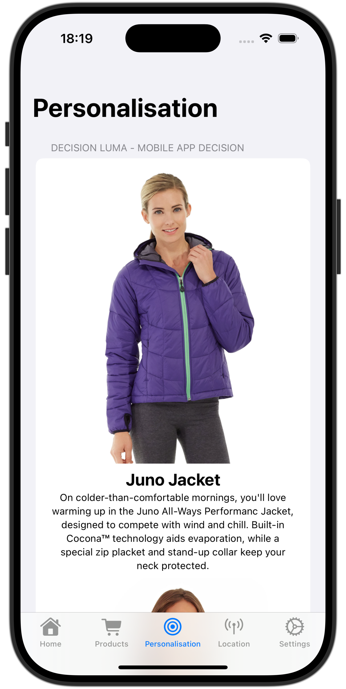

# 의사 결정 관리를 사용하여 오퍼 만들기 및 표시

Experience Platform Mobile SDK를 사용하여 모바일 앱에서 Journey Optimizer 의사 결정 관리의 오퍼를 표시하는 방법을 알아봅니다.

Journey Optimizer 의사 결정 관리를 사용하면 적절한 시기에 모든 접점에서 고객에게 최상의 오퍼와 경험을 제공할 수 있습니다. 디자인한 후에는 개인화된 오퍼로 대상을 타기팅하십시오.


의사 결정 관리를 사용하면 마케팅 오퍼의 중앙 라이브러리와 Adobe Experience Platform에서 만든 풍부한 실시간 프로필에 규칙과 제한을 적용하는 의사 결정 엔진을 통해 손쉽게 개인화할 수 있습니다. 따라서 고객에게 적절한 시기에 적절한 오퍼를 보낼 수 있습니다. 다음을 참조하십시오 [의사 결정 관리 정보](https://experienceleague.adobe.com/docs/journey-optimizer/using/offer-decisioning/get-started-decision/starting-offer-decisioning.html?lang=en) 추가 정보.


>[!NOTE]
>
>이 단원은 선택 사항이며 의사 결정 관리 기능을 사용하여 모바일 앱에 오퍼를 표시하려는 Journey Optimizer 사용자에게만 적용됩니다.


## 전제 조건

* SDK가 설치 및 구성된 앱을 빌드하고 실행했습니다.
* Adobe Experience Platform용 앱을 설정합니다.
* Journey Optimizer 액세스 - 설명된 대로 오퍼 및 결정을 관리할 수 있는 적절한 권한이 있는 의사 결정 관리 [여기](https://experienceleague.adobe.com/docs/journey-optimizer/using/access-control/privacy/high-low-permissions.html?lang=en#decisions-permissions).


## 학습 목표

이 단원에서는 다음과 같은 작업을 수행합니다

* 의사 결정 관리에 사용할 Edge 구성을 업데이트합니다.
* Journey Optimizer - Decisioning 확장을 사용하여 태그 속성을 업데이트합니다.
* 스키마를 업데이트하여 제안 이벤트를 캡처합니다.
* Assurance에서 설정의 유효성을 검사합니다.
* Journey Optimizer - 의사 결정 관리의 오퍼를 기반으로 오퍼 의사 결정을 만듭니다.
* 앱을 업데이트하여 Optimizer 확장을 등록합니다.
* 앱에서 의사 결정 관리의 오퍼를 구현합니다.


## 설정

>[!TIP]
>
>의 일부로 환경을 이미 설정한 경우 [Target을 사용하여 A/B 테스트 설정](target.md) 단원, 이 설정 섹션의 일부 단계를 이미 수행했을 수 있습니다.

### 데이터 스트림 구성 업데이트

모바일 앱에서 Platform Edge Network로 전송된 데이터가 의사 결정 관리인 Journey Optimizer으로 전달되도록 하려면 데이터스트림을 업데이트합니다.

1. 데이터 수집 UI에서 **[!UICONTROL 데이터스트림]**&#x200B;을 누르고 데이터 스트림을 선택합니다(예: ). **[!DNL Luma Mobile App]**.
1. 선택  대상 **[!UICONTROL Experience Platform]** 및 선택  **[!UICONTROL 편집]** 컨텍스트 메뉴 아래의 제품에서 사용할 수 있습니다.
1. 다음에서 **[!UICONTROL 데이터스트림]** >  >  **[!UICONTROL Adobe Experience Platform]** 화면, 확인 **[!UICONTROL Offer decisioning]**, **[!UICONTROL Edge 세그멘테이션]**, 및 **[!UICONTROL Adobe Journey Optimizer]** 이(가) 선택되어 있습니다. Target 단원을 수행하려면 다음을 선택합니다. **[!UICONTROL 개인화 대상]**,. 다음을 참조하십시오 [Adobe Experience Platform 설정](https://experienceleague.adobe.com/docs/experience-platform/datastreams/configure.html?lang=en#aep) 추가 정보.
1. 데이터 스트림 구성을 저장하려면 을 선택합니다. **[!UICONTROL 저장]** .

   


### Journey Optimizer - Decisioning 태그 확장 설치

1. 다음으로 이동 **[!UICONTROL 태그]** 모바일 태그 속성을 찾아 속성을 엽니다.
1. 선택 **[!UICONTROL 확장]**.
1. 선택 **[!UICONTROL 카탈로그]**.
1. 검색 **[!UICONTROL Adobe Journey Optimizer - Decisioning]** 확장명.
1. 확장을 설치합니다. 확장은 추가 구성이 필요하지 않습니다.

   


### 스키마 업데이트

1. 데이터 수집 인터페이스로 이동하여 **[!UICONTROL 스키마]** 왼쪽 레일에서.
1. 선택 **[!UICONTROL 찾아보기]** 을 클릭합니다.
1. 스키마를 선택하여 엽니다.
1. 스키마 편집기에서  **[!UICONTROL 추가]** 필드 그룹 옆에 있습니다.
1. 다음에서 **[!UICONTROL 필드 그룹 추가]** 대화 상자,  검색 대상 `proposition`, 선택 **[!UICONTROL 경험 이벤트 - 제안 상호 작용]** 및 선택 **[!UICONTROL 필드 그룹 추가]**. 이 필드 그룹은 오퍼와 관련된 경험 이벤트 데이터(제공 사항, 수집, 결정 및 기타 매개 변수의 일부)를 수집합니다(이 단원의 뒷부분 참조). 하지만 또한 그 제안은 어떻게 되어가고 있나요? 표시됩니까, 상호 작용합니까, 해제됩니까, 등입니다.
   
1. 선택 **[!UICONTROL 저장]** 를 클릭하여 스키마에 대한 변경 사항을 저장합니다.


## Assurance에서 설정 확인

Assurance에서 설정을 확인하려면:

1. Assurance UI로 이동합니다.
1. 선택 **[!UICONTROL 구성]** 왼쪽 레일에서 다음을 선택  다음에 **[!UICONTROL 설정 유효성 검사]** 아래 **[!UICONTROL ADOBE JOURNEY OPTIMIZER DECISIONING]**.
1. **[!UICONTROL 저장]**&#x200B;을 선택합니다.
1. 선택 **[!UICONTROL 설정 유효성 검사]** 왼쪽 레일에서. 애플리케이션의 데이터 스트림 설정과 SDK 설정이 모두 검증됩니다.
   


## 배치 만들기

오퍼를 실제로 만들려면 먼저 모바일 앱에서 이러한 오퍼를 배치할 방법과 위치를 정의해야 합니다. 의사 결정 관리에서 이 목적을 위한 배치를 정의하고 JSON 페이로드를 지원하는 모바일 채널에 대한 배치를 정의합니다.

1. Journey Optimizer UI에서   **[!UICONTROL 구성 요소]** 출처: **[!UICONTROL 의사 결정 관리]** 왼쪽 레일에서.

1. 선택 **[!UICONTROL 배치]** 을 클릭합니다.

1. 이름이 인 배치가 없는 경우 **[!UICONTROL 모바일 JSON]**,  **[!UICONTROL 모바일]** 다음으로: **[!UICONTROL 채널 유형]** 및 **[!UICONTROL JSON]** 다음으로: **[!UICONTROL 컨텐츠 유형]** 이 나열되면 배치를 생성해야 합니다. 그렇지 않으면 계속 [오퍼 만들기](#create-offers).

모바일 JSON 배치를 만들려면 다음 작업을 수행하십시오.

1. 선택  배치를 생성합니다.

   1. 다음에서 **[!UICONTROL 세부 사항]** 섹션, 입력 `Mobile JSON` (으)로 **[!UICONTROL 이름]**, 선택 **[!UICONTROL 모바일]** 출처: **[!UICONTROL 채널 유형]** 및 **[!UICONTROL JSON]** 출처: **[!UICONTROL 컨텐츠 유형]**.
   1. 선택 **[!UICONTROL 저장]** 를 클릭하여 배치를 저장합니다.

   


## 오퍼 만들기

1. Journey Optimizer UI에서   **[!UICONTROL 오퍼]** 출처: **[!UICONTROL 의사 결정 관리]** 왼쪽 레일에서.
1. 다음에서 **[!UICONTROL 오퍼]** 화면, 선택 **[!UICONTROL 찾아보기]** 을 클릭하여 오퍼 목록을 확인합니다.
1. 선택 **[!UICONTROL 오퍼 만들기]**.
1. 다음에서 **[!UICONTROL 새 오퍼]** 대화 상자, 선택 **[!UICONTROL 개인화된 오퍼]** 및 클릭 **[!UICONTROL 다음]**.
1. 다음에서 **[!UICONTROL 세부 사항]** / 단계 **[!UICONTROL 새로운 맞춤형 오퍼 만들기]**:
   1. 입력 **[!UICONTROL 이름]** 오퍼의 경우, 예 `Luma - Juno Jacket`을 누르고 을(를) 입력합니다. **[!UICONTROL 시작 날짜 및 시간]** 및 **[!UICONTROL 종료 날짜 및 시간]**. 이 날짜 이외에는 Decisioning 엔진에서 오퍼를 선택하지 않습니다.
   1. **[!UICONTROL 다음]**을 선택합니다.
      

1. 다음에서 **[!UICONTROL 표시 추가]** / 단계 **[!UICONTROL 새로운 맞춤형 오퍼 만들기]**:
   1. 선택  **[!UICONTROL 모바일]** 출처: **[!UICONTROL 채널]** 목록 및 선택 **[!UICONTROL 모바일 JSON]** 다음에서 **[!UICONTROL 배치]** 목록을 표시합니다.
   1. 선택 **[!UICONTROL 사용자 정의]** 대상 **[!UICONTROL 콘텐츠]**.
   1. 선택 **[!UICONTROL 콘텐츠 추가]**. 다음에서 **[!UICONTROL 개인화 추가]** 대화 상자:
      1. 케이스 a [!UICONTROL 모드] 선택기를 사용할 수 있습니다. 선택기가 로 설정되어 있는지 확인하십시오. **[!UICONTROL JSON]**.
      1. 다음 JSON을 입력합니다.

         ```json
         { 
             "title": "Juno Jacket",
             "text": "On colder-than-comfortable mornings, you'll love warming up in the Juno All-Ways Performance Jacket, designed to compete with wind and chill. Built-in Cocona&trade; technology aids evaporation, while a special zip placket and stand-up collar keep your neck protected.", 
             "image": "https://luma.enablementadobe.com/content/dam/luma/en/products/women/tops/jackets/wj06-purple_main.jpg" 
         }  
         ```

      1. **[!UICONTROL 저장]**을 선택합니다.
         
   1. **[!UICONTROL 다음]**을 선택합니다.
      

1. 다음에서 **[!UICONTROL 제한 추가]** 의 단계 **[!UICONTROL 새로운 맞춤형 오퍼 만들기]**:
   1. 설정 **[!UICONTROL 우선 순위]** 끝 `10`.
   1. 전환 **[!UICONTROL 캡핑 포함]** 꺼져.
   1. **[!UICONTROL 다음]**을 선택합니다.
      

1. 다음에서 **[!UICONTROL 리뷰]** / 단계 **[!UICONTROL 새 개인화된 항목 만들기]** 오퍼:
   1. 오퍼를 검토한 다음 을 선택합니다. **[!UICONTROL 완료]**.
   1. 다음에서 **[!UICONTROL 오퍼 저장]** 대화 상자, 선택 **[!UICONTROL 저장 및 승인]**.

1. 3~8단계를 반복하여 이름과 컨텐츠가 다른 오퍼를 4개 더 만듭니다. 다른 모든 구성 값(예: 시작 날짜 및 시간 또는 우선 순위)은 사용자가 만든 첫 번째 오퍼와 유사합니다. 중복 오퍼를 빠르게 만들고 편집할 수 있습니다.

   1. Journey Optimizer UI에서  **[!UICONTROL 오퍼]** 왼쪽 레일에서 을(를) 선택한 다음 상단 막대에서 오퍼 를 선택합니다.
   1. 생성한 오퍼의 행을 선택합니다.
   1. 오른쪽 창에서 을(를) 선택합니다  **[!UICONTROL 추가 작업]** 컨텍스트 메뉴에서 을(를) 선택합니다.  **[!UICONTROL 복제]**.

      아래 표를 사용하여 네 개의 다른 오퍼를 정의합니다.

      | 오퍼 이름 | JSON의 오퍼 콘텐츠 |
      |---|---|
      | Luma - 물병 확인 | `{ "title": "Affirm Water Bottle", "text": "You'll stay hydrated with ease with the Affirm Water Bottle by your side or in hand. Measurements on the outside help you keep track of how much you're drinking, while the screw-top lid prevents spills. A metal carabiner clip allows you to attach it to the outside of a backpack or bag for easy access.", "image": "https://luma.enablementadobe.com/content/dam/luma/en/products/gear/fitness-equipment/ug06-lb-0.jpg" }` |
      | Luma - Desiree 피트니스 티 | `{ "title": "Desiree Fitness Tee", "text": "When you're too far to turn back, thank yourself for choosing the Desiree Fitness Tee. Its ultra-lightweight, ultra-breathable fabric wicks sweat away from your body and helps keeps you cool for the distance.", "image": "https://luma.enablementadobe.com/content/dam/luma/en/products/women/tops/tees/ws05-yellow_main.jpg" }` |
      | Luma - Adrienne Trek Jacket | `{ "title": "Adrienne Trek Jacket", "text": "You're ready for a cross-country jog or a coffee on the patio in the Adrienne Trek Jacket. Its style is unique with stand collar and drawstrings, and it fits like a jacket should.", "image": "https://luma.enablementadobe.com/content/dam/luma/en/products/women/tops/jackets/wj08-gray_main.jpg" }` |
      | Luma - Aero 일일 피트니스 티 | `{ "title": "Aero Daily Fitness Tee", "text": "Need an everyday action tee that helps keep you dry? The Aero Daily Fitness Tee is made of 100% polyester wicking knit that funnels moisture away from your skin. Don't be fooled by its classic style; this tee hides premium performance technology beneath its unassuming look.", "image": "https://luma.enablementadobe.com/content/dam/luma/en/products/men/tops/tees/ms01-black_main.jpg" }` |

      {style="table-layout:fixed"}

1. 마지막 단계로 고객에게 다른 오퍼에 대한 자격이 없는 경우 전송되는 대체 오퍼를 만들어야 합니다.
   1. 선택 **[!UICONTROL 오퍼 만들기]**.
   1. 다음에서 **[!UICONTROL 새 오퍼]** 대화 상자, 선택 **[!UICONTROL 개인화된 오퍼]** 및 선택 **[!UICONTROL 다음]**.
   1. 다음에서 **[!UICONTROL 세부 사항]** / 단계 **[!UICONTROL 새 대체 오퍼 만들기]**, 를 입력합니다. **[!UICONTROL 이름]** 오퍼의 경우, 예 `Luma - Fallback Offer`, 및 선택 **[!UICONTROL 다음]**.

   1. 다음에서 **[!UICONTROL 표시 추가]** / 단계  **[!UICONTROL 새 대체 오퍼 만들기]**:
      1. 선택  **[!UICONTROL 모바일]** 출처: **[!UICONTROL 채널]** 목록 및 선택 **[!UICONTROL 모바일 JSON]** 출처: **[!UICONTROL 배치]** 목록을 표시합니다.
      1. 선택 **[!UICONTROL 사용자 정의]** 대상 **[!UICONTROL 콘텐츠]**.
      1. 선택 **[!UICONTROL 콘텐츠 추가]**.
      1. 다음에서 **[!UICONTROL 개인화 추가]** 대화 상자에서 다음 JSON을 입력하고 다음을 선택합니다. **[!UICONTROL 저장]**:

         ```json
         {  
            "title": "Luma",
            "text": "Your store for sports wear and equipment.", 
            "image": "https://luma.enablementadobe.com/content/dam/luma/en/logos/Luma_Logo.png" 
         }  
         ```

      1. **[!UICONTROL 다음]**&#x200B;을 선택합니다.


1. 다음에서 **[!UICONTROL 리뷰]** / 단계 **[!UICONTROL 새 대체 항목 만들기]** 오퍼:
   1. 오퍼를 검토한 다음 을 선택합니다. **[!UICONTROL 완료]**.
   1. 다음에서 **[!UICONTROL 오퍼 저장]** 대화 상자, 선택 **[!UICONTROL 저장 및 승인]**.

이제 다음 오퍼 목록이 있어야 합니다.


## 컬렉션 만들기

모바일 앱 사용자에게 오퍼를 제공하려면 만든 하나 이상의 오퍼로 구성된 오퍼 컬렉션을 정의해야 합니다.

1. Journey Optimizer UI에서 **[!UICONTROL 오퍼]** 왼쪽 레일에서.
1. 선택 **[!UICONTROL 컬렉션]** 을 클릭합니다.
1. 선택  **[!UICONTROL 컬렉션 만들기]**.
1. 다음에서 **[!UICONTROL 새 컬렉션]** 대화 상자에서 **[!UICONTROL 이름]** 컬렉션용, 예 `Luma - Mobile App Collection`, 선택 **[!UICONTROL 정적 컬렉션 만들기]**, 및 클릭 **[!UICONTROL 다음]**.
1. 위치 **[!DNL Luma - Mobile App Collection]**&#x200B;컬렉션에 포함할 오퍼를 선택합니다. 이 자습서에서는 만든 오퍼 5개를 선택합니다. 검색 필드를 사용하여 목록을 쉽게 필터링할 수 있습니다. 예를 들면 다음과 같습니다 **[!DNL Luma]**.
1. **[!UICONTROL 저장]**&#x200B;을 선택합니다.

   


## 의사 결정 만들기

마지막 단계는 결정을 정의하는 것입니다. 이 결정은 하나 이상의 결정 범위와 대체 오퍼의 조합입니다.

의사 결정 범위는 특정 배치(예: 이메일의 HTML 또는 모바일 앱의 JSON)와 하나 이상의 평가 기준의 조합입니다.

평가 기준은 다음 두 가지를 결합한 것입니다.

* 오퍼 컬렉션,
* 자격 규칙: 예를 들어, 오퍼는 특정 대상에만 사용할 수 있습니다.
* 순위 방법: 여러 오퍼를 사용할 수 있는 경우 순위를 매기는 데 사용할 방법(예: 오퍼 우선 순위, 공식 또는 AI 모델 사용)을 선택합니다.

다음을 참조하십시오 [오퍼를 만들고 관리하는 주요 단계](https://experienceleague.adobe.com/docs/journey-optimizer/using/offer-decisioning/get-started-decision/key-steps.html?lang=en) 배치, 규칙, 등급, 오퍼, 표시, 컬렉션, 의사 결정 등이 서로 상호 작용하고 관련되는 방식을 더 잘 이해하고자 하는 경우. 이 단원은 Journey Optimizer - 의사 결정 관리 내에서 결정을 정의하는 유연성보다는 의사 결정의 결과를 사용하는 데에만 중점을 둡니다.

1. Journey Optimizer UI에서 **[!UICONTROL 오퍼]** 왼쪽 레일에서.
1. 선택 **[!UICONTROL 결정]** 을 클릭합니다.
1. 선택  **[!UICONTROL 결정 만들기]**.
1. 다음에서 **[!UICONTROL 세부 사항]** / 단계 **[!UICONTROL 새 오퍼 결정 만들기]**:
   1. 입력 **[!UICONTROL 이름]** 예를 들어, 결정에 대해 `Luma - Mobile App Decision`, 입력 **[!UICONTROL 시작 날짜 및 시간]** 및 **[!UICONTROL 종료 날짜 및 시간]**.
   1. **[!UICONTROL 다음]**&#x200B;을 선택합니다.

1. 다음에서 **[!UICONTROL 결정 범위 추가]** / 단계 **[!UICONTROL 새 오퍼 결정 만들기]**:
   1. 선택 **[!UICONTROL 모바일 JSON]** 출처: **[!UICONTROL 배치]** 목록을 표시합니다.
   1. 다음에서 **[!UICONTROL 평가 기준]** 타일, 선택  **[!UICONTROL 추가]**.
      1. 다음에서 **[!UICONTROL 오퍼 컬렉션 추가]** 대화 상자에서 오퍼 컬렉션을 선택합니다. 예: **[!DNL Luma - Mobile App Collection]**.
      1. 선택 **[!UICONTROL 추가]**.
         
   1. 다음을 확인합니다. **[!UICONTROL 없음]** 다음에 대해 선택됨: **[!UICONTROL 자격 요건]**, 및 **[!UICONTROL 오퍼 우선 순위]** 이(가) (으)로 선택됨 **[!UICONTROL 순위 방법]**.
   1. **[!UICONTROL 다음]**을 선택합니다.
      .
1. 다음에서 **[!UICONTROL 대체 오퍼 추가]** / 단계 **[!UICONTROL 새 오퍼 결정 만들기]**:
   1. 대체 오퍼 선택(예: ) **[!DNL Luma - Fallback offer]**.
   1. **[!UICONTROL 다음]**&#x200B;을 선택합니다.
1. 다음에서 **[!UICONTROL 요약]** / 단계 **[!UICONTROL 새 오퍼 결정 만들기]**:
   1. **[!UICONTROL 마침]**&#x200B;을 선택합니다.
   1. 다음에서 **[!UICONTROL 오퍼 결정 저장]** 대화 상자, 선택 **[!UICONTROL 저장 및 활성화]**.
   1. 다음에서 **[!UICONTROL 결정]** 탭, 상태의 결정이 표시됩니다. **[!UICONTROL 라이브]**.

이제 오퍼 세트로 구성된 오퍼 결정을 사용할 준비가 되었습니다. 앱에서 의사 결정을 사용하려면 코드에서 의사 결정 범위를 참조해야 합니다.

1. Journey Optimizer UI에서 **[!UICONTROL 오퍼]**.
1. 선택 **[!UICONTROL 결정]** 을 클릭합니다.
1. 예를 들어, 결정을 선택합니다. **[!DNL Luma - Mobile App Decision]**.
1. 다음에서 **[!UICONTROL 결정 범위]** 타일, 선택  **[!UICONTROL 복사]**.
1. 상황별 메뉴에서 **[!UICONTROL 결정 범위]**.
   
1. 텍스트 편집기를 사용하여 나중에 사용할 수 있도록 결정 범위를 붙여넣습니다. 결정 범위에는 다음과 같은 JSON 형식이 있습니다.

   ```json
   {
       "xdm:activityId":"xcore:offer-activity:xxxxxxxxxxxxxxx",
       "xdm:placementId":"xcore:offer-placement:xxxxxxxxxxxxxxx"
   }
   ```

## 앱에서 오퍼 구현

이전 단원에서 설명한 대로 모바일 태그 확장을 설치하면 구성만 제공됩니다. 그런 다음 Optimize SDK를 설치하고 등록해야 합니다. 이러한 단계가 명확하지 않으면 다음을 검토하십시오. [SDK 설치](install-sdks.md) 섹션.

>[!NOTE]
>
>을(를) 완료한 경우 [SDK 설치](install-sdks.md) 섹션에서 SDK가 이미 설치되어 있으므로 이 단계를 건너뛸 수 있습니다.
>

1. Xcode에서 다음을 확인합니다 [AEP 최적화](https://github.com/adobe/aepsdk-messaging-ios) 패키지 종속 항목의 패키지 목록에 추가됩니다. 다음을 참조하십시오 [Swift 패키지 관리자](install-sdks.md#swift-package-manager).
1. 다음으로 이동 **[!DNL Luma]** > **[!DNL Luma]** > **[!UICONTROL AppDelegate]** 를 입력합니다.
1. 확인 `AEPOptimize` 는 가져오기 목록의 일부입니다.

   ```swift
   import AEPOptimize
   ```

1. 확인 `Optimize.self` 는 등록 중인 확장 배열의 일부입니다.

   ```swift
   let extensions = [
       AEPIdentity.Identity.self,
       Lifecycle.self,
       Signal.self,
       Edge.self,
       AEPEdgeIdentity.Identity.self,
       Consent.self,
       UserProfile.self,
       Places.self,
       Messaging.self,
       Optimize.self,
       Assurance.self
   ]
   ```

1. 다음으로 이동 **[!DNL Luma]** > **[!DNL Luma]** > **[!DNL Model]** > **[!DNL Data]** > **[!UICONTROL 결정]** 를 입력합니다. 업데이트 `activityId` 및 `placementId` Journey Optimizer 인터페이스에서 복사한 결정 범위 세부 정보가 있는 값입니다.

1. 다음으로 이동 **[!DNL Luma]** > **[!DNL Luma]** > **[!DNL Utils]** > **[!UICONTROL MobileSDK]** 를 입력합니다. 다음 찾기 `func updatePropositionOD(ecid: String, activityId: String, placementId: String, itemCount: Int) async` 함수. 다음 코드를 추가합니다.

   ```swift
   // set up the XDM dictionary, define decision scope and call update proposition API
   Task {  
      let ecid = ["ECID" : ["id" : ecid, "primary" : true] as [String : Any]]
      let identityMap = ["identityMap" : ecid]
      let xdmData = ["xdm" : identityMap]
      let decisionScope = DecisionScope(activityId: activityId, placementId: placementId, itemCount: UInt(itemCount))
      Optimize.clearCachedPropositions()
      Optimize.updatePropositions(for: [decisionScope], withXdm: xdmData)
   }
   ```

   이 함수:

   * xdm 사전 설정 `xdmData`오퍼를 제공해야 하는 프로필을 식별하는 ECID가 포함되어 있습니다.
   * 정의 `decisionScope`: Journey Optimizer - 의사 결정 관리 인터페이스에서 정의한 의사 결정을 기반으로 하며 다음 위치에서 복사된 의사 결정 범위를 사용하여 정의된 개체입니다. [의사 결정 만들기](#create-a-decision).  Luma 앱은 구성 파일(`decisions.json`)는 다음 JSON 형식을 기반으로 범위 매개 변수를 검색합니다.

     ```swift
     "scopes": [
         {
             "name": "name of the scope",
             "activityId": "xcore:offer-activity:xxxxxxxxxxxxxxx",
             "placementId": "xcore:offer-placement:xxxxxxxxxxxxxxx",
             "itemCount": 2
         }
     ]
     ```

     그러나 모든 종류의 구현을 사용하여 API 최적화가 적절한 매개 변수를 가져오도록 할 수 있습니다(`activityId`, `placementId` 및, `itemCount`), 유효한 을 생성합니다. [`DecisionScope`](https://developer.adobe.com/client-sdks/documentation/adobe-journey-optimizer-decisioning/api-reference/#decisionscope) 구현을 위한 개체입니다. <br/>정보: 의 기타 키-값 `decisions.json` 파일은 나중에 사용하기 위한 것이며 관련성이 없으며 현재 이 단원에서 자습서의 일부로 사용됩니다.

   * 는 두 개의 API를 호출합니다. [`Optimize.clearCachePropositions`](https://support.apple.com/en-ie/guide/mac-help/mchlp1015/mac)  및 [`Optimize.updatePropositions`](https://developer.adobe.com/client-sdks/documentation/adobe-journey-optimizer-decisioning/api-reference/#updatepropositions).  이러한 함수는 캐시된 모든 제안을 지우고 이 프로필에 대한 제안을 업데이트합니다.

1. 다음으로 이동 **[!DNL Luma]** > **[!DNL Luma]** > **[!DNL Views]** > **[!UICONTROL 개인화]** > **[!UICONTROL EdgeOffersView]** 를 입력합니다. 다음 찾기 `func onPropositionsUpdateOD(activityId: String, placementId: String, itemCount: Int) async` 함수 및 이 함수의 코드를 검사합니다. 이 함수에서 가장 중요한 부분은 [`Optimize.onPropositionsUpdate`](https://developer.adobe.com/client-sdks/documentation/adobe-journey-optimizer-decisioning/api-reference/#onpropositionsupdate) API 호출,

   * 의사 결정 범위(Journey Optimizer - 의사 결정 관리에서 정의함)를 기반으로 현재 프로필에 대한 제안을 검색합니다.
   * 제안에서 오퍼를 검색합니다.
   * 앱에서 제대로 표시될 수 있도록 오퍼의 콘텐츠를 래핑 해제합니다.
   * 트리거 `displayed()` 오퍼를 알리는 이벤트를 Edge Network로 다시 보내는 오퍼에 대한 작업이 표시됩니다.

1. 아직 **[!DNL EdgeOffersView]**&#x200B;에 다음 코드를 추가합니다. `.onFirstAppear` 수정자. 이 코드는 오퍼를 업데이트하기 위한 콜백이 한 번만 등록되도록 합니다.

   ```swift
   // Invoke callback for offer updates
   Task {
       await self.onPropositionsUpdateOD(activityId: decision.activityId, placementId: decision.placementId, itemCount: decision.itemCount)
   }
   ```

1. 아직 **[!UICONTROL EdgeOffersView]**&#x200B;에 다음 코드를 추가합니다. `.task` 수정자. 이 코드는 보기를 새로 고칠 때 오퍼를 업데이트합니다.

   ```swift
   // Clear and update offers
   await self.updatePropositionsOD(ecid: currentEcid, activityId: decision.activityId, placementId: decision.placementId, itemCount: decision.itemCount)
   ```


## 앱을 사용하여 유효성 검사

1. 를 사용하여 시뮬레이터나 Xcode의 물리적 장치에서 앱을 다시 빌드하고 실행합니다. .

1. **[!DNL Personalisation]** 탭으로 이동합니다.

1. **[!DNL Edge Personalisation]**&#x200B;를 선택합니다.

1. 맨 위로 스크롤하면 정의한 컬렉션에서 두 개의 무작위 오퍼가 표시됩니다. **[!DNL DECISION LUMA - MOBILE APP DECISION]** 타일.

   

   모든 오퍼에 동일한 우선 순위를 부여했으므로 오퍼는 임의적이며 의사 결정 순위는 우선 순위를 기반으로 합니다.


## Assurance에서 구현 유효성 검사

Assurance에서 오퍼 구현을 확인하려면 다음을 수행하십시오.

1. 리뷰 [설치 지침](assurance.md#connecting-to-a-session) 시뮬레이터 또는 장치를 Assurance에 연결하는 섹션입니다.
1. 선택 **[!UICONTROL 구성]** 왼쪽 레일에서 다음을 선택  다음에 **[!UICONTROL 검토 및 시뮬레이션]** 아래 **[!UICONTROL ADOBE JOURNEY OPTIMIZER DECISIONING]**.
1. **[!UICONTROL 저장]**&#x200B;을 선택합니다.
1. 선택 **[!UICONTROL 검토 및 시뮬레이션]** 왼쪽 레일에서. 데이터 스트림 설정과 SDK 설정이 모두 애플리케이션에서 검증되었습니다.
1. 선택 **[!UICONTROL 요청]** 맨 위 막대에서. 다음을 확인함: **[!UICONTROL 오퍼]** 요청.
   

1. 다음을 살펴볼 수 있습니다. **[!UICONTROL 시뮬레이트]** 및 **[!UICONTROL 이벤트 목록]** 추가 기능을 보려면 탭에서 Journey Optimizer 의사 결정 관리 설정을 확인하십시오.

## 다음 단계

이제 Journey Optimizer - 의사 결정 관리 구현에 더 많은 기능을 추가할 수 있는 모든 도구를 보유해야 합니다. 예:

* 오퍼에 다른 매개 변수 적용(예: 우선 순위, 최대 가용량)
* 앱에서 프로필 속성 수집(참조 [프로필](profile.md))을 만들고 이러한 프로필 속성을 사용하여 대상자를 빌드합니다. 그런 다음 이러한 대상을 의사 결정의 자격 규칙의 일부로 사용합니다.
* 두 개 이상의 결정 범위를 결합합니다.

>[!SUCCESS]
>
>Experience Platform Mobile SDK용 Journey Optimizer - Decisioning 확장을 사용하여 오퍼를 표시하도록 앱을 활성화했습니다.
>
>Adobe Experience Platform Mobile SDK에 대해 학습하는 데 시간을 투자해 주셔서 감사합니다. 질문이 있거나 일반적인 피드백을 공유하려는 경우 또는 향후 콘텐츠에 대한 제안이 있는 경우 이에 대해 공유하십시오 [Experience League 커뮤니티 토론 게시물](https://experienceleaguecommunities.adobe.com/t5/adobe-experience-platform-data/tutorial-discussion-implement-adobe-experience-cloud-in-mobile/td-p/443796).

다음: **[A/B 테스트 수행](target.md)**
