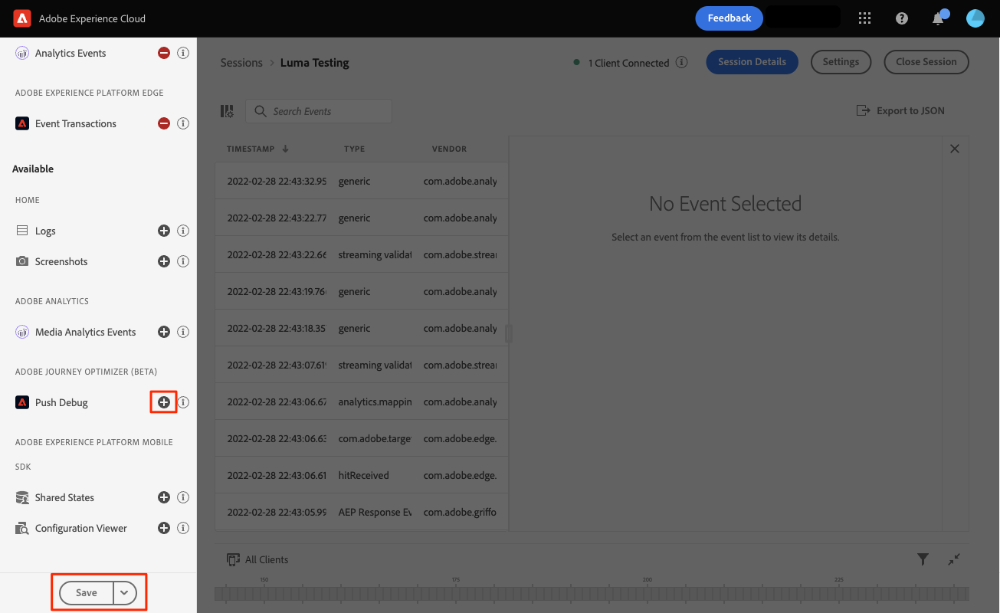

# Adobe Journey Optimizer 푸시 메시지

Platform Mobile SDK 및 Adobe Journey Optimizer을 사용하여 모바일 앱용 푸시 메시지를 만드는 방법을 알아봅니다.

Journey Optimizer을 사용하면 여정을 만들고 타겟팅된 대상자에게 메시지를 보낼 수 있습니다. Journey Optimizer을 사용하여 푸시 알림을 전송하기 전에 적절한 구성 및 통합이 있는지 확인해야 합니다. Adobe Journey Optimizer의 푸시 알림 데이터 흐름을 이해하려면 다음을 참조하십시오. [설명서](https://experienceleague.adobe.com/docs/journey-optimizer/using/configuration/configuration-message/push-config/push-gs.html).

>[!NOTE]
>
>이 단원은 선택 사항이며 푸시 메시지를 전송하려는 Adobe Journey Optimizer 사용자에게만 적용됩니다.


## 사전 요구 사항

* SDK가 설치 및 구성된 앱을 빌드하고 실행했습니다.
* Adobe Journey Optimizer에 대한 액세스 및 설명된 대로 충분한 권한 [여기](https://experienceleague.adobe.com/docs/journey-optimizer/using/configuration/configuration-message/push-config/push-configuration.html?lang=en). 또한 다음 Adobe Journey Optimizer 기능에 대한 충분한 권한이 필요합니다.
   * 앱 표면을 만듭니다.
   * 여정 만들기
   * 메시지 만들기.
   * 메시지 사전 설정 만들기.
* 인증서, 식별자 및 키를 만들 수 있는 충분한 액세스 권한이 있는 유료 Apple 개발자 계정입니다.
* 테스트를 위한 물리적 iOS 장치.

## 학습 목표

이 단원에서는 다음 작업을 수행합니다.

* APN(Apple 푸시 알림 서비스)에 앱 ID를 등록합니다.
* 만들기 **[!UICONTROL 앱 표면]** AJO에서.
* 업데이트 **[!UICONTROL 스키마]** 푸시 메시지 필드를 포함합니다.
* 설치 및 구성 **[!UICONTROL Adobe Journey Optimizer]** 태그 확장.
* AJO 태그 확장을 포함하도록 앱을 업데이트합니다.
* Assurance에서 설정의 유효성을 검사합니다.
* 테스트 메시지를 보냅니다.


## APN에 앱 ID 등록

다음 단계는 Adobe Experience Cloud 전용이 아니며 APN 구성을 안내하도록 설계되었습니다.

### 만들기 `.p8` 개인 키

1. Apple 개발자 포털에서 **[!UICONTROL 키]**.
1. 키를 만들려면 + 아이콘을 선택합니다.
   

1. 다음을 제공합니다. **[!UICONTROL 키 이름]**.
1. 다음 항목 선택 **[!UICONTROL APN]** 확인란.
1. 선택 **[!UICONTROL 계속]**.
   
1. 구성 검토 및 선택 **[!UICONTROL 등록]**.
1. 다운로드 `.p8` 개인 키. 앱 표면 구성에서 사용됩니다.
1. 다음을 기록해 둡니다. **[!UICONTROL 키 ID]**. 앱 표면 구성에서 사용됩니다.

추가 설명서는 다음과 같습니다. [여기에서 찾음](https://help.apple.com/developer-account/#/devcdfbb56a3).

### Apple 개발자 팀 ID 가져오기

1. Apple 개발자 포털에서 **[!UICONTROL 멤버십]**.
1. 사용자 **[!UICONTROL 팀 ID]** 은 다른 멤버십 정보와 함께 나열됩니다. 앱 표면 구성에서 사용됩니다.

## 데이터 수집에서 앱 푸시 자격 증명 추가

1. 다음에서 [데이터 수집 인터페이스](https://experience.adobe.com/data-collection/)왼쪽 패널에서 앱 표면 탭을 선택합니다.
1. 선택 **[!UICONTROL 앱 표면 만들기]** 구성을 만듭니다.
   
1. 입력 **[!UICONTROL 이름]** 예를 들어 구성의 경우 `Luma App Tutorial`  .
1. 모바일 애플리케이션 구성에서 을 선택합니다. **[!UICONTROL Apple iOS]**.
1. 앱 ID(iOS 번들 ID) 필드에 모바일 앱 번들 ID를 입력합니다. Luma 앱과 함께 다음을 수행하는 경우 해당 값은 다음과 같습니다. `com.adobe.luma.tutorial`.
1. 전환 **[!UICONTROL 푸시 자격 증명]** 자격 증명을 추가하는 버튼입니다.
1. 을(를) 끌어다 놓기 `.p8` **Apple 푸시 알림 인증 키** 파일.
1. 생성 중에 할당된 10자 문자열인 키 ID를 입력합니다. `p8` 인증 키. 의 키 탭에서 찾을 수 있습니다. **인증서, 식별자 및 프로필** 페이지를 가리키도록 업데이트하는 중입니다.
1. 팀 ID를 입력합니다. 문자열 값이며, 아래에 있습니다. **멤버십** 탭.
1. **[!UICONTROL 저장]**을 선택합니다.
   

## Adobe Journey Optimizer 태그 확장 설치

1. 다음으로 이동 [!UICONTROL 태그] > [!UICONTROL 확장] > [!UICONTROL 카탈로그]을(를) 클릭하고 **[!UICONTROL Adobe Journey Optimizer]** 확장명.
1. 확장을 설치합니다.
   
1. 선택 `CJM Push Tracking Experience Event Dataset` Adobe Experience Platform 데이터 세트입니다.
   
1. 선택 **[!UICONTROL 라이브러리 및 빌드에 저장]**.

>[!NOTE]
>&quot;CJM 푸시 추적 경험 이벤트 데이터 세트&quot;가 옵션으로 표시되지 않는 경우 고객 지원 센터에 문의하십시오.
>

## 앱에서 Adobe Journey Optimizer 구현

이전 단원에서 설명한 대로 모바일 태그 확장을 설치하면 구성만 제공됩니다. 그런 다음 메시징 SDK를 설치하고 등록해야 합니다. 이 단계가 명확하지 않으면 다음을 검토하십시오. [SDK 설치](install-sdks.md) 섹션.

>[!NOTE]
>
>을(를) 완료한 경우 [SDK 설치](install-sdks.md) 섹션에서 SDK가 이미 설치되어 있는 경우 #7단계로 건너뛸 수 있습니다.

1. 을(를) 엽니다 `Podfile` 다음 줄을 추가하고 파일을 저장합니다.

   `pod 'AEPMessaging', '~>1'`
1. 터미널을 열고 다음 폴더가 포함된 폴더로 이동합니다. `Podfile`.
1. 명령을 실행하여 SDK 설치 `pod install`.
   
1. XCode를 열고 로 이동합니다. `AppDelegate.swift`.
1. 가져오기 목록에 다음을 추가하십시오.

   `import AEPMessaging`
1. 추가 `Messaging.self` 을 추가하여 등록 중인 확장 배열에 추가합니다.
1. 다음 함수를 파일에 추가합니다.

   ```swift
   func application(_: UIApplication, didRegisterForRemoteNotificationsWithDeviceToken deviceToken: Data) {
       MobileCore.setPushIdentifier(deviceToken)
   }
   ```

   이 함수는 앱이 설치된 장치에 고유한 장치 토큰을 검색하고 푸시 메시지 전달을 위해 Adobe/Apple으로 전송합니다.

## 테스트 푸시 메시지를 보내 유효성 확인

1. 리뷰 [설치 지침](assurance.md) 섹션.
1. 실제 장치에 앱을 설치합니다.
1. 보증 생성 URL을 사용하여 앱을 실행합니다.
1. 앱을 백그라운드로 보냅니다.
1. Assurance UI에서 **[!UICONTROL 구성]**.
   
1. 다음 항목 선택 **[!UICONTROL +]** 단추 옆에 있음 **[!UICONTROL 푸시 디버그]**.
1. **[!UICONTROL 저장]**을 선택합니다.
   
1. 선택 **[!UICONTROL 푸시 디버그]** 왼쪽 탐색에서.
1. 에서 장치 선택 **[!UICONTROL 클라이언트 목록]**.
1. 오류가 발생하지 않는지 확인합니다.
   
1. 아래로 스크롤하여 선택 **[!UICONTROL 테스트 푸시 알림 보내기]**.
1. 및 오류가 발생하지 않는지, 그리고 장치에서 메시지를 수신하는지 확인합니다.
   

다음: **[결론 및 다음 단계](conclusion.md)**

>[!NOTE]
>
>Adobe Experience Platform Mobile SDK에 대해 학습하는 데 시간을 투자해 주셔서 감사합니다. 질문이 있거나, 일반적인 피드백을 공유하거나, 향후 콘텐츠에 대한 제안이 있는 경우 이에 대해 공유하십시오. [Experience League 커뮤니티 토론 게시물](https://experienceleaguecommunities.adobe.com/t5/adobe-experience-platform-launch/tutorial-discussion-implement-adobe-experience-cloud-in-mobile/td-p/443796)