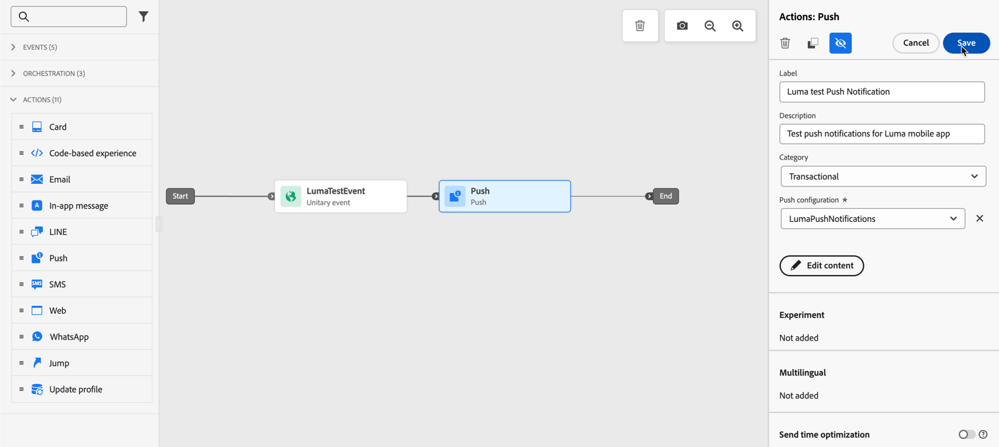
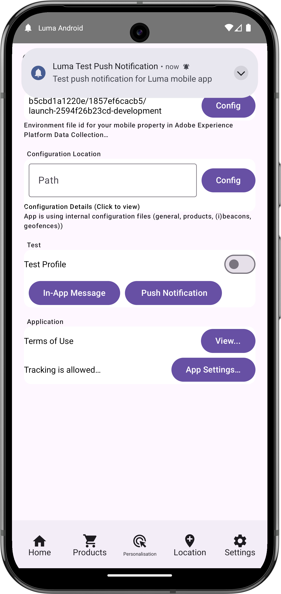

# 푸시 알림 구성 및 전송

Experience Platform Mobile SDK 및 Journey Optimizer을 사용하여 모바일 앱용 푸시 알림을 만드는 방법을 알아봅니다.

Journey Optimizer을 사용하면 여정을 만들고 타겟팅된 대상자에게 메시지를 보낼 수 있습니다. Journey Optimizer을 사용하여 푸시 알림을 전송하기 전에 적절한 구성 및 통합이 있는지 확인해야 합니다. Journey Optimizer의 푸시 알림 데이터 흐름을 이해하려면 [설명서](https://experienceleague.adobe.com/en/docs/journey-optimizer/using/channels/push/push-config/push-gs)를 참조하세요.

{zoomable="yes"}

>[!NOTE]
>
>이 단원은 선택 사항이며 푸시 알림을 전송하려는 Journey Optimizer 사용자에게만 적용됩니다.


## 전제 조건

* SDK가 설치 및 구성된 앱을 빌드하고 실행했습니다.
* Adobe Experience Platform용 앱을 설정합니다.
* Journey Optimizer 및 [충분한 권한](https://experienceleague.adobe.com/en/docs/journey-optimizer/using/channels/push/push-config/push-configuration)에 대한 액세스 권한. 또한 다음 Journey Optimizer 기능에 대한 충분한 권한이 필요합니다.
   * 푸시 자격 증명을 만듭니다.
   * 푸시 채널 구성을 만듭니다.
   * 여정 만들기
   * 메시지를 만듭니다.
   * 메시지 사전 설정을 만듭니다.
* iOS의 경우 인증서, 식별자 및 키를 만들 수 있는 충분한 액세스 권한을 가진 **유료 Apple 개발자 계정**&#x200B;입니다.
* Android의 경우 인증서 및 키를 만들 수 있는 충분한 액세스 권한이 있는 Google 개발자 계정입니다.
* 테스트를 위한 물리적 iOS 또는 Android 장치 또는 시뮬레이터.

## 학습 목표

이 단원에서는 다음과 같은 작업을 수행합니다

* APNs(Apple 푸시 알림 서비스)에 앱 ID를 등록합니다.
* Journey Optimizer에서 채널 구성을 만듭니다.
* 푸시 메시지 필드를 포함하도록 스키마를 업데이트합니다.
* Journey Optimizer 태그 확장 설치 및 구성
* 앱을 업데이트하여 Journey Optimizer 태그 확장을 등록합니다.
* Assurance에서 설정의 유효성을 검사합니다.
* Assurance에서 테스트 메시지 보내기
* Journey Optimizer에서 고유한 푸시 알림 이벤트, 여정 및 경험을 정의합니다.
* 앱 내에서 나만의 푸시 알림을 보냅니다.


## 설정

>[!TIP]
>
>[Journey Optimizer 인앱 메시지](journey-optimizer-inapp.md) 단원의 일부로 환경을 이미 설정한 경우 이 설정 섹션의 일부 단계를 이미 수행했을 수 있습니다.

### 푸시 자격 증명 만들기

푸시 알림의 경우 먼저 푸시 알림에 대한 앱을 등록해야 합니다.

>[!BEGINTABS]

>[!TAB iOS]

다음 단계는 Adobe Experience Cloud 전용이 아니며 APNs 구성을 안내하도록 설계되었습니다.

1. Apple 개발자 포털에서 **[!UICONTROL 키]**(으)로 이동합니다.
1. 키를 만들려면 **[!UICONTROL +]**&#x200B;을(를) 선택합니다.

   {zoomable="yes"}

1. **[!UICONTROL 키 이름]**&#x200B;을 입력하십시오.
1. **[!UICONTROL Apple 푸시 알림 서비스] (APNs)**&#x200B;를 선택하고 **[!UICONTROL 구성]**&#x200B;을 선택합니다.
   1. **[!UICONTROL 키 구성]** 화면의 **[!UICONTROL 환경]** 드롭다운 메뉴에서 **[!UICONTROL 샌드박스 및 프로덕션]**&#x200B;을(를) 선택합니다.
   1. **[!UICONTROL 저장]**&#x200B;을 선택합니다.
1. **[!UICONTROL 계속]**&#x200B;을 선택하세요.

   {zoomable="yes"}

1. 구성을 검토하고 **[!UICONTROL 등록]**&#x200B;을 선택하세요.
1. `.p8` 개인 키를 다운로드합니다. 다음 연습에서는 Journey Optimizer 푸시 자격 증명을 구성할 때 사용됩니다.
1. **[!UICONTROL 키 ID]**&#x200B;을(를) 메모하세요. 다음 연습에서는 Journey Optimizer 푸시 자격 증명을 구성할 때 사용됩니다.
1. **[!UICONTROL 팀 ID]**&#x200B;를 메모하세요. 다음 연습에서는 Journey Optimizer 푸시 자격 증명을 구성할 때 사용됩니다. 팀 ID는 화면 오른쪽 상단의 로그인 이름 옆에 있습니다.
   {zoomable="yes"}

추가 설명서는 [여기에서 찾을 수 있음](https://help.apple.com/developer-account/#/devcdfbb56a3).

>[!TAB Android]

다음 단계는 Adobe Experience Cloud 전용이 아니며 Firebase 구성을 안내하도록 설계되었습니다.

1. Firebase 콘솔에 액세스합니다.
1. **[!UICONTROL Firebase 프로젝트 만들기]**&#x200B;를 선택합니다.
   1. **[!UICONTROL 프로젝트 이름]**&#x200B;을(를) 입력하십시오.
   1. **[!UICONTROL 프로젝트 만들기]**&#x200B;에서 **[!UICONTROL 계속]**&#x200B;을 선택합니다. - **[!UICONTROL 프로젝트 이름으로 시작하겠습니다]**. 예, `Luma Android App.`
   1. Firebase에서 **[!UICONTROL Gemini를 비활성화하고]**&#x200B;에서 **[!UICONTROL 계속]**&#x200B;을(를) 선택합니다. **[!UICONTROL 프로젝트 만들기]** - **[!UICONTROL Firebase 프로젝트에 대한 AI 지원]**.
   1. 이 프로젝트에 대해 **[!UICONTROL Google Analytics을 사용하지 않도록 설정]**&#x200B;하고 **[!UICONTROL 프로젝트 만들기]** - **[!UICONTROL Firebase 프로젝트에 대한 Google Analytics]**&#x200B;에서 **[!UICONTROL 계속]**&#x200B;을 선택합니다.
   1. **[!UICONTROL 프로젝트 만들기]**&#x200B;를 선택합니다.
   1. 프로젝트가 준비되면 **[!UICONTROL 계속]**&#x200B;을 선택합니다.

1. Firebase 콘솔로 돌아가서 맨 위에서 프로젝트가 선택되었는지 확인합니다. 예: **[!UICONTROL Luma Android 앱]**.

   {zoomable="yes"}

1.  > **[!UICONTROL 프로젝트 설정]**&#x200B;을 선택합니다.

1. **[!UICONTROL 프로젝트 설정]**&#x200B;에서 **[!UICONTROL 앱 추가]**&#x200B;를 선택합니다.
   1. **[!UICONTROL 앱에 Firebase 추가]**&#x200B;에서 플랫폼으로 **[!UICONTROL Android]**&#x200B;을(를) 선택합니다.
   1. **[!UICONTROL Android 앱에 Firebase 추가:]**
      1. 1단계에서 **[!UICONTROL 앱 등록]**:
         1. 앱 식별자와 유사한 Android 패키지 이름을 입력합니다. 예: `com.adobe.luma.tutorial.android`.
         1. 선택적 **[!UICONTROL 앱 별명]**&#x200B;을 입력하세요.
         1. **[!UICONTROL 앱 등록]**&#x200B;을 선택합니다.
      1. 2단계에서 **[!UICONTROL 구성 파일을 다운로드한 다음 추가]**&#x200B;합니다.
         1.  **[!UICONTROL google-services.json 다운로드]**&#x200B;를 선택합니다. 자체 버전의 Android 앱을 빌드할 때 샘플 Android Studio 프로젝트의 현재 `google-services.json` 파일을 이 새 앱 구성에서 생성된 파일 버전으로 바꾸어야 합니다.
다른 단계는 이미 샘플 앱에서 처리되었습니다.

   화면은 다음과 같아야 합니다.

   {zoomable="yes"}

1. **[!UICONTROL 프로젝트 설정]**&#x200B;에서 **[!UICONTROL 서비스 계정]**&#x200B;을 선택하세요.
1. **[!UICONTROL 새 개인 키 생성]**&#x200B;을 선택합니다. `luma-android-app-firebase-adminsdk-xxxx-xxxxxxxx.json` 파일이 생성되었습니다. 이 파일을 안전한 장소에 보관하십시오. 나중에 파일이 필요할 때 보관하십시오.

자세한 내용은 [Firebase 개발자 설명서](https://firebase.google.com/docs)를 참조하십시오.

>[!ENDTABS]

### 데이터 수집에서 앱 푸시 자격 증명 추가

그런 다음 모바일 애플리케이션 푸시 자격 증명을 추가하여 Adobe이 사용자를 대신하여 푸시 알림을 전송하도록 승인해야 합니다. 데이터 수집 또는 Journey Optimizer에서 푸시 자격 증명을 추가할 수 있습니다. 이 자습서에서는 데이터 수집 인터페이스를 사용합니다. 그런 다음 푸시 자격 증명이 Journey Optimizer의 채널 구성에 연결됩니다.

1. 데이터 수집에서 **[!UICONTROL 앱 표면]**&#x200B;을 선택합니다.
1. **[!UICONTROL 앱 표면 만들기]**&#x200B;를 선택합니다.
1. **[!UICONTROL 앱 표면 만들기]** 인터페이스에서:
   1. **[!UICONTROL 이름]**&#x200B;을(를) 입력하십시오.
   1. iOS에 대한 푸시 알림을 전송하려면 **[!UICONTROL Apple iOS]**&#x200B;을(를) 선택하십시오.
      1. **[!UICONTROL 앱 ID]**&#x200B;를 입력하세요(예: `com.adobe.luma.tutorial.swiftui`).
      1. 샌드박스를 선택합니다(선택 사항).
      1. **[!UICONTROL 푸시 자격 증명]**&#x200B;을 사용하도록 설정합니다.
      1. 저장된 `.p8` 개인 키 파일을 **[!UICONTROL 끌어다 놓기]**&#x200B;합니다.
      1. **[!UICONTROL 키 ID]**&#x200B;를 입력하십시오.
      1. **[!UICONTROL 팀 ID]**&#x200B;를 입력하십시오.
   1. Android에 대한 푸시 알림을 보내려면 **[!UICONTROL Android]**&#x200B;을(를) 선택하십시오.
      1. **[!UICONTROL 앱 ID]**&#x200B;를 입력하세요(예: `com.adobe.luma.tutorial.android`).
      1. 샌드박스를 선택합니다(선택 사항).
      1. **[!UICONTROL 푸시 자격 증명]**&#x200B;을 사용하도록 설정합니다.
      1. 저장된 `luma-android-app-firebase-adminsdk-xxxx-xxxxxxxx.json` 파일을 **[!UICONTROL 끌어다 놓기]**&#x200B;합니다.

   {zoomable="yes"}

1. **[!UICONTROL 저장]**&#x200B;을 선택합니다. 모든 정보가 올바른 경우 채널 구성과 연결할 푸시 자격 증명을 만들었습니다.


### Journey Optimizer에서 푸시에 대한 채널 구성 만들기

푸시 자격 증명 구성을 만든 다음에는 Journey Optimizer에서 푸시 알림을 전송할 수 있는 구성을 만들어야 합니다.

1. Journey Optimizer 인터페이스에서 **[!UICONTROL 채널]** > **[!UICONTROL 일반 설정]** > **[!UICONTROL 채널 구성]** 메뉴를 연 다음 **[!UICONTROL 채널 구성 만들기]**&#x200B;를 선택합니다.

   {zoomable="yes"}

1. 구성의 이름 및 설명(선택 사항)을 입력합니다.

   >[!NOTE]
   >
   > 이름은 문자(A-Z)로 시작해야 합니다. 영숫자만 포함할 수 있습니다. 밑줄 `_`, 점 `.`, 하이픈 `-`도 사용할 수 있습니다.


1. 구성에 사용자 지정 또는 핵심 데이터 사용 레이블을 할당하려면 **[!UICONTROL 액세스 관리]**&#x200B;를 선택할 수 있습니다. [OLAC(개체 수준 액세스 제어)에 대해 자세히 알아보세요](https://experienceleague.adobe.com/en/docs/journey-optimizer/using/access-control/object-based-access).

1. **푸시** 채널을 선택하십시오.


1. 이 구성을 사용하여 동의 정책을 메시지와 연결하려면 **[!UICONTROL 마케팅 액션]**&#x200B;을(를) 선택하십시오. 마케팅 작업과 관련된 모든 동의 정책은 고객의 선호도를 존중하도록 활용됩니다. [마케팅 액션에 대해 자세히 알아보기](https://experienceleague.adobe.com/en/docs/journey-optimizer/using/privacy/consent/consent#surface-marketing-actions).

1. **[!UICONTROL 플랫폼]**&#x200B;을 선택하세요. 채널 구성에 대해 **[!UICONTROL iOS]** 및 **[!UICONTROL Android]**&#x200B;을(를) 모두 구성할 수 있습니다.

1. 푸시 자격 증명을 정의하는 데 이전에 사용한 적절한 **[!UICONTROL 앱 ID]**&#x200B;을(를) 선택합니다. 예를 들어, iOS의 경우 **[!UICONTROL com.adobe.luma.tutorial.swiftui]**, Android의 경우 **[!UICONTROL com.adobe.luma.tutorial.android]**&#x200B;입니다. 녹색 은 올바른 푸시 자격 증명이 채널 구성과 연결되어 있음을 나타냅니다.


   {zoomable="yes"}

1. 변경 내용을 저장하려면 **[!UICONTROL 제출]**&#x200B;을 선택하십시오.


### 데이터 스트림 구성 업데이트

모바일 앱에서 Edge Network으로 전송된 데이터가 Journey Optimizer으로 전달되도록 하려면 Experience Edge 구성을 업데이트 하십시오.

1. 데이터 수집 UI에서 **[!UICONTROL 데이터스트림]**&#x200B;을(를) 선택하고 데이터스트림(예: **[!DNL Luma Mobile App]**)을 선택합니다.
1. 에 대해 **[!UICONTROL 자세히]**&#x200B;를 선택하고 상황에 맞는 메뉴에서  **[!UICONTROL 편집]**&#x200B;을 선택합니다.
1. **[!UICONTROL 데이터스트림]** >  > **[!UICONTROL Adobe Experience Platform]** 화면에서 다음을 수행합니다.

   1. 아직 선택하지 않은 경우 **[!UICONTROL 프로필 데이터 세트]**&#x200B;에서 **[!UICONTROL AJO 푸시 프로필 데이터 세트]**&#x200B;을(를) 선택하십시오. `MobileCore.setPushIdentifier` API 호출을 사용할 때 이 프로필 데이터 세트가 필요합니다([푸시 알림에 대한 장치 토큰 등록](#register-device-token-for-push-notifications) 참조). 또한 이 옵션을 선택하면 푸시 알림의 고유 식별자(푸시 식별자)가 사용자 프로필의 일부로 저장됩니다.

   1. **[!UICONTROL Adobe Journey Optimizer]**&#x200B;을(를) 선택했습니다. 자세한 내용은 [Adobe Experience Platform 설정](https://experienceleague.adobe.com/en/docs/experience-platform/datastreams/configure)을 참조하세요.

   1. 데이터스트림 구성을 저장하려면 **[!UICONTROL 저장]**&#x200B;을 선택합니다.

   {zoomable="yes"}


### Journey Optimizer 태그 확장 설치

앱이 Journey Optimizer에서 작동하려면 태그 속성을 업데이트해야 합니다.

1. **[!UICONTROL 태그]** > **[!UICONTROL 확장]** > **[!UICONTROL 카탈로그]**(으)로 이동합니다.
1. 속성을 엽니다(예: **[!DNL Luma Mobile App Tutorial]**).
1. **[!UICONTROL 카탈로그]**&#x200B;를 선택하십시오.
1. **[!UICONTROL Adobe Journey Optimizer]** 확장을 검색합니다.
1. 확장을 설치합니다.
1. **[!UICONTROL 확장 설치]** 대화 상자에서
   1. 환경을 선택하십시오(예: **[!UICONTROL 개발]**).
   1. **[!UICONTROL 이벤트 데이터 세트]** 목록에서 **[!UICONTROL AJO 푸시 추적 경험 이벤트 데이터 세트]** 데이터 세트를 선택합니다.
   1. **[!UICONTROL 라이브러리 및 빌드에 저장]**&#x200B;을 선택합니다.
      {zoomable="yes"}

>[!NOTE]
>
>옵션으로 **[!UICONTROL AJO 푸시 추적 경험 이벤트 데이터 세트]**&#x200B;가 표시되지 않으면 고객 지원 센터에 문의하십시오.
>

## Assurance으로 설정 유효성 검사

1. [설치 지침](assurance.md#connecting-to-a-session) 섹션을 검토하여 시뮬레이터 또는 장치를 Assurance에 연결하십시오.
1. Assurance UI에서 **[!UICONTROL 구성]**&#x200B;을 선택합니다.
   {zoomable="yes"}
1.  옆에 있는 **[!UICONTROL 플러스]**&#x200B;를 선택합니다.
1. **[!UICONTROL 저장]**&#x200B;을 선택합니다.
   {zoomable="yes"}
1. 왼쪽 탐색에서 **[!UICONTROL 디버그 푸시]**&#x200B;를 선택합니다.
1. **[!UICONTROL 설정 유효성 검사]** 탭을 선택합니다.
1. **[!UICONTROL 클라이언트]** 목록에서 장치를 선택하십시오.
1. 오류가 발생하지 않는지 확인합니다.
   {zoomable="yes"}
1. **[!UICONTROL 테스트 푸시 보내기]** 탭을 선택합니다.
1. (선택 사항) **[!UICONTROL 제목]** 및 **[!UICONTROL 본문]**&#x200B;에 대한 기본 세부 정보를 변경하고 **[!UICONTROL 고급]** > **[!UICONTROL 알림 채널]**(예: `LUMA_CHANNEL_ID` Android에 필요)과 같이 앱에서 예상하는 모든 매개 변수를 제공하는지 확인하십시오.
1.  **[!UICONTROL 테스트 푸시 알림 보내기]**&#x200B;를 선택합니다.
1. **[!UICONTROL 테스트 결과]**&#x200B;를 확인하세요.

   {zoomable="yes"}
1. 앱에 테스트 푸시 알림이 표시되는 것을 확인해야 합니다.

>[!BEGINTABS]

>[!TAB iOS]


>[!TAB Android]


>[!ENDTABS]

## 서명

>[!IMPORTANT]
>
>iOS 앱에 서명하려면 iOS에서 푸시 알림을 보내야 하며 **유료 Apple 개발자 계정이 필요합니다**. 푸시 알림을 전송하기 위해 Android 앱에 서명할 필요가 없습니다.


앱에 대한 서명을 업데이트하려면:

1. Xcode에서 앱으로 이동합니다.
1. Project 탐색기에서 **[!DNL Luma]**&#x200B;을(를) 선택합니다.
1. **[!DNL Luma]** 대상을 선택하십시오.
1. **서명 및 기능** 탭을 선택합니다.
1. **[!UICONTROL 서명 자동 관리]**, **[!UICONTROL 팀]** 및 **[!UICONTROL 번들 식별자]**&#x200B;를 구성하거나 특정 Apple 개발 프로비저닝 세부 정보를 사용합니다.

   >[!IMPORTANT]
   >
   >각 번들 식별자가 고유해야 하므로 _unique_ 번들 식별자를 사용하고 `com.adobe.luma.tutorial.swiftui` 번들 식별자를 바꾸십시오. 일반적으로 `com.organization.brand.uniqueidentifier`과(와) 같은 번들 ID 문자열에 역방향 DNS 형식을 사용합니다. 이 자습서의 완성된 버전은 `com.adobe.luma.tutorial.swiftui`을(를) 사용합니다.


   {zoomable="yes"}


## 앱에 푸시 알림 기능 추가

>[!IMPORTANT]
>
>iOS 앱에서 푸시 알림을 구현하고 테스트하려면 **유료** Apple 개발자 계정이 있어야 합니다.

>[!BEGINTABS]

>[!TAB iOS]

1. Xcode의 **[!DNL Luma]** TARGETS **[!UICONTROL 목록에서]**&#x200B;을(를) 선택하고, **[!UICONTROL 서명 및 기능]** 탭을 선택하고, **[!UICONTROL + 기능]** 버튼을 선택한 다음 **[!UICONTROL 푸시 알림]**&#x200B;을 선택합니다. 이 옵션을 선택하면 앱에서 푸시 알림을 수신할 수 있습니다.

1. 그런 다음 앱에 알림 확장 기능을 추가해야 합니다. **[!DNL General]** 탭으로 돌아가서 **[!UICONTROL TARGETS]** 섹션 아래쪽의 **[!UICONTROL +]** 아이콘을 선택하십시오.

1. 새 타겟에 대한 템플릿을 선택하라는 메시지가 표시됩니다. **[!UICONTROL 알림 서비스 확장]**&#x200B;을 선택한 다음 **[!UICONTROL 다음]**&#x200B;을 선택합니다.

1. 다음 창에서 확장 이름으로 `NotificationExtension`을(를) 사용하고 **[!UICONTROL 마침]** 단추를 클릭합니다.

이제 아래 화면과 유사하게 앱에 푸시 알림 확장 기능이 추가되어야 합니다.

{zoomable="yes"}

>[!TAB Android]

Android Studio 프로젝트가 이미 푸시 알림용으로 설정되어 있습니다. 푸시 알림용 Luma 앱의 Android 버전을 활성화하기 위해 추가 단계를 수행할 필요가 없습니다. 자세한 내용은 [알림 정보](https://developer.android.com/develop/ui/views/notifications)를 참조하세요.

Android 푸시 알림은 앱과 푸시 알림을 전송할 때 모두 알림 채널 id를 정의해야 합니다. Android Luma 앱에 사용되는 채널 알림 ID는 `LUMA_CHANNEL ID`입니다.

>[!ENDTABS]


## 앱에서 Journey Optimizer 구현

이전 단원에서 설명한 대로 모바일 태그 확장을 설치하면 구성만 제공됩니다. 그런 다음 메시징 SDK을 설치하고 등록해야 합니다. 이 단계가 명확하지 않으면 [SDK 설치](install-sdks.md) 섹션을 검토하십시오.

>[!NOTE]
>
>[SDK 설치](install-sdks.md) 섹션을 완료한 경우 SDK이 이미 설치되어 있으므로 이 단계를 건너뛸 수 있습니다.
>

>[!BEGINTABS]

>[!TAB iOS]

1. Xcode에서 [AEP Messaging](https://github.com/adobe/aepsdk-messaging-ios)이(가) 패키지 종속 항목의 패키지 목록에 추가되어 있는지 확인하십시오. [Swift 패키지 관리자](install-sdks.md#swift-package-manager)를 참조하세요.
1. Xcode 프로젝트 탐색기에서 **[!DNL Luma]** > **[!DNL Luma]** > **[!UICONTROL AppDelegate]**(으)로 이동합니다.
1. `AEPMessaging`이(가) 가져오기 목록의 일부인지 확인하십시오.

   `import AEPMessaging`

1. `Messaging.self`이(가) 등록 중인 확장 배열의 일부인지 확인하십시오.

   ```swift
   let extensions = [
       AEPIdentity.Identity.self,
       Lifecycle.self,
       Signal.self,
       Edge.self,
       AEPEdgeIdentity.Identity.self,
       Consent.self,
       UserProfile.self,
       Places.self,
       Messaging.self,
       Optimize.self,
       Assurance.self
   ]
   ```

>[!TAB Android]

1. Android Studio에서 [aepsdk-messaging-android](https://github.com/adobe/aepsdk-messaging-android)이(가) **[!UICONTROL Android:app]** VBoxDown **&#x200B;**&#x200B;Gradle Scriptsbuild.gradle.kts(모듈 **[!UICONTROL )]**&#x200B;에 있는 종속성의 일부인지 확인하십시오. [Gradle](install-sdks.md#gradle)을(를) 참조하세요.
1. Android Studio 프로젝트 탐색기에서 **[!UICONTROL Android]**  > **[!DNL app]** > **[!DNL kotlin+java]** > **[!UICONTROL com.adobe.luma.tutorial.android]** > **[!UICONTROL LumaApplication]**&#x200B;으로 이동합니다.
1. `com.adobe.marketing.mobile.Messaging`이(가) 가져오기 목록의 일부인지 확인하십시오.

   `import import com.adobe.marketing.mobile.Messaging`

1. `Messaging.EXTENSION`이(가) 등록 중인 확장 배열의 일부인지 확인하십시오.

   ```kotlin
   val extensions = listOf(
       Identity.EXTENSION,
       Lifecycle.EXTENSION,
       Signal.EXTENSION,
       Edge.EXTENSION,
       Consent.EXTENSION,
       UserProfile.EXTENSION,
       Places.EXTENSION,
       Messaging.EXTENSION,
       Optimize.EXTENSION,
       Assurance.EXTENSION
   )
   ```

>[!ENDTABS]


## 푸시 알림용 장치 토큰 등록

푸시 알림을 받으려면 장치 토큰을 등록해야 합니다.

>[!BEGINTABS]

>[!TAB iOS]

1. Xcode 프로젝트 탐색기에서 **[!DNL Luma]** > **[!DNL Luma]** > **[!UICONTROL AppDelegate]**(으)로 이동합니다.
1. [`MobileCore.setPushIdentifier`](https://developer.adobe.com/client-sdks/documentation/mobile-core/api-reference/#setpushidentifier) API를 `func application(_ application: UIApplication, didRegisterForRemoteNotificationsWithDeviceToken deviceToken: Data)` 함수에 추가합니다.

   ```swift
   // Send push token to Mobile SDK
   MobileCore.setPushIdentifier(deviceToken)
   ```

   이 함수는 앱이 설치된 장치에 고유한 장치 토큰을 검색합니다. 그런 다음 설정한 구성을 사용하여 푸시 알림 전달을 위한 토큰을 설정하고 Apple의 APNs(푸시 알림 서비스)를 사용합니다.

>[!TAB Android]

1. Android Studio 프로젝트 탐색기에서 **[!UICONTROL Android]**  > **[!DNL app]** > **[!DNL kotlin+java]** > **[!UICONTROL com.adobe.luma.tutorial.android]** > **[!UICONTROL LumaApplication]**&#x200B;으로 이동합니다.
1. [`MobileCore.setPushIdentifier`](https://developer.adobe.com/client-sdks/documentation/mobile-core/api-reference/#setpushidentifier) API를 `override fun onCreate()`의 `class LumaAplication : Application`에 있는 `FirebaseMessaging.getInstance().token.addOnCompleteListener` 함수에 추가합니다.

   ```kotlin
   // Send push token to Mobile SDK
   MobileCore.setPushIdentifier(token)
   ```

   이 함수는 앱이 설치된 장치에 고유한 장치 토큰을 검색합니다. 그런 다음 설정한 구성을 사용하여 푸시 알림 전달을 위한 토큰을 설정하고 FCM(Firebase Cloud Messaging)을 사용합니다.

>[!ENDTABS]

>[!IMPORTANT]
>
>**iOS 전용**: `MobileCore.updateConfigurationWith(configDict: ["messaging.useSandbox": true])`은(는) 푸시 알림이 푸시 알림을 전송하기 위해 APNs 샌드박스 또는 프로덕션 서버를 사용하는지 여부를 결정합니다. 시뮬레이터 또는 장치에서 앱을 테스트할 때 푸시 알림을 받을 수 있도록 `messaging.useSandbox`이 `true`(으)로 설정되어 있는지 확인하십시오. Apple의 Testflight를 사용하여 테스트하기 위해 프로덕션 앱을 배포할 때 `messaging.useSandbox`을(를) `false`(으)로 설정해야 합니다. 그렇지 않으면 프로덕션 앱에서 푸시 알림을 받을 수 없습니다.<br/><br/>
>&#x200B;>Firebase Cloud Messaging(FCM)은 푸시 알림에 대한 샌드박스 개념을 지원하지 **않습니다**.


## 나만의 푸시 알림 만들기

고유한 푸시 알림을 만들려면 푸시 알림 전송을 처리하는 여정을 트리거하는 이벤트를 Journey Optimizer에서 정의해야 합니다.

### 스키마 업데이트

스키마에 정의된 이벤트 목록의 일부로 아직 사용할 수 없는 새 이벤트 유형을 정의하려고 합니다. 나중에 푸시 알림을 트리거할 때 이 이벤트 유형을 사용합니다.

1. Journey Optimizer UI의 왼쪽 레일에서 **[!UICONTROL 스키마]**&#x200B;를 선택합니다.
1. 탭 표시줄에서 **[!UICONTROL 찾아보기]**&#x200B;를 선택합니다.
1. 스키마를 열려면 스키마(예: **[!DNL Luma Mobile App Event Schema]**)를 선택하십시오.
1. 스키마 편집기에서:
   1. **[!UICONTROL eventType]** 필드를 선택합니다.
   1. **[!UICONTROL 필드 속성]** 창에서 아래로 스크롤하여 이벤트 유형에 사용할 수 있는 값 목록을 확인합니다. **[!UICONTROL 행 추가]**&#x200B;를 선택하고 `application.test`을(를) **[!UICONTROL 값]**(으)로, `[!UICONTROL Test event for push notification]`을(를) `DISPLAY NAME`(으)로 추가합니다.
   1. **[!UICONTROL 적용]**&#x200B;을 선택합니다.
   1. **[!UICONTROL 저장]**&#x200B;을 선택합니다.

      {zoomable="yes"}

### 이벤트 정의

Journey Optimizer의 이벤트를 사용하면 푸시 알림과 같은 메시지를 보내기 위한 여정을 트리거할 수 있습니다. 자세한 내용은 [이벤트 정보](https://experienceleague.adobe.com/en/docs/journey-optimizer/using/configure-journeys/events-journeys/about-events)를 참조하세요.

1. Journey Optimizer UI의 왼쪽 레일에서 **[!UICONTROL 구성]**&#x200B;을 선택합니다.

1. **[!UICONTROL 대시보드]** 화면의 **[!UICONTROL 이벤트]** 타일에서 **[!UICONTROL 관리]** 단추를 선택합니다.

1. **[!UICONTROL 이벤트]** 화면에서 **[!UICONTROL 이벤트 만들기]**&#x200B;를 선택합니다.

1. **[!UICONTROL 이벤트 편집1]** 창에서:

   1. 이벤트의 `LumaTestEvent`이름&#x200B;**[!UICONTROL (으)로]**&#x200B;을(를) 입력하십시오.
   1. **[!UICONTROL 설명]**(예: `Test event to trigger push notifications in Luma app`)을 입력하십시오.

   1. [스키마](create-schema.md) 목록에서 **[!UICONTROL XDM 스키마 만들기]**&#x200B;에서 이전에 만든 모바일 앱 경험 이벤트 스키마를 선택합니다(예: **[!DNL Luma Mobile App Event Schema v.1]**).
   1.  목록 옆의 **[!UICONTROL 편집]**&#x200B;을(를) 선택합니다.

      {zoomable="yes"}

      **[!UICONTROL 필드]** 대화 상자에서 항상 선택된 기본 필드(**[!UICONTROL _id]**, **[!UICONTROL id]**, **[!UICONTROL 타임스탬프]**) 위에 다음 필드가 선택되어 있는지 확인하십시오. 드롭다운 목록을 사용하여 **[!UICONTROL 선택됨]**, **[!UICONTROL 모두]**&#x200B;와(과) **[!UICONTROL 기본]** 사이를 전환하거나  필드를 사용할 수 있습니다.

      * **[!UICONTROL 식별된 응용 프로그램(id)]**,
      * **[!UICONTROL 이벤트 유형(eventType)]**,
      * **[!UICONTROL 기본(기본)]**.

      {zoomable="yes"}

      그런 다음 **[!UICONTROL 확인]**&#x200B;을 선택합니다.

   1.  필드 옆에 있는 **[!UICONTROL 편집]**&#x200B;을 선택합니다.

      1. **[!UICONTROL 이벤트 ID 조건 추가]** 대화 상자에서 **[!UICONTROL 이벤트 유형(eventType)]**&#x200B;을(를) **[!UICONTROL 여기에 요소 끌어다 놓기]**&#x200B;로 끌어다 놓습니다.
      1. 팝오버에서 아래쪽으로 스크롤하여 **[!UICONTROL application.test]**(스키마 업데이트[의 일부로 이벤트 유형 목록에 이전에 추가한 이벤트 유형)을 선택합니다. ](#update-your-schema) 그런 다음 위로 스크롤하여 **[!UICONTROL 확인]**&#x200B;을 선택합니다.
      1. **[!UICONTROL 확인]**&#x200B;을 선택하여 조건을 저장합니다.
         {zoomable="yes"}

   1. **[!UICONTROL 네임스페이스]** 목록에서 **[!UICONTROL ECID(ECID)]**&#x200B;을(를) 선택합니다. 자동으로 **[!UICONTROL 프로필 식별자]** 필드가 **[!UICONTROL 맵 identityMap에 대한 키 ECID의 첫 번째 요소의 ID]**(으)로 채워집니다.
   1. **[!UICONTROL 저장]**&#x200B;을 선택합니다.
      {zoomable="yes"}

이 자습서의 일부로 이전에 만든 모바일 앱 경험 이벤트 스키마를 기반으로 하는 이벤트 구성을 방금 만들었습니다. 이 이벤트 구성은 특정 이벤트 유형(`application.test`)을 사용하여 들어오는 경험 이벤트를 필터링하므로, 모바일 앱에서 시작된 해당 특정 유형의 이벤트만 다음 단계에서 빌드하는 여정을 트리거합니다. 실제 시나리오에서는 외부 서비스에서 푸시 알림을 전송할 수 있습니다. 그러나 동일한 개념이 적용됩니다. 외부 애플리케이션에서 경험 이벤트를 특정 필드가 있는 Experience Platform으로 보내면 이러한 이벤트가 여정을 트리거하기 전에 조건을 적용할 수 있습니다.

### 여정 만들기

다음 단계는 적절한 이벤트를 받을 때 푸시 알림 전송을 트리거하는 여정을 만드는 것입니다.

1. Journey Optimizer UI의 왼쪽 레일에서 **[!UICONTROL 여정]**&#x200B;을(를) 선택합니다.
1. **[!UICONTROL 여정 만들기]**&#x200B;를 선택합니다.
1. **[!UICONTROL 여정 속성]** 패널에서:

   1. 여정의 **[!UICONTROL 이름]**(예: `Luma - Test Push Notification Journey`)을 입력하십시오.
   1. 여정에 대한 **[!UICONTROL 설명]**&#x200B;을(를) 입력하십시오(예: `Journey for test push notifications in Luma mobile app`).
   1. **[!UICONTROL 다시 입력 허용]**&#x200B;을 선택하고 **[!UICONTROL 다시 입력 대기 기간]**&#x200B;을 **[!UICONTROL 30]** **[!UICONTROL 초]**(으)로 설정하십시오.
   1. **[!UICONTROL 확인]**&#x200B;을 선택합니다.
      {zoomable="yes"}

1. 여정 캔버스로 돌아가서 **[!UICONTROL EVENTS]**&#x200B;에서  **[!DNL LumaTestEvent]**&#x200B;을(를) 캔버스에 끌어다 놓습니다. 캔버스에는 **[!UICONTROL 시작 이벤트 또는 대상자 읽기 활동 선택]**&#x200B;이 표시됩니다.

   * **[!UICONTROL 이벤트: LumaTestEvent]** 패널에서 **[!UICONTROL 레이블]**(예: `Luma Test Event`)을(를) 입력하십시오.

1. **[!UICONTROL ACTIONS]** 드롭다운에서 Add **[!UICONTROL 에서]** PushPush **[!DNL LumaTestEvent]**&#x200B;을(를) 끌어서 놓습니다. **[!UICONTROL 작업: 푸시]** 창에서:

   1. **[!UICONTROL 레이블]**(예: `Luma Test Push Notification`)을 제공하고 **[!UICONTROL 설명]**(예: `Test push notification for Luma mobile app`)을 제공하고 **[!UICONTROL 범주]** 목록에서 **[!UICONTROL 트랜잭션]**&#x200B;을(를) 선택한 다음 **[!DNL Luma]**&#x200B;푸시 표면&#x200B;**[!UICONTROL 에서]**&#x200B;을(를) 선택합니다.
   1. 실제 푸시 알림의 편집을 시작하려면  **[!UICONTROL 콘텐츠 편집]**&#x200B;을(를) 선택하십시오.

      {zoomable="yes"}

      **[!UICONTROL 푸시 알림]** 편집기에서:

      1. **[!UICONTROL 제목]**(예: `Luma Test Push Notification`)을 입력하고 **[!UICONTROL 본문]**(예: `Test push notification for Luma mobile app`)을 입력하십시오.
      1. **[!UICONTROL 미디어 추가]**&#x200B;에서 이미지(.png 또는 .jpg)에 대한 링크를 입력할 수도 있습니다. 그렇게 하면 이미지가 푸시 알림의 일부가 됩니다. 그럴 경우 모바일 앱에서 이미지를 올바르게 처리해야 합니다.
      1. 저장하고 편집기에서 나가려면 을(를) 선택합니다.

         {zoomable="yes"}

   1. 푸시 알림 정의를 저장하고 완료하려면 **[!UICONTROL 확인]**&#x200B;을 선택하세요.

1. 여정은 다음과 같아야 합니다. 여정을 게시하고 활성화하려면 **[!UICONTROL 게시]**&#x200B;를 선택하십시오.
   {zoomable="yes"}


## 푸시 알림 트리거

푸시 알림을 보낼 수 있는 모든 구성 요소가 준비되었습니다. 남은 것은 이 푸시 알림을 트리거하는 방법입니다. 기본적으로 이전에 확인한 내용과 동일합니다. [이벤트](events.md)에서와 같이 적절한 페이로드가 있는 경험 이벤트를 보내면 됩니다.

이번에는 보내려는 경험 이벤트가 간단한 XDM 사전을 빌드하여 생성되지 않습니다. 푸시 알림 페이로드를 나타내는 `struct`을(를) 사용합니다. 전용 데이터 유형 정의는 애플리케이션에서 경험 이벤트 페이로드를 구성하는 방법을 구현하는 또 다른 방법입니다.

앱 내에서 푸시 알림을 전송하는 것은 오로지 설명을 위한 것입니다. 보다 일반적인 시나리오는 다른 애플리케이션이나 서비스에서 경험 이벤트(푸시 알림 여정을 트리거함)를 전송하는 것입니다.

>[!BEGINTABS]

>[!TAB iOS]

1. Xcode 프로젝트 탐색기에서 **[!DNL Luma]** > **[!DNL Luma]** > **[!UICONTROL 모델]** > **[!UICONTROL XDM]** > **[!UICONTROL TestPushPayload]**(으)로 이동하여 코드를 검사합니다.

   ```swift
   import Foundation
   
   // MARK: - TestPush
   struct TestPushPayload: Codable {
      let application: Application
      let eventType: String
   }
   
   // MARK: - Application
   struct Application: Codable {
      let id: String
   }
   ```

   이 코드는 테스트 푸시 알림 여정을 트리거하기 위해 전송할 다음의 간단한 페이로드를 나타냅니다.

   ```json
   {
      "eventType": string,
      "application" : [
          "id": string
      ]
   }
   ```

1. Xcode 프로젝트 탐색기에서 **[!DNL Luma]** > **[!DNL Luma]** > **[!DNL Utils]** > **[!UICONTROL MobileSDK]**(으)로 이동하여 `func sendTestPushEvent(applicationId: String, eventType: String)`에 다음 코드를 추가합니다.

   ```swift
   // Create payload and send experience event
   Task {
       let testPushPayload = TestPushPayload(
           application: Application(
               id: applicationId
           ),
           eventType: eventType
       )
       // send the final experience event
       await sendExperienceEvent(
           xdm: testPushPayload.asDictionary() ?? [:]
       )
   }
   ```

   이 코드는 함수(`testPushPayload` 및 `applicationId`)에 제공된 매개 변수를 사용하여 `eventType` 인스턴스를 만든 다음 페이로드를 사전으로 변환하는 동안 `sendExperienceEvent`을(를) 호출합니다. 이 코드는 `await` 및 `async`을(를) 기반으로 Swift의 동시성 모델을 사용하여 Adobe Experience Platform SDK을 호출하는 비동기적 측면도 고려합니다.

1. Xcode 프로젝트 탐색기에서 **[!DNL Luma]** > **[!DNL Luma]** > **[!DNL Views]** > **[!DNL General]** > **[!UICONTROL ConfigView]**(으)로 이동합니다. 푸시 알림 단추 정의에서 다음 코드를 추가하여 테스트 푸시 알림 경험 이벤트 페이로드를 전송하여 해당 단추를 누를 때마다 여정을 트리거합니다.

   ```swift
   // Setting parameters and calling function to send push notification
   Task {
       let eventType = testPushEventType
       let applicationId = Bundle.main.bundleIdentifier ?? "No bundle id found"
       await MobileSDK.shared.sendTestPushEvent(applicationId: applicationId, eventType: eventType)
   }
   ```

>[!TAB Android]

1. Android Studio 탐색기에서 **[!UICONTROL Android]**  > **[!DNL app]** > **[!DNL kotlin+java]** > **[!UICONTROL com.adobe.luma.tutorial.android]** > **[!UICONTROL xdm]** > **[!UICONTROL TestPushPayload.kt]**(으)로 이동하고 코드를 검사합니다.

   ```kotlin
   import com.google.gson.annotations.SerializedName
   
   data class TestPushPayload(
      @SerializedName("application") val application: Application,
      @SerializedName("eventType") val eventType: String
   ) {
      fun asMap(): Map<String, Any> {
         return mapOf(
               "application" to application.asMap(),
               "eventType" to eventType
         )
      }
   }
   
   data class Application(
      @SerializedName("id") val id: String
   ) {
      fun asMap(): Map<String, Any> {
         return mapOf(
               "id" to id
         )
      }
   }
   ```

   이 코드는 테스트 푸시 알림 여정을 트리거하기 위해 전송할 다음의 간단한 페이로드를 나타냅니다.

   ```json
   {
      "eventType": string,
      "application" : [
          "id": string
      ]
   }
   ```

1. Android Studio 탐색기에서 **[!UICONTROL Android]**  > **[!DNL app]** > **[!DNL kotlin+java]** > **[!DNL com.adobe.luma.tutorial.android]** > **[!UICONTROL 모델]** > **[!UICONTROL MobileSDK]**(으)로 이동하고 `func sendTestPushEvent(applicationId: String, eventType: String)`에 다음 코드를 추가합니다.

   ```kotlin
   // Create payload and send experience event
   val testPushPayload = TestPushPayload(
      Application(applicationId),
      eventType
   )
   sendExperienceEvent(testPushPayload.asMap())
   ```

   이 코드는 함수(`testPushPayload` 및 `applicationId`)에 제공된 매개 변수를 사용하여 `eventType` 인스턴스를 만든 다음 페이로드를 맵으로 변환하는 동안 `sendExperienceEvent`을(를) 호출합니다.

1. Android Studio 탐색기에서 **[!UICONTROL Android]**  > **[!DNL app]** > **[!DNL kotlin+java]** > **[!DNL com.adobe.luma.android.tutorial]** > **[!DNL views]** > **[!UICONTROL ConfigView.kt]**(으)로 이동합니다. 푸시 알림 단추 정의에서 다음 코드를 추가하여 테스트 푸시 알림 경험 이벤트 페이로드를 전송하여 해당 단추를 누를 때마다 여정을 트리거합니다.

   ```kotlin
   // Setting parameters and calling function to send push notification
   val eventType = testPushEventType
   val applicationId = context.packageName
   scope.launch {
         MobileSDK.shared.sendTestPushEvent(
            applicationId,
            eventType
         )
   }
   ```


>[!ENDTABS]

## 앱을 사용하여 유효성 검사

푸시 알림 이벤트 및 여정의 유효성을 검사하려면 다음을 수행하십시오.

>[!BEGINTABS]

>[!TAB iOS]

1. 을 사용하여 시뮬레이터나 Xcode의 실제 장치에서 앱을 다시 빌드하고 실행합니다.

1. **[!UICONTROL 설정]** 탭으로 이동합니다.

1. **[!UICONTROL 푸시 알림]**&#x200B;을 누릅니다.


   푸시 알림이 앱 위에 표시되는 것을 볼 수 있습니다.

   

>[!TAB Android]

1. 을 사용하여 시뮬레이터 또는 Android Studio의 실제 장치에서 앱을 다시 빌드하고 실행합니다.

1. **[!UICONTROL 설정]** 탭으로 이동합니다.

1. **[!UICONTROL 푸시 알림]**&#x200B;을 누릅니다.

   푸시 알림이 앱 위에 표시되는 것을 볼 수 있습니다.

   

>[!ENDTABS]

앱 자체에서 푸시 알림을 처리하고 표시하는 방법은 이 섹션의 주제를 벗어납니다. 각 플랫폼은 처리를 구현하고 특정 방식으로 알림을 표시합니다. 자세한 내용은 다음을 참조하십시오.

* iOS의 경우: [사용자 알림](https://developer.apple.com/kr/documentation/usernotifications)
* Android의 경우: [클라우드 메시징](https://firebase.google.com/docs/cloud-messaging)

## 다음 단계

이제 앱에서 푸시 알림을 처리할 수 있는 모든 도구가 있어야 합니다. 예를 들어 앱 사용자가 로그인할 때 환영 푸시 알림을 전송하는 여정을 Journey Optimizer에 빌드할 수 있습니다. 또는 사용자가 앱에서 제품을 구매할 때 확인 푸시 알림이 표시됩니다. 또는 [Places](places.md) 단원에서 볼 수 있듯이 위치의 geofence를 입력합니다.

>[!SUCCESS]
>
>이제 Journey Optimizer 및 Experience Platform Mobile SDK용 Journey Optimizer 확장을 사용하여 푸시 알림에 대한 앱을 활성화했습니다.
>
>Adobe Experience Platform Mobile SDK에 대해 학습하는 데 시간을 투자해 주셔서 감사합니다. 질문이 있거나 일반적인 피드백을 공유하고 싶거나 향후 콘텐츠에 대한 제안이 있는 경우 이 [Experience League 커뮤니티 토론 게시물](https://experienceleaguecommunities.adobe.com/t5/adobe-experience-platform-data/tutorial-discussion-implement-adobe-experience-cloud-in-mobile/td-p/443796)에서 공유하십시오.

다음: **[인앱 메시지 만들기 및 보내기](journey-optimizer-inapp.md)**
