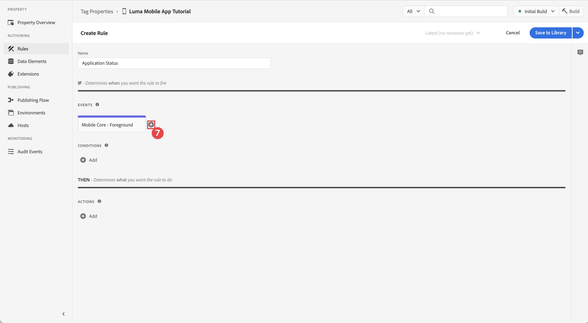

# 라이프사이클 데이터 수집

모바일 앱에서 라이프사이클 데이터를 수집하는 방법에 대해 알아봅니다.

Adobe Experience Platform 모바일 SDK 라이프사이클 확장을 사용하면 모바일 앱에서 수집 라이프사이클 데이터를 사용할 수 있습니다. Adobe Experience Platform Edge Network 확장은 이 라이프사이클 데이터를 플랫폼 Edge Network으로 보낸 다음 데이터 스트림 구성에 따라 다른 애플리케이션 및 서비스로 전달합니다. 제품 설명서에서 [라이프사이클 확장](https://developer.adobe.com/client-sdks/documentation/lifecycle-for-edge-network/)에 대해 자세히 알아보세요.


## 전제 조건

* SDK가 설치 및 구성된 앱을 빌드하고 실행했습니다. 이 단원의 일부로 라이프사이클 모니터링을 이미 시작했습니다. 검토하려면 [SDK 설치 - AppDelegate 업데이트](install-sdks.md#update-appdelegate)를 참조하십시오.
* [이전 단원](install-sdks.md)에 설명된 대로 Assurance 확장을 등록했습니다.

## 학습 목표

이 단원에서는 다음 작업을 수행합니다.

<!--
* Add lifecycle field group to the schema.
* -->
* 앱이 전경과 배경 사이를 이동할 때 올바르게 시작/일시 중지하여 정확한 라이프사이클 지표를 활성화합니다.
* 앱에서 플랫폼 Edge Network으로 데이터를 전송합니다.
* Assurance에서 유효성 검사

<!--
## Add lifecycle field group to schema

The Consumer Experience Event field group you added in the [previous lesson](create-schema.md) already contains the lifecycle fields, so you can skip this step. If you don't use Consumer Experience Event field group in your own app, you can add the lifecycle fields by doing the following:

1. Navigate to the schema interface as described in the [previous lesson](create-schema.md).
1. Open the **Luma Mobile App Event Schema** schema and select **[!UICONTROL Add]** next to Field groups.
    
1. In the search bar, enter "lifecycle".
1. Select the checkbox next to **[!UICONTROL AEP Mobile Lifecycle Details]**.
1. Select **[!UICONTROL Add field groups]**.
    
1. Select **[!UICONTROL Save]**.
    
-->

## 구현 변경 사항

이제 프로젝트를 업데이트하여 라이프사이클 이벤트를 등록할 수 있습니다.

1. Xcode 프로젝트 탐색기에서 **[!DNL Luma]** > **[!DNL Luma]** > **[!UICONTROL SceneDelegate]**(으)로 이동합니다.

1. 앱을 시작할 때 앱이 백그라운드 상태에서 다시 시작되는 경우 iOS에서 `sceneWillEnterForeground:` 위임 메서드를 호출할 수 있으며, 여기서 라이프사이클 시작 이벤트를 트리거할 수 있습니다. `func sceneWillEnterForeground(_ scene: UIScene)`에 이 코드 추가:

   ```swift
   // When in foreground start lifecycle data collection
   MobileCore.lifecycleStart(additionalContextData: nil)
   ```

1. 앱이 백그라운드로 전환되면 앱의 `sceneDidEnterBackground:` 위임 메서드에서 라이프사이클 데이터 수집을 일시 중지하려고 합니다. `func sceneDidEnterBackground(_ scene: UIScene)`에 이 코드 추가:

   ```swift
   // When in background pause lifecycle data collection
   MobileCore.lifecyclePause()
   ```

## Assurance를 사용한 유효성 검사

1. [설치 지침](assurance.md#connecting-to-a-session) 섹션을 검토하여 시뮬레이터 또는 장치를 Assurance에 연결하십시오.
1. 앱을 백그라운드로 보냅니다. Assurance UI에서 **[!UICONTROL LifecyclePause]** 이벤트를 확인합니다.
1. 앱을 전경으로 가져옵니다. Assurance UI에서 **[!UICONTROL LifecycleResume]** 이벤트를 확인합니다.
   


## 플랫폼 Edge Network에 데이터 전달

이전 연습에서는 전경 및 배경 이벤트를 Adobe Experience Platform Mobile SDK에 전달했습니다. 이러한 이벤트를 Platform Edge Network에 전달하려면

1. Tags 속성에서 **[!UICONTROL 규칙]**&#x200B;을(를) 선택합니다.
   
1. 사용할 라이브러리로 **[!UICONTROL 초기 빌드]**&#x200B;를 선택하십시오.
1. **[!UICONTROL 새 규칙 만들기]**&#x200B;를 선택합니다.
   
1. **[!UICONTROL 규칙 만들기]** 화면에서 **[!UICONTROL 이름]**&#x200B;에 대해 `Application Status`을(를) 입력하십시오.
1. **[!UICONTROL 이벤트]** 아래에서  **[!UICONTROL 추가]**&#x200B;를 선택합니다.
   
1. **[!UICONTROL 이벤트 구성]** 단계:
   1. **[!UICONTROL Mobile Core]**&#x200B;을(를) **[!UICONTROL Extension]**(으)로 선택합니다.
   1. **[!UICONTROL 전경]**&#x200B;을(를) **[!UICONTROL 이벤트 유형]**(으)로 선택합니다.
   1. **[!UICONTROL 변경 내용 유지]**&#x200B;를 선택합니다.

      
1. **[!UICONTROL 규칙 만들기]** 화면으로 돌아가서 **[!UICONTROL 모바일 코어 - 전경]** 옆에 있는  **[!UICONTROL 추가]**&#x200B;를 선택합니다.
   
1. **[!UICONTROL 이벤트 구성]** 단계:
   1. **[!UICONTROL Mobile Core]**&#x200B;을(를) **[!UICONTROL Extension]**(으)로 선택합니다.
   1. **[!UICONTROL Background]**&#x200B;을(를) **[!UICONTROL 이벤트 유형]**(으)로 선택합니다.
   1. **[!UICONTROL 변경 내용 유지]**&#x200B;를 선택합니다.

      
1. **[!UICONTROL 규칙 만들기]** 화면으로 돌아가서 **[!UICONTROL 작업]** 아래의  **[!UICONTROL 추가]**&#x200B;를 선택하십시오.
   
1. **[!UICONTROL 작업 구성]** 단계:
   1. **[!UICONTROL Adobe 경험 Edge Network]**&#x200B;을(를) **[!UICONTROL 확장]**(으)로 선택합니다.
   1. **[!UICONTROL Edge Network에 이벤트 전달]**&#x200B;을(를) **[!UICONTROL 작업 형식]**(으)로 선택합니다.
   1. **[!UICONTROL 변경 내용 유지]**&#x200B;를 선택합니다.

      
1. **[!UICONTROL 라이브러리에 저장]**&#x200B;을 선택합니다.
   
1. 라이브러리를 다시 빌드하려면 **[!UICONTROL 빌드]**&#x200B;를 선택하십시오.
   

속성을 성공적으로 빌드하면 이벤트가 플랫폼 Edge Network으로 전송되고 이벤트는 데이터 스트림 구성에 따라 다른 애플리케이션 및 서비스로 전달됩니다.

XDM 데이터가 포함된 **[!UICONTROL 응용 프로그램 닫기(배경)]** 및 **[!UICONTROL 응용 프로그램 시작(전경)]** 이벤트가 보장됩니다.


>[!SUCCESS]
>
>이제 앱을 설정하여 애플리케이션 상태(전경, 배경) 이벤트를 Adobe Experience Platform Edge Network 및 데이터 스트림에 정의한 모든 서비스로 보냅니다.
>
> Adobe Experience Platform Mobile SDK에 대해 학습하는 데 시간을 투자해 주셔서 감사합니다. 질문이 있거나 일반적인 피드백을 공유하고 싶거나 향후 콘텐츠에 대한 제안이 있는 경우 이 [Experience League 커뮤니티 토론 게시물](https://experienceleaguecommunities.adobe.com/t5/adobe-experience-platform-data/tutorial-discussion-implement-adobe-experience-cloud-in-mobile/td-p/443796)에서 공유하십시오.

다음: **[이벤트 데이터 추적](events.md)**
