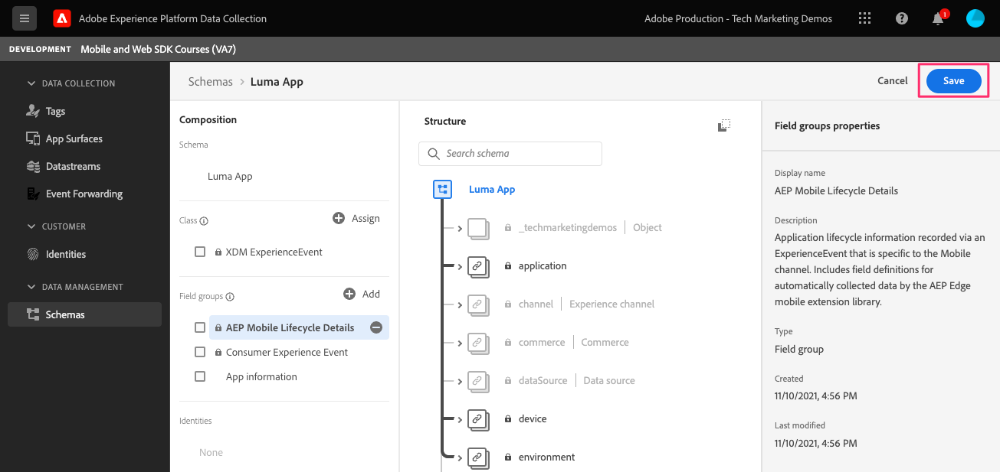

# 라이프사이클 데이터

모바일 앱에서 라이프사이클 데이터를 수집하는 방법을 알아봅니다.

Adobe Experience Platform Mobile SDK 라이프사이클 확장을 사용하면 모바일 앱에서 컬렉션 라이프사이클 데이터를 사용할 수 있습니다. Adobe Experience Platform Edge Network 확장은 이 라이프사이클 데이터를 Platform Edge 네트워크로 전송하며 이 네트워크는 데이터 스트림 구성에 따라 다른 애플리케이션 및 서비스로 전달됩니다. 추가 정보 [라이프사이클 확장](https://aep-sdks.gitbook.io/docs/foundation-extensions/lifecycle-for-edge-network) 를 참조하십시오.


## 전제 조건

* SDK가 설치 및 구성된 앱을 성공적으로 빌드하고 실행합니다.
* Assurance SDK를 가져왔습니다.

   ```swift
   import AEPAssurance
   ```

* 에 설명된 대로 Assurance 확장을 등록했습니다. [이전 단원](install-sdks.md).

## 학습 목표

이 단원에서는 다음 작업을 수행합니다.

* 스키마에 라이프사이클 필드 그룹을 추가합니다.
* 앱이 전경과 배경 사이를 이동할 때 올바르게 시작/일시 중지하여 정확한 라이프사이클 지표를 활성화합니다.
* 앱의 데이터를 Platform Edge Network에 보냅니다.
* 보증에서 유효성 검사.

## 스키마에 라이프사이클 필드 그룹 추가

소비자 경험 이벤트 필드 그룹에서 [이전 단원](create-schema.md) 이미 라이프사이클 필드가 포함되어 있으므로 이 단계를 건너뛸 수 있습니다. 자체 앱에서 소비자 경험 이벤트 필드 그룹을 사용하지 않는 경우, 다음을 수행하여 라이프사이클 필드를 추가할 수 있습니다.

1. 에 설명된 대로 스키마 인터페이스로 이동합니다. [이전 단원](create-schema.md).
1. &quot;Luma 앱&quot; 스키마를 열고 를 선택합니다. **[!UICONTROL 추가]**.
   
1. 검색 창에서 &quot;lifecycle&quot;을 입력합니다.
1. 옆에 있는 확인란을 선택합니다 **[!UICONTROL AEP 모바일 라이프사이클 세부 정보]**.
1. 선택 **[!UICONTROL 필드 그룹 추가]**.
   
1. **[!UICONTROL 저장]**을 선택합니다.
   


## 구현 변경

이제 다음을 업데이트할 수 있습니다 `AppDelegate.swift` 라이프사이클 이벤트를 등록하려면:

1. 앱이 시작될 때 앱이 백그라운드 상태에서 다시 시작하는 경우 iOS이 `applicationWillEnterForeground:` 위임 메서드. 이벤트가 복제되지 않도록 하면서 현재 이벤트 변수에 `lifecycleStart:`

   ```swift
   MobileCore.lifecycleStart(additionalContextData: nil)
   ```

1. 앱이 백그라운드에 들어오면 앱의 라이프사이클 데이터 수집을 일시 중지합니다 `applicationDidEnterBackground:` 위임 메서드.

   ```swift
   MobileCore.lifecyclePause()
   ```

>[!NOTE]
>
>iOS 13 이상의 경우 [설명서](https://aep-sdks.gitbook.io/docs/foundation-extensions/mobile-core/lifecycle#register-lifecycle-with-mobile-core-and-add-appropriate-start-pause-calls) 약간 다른 코드에 대해 설명합니다.

## 보증으로 유효성 검사

1. 를 검토합니다. [설정 지침](assurance.md) 섹션에서 시뮬레이터나 장치를 Assurance에 연결합니다.
1. 앱을 시작합니다.
1. 앱을 백그라운드로 보냅니다. 확인 `LifecyclePause`.
1. 앱을 전경으로 가져옵니다. 확인 `LifecycleResume`.
   


## Platform Edge Network에 데이터 전달

이전 연습에서는 전경 및 배경 이벤트를 Mobile SDK에 전달합니다. 이러한 이벤트를 Platform Edge Network에 보내려면 나열된 단계를 따르십시오 [여기](https://aep-sdks.gitbook.io/docs/foundation-extensions/lifecycle-for-edge-network#configure-a-rule-to-forward-lifecycle-metrics-to-platform). 이벤트가 Platform Edge Network에 전송되면 데이터 스트림 구성에 따라 다른 애플리케이션 및 서비스로 전달됩니다.

Platform Edge Network에 라이프사이클 이벤트를 전송하는 규칙을 추가하면 `Application Close (Background)` 및 `Application Launch (Foreground)` 확장에서 XDM 데이터를 포함하는 이벤트.


다음: **[이벤트 추적](events.md)**

>[!NOTE]
>
>Adobe Experience Platform Mobile SDK에 대한 학습에 시간을 내주셔서 감사합니다. 질문이 있거나 일반 피드백을 공유하거나 향후 컨텐츠에 대한 제안 사항이 있는 경우 해당 정보를 공유하십시오 [Experience League 커뮤니티 토론 게시물](https://experienceleaguecommunities.adobe.com/t5/adobe-experience-platform-launch/tutorial-discussion-implement-adobe-experience-cloud-in-mobile/td-p/443796)