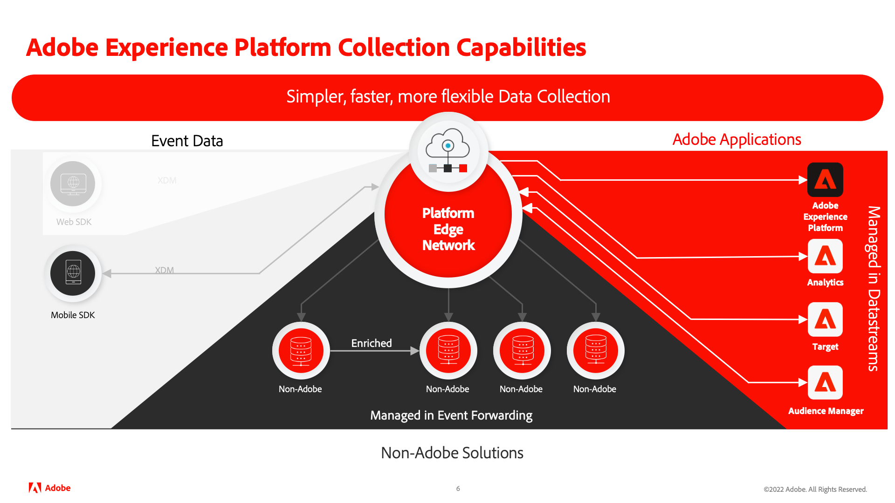

# 모바일 앱에서 Adobe Experience Cloud 구현 튜토리얼

Adobe Experience Platform Mobile SDK를 사용하여 모바일 앱에서 Adobe Experience Cloud 애플리케이션을 구현하는 방법을 알아봅니다.

Experience Platform 모바일 SDK는 Adobe Experience Cloud 고객이 Adobe Experience Platform Edge Network를 통해 Adobe 애플리케이션 및 서드파티 서비스와 모두 상호 작용할 수 있도록 하는 클라이언트측 SDK입니다. 다음을 참조하십시오. [Adobe Experience Platform Mobile SDK 설명서](https://developer.adobe.com/client-sdks/documentation/) 를 참조하십시오.

이 튜토리얼에서는 샘플 소매 앱인 Luma에서 Platform Mobile SDK를 구현하는 과정을 안내합니다. 다음 [Luma 앱](https://github.com/Adobe-Marketing-Cloud/Luma-iOS-Mobile-App) 에는 사실적인 구현을 구축할 수 있는 기능이 있습니다. 이 자습서를 완료하고 나면 보유한 모바일 앱에서 Platform Mobile SDK를 통해 모든 마케팅 솔루션 구현을 시작할 수 있습니다.

단원은 iOS용으로 설계되고 Swift로 작성되지만 많은 개념이 Android™에도 적용됩니다.

이 자습서를 완료하면 다음 작업을 수행할 수 있습니다.

* 표준 및 사용자 정의 필드 그룹을 사용하여 스키마를 만듭니다.
* 데이터스트림 설정.
* 모바일 태그 속성을 구성합니다.
* Experience Platform 데이터 세트를 설정합니다(선택 사항).
* 앱에 태그 확장 설치 및 구현
* 다음 Adobe Experience Cloud 애플리케이션/확장을 추가합니다.
   * [Adobe Experience Platform Edge (XDM)](events.md)
   * [라이프사이클 데이터 수집](lifecycle-data.md)
   * [XDM을 통한 Adobe Analytics](analytics.md)
   * [동의](consent.md)
   * [신원](identity.md)
   * [프로필](profile.md)
   * [Adobe Experience Platform](platform.md)
   * [Journey Optimizer을 사용한 푸시 메시지](journey-optimizer-push.md)
* 에 Experience Cloud 매개 변수를 올바르게 전달 [웹 보기](web-views.md).
* 을 사용하여 구현의 유효성 검사 [Adobe Experience Platform 보증](assurance.md).

>[!NOTE]
>
>에 대해 유사한 다중 솔루션 자습서를 사용할 수 있습니다. [웹 SDK](../tutorial-web-sdk/overview.md).

## 전제 조건

이 단원들에서는 사용자에게 Adobe ID와 연습을 완료하는 데 필요한 권한이 있다고 가정합니다. 그렇지 않은 경우 Adobe 관리자에게 연락하여 액세스 권한을 요청해야 합니다.

* 데이터 수집에서 다음을 수행해야 합니다.
   * **[!UICONTROL 플랫폼]**—권한 항목 **[!UICONTROL 모바일]**
   * **[!UICONTROL 속성 권한]**—권한 항목 대상 **[!UICONTROL 개발]**, **[!UICONTROL 승인]**, **[!UICONTROL 게시]**, **[!UICONTROL 확장 관리]**, 및 **[!UICONTROL 환경 관리]**.
   * **[!UICONTROL 회사 권한]**—권한 항목 대상 **[!UICONTROL 속성 관리]** 그리고 선택적 푸시 메시지 단원을 완료하면 **[!UICONTROL 앱 구성 관리]**

      태그 권한에 대한 자세한 내용은 [태그에 대한 사용자 권한](https://experienceleague.adobe.com/docs/experience-platform/tags/admin/user-permissions.html?lang=ko-KR){target="_blank"} 를 참조하십시오.
* Experience Platform에서 다음을 수행해야 합니다.
   * **[!UICONTROL 데이터 모델링]**—스키마를 관리하고 볼 수 있는 권한 항목입니다.
   * **[!UICONTROL Identity Management]**—id 네임스페이스를 관리하고 볼 수 있는 권한 항목입니다.
   * **[!UICONTROL 데이터 수집]**—데이터스트림을 관리하고 볼 수 있는 권한 항목입니다.

   * Real-Time CDP, Journey Optimizer 또는 Customer Journey Analytics과 같은 플랫폼 기반 애플리케이션의 고객인 경우 다음 기능도 갖추어야 합니다.
      * **[!UICONTROL 데이터 관리]**—데이터 세트를 관리하고 확인하여 다음을 완료할 권한 항목 _선택적 플랫폼 연습_ ( 플랫폼 기반 애플리케이션에 대한 라이센스 필요).
      * 개발 **샌드박스** 이 자습서에 사용할 수 있습니다.
* Adobe Analytics의 경우 다음 사항을 알고 있어야 합니다. **보고서 세트** 를 사용하여 이 자습서를 완료할 수 있습니다.

모든 Experience Cloud 고객은 Mobile SDK를 배포하는 데 필요한 기능에 액세스할 수 있어야 합니다.

또한 사용자가 익숙하다고 가정합니다. [!DNL Swift]. 전문가가 아니어도 단원을 완료할 수 있지만, 코드를 읽고 이해할 수 있으면 단원을 최대한 활용할 수 있습니다.

## Luma 앱 다운로드

두 가지 버전의 샘플 앱을 다운로드할 수 있습니다.

1. [비어 있음](https://github.com/Adobe-Marketing-Cloud/Luma-iOS-Mobile-App){target="_blank"} - 이 자습서의 실습 연습을 완료하는 데 필요한 Experience Cloud 코드가 없는 버전
1. [전체 구현](https://github.com/Adobe-Marketing-Cloud/Luma-iOS-Mobile-App){target="_blank"} - 참조용으로 전체 Experience Cloud 구현이 포함된 버전입니다.

그럼 시작해 보겠습니다!

다음: **[XDM 스키마 만들기](create-schema.md)**

>[!NOTE]
>
>Adobe Experience Platform Mobile SDK에 대해 학습하는 데 시간을 투자해 주셔서 감사합니다. 질문이 있거나, 일반적인 피드백을 공유하거나, 향후 콘텐츠에 대한 제안이 있는 경우 이에 대해 공유하십시오. [Experience League 커뮤니티 토론 게시물](https://experienceleaguecommunities.adobe.com/t5/adobe-experience-platform-launch/tutorial-discussion-implement-adobe-experience-cloud-in-mobile/td-p/443796)