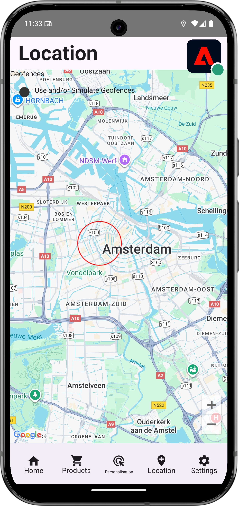
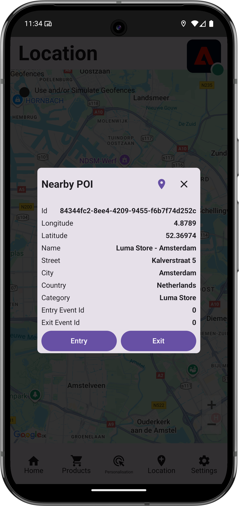

# 위치 사용

앱에서 위치 지리적 위치 서비스를 사용하는 방법을 알아봅니다.

Adobe Experience Platform 데이터 수집 위치 서비스 는 위치를 인식하는 모바일 앱이 위치 컨텍스트를 이해할 수 있도록 해주는 지리적 위치 서비스입니다. 이 서비스는 유연한 관심 영역(POI) 데이터베이스를 동반하는 풍부하고 사용하기 쉬운 SDK 인터페이스를 사용합니다.

## 전제 조건

* 모든 패키지 종속성은 Xcode 프로젝트에 있습니다.
* AppDelegate에 등록된 확장입니다.
* 개발 appId를 사용하도록 MobileCore를 구성했습니다.
* 가져온 SDK.
* 위의 변경 사항으로 앱을 빌드하고 실행했습니다.

## 학습 목표

이 단원에서는 다음과 같은 작업을 수행합니다

* Places 서비스의 관심 영역을 정의하는 방법을 이해합니다.
* Places 확장으로 태그 속성을 업데이트합니다.
* 스키마를 업데이트하여 지리적 위치 이벤트를 캡처합니다.
* Assurance에서 설정의 유효성을 검사합니다.
* 앱을 업데이트하여 Places 확장을 등록합니다.
* 앱의 위치 서비스에서 지리적 위치 추적을 구현합니다.


## 설정

Places 서비스가 앱 내에서 및 Mobile SDK 내에서 작동하려면 일부 설정을 수행해야 합니다.

### 위치 정의

Places 서비스에서 일부 관심 영역을 정의합니다.

1. 데이터 수집 UI에서 **[!UICONTROL 위치]**&#x200B;를 선택합니다.
1. 를 선택하세요.
1. 컨텍스트 메뉴에서 **[!UICONTROL 라이브러리 관리]**&#x200B;를 선택합니다.
   {zoomable="yes"}
1. **[!UICONTROL 라이브러리 관리]** 대화 상자에서 **[!UICONTROL 새로 만들기]**&#x200B;를 선택합니다.
1. **[!UICONTROL 라이브러리 만들기]** 대화 상자에서 **[!UICONTROL 이름]**(예: `Luma`)을 입력하십시오.
1. **[!UICONTROL 확인]**&#x200B;을 선택합니다.
   {zoomable="yes"}
1. **[!UICONTROL 라이브러리 관리]** 대화 상자를 닫으려면 **[!UICONTROL 닫기]**&#x200B;를 선택합니다.
1. **[!UICONTROL POI 관리]**&#x200B;로 돌아가서 **[!UICONTROL POI 가져오기]**&#x200B;를 선택하십시오.
1. **[!UICONTROL 위치 가져오기]** 대화 상자에서 **[!UICONTROL 시작]**&#x200B;을 선택합니다.
1. 라이브러리 목록에서 **[!DNL Luma]**&#x200B;을(를) 선택합니다.
1. **[!UICONTROL 다음]**&#x200B;을 선택합니다.
   {zoomable="yes"}
1. [Luma POIs ZIP 파일](assets/luma_pois.csv.zip)을 다운로드하고 컴퓨터의 위치에 추출합니다.
1. **[!UICONTROL 위치 가져오기]** 대화 상자에서 추출한 `luma_pois.csv` 파일을 **[!UICONTROL CSV 파일 선택 - 파일 드래그 앤 드롭]**&#x200B;에 끌어다 놓습니다. **[!UICONTROL 유효성 검사 성공]** - **[!UICONTROL CSV 파일의 유효성을 검사했습니다]**&#x200B;가 표시됩니다.
1. **[!UICONTROL 가져오기 시작]**&#x200B;을 선택합니다. **[!UICONTROL 성공]** - **[!UICONTROL 6개의 새 POI를 추가함]**&#x200B;이 표시됩니다.
1. **[!UICONTROL 완료]**&#x200B;를 선택합니다.
1. **[!UICONTROL POI 관리]**&#x200B;에서 6개의 새로운 Luma 스토어가 목록에 추가됩니다.  목록과  맵 보기 간에 전환할 수 있습니다.
   {zoomable="yes"}.


### 위치 확장 설치

1. **[!UICONTROL 태그]**(으)로 이동하여 모바일 태그 속성을 찾은 다음 속성을 엽니다.
1. **[!UICONTROL 확장]**&#x200B;을 선택하십시오.
1. **[!UICONTROL 카탈로그]**&#x200B;를 선택하십시오.
1. **[!UICONTROL Places]** 확장을 검색합니다.
1. 확장을 설치합니다.

   

1. **[!UICONTROL 확장 설치]** 대화 상자에서:
   1. **[!DNL Luma]**&#x200B;라이브러리 선택&#x200B;**[!UICONTROL 목록에서]**&#x200B;을(를) 선택합니다.
   1. 작업 라이브러리(예: **[!UICONTROL 초기 빌드]**)를 선택했는지 확인하십시오.
   1. **[!UICONTROL 라이브러리에 저장]**&#x200B;에서 **[!UICONTROL 라이브러리 및 빌드에 저장]**&#x200B;을 선택합니다.
      {zoomable="yes"}.

1. 라이브러리가 다시 빌드되었습니다.


### 스키마 확인

[스키마 만들기](create-schema.md)에 정의된 대로 스키마에 POI 및 지리적 위치 데이터를 수집하는 데 필요한 필드 그룹 및 클래스가 포함되어 있는지 확인합니다.

1. 데이터 수집 인터페이스로 이동하여 왼쪽 레일에서 **[!UICONTROL 스키마]**&#x200B;를 선택합니다.
1. 상단 표시줄에서 **[!UICONTROL 찾아보기]**&#x200B;를 선택합니다.
1. 스키마를 선택하여 엽니다.
1. 스키마 편집기에서 **[!UICONTROL 소비자 경험 이벤트]**&#x200B;를 선택합니다.
1. POI 인터랙션 및 지리적 위치 데이터를 캡처할 개체 및 필드가 있는 **[!UICONTROL placeContext]** 개체가 표시됩니다.
   {zoomable="yes"}.


### 태그 속성 업데이트

태그에 대한 위치 확장 기능은 지리적 위치 이벤트를 모니터링하고 이러한 이벤트를 기반으로 작업을 트리거할 수 있는 기능을 제공합니다. 이 기능을 사용하면 앱에서 구현해야 하는 API 코딩을 최소화할 수 있습니다.

**데이터 요소**

먼저 여러 데이터 요소를 만듭니다.

1. 데이터 수집 UI에서 태그 속성으로 이동합니다.
1. 왼쪽 레일에서 **[!UICONTROL 데이터 요소]**&#x200B;를 선택합니다.
1. **[!UICONTROL 데이터 요소 추가]**&#x200B;를 선택합니다.
1. **[!UICONTROL 데이터 요소 만들기]** 화면에서 `Name - Entered`과(와) 같은 이름을 입력하십시오.
1. **[!UICONTROL 확장]** 목록에서 **[!UICONTROL 위치]**&#x200B;를 선택합니다.
1. **[!UICONTROL 데이터 요소 형식]** 목록에서 **[!UICONTROL 이름]**&#x200B;을(를) 선택하십시오.
1. **[!UICONTROL TARGET]** 아래에서 **[!UICONTROL 현재 POI]**&#x200B;를 선택하십시오.
1. **[!UICONTROL 라이브러리에 저장]**&#x200B;을 선택합니다.
   {zoomable="yes"}

1. 아래 표의 정보를 사용하여 4~8단계를 반복하여 추가 데이터 요소를 만듭니다.

   | 이름 | 확장 기능 | 데이터 요소 유형 | TARGET |
   |---|---|---|---|
   | `Name - Exited` | 장소 | 이름 | 마지막으로 종료한 POI |
   | `Category - Current` | 장소 | 카테고리 | 현재 POI |
   | `Category - Exited` | 장소 | 카테고리 | 마지막으로 종료한 POI |
   | `City - Current` | 장소 | 구/군/시 | 현재 POI |
   | `City - Exited` | 장소 | 구/군/시 | 마지막으로 종료한 POI |

   다음 데이터 요소 목록이 있어야 합니다.

   {zoomable="yes"}

**규칙**

그런 다음 이러한 데이터 요소로 작업할 규칙을 정의합니다.

1. 태그 속성의 왼쪽 레일에서 **[!UICONTROL 규칙]**&#x200B;을 선택합니다.
1. **[!UICONTROL 규칙 추가]**&#x200B;를 선택합니다.
1. **[!UICONTROL 규칙 만들기]** 화면에서 규칙 이름(예: `POI - Entry`)을 입력하십시오.
1.  아래의 **[!UICONTROL 추가]**&#x200B;를 선택하십시오.
   1. **[!UICONTROL 확장]** 목록에서 **[!UICONTROL 위치]**&#x200B;를 선택하고 **[!UICONTROL 이벤트 유형]** 목록에서 **[!UICONTROL POI 입력]**&#x200B;을 선택합니다.
   1. **[!UICONTROL 변경 내용 유지]**&#x200B;를 선택합니다.
      .
1.  아래의 **[!UICONTROL 추가]**&#x200B;을(를) 선택하십시오.
   1. **[!UICONTROL 확장]** 목록에서 **[!UICONTROL Mobile Core]**&#x200B;를 선택하고 **[!UICONTROL 작업 유형]**&#x200B;에서 **[!UICONTROL 데이터 첨부]**&#x200B;를 선택합니다. 이 작업은 페이로드 데이터를 첨부합니다.
   1. **[!UICONTROL JSON 페이로드]**&#x200B;에 다음 페이로드를 붙여 넣습니다.

      ```json
      {
          "xdm": {
              "eventType": "location.entry",
              "placeContext": {
                  "geo": {
                      "city": "{%%City - Current%%}"
                  },
                  "POIinteraction": {
                      "poiDetail": {
                          "name": "{%%Name - Current%%}",
                          "category": "{%%Category - Current%%}"
                      },
                      "poiEntries": {
                          "value": 1
                      }
                  }
              }
          }
      }
      ```

      `{%% ... %%}`데이터 데이터 요소 자리 표시자 값을 삽입할 수도 있습니다. 팝업 대화 상자를 통해 만든 데이터 요소를 선택할 수 있습니다.

   1. **[!UICONTROL 변경 내용 유지]**&#x200B;를 선택합니다.
      {zoomable="yes"}

1.  작업 옆에 있는 **[!UICONTROL 추가]**&#x200B;를 선택합니다.
   1. **[!UICONTROL 확장]** 목록에서 **[!UICONTROL Adobe Experience Platform Edge Network]**&#x200B;을 선택하고 **[!UICONTROL Edge Network으로 이벤트 전달]**&#x200B;을 선택합니다. 이 작업을 수행하면 이벤트 및 추가 페이로드 데이터가 Platform Edge Network에 전달됩니다.
   1. **[!UICONTROL 변경 내용 유지]**&#x200B;를 선택합니다.

1. 규칙을 저장하려면 **[!UICONTROL 라이브러리에 저장]**&#x200B;을 선택합니다.

   {zoomable="yes"}

다른 규칙을 만들어 보겠습니다

1. **[!UICONTROL 규칙 만들기]** 화면에서 규칙 이름(예: `POI - Exit`)을 입력하십시오.
1.  아래의 **[!UICONTROL 추가]**&#x200B;를 선택하십시오.
   1. **[!UICONTROL 확장]** 목록에서 **[!UICONTROL 위치]**&#x200B;를 선택하고 **[!UICONTROL 이벤트 유형]** 목록에서 **[!UICONTROL POI 종료]**&#x200B;를 선택합니다.
   1. **[!UICONTROL 변경 내용 유지]**&#x200B;를 선택합니다.
1.  아래의 **[!UICONTROL 추가]**&#x200B;을(를) 선택하십시오.
   1. **[!UICONTROL 확장]** 목록에서 **[!UICONTROL Mobile Core]**&#x200B;을 선택하고 **[!UICONTROL 작업 유형]** 목록에서 **[!UICONTROL 데이터 첨부]**&#x200B;를 선택합니다.
   1. **[!UICONTROL JSON 페이로드]**&#x200B;에 다음 페이로드를 붙여 넣습니다.

      ```json
      {
          "xdm": {
              "eventType": "location.exit",
              "placeContext": {
                  "geo": {
                      "city": "{%%City - Exited%%}"
                  },
                  "POIinteraction": {
                      "poiExits": {
                          "value": 1
                      },
                      "poiDetail": {
                          "name": "{%%Name - Exited%%}",
                          "category": "{%%Category - Exited%%}"
                      }
                  }
              }
          }
      }
      ```

   1. **[!UICONTROL 변경 내용 유지]**&#x200B;를 선택합니다.

1.  작업 옆에 있는 **[!UICONTROL 추가]**&#x200B;를 선택합니다.
   1. **[!UICONTROL 확장]** 목록에서 **[!UICONTROL Adobe Experience Platform Edge Network]**&#x200B;을 선택하고 **[!UICONTROL Edge Network으로 이벤트 전달]**&#x200B;을 선택합니다.
   1. **[!UICONTROL 변경 내용 유지]**&#x200B;를 선택합니다.

1. 규칙을 저장하려면 **[!UICONTROL 라이브러리에 저장]**&#x200B;을 선택합니다.

   {zoomable="yes"}


태그의 모든 변경 사항이 게시되도록 하려면

1. 빌드할 라이브러리로 **[!UICONTROL 초기 빌드]**&#x200B;를 선택합니다.
1. **[!UICONTROL 빌드]**&#x200B;를 선택합니다.
   {zoomable="yes"}


## Assurance에서 설정 유효성 검사

Assurance에서 설정의 유효성을 검사하려면:

1. Assurance UI로 이동합니다.
1. 왼쪽 레일에서 아직 사용할 수 없는 경우 왼쪽 레일에서 **[!UICONTROL 구성]**&#x200B;을 선택하고  옆의 **[!UICONTROL 추가]**&#x200B;을(를) 선택한 다음 **[!UICONTROL 장소 서비스]** 아래의 **[!UICONTROL 맵 및 시뮬레이션]**&#x200B;을(를) 선택합니다.
1. **[!UICONTROL 저장]**&#x200B;을 선택합니다.
1. 왼쪽 레일에서 **[!UICONTROL 맵 및 시뮬레이션]**&#x200B;을 선택합니다.
1. 지도를 POI 중 하나의 위치로 이동합니다.
1.  부하 POI를 시뮬레이션하도록 선택합니다. POI는 원과 핀을 사용하여 식별됩니다.
1. POI를 선택합니다.
1. 팝업에서  **[!UICONTROL 시작 이벤트 시뮬레이션]**&#x200B;을 선택합니다.

   {zoomable="yes"}

1. 왼쪽 레일에서 **[!UICONTROL 이벤트]**&#x200B;를 선택하면 시뮬레이션한 이벤트가 표시됩니다.

   {zoomable="yes"}


## 앱의 위치 구현

이전 단원에서 설명한 대로 모바일 태그 확장을 설치하면 구성만 제공됩니다. 그런 다음 Places SDK을 설치하고 등록해야 합니다. 이 단계가 명확하지 않으면 [SDK 설치](install-sdks.md) 섹션을 검토하십시오.

>[!NOTE]
>
>[SDK 설치](install-sdks.md) 섹션을 완료한 경우 위치 SDK이 이미 설치되어 있으므로 이 단계를 건너뛸 수 있습니다.
>

>[!IMPORTANT]
>
>앱에서 Android용 맵 SDK을 설정하려면 사용량에 따른 비용 발생으로 결제를 설정해야 합니다. 고유한 애플리케이션 ID와 SHA-1 키를 사용하여 비용을 제한할 수 있습니다. 자세한 내용은 [Android용 SDK 매핑](https://developers.google.com/maps/documentation/android-sdk/overview)을 참조하십시오. 청구 설정을 하지 않거나 비용이 발생하지 않도록 하려면 이 단원을 건너뜁니다.

>[!BEGINTABS]

>[!TAB iOS]

1. Xcode에서 패키지 종속 항목의 패키지 목록에 [AEP Places](https://github.com/adobe/aepsdk-places-ios)이(가) 추가되었는지 확인하십시오. [Swift 패키지 관리자](install-sdks.md#swift-package-manager)를 참조하세요.
1. Xcode 프로젝트 탐색기에서 **[!DNL Luma]** > **[!DNL Luma]** > **[!DNL AppDelegate]**(으)로 이동합니다.
1. `AEPPlaces`이(가) 가져오기 목록의 일부인지 확인하십시오.

   ```swift
   import AEPPlaces
   ```

1. `Places.self`이(가) 등록 중인 확장 배열의 일부인지 확인하십시오.

   ```swift
   let extensions = [
       AEPIdentity.Identity.self,
       Lifecycle.self,
       Signal.self,
       Edge.self,
       AEPEdgeIdentity.Identity.self,
       Consent.self,
       UserProfile.self,
       Places.self,
       Messaging.self,
       Optimize.self,
       Assurance.self
   ]
   ```

1. Xcode 프로젝트 탐색기에서 **[!DNL Luma]** > **[!DNL Luma]** > **[!DNL Utils]** > **[!UICONTROL MobileSDK]**(으)로 이동하여 `func processRegionEvent(regionEvent: PlacesRegionEvent, forRegion region: CLRegion) async` 함수를 찾습니다. 다음 코드를 추가합니다.

   ```swift
   // Process geolocation event
   Places.processRegionEvent(regionEvent, forRegion: region)
   ```

   이 [`Places.processRegionEvent`](https://developer.adobe.com/client-sdks/documentation/places/api-reference/#processregionevent) API는 지리적 위치 정보를 Places 서비스에 전달합니다.

1. Xcode의 프로젝트 탐색기에서 **[!DNL Luma]** > **[!DNL Luma]** > **[!DNL Views]** > **[!DNL Location]** > **[!DNL GeofenceSheet]**(으)로 이동합니다.

   1. [입력] 단추에 다음 코드를 입력합니다.

      ```swift
      // Simulate geofence entry event
      Task {
          await MobileSDK.shared.processRegionEvent(regionEvent: .entry, forRegion: region)
      }
      ```

   1. 종료 단추에 다음 코드를 입력합니다.

      ```swift
      // Simulate geofence exit event
      Task {
          await MobileSDK.shared.processRegionEvent(regionEvent: .exit, forRegion: region)
      }
      ```

>[!TAB Android]

1. Android Studio에서 [aepsdk-places-android](https://github.com/adobe/aepsdk-places-android)이(가) **[!UICONTROL Android:app]** V자 축소&#x200B;**&#x200B;** Gradle Scriptsbuild.gradle.kts(모듈 **[!UICONTROL )]**&#x200B;에 있는 종속성의 일부인지 확인하십시오. [Gradle](install-sdks.md#gradle)을(를) 참조하세요.
1. Android Studio 프로젝트 탐색기에서 **[!UICONTROL Android]**  > **[!DNL app]** > **[!DNL kotlin+java]** > **[!UICONTROL com.adobe.luma.tutorial.android]** > **[!UICONTROL LumaApplication]**&#x200B;으로 이동합니다.
1. `com.adobe.marketing.mobile.Messaging`이(가) 가져오기 목록의 일부인지 확인하십시오.

   `import import com.adobe.marketing.mobile.Places`

1. `Places.EXTENSION`이(가) 등록 중인 확장 배열의 일부인지 확인하십시오.

   ```kotlin
   val extensions = listOf(
       Identity.EXTENSION,
       Lifecycle.EXTENSION,
       Signal.EXTENSION,
       Edge.EXTENSION,
       Consent.EXTENSION,
       UserProfile.EXTENSION,
       Places.EXTENSION,
       Messaging.EXTENSION,
       Optimize.EXTENSION,
       Assurance.EXTENSION
   )
   ```

1. Android Studio 프로젝트 탐색기에서 **[!UICONTROL Android]**  > **[!DNL app]** > **[!DNL kotlin+java]** > **[!UICONTROL com.adobe.luma.tutorial.android]** > **[!UICONTROL 모델]** > **[!UICONTROL MobileSDK]**(으)로 이동합니다. `suspend fun processGeofence(geofence: Geofence?, transitionType: Int)` 함수를 찾습니다. 다음 코드를 추가합니다.

   ```kotlin
   // Process geolocation event
   Places.processGeofence(geofence, transitionType)
   ```

   이 [`Places.processRegionEvent`](https://developer.adobe.com/client-sdks/documentation/places/api-reference/#processregionevent) API는 지리적 위치 정보를 Places 서비스에 전달합니다.


1. Android Studio 프로젝트 탐색기에서 **[!UICONTROL Android]**  > **[!DNL app]** > **[!DNL kotlin+java]** > **[!UICONTROL com.adobe.luma.tutorial.android]** > **[!UICONTROL 보기]** > **[!UICONTROL LocationView.k]**(으)로 이동합니다.

   1. [입력] 단추에 다음 코드를 입력합니다.

      ```kotlin
      // Simulate geofence entry event
      coroutineScope.launch {
          MobileSDK.shared.processGeofence(
             region,
             Geofence.GEOFENCE_TRANSITION_ENTER
          )
      }
      ```

   1. 종료 단추에 다음 코드를 입력합니다.

      ```kotlin
      // Simulate geofence entry event
      coroutineScope.launch {
          MobileSDK.shared.processGeofence(
              region,
              Geofence.GEOFENCE_TRANSITION_EXIT
          )
      }
      ```

>[!ENDTABS]

## 앱을 사용하여 유효성 검사

앱의 지리적 위치 기능을 확인하려면:

>[!BEGINTABS]

>[!TAB iOS]

1. 장치 또는 시뮬레이터에서 앱을 엽니다.

1. **[!UICONTROL 위치]** 탭으로 이동합니다.

1. 맵을 이동하고(드래그) 파란색 가운데 원이 POI 중 하나(예: 런던) 위에 있는지 확인합니다.

1. 누르기  범주와 이름이 빨간색 위치에 있는 레이블에 표시될 때까지(pin 사용).

1. POI의 레이블을 탭하여 **[!UICONTROL 주변 POI]** 시트를 엽니다.

   

1. **[!UICONTROL 시작]** 또는 **[!UICONTROL 종료]** 단추를 눌러 앱에서 지오펜스 시작 및 지오펜스 종료 이벤트를 시뮬레이션합니다.

   

1. Assurance UI에 이벤트가 표시됩니다. 이벤트 및 위치 서비스 이벤트에서 모두.

>[!TAB Android]

1. **[!UICONTROL 위치]** 탭으로 이동합니다.

1. **[!UICONTROL 지오펜스 사용 및/또는 시뮬레이션]**&#x200B;을 선택합니다.

1. 나타나는 빨간색 원 안의 아무 곳이나 탭합니다.

   


1. **[!UICONTROL 시작]** 또는 **[!UICONTROL 종료]** 단추를 눌러 앱에서 지오펜스 시작 및 지오펜스 종료 이벤트를 시뮬레이션합니다.

   

1. Assurance UI에 이벤트가 표시됩니다.


>[!ENDTABS]


## 다음 단계

이제 앱에서 지리적 위치 기능에 더 많은 기능을 추가하려면 모든 도구가 있어야 합니다. 이벤트를 Edge Network으로 전달했으므로 [Experience Platform](platform.md)에 대한 앱을 설정한 후에는 앱에 사용된 프로필에 대해 경험 이벤트가 표시되는 것을 볼 수 있습니다.

이 자습서의 Journey Optimizer 섹션에서 여정을 트리거하는 데 경험 이벤트를 사용할 수 있습니다(Journey Optimizer으로 [푸시 알림](journey-optimizer-inapp.md) 및 [인앱 메시지](journey-optimizer-push.md) 참조). 예를 들어 앱 사용자가 실제 스토어의 geofence에 들어오면 일부 제품 프로모션과 함께 푸시 알림을 전송하는 일반적인 사례입니다.

앱에 대한 지리적 위치 기능의 이러한 구현으로 코드가 최소화됩니다. 태그 속성에서 정의한 Places 서비스, 데이터 요소 및 규칙은 대부분의 기능을 제공합니다. 또는 채워진 [`Edge.sendEvent` 개체가 포함된 XDM 페이로드와 함께 &#x200B;](https://developer.adobe.com/client-sdks/documentation/edge-network/api-reference/#sendevent) [&#x200B; API(자세한 내용은 &#x200B;](events.md)이벤트`placeContext` 참조)를 사용하여 앱에서 직접 동일한 기능을 구현할 수 있습니다.

>[!SUCCESS]
>
>이제 Experience Platform Mobile SDK에서 위치 확장 기능을 사용하여 지리적 위치 서비스용 앱을 활성화했습니다.
>
>Adobe Experience Platform Mobile SDK에 대해 학습하는 데 시간을 투자해 주셔서 감사합니다. 질문이 있거나 일반적인 피드백을 공유하고 싶거나 향후 콘텐츠에 대한 제안이 있는 경우 이 [Experience League 커뮤니티 토론 게시물](https://experienceleaguecommunities.adobe.com/t5/adobe-experience-platform-data/tutorial-discussion-implement-adobe-experience-cloud-in-mobile/td-p/443796?profile.language=ko)에서 공유하십시오.

다음: **[Adobe Analytics에 데이터 매핑](analytics.md)**
