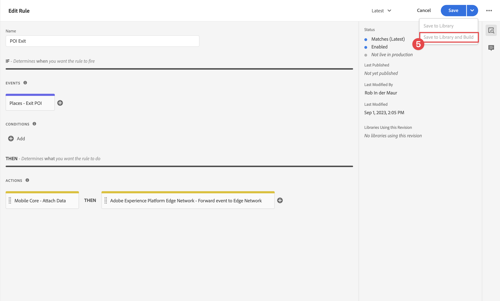

# 위치 사용

앱에서 위치 지리적 위치 서비스를 사용하는 방법을 알아봅니다.

Adobe Experience Platform 데이터 수집 위치 서비스 는 위치를 인식하는 모바일 앱이 위치 컨텍스트를 이해할 수 있도록 해주는 지리적 위치 서비스입니다. 이 서비스는 유연한 관심 영역(POI) 데이터베이스를 동반하는 풍부하고 사용하기 쉬운 SDK 인터페이스를 사용합니다.

## 전제 조건

* 모든 패키지 종속성은 Xcode 프로젝트에 있습니다.
* AppDelegate에 등록된 확장입니다.
* 개발 appId를 사용하도록 MobileCore를 구성했습니다.
* 가져온 SDK.
* 위의 변경 사항으로 앱을 빌드하고 실행했습니다.

## 학습 목표

이 단원에서는 다음과 같은 작업을 수행합니다

* Places 서비스의 관심 영역을 정의하는 방법을 이해합니다.
* Places 확장으로 태그 속성을 업데이트합니다.
* 스키마를 업데이트하여 지리적 위치 이벤트를 캡처합니다.
* Assurance에서 설정의 유효성을 검사합니다.
* 앱을 업데이트하여 Places 확장을 등록합니다.
* 앱의 위치 서비스에서 지리적 위치 추적을 구현합니다.


## 설정

Places 서비스가 앱 및 Mobile SDK 내에서 작동하려면 일부 설정을 수행해야 합니다.

### 위치 정의

Places 서비스에서 일부 관심 영역을 정의합니다.

1. 데이터 수집 UI에서 **[!UICONTROL 위치]**.
1. 선택 .
1. 컨텍스트 메뉴에서 을(를) 선택합니다 **[!UICONTROL 라이브러리 관리]**.
   
1. 다음에서 **[!UICONTROL 라이브러리 관리]** 대화 상자, 선택 **[!UICONTROL 신규]**.
1. 다음에서 **[!UICONTROL 라이브러리 만들기]** 대화 상자에 **[!UICONTROL 이름]**, 예 `Luma`.
1. 선택 **[!UICONTROL 확인]**.
   
1. 닫으려면 **[!UICONTROL 라이브러리 관리]** 대화 상자, 선택 **[!UICONTROL 닫기]**.
1. 다시 시작 **[!UICONTROL POI 관리]**, 선택 **[!UICONTROL POI 가져오기]**.
1. 선택 **[!UICONTROL 시작]** 다음에서 **[!UICONTROL 위치 가져오기]** 대화 상자.
1. 선택 **[!DNL Luma]** 라이브러리 목록에서
1. **[!UICONTROL 다음]**을 선택합니다.
   
1. 다운로드 [Luma POI ZIP 파일](assets/luma_pois.csv.zip) 컴퓨터의 위치에 압축을 풉니다.
1. 다음에서 **[!UICONTROL 위치 가져오기]** 대화 상자, 추출된 항목 드래그 앤 드롭 `luma_pois.csv` 에 대한 파일 **[!UICONTROL CSV 파일 선택 - 파일을 끌어서 놓습니다.]**. 다음이 표시됩니다. **[!UICONTROL 유효성 확인 성공]** - **[!UICONTROL CSV 파일의 유효성을 검사했습니다.]**.
1. 선택 **[!UICONTROL 가져오기 시작]**. 다음이 표시됩니다. **[!UICONTROL 성공]** - **[!UICONTROL 6개의 새 POI를 추가했습니다.]**.
1. 선택 **[!UICONTROL 완료]**.
1. 위치 **[!UICONTROL POI 관리]**, 6개의 새로운 Luma 스토어가 목록에 추가됩니다. 다음 간을 전환할 수 있습니다.  목록 및  맵 보기입니다.
   .


### 위치 확장 설치

1. 다음으로 이동 **[!UICONTROL 태그]** 모바일 태그 속성을 찾아 속성을 엽니다.
1. 선택 **[!UICONTROL 확장]**.
1. 선택 **[!UICONTROL 카탈로그]**.
1. 검색 **[!UICONTROL 위치]** 확장명.
1. 확장을 설치합니다.

   

1. 다음에서 **[!UICONTROL 확장 설치]** 대화 상자:
   1. 선택 **[!DNL Luma]** 다음에서 **[!UICONTROL 라이브러리 선택]** 목록을 표시합니다.
   1. 작업 라이브러리(예: )를 선택했는지 확인합니다. **[!UICONTROL 초기 빌드]**.
   1. 선택 **[!UICONTROL 라이브러리 및 빌드에 저장]** 출처: **[!UICONTROL 라이브러리에 저장]**.
      .

1. 라이브러리가 다시 빌드되었습니다.


### 스키마 확인

에 정의된 대로 스키마인지 확인 [스키마 만들기](create-schema.md)에는 POI 및 지리적 위치 데이터를 수집하는 데 필요한 필드 그룹 및 클래스가 통합되어 있습니다.

1. 데이터 수집 인터페이스로 이동하여 **[!UICONTROL 스키마]** 왼쪽 레일에서.
1. 선택 **[!UICONTROL 찾아보기]** 을 클릭합니다.
1. 스키마를 선택하여 엽니다.
1. 스키마 편집기에서 **[!UICONTROL 고객 경험 이벤트]**.
1. 다음 항목이 표시됨: **[!UICONTROL placeContext]** 개체 및 필드가 있는 개체를 사용하여 POI 인터랙션 및 지리적 위치 데이터를 캡처합니다.
   .


### 태그 속성 업데이트

태그에 대한 위치 확장 기능은 지리적 위치 이벤트를 모니터링하고 이러한 이벤트를 기반으로 작업을 트리거할 수 있는 기능을 제공합니다. 이 기능을 사용하면 앱에서 구현해야 하는 API 코딩을 최소화할 수 있습니다.

**데이터 요소**

먼저 여러 데이터 요소를 만듭니다.

1. 데이터 수집 UI에서 태그 속성으로 이동합니다.
1. 선택 **[!UICONTROL 데이터 요소]** 왼쪽 레일에서.
1. **[!UICONTROL 데이터 요소 추가]**&#x200B;를 선택합니다.
1. 다음에서 **[!UICONTROL 데이터 요소 만들기]** 화면에서 이름을 입력합니다(예: ). `Name - Entered`.
1. 선택 **[!UICONTROL 위치]** 다음에서 **[!UICONTROL 확장]** 목록을 표시합니다.
1. 선택 **[!UICONTROL 이름]** 다음에서 **[!UICONTROL 데이터 요소 유형]** 목록을 표시합니다.
1. 선택 **[!UICONTROL 현재 POI]** 아래 **[!UICONTROL TARGET]**.
1. 선택 **[!UICONTROL 라이브러리에 저장]**.
   

1. 아래 표의 정보를 사용하여 4~8단계를 반복하여 추가 데이터 요소를 만듭니다.

   | 이름 | 확장 기능 | 데이터 요소 유형 | TARGET |
   |---|---|---|---|
   | `Name - Exited` | 장소 | 이름 | 마지막으로 종료한 POI |
   | `Category - Current` | 장소 | 카테고리 | 현재 POI |
   | `Category - Exited` | 장소 | 카테고리 | 마지막으로 종료한 POI |
   | `City - Current` | 장소 | 구/군/시 | 현재 POI |
   | `City - Exited` | 장소 | 구/군/시 | 마지막으로 종료한 POI |

   다음 데이터 요소 목록이 있어야 합니다.

   

**규칙**

그런 다음 이러한 데이터 요소로 작업할 규칙을 정의합니다.

1. 태그 속성에서 **[!UICONTROL 규칙]** 왼쪽 레일에서.
1. 선택 **[!UICONTROL 규칙 추가]**.
1. 다음에서 **[!UICONTROL 규칙 만들기]** 화면에서 규칙 이름을 입력합니다(예: ). `POI - Entry`.
1. 선택  아래 **[!UICONTROL 이벤트]**.
   1. 선택 **[!UICONTROL 위치]** 다음에서 **[!UICONTROL 확장]** 나열 및 선택 **[!UICONTROL POI 입력]** 다음에서 **[!UICONTROL 이벤트 유형]** 목록을 표시합니다.
   1. **[!UICONTROL 변경사항 유지]**를 선택합니다.
      .
1. 선택  아래 **[!UICONTROL 작업]**.
   1. 선택 **[!UICONTROL 모바일 코어]** 다음에서 **[!UICONTROL 확장]** 목록, 선택 **[!UICONTROL 데이터 첨부]** 출처: **[!UICONTROL 작업 유형]** 목록. 이 작업은 페이로드 데이터를 첨부합니다.
   1. 다음에서 **[!UICONTROL JSON 페이로드]**&#x200B;을(를) 클릭하고 다음 페이로드를 붙여 넣습니다.

      ```json
      {
          "xdm": {
              "eventType": "location.entry",
              "placeContext": {
                  "geo": {
                      "city": "{%%City - Current%%}"
                  },
                  "POIinteraction": {
                      "poiDetail": {
                          "name": "{%%Name - Current%%}",
                          "category": "{%%Category - Current%%}"
                      },
                      "poiEntries": {
                          "value": 1
                      }
                  }
              }
          }
      }
      ```

      을 삽입할 수도 있습니다 `{%% ... %%}` 를 선택하여 JSON의 데이터 요소 자리 표시자 값 . 팝업 대화 상자를 통해 만든 데이터 요소를 선택할 수 있습니다.

   1. **[!UICONTROL 변경사항 유지]**를 선택합니다.
      

1. 선택  다음 옆에 **[!UICONTROL Mobile Core - 데이터 첨부]** 작업.
   1. 선택 **[!UICONTROL Adobe Experience Platform 에지 네트워크]** 다음에서 **[!UICONTROL 확장]** 나열 및 선택 **[!UICONTROL Edge Network로 이벤트 전달]**. 이 작업을 수행하면 이벤트 및 추가 페이로드 데이터가 Platform Edge Network로 전달됩니다.
   1. **[!UICONTROL 변경사항 유지]**&#x200B;를 선택합니다.

1. 규칙을 저장하려면 을 선택합니다. **[!UICONTROL 라이브러리에 저장]**.

   

다른 규칙을 만들어 보겠습니다

1. 다음에서 **[!UICONTROL 규칙 만들기]** 화면에서 규칙 이름을 입력합니다(예: ). `POI - Exit`.
1. 선택  아래 **[!UICONTROL 이벤트]**.
   1. 선택 **[!UICONTROL 위치]** 다음에서 **[!UICONTROL 확장]** 나열 및 선택 **[!UICONTROL POI 종료]** 다음에서 **[!UICONTROL 이벤트 유형]** 목록을 표시합니다.
   1. **[!UICONTROL 변경사항 유지]**&#x200B;를 선택합니다.
1. 선택  아래 **[!UICONTROL 작업]**.
   1. 선택 **[!UICONTROL 모바일 코어]** 출처: **[!UICONTROL 확장]** 목록, 선택 **[!UICONTROL 데이터 첨부]** 출처: **[!UICONTROL 작업 유형]** 목록을 표시합니다.
   1. 다음에서 **[!UICONTROL JSON 페이로드]**&#x200B;을(를) 클릭하고 다음 페이로드를 붙여 넣습니다.

      ```json
      {
          "xdm": {
              "eventType": "location.exit",
              "placeContext": {
                  "geo": {
                      "city": "{%%City - Exited%%}"
                  },
                  "POIinteraction": {
                      "poiExits": {
                          "value": 1
                      },
                      "poiDetail": {
                          "name": "{%%Name - Exited%%}",
                          "category": "{%%Category - Exited%%}"
                      }
                  }
              }
          }
      }
      ```

   1. **[!UICONTROL 변경사항 유지]**&#x200B;를 선택합니다.

1. 선택  다음 옆에 **[!UICONTROL Mobile Core - 데이터 첨부]** 작업.
   1. 선택 **[!UICONTROL Adobe Experience Platform 에지 네트워크]** 다음에서 **[!UICONTROL 확장]** 나열 및 선택 **[!UICONTROL Edge Network로 이벤트 전달]**.
   1. **[!UICONTROL 변경사항 유지]**&#x200B;를 선택합니다.

1. 규칙을 저장하려면 을 선택합니다. **[!UICONTROL 라이브러리에 저장]**.

   


태그의 모든 변경 사항이 게시되도록 하려면

1. 선택 **[!UICONTROL 초기 빌드]** 작성할 라이브러리로 사용됩니다.
1. 선택 **[!UICONTROL 빌드]**.
   


## Assurance에서 설정 확인

Assurance에서 설정을 확인하려면:

1. Assurance UI로 이동합니다.
1. 왼쪽 레일에서 아직 사용할 수 없는 경우 **[!UICONTROL 구성]** 왼쪽 레일에서 다음을 선택  다음에 **[!UICONTROL 이벤트]** 및 **[!UICONTROL 맵 및 시뮬레이션]** 아래 **[!UICONTROL 장소 서비스]**.
1. **[!UICONTROL 저장]**&#x200B;을 선택합니다.
1. 선택 **[!UICONTROL 맵 및 시뮬레이션]** 왼쪽 레일에서.
1. 지도를 POI 중 하나의 위치로 이동합니다.
1. 선택  로드 POI를 시뮬레이션합니다. POI는 원과 핀을 사용하여 식별됩니다.
1. POI를 선택합니다.
1. 팝업에서 을 선택합니다.  **[!UICONTROL 시작 이벤트 시뮬레이션]**.
   
1. 선택 **[!UICONTROL 이벤트]** 왼쪽 레일에서 시뮬레이트한 이벤트가 표시됩니다.
   


## 앱의 위치 구현

이전 단원에서 설명한 대로 모바일 태그 확장을 설치하면 구성만 제공됩니다. 그런 다음 Places SDK를 설치하고 등록해야 합니다. 이러한 단계가 명확하지 않으면 다음을 검토하십시오. [SDK 설치](install-sdks.md) 섹션.

>[!NOTE]
>
>을(를) 완료한 경우 [SDK 설치](install-sdks.md) 섹션으로 이동하여 위치 SDK가 이미 설치되어 있으므로 이 단계를 건너뛸 수 있습니다.
>

1. Xcode에서 다음을 확인합니다 [AEP Places](https://github.com/adobe/aepsdk-places-ios) 패키지 종속 항목의 패키지 목록에 추가됩니다. 다음을 참조하십시오 [Swift 패키지 관리자](install-sdks.md#swift-package-manager).
1. 다음으로 이동 **[!DNL Luma]** > **[!DNL Luma]** > **[!DNL AppDelegate]** 를 입력합니다.
1. 확인 `AEPPlaces` 는 가져오기 목록의 일부입니다.

   ```swift
   import AEPPlaces
   ```

1. 확인 `Places.self` 는 등록 중인 확장 배열의 일부입니다.

   ```swift
   let extensions = [
       AEPIdentity.Identity.self,
       Lifecycle.self,
       Signal.self,
       Edge.self,
       AEPEdgeIdentity.Identity.self,
       Consent.self,
       UserProfile.self,
       Places.self,
       Messaging.self,
       Optimize.self,
       Assurance.self
   ]
   ```

1. 다음으로 이동 **[!DNL Luma]** > **[!DNL Luma]** > **[!DNL Utils]** > **[!UICONTROL MobileSDK]** xcode Project 탐색기에서 `func processRegionEvent(regionEvent: PlacesRegionEvent, forRegion region: CLRegion) async` 함수. 다음 코드를 추가합니다.

   ```swift
   // Process geolocation event
   Places.processRegionEvent(regionEvent, forRegion: region)
   ```

   이 [`Places.processRegionEvent`](https://developer.adobe.com/client-sdks/documentation/places/api-reference/#processregionevent) API는 지리적 위치 정보를 장소 서비스에 전달합니다.

1. 다음으로 이동 **[!DNL Luma]** > **[!DNL Luma]** > **[!DNL Views]** > **[!DNL Location]** > **[!DNL GeofenceSheet]** Xcode의 Project navigator에서.

   1. [입력] 단추에 다음 코드를 입력합니다

   ```swift
   // Simulate geofence entry event
   Task {
       await MobileSDK.shared.processRegionEvent(regionEvent: .entry, forRegion: region)
   }
   ```

   1. Exit 단추에 다음 코드를 입력합니다

   ```swift
   // Simulate geofence exit event
   Task {
       await MobileSDK.shared.processRegionEvent(regionEvent: .exit, forRegion: region)
   }
   ```

## 앱을 사용하여 유효성 검사

1. 장치 또는 시뮬레이터에서 앱을 엽니다.

1. 로 이동 **[!UICONTROL 위치]** 탭.

1. 맵을 이동하고(드래그) POI 중 하나(예: 런던) 위에 파란색 중간 원이 있는지 확인합니다.

1. 누르기  카테고리와 이름이 빨간색 위치에 있는 레이블에 핀과 함께 표시될 때까지.

1. POI의 레이블을 탭하면 **[!UICONTROL 인근 POI]** 시트.

   

1. 누르기 **[!UICONTROL 시작]** 또는 **[!UICONTROL 종료]** 앱에서 지오펜스 시작 및 지오펜스 종료 이벤트를 시뮬레이션하는 단추입니다.

   

1. 보증 UI에 이벤트가 표시됩니다.


## 다음 단계

이제 앱에서 지리적 위치 기능에 더 많은 기능을 추가하려면 모든 도구가 있어야 합니다. Edge Network에 이벤트를 전달했으므로 앱을 설치했으면 다음과 같습니다. [Experience Platform](platform.md)앱에서 사용되는 프로필에 대해 경험 이벤트가 표시되는 것을 확인해야 합니다.

이 자습서의 Journey Optimizer 섹션에서 경험 이벤트를 사용하여 여정을 트리거할 수 있습니다( 참조) [푸시 알림](journey-optimizer-inapp.md) 및 [인앱 메시징](journey-optimizer-push.md) (Journey Optimizer 포함). 예를 들어 앱 사용자가 실제 스토어의 geofence에 들어오면 일부 제품 프로모션과 함께 푸시 알림을 전송하는 일반적인 사례입니다.

주로 태그 속성에서 정의한 Places 서비스 및 데이터 요소와 규칙에 의해 앱에 대한 기능이 구현된 것을 보았습니다. 따라서 앱의 코드를 최소화합니다. 또는 를 사용하여 앱에서 직접 동일한 기능을 구현할 수 있습니다 [`Edge.sendEvent`](https://developer.adobe.com/client-sdks/documentation/edge-network/api-reference/#sendevent) API(참조) [이벤트](events.md) (자세한 내용) 를 채우지 않고 `placeContext` 개체.

>[!SUCCESS]
>
>이제 Experience Platform Mobile SDK에서 위치 확장 기능을 사용하여 지리적 위치 서비스용 앱을 활성화했습니다.
>
>Adobe Experience Platform Mobile SDK에 대해 학습하는 데 시간을 투자해 주셔서 감사합니다. 질문이 있거나 일반적인 피드백을 공유하려는 경우 또는 향후 콘텐츠에 대한 제안이 있는 경우 이에 대해 공유하십시오 [Experience League 커뮤니티 토론 게시물](https://experienceleaguecommunities.adobe.com/t5/adobe-experience-platform-data/tutorial-discussion-implement-adobe-experience-cloud-in-mobile/td-p/443796).

다음: **[Adobe Analytics에 데이터 매핑](analytics.md)**
