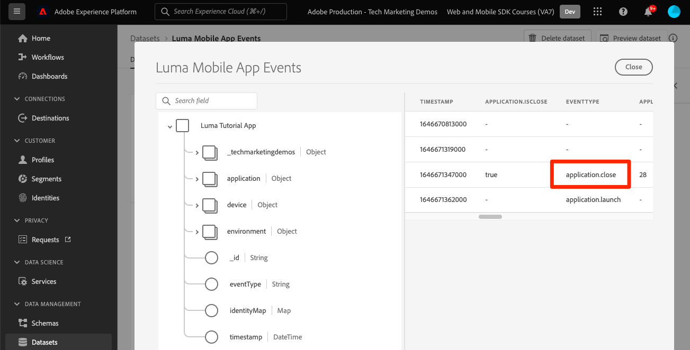

# Adobe Experience Platform으로 데이터 보내기

Adobe Experience Platform으로 데이터를 전송하는 방법에 대해 알아봅니다.

이 선택적 단원은 Real-time Customer Data Platform(Real-Time CDP), Journey Optimizer 및 Customer Journey Analytics의 모든 고객과 관련이 있습니다. Experience Cloud 제품의 기반인 Experience Platform은 Adobe 및 비Adobe의 모든 데이터를 강력한 고객 프로필로 변환하여 실시간으로 업데이트하고 AI 기반 인사이트를 사용하여 모든 채널에 적합한 경험을 제공할 수 있는 개방형 시스템입니다.

다음 [이벤트](events.md), [라이프사이클](lifecycle-data.md), 및 [신원](identity.md) 이전 단원에서 수집하여 Platform Edge Network로 전송한 데이터는 Adobe Experience Platform을 포함하여 데이터스트림에 구성된 서비스로 전달됩니다.

## 사전 요구 사항

Adobe Experience Platform에 대해 조직이 프로비저닝되고 권한이 부여되어야 합니다.

액세스 권한이 없으면 다음을 수행할 수 있습니다. [이 단원 건너뛰기](install-sdks.md).

## 학습 목표

이 단원에서는 다음 작업을 수행합니다.

* Experience Platform 데이터 세트를 만듭니다.
* 데이터 세트의 데이터를 확인합니다.
* 실시간 고객 프로필에 대한 스키마 및 데이터 세트를 활성화합니다.
* 실시간 고객 프로필에서 데이터의 유효성을 검사합니다.
* ID 그래프에서 데이터의 유효성을 검사합니다.

## 데이터 세트 만들기

Adobe Experience Platform에 성공적으로 수집된 모든 데이터는 데이터 세트로 데이터 레이크 내에 유지됩니다. 데이터 세트는 스키마(열) 및 필드(행)를 포함하는 데이터 수집을 위한 저장소 및 관리 구조입니다. 데이터 세트에는 저장하는 데이터의 다양한 측면을 설명하는 메타데이터도 포함됩니다. 다음을 참조하십시오. [설명서](https://experienceleague.adobe.com/docs/experience-platform/catalog/datasets/overview.html?lang=ko) 을 참조하십시오.

1. 오른쪽 상단의 3x3 메뉴에서 Experience Platform 인터페이스를 선택하여 해당 인터페이스로 이동합니다.
   

1. 선택 **[!UICONTROL 데이터 세트]** 왼쪽 탐색 메뉴에서

1. **[!UICONTROL 데이터 세트 만들기]**.
   

1. **[!UICONTROL 스키마에서 데이터 세트 만들기]**를 선택합니다.
   

1. 스키마를 검색하고 을(를) 선택합니다.

1. **[!UICONTROL 다음]**을 선택합니다.
   

1. 다음을 제공합니다. **[!UICONTROL 이름]**, **[!UICONTROL 설명]**, 및 선택 **[!UICONTROL 완료]**.
   

## 데이터 스트림 업데이트

데이터 세트를 만들었으면 다음을 확인하십시오. [데이터 스트림 업데이트](create-datastream.md) Adobe Experience Platform 추가. 이 업데이트를 통해 데이터가 플랫폼으로 전송됩니다.

## 데이터 세트의 데이터 유효성 검사

이제 데이터 세트를 만들고 데이터 스트림을 업데이트하여 Experience Platform으로 데이터를 보냈으므로 Platform Edge Network로 전송된 모든 XDM 데이터는 Platform으로 전달되어 데이터 세트에 도달합니다.

앱을 열고 이벤트를 추적하는 화면으로 이동합니다. 라이프사이클 지표를 트리거할 수도 있습니다.

플랫폼 인터페이스에서 데이터 세트를 엽니다. 데이터가 데이터 세트에 일괄적으로 도착하는 것이 보입니다

또한 를 사용하여 예제 레코드 및 필드를 볼 수 있어야 합니다. **[!UICONTROL 데이터 세트 미리 보기]** 기능:

Platform의 데이터 유효성 검사를 위한 더욱 강력한 도구 [쿼리 서비스](https://experienceleague.adobe.com/docs/platform-learn/tutorials/queries/explore-data.html?lang=ko-KR).

## 실시간 고객 프로필 활성화

Experience Platform의 실시간 고객 프로필을 사용하면 온라인, 오프라인, CRM 및 서드파티 데이터를 비롯한 여러 채널의 데이터를 결합하는 각 개별 고객에 대한 거시적인 보기를 구축할 수 있습니다. 프로필을 사용하면 서로 다른 고객 데이터를 하나의 통합 보기로 통합하여 모든 고객 상호 작용에 대해 실행 가능한 타임스탬프 계정을 제공할 수 있습니다.

### 스키마 활성화

1. 스키마 열기
1. 사용 **[!UICONTROL 프로필]**
1. 선택 **[!UICONTROL 이 스키마의 데이터는 identityMap 필드에 기본 ID를 포함합니다.]** 모달에서
1. **[!UICONTROL 저장]** 스키마

   

### 데이터 세트 활성화

1. 데이터 세트 열기
1. 사용 **[!UICONTROL 프로필]**

   

### 프로필의 데이터 유효성 검사

앱을 열고 이벤트를 추적하는 화면으로 이동합니다. Luma 앱에 로그인하고 구매합니다.

Assurance를 사용하여 identityMap에서 전달된 ID 중 하나를 찾습니다(이메일, lumaCrmId 또는 ECID).

>[!TIP]
>
>   값 `lumaCrmId` 은(는) `112ca06ed53d3db37e4cea49cc45b71e`

플랫폼 인터페이스에서 다음 위치로 이동합니다. **[!UICONTROL 프로필]** > **[!UICONTROL 찾아보기]**&#x200B;를 클릭하고 방금 잡은 id 값을 조회한 다음 프로필을 엽니다.

다음에서 **[!UICONTROL 세부 사항]** 화면을 보면 다음을 포함하여 사용자에 대한 기본 정보를 볼 수 있습니다. **[!UICONTROL **&#x200B;연결된 id **]**:

다음에서 **[!UICONTROL 이벤트]**, 이 사용자에 대해 모바일 앱 구현에서 수집된 이벤트를 볼 수 있습니다.

프로필 세부 정보 화면에서 링크를 클릭하여 ID 그래프를 보거나 로 이동합니다. **[!UICONTROL ID]** > **[!UICONTROL ID 그래프]** id 값을 조회합니다. 이 시각화는 프로필에 함께 연결된 모든 ID와 해당 출처를 보여 줍니다. 다음은 이 Mobile SDK 자습서(데이터 소스 2)와 를 모두 완료하여 수집된 데이터로 구성된 ID 그래프의 예입니다. [Web SDK 튜토리얼](https://experienceleague.adobe.com/docs/platform-learn/implement-web-sdk/overview.html?lang=ko-KR) (데이터 소스 1):

Customer Journey Analytics에서 분석하고 Real-time Customer Data Platform에서 세그먼트를 작성하는 작업을 포함하여 마케터와 분석가가 Experience Platform에서 캡처한 데이터로 수행할 수 있는 작업이 훨씬 더 많습니다. 출발이 좋으시네요!

다음: **[Journey Optimizer을 사용한 푸시 메시지](journey-optimizer-push.md)**

>[!NOTE]
>
>Adobe Experience Platform Mobile SDK에 대해 학습하는 데 시간을 투자해 주셔서 감사합니다. 질문이 있거나, 일반적인 피드백을 공유하거나, 향후 콘텐츠에 대한 제안이 있는 경우 이에 대해 공유하십시오. [Experience League 커뮤니티 토론 게시물](https://experienceleaguecommunities.adobe.com/t5/adobe-experience-platform-launch/tutorial-discussion-implement-adobe-experience-cloud-in-mobile/td-p/443796)
