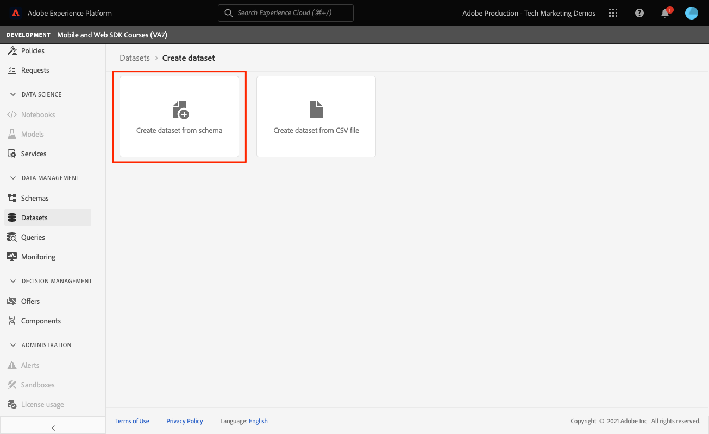

# Adobe Experience Platform으로 데이터 보내기

Adobe Experience Platform으로 데이터를 보내는 방법을 알아봅니다.

이 선택적 단원은 Real-time Customer Data Platform(Real-Time CDP), Journey Optimizer 및 Customer Journey Analytics의 모든 고객과 관련이 있습니다. Experience Cloud 제품의 기반인 Experience Platform은 Adobe과 비Adobe의 모든 데이터를 실시간으로 업데이트하는 강력한 고객 프로필로 변환하는 오픈 시스템입니다. 또한 AI 기반의 인사이트를 통해 모든 채널에서 최적의 경험을 제공할 수 있습니다.

다음 [이벤트](events.md), [라이프사이클](lifecycle-data.md), 및 [id](identity.md) 이전 단원에서 Platform Edge Network로 전송한 데이터는 Adobe Experience Platform을 포함하여 데이터 스트림에 구성된 서비스로 전달됩니다.

## 전제 조건

조직에 Adobe Experience Platform에 대한 제공 및 권한이 부여되어야 합니다.

액세스 권한이 없는 경우 다음을 수행할 수 있습니다 [이 단원 건너뛰기](install-sdks.md).

## 학습 목표

이 단원에서는 다음 작업을 수행합니다.

* Experience Platform 데이터 세트를 만듭니다.
* 데이터 집합에 있는 데이터의 유효성을 검사합니다.
* 실시간 고객 프로필을 위한 스키마 및 데이터 세트를 활성화합니다.
* 실시간 고객 프로필에서 데이터의 유효성을 검사합니다.
* ID 그래프의 데이터의 유효성을 검사합니다.

## 데이터 집합 만들기

Adobe Experience Platform에 성공적으로 수집된 모든 데이터는 데이터 레이크 내에서 데이터 세트로 유지됩니다. 데이터 세트는 스키마(열) 및 필드(행)를 포함하는 데이터 수집을 위한 저장소 및 관리 구조입니다. 데이터 세트에는 저장하는 데이터의 다양한 측면을 설명하는 메타데이터도 포함됩니다. 자세한 내용은 [설명서](https://experienceleague.adobe.com/docs/experience-platform/catalog/datasets/overview.html?lang=ko) 참조하십시오.

1. 오른쪽 상단에 있는 3x3 메뉴에서 선택하여 Experience Platform 인터페이스로 이동합니다.
   

1. 선택 **[!UICONTROL 데이터 세트]** 를 클릭합니다.

1. **[!UICONTROL 데이터 집합 만들기]**.
   

1. 선택 **[!UICONTROL 스키마에서 데이터 집합 만들기]**.
   

1. 스키마를 검색하고 선택합니다.

1. **[!UICONTROL 다음]**을 선택합니다.
   

1. 다음을 제공합니다. **[!UICONTROL 이름]**, **[!UICONTROL 설명]**, 을(를) 선택하고 을(를) 선택합니다. **[!UICONTROL 완료]**.
   

## 데이터 스트림 업데이트

데이터 세트를 만들었으면 반드시 다음을 수행하십시오 [데이터 스트림 업데이트](create-datastream.md) Adobe Experience Platform을 추가하려면 이 업데이트를 통해 Platform으로 데이터가 전송됩니다.

## 데이터 집합에 있는 데이터의 유효성 검사

데이터 세트를 만들고 데이터 스트림을 업데이트하여 데이터를 Experience Platform으로 전송했으므로 Platform Edge Network로 전송되는 모든 XDM 데이터가 Platform으로 전달되고 데이터 세트에 도달합니다.

앱을 열고 이벤트를 추적하는 화면으로 이동합니다. 라이프사이클 지표를 트리거할 수도 있습니다.

Platform 인터페이스에서 데이터 세트를 엽니다. 데이터가 데이터 세트에 일괄적으로 도달하는 것을 볼 수 있습니다

또한 를 사용하여 레코드 및 필드의 예제 **[!UICONTROL 데이터 세트 미리 보기]** 기능:

Platform의 강력한 데이터 검증 툴은 [쿼리 서비스](https://experienceleague.adobe.com/docs/platform-learn/tutorials/queries/explore-data.html?lang=ko-KR).

## 실시간 고객 프로필 활성화

Experience Platform의 실시간 고객 프로필을 사용하면 온라인, 오프라인, CRM 및 타사 데이터를 포함하여 여러 채널의 데이터를 결합하는 각 개별 고객을 종합적으로 파악할 수 있습니다. 프로필을 사용하면 서로 다른 고객 데이터를 모든 고객 상호 작용에 대해 실행 가능하고 타임스탬프가 지정된 계정을 제공하는 통합 보기에 통합할 수 있습니다.

### 스키마 활성화

1. 스키마 열기
1. 활성화 **[!UICONTROL 프로필]**
1. 선택 **[!UICONTROL 이 스키마의 데이터에 identityMap 필드에 기본 ID가 포함됩니다.]** 모달
1. **[!UICONTROL 저장]** 스키마

   

### 데이터 집합 활성화

1. 데이터 세트를 엽니다.
1. 활성화 **[!UICONTROL 프로필]**

   

### 프로필에서 데이터 유효성 검사

앱을 열고 이벤트를 추적하는 화면으로 이동합니다. Luma 앱에 로그인하고 구입합니다.

Assurance를 사용하여 identityMap에서 전달된 ID 중 하나를 찾습니다(전자 메일, lumaCrmId 또는 ECID).

>[!TIP]
>
>   의 값 `lumaCrmId` is `112ca06ed53d3db37e4cea49cc45b71e`

Platform 인터페이스에서 로 이동합니다. **[!UICONTROL 프로필]** > **[!UICONTROL 찾아보기]**&#x200B;를 클릭하고 방금 가져온 ID 값을 조회하고 프로필을 엽니다.

설정 **[!UICONTROL 세부 사항]** 화면에 을 포함하여 사용자에 대한 기본 정보가 표시됩니다 **[!UICONTROL **&#x200B;연결된 ID **]**:

설정 **[!UICONTROL 이벤트]**&#x200B;를 설정하는 경우 이 사용자에 대한 모바일 앱 구현에서 수집된 이벤트를 볼 수 있습니다.

프로필 세부 사항 화면에서 링크를 클릭하여 ID 그래프를 보거나 다음으로 이동합니다 **[!UICONTROL ID]** > **[!UICONTROL ID 그래프]** id 값을 조회 이 시각화는 프로필과 해당 원점에 함께 연결된 모든 ID를 보여줍니다. 다음은 이 Mobile SDK 자습서(데이터 소스 2)를 모두 완료하여 수집된 데이터로 구성된 ID 그래프의 예입니다 [웹 SDK 자습서](https://experienceleague.adobe.com/docs/platform-learn/implement-web-sdk/overview.html?lang=ko-KR) (데이터 소스 1):

마케터와 분석가가 Customer Journey Analytics에서 분석하고 Real-time Customer Data Platform에서 세그먼트 작성을 포함하여 Experience Platform에서 캡처된 데이터로 수행할 수 있는 작업은 훨씬 더 많습니다. 출발이 좋군요!

다음: **[Journey Optimizer을 사용한 푸시 메시지](journey-optimizer-push.md)**

>[!NOTE]
>
>Adobe Experience Platform Mobile SDK에 대한 학습에 시간을 내주셔서 감사합니다. 질문이 있거나 일반 피드백을 공유하거나 향후 컨텐츠에 대한 제안 사항이 있는 경우 해당 정보를 공유하십시오 [Experience League 커뮤니티 토론 게시물](https://experienceleaguecommunities.adobe.com/t5/adobe-experience-platform-launch/tutorial-discussion-implement-adobe-experience-cloud-in-mobile/td-p/443796)
