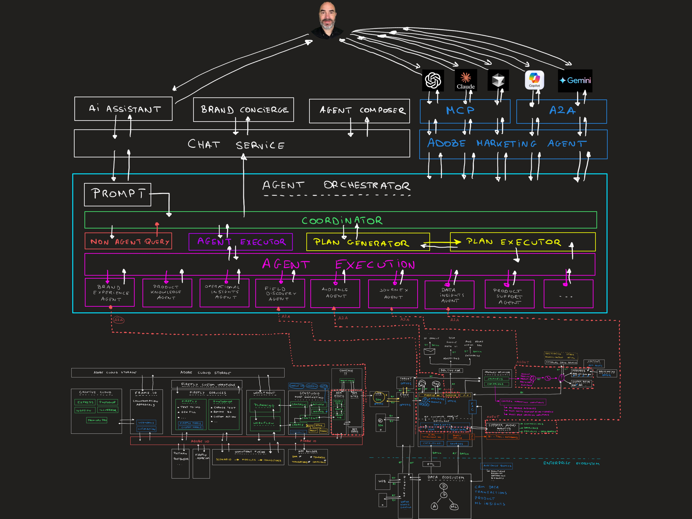

# 원 Adobe 자습서 - 아키텍처 개요

{width="50px" align="left"}

## 1 Adobe 아키텍처 개요

이 비디오에서는 전체 통합 One Adobe 자습서 뒤의 아키텍처에 대해 알아봅니다.

>[!VIDEO](https://video.tv.adobe.com/v/3481417?quality=12&learn=on)

아래의 아키텍처 개요 이미지를 다운로드하십시오.

>[!NOTE]
>
>질문이 있는 경우 향후 콘텐츠에 대한 제안 사항에 대한 일반적인 피드백을 공유하려면 기술 인사이더에게 **techinsiders@adobe.com**&#x200B;로 전자 메일을 보내 직접 문의하십시오.
