# 1.1.2 Adobe Marketing Agent for ChatGPT Enterprise

## 비디오

이 비디오에서는 이 연습과 관련된 모든 단계에 대한 설명과 데모를 제공합니다.

>[!VIDEO](https://video.tv.adobe.com/v/3478410?quality=12&learn=on)

## 1.1.2.1 Adobe Marketing Agent용 ChatGPT Enterprise에서 사용자 지정 앱 만들기

>[!NOTE]
>
>ChatGPT에서 Adobe Marketing Agent을 사용하려면 다음 요구 사항이 있습니다.
>- OpenAI의 ChatGPT Enterprise 유료 버전
>- ChatGPT Enterprise 웹 클라이언트 사용

[https://chatgpt.com/](https://chatgpt.com/){target="_blank"}(으)로 이동한 다음 계정 세부 정보를 사용하여 로그인합니다. 로그인하면 이 메시지가 표시됩니다. 사용자 이름을 클릭합니다.


**설정**&#x200B;을 선택하세요.


**앱**(으)로 이동한 다음 **고급 설정**&#x200B;을 선택합니다.

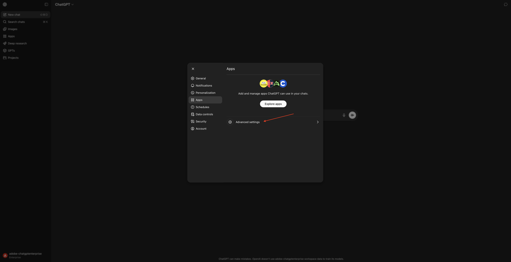

**개발자 모드**&#x200B;를 켠 다음 **뒤로**&#x200B;를 클릭하세요.

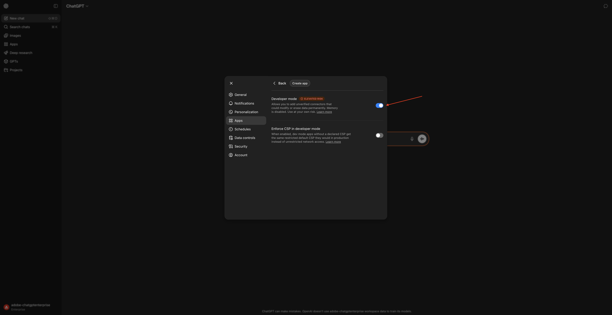

**앱 만들기**&#x200B;를 클릭합니다.

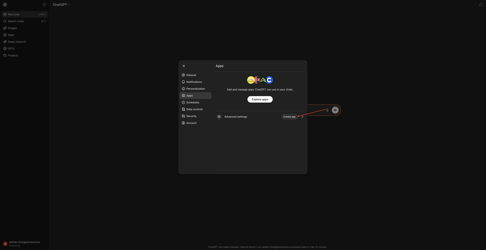

다음과 같이 필드를 채웁니다.

- **이름**: `Adobe Marketing Agent`
- **MCP 서버 URL**: Adobe 담당자에게 문의하십시오.
- **인증**: `OAuth`

**이해하고 계속하겠습니다**&#x200B;에 대한 확인란을 선택하세요.

**만들기**&#x200B;를 클릭합니다.


ChatGPT가 이제 Adobe 계정에 연결을 시도합니다. **액세스 허용**&#x200B;을 선택하면 Adobe 계정으로 로그인해야 합니다.


성공적으로 로그인하면 이제 Adobe Marketing Agent이 성공적으로 연결되었음을 알 수 있습니다.

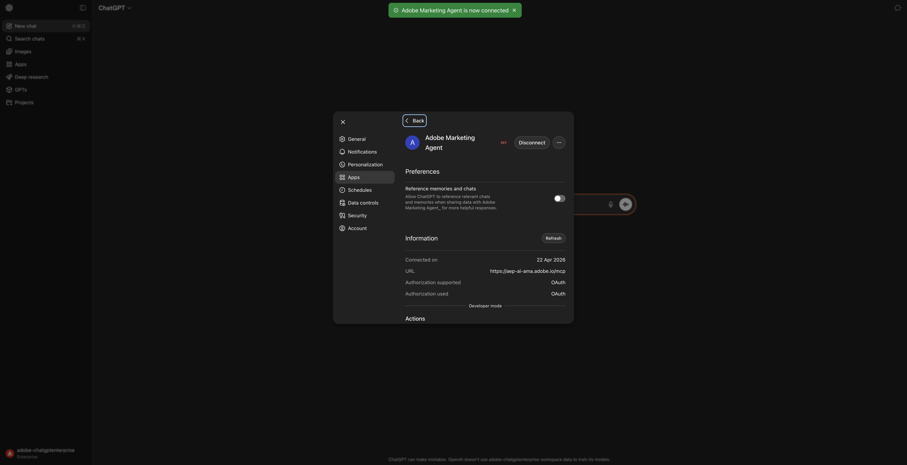

## Adobe Marketing Agent에서 1.1.2.2 컨텍스트 설정

이 창을 닫습니다.


그럼 이걸 보셔야죠 **+** 아이콘을 클릭하고 **자세히**(으)로 이동한 다음 **Adobe Marketing Agent**&#x200B;을(를) 선택합니다.


ChatGPT를 통해 Adobe Marketing Agent과 상호 작용하기 전에 컨텍스트를 설정해야 합니다.

이 연습에서는 다음을 사용하도록 컨텍스트를 설정해야 합니다.

- **IMS 조직**: `--aepImsOrgName--`.

- **샌드박스**: **프로덕션 - 하나의 Adobe**

샌드박스 설정은 질문을 할 때 ChatGPT가 확인해야 하는 샌드박스를 식별하는 데 도움이 됩니다.

- **데이터 보기**: **AdobeOne - 통합 고객 데이터 보기**

Dataview 설정은 ChatGPT가 질문을 할 때 확인해야 하는 데이터 보기를 식별하는 데 도움이 됩니다.

다음 **확인**&#x200B;을 입력하고 **보내기** 단추를 클릭하세요.

```
change context
```

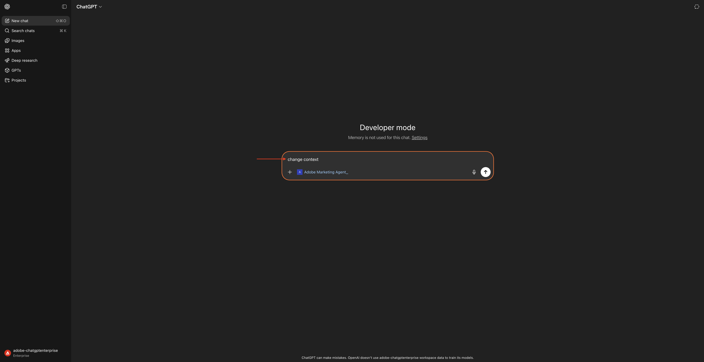

그러면 현재 조직, 샌드박스 및 데이터 보기 선택 사항을 보여주는 유사한 창이 표시됩니다. 위의 정보를 기반으로 이러한 필드를 올바른 조직, 샌드박스 및 데이터 보기로 변경하십시오.

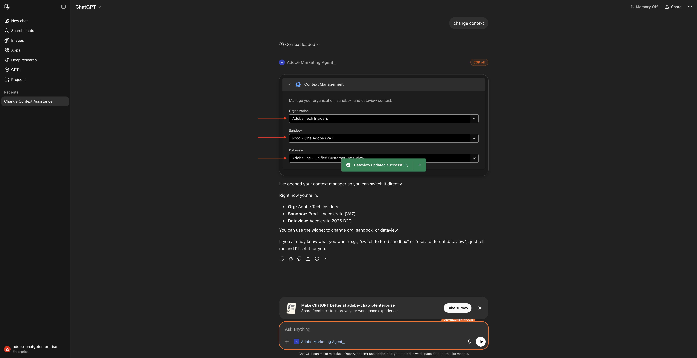

이제 컨텍스트가 제대로 설정되었으므로 다음에 특정 프롬프트 전송을 시작할 수 있습니다.

## 1.1.2.3 전체 구매 트렌드로 시작하여 컨텍스트를 고정하고 파이버 확대

**의도**

특히 최근 60일 동안 모바일, 유선전화, 인터넷, TV, 파이버 등 카테고리 요구 사항에 대한 최고 수준의 펄스 수신 이는 뉴욕 롤아웃 이후 계절성, 프로모션 효과 및 지역 분산에 대한 기준선을 설정합니다.

다음 **확인**&#x200B;을 입력하고 **보내기** 단추를 클릭하세요.

```
Show me purchases by mainCategory over the last 2 months.
```

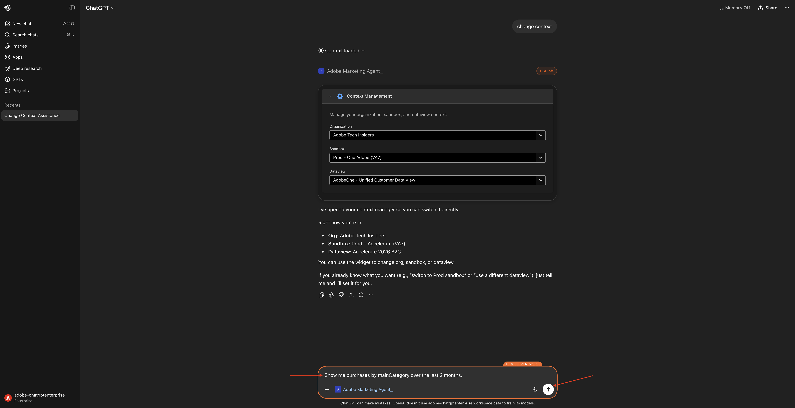

그런 다음 이 메시지가 표시됩니다.


다음 **확인**&#x200B;을 입력하고 **보내기** 단추를 클릭하세요.

```
Show me purchases by mainCategory = Fiber over the last 2 months per week
```


그런 다음 파이버 관련 추세로 드릴다운하는 이 내용을 확인해야 합니다.


## 1.1.2.4에서 주문과 콘텐츠 환경 설정의 상관 관계를 지정합니다.

**의도**

특정 장르(예: SciFi, Sports, Drama)에 대한 선호도가 광대역 업그레이드 동작(특히 높은 대역폭 요구 사항)을 예측한다는 가설을 테스트합니다.

먼저 장르 환경 설정을 저장하는 데 사용되는 필드를 확인해야 합니다.

다음 **확인**&#x200B;을 입력하고 **보내기** 단추를 클릭하세요.

```
Which field is used to store the preferred genre?
```


그러면 장르에 사용되는 필드가 **`--aepTenantId--.individualCharacteristics.telco.mediaPreferences.favouriteGenre`**&#x200B;임을 보여주는 이 메시지가 표시됩니다.


이 정보를 사용하여 구매 데이터에서 드릴다운을 시작할 수 있습니다.

다음 **확인**&#x200B;을 입력하고 **보내기** 단추를 클릭하세요.

```
Show me purchases by favouriteGenre for the last 2 months
```


그럼 이걸 보셔야죠


## 1.1.2.5 기존 파이버 여정 식별

**의도**

제목에 &quot;파이버&quot;가 포함된 활성 여정 또는 최근에 체결된 세그먼트를 확인합니다(예: &quot;파이버 업그레이드 NYC - 9월&quot;, &quot;파이버 평가판 - 스트리밍 번들&quot;).

다음 **확인**&#x200B;을 입력하고 **보내기** 단추를 클릭하세요.

```
What journeys exist? 
```

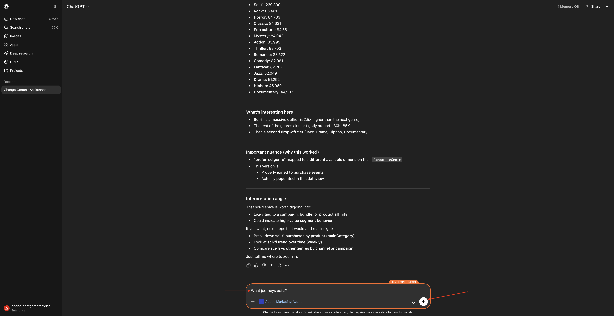

그럼 이걸 보셔야죠


다음 **확인**&#x200B;을 입력하고 **보내기** 단추를 클릭하세요.

```
Which of these journeys has 'Fiber' in its name?
```


그럼 이걸 보셔야죠

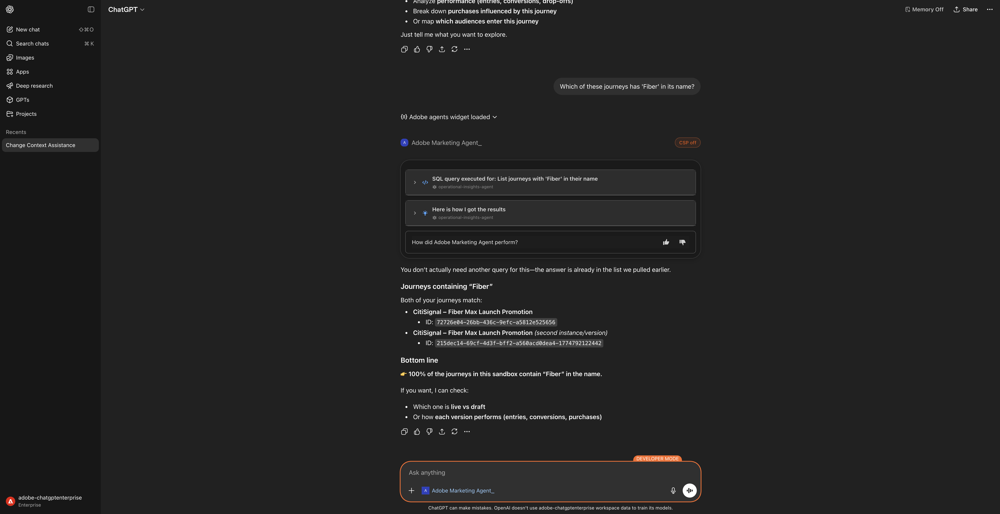

다음 **확인**&#x200B;을 입력하고 **보내기** 단추를 클릭하세요.

```
show me the details of the journey 'CitiSignal - Fiber Max Launch Promotion'
```

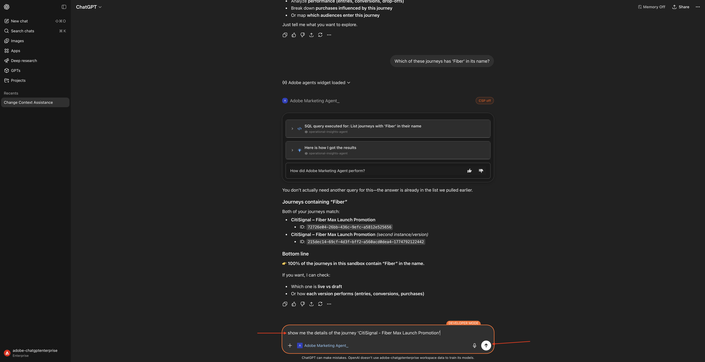

그럼 이걸 보셔야죠


## 1.1.2.6 폴아웃 분석을 통해 여정 성능의 유효성 검사

**의도**

여정 성능 폴아웃을 이해하여 여정 내에 많은 수의 프로필이 삭제되는 노드 또는 조건이 있는지 파악하려고 합니다. 이는 여정에서 추가 조정이 필요한지 여부를 이해하는 데 도움이 됩니다.

다음 **확인**&#x200B;을 입력하고 **보내기** 단추를 클릭하세요.

```
Create a fall-out report on the "CitiSignal - Fiber Max Launch Promotion" journey
```


그럼 이걸 보셔야죠

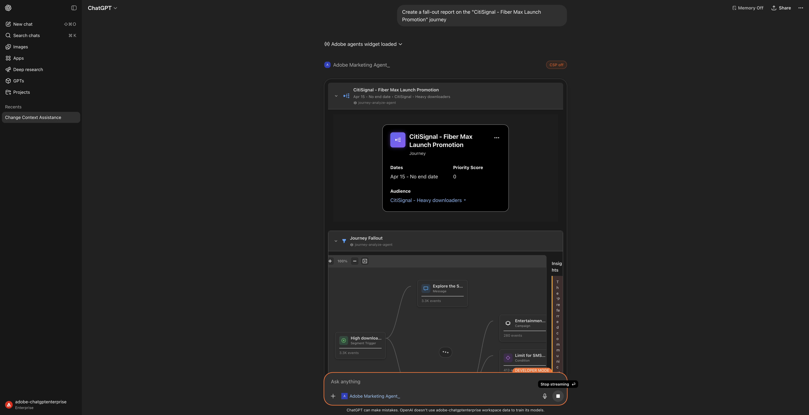

아래로 조금 스크롤하세요. 이제 각 노드와 해당 입력 번호, 폴아웃 번호 및 폴아웃 비율을 검사하여 테이블을 검토할 수 있습니다.


관찰 및 권장 사항을 보려면 조금 더 아래로 스크롤하십시오.


이제 이 실습을 완료했습니다.

## 다음 단계

[Adobe Marketing Agent for Microsoft 365 Copilot](./ex3.md){target="_blank"}(으)로 이동

[Agent Orchestrator](./agentorchestrator.md){target="_blank"}로 돌아가기

[모든 모듈로 돌아가기](./../../../overview.md){target="_blank"}
