# 1.1.3 Adobe Marketing Agent for Microsoft 365 Copilot

## 전제 조건

아래 문서화된 대로 이 랩의 단계를 수행하려면 다음 액세스가 필요합니다.

- Real-Time CDP, Journey Optimizer 및 Customer Journey Analytics 액세스
- Adobe Experience Cloud의 AI Assistant 액세스
- AEP Agent Orchestrator 액세스
- Microsoft 365 Copilot 액세스

## 비디오

이 비디오에서는 이 연습과 관련된 모든 단계에 대한 설명과 데모를 제공합니다.

>[!VIDEO](https://video.tv.adobe.com/v/3479158?quality=12&learn=on)

## 1.1.3.1 Microsoft 365개 팀 및 Copilot에 Adobe Marketing Agent 추가

Microsoft Teams을 열고 계정 세부 사항을 사용하여 로그인합니다. 로그인하면 이 메시지가 표시됩니다.

**앱**&#x200B;을 클릭합니다.

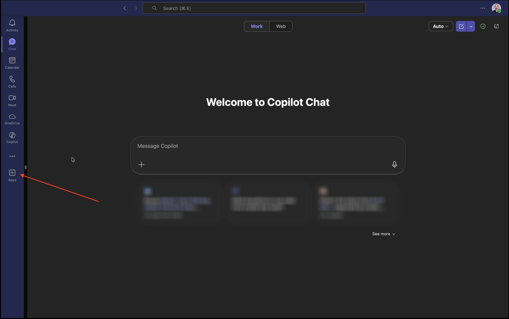

**앱 관리**&#x200B;를 선택합니다.

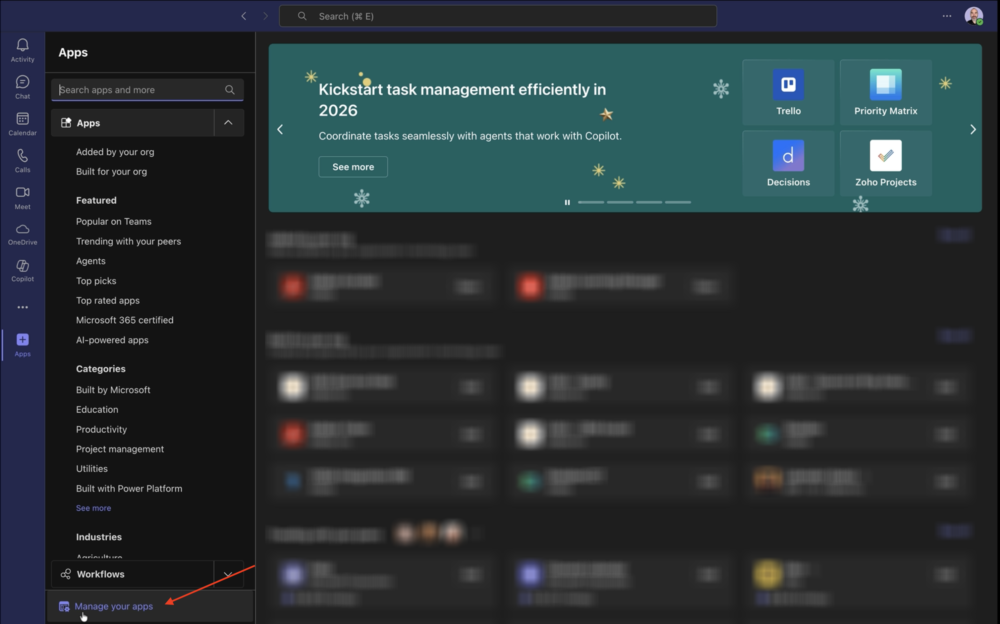

**앱 업로드**&#x200B;를 선택합니다.

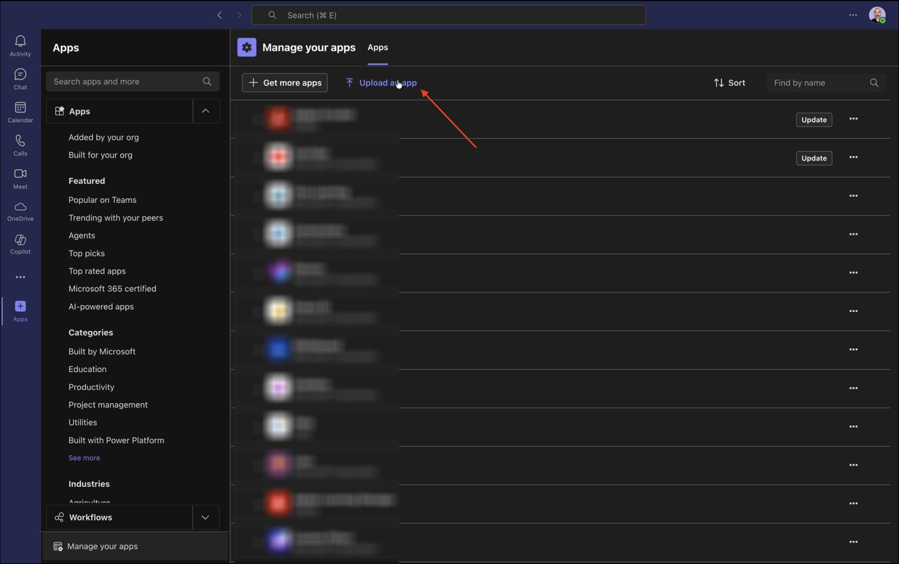

**사용자 지정 앱 업로드**&#x200B;를 선택합니다.

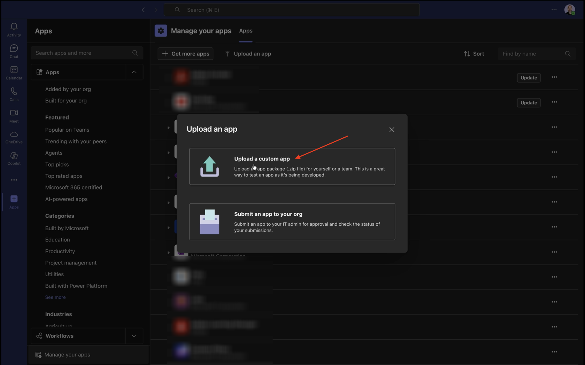

강사가 제공한 매니페스트 파일을 선택하고 **열기**&#x200B;를 클릭합니다.

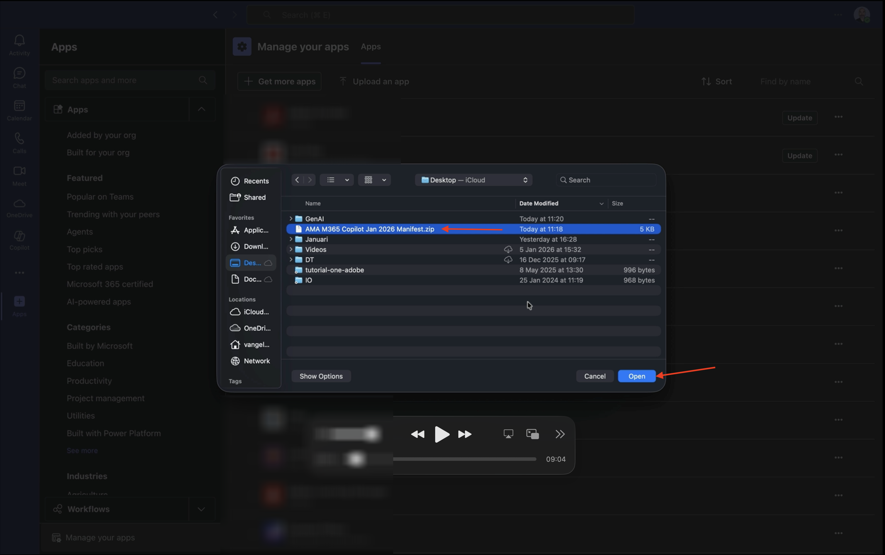

**추가를 클릭합니다**.


**Copilot으로 열기**&#x200B;를 클릭합니다.

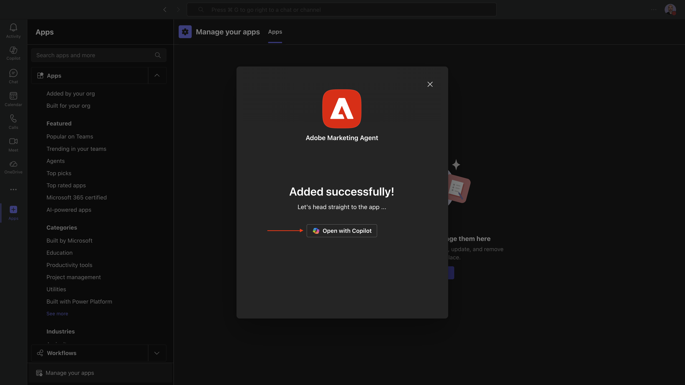

이제 Adobe Marketing Agent이 성공적으로 로드되었습니다.


프롬프트 `login`을(를) 입력하고 **보내기** 단추를 클릭합니다.


**Adobe Marketing Agent에 로그인**&#x200B;을 클릭합니다.

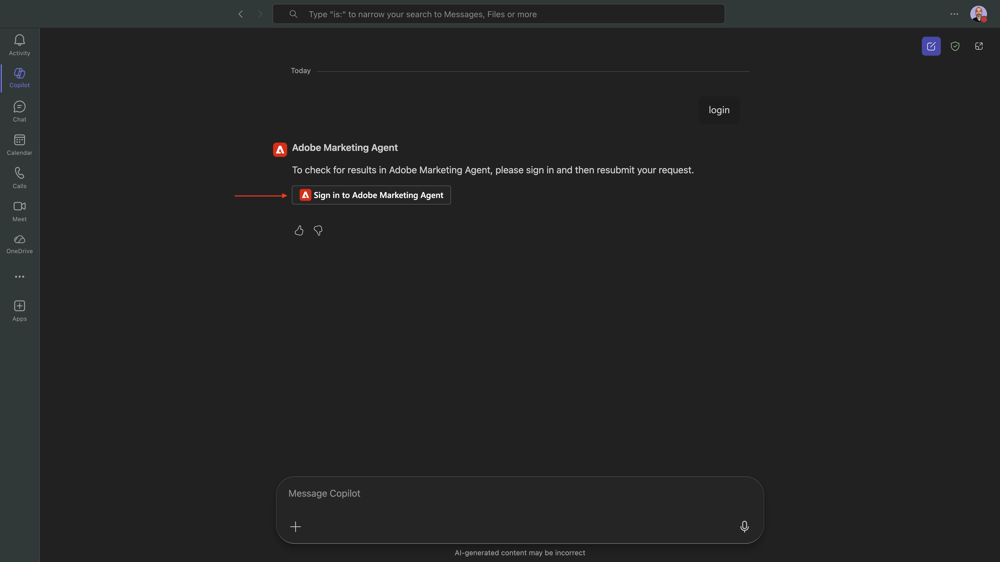

Adobe 계정 자격 증명을 사용하여 로그인하라는 새 창이 열립니다.


그러면 유사한 코드가 생성되는 것을 볼 수 있습니다. 코드를 복사하려면 **복사**&#x200B;를 클릭하세요.


Copilot의 Adobe Marketing Agent 창에 코드를 붙여 넣고 **보내기** 단추를 클릭합니다.


그러면 이와 비슷한 것을 볼 수 있을 겁니다. 이제 Microsoft 365 Copilot에서 Adobe Marketing Agent에 성공적으로 로그인했습니다.


## Adobe Marketing Agent에서 1.1.3.2 컨텍스트 설정

Copilot을 통해 Adobe Marketing Agent과 더 상호 작용하기 전에 컨텍스트를 설정해야 합니다.

이 연습에서는 다음을 사용하도록 컨텍스트를 설정해야 합니다.

- **샌드박스**: **프로덕션 - 하나의 Adobe(VA7)**

  샌드박스 설정은 질문을 할 때 AI Assistant가 확인해야 하는 샌드박스 를 식별하는 데 도움이 됩니다.

- **데이터 보기**: **AdobeOne - 통합 고객 데이터 보기**

  데이터 보기 설정은 질문을 할 때 AI Assistant가 확인해야 하는 데이터 보기 를 식별하는 데 도움이 됩니다.

먼저 샌드박스를 올바른 샌드박스로 변경한 다음 **데이터 보기 새로 고침**&#x200B;을 클릭합니다.


그런 다음 올바른 데이터 보기를 선택하고 **업데이트**&#x200B;를 클릭합니다.

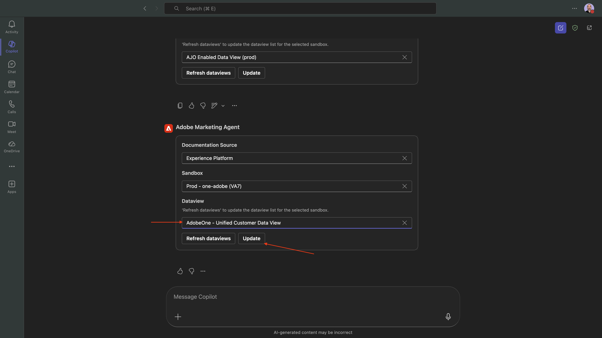

그럼 이걸 보셔야죠 이제 컨텍스트가 올바로 설정되므로 다음에 특정 프롬프트를 보내기 시작할 수 있습니다.

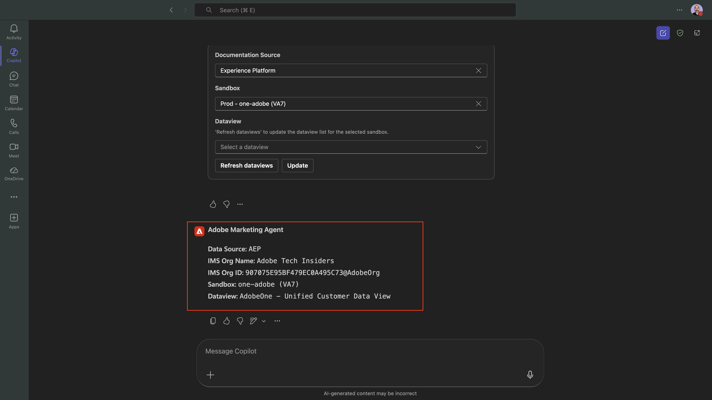

## 1.1.3.3 전체 구매 트렌드로 시작하여 컨텍스트를 고정하고 파이버 확대

**의도**

특히 최근 60일 동안 모바일, 유선전화, 인터넷, TV, 파이버 등 카테고리 요구 사항에 대한 최고 수준의 펄스 수신 이는 뉴욕 롤아웃 이후 계절성, 프로모션 효과 및 지역 분산에 대한 기준선을 설정합니다.

다음 **확인**&#x200B;을 입력하고 **보내기** 단추를 클릭하세요.

```
Show me purchases by mainCategory over the last 2 months.
```


그런 다음 이 메시지가 표시됩니다.


다음 **확인**&#x200B;을 입력하고 **보내기** 단추를 클릭하세요.

```
Show me purchases by mainCategory = Fiber over the last 2 months broken down by week
```

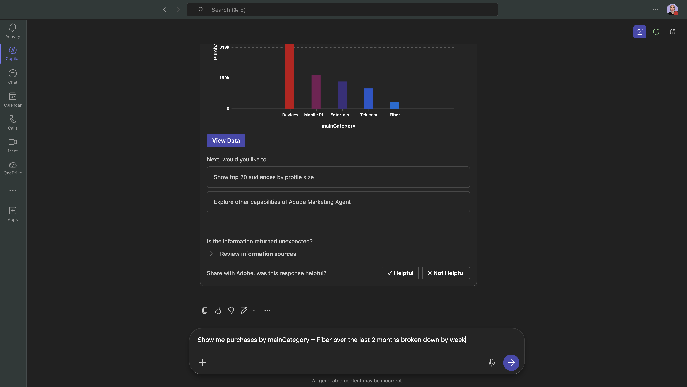

그런 다음 파이버 관련 추세로 드릴다운하는 이 내용을 확인해야 합니다.


## 1.1.3.4에서 주문과 콘텐츠 환경 설정의 상관 관계를 지정합니다.

**의도**

특정 장르(예: SciFi, Sports, Drama)에 대한 선호도가 광대역 업그레이드 동작(특히 높은 대역폭 요구 사항)을 예측한다는 가설을 테스트합니다.

먼저 장르 환경 설정을 저장하는 데 사용되는 필드를 확인해야 합니다.

다음 **확인**&#x200B;을 입력하고 **보내기** 단추를 클릭하세요.

```
Which field is used to store the preferred genre
```


그러면 장르에 사용되는 필드가 **`--aepTenantId--.individualCharacteristics.telco.mediaPreferences.favouriteGenre`**&#x200B;임을 보여주는 이 메시지가 표시됩니다.


이 정보를 사용하여 구매 데이터에서 드릴다운을 시작할 수 있습니다.

다음 **확인**&#x200B;을 입력하고 **보내기** 단추를 클릭하세요.

```
Show me purchases by preferred genre for the last 2 months until today
```

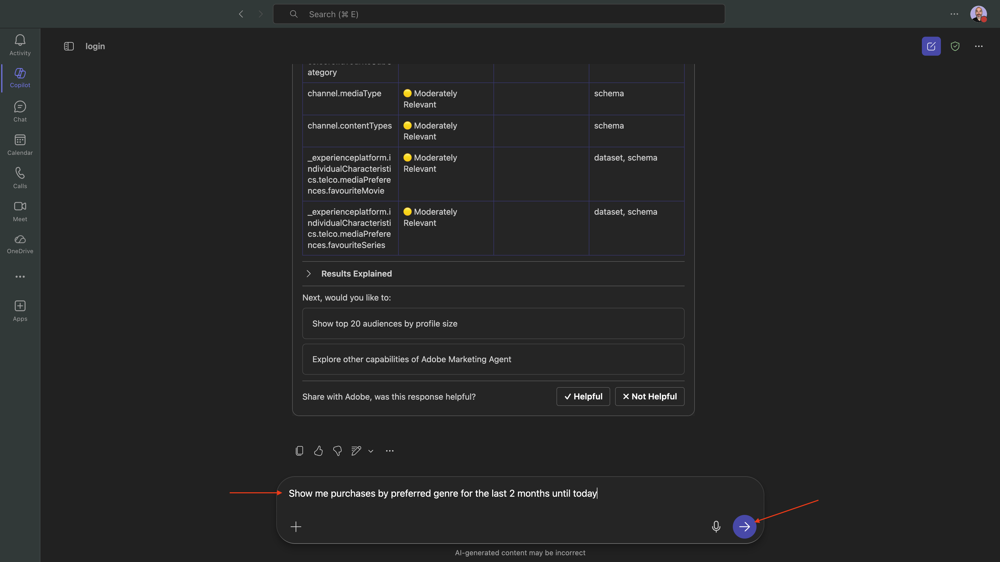

그럼 이걸 보셔야죠 **데이터 보기**&#x200B;를 클릭합니다.


그럼 이걸 보셔야죠


## 1.1.3.5 기존 파이버 여정 식별

**의도**

제목에 &quot;파이버&quot;가 포함된 활성 여정 또는 최근에 체결된 세그먼트를 확인합니다(예: &quot;파이버 업그레이드 NYC - 9월&quot;, &quot;파이버 평가판 - 스트리밍 번들&quot;).

다음 **확인**&#x200B;을 입력하고 **보내기** 단추를 클릭하세요.

```
What journeys exist? 
```


그러면 여정 목록이 표시됩니다.

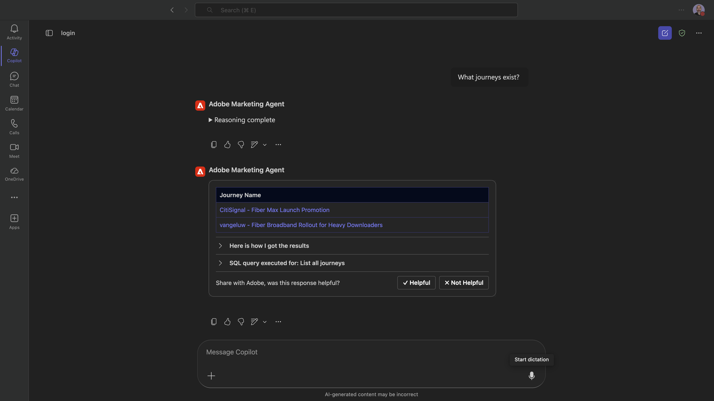

다음 **확인**&#x200B;을 입력하고 **보내기** 단추를 클릭하세요.

```
Which of these journeys has 'Fiber' in its name?
```


그럼 이걸 보셔야죠

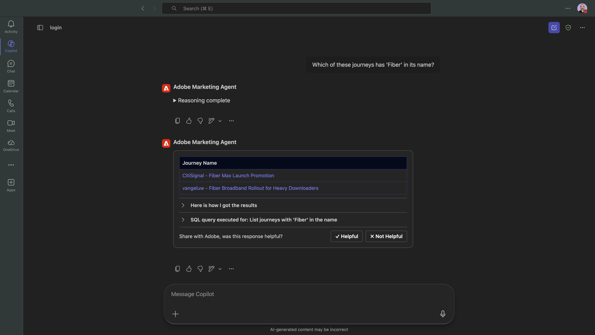

다음 **확인**&#x200B;을 입력하고 **보내기** 단추를 클릭하세요.

```
Show me the details of the journey 'CitiSignal - Fiber Max Launch Promotion'
```


그럼 이걸 보셔야죠


## 1.1.3.6 폴아웃 분석을 통해 여정 성능의 유효성 검사

**의도**

여정 성능 폴아웃을 이해하여 여정 내에 많은 수의 프로필이 삭제되는 노드 또는 조건이 있는지 파악하려고 합니다. 이는 여정에서 추가 조정이 필요한지 여부를 이해하는 데 도움이 됩니다.

다음 **확인**&#x200B;을 입력하고 **보내기** 단추를 클릭하세요.

```
Create a fall-out report on the "CitiSignal - Fiber Max Launch Promotion" journey
```


그럼 이걸 보셔야죠

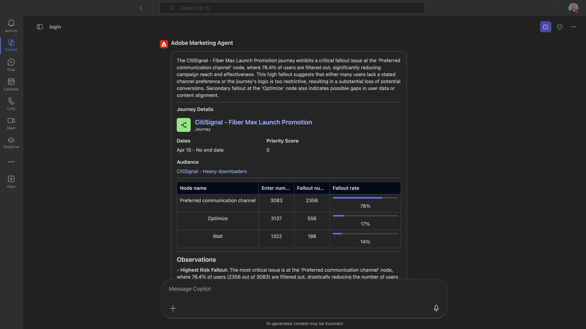

관찰 및 권장 사항을 보려면 조금 더 아래로 스크롤하십시오.


이제 이 실습을 완료했습니다.

## 다음 단계

[Google Gemini Enterprise용 Adobe Marketing Agent](./ex4.md){target="_blank"}(으)로 이동

[Agent Orchestrator](./agentorchestrator.md){target="_blank"}로 돌아가기

[모든 모듈로 돌아가기](./../../../overview.md){target="_blank"}
