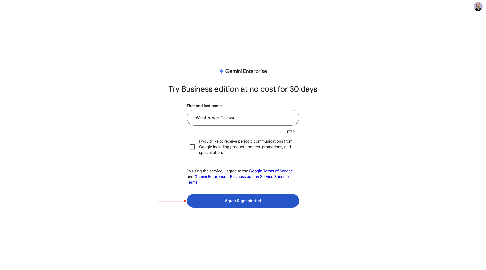
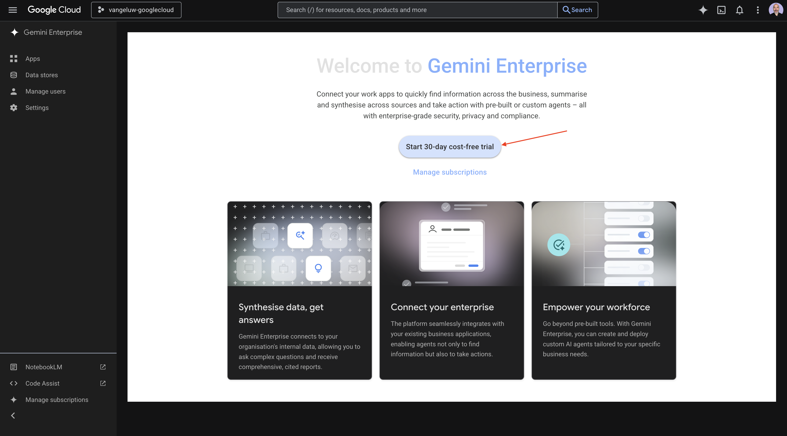
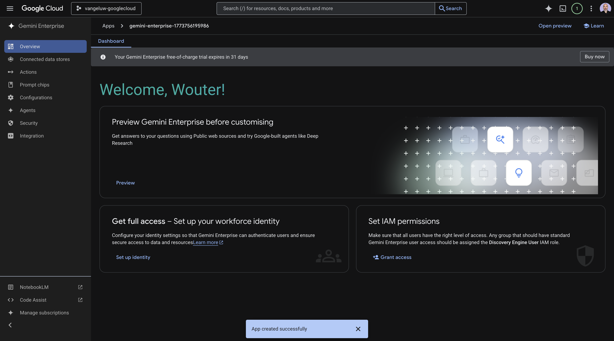
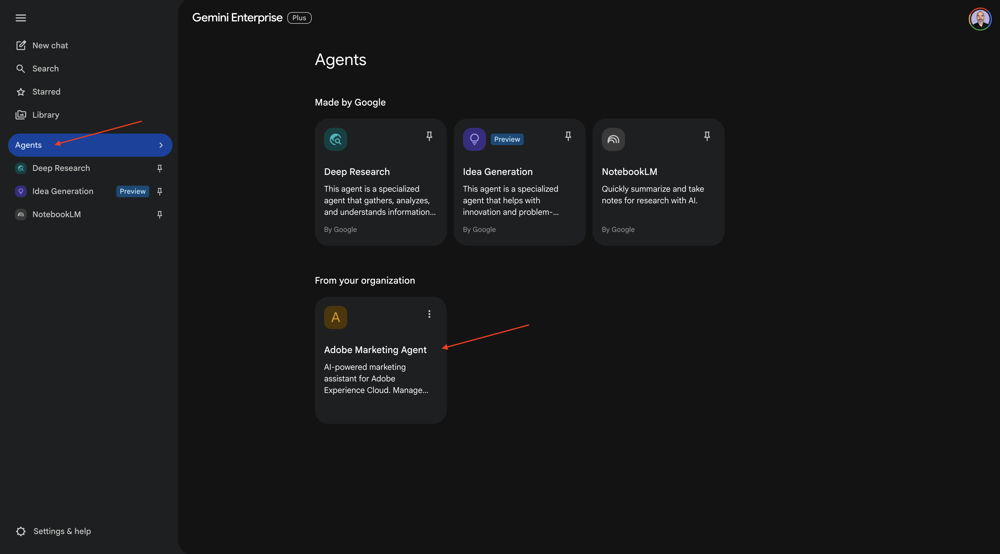
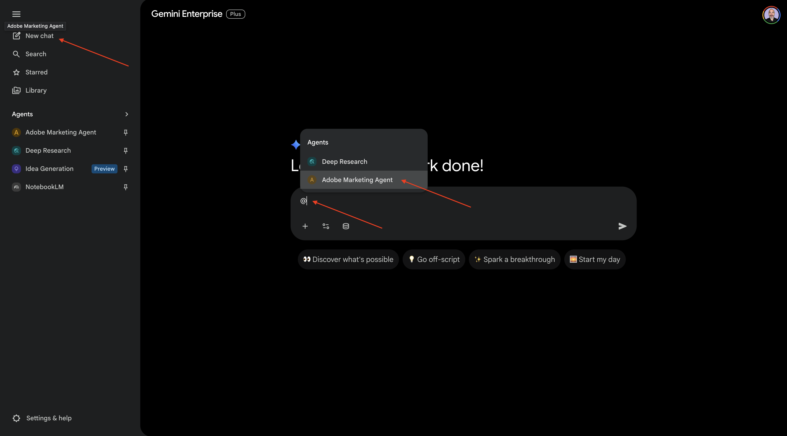
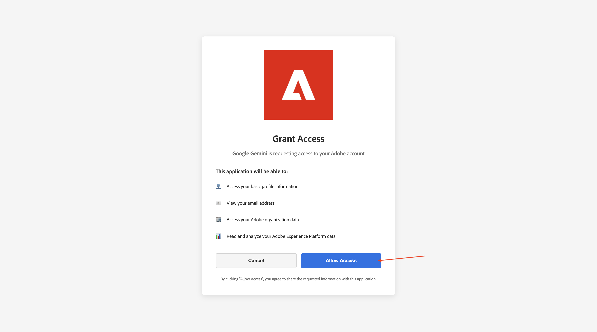
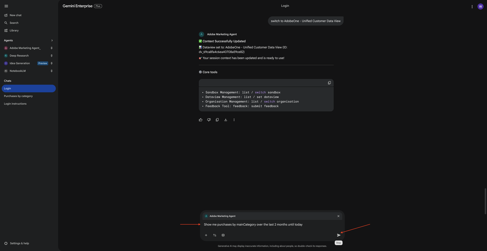
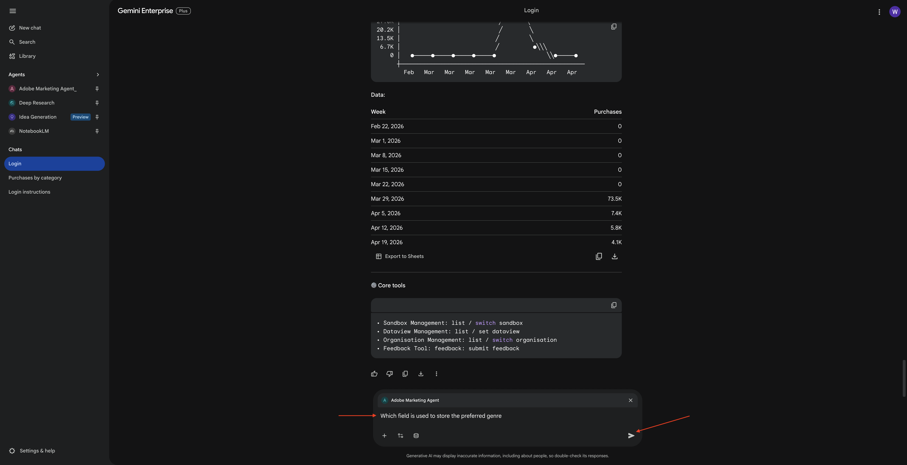
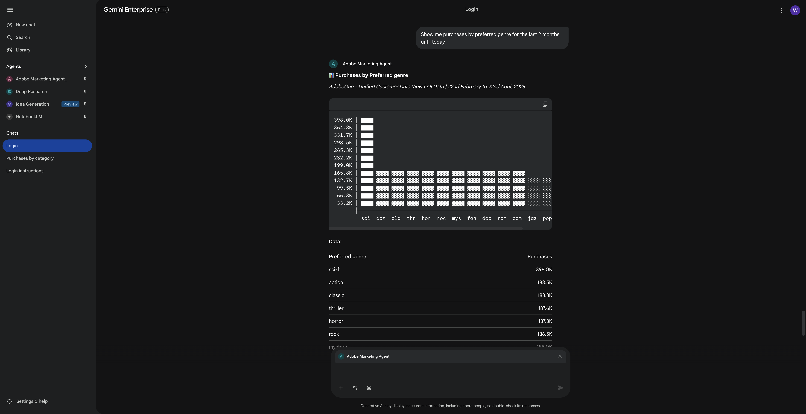

# 1.1.4 Google Gemini Enterprise용 Adobe Marketing Agent

[!BADGE Beta]

+++Beta 세부 정보
Google Gemini Enterprise Beta과 함께 Adobe Marketing Agent을 사용함으로써 귀하는 Beta이 어떠한 종류의 보증도 없이 &quot;있는 그대로&quot; 제공된다는 것을 인정합니다. Adobe은 Beta을 유지, 수정, 업데이트, 변경, 수정 또는 지원할 의무가 없습니다. 이러한 Beta 및/또는 동봉된 자료의 올바른 기능이나 성능에 어떤 식으로든 의존하지 말고 주의하는 것이 좋습니다. Beta은 Adobe의 기밀 정보로 간주됩니다.  귀하가 Adobe에 제공한 모든 &quot;피드백&quot;(Beta 사용 중 발생하는 문제 또는 결함, 제안, 개선 사항 및 권장 사항을 포함하되 이에 국한되지 않는 Beta 관련 정보)은 이에 따라 해당 피드백에 대한 모든 권한, 제목 및 관심을 포함하여 Adobe에 할당됩니다.

+++

## 전제 조건

아래 문서화된 대로 이 랩의 단계를 수행하려면 다음 액세스가 필요합니다.

- Real-Time CDP, Journey Optimizer 및 Customer Journey Analytics 액세스
- Adobe Experience Cloud의 AI Assistant 액세스
- AEP Agent Orchestrator 액세스
- Google Gemini Enterprise 액세스

## 비디오

이 비디오에서는 이 연습과 관련된 모든 단계에 대한 설명과 데모를 제공합니다.

>[!VIDEO](https://video.tv.adobe.com/v/3481322?quality=12&learn=on)

## Google Gemini Enterprise에 대한 1.1.4.1 액세스

[https://cloud.google.com/gemini-enterprise](https://cloud.google.com/gemini-enterprise)&#x200B;(으)로 이동합니다. **30일 무료 체험판 시작**&#x200B;을 클릭합니다.


Google 계정의 전자 메일 주소를 입력하고 **전자 메일 계속**&#x200B;을 클릭하세요.


이름과 성을 입력한 다음 **동의하고 시작하기**&#x200B;를 클릭합니다.



**나중에 하겠습니다**.


그럼 이걸 보셔야죠


[https://cloud.google.com/gemini-enterprise](https://cloud.google.com/gemini-enterprise)&#x200B;(으)로 이동합니다.

그럼 이런 걸 보셔야겠네요 먼저 청구 계정을 만든 다음 나중에 여기에서 선택해야 할 수도 있습니다.


**30일 무료 체험판 시작**&#x200B;을 클릭합니다.



**계속 및 API 활성화**&#x200B;를 클릭합니다.


**만들기**&#x200B;를 클릭합니다.


그럼 이걸 보셔야죠



## 1.1.4.2 A2A를 사용하여 사용자 지정 에이전트 만들기

[https://console.cloud.google.com/gemini-enterprise](https://console.cloud.google.com/gemini-enterprise)&#x200B;(으)로 이동합니다. **에이전트**&#x200B;를 클릭합니다.


**+에이전트 추가**&#x200B;를 클릭합니다.


A2A를 통해 **사용자 지정 에이전트를 선택합니다**.


**에이전트 카드 JSON**&#x200B;을(를) 붙여 넣습니다.

>[!NOTE]
>
>**에이전트 카드 JSON** 정보를 얻으려면 Adobe 담당자에게 문의하십시오.


**에이전트 카드 JSON**&#x200B;을(를) 붙여넣은 후 **에이전트 세부 정보 미리 보기**&#x200B;를 클릭합니다.


그럼 이런 걸 보셔야겠네요 아래로 스크롤하여 **다음**&#x200B;을 클릭합니다.


그럼 이런 걸 보셔야겠네요


인스턴스의 필드를 채웁니다.

- **클라이언트 ID**:

```
--aepImsOrgId--
```

- **클라이언트 암호**:

```
AdobeMarketingAgent
```

- **인증 URL**:

```
https://XXX.adobe.io/authorize
```

- **토큰 URL**:

```
https://XXX.adobe.io/token
```

- **범위**:

```
openid email profile
```

**마침을 클릭합니다**.


그럼 이걸 보셔야죠


## Adobe Marketing Agent에 1.1.4.3 로그인

**개요**(으)로 이동한 다음 **미리 보기**&#x200B;를 클릭합니다.


**시작** 클릭


**에이전트**(으)로 이동합니다. **Adobe Marketing Agent**&#x200B;이(가) 표시됩니다.



세 점 **..**&#x200B;을(를) 클릭한 다음 **고정**&#x200B;을(를) 선택합니다.


**새 채팅**(으)로 이동하여 채팅에 기호 **@**&#x200B;을(를) 입력하세요. **Adobe Marketing Agent**&#x200B;을(를) 클릭합니다.



`login` 명령을 입력한 다음 **보내기**&#x200B;를 클릭합니다.


그럼 이걸 보셔야죠 **승인**&#x200B;을 클릭합니다.


**액세스 허용**&#x200B;을 클릭하고 Adobe ID을 사용하여 로그인을 완료하고 메시지가 표시되면 `--aepImsOrgName--` 인스턴스를 선택합니다.



그럼 이걸 보셔야죠


## Adobe Marketing Agent에서 1.1.4.4 컨텍스트 설정

Copilot을 통해 Adobe Marketing Agent과 더 상호 작용하기 전에 컨텍스트를 설정해야 합니다.

이 연습에서는 다음을 사용하도록 컨텍스트를 설정해야 합니다.

- **샌드박스**: **프로덕션 - 가속화(VA7)**

  샌드박스 설정은 질문을 할 때 AI Assistant가 확인해야 하는 샌드박스 를 식별하는 데 도움이 됩니다.

- **데이터 보기**: **2026년 B2C 가속화**

데이터 보기 설정은 질문을 할 때 AI Assistant가 확인해야 하는 데이터 보기 를 식별하는 데 도움이 됩니다.

샌드박스를 변경하려면 다음 명령을 입력하고 **보내기** 단추를 클릭하십시오.

```javascript
list sandboxes
```


그러면 이와 비슷한 것을 볼 수 있을 겁니다. `switch to sandbox accelerate` 명령을 입력하고 **보내기** 단추를 클릭합니다.


그럼 이걸 보셔야죠 데이터 보기를 변경하려면 다음 명령을 입력하고 **보내기** 단추를 클릭하십시오.

```javascript
list dataviews
```


그러면 이와 비슷한 것을 볼 수 있을 겁니다. `switch dataview to Accelerate 2026 B2C` 명령을 입력하고 **보내기** 단추를 클릭합니다.


그럼 이걸 보셔야죠 이제 컨텍스트가 올바로 설정되므로 다음에 특정 프롬프트를 보내기 시작할 수 있습니다.


## 1.1.4.5 전체 구매 트렌드로 시작하여 컨텍스트를 고정하고 파이버 확대

**의도**

특히 최근 60일 동안 모바일, 유선전화, 인터넷, TV, 파이버 등 카테고리 요구 사항에 대한 최고 수준의 펄스 수신 이는 뉴욕 롤아웃 이후 계절성, 프로모션 효과 및 지역 분산에 대한 기준선을 설정합니다.

다음 **확인**&#x200B;을 입력하고 **보내기** 단추를 클릭하세요.

```javascript
Show me purchases by mainCategory over the last 7 months.
```



그런 다음 이 메시지가 표시됩니다.


다음 **확인**&#x200B;을 입력하고 **보내기** 단추를 클릭하세요.

```javascript
Show me purchases by mainCategory = Fiber over the last 7 months broken down by week
```


그런 다음 파이버 관련 추세로 드릴다운하는 이 내용을 확인해야 합니다.


## 1.1.4.6에서 주문과 콘텐츠 환경 설정의 상관 관계를 지정합니다.

**의도**

특정 장르(예: SciFi, Sports, Drama)에 대한 선호도가 광대역 업그레이드 동작(특히 높은 대역폭 요구 사항)을 예측한다는 가설을 테스트합니다.

먼저 장르 환경 설정을 저장하는 데 사용되는 필드를 확인해야 합니다.

다음 **확인**&#x200B;을 입력하고 **보내기** 단추를 클릭하세요.

```javascript
Which field is used to store the preferred genre
```



그러면 장르에 사용되는 필드가 **_experienceplatform.individualCharacteristics.preferences.preferredGenre**&#x200B;임을 보여주는 이 메시지가 표시됩니다.


이 정보를 사용하여 구매 데이터에서 드릴다운을 시작할 수 있습니다.

다음 **확인**&#x200B;을 입력하고 **보내기** 단추를 클릭하세요.

```javascript
Show me ordersYTD by preferredGenre for the last 7 months
```


그럼 이걸 보셔야죠



## 1.1.4.7 기존 파이버 여정 식별

**의도**

제목에 &quot;파이버&quot;가 포함된 활성 여정 또는 최근에 체결된 세그먼트를 확인합니다(예: &quot;파이버 업그레이드 NYC - 9월&quot;, &quot;파이버 평가판 - 스트리밍 번들&quot;).

다음 **확인**&#x200B;을 입력하고 **보내기** 단추를 클릭하세요.

```javascript
What journeys exist? 
```


그러면 여정 목록이 표시됩니다.


다음 **확인**&#x200B;을 입력하고 **보내기** 단추를 클릭하세요.

```javascript
Which of these journeys has 'Fiber' in its name?
```


그럼 이걸 보셔야죠


다음 **확인**&#x200B;을 입력하고 **보내기** 단추를 클릭하세요.

```javascript
Show me the details of the journey 'CitiSignal - Fiber Max Launch Promotion'
```


그럼 이걸 보셔야죠


## 1.1.4.8 폴아웃 분석을 통해 여정 성능의 유효성 검사

**의도**

여정 성능 폴아웃을 이해하여 여정 내에 많은 수의 프로필이 삭제되는 노드 또는 조건이 있는지 파악하려고 합니다. 이는 여정에서 추가 조정이 필요한지 여부를 이해하는 데 도움이 됩니다.

다음 **확인**&#x200B;을 입력하고 **보내기** 단추를 클릭하세요.

```javascript
Create a fall-out report on the "CitiSignal - Fiber Max Launch Promotion" journey
```


그럼 이걸 보셔야죠


이제 이 실습을 완료했습니다.

## 다음 단계

[1.1.5 Adobe Marketing Agent for Claude](./ex5.md){target="_blank"}(으)로 이동

[Agent Orchestrator](./agentorchestrator.md){target="_blank"}로 돌아가기

[모든 모듈로 돌아가기](./../../../overview.md){target="_blank"}
