# 1.1.6 —

[!BADGE Beta]

+++Beta 세부 정보
Agent Orchestrator Beta을 사용함으로써 귀하는 Beta이 어떠한 종류의 보증도 없이 &quot;있는 그대로&quot; 제공된다는 것을 인정합니다. Adobe은 Beta을 유지, 수정, 업데이트, 변경, 수정 또는 지원할 의무가 없습니다. 이러한 Beta 및/또는 동봉된 자료의 올바른 기능이나 성능에 어떤 식으로든 의존하지 말고 주의하는 것이 좋습니다. Beta은 Adobe의 기밀 정보로 간주됩니다.  귀하가 Adobe에 제공한 모든 &quot;피드백&quot;(Beta 사용 중 발생하는 문제 또는 결함, 제안, 개선 사항 및 권장 사항을 포함하되 이에 국한되지 않는 Beta 관련 정보)은 이에 따라 해당 피드백에 대한 모든 권한, 제목 및 관심을 포함하여 Adobe에 할당됩니다.

+++

## 전제 조건

아래 문서화된 대로 이 랩의 단계를 수행하려면 다음 액세스가 필요합니다.

- Real-Time CDP, Journey Optimizer 및 Customer Journey Analytics 액세스
- Adobe Experience Cloud의 AI Assistant 액세스
- AEP Agent Orchestrator 액세스
- Node.js 18+를 시스템에 설치해야 합니다

## 1.1.6.1 설치 Agent Orchestrator

### IAM

IAM을 사용하여 아래 그룹에 자신을 추가하여 LLM 자격 증명에 액세스할 수 있습니다.

>[!NOTE]
>
>아래 지침 중 일부는 Adobe에만 해당됩니다. 사용할 GRP에 대해 Adobe 담당자에게 문의하십시오.

```
GRP-XXX
```

### Agent Orchestrator 설치

컴퓨터에서 새 터미널 창을 엽니다.


>[!NOTE]
>
>아래 명령을 사용하려면 특정 URL이 필요합니다. 사용할 URL은 Adobe 담당자에게 문의하십시오.

다음 명령을 실행합니다.

```
npm login --registry=https://XXX/ --auth-type=web
```

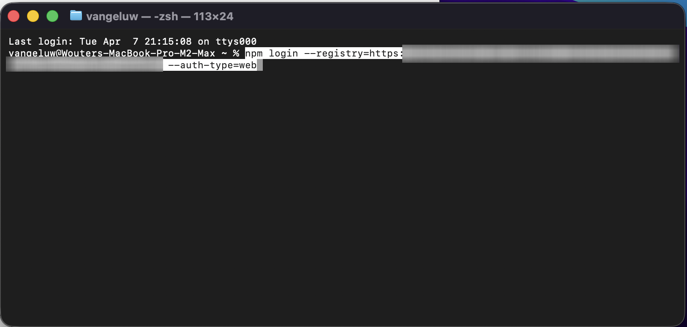

그럼 이걸 보셔야죠 **Enter**&#x200B;를 누릅니다.

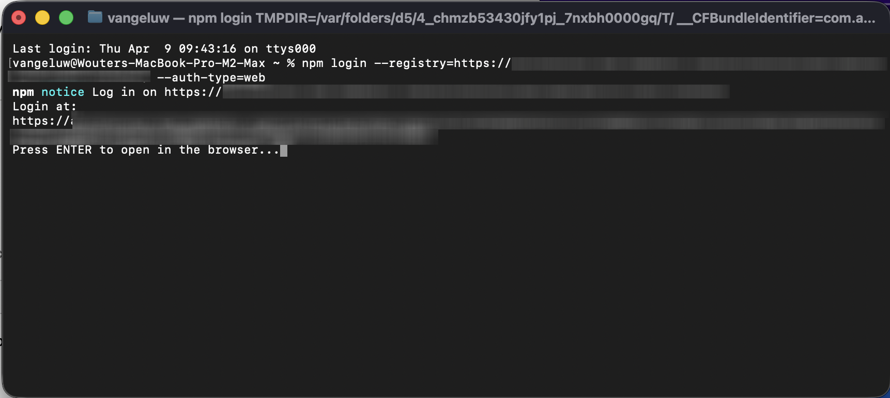

**SAML SSO**&#x200B;를 선택하십시오.

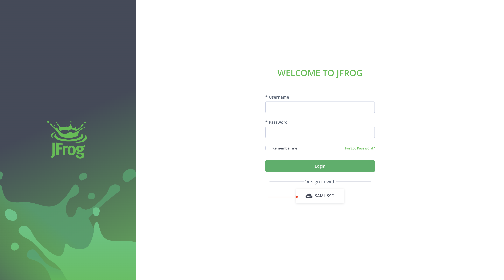

**예**&#x200B;를 클릭합니다.


그럼 이걸 보셔야죠

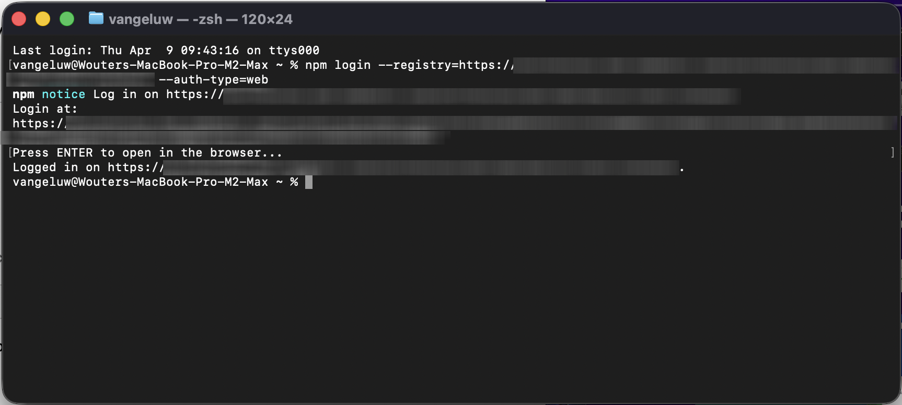

다음 명령을 실행합니다.

```
npm install -g ao --no-fund --registry=https://XXX/
```


그럼 이걸 보셔야죠 다음 명령을 실행합니다.

```
ao --help
```


Agent Orchestrator이 설치되었습니다. 다음 명령을 실행하여 **Agent Orchestrator**&#x200B;을(를) 시작합니다.

```
ao web
```

그럼 이걸 보셔야죠 **Enter**&#x200B;를 눌러 Agent Orchestrator 웹 UI를 엽니다.


## 1.1.6.2 Agent Orchestrator 구성

**AO LLM 사용**&#x200B;을 클릭합니다.


**프로덕션에 로그인**&#x200B;을 클릭합니다.


**레이어** 아이콘을 클릭합니다.

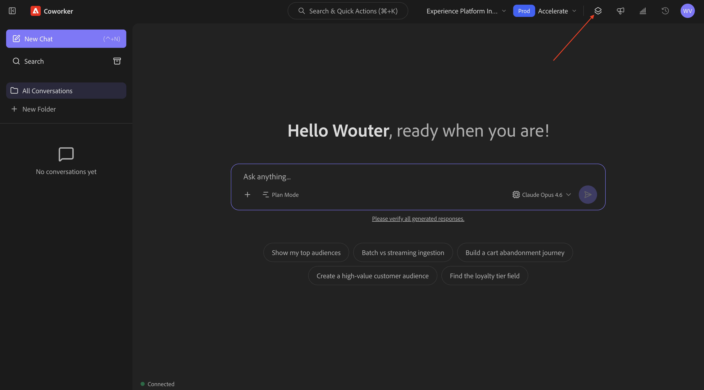

**AEP AI Assistant(코드 실행 - BashKit)**&#x200B;을(를) 선택하십시오.


**프로필** 아이콘을 클릭한 다음 **설정**&#x200B;을 선택합니다.


**Plugins**(으)로 이동하여 **cja**&#x200B;을(를) 클릭합니다.

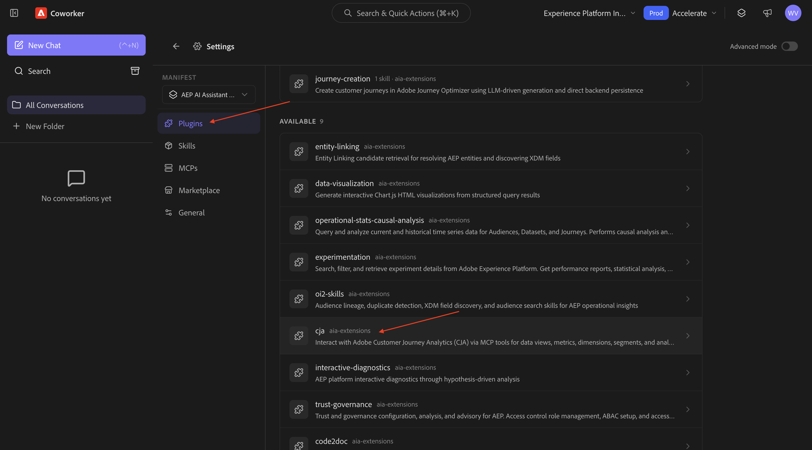

**설치**&#x200B;를 클릭합니다.

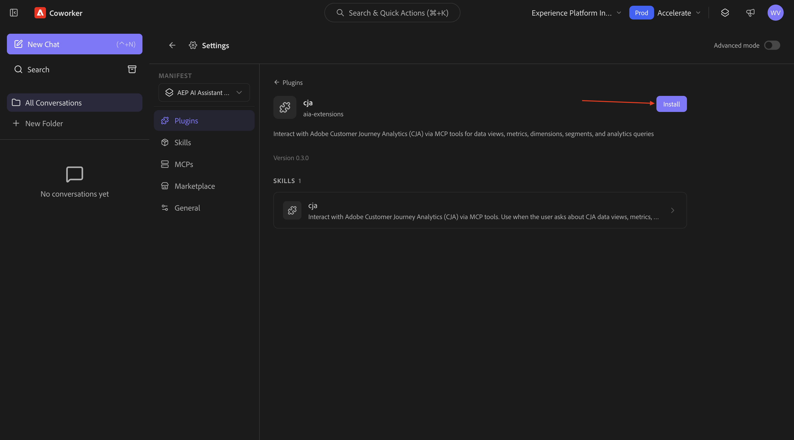

## 1.1.6.3 컨텍스트 설정

**새 채팅**&#x200B;을 클릭합니다.

인스턴스가 인스턴스 **Experience Platform International** 및 샌드박스 **가속화**&#x200B;를 사용하도록 설정되어 있는지 확인하십시오.

다음 명령을 입력하고 **보내기**&#x200B;를 클릭합니다.

```
list dataviews
```


다음 명령을 입력하고 **보내기**&#x200B;를 클릭합니다.

```
switch to dataview Accelerate 2026 B2C
```


그럼 이걸 보셔야죠


## 1.1.6.4 전체 구매 트렌드로 시작하여 컨텍스트를 고정하고 파이버 확대

**의도**

특히 최근 60일 동안 모바일, 유선전화, 인터넷, TV, 파이버 등 카테고리 요구 사항에 대한 최고 수준의 펄스 수신 이는 뉴욕 롤아웃 이후 계절성, 프로모션 효과 및 지역 분산에 대한 기준선을 설정합니다.

다음 **확인**&#x200B;을 입력하고 **보내기** 단추를 클릭하세요.

```javascript
Show me purchases by mainCategory over the last 7 months.
```


그런 다음 이 메시지가 표시됩니다.

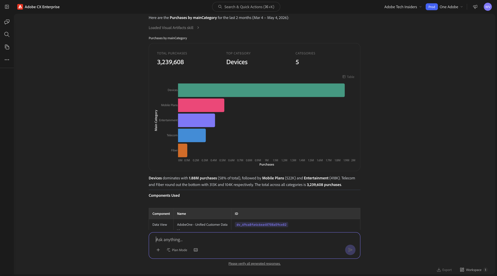

다음 **확인**&#x200B;을 입력하고 **보내기** 단추를 클릭하세요.

```javascript
Show me purchases by mainCategory = Fiber over the last 7 months per week
```


그런 다음 파이버 관련 추세로 드릴다운하는 이 내용을 확인해야 합니다.


## 1.1.6.5에서 주문과 콘텐츠 환경 설정의 상관 관계를 지정합니다.

**의도**

특정 장르(예: SciFi, Sports, Drama)에 대한 선호도가 광대역 업그레이드 동작(특히 높은 대역폭 요구 사항)을 예측한다는 가설을 테스트합니다.

먼저 장르 환경 설정을 저장하는 데 사용되는 필드를 확인해야 합니다.

다음 **확인**&#x200B;을 입력하고 **보내기** 단추를 클릭하세요.

```javascript
Which field is used to store the preferred genre?
```


그러면 장르에 사용되는 필드가 **_experienceplatform.individualCharacteristics.preferences.preferredGenre**&#x200B;임을 보여주는 이 메시지가 표시됩니다.


이 정보를 사용하여 구매 데이터에서 드릴다운을 시작할 수 있습니다.

다음 **확인**&#x200B;을 입력하고 **보내기** 단추를 클릭하세요.

```javascript
Show me ordersYTD by preferredGenre for the last 7 months
```


그럼 이걸 보셔야죠


## 1.1.6.6 기존 파이버 여정 식별

**의도**

제목에 &quot;파이버&quot;가 포함된 활성 여정 또는 최근에 체결된 세그먼트를 확인합니다(예: &quot;파이버 업그레이드 NYC - 9월&quot;, &quot;파이버 평가판 - 스트리밍 번들&quot;).

다음 **확인**&#x200B;을 입력하고 **보내기** 단추를 클릭하세요.

```javascript
What journeys exist? 
```


그럼 이걸 보셔야죠


다음 **확인**&#x200B;을 입력하고 **보내기** 단추를 클릭하세요.

```javascript
Which of these journeys has 'Fiber' in its name?
```


그럼 이걸 보셔야죠 여정 중 하나에 있는 링크를 클릭합니다.


새 창이 열리면 즉시 여정 세부 정보 개요로 이동합니다.


## 1.1.6.7 사용 중인 대상 확인

**의도**:

CitiSignal - Fibre Max Launch Promotion 여정의 초기 정의(예: &quot;SciFi 장르 환경 설정&quot;, &quot;4+ 장치&quot;, &quot;스트림 ≥ 300GB/month&quot;)를 대상으로 한 특성)를 이해합니다.

다음 **확인**&#x200B;을 입력하고 **보내기** 단추를 클릭하세요.

```javascript
What was the initial audience in the journey named CitiSignal - Fiber Max Launch Promotion Winter 2026?
```


그럼 이걸 보셔야죠


## 1.1.6.8 폴아웃 분석을 통해 여정 성능의 유효성 검사

**의도**

여정 성능 폴아웃을 이해하여 여정 내에 많은 수의 프로필이 삭제되는 노드 또는 조건이 있는지 파악하려고 합니다. 이는 여정에서 추가 조정이 필요한지 여부를 이해하는 데 도움이 됩니다.

다음 **확인**&#x200B;을 입력하고 **보내기** 단추를 클릭하세요.

```javascript
Create a fall-out report on the "CitiSignal - Fiber Max Launch Promotion" journey
```


그럼 이걸 보셔야죠

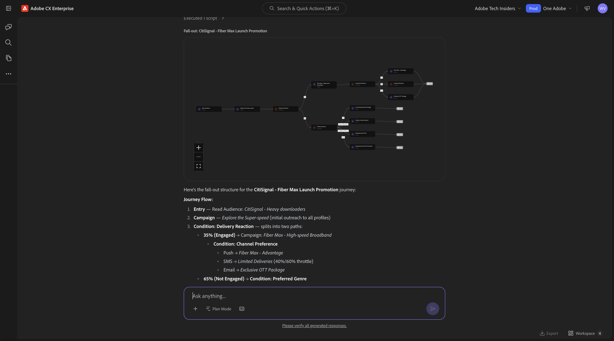

## 1.1.6.9 새 대상 만들기

**의도**

위의 연구결과와 연구에 따르면, 많은 데이터를 소비하고 공상과학이나 판타지 장르를 선호하는 고객 사이에는 상관관계가 있습니다. 이제 대상에서 이러한 속성을 결합합니다.

다음 **확인**&#x200B;을 입력하고 **보내기** 단추를 클릭하세요.

```javascript
Create an audience that combines people with an average download usage per month of over 2000 GB and a preferred genre of sci-fi or fantasy.
```


계획을 검토합니다. **플랜 수락**&#x200B;을 클릭합니다.


이제 대상자가 생성되었습니다.


>[!NOTE]
>
>새 대상을 만들 때 AI Assistant에서 추가 용도로 대상을 사용할 수 있으려면 24시간이 걸립니다.

## 1.1.6.10 사용량이 많은 기존 대상을 찾아 사용 중인지 확인

**의도**:

월별 데이터 사용 임계값으로 정의된 &quot;대량 다운로드&quot;를 사용하여 이름이 지정된 대상을 찾습니다.

>[!NOTE]
>
>이전 단계에서 새 대상을 만든 경우, AI Assistant에서 대상을 추가로 사용하려면 24시간이 걸립니다. 이제 다른 기존 대상을 대신 사용해야 합니다.

다음 **확인**&#x200B;을 입력하고 **보내기** 단추를 클릭하세요.

```javascript
Is there an audience that has "heavy downloaders" in the title?
```


그럼 이걸 보셔야죠 이제 모든 대상과 지난 며칠 동안 변경된 양을 확인하려고 합니다.

다음 **확인**&#x200B;을 입력하고 **보내기** 단추를 클릭하세요.

```javascript
List how much these audiences changed over the last few days.
```


그럼 이걸 보셔야죠 **자세히 표시**&#x200B;를 클릭합니다.


그럼 이걸 보셔야죠 오른쪽 창을 닫으려면 를 클릭합니다.


아래로 약간 스크롤하여 AI 어시스턴트가 취한 단계를 검토합니다.


이미 &quot;헤비 다운로더&quot;에 대한 일부 기존 대상자가 있습니다. 이미 사용 중인지 알아보겠습니다.

다음 **확인**&#x200B;을 입력하고 **보내기** 단추를 클릭하세요.

```javascript
Which of the above are used in a journey? 
```


그러면 이와 비슷한 것을 볼 수 있을 겁니다.

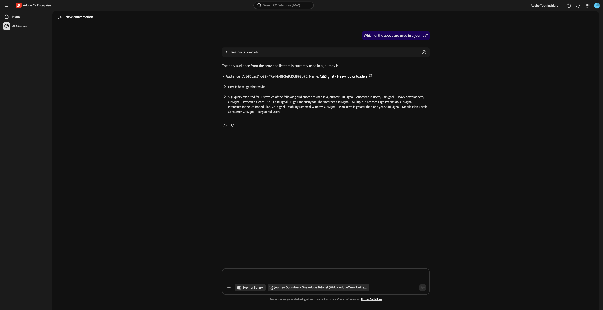

이제 해당 여정이 활성 상태인지 확인해야 합니다. 다음 **확인**&#x200B;을 입력하고 **보내기** 단추를 클릭하세요.

```javascript
Are these journeys active? 
```


그러면 이와 비슷한 것을 볼 수 있을 겁니다. 현재 실행 중인 여정이 없습니다.


Fibre Max를 출시하려면 이제 새 여정을 만들어야 합니다.

## 1.1.6.11 파이버 최대 시작에 대한 새 여정 만들기

**의도**:

복합 대상을 타깃팅하는 새 여정을 빌드합니다.

SciFi를 선호하는 ∩이 많은 다운로드 업체.

다음 **확인**&#x200B;을 입력하고 **보내기** 단추를 클릭하세요.

```javascript
Create a  journey towards the audience Heavy Downloaders - Sci-Fi Preference_kbaa_5207bf. The journey is for the rollout of fiber broadband. There will 2 versions of an email  based on  a split of the audience based on who is in the "Eligble for Fiber upgrade" audience.  After 3 days, profiles from both email treatments who have not purchased fibre max will be sent a follow up email. 
```

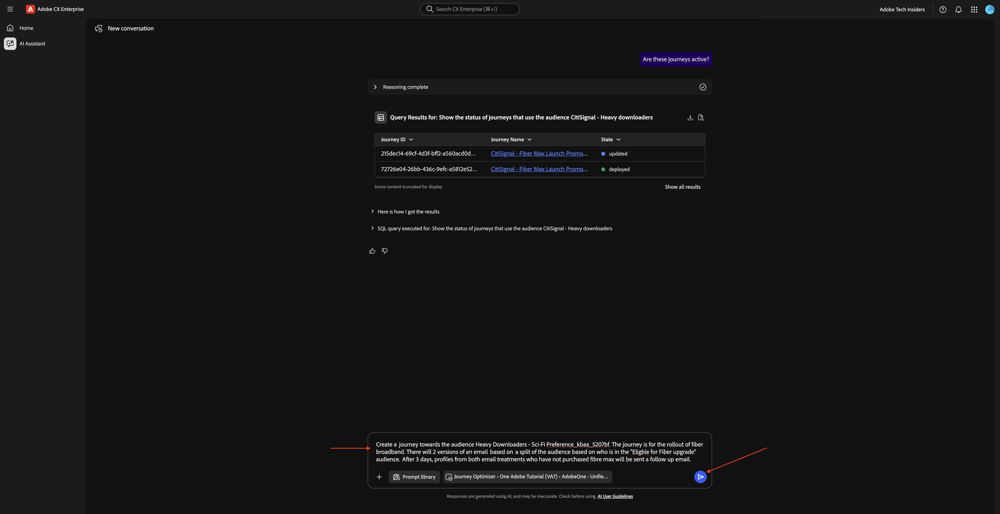

그럼 이걸 보셔야죠 `yes`을(를) 입력하고 생성을 클릭합니다.

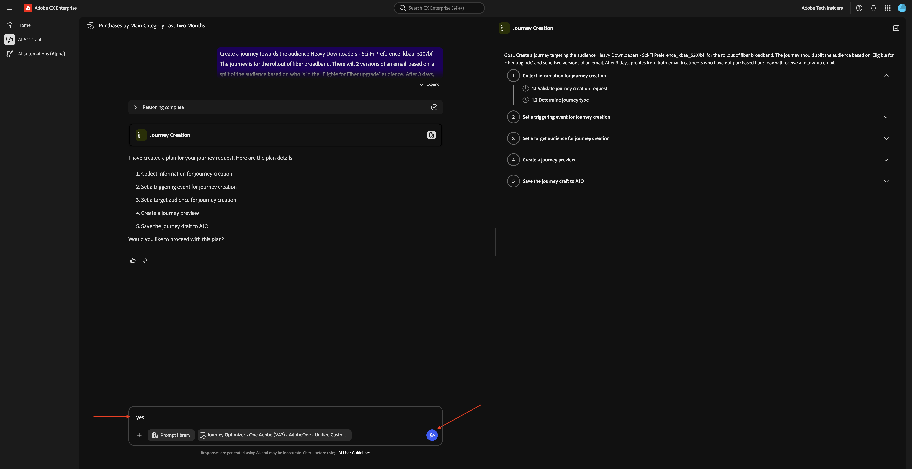

그럼 이걸 보셔야죠 `yes`을(를) 입력하고 생성을 클릭합니다.


그럼 이걸 보셔야죠 `The first one`을(를) 입력하고 [보내기]를 클릭하십시오.


그럼 이걸 보셔야죠 `yes`을(를) 입력하고 [보내기]를 클릭하십시오.


응답을 검토합니다. `yes`을(를) 입력하고 [보내기]를 클릭하십시오.

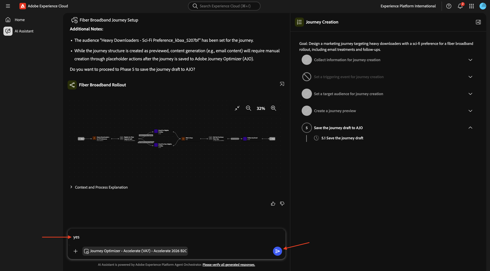

**검토**&#x200B;를 클릭합니다.

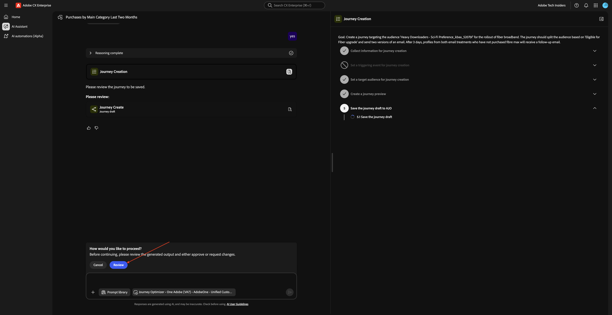

LDAP로 여정 이름을 업데이트하여 고유한 이름을 만듭니다. **저장**&#x200B;을 클릭합니다.


이제 여정이 초안 모드에서 생성되었습니다.


## 1.1.6.12 여정 충돌 관리

다음 **확인**&#x200B;을 입력하고 **보내기** 단추를 클릭하세요.

```javascript
How can I manage journey conflicts?
```


정보를 검토하십시오.


아래로 스크롤하고 **소스**&#x200B;를 선택하여 Experience League에서 가져온 정보를 확인합니다.


다음 **확인**&#x200B;을 입력하고 **보내기** 단추를 클릭하세요.

```javascript
List any conflicts for the journey +CitiSignal Fiber Max
```

그런 다음 목록에서 여정 **CitiSignal - Fibre Max Launch Promotion**&#x200B;을(를) 수동으로 선택하십시오.


그럼 이걸 보셔야죠 **보내기**&#x200B;를 클릭합니다.


여정 충돌 정보를 검토합니다.


아래로 스크롤하여 더 많은 여정 충돌 세부 정보를 찾습니다.

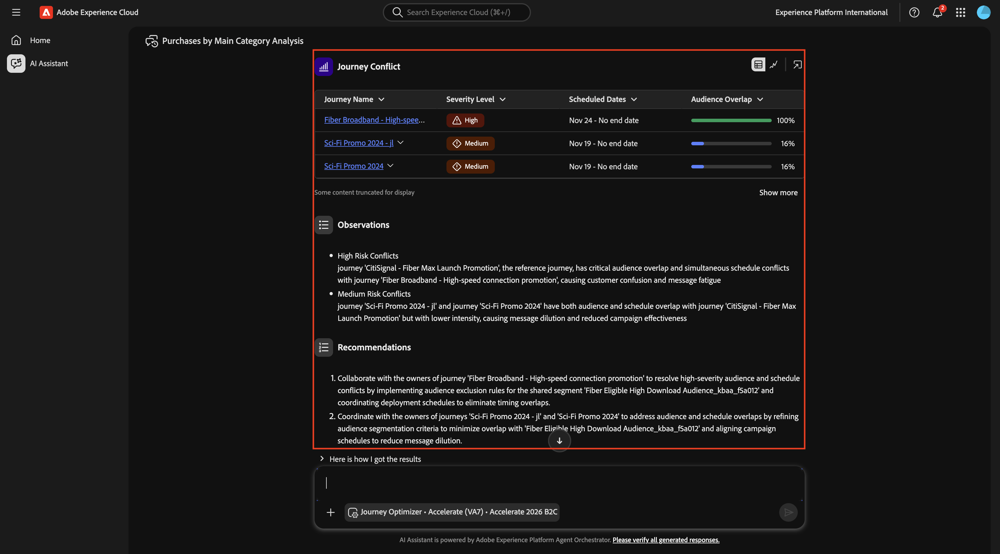

## 1.1.6.13개 실험

다음 **확인**&#x200B;을 입력하고 **보내기** 단추를 클릭하세요.

```javascript
How are the experiments performing for the journey named 'CitiSignal - Fiber Max Launch Promotion'?
```


그런 다음 이 메시지가 표시됩니다.


아래로 스크롤하여 제안 사항 중 하나를 누릅니다. **보내기**&#x200B;를 클릭합니다.

>[!NOTE]
>
>제안은 동적이므로 응답이 생성될 때마다 다른 제안이 표시될 것으로 예상해야 합니다. 제안 사항은 이 스크린샷에 표시된 제안 사항과 다를 수 있습니다.


그런 다음 선택한 제안과 관련된 자세한 답변을 볼 수 있습니다.


이제 이 실습을 완료했습니다.

## 다음 단계

[Agent Orchestrator](./agentorchestrator.md){target="_blank"}로 돌아가기

[모든 모듈로 돌아가기](./../../../overview.md){target="_blank"}
