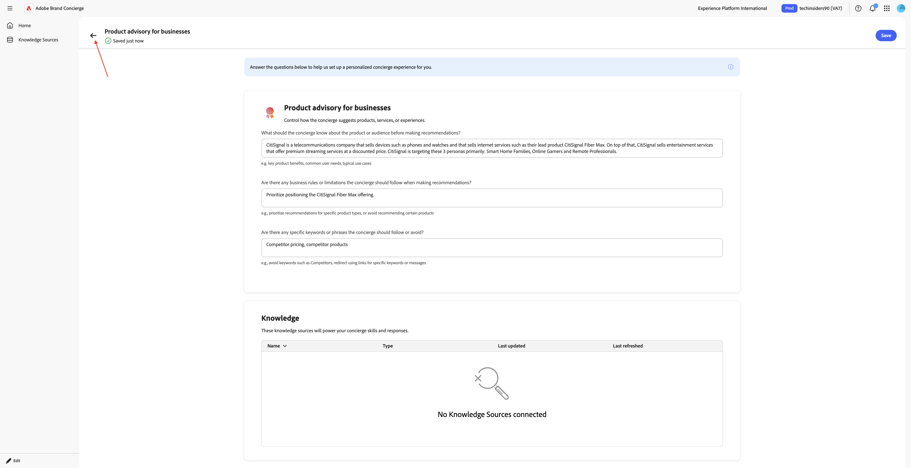
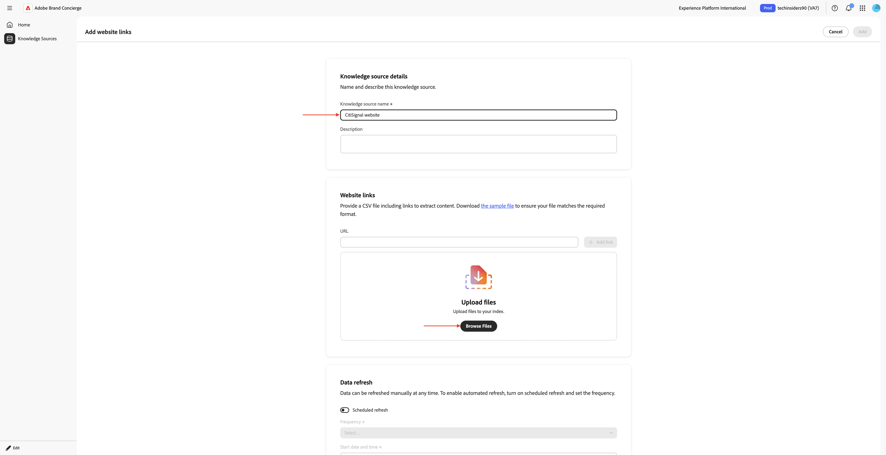
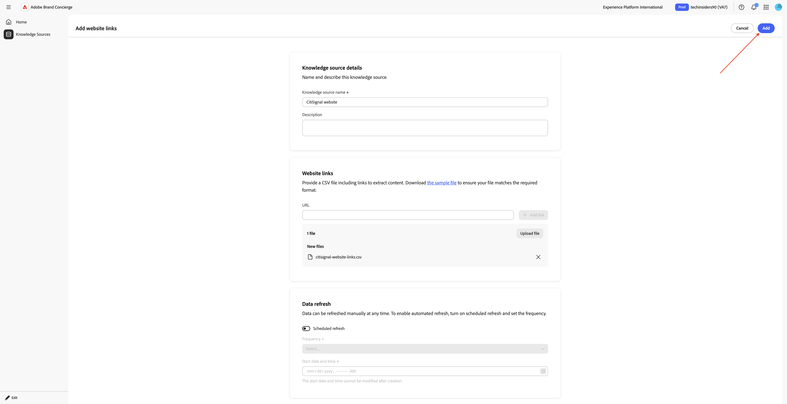
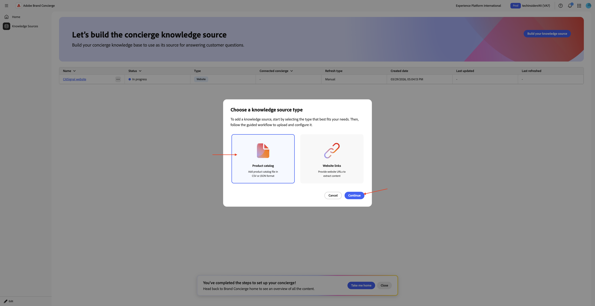
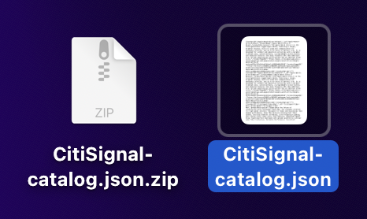
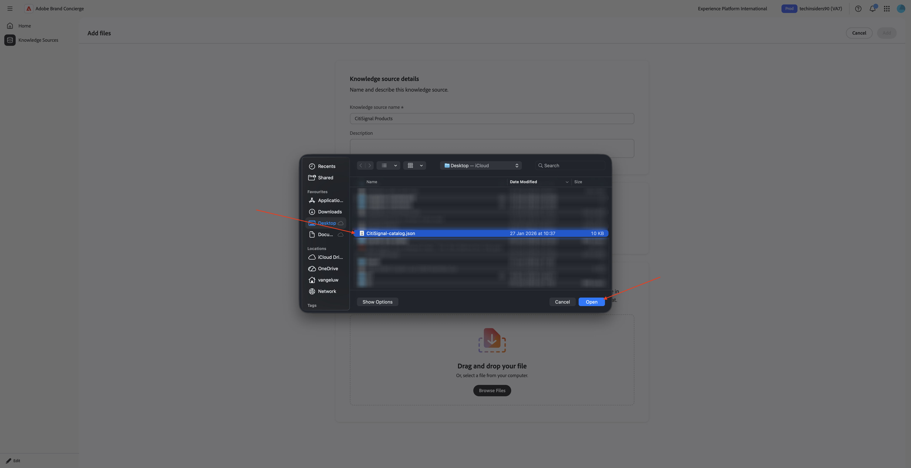
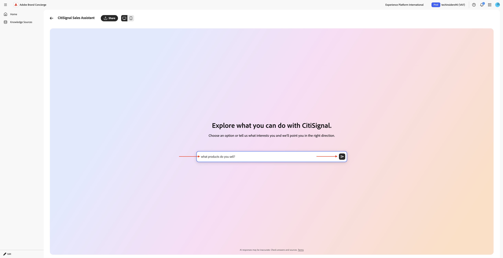

# 1.4.1 Brand Concierge 시작하기

## 1.4.1.1 Brand Concierge 개요

Brand Concierge을 구성하는 동안 사용할 2가지 주요 요소는 다음과 같습니다.

- **에이전트 작성기(구성 계층)**

  목적: 대화형 AI 경험을 구축하고 구성하는 데 사용되는 기본 UI 플랫폼입니다.

  주요 책임 사항:

   - 데이터 소스 및 기술 자료 정의 및 관리
   - 브랜드 표현식(톤, 스타일, 가드레일) 설정
   - 모임 예약 에이전트 설정

- **Agent Orchestrator(실행 엔진)**

  목적: 사용자 요청을 해석하고 적절한 에이전트 작업을 실행하는 추론 및 오케스트레이션 엔진입니다.

  주요 책임 사항:

   - 자연어 사용자 의도 해석
   - 다단계 추론 계획 생성 및 실행
   - 적절한 연산자/도구 선택 및 호출
   - 브랜드 컨텍스트, 규정 준수 및 보호 적용
   - 다중 에이전트 워크플로 조정
   - 여러 데이터 소스에서 응답 집계 및 구성

- **Brand Concierge 대화 런타임(서비스 레이어)**

  목적: 채팅 세션, 컨텍스트 및 클라이언트 상호 작용을 관리하는 고객 대면 대화 서비스 계층.

  주요 구성 요소:

   - 웹 에이전트(클라이언트): 웹 SDK을 사용하여 통합된 브라우저 또는 모바일 채팅 UI
   - 대화 서비스(백엔드): 세션 상태를 관리하고 오케스트레이션 게이트웨이 역할을 합니다.

  주요 책임 사항:

   - 사용자 세션 및 대화 성적 증명서 관리
   - 사용자 인증 및 프로필 처리
   - 클라이언트와 Agent Orchestrator 간 메시지 라우팅
   - 대화 컨텍스트 유지
   - Analytics용 AEP에 동작 및 운영 이벤트 기록
   - 표면별 구성 적용

## 1.4.1.2 Brand Concierge 인스턴스 구성

나만의 Brand Concierge 인스턴스 만들기를 시작하려면 아래 단계를 따르십시오.

[https://experience.adobe.com/](https://experience.adobe.com/){target="_blank"}(으)로 이동합니다. **Brand Concierge**&#x200B;을(를) 엽니다.


그럼 이걸 보셔야죠 **샌드박스 선택** 메뉴를 클릭합니다. 나에게 할당된 샌드박스를 선택합니다. 해당 샌드박스의 이름은 `techinsidersX`이어야 합니다(X를 할당된 번호로 바꾸기).


그런 다음 다음 다음 변수를 채웁니다.

- **회사 이름**: CitiSignal

- **관리 이름**: `CitiSignal Sales Assistant`.

**컨시어지 서비스에 다음 텍스트를 입력하십시오.**

```javascript
Brand Concierge should help customers find their best device, plan or entertainment deal. Brand Concierge should help users discover internet plans, entertainment deals,  and help find the best available packages. Brand Concierge should also answer questions about devices such as phones and watches.
```

- **웹 사이트 링크**: 사용 중인 웹 사이트에 대한 링크를 제공합니다.

**계속**&#x200B;을 클릭합니다.


그럼 이걸 보셔야죠 이 정보는 이전 페이지에서 제공된 입력을 기반으로 AI를 사용하여 생성되었습니다. 정보를 검토하고 만족하면 **컨시어지 생성**&#x200B;을 클릭하세요.


그럼 이걸 보셔야죠 **소비자를 위한 제품 자문** 옆에 있는 **+ 추가**&#x200B;를 클릭합니다.


그럼 이걸 보셔야죠 아래 텍스트를 사용하여 다음 필드를 채웁니다.

**컨시어지가 추천하기 전에 제품 또는 대상자에 대해 알아야 할 사항은 무엇입니까?**

```
CitiSignal is a telecommunications company that sells devices such as phones and watches and that sells internet services such as their lead product CitiSignal Fiber Max. On top of that, CitiSignal sells entertainment services that offer premium streaming services at a discounted price. CitiSignal is targeting these 3 personas primarily: Smart Home Families, Online Gamers and Remote Professionals.
```

**컨시어지가 추천할 때 따라야 하는 비즈니스 규칙이나 제한이 있습니까?**

```
Prioritize positioning the CitiSignal Fiber Max offering.
```

**컨시어지가 팔로우하거나 피해야 하는 특정 키워드나 구문이 있습니까?**

```
Competitor pricing, competitor products
```

**저장**&#x200B;을 클릭합니다.


이전 화면으로 돌아가려면 **화살표**&#x200B;를 클릭하십시오.



**기술 자료 Source**(으)로 이동한 다음 **기술 자료 원본 만들기**&#x200B;를 클릭합니다.


**웹 사이트 링크**&#x200B;를 선택하고 **계속**&#x200B;을 클릭합니다.


그럼 이걸 보셔야죠 기술 자료 원본의 이름으로 `CitiSignal website`을(를) 입력하십시오.

이제 웹 사이트의 링크가 포함된 csv 파일을 업로드해야 합니다. 데스크톱에 [CitiSignal 웹 사이트 링크](./assets/citisignal-website-links.csv)를 다운로드합니다.

**파일 찾아보기**&#x200B;를 클릭합니다.



**citissignal-website-links.csv** 파일을 열고 링크를 업데이트하여 자신의 CitiSignal 웹 사이트를 가리키도록 합니다.


다운로드 및 편집한 **citisignal-website-links.csv** 파일을 선택하십시오. **열기를 클릭합니다**.


이제 파일이 이 기술 자료 원본에 추가되었습니다. **추가를 클릭합니다**.



그럼 이걸 보셔야죠 **기술 자료 원본 만들기**&#x200B;를 클릭합니다.


**제품 카탈로그**&#x200B;를 선택하고 **계속**&#x200B;을 클릭하세요.



그럼 이걸 보셔야죠 기술 자료 원본의 이름으로 `CitiSignal Products`을(를) 입력하십시오. **파일 찾아보기**&#x200B;를 클릭한 다음 **장치에서 찾아보기**&#x200B;를 선택합니다.


이제 웹 사이트의 링크가 포함된 csv 파일을 업로드해야 합니다. 데스크톱에 [CitiSignal 제품 카탈로그](./assets/CitiSignal-catalog.json.zip)를 다운로드하고 압축을 풉니다.



**CitiSignal-catalog.json** 파일을 선택하고 **열기**&#x200B;를 클릭합니다.



그럼 이걸 보셔야죠 **추가를 클릭합니다**.


그럼 다시 여기로 오십시오. 처리 시간은 10~20분 정도 소요되므로 처리가 성공했는지 확인하려면 나중에 다시 여기로 와야 합니다.


## 1.4.1.3 AEP 온보딩 단계

Brand Concierge은 Adobe Experience Platform을 사용하여 대화의 상호 작용 데이터를 저장합니다. Brand Concierge과 Experience Platform을 연결하려면 Brand Concierge에서 구성하고 사용하는 데이터 스트림이 필요합니다.

### 데이터스트림

[https://experience.adobe.com/](https://experience.adobe.com/){target="_blank"}(으)로 이동합니다. **Experience Platform**&#x200B;을(를) 엽니다.


올바른 샌드박스를 선택했는지 확인하십시오. 샌드박스 이름은 `techinsidersX`이어야 합니다. 왼쪽 메뉴에서 아래로 스크롤하여 **데이터스트림**&#x200B;을 선택합니다.


**새 데이터 스트림**&#x200B;을 클릭합니다.


**데이터 스트림 이름** `--aepUserLdap-- - Brand Concierge`을(를) 입력한 다음 **매핑 스키마** `cja-brand-concierge-sb-XXX`을(를) 선택하십시오.

**저장**&#x200B;을 클릭합니다.


이제 데이터 스트림이 구성되었습니다. 데이터 스트림 이름과 데이터 스트림 ID를 복사하고 컴퓨터의 텍스트 파일에 기록합니다.


### 데이터 스트림 구성 관리

다음 단계는 Brand Concierge 구성 관리 API를 활성화하여 방금 생성한 데이터 스트림을 구성하는 것입니다. 요청을 처리하는 동안 IMS 조직 ID 및 샌드박스 세부 정보와 같은 문제를 해결하는 데 필요합니다.

**홈**(으)로 이동한 다음 **관리자 컨트롤**&#x200B;을(를) 선택하십시오.


**데이터 스트림 구성 관리**(으)로 이동한 다음 **구성 추가**&#x200B;를 클릭합니다.


이전에 만든 데이터 스트림의 **데이터 스트림 ID**&#x200B;을(를) 붙여 넣습니다. **저장**&#x200B;을 클릭합니다.


그럼 이런 걸 보셔야겠네요


## 1.4.1.4 스타일 구성 관리

**스타일 구성 관리**(으)로 이동합니다. **스타일 구성 초기화**&#x200B;를 클릭합니다.


**브랜드 이름** `CitiSignal`을(를) 입력한 다음 **스타일 구성 초기화**&#x200B;를 클릭합니다.


그럼 이걸 보셔야죠


## 1.4.1.5 Agent Orchestrator 매니페스트

**매니페스트 업데이트**(으)로 이동합니다. 그럼 이걸 보셔야죠 각 필드의 정보를 검토하고 필요한 경우 변경합니다.

기존 텍스트 끝에 **다중 양식 질문 응답 프롬프트** 필드에 다음 텍스트를 추가합니다. 거기에 있는 텍스트를 제거하지 말고 아래 텍스트를 이미 있는 텍스트 위에 추가하기만 하면 됩니다.

```
# Product Catalog (Fallback Reference)

Use this catalog when <Documents> doesn't return relevant results:

## CONNECTIVITY
**CitiSignal Fiber Max**
- Description: High-speed fiber internet with blazing-fast speeds, seamless streaming, ultra-responsive gaming, crystal-clear video calls. No data caps, no throttling. Future-ready for smart homes.
- Image: https://delivery-p168681-e1803036.adobeaemcloud.com/adobe/assets/urn:aaid:aem:cdb9e163-f9f5-4338-9d62-9807b61c082f/as/CitiSignal-Fiber-Max.webp
- URL: https://main--citisignal-aem-accs--woutervangeluwe.aem.page/products/citisignal-fiber-max/CitiSignal-Fiber-Max

## ENTERTAINMENT
**Disney Plus**
- Description: Streaming home of Disney, Pixar, Marvel, Star Wars, National Geographic. Unlimited entertainment, new releases, original series, classic movies.
- Image: https://delivery-p168681-e1803036.adobeaemcloud.com/adobe/assets/urn:aaid:aem:b3bbe91a-e307-43bd-845f-1c77e7ba28df/as/Disney.webp
- URL: https://main--citisignal-aem-accs--woutervangeluwe.aem.page/products/disney/Disney

**Netflix + HBO Max**
- Description: Unlimited TV shows and movies. Watch as much as you want, whenever you want.
- Image: https://delivery-p168681-e1803036.adobeaemcloud.com/adobe/assets/urn:aaid:aem:883be2a0-6c42-4508-b9ac-1e3a33235081/as/Netflix-HBO-Max.webp
- URL: https://main--citisignal-aem-accs--woutervangeluwe.aem.page/products/netflix-hbo-max/Netflix-HBO-Max

**YouTube Premium**
- Description: Ad-free YouTube, YouTube Music, YouTube Kids. Watch offline, in background, on the go.
- Image: https://delivery-p168681-e1803036.adobeaemcloud.com/adobe/assets/urn:aaid:aem:ac2a8c66-8740-4fce-bd3a-8106db9e556f/as/YouTube-Premium.webp
- URL: https://main--citisignal-aem-accs--woutervangeluwe.aem.page/products/youtube-premium/YouTube-Premium

**Apple One**
- Description: Apple Music (100M+ songs), Apple TV+, Apple Arcade, iCloud+. Complete Apple ecosystem bundle.
- Image: https://delivery-p168681-e1803036.adobeaemcloud.com/adobe/assets/urn:aaid:aem:94126f30-931a-447e-9cef-f58c60dbb17c/as/Apple-One.webp
- URL: https://main--citisignal-aem-accs--woutervangeluwe.aem.page/products/apple-one/Apple-One

## DEVICES
**iPhone Air Sky Blue**
- Description: Slim iPhone with A19 Pro chip, 48MP camera, 6.5\" display, Apple Intelligence, all-day battery. Titanium frame, Ceramic Shield 2.
- Image: https://delivery-p168681-e1803036.adobeaemcloud.com/adobe/assets/urn:aaid:aem:0c4b1537-8268-4507-98e6-bbb03faa3ad1/as/iPhone-Air.webp
- URL: https://main--citisignal-aem-accs--woutervangeluwe.aem.page/products/iphone-air/iPhone-Air?optionsUIDs=Y29uZmlndXJhYmxlLzkzLzIw

**iPhone Air Cloud White**
- Description: Slim iPhone with A19 Pro chip, 48MP camera, 6.5\" display, Apple Intelligence, all-day battery. Titanium frame, Ceramic Shield 2.
- Image: https://delivery-p168681-e1803036.adobeaemcloud.com/adobe/assets/urn:aaid:aem:30447a9c-c037-4df3-ae88-4127b9ec325e/as/iPhone-Air.webp
- URL: https://main--citisignal-aem-accs--woutervangeluwe.aem.page/products/iphone-air/iPhone-Air?optionsUIDs=Y29uZmlndXJhYmxlLzkzLzI

**iPhone Air Space Black**
- Description: Slim iPhone with A19 Pro chip, 48MP camera, 6.5\" display, Apple Intelligence, all-day battery. Titanium frame, Ceramic Shield 2.
- Image: https://main--citisignal-aem-accs--woutervangeluwe.aem.page/products/iphone-air/iPhone-Air?optionsUIDs=Y29uZmlndXJhYmxlLzkzLzIz
- URL: https://main--citisignal-aem-accs--woutervangeluwe.aem.page/products/iphone-air/iPhone-Air?optionsUIDs=Y29uZmlndXJhYmxlLzkzLzIz

**iPhone Air Light Gold**
- Description: Slim iPhone with A19 Pro chip, 48MP camera, 6.5\" display, Apple Intelligence, all-day battery. Titanium frame, Ceramic Shield 2.
- Image: https://delivery-p168681-e1803036.adobeaemcloud.com/adobe/assets/urn:aaid:aem:ffa7b752-87ab-427f-a631-382fc67e7530/as/iPhone-Air.webp
- URL: https://main--citisignal-aem-accs--woutervangeluwe.aem.page/products/iphone-air/iPhone-Air?optionsUIDs=Y29uZmlndXJhYmxlLzkzLzIx

**Apple Watch Ultra 3-Black**
- Description: Rugged smartwatch with 42hr battery, satellite communication, titanium case, dual-frequency GPS, hypertension notifications.
- Image: https://delivery-p168681-e1803036.adobeaemcloud.com/adobe/assets/urn:aaid:aem:d33f4f49-1239-45b8-a6e6-b97f12177e06/as/Apple-Watch-Ultra-3.webp
- URL: https://main--citisignal-aem-accs--woutervangeluwe.aem.page/products/apple-watch-ultra-3/Apple-Watch-Ultra-3?optionsUIDs=Y29uZmlndXJhYmxlLzE4MS8yNA%3D%3D

**Apple Watch Ultra 3-Natural**
- Description: Rugged smartwatch with 42hr battery, satellite communication, titanium case, dual-frequency GPS, hypertension notifications.
- Image: https://delivery-p168681-e1803036.adobeaemcloud.com/adobe/assets/urn:aaid:aem:8f107329-66f1-43fd-b505-b1c16892379f/as/Apple-Watch-Ultra-3.webp
- URL: https://main--citisignal-aem-accs--woutervangeluwe.aem.page/products/apple-watch-ultra-3/Apple-Watch-Ultra-3?optionsUIDs=Y29uZmlndXJhYmxlLzE4MS8yNQ%3D%3D

# Sales Strategy

## Primary Focus: Connectivity Products
- When users ask about internet, connectivity, streaming, or home services, recommend **CitiSignal Fiber Max**.
- Highlight: blazing-fast fiber speeds, seamless streaming, no data caps, no throttling, future-ready.

## Entertainment Upselling Strategy
- After discussing connectivity, PROACTIVELY suggest entertainment products.
- Use natural transitions like:
  - \"With speeds like these, you'll want entertainment that keeps up...\"
  - \"Many of our customers enhance their experience with...\"
  - \"To get the most out of your connection...\"
- Match recommendations to user context:
  - Families with kids → **Disney Plus**
  - Movie/TV enthusiasts → **Netflix + HBO Max**
  - Ad-free YouTube fans → **YouTube Premium**
  - Apple ecosystem users → **Apple One**
```


변경한 후 위로 스크롤하여 **매니페스트 업데이트**&#x200B;를 클릭하세요.


## 1.4.1.6 기술 자료 원본 설정 완료

**기술 자료 원본**(으)로 이동합니다. 10-20분 후에는 두 기술 자료의 **상태**&#x200B;가 **완료**&#x200B;여야 합니다. 두 기술 자료의 상태가 **성공**&#x200B;이면 **홈**&#x200B;을 클릭하세요.


그럼 이걸 보셔야죠 **웹 사이트 링크** 카드에서 **+ 연결**&#x200B;을 클릭합니다.


기술 자료 원본 **CitiSignal 웹 사이트**&#x200B;를 선택하고 **저장**&#x200B;을 클릭합니다.


그럼 이걸 보셔야죠 **제품 카탈로그** 카드에서 **+ 연결**&#x200B;을 클릭합니다.


기술 자료 원본 **CitiSignal 제품**&#x200B;을 선택하고 **저장**&#x200B;을 클릭합니다.


그럼 이걸 보셔야죠 Brand Concierge과 상호 작용하려면 **미리 보기**&#x200B;를 클릭하세요.


이제 제공된 지식 소스와 관련된 질문을 시작할 수 있습니다.


`what products do you sell?` 질문을 입력하고 **보내기**&#x200B;를 클릭합니다.



그런 다음 유사한 응답을 다시 받아야 합니다.


이제 Brand Concierge 인스턴스를 웹 사이트에 구현할 준비가 되었습니다.

## 다음 단계

[웹 사이트에서 Brand Concierge 구현](./ex2.md){target="_blank"}(으)로 이동

[Brand Concierge](./brandconcierge.md){target="_blank"}로 돌아가기

[모든 모듈로 돌아가기](./../../../overview.md){target="_blank"}
