# 1.6.1 AEM 에이전트 시작하기

>[!IMPORTANT]
>
>AEM CS 샌드박스가 최대 절전 모드일 수 있습니다. 샌드박스 최대 절전 모드 해제 시간이 10~15분 정도 소요되므로 나중에 기다리지 않도록 최대 절전 모드 해제 프로세스를 지금 시작하는 것이 좋습니다.

## 1.6.1.1 검색 에이전트

Adobe Experience Manager(AEM) Discovery Agent는 사용자가 자연어 프롬프트를 사용하여 Assets, 콘텐츠 조각, 적응형 Forms 등 콘텐츠를 찾고, 검색하고, 활용할 수 있도록 해주는 AEM as a Cloud Service 내의 AI 기반 도구입니다. 저장소에서 의도를 이해하고 검색하여 수동, 클릭 수가 많거나 복잡한 필터링이 필요하지 않습니다.

**검색 에이전트**&#x200B;을(를) 사용하려면 먼저 Adobe Experience Manager에서 일부 태그를 만든 다음 해당 태그를 사용하여 일부 자산에 태그를 지정합니다. 이를 통해 AI Assistant를 사용하여 에셋을 쉽고 비즈니스 친화적으로 검색할 수 있습니다.

[https://my.cloudmanager.adobe.com](https://my.cloudmanager.adobe.com){target="_blank"}(으)로 이동합니다. 선택해야 하는 조직은 `--aepImsOrgName--`입니다.

### Assets에서 태그 만들기 및 사용

아래 이름 지정 옵션을 사용해야 하는 Cloud Manager 프로그램을 열려면 클릭하십시오.

- **`Tech Insiders - AEM + ACCS X`**&#x200B;입니다. 여기서 X는 사용자에게 할당된 숫자를 나타냅니다.
- **`Tech Insiders On Demand - AEM + ACCS X`**&#x200B;입니다. 여기서 X는 사용자에게 할당된 숫자를 나타냅니다.
- **`--aepUserLdap-- - CitiSignal AEM+ACCS`**. 이 경우 직접 만든 AEM 프로그램을 사용하고 있으므로 번호가 없습니다.

이 예제에서는 **기술 내부자 - AEM + ACCS 100** 프로그램이 사용됩니다. 자체 프로그램을 사용해야 합니다.


환경의 URL을 클릭하여 엽니다.


**도구** 아이콘을 클릭합니다.


**일반**&#x200B;에서 **태그 지정**&#x200B;을 클릭합니다.


그럼 이걸 보셔야죠 **만들기**&#x200B;를 클릭한 다음 **네임스페이스 만들기**&#x200B;를 선택합니다.


**제목** 필드에 `--aepUserLdap-- - CitiSignal`을(를) 입력합니다. **만들기**&#x200B;를 클릭합니다.


**`--aepUserLdap-- - CitiSignal`** 네임스페이스를 클릭하여 드릴다운합니다. **만들기**&#x200B;를 클릭한 다음 **태그 만들기**&#x200B;를 선택합니다.


**제목** 필드에 `--aepUserLdap-- - Campaign`을(를) 입력합니다. **제출을 클릭합니다**.

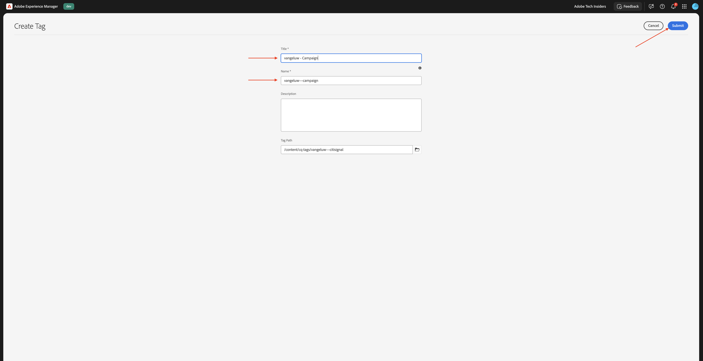

**`--aepUserLdap-- - Campaign`** 태그를 클릭하여 선택합니다. **만들기**&#x200B;를 클릭한 다음 **태그 만들기**&#x200B;를 선택합니다.


**제목** 필드에 `--aepUserLdap-- - Winter 2026`을(를) 입력합니다. **제출을 클릭합니다**.


**Campaign** 태그를 클릭하여 선택합니다. **만들기**&#x200B;를 클릭한 다음 **태그 만들기**&#x200B;를 선택합니다.


**제목** 필드에 `--aepUserLdap-- - Spring 2026`을(를) 입력합니다. **제출을 클릭합니다**.


이제 이 항목을 사용할 수 있습니다.


**Adobe Experience Manager**&#x200B;을 클릭한 다음 **Assets**&#x200B;을 클릭합니다.


**파일**&#x200B;을 클릭합니다.


**CitiSignal** 폴더를 클릭하여 엽니다.


**만들기**&#x200B;를 클릭한 다음 **파일**&#x200B;을 선택합니다.

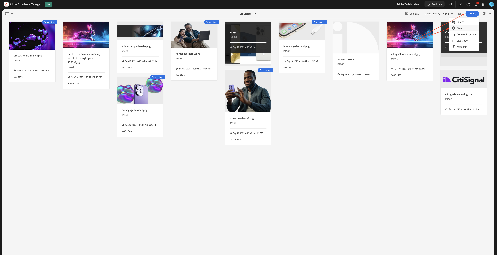

[citisignal-images-campaign.zip](./assets/citisignal-images-campaign.zip) 파일을 다운로드하여 바탕 화면에 압축 해제합니다.


다운로드한 3개의 파일을 선택하고 **열기**&#x200B;를 클릭합니다.

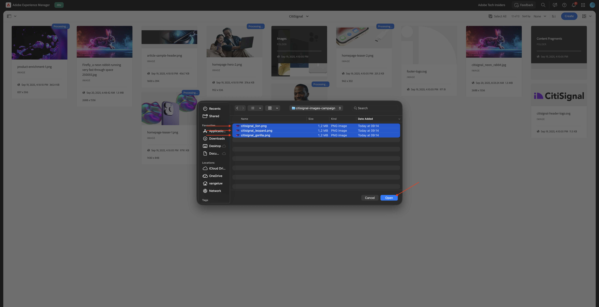

**업로드**&#x200B;를 클릭합니다.


그럼 이걸 보셔야죠


첫 번째 이미지(citissignal_lion.png)를 선택한 다음 **속성**&#x200B;을 클릭합니다.


태그 아래의 **폴더** 아이콘을 클릭합니다.


**`--aepUserLdap-- - Spring 2026`** 태그를 선택하고 **선택**&#x200B;을 클릭합니다.


**저장 및 닫기**&#x200B;를 클릭합니다.


다음 이미지에 대해 이러한 작업을 반복합니다.

- `citisignal_leopard.png`
- `citisignal_gorilla.png`
- `citisignal_neon_rabbit.png`

모든 이미지에 대해 해당 태그를 선택하면 **Experience Manager Assets**(으)로 이동합니다.

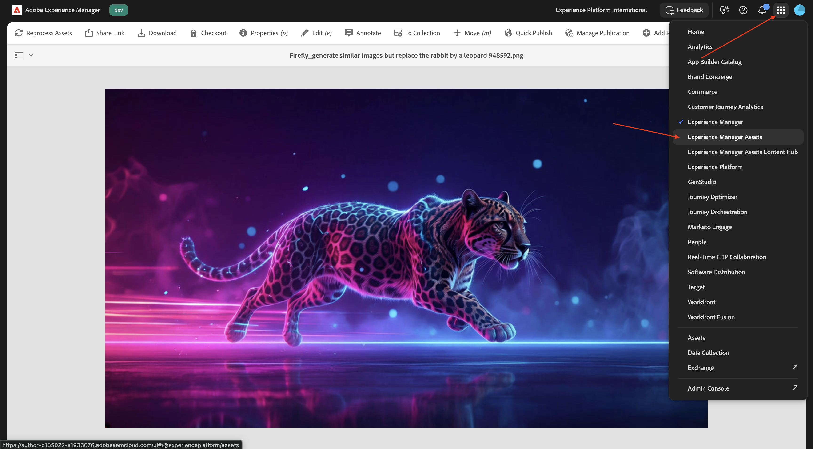

화면 오른쪽 상단의 **프로필** 아이콘을 클릭합니다. **보기 전환**&#x200B;을 클릭합니다.


그럼 이걸 보셔야죠

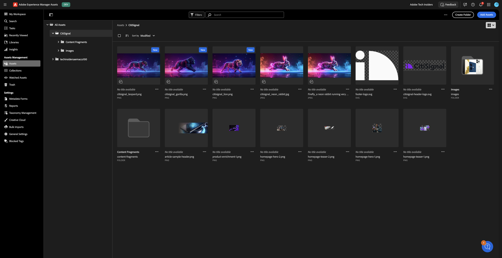

두 번 클릭하여 첫 번째 이미지를 엽니다.

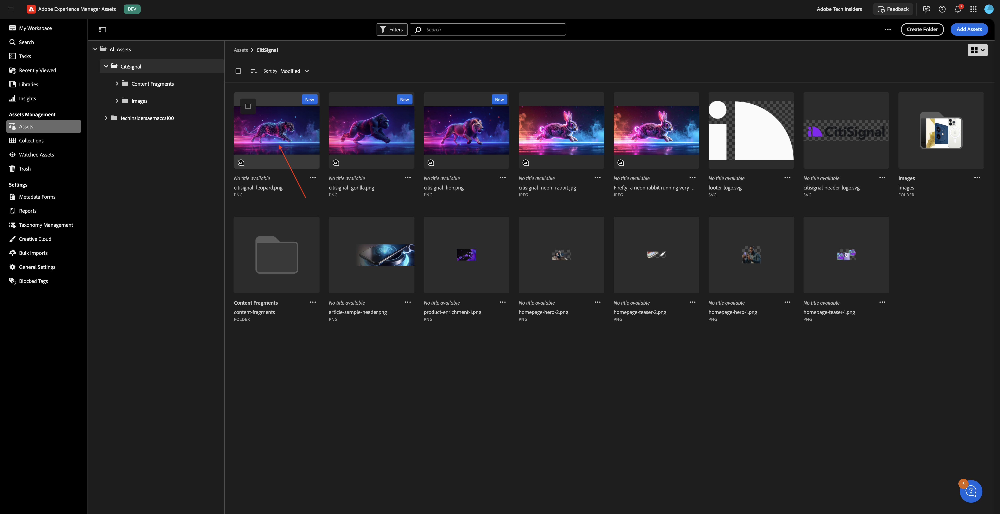

**승인됨**&#x200B;을 선택한 다음 **저장**&#x200B;을 클릭합니다.

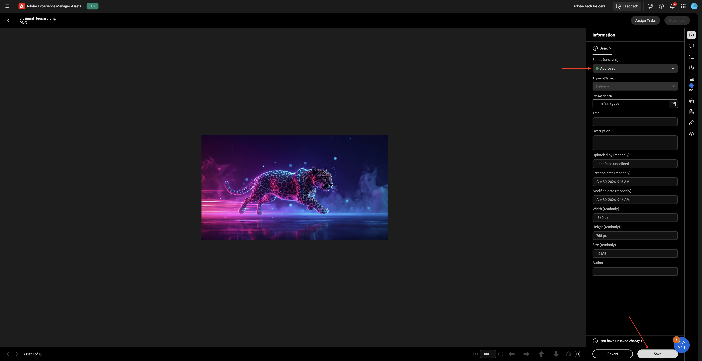

**태그**&#x200B;에서 이전에 선택한 태그를 볼 수 있습니다.

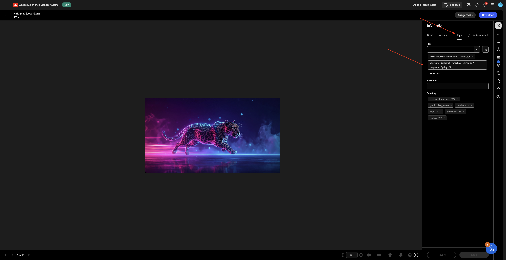

4개의 이미지가 모두 승인되도록 이 프로세스를 반복합니다.


그런 다음 **내 작업 영역**(으)로 이동하여 **AI Assistant**&#x200B;를 엽니다.


다음 메시지를 입력하고 **보내기**&#x200B;를 클릭합니다.

```javascript
find all assets tagged with '--aepUserLdap-- - Spring 2026'
```

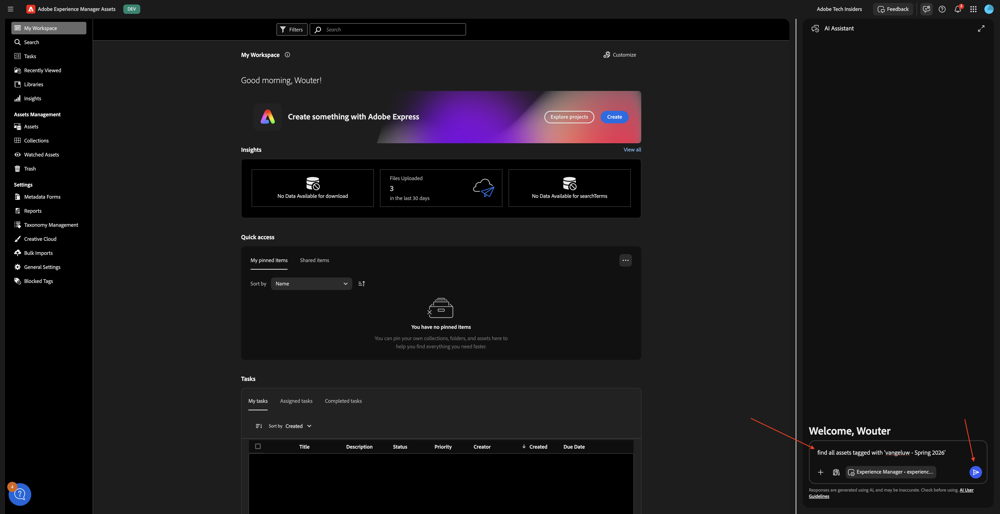

여러 AEM Assets CS 환경에 액세스할 수 있는 경우 다음과 같은 메시지가 표시됩니다. 사용할 환경에 대해 제안된 답변을 클릭한 다음 **보내기**&#x200B;를 클릭합니다.

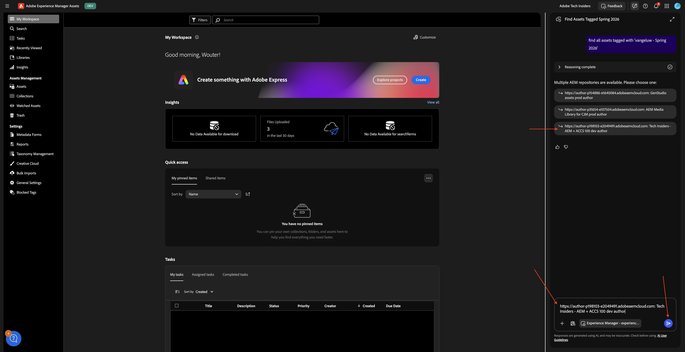

그러면 비슷한 대답을 볼 수 있습니다. 아이콘을 클릭하여 AI Assistant를 전체 화면으로 확장합니다.


답변을 검토하십시오.


에셋에서 **정보 보기** 아이콘을 클릭합니다.

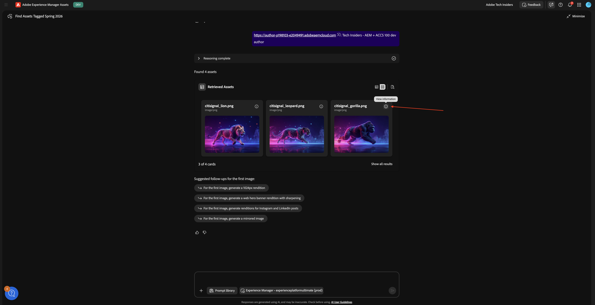

그러면 선택한 에셋과 일부 메타데이터가 확대된 보기가 표시됩니다.

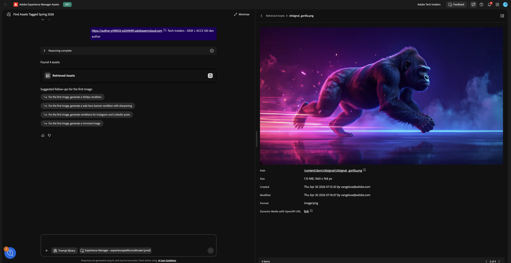

## 1.6.1.2 Experience 프로덕션 에이전트

### 컨텐츠 업데이트 - Assets

콘텐츠 업데이트 스킬은 콘텐츠 조각, 페이지, 양식 및 에셋을 포함한 기존 콘텐츠를 쉽게 업데이트합니다. 에이전트는 경험을 정확하고 최신 상태로 유지하기 위해 콘텐츠 요소를 업데이트, 제거, 대체 또는 추가하는 등의 작업을 수행할 수 있습니다. 입력은 자연어 설명이 될 수 있으며, Jira PDF 및 스크린샷과 함께 사용할 경우 입력도 제공할 수 있습니다.

AI Assistant 화면으로 돌아갑니다. 사이드 패널을 닫습니다.


제안된 프롬프트 중 하나를 선택하고 **보내기**&#x200B;를 클릭합니다.

`For the first image, generate renditions for Instagram and LinkedIn posts`


몇 분 후에 유사한 응답이 표시됩니다.


생성된 이미지를 검토합니다.


다른 프롬프트에 대해 자유롭게 실험해 보십시오. 위로 스크롤하여 다른 제안 프롬프트 중 하나를 선택하거나 직접 입력한 다음 **보내기**&#x200B;를 클릭합니다.

`For the first image, generate a mirrored image`

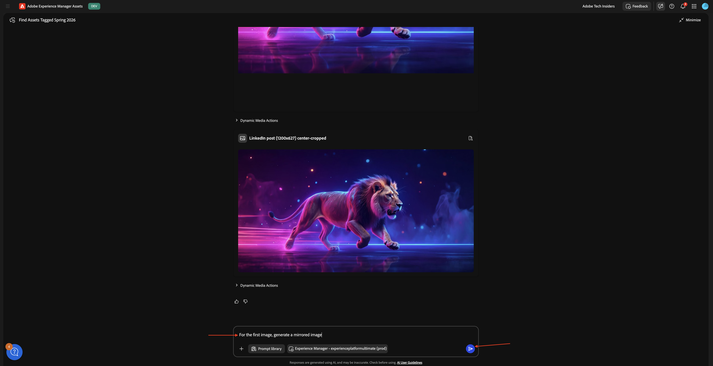

생성된 이미지를 검토합니다.


### 콘텐츠 업데이트 - 페이지

Adobe Experience Manager 작성자 환경으로 이동한 다음 **사이트**(으)로 이동합니다.


**CitiSignal**(으)로 이동합니다. **만들기**&#x200B;를 클릭하고 **페이지**&#x200B;를 선택합니다.


**페이지**&#x200B;를 선택하고 **다음**&#x200B;을 클릭합니다.


다음 값을 입력합니다.

- 제목: **파이버 최대**
- 이름: **fiber-max**
- 페이지 제목: **파이버 최대**

**만들기**&#x200B;를 클릭합니다.


**열기**&#x200B;를 선택합니다.


그럼 이걸 보셔야죠


빈 영역을 클릭하여 **섹션** 구성 요소를 선택합니다. 그런 다음 오른쪽 메뉴에서 더하기 **+** 아이콘을 클릭하고 **영웅**&#x200B;을(를) 선택합니다.


그럼 이걸 보셔야죠 이미지를 추가하려면 **+ 추가**&#x200B;를 클릭하십시오.


에셋 저장소를 선택합니다. 그런 다음 **CitiSignal** 폴더를 엽니다.


이전에 업로드한 사자의 이미지를 선택합니다. **선택**&#x200B;을 클릭합니다.


그럼 이걸 보셔야죠 텍스트를 변경하려면 **text** 영역을 클릭하십시오.

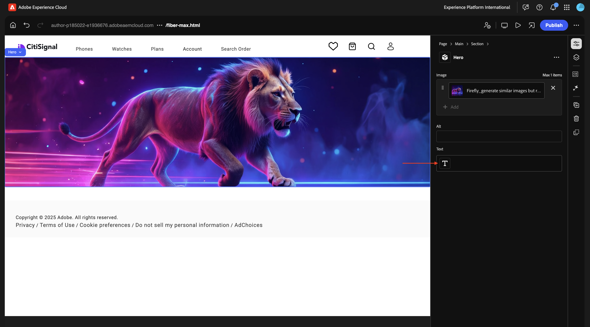

이 텍스트를 다음에 붙여넣습니다.

```
This winter, be as fast as a lion.
```

**제목 1**&#x200B;을 선택한 다음 **완료**&#x200B;를 클릭합니다.


그럼 이걸 보셔야죠 **콘텐츠 트리**(으)로 이동하여 **섹션** 영역을 선택하십시오.

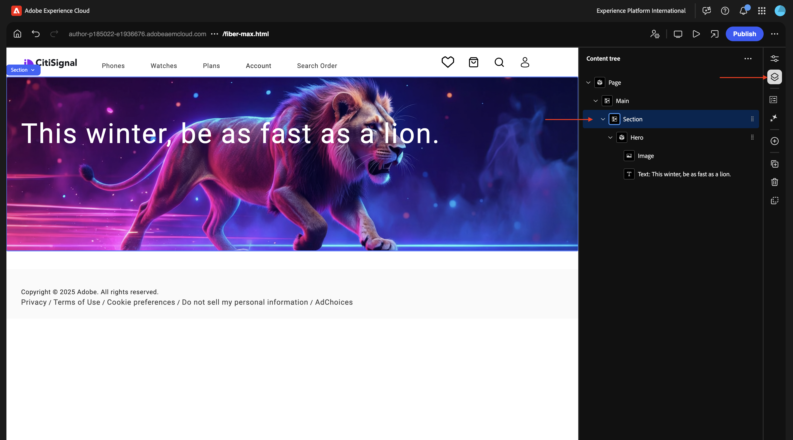

**+** 아이콘을 클릭한 다음 **카드**&#x200B;를 선택합니다.


그럼 이걸 보셔야죠 **콘텐츠 트리**&#x200B;에서 **카드**&#x200B;가 선택되어 있는지 확인하십시오.

그런 다음 **+** 단추를 4번 클릭합니다.


이제 **카드** 개체에 4개의 **카드** 개체가 있는 것으로 표시됩니다.

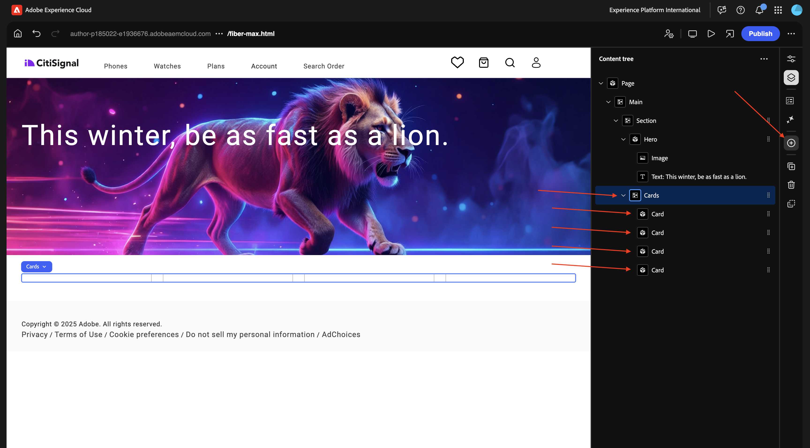

처음 **카드**&#x200B;를 선택하십시오. 텍스트를 변경하려면 **text** 영역을 클릭하십시오.


다음 텍스트를 붙여넣습니다. 텍스트의 첫 줄이 **제목 1**&#x200B;을(를) 사용하고 있는지 확인하십시오. **완료**&#x200B;를 클릭합니다.

```
99.9% network reliability

Game, video chat and stream on multiple devices with ultra low lag.
```


두 번째 **카드**&#x200B;를 선택하십시오. 텍스트를 변경하려면 **text** 영역을 클릭하십시오.


다음 텍스트를 붙여넣습니다. 텍스트의 첫 줄이 **제목 1**&#x200B;을(를) 사용하고 있는지 확인하십시오. **완료**&#x200B;를 클릭합니다.

```
3-year

price lock guarantee

For new and existing Fiber Max customers on all internet plans.

No hidden fees.
```


세 번째 **카드**&#x200B;를 선택하십시오. 텍스트를 변경하려면 **text** 영역을 클릭하십시오.


다음 텍스트를 붙여넣습니다. 텍스트의 첫 줄이 **제목 1**&#x200B;을(를) 사용하고 있는지 확인하십시오. **완료**&#x200B;를 클릭합니다.

```
More ways to save

Save over 45% on the best entertainment with CitiSignal
```

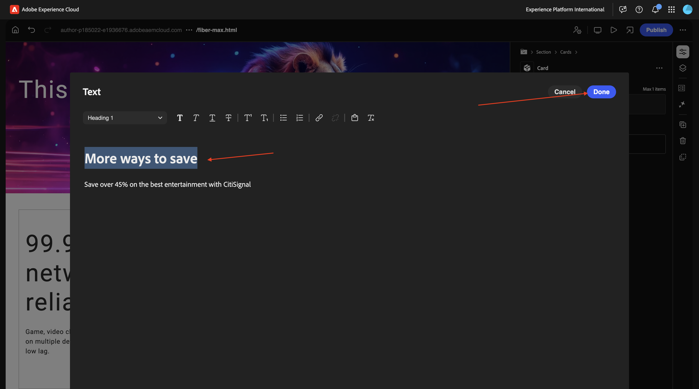

네 번째 **카드**&#x200B;를 선택하십시오. 텍스트를 변경하려면 **text** 영역을 클릭하십시오.


다음 텍스트를 붙여넣습니다. 텍스트의 첫 줄이 **제목 1**&#x200B;을(를) 사용하고 있는지 확인하십시오. **완료**&#x200B;를 클릭합니다.

```
Get Fiber Max now!

Fill out the form here to get started.
```


이제 이 항목을 사용할 수 있습니다. **게시**&#x200B;를 클릭합니다.

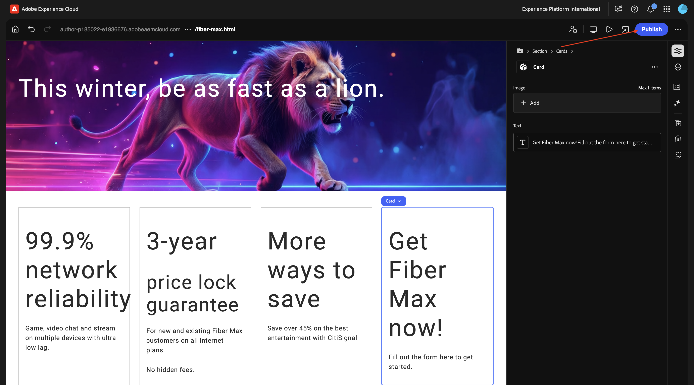

**게시**&#x200B;를 다시 클릭합니다.

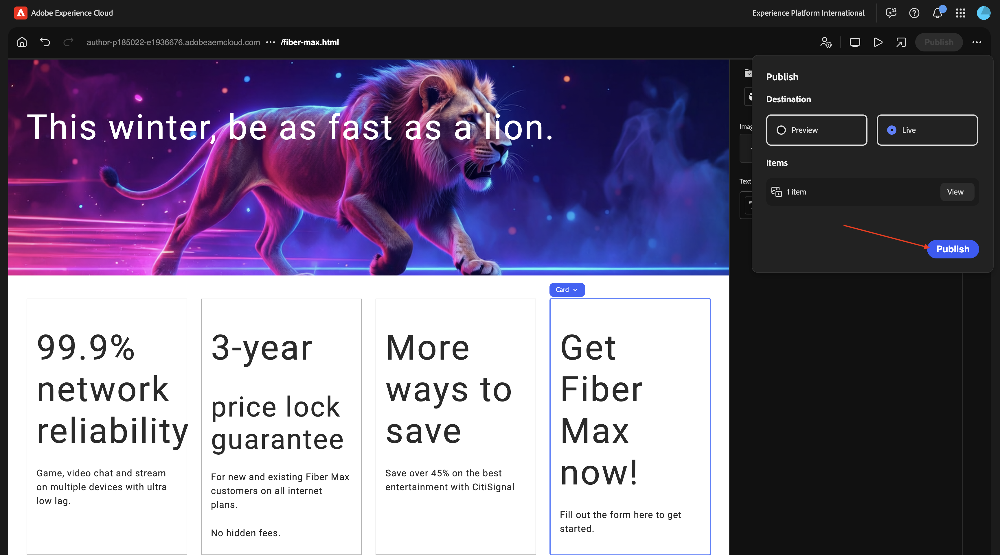

**페이지 열기**&#x200B;를 클릭합니다.


다음에 필요할 때 페이지의 URL을 복사합니다.

URL은 `https://author-pXXXXXX-eXXXXXXX.adobeaemcloud.com/content/CitiSignal/fiber-max.html`과(와) 유사해야 합니다.


[https://experience.adobe.com/#/experiencemanager/](https://experience.adobe.com/#/experiencemanager/)&#x200B;(으)로 이동합니다. **AI 길잡이**&#x200B;를 열려면 클릭하세요.


다음 메시지를 붙여 넣고 **보내기**&#x200B;를 클릭합니다. 이 프롬프트에서 XXX를 이전 단계에서 복사한 URL로 바꿉니다.

```
On the page XXX, please make the following changes:

- change the word 'winter' to 'spring'
- change the word 'lion' to 'leopard'
- change the image in the hero block to use the image 'citisignal_leopard.png'
- change the text '99.9% network reliability' to '99.999% network reliability'
```


1~2분 후에 이 메시지가 표시됩니다. 프롬프트 `generate`을(를) 입력하고 **보내기**&#x200B;를 클릭합니다.


몇 분 후에 변경 사항이 수행되었다는 확인이 표시됩니다. **업데이트된 페이지 미리 보기**&#x200B;를 클릭합니다.


이제 수행된 변경 사항에 대한 시각적 확인이 제공됩니다. 이 미리 보기 페이지는 순전히 정보 제공을 위한 것이므로 이 페이지에서 작업을 수행할 수 없습니다.


작업을 수행하려면 **AEM에서 편집**&#x200B;을 클릭하세요.


이제 유니버설 편집기에서 변경 사항이 있으면 모든 변경 사항과 함께 모든 변경 사항을 자세히 볼 수 있습니다. 페이지를 검토한 후 **게시**&#x200B;를 클릭합니다.


**게시**&#x200B;를 다시 클릭합니다. 적용한 변경 사항이 아직 프로덕션 환경에 게시되지 않았습니다. 대신 AEM의 **시작**&#x200B;에 게시되었습니다.

론치를 사용하면 향후 릴리스용 콘텐츠를 효율적으로 개발할 수 있습니다. 론치는 현재 페이지를 유지 관리하는 동시에 나중에 게시할 준비를 하면서 변경할 수 있도록 하기 위해 만들어집니다. 즉, 현재 게시된 페이지와 향후 한 번에 게시할 페이지 버전이라는 두 가지 버전을 동시에 효과적으로 편집합니다. 해당 시간이 되면 원래 페이지를 바꾸고 새 버전을 게시할 수 있습니다.


향후 릴리스에 대해 보류 중인 변경 내용을 **홍보**&#x200B;하려면 AEM으로 돌아가십시오. 페이지 상단의 **Adobe Experience Manager**&#x200B;을 클릭하고 **hammer** 아이콘을 클릭한 다음 **시작**&#x200B;을 선택합니다.


이제 보류 중인 **시작**&#x200B;이 표시됩니다. 보류 중인 **시작** 앞의 확인란을 선택합니다.


**승격**&#x200B;을 클릭합니다.


**전체 시작 홍보**&#x200B;를 선택하고 **다음**&#x200B;을 클릭합니다.


**승격**&#x200B;을 클릭합니다.


이제 이 항목을 볼 수 있습니다. 변경 사항이 현재 프로덕션에 있습니다.


이제 페이지를 새로 고치면 게시된 페이지에 변경 사항이 모두 표시됩니다.


또는 수동 승격 프로세스를 거치지 않고 AI Assistant에 `accept` 프롬프트를 입력할 수도 있습니다.


그런 다음 변경 사항이 게시되었다는 확인을 받아야 합니다.


### 콘텐츠 업데이트 - 양식 만들기

[Edge Delivery Services이 있는 Adobe Experience Manager Forms](./../../asset-mgmt/module1.3/aemforms.md){target="_blank"} 모듈에서 수동으로 양식을 만드는 단계를 찾을 수 있습니다.

이제 양식 작성 기술을 사용하여 사용자가 개발 또는 IT 팀에 종속되지 않고 자연어 프롬프트를 통해 적응형 양식을 작성할 수 있습니다. 이 기능은 브랜드 일관성을 유지하면서 양식 개발을 가속화하고 비즈니스 사용자가 깊이 있는 기술 제품 지식 없이도 양식을 만들 수 있도록 합니다.

[https://experience.adobe.com/#/ai-assistant/chat](https://experience.adobe.com/#/ai-assistant/chat)&#x200B;(으)로 이동합니다.


다음 메시지를 입력하고 **보내기**&#x200B;를 클릭합니다.

```
Create a new adaptive form using Edge Delivery Services and the existing CitiSignal site, with the following details:
- Form name: "citisignal-fiber-max-interest-2"
- Form fields: 4 text input fields are needed, for "first-name", "last-name", "email" and "city"
- When the form is submitted, send the submission to a spreadsheet, with this URL: https://docs.google.com/spreadsheets/d/1WwKrcM8mZ2d_W3sMheUAw3nFhP_OFk05TsqxhHkudfQ/edit?usp=sharing.
```

## 다음 단계

[1.6.2 AEM MCP 서버 및 커서로 이동](./ex2.md){target="_blank"}

[AEM 및 에이전트](./aemagents.md){target="_blank"}(으)로 돌아가기

[모든 모듈로 돌아가기](./../../../overview.md){target="_blank"}
