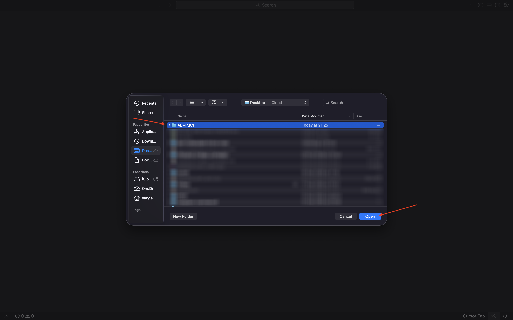
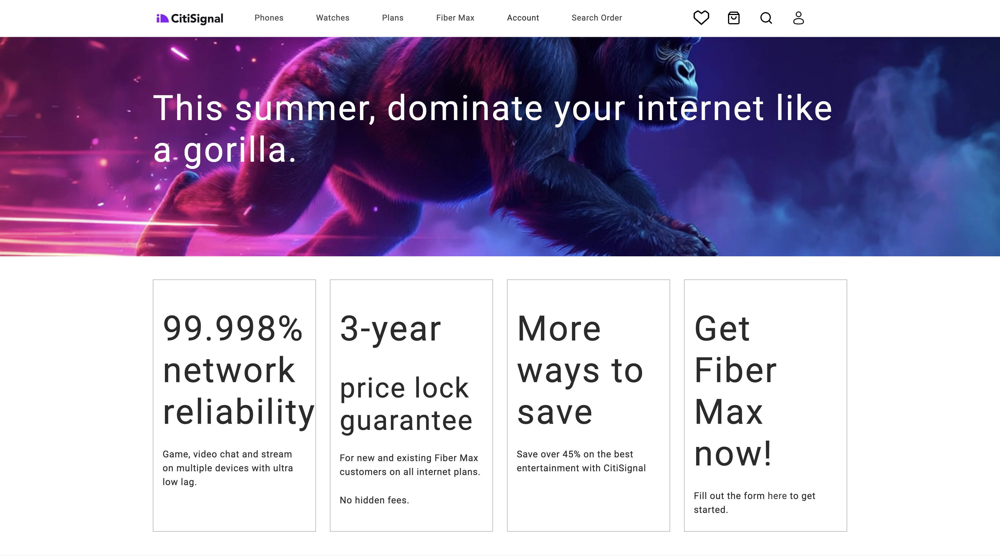

# 1.6.2 AEM MCP 서버 및 커서

>[!IMPORTANT]
>
>이 연습을 완료하려면 EDS 환경이 있는 작업 중인 AEM Sites 및 Assets CS에 액세스할 수 있어야 하며 사용 중인 IMS Org에 대해 다양한 AEM 에이전트를 활성화해야 합니다.
>
>아직 이러한 환경이 없다면 연습 [Adobe Experience Manager Cloud Service 및 Edge Delivery Services](./../../../modules/asset-mgmt/module2.1/aemcs.md){target="_blank"}로 이동하십시오. 거기에 있는 지침을 따르십시오, 그러면 당신은 이러한 환경에 액세스 할 수 있습니다.

>[!IMPORTANT]
>
>이전에 AEM Sites 및 Assets CS 환경에서 AEM CS 프로그램을 구성한 경우 AEM CS 샌드박스가 최대 절전 모드일 수 있습니다. 이러한 샌드박스의 최대 절전 모드 해제 시간이 10~15분 정도 걸리는 점을 감안할 때, 나중에 최대 절전 모드 해제 프로세스를 기다릴 필요가 없도록 지금 시작하는 것이 좋습니다.


다음은 사용 가능한 모든 AEM MCP 서버입니다.

- https://mcp.adobeaemcloud.com/adobe/mcp/content
- https://mcp.adobeaemcloud.com/adobe/mcp/content-readonly (읽기 전용 컨텐츠 작업)
- https://mcp.adobeaemcloud.com/adobe/mcp/content-updater (Experience Production Agent의 해당 스킬 노출)
- https://mcp.adobeaemcloud.com/adobe/mcp/experience-governance (페이지에 대한 브랜드 정책을 가져오고 확인하는 기술을 노출합니다.)
- https://mcp.adobeaemcloud.com/adobe/mcp/discovery (AEM 환경에서 콘텐츠를 검색하는 기술 노출)

이 연습에서는 다음과 같은 특정 MCP 서버를 사용하는 방법에 대한 지침을 확인할 수 있습니다.

- https://mcp.adobeaemcloud.com/adobe/mcp/content
- https://mcp.adobeaemcloud.com/adobe/mcp/discovery

프로세스가 매우 유사하므로 아래 지침을 사용하여 사용 가능한 다른 AEM MCP 서버에 대해 유사한 MCP 서버를 설정할 수 있습니다.

## 1.6.2.1 Experience Production Agent 커서 MCP 서버 설정

바탕 화면에 새 빈 폴더를 만듭니다.


커서를 엽니다. **프로젝트 열기**&#x200B;를 클릭합니다.


이전에 만든 폴더를 선택하고 **열기**&#x200B;를 클릭합니다.



**예, 작성자를 신뢰합니다**&#x200B;를 클릭합니다.


그럼 이걸 보셔야죠 키보드 단축키 `Cmd + Shift + J`을(를) 사용하여 커서 설정을 엽니다. 그럼 이걸 보셔야죠 **도구 및 MCP**(으)로 이동합니다.


**+ 새 MCP 서버**&#x200B;를 클릭합니다.


**mcp.json** 파일에 다음 MCP 서버를 추가합니다. 이 파일에 이미 지정된 다른 MCP 서버가 있을 수 있습니다. 제거하지 말고 아래의 새로운 줄을 추가하세요. 변경 내용을 저장합니다.

```json
"aem": {
    "url": "https://mcp.adobeaemcloud.com/adobe/mcp/content"
    }
```


**커서 설정** 탭으로 다시 전환합니다. 이제 MCP 서버 목록에 **aem**&#x200B;이라는 도구가 추가되었습니다. Adobe 계정을 사용하여 인증하려면 **연결**&#x200B;을 클릭하세요.


이 메시지가 표시되면 **열기**&#x200B;를 클릭합니다. 그런 다음 브라우저에서 인증해야 합니다.


인증에 성공하면 다음과 같은 메시지가 표시됩니다.


**커서 설정** 및 **mcp.json** 탭을 닫습니다. 다음 메시지를 채팅에 붙여 넣고 **보내기**&#x200B;를 클릭합니다.

```
I just created a new custom mcp server named 'aem'. what can I do with that?
```


**실행**&#x200B;을 클릭합니다.


그러면 유사한 응답이 표시됩니다.


보시다시피 이전 연습에서 AI Assistant를 사용하여 가능했던 것과 비교하여 커서의 MCP 서버를 통해 유사한 기능이 노출됩니다.

다음 메시지를 입력하고 **보내기**&#x200B;를 클릭합니다.

```javascript
List AEM Author instances
```


그럼 이런 걸 보셔야겠네요 사용할 환경을 검색한 다음 다음 다음 메시지를 입력하고 **보내기**&#x200B;를 클릭합니다.

```javascript
use environment number X
```


그럼 이걸 보셔야죠


다음 메시지를 붙여 넣고 **보내기**&#x200B;를 클릭합니다. 이 프롬프트에서 XXX를 이전 연습에서 복사한 URL로 바꿉니다.

```
On the page https://author-p185022-e1936676.adobeaemcloud.com/content/CitiSignal/fiber-max.html, please make the following changes:

- change the word 'winter' to 'summer'
- change the text 'be as fast as a leopard' to 'dominate your internet like a gorilla'
- change the image in the hero block to use the image 'citisignal_gorilla.png'
- change the text '99.9% network reliability' to '99.998% network reliability'
```


1-2분 후에는 비슷한 응답을 받게 됩니다. URL을 복사하고 브라우저에서 페이지를 엽니다.


그럼 이걸 보셔야죠



다음 메시지를 입력하고 **보내기**&#x200B;를 클릭합니다.

```javascript
promote the changes by creating a new launch and promoting it
```


1~2분 후 변경 사항이 프로모션되었습니다.


이제 웹 사이트에서 변경 사항을 라이브로 확인할 수 있습니다.


언제든지 AEM MCP 서버의 다른 기능을 살펴볼 수 있습니다.

## 1.6.2.2 검색 에이전트 커서 MCP 서버 설치

키보드 단축키 `Cmd + Shift + J`을(를) 사용하여 커서 설정을 엽니다. 그럼 이걸 보셔야죠 **도구 및 MCP**(으)로 이동합니다. **+ 새 MCP 서버**&#x200B;를 클릭합니다.


**mcp.json** 파일에 다음 MCP 서버를 추가합니다. 이 파일에 이미 지정된 다른 MCP 서버가 있을 수 있습니다. 제거하지 말고 아래의 새로운 줄을 추가하세요. 변경 내용을 저장합니다.

```
,
"aem-discovery": {
    "url": "https://mcp.adobeaemcloud.com/adobe/mcp/discovery"
}
```


**커서 설정** 탭으로 다시 전환합니다. 이제 MCP 서버 목록에 **aem**&#x200B;이라는 도구가 추가되었습니다. Adobe 계정을 사용하여 인증하려면 **연결**&#x200B;을 클릭하세요.


인증 후 이 메시지가 표시됩니다.


**커서 설정** 및 **mcp.json** 탭을 닫습니다. 다음 메시지를 채팅에 붙여 넣고 **보내기**&#x200B;를 클릭합니다.

```
I just created a new custom mcp server named 'aem-discovery'. what can I do with that?
```


```
for the environment https://author-pXXXXXX-eXXXXXXX.adobeaemcloud.com/, list all assets tagged with 'Spring 2026'
```


그럼 이런 걸 보셔야겠네요


## 다음 단계

ChatGPT 및 MCP 서버를 사용하여 [1.6.3 콘텐츠 조각 크기 조정](./ex3.md){target="_blank"}(으)로 이동

[AEM 및 에이전트](./aemagents.md){target="_blank"}(으)로 돌아가기

[모든 모듈로 돌아가기](./../../../overview.md){target="_blank"}
