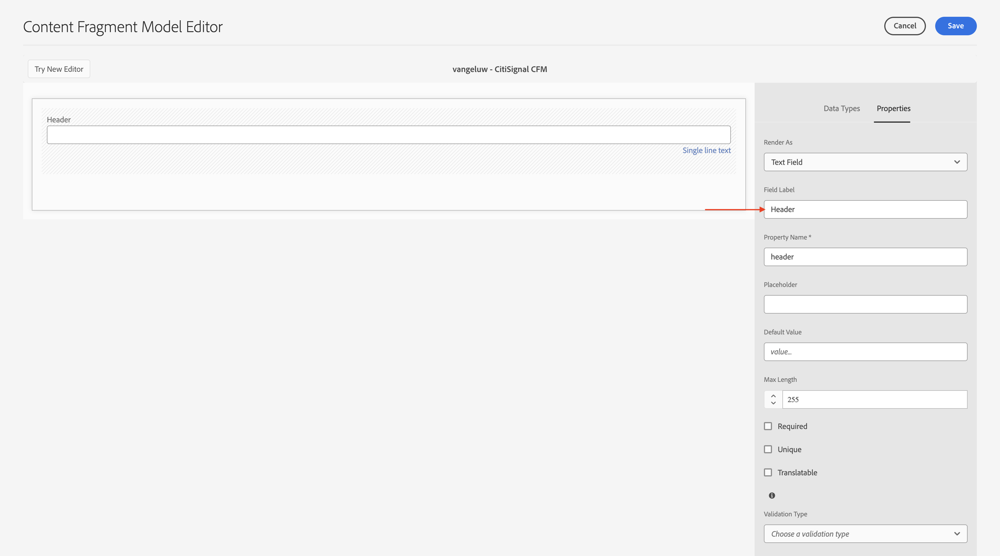
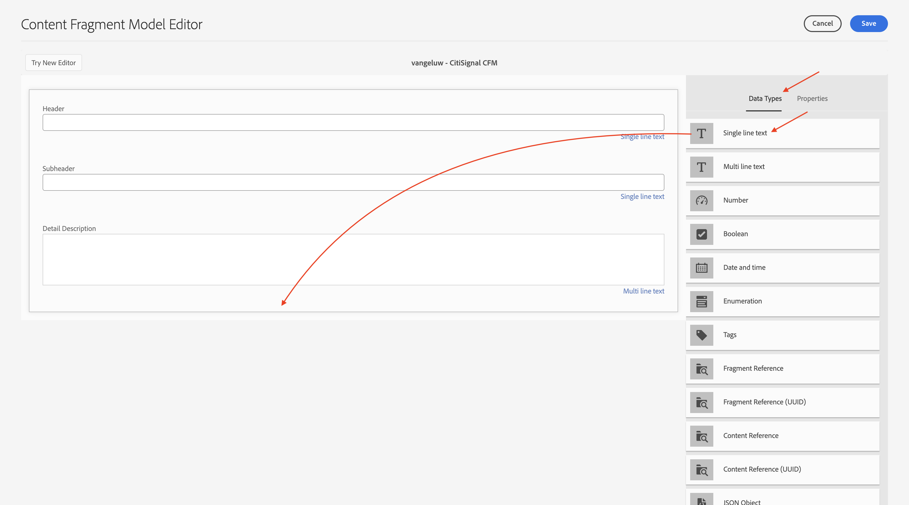
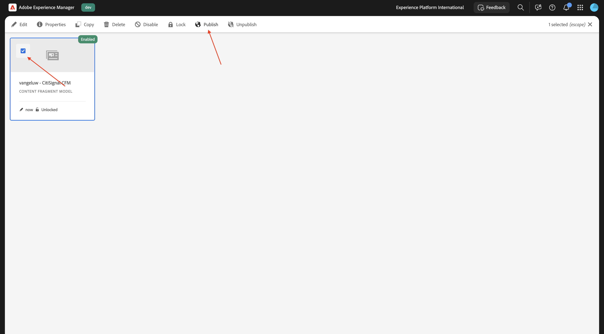
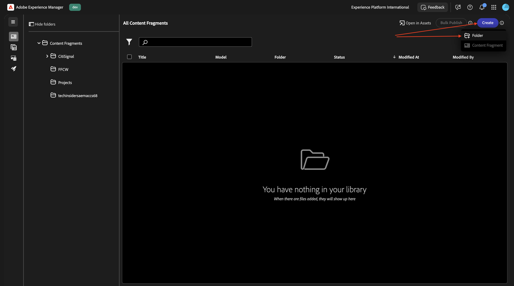
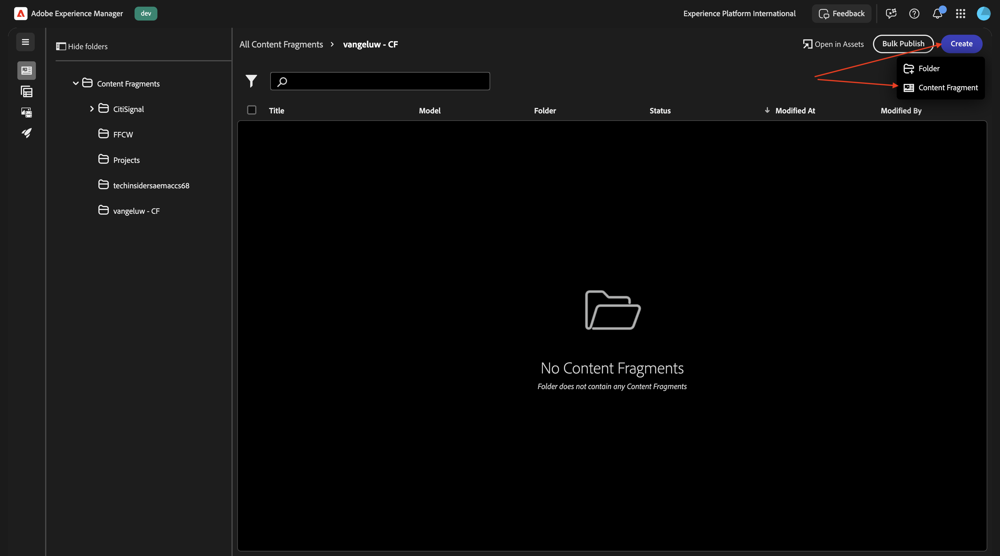
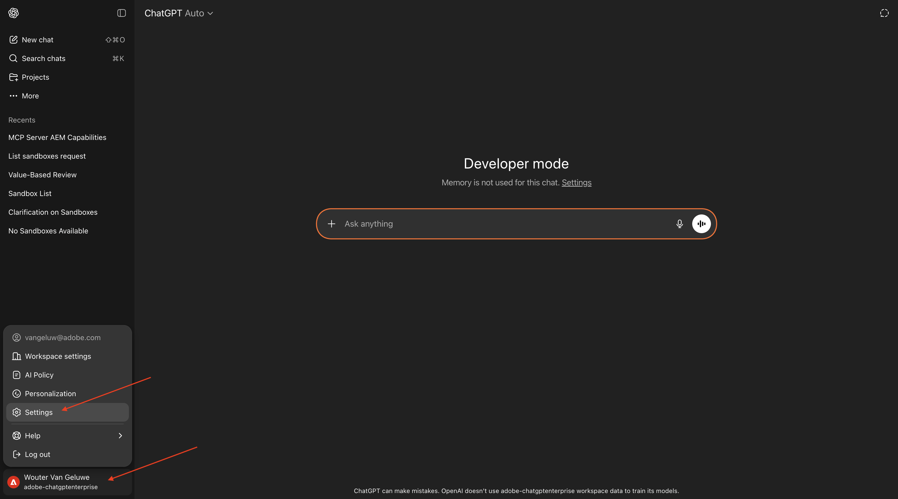
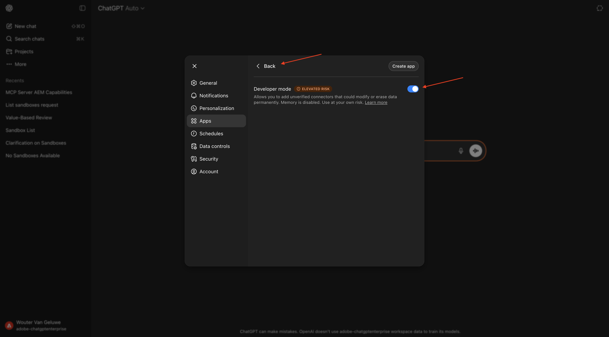

# 1.6.3 ChatGPT 및 MCP 서버를 사용하여 콘텐츠 조각 크기 조정

>[!IMPORTANT]
>
>이 연습을 완료하려면 EDS 환경이 있는 작업 중인 AEM Sites 및 Assets CS에 액세스할 수 있어야 하며 사용 중인 IMS Org에 대해 다양한 AEM 에이전트를 활성화해야 합니다.
>
>아직 이러한 환경이 없다면 연습 [Adobe Experience Manager Cloud Service 및 Edge Delivery Services](./../../../modules/asset-mgmt/module2.1/aemcs.md){target="_blank"}로 이동하십시오. 거기에 있는 지침을 따르십시오, 그러면 당신은 이러한 환경에 액세스 할 수 있습니다.

>[!IMPORTANT]
>
>이전에 AEM Sites 및 Assets CS 환경에서 AEM CS 프로그램을 구성한 경우 AEM CS 샌드박스가 최대 절전 모드일 수 있습니다. 이러한 샌드박스의 최대 절전 모드 해제 시간이 10~15분 정도 걸리는 점을 감안할 때, 나중에 최대 절전 모드 해제 프로세스를 기다릴 필요가 없도록 지금 시작하는 것이 좋습니다.

## 1.6.3.1 콘텐츠 조각 모델 만들기

Adobe Experience Manager 작성자 환경으로 돌아가서 **도구**&#x200B;로 이동한 다음 **구성 브라우저**&#x200B;로 이동합니다.


**만들기**&#x200B;를 클릭합니다.


`Content Fragments`제목&#x200B;**및**&#x200B;이름&#x200B;**필드에**&#x200B;을(를) 사용합니다.

**콘텐츠 조각 모델** 및 **GraphQL 지속 쿼리** 옵션이 모두 활성화되어 있는지 확인하십시오.

**만들기**&#x200B;를 클릭합니다.


Adobe Experience Manager 작성자 환경으로 돌아간 다음 **콘텐츠 조각**(으)로 이동합니다.


**콘텐츠 조각 모델**(으)로 이동하여 구성 **콘텐츠 조각**&#x200B;을 선택한 다음 **만들기**&#x200B;를 클릭합니다.


이름 `--aepUserLdap-- - CitiSignal CFM`을(를) 사용합니다. **만들기 및 열기**&#x200B;를 클릭합니다.


그럼 이걸 보셔야죠 **한 줄 텍스트** 필드를 캔버스로 끌어서 놓습니다.


필드 **필드 레이블**&#x200B;을(를) `Header`(으)로 변경합니다.



**데이터 형식**(으)로 돌아갑니다. **한 줄 텍스트** 필드를 캔버스로 끌어서 놓습니다.


필드 **필드 레이블**&#x200B;을(를) `Subheader`(으)로 변경합니다.


**데이터 형식**(으)로 돌아갑니다. **여러 줄 텍스트** 필드를 캔버스로 끌어서 놓습니다.


필드 **필드 레이블**&#x200B;을(를) `Detail Description`(으)로 변경합니다.


**데이터 형식**(으)로 돌아갑니다. **한 줄 텍스트** 필드를 캔버스로 끌어서 놓습니다.



필드 **필드 레이블**&#x200B;을(를) `CTA Text`(으)로 변경합니다.


**데이터 형식**(으)로 돌아갑니다. **한 줄 텍스트** 필드를 캔버스로 끌어서 놓습니다.


필드 **필드 레이블**&#x200B;을(를) `CTA Link`(으)로 변경합니다. **저장**&#x200B;을 클릭합니다.


그럼 이걸 보셔야죠


콘텐츠 조각 모델을 선택하고 **게시**&#x200B;를 클릭합니다.



**게시**&#x200B;를 클릭합니다.


## 1.6.3.2 콘텐츠 조각 만들기

Adobe Experience Manager 작성자 환경으로 돌아간 다음 **콘텐츠 조각**(으)로 이동합니다.


그럼 이걸 보셔야죠 **만들기**&#x200B;를 클릭한 다음 **폴더**&#x200B;를 선택합니다.



제목을 입력하십시오. `--aepUserLdap-- - CF`. **만들기**&#x200B;를 클릭합니다.


Adobe Experience Manager 작성자 환경으로 이동한 다음 **Assets**(으)로 이동합니다.


**파일**(으)로 이동합니다.


방금 만든 폴더(이름: `--aepUserLdap-- - CF`)를 선택하고 **속성**&#x200B;을 클릭합니다.


**클라우드 서비스**(으)로 이동한 다음 **폴더** 아이콘을 클릭합니다.


이전에 만든 클라우드 구성을 선택하십시오. 이름은 **콘텐츠 조각**&#x200B;이어야 합니다. **선택**&#x200B;을 클릭합니다.


그럼 이걸 보세요 **저장 및 닫기**&#x200B;를 클릭합니다.


Adobe Experience Manager 작성자 환경으로 돌아간 다음 **콘텐츠 조각**(으)로 이동합니다.


그럼 이걸 보셔야죠 **만들기**&#x200B;를 클릭한 다음 **콘텐츠 조각**&#x200B;을 선택합니다.



이전에 만든 **콘텐츠 조각 모델**&#x200B;을(를) 선택합니다. `--aepUserLdap-- - CitiSignal CFM`(으)로 지정해야 합니다. 이름 `--aepUserLdap-- CitiSignal Fiber Max`을(를) 사용합니다.

**만들기 및 열기**&#x200B;를 클릭합니다.


그럼 이걸 보셔야죠


다음과 같이 필드를 채웁니다.

- **헤더**: `CitiSignal Fiber Max`
- **하위 헤더**: `Experience high speed internet now`
- **자세한 설명**:

```
Experience the future of connectivity with CitiSignal Fiber Max, the ultimate solution for high-speed internet. Designed for homes and businesses that demand performance, Fiber Max delivers blazing-fast fiber speeds, ensuring seamless streaming, ultra-responsive gaming, and crystal-clear video calls.

Key Features:

Unmatched Speed: Enjoy lightning-fast downloads and uploads powered by cutting-edge fiber technology.
Reliable Performance: Consistent connectivity for work, entertainment, and everything in between.
Future-Ready: Built to handle the growing demands of smart homes and digital lifestyles.
Unlimited Potential: No data caps, no throttling—just pure speed.
Why Choose CitiSignal Fiber Max? Stay ahead with internet that works as hard as you do. Whether you’re powering a remote office or streaming in 4K, Fiber Max ensures you never miss a beat.
```

**CTA 텍스트**: `Upgrade now by signing your new contract!`
**CTA 링크**: `https://techinsiders68.adobedemosystem.com/`

**게시**&#x200B;를 클릭한 다음 **지금**&#x200B;을 선택합니다.


**게시**&#x200B;를 클릭합니다.


## 1.6.3.3 ChatGPT에서 MCP 서버 구성

>[!NOTE]
>
>ChatGPT에서 Adobe Marketing Agent을 사용하려면 다음 요구 사항이 있습니다.
>- OpenAI의 ChatGPT Enterprise 유료 버전
>- ChatGPT Enterprise 웹 클라이언트 사용

[https://chatgpt.com/](https://chatgpt.com/){target="_blank"}(으)로 이동한 다음 계정 세부 정보를 사용하여 로그인합니다. 로그인하면 이 메시지가 표시됩니다. 사용자 이름을 클릭한 다음 **설정**&#x200B;을 선택합니다.



**앱**(으)로 이동한 다음 **고급 설정**&#x200B;을 선택합니다.


**개발자 모드**&#x200B;를 켠 다음 **뒤로**&#x200B;를 클릭하세요.



**앱 만들기**&#x200B;를 클릭합니다.


다음과 같이 필드를 채웁니다.

- **이름**: `aem`
- **MCP 서버 URL**: `https://mcp.adobeaemcloud.com/adobe/mcp/content`
- **인증**: `OAuth`

**이해하고 계속하겠습니다**&#x200B;에 대한 확인란을 선택하세요.

**만들기**&#x200B;를 클릭합니다.


ChatGPT가 이제 Adobe 계정에 연결을 시도합니다. **액세스 허용**&#x200B;을 선택하면 Adobe 계정으로 로그인해야 합니다.

성공적으로 로그인하면 이제 Adobe Marketing Agent이 성공적으로 연결되었음을 알 수 있습니다.


## 1.6.3.4 ChatGPT에서 AEM MCP 서버 사용

이 창을 닫습니다.


그럼 이걸 보셔야죠 **+** 아이콘을 클릭하고 **자세히**(으)로 이동한 다음 **aem**&#x200B;을(를) 선택합니다.


다음 메시지를 입력하고 **보내기**&#x200B;를 클릭합니다.

```
I just created a new custom mcp server named 'aem'. what can I do with that?
```


그럼 이런 걸 보셔야겠네요 다음 메시지를 입력하고 **보내기**&#x200B;를 클릭합니다.

```
use the author url https://author-pXXXXXX-eXXXXXXX.adobeaemcloud.com/ from now on
```


그럼 이런 걸 보셔야겠네요 다음 메시지를 입력하고 **보내기**&#x200B;를 클릭합니다.

```
find the content fragment --aepUserLdap-- - CitiSignal Fiber Max and make a variation called --aepUserLdap-- - CitiSignal Fiber Max (FR), then translate all fields into french
```


**CreateFragmentVariation**&#x200B;을 클릭합니다.


**UpdateFragment**&#x200B;을 클릭합니다.


그럼 이걸 보셔야죠 조각 변형이 성공적으로 생성되었습니다.


이제 AEM UI에서 새로운 변형을 확인할 수도 있습니다.


## 다음 단계

[AEM 및 에이전트](./aemagents.md){target="_blank"}(으)로 돌아가기

[모든 모듈로 돌아가기](./../../../overview.md){target="_blank"}