# 1.7.2 커서를 사용하여 프로젝트 개발

## 1.7.2.1 디렉터리 및 도구 설정

바탕 화면에서 이름이 `--aepUserLdap---commerce`인 새 디렉터리를 만듭니다.

폴더를 마우스 오른쪽 단추로 클릭하고 **폴더의 새 터미널**&#x200B;을 선택합니다.

그럼 이걸 보셔야죠

이제 [https://github.com/adobe/commerce-integration-starter-kit](https://github.com/adobe/commerce-integration-starter-kit)을(를) 볼 수 있는 기존 Github 리포지토리를 복제해야 합니다.

이 저장소는 Adobe을 사용하여 Adobe Commerce과 ERP, CRM 및 PIM과 같은 기타 백오피스 시스템 간의 통합을 통해 실시간 연결 안정성을 개선하고 시장 출시 기간을 단축하는 Adobe Developer App Builder의 통합 시작 키트입니다.

이 저장소를 복제하는 방법에는 여러 가지가 있습니다. 이 예에서는 터미널이 사용됩니다.

터미널 창에 다음 명령을 입력하고 실행합니다.

`git clone https://github.com/adobe/commerce-integration-starter-kit`

몇 초 후에 이 결과가 표시됩니다.

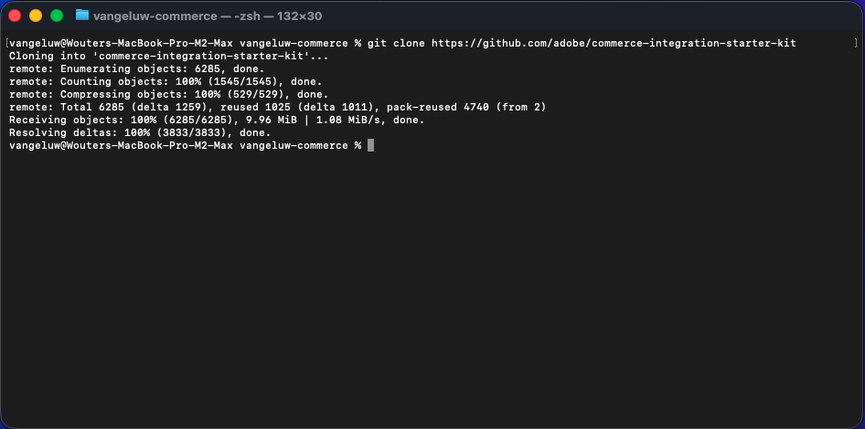

그런 다음 방금 만든 폴더로 이동해야 합니다. 다음 명령을 입력한 다음 실행합니다.

`cd commerce-integration-starter-kit`

그럼 이걸 보셔야죠

그런 다음 Cursor용 Commerce 확장성 도구를 설정해야 합니다. 다음 명령을 입력한 다음 실행합니다.

`aio commerce extensibility tools-setup`

**현재 디렉터리**&#x200B;를 선택합니다.

**커서**&#x200B;를 선택하십시오.

**npm**&#x200B;을(를) 선택하십시오.

몇 분 후면 이걸 볼 수 있을 거야.

Commerce Extensibility tools for Cursor를 설치하면 Cursor 환경의 일부로 사용할 수 있는 MCP 서버가 제공됩니다. 다음 연습에서는 해당 MCP 서버를 사용하여 App Builder 프로젝트를 개발 및 배포합니다.

## 1.7.2.2 웹후크 설정

이 연습에서는 주문이 생성될 때 주문 이벤트를 해당 웹후크로 스트리밍할 수 있도록 구성해야 하는 웹후크가 필요합니다. 이 연습에서는 [https://pipedream.com/requestbin](https://pipedream.com/requestbin)을(를) 사용하여 샘플 끝점을 사용합니다.

[https://pipedream.com/requestbin](https://pipedream.com/requestbin)&#x200B;(으)로 이동하여 계정을 만든 다음 작업 영역을 만듭니다. 작업 영역이 생성되면 이와 유사한 항목이 표시됩니다.

URL을 복사하려면 **복사**&#x200B;를 클릭하세요. 다음 연습에서는 이 URL을 지정해야 합니다. 이 예제의 URL은 `https://eodts05snjmjz67.m.pipedream.net`입니다.

## 1.7.2.3 커서로 앱 만들기

커서를 엽니다. **프로젝트 열기**&#x200B;를 클릭합니다.

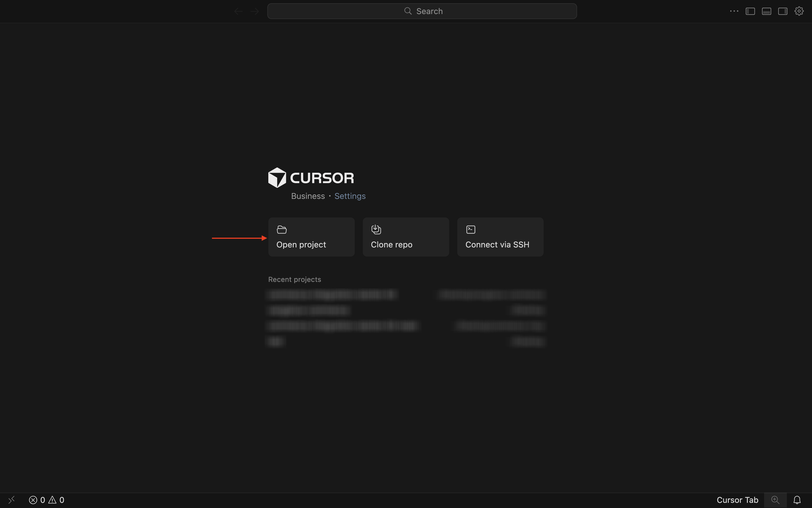

만든 폴더(`--aepUserLdap---commerce`(으)로 이동합니다. 해당 폴더에서 이름이 `commerce-integration-starter-kit`인 폴더를 선택합니다. **열기를 클릭합니다**.

그럼 이걸 보셔야죠 계속하기 전에 Cursor에서 열려 있는 최상위 폴더가 `commerce-integration-starter-kit`인지 확인하십시오.

키보드 단축키 `Cmd + Shift + J`을(를) 사용하여 커서 설정을 엽니다. 그럼 이걸 보셔야죠 **도구 및 MCP**(으)로 이동합니다.

MCP 서버 **commerce-extensibility**&#x200B;을 사용하도록 설정합니다. 완료되면 **X**&#x200B;을(를) 클릭하여 창을 닫습니다.

다음 프롬프트를 복사하여 커서에 붙여넣습니다. 그런 다음 **보내기** 단추를 클릭합니다.

`I would like to build an app that subscribes to order created events and sends them to a configurable URL with basic authentication`

커서가 추론 및 실행을 시작합니다. 커서가 두 번 확인을 요청합니다. 그런 경우 **실행**&#x200B;을 클릭하세요. 추론 및 설정에 따라 5~10번 발생할 수 있습니다.

몇 분 후면 이런 게 보일 거예요.

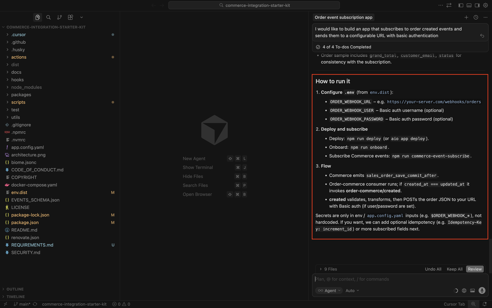

다음 단계는 커서가 표시하는 대로 이름이 `.env`인 파일을 만들고 필요한 변수를 제공하는 것입니다.

## 1.7.2.4 your.env 파일 만들기

**env.dist** 파일을 선택하십시오. `Cmd + C` 명령을 입력한 다음 `Cmd + V` 명령을 입력하십시오.

새로 만든 파일의 이름을 `.env`(으)로 바꾸십시오.

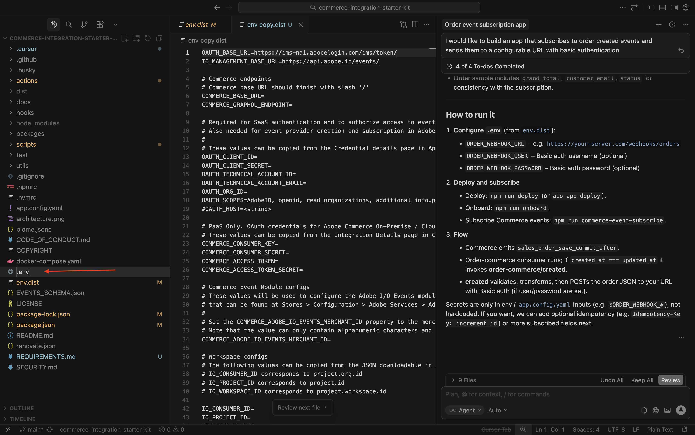

그런 다음 **.env** 파일의 모든 변수 값을 제공해야 합니다.

여기에서 필요한 모든 정보를 찾을 수 있습니다.

### Commerce 엔드포인트

[https://experience.adobe.com](https://experience.adobe.com)&#x200B;(으)로 이동하여 이러한 변수를 찾을 수 있습니다. **Commerce**&#x200B;을(를) 클릭합니다.

그럼 이걸 보셔야죠 ACCS 환경 옆에 있는 **정보** 아이콘을 클릭합니다(이름: `--aepUserLdap-- - ACCS`). REST 끝점 및 GraphQL 끝점의 값을 복사합니다.

이 예제에서는 복사할 값입니다. 줄 6 및 7에서 **.env** 파일의 아래 변수 옆에 붙여 넣습니다.

- **COMMERCE_BASE_URL** = https://na1-sandbox.api.commerce.adobe.com/Lkp3U7tvTBNAmpFvwnZJ4B/
- **COMMERCE_GRAPHQL_ENDPOINT** = https://na1-sandbox.api.commerce.adobe.com/Lkp3U7tvTBNAmpFvwnZJ4B/graphql

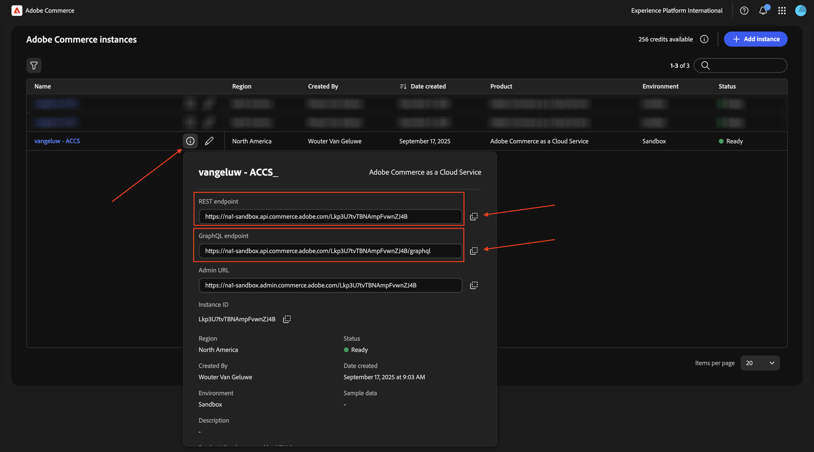

그러면 **.env** 파일에 이 항목이 있어야 합니다.

### Adobe I/O 프로젝트 변수

[https://developer.adobe.com/console](https://developer.adobe.com/console)&#x200B;(으)로 이동하여 이러한 변수를 찾을 수 있습니다. **프로젝트**(으)로 이동한 다음 을(를) 클릭하여 이전 연습에서 만든 Adobe I/O 프로젝트를 엽니다. 이 프로젝트의 이름은 `--aepUserLdap-- Commerce Events`입니다.

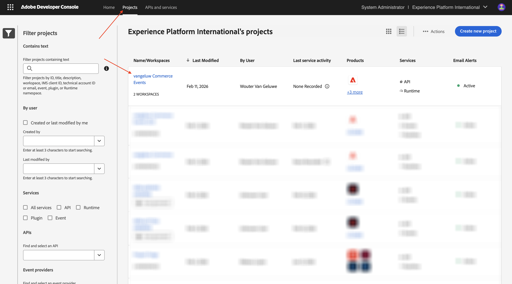

**프로덕션**(으)로 이동합니다.

**OAuth 서버 간**(으)로 이동합니다. 그럼 이걸 보셔야죠

**클라이언트 ID**, **클라이언트 암호**, **기술 계정 ID**, **기술 계정 전자 메일** 및 **조직 ID** 필드의 값을 복사하여 **.env** 파일의 13-17행에 있는 아래 변수 옆에 붙여넣습니다.

- **OAUTH_CLIENT_ID**= **클라이언트 ID**
- **OAUTH_CLIENT_SECRET**= **클라이언트 암호**
- **OAUTH_TECHNICAL_ACCOUNT_ID**= **기술 계정 ID**
- **OAUTH_TECHNICAL_ACCOUNT_EMAIL**= **기술 계정 전자 메일**
- **OAUTH_ORG_ID**= **조직 ID**

그러면 **.env** 파일에 이 항목이 있어야 합니다.

### COMMERCE_ADOBE_IO_EVENTS_MERCHANT_ID

필드 **COMMERCE_ADOBE_IO_EVENTS_MERCHANT_ID=**&#x200B;에 대해 파일 `--aepUserLdap--_commerce_events`.env **의 34행에 값**&#x200B;을(를) 입력하십시오.

그러면 **.env** 파일에 이 항목이 있어야 합니다.

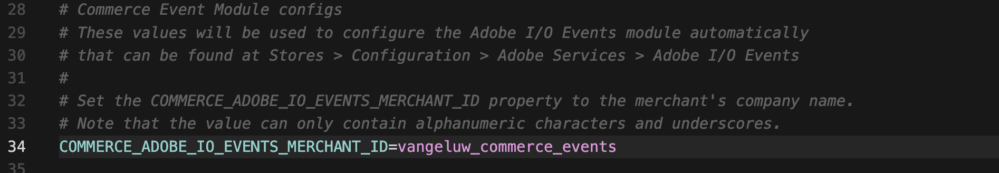

### Workspace 구성

이러한 변수를 검색하려면 Adobe I/O 프로젝트로 돌아가서 **Workspace 개요**&#x200B;를 클릭합니다.

**Workspace 개요**&#x200B;로 이동한 후 다음과 같은 URL을 확인합니다. **https://developer.adobe.com/console/projects/133309/4566206088345586770/workspaces/4566206088345619105/details**.

이 예제에서 첫 번째 숫자 133309은 **IO_CONSUMER_ID** 필드에 사용할 값입니다.
이 예제에서 두 번째 숫자인 4566206088345586770은 **IO_PROJECT_ID** 필드에 사용할 값입니다.
이 예제에서 세 번째 숫자 4566206088345619105은 **IO_WORKSPACE_ID** 필드에 사용할 값입니다.

- **IO_CONSUMER_ID**= 133309
- **IO_PROJECT_ID**= 4566206088345586770
- **IO_WORKSPACE_ID**= 4566206088345619105

이러한 값을 복사하여 42-44행의 **.env** 파일에서 아래 변수 옆에 붙여넣습니다.

### EVENT_접두사

필드 **EVENT_PREFIX =**&#x200B;의 경우 `--aepUserLdap--_`.env **파일의 47행에 값**&#x200B;을(를) 입력하십시오.

그러면 **.env** 파일에 이 항목이 있어야 합니다.

### Webhook

필드 **ORDER_WEBHOOK_URL**&#x200B;의 경우 이 연습에서 이전에 만든 웹후크의 URL을 붙여 넣어야 합니다. 이 URL은 `https://eodts05snjmjz67.m.pipedream.net`과(와) 같습니다.

그러면 **.env** 파일에 이 항목이 있어야 합니다.

### App Builder 자격 증명

파일 **.env**&#x200B;에서 54-55행의 다음 변수를 업데이트해야 합니다.

- **AIO_RUNTIME_NAMESPACE**=
- **AIO_RUNTIME_AUTH**=

Adobe I/O 프로젝트로 돌아가 이러한 변수의 값을 검색할 수 있습니다. **Workspace 개요**(으)로 이동하여 **모두 다운로드**&#x200B;를 클릭합니다.

그런 다음 이와 같은 파일이 다운로드됩니다. 텍스트 편집기를 사용하여 해당 파일을 엽니다.

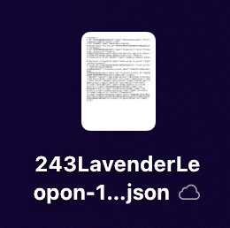

**런타임**&#x200B;이 표시될 때까지 오른쪽으로 스크롤합니다. 그러면 **AIO_RUNTIME_NAMESPACE**&#x200B;에 대한 값이 포함된 **name** 필드가 표시됩니다.

**AIO_RUNTIME_AUTH**&#x200B;에 대한 값이 포함된 **auth**&#x200B;이(가) 표시될 때까지 오른쪽으로 더 스크롤합니다.

파일 **.env**&#x200B;의 54-55행에 두 값을 모두 붙여 넣으십시오. 그러면 이 값이 표시됩니다.

이제 **.env** 파일이 완전히 구성되었습니다.

## 1.7.2.5 workspace.json

이전 단계에서 Adobe I/O 프로젝트에서 이러한 파일을 다운로드했습니다.

해당 파일의 이름을 바꾸고 `workspace.json` 이름을 사용합니다.

파일을 **스크립트**>**온보딩**>**구성** 디렉터리에 복사합니다.

## 1.7.2.6 Adobe I/O 로그인

이전에 사용했던 터미널 창으로 돌아갑니다. `aio login` 명령을 입력하십시오.

그러면 브라우저를 통해 로그인한 후에 이 메시지가 표시됩니다.

## 1.7.2.7 배포 준비 완료

다음 프롬프트를 복사하여 커서에 붙여넣습니다. 그런 다음 **보내기** 단추를 클릭합니다.

`Please deploy this code to Adobe I/O`

작업을 허용하려면 **실행**&#x200B;을 클릭하세요. Cursor가 작업을 확인하도록 여러 번 요청할 수 있습니다.

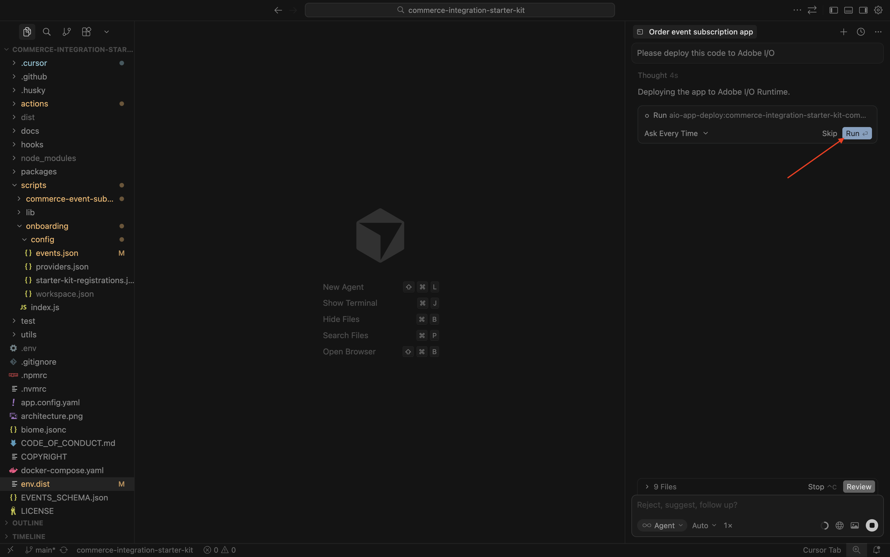

그런 다음 배포는 몇 분 후 종료됩니다.

다음 프롬프트를 복사하여 커서에 붙여넣습니다. 그런 다음 **보내기** 단추를 클릭합니다.

`run the onboarding to commerce`

몇 분 후면 이걸 볼 수 있을 거야.

다음 프롬프트를 복사하여 커서에 붙여넣습니다. 그런 다음 **보내기** 단추를 클릭합니다.

`subscribe to commerce events`

몇 분 후면 이걸 볼 수 있을 거야.

## 1.7.2.8 Adobe Commerce as a Cloud Service에서 구성 확인

[https://experience.adobe.com](https://experience.adobe.com)&#x200B;(으)로 이동합니다. **Commerce**&#x200B;을(를) 클릭합니다.

Adobe Commerce as a Cloud Service 환경을 클릭하여 연 다음 로그인합니다.

**시스템**(으)로 이동한 다음 **이벤트 구독**(으)로 이동합니다.

그런 다음 이 이벤트 구독 목록이 표시됩니다.

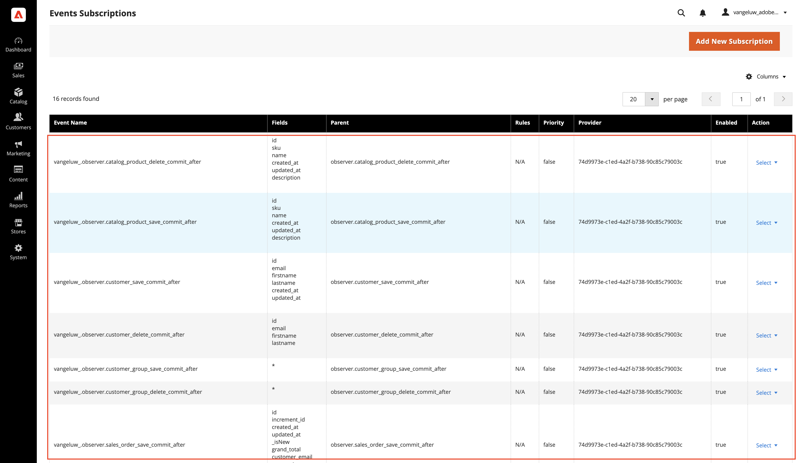

**스토어**(으)로 이동한 다음 **구성**(으)로 이동합니다.

**Adobe 서비스**(으)로 이동하여 **Adobe I/O Events**&#x200B;을(를) 선택합니다. 그러면 필드 **Adobe I/O Workspace 구성**&#x200B;에 별표 두 개 값이 있고 필드 **판매자 ID**&#x200B;에도 `--aepUserLdap--_commerce_events`과(와) 같은 값이 있는 것을 볼 수 있습니다.

이 구성을 적절히 사용하면 구성을 테스트할 수 있습니다.

## 1.7.2.9 시나리오 테스트

웹 사이트를 엽니다.

**시계**(으)로 이동하여 제품을 클릭합니다.

제품을 구성하고 **장바구니에 추가**&#x200B;를 클릭합니다.

**장바구니** 아이콘을 클릭하고 **체크아웃**&#x200B;을 선택합니다.

자세한 내용을 입력하고 **주문**&#x200B;을 클릭하세요.

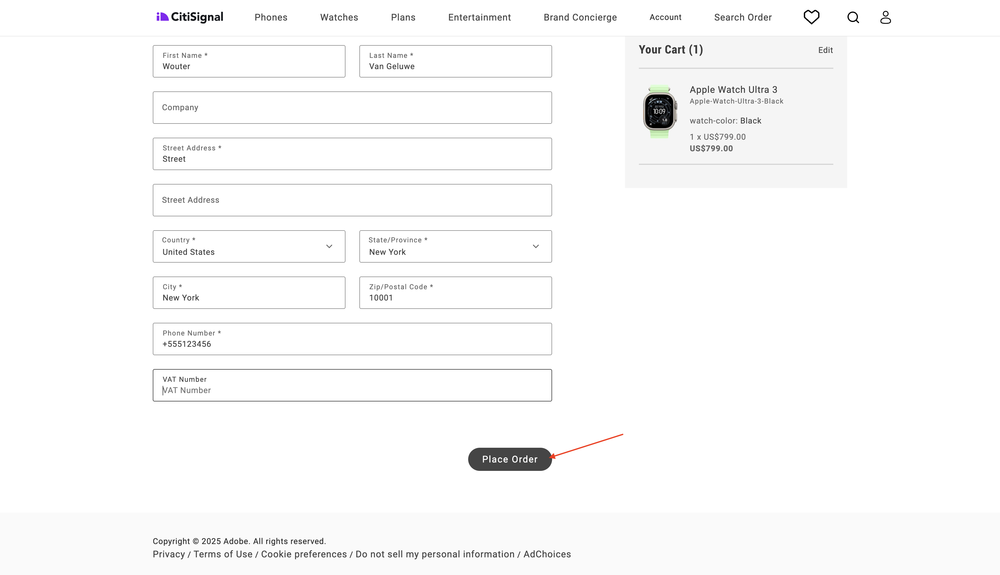

그러면 주문 확인이 표시됩니다.

Webhook 응용 프로그램으로 전환합니다. 이제 방금 확인된 주문에 대해 들어오는 이벤트가 표시됩니다.

## 1.7.2.10 Adobe I/O 디버깅

Adobe I/O 프로젝트로 돌아갑니다. **Workspace 개요**(으)로 이동합니다. 이것과 비슷한 것을 보셔야 합니다 아래로 조금 스크롤하세요.

**Commerce 주문 동기화**&#x200B;를 열려면 클릭하세요.

**추적 디버그**(으)로 이동합니다. 페이로드와 함께 최근에 들어오는 이벤트를 찾을 수 있습니다. 이 정보는 처리된 이벤트와 이벤트가 정상적으로 처리되었는지 파악하는 데 유용합니다.

## 다음 단계

[Adobe Commerce용 지능형 개발자 도구로 돌아가기](./aiassisteddev.md){target="_blank"}

[모든 모듈로 돌아가기](./../../../overview.md){target="_blank"}
