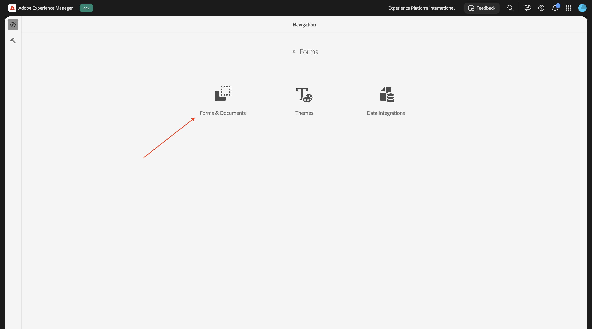
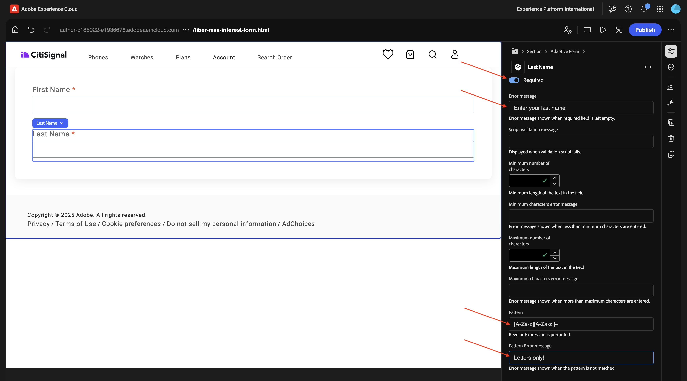
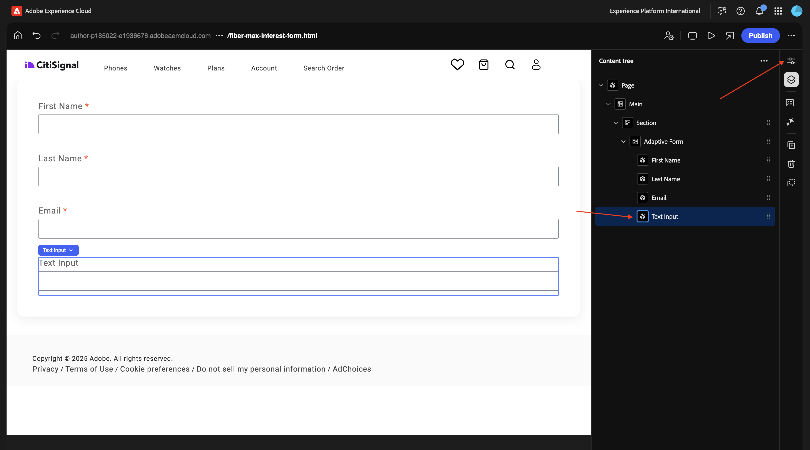
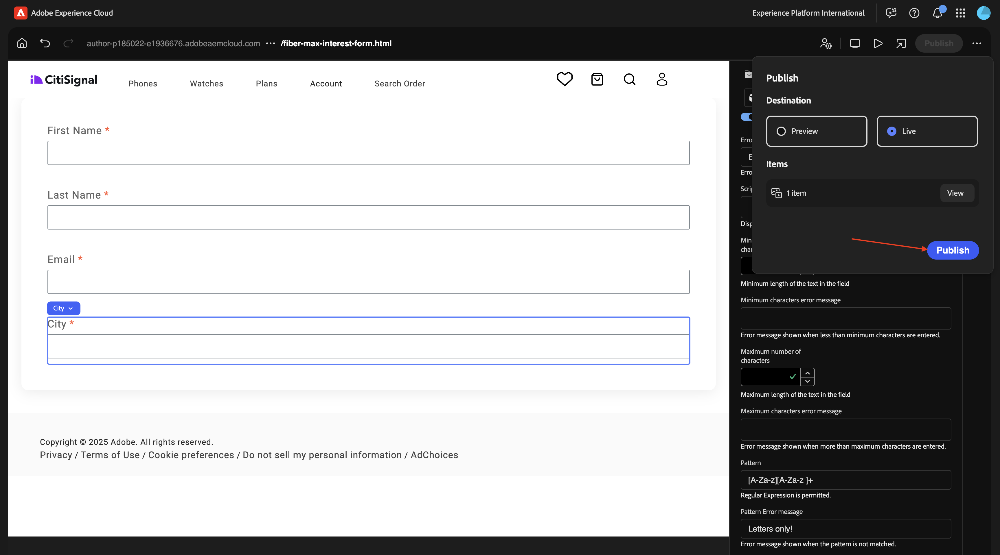

# 1.3.1 첫 번째 양식 만들기

>[!IMPORTANT]
>
>이 연습을 완료하려면 AEM Assets Dynamic Media가 활성화된 작동 중인 AEM Assets CS 작성 환경에 액세스할 수 있어야 합니다.
>
>환경이 없는 경우 [Adobe Experience Manager Cloud Service 및 Edge Delivery Services](./../../../modules/asset-mgmt/module2.1/aemcs.md){target="_blank"}(으)로 이동하세요. 거기에 있는 지침을 따르십시오, 그러면 당신은 이러한 환경에 액세스 할 수 있습니다.

>[!IMPORTANT]
>
>이전에 AEM Assets CS 환경에서 AEM CS 프로그램을 구성한 경우 AEM CS 샌드박스가 최대 절전 모드일 수 있습니다. 이러한 샌드박스의 최대 절전 모드 해제 시간이 10~15분 정도 걸리는 점을 감안할 때, 나중에 최대 절전 모드 해제 프로세스를 기다릴 필요가 없도록 지금 시작하는 것이 좋습니다.

## 1.3.1.1 -

[https://my.cloudmanager.adobe.com](https://my.cloudmanager.adobe.com){target="_blank"}(으)로 이동합니다. 선택해야 하는 조직은 `--aepImsOrgName--`입니다. 환경을 엽니다.

**Forms**(으)로 이동합니다.

**Forms 및 문서**(으)로 이동합니다.

**만들기**&#x200B;를 클릭한 다음 **적응형 양식**&#x200B;을 선택합니다.

**Edge Delivery Services**&#x200B;을(를) 선택한 다음 **빈 페이지**&#x200B;을(를) 선택하십시오. **만들기**&#x200B;를 클릭합니다.

그럼 이걸 보셔야죠 다음 필드를 채웁니다.

- **제목**: `Fiber Max Interest Form`
- **이름**: **제목** 필드를 기반으로 자동으로 채워야 합니다.
- **Github URL**: 웹 사이트에 연결된 Github 리포지토리의 경로를 제공합니다

**만들기**&#x200B;를 클릭합니다.

**만들기**&#x200B;를 클릭하면 **유니버설 편집기**&#x200B;가 자동으로 열리고 다음과 같은 메시지가 표시됩니다. 아이콘을 클릭하여 **콘텐츠 트리**&#x200B;를 엽니다.

**콘텐츠 트리**&#x200B;에서 개체 **적응형 양식**&#x200B;을(를) 선택하십시오.

그런 다음 **+** 아이콘을 클릭하여 새 요소를 추가하고 **텍스트 입력**&#x200B;을 선택합니다.

**콘텐츠 트리**&#x200B;에서 **텍스트 입력** 필드를 선택합니다.

**기본** 보기로 이동합니다. 이걸 보셔야죠

다음 필드를 채웁니다.

- **이름**: `first-name`
- **제목**: `First Name`

그런 다음 **유효성 검사**(으)로 이동합니다.

스위치를 뒤집어 이 필드를 필수 필드로 만듭니다. 다음 필드를 채웁니다.

- **오류 메시지**: `Enter your first name`
- **패턴**: `[A-Za-z][A-Za-z ]+`
- **패턴 오류 메시지**: `Letters only!`

**콘텐츠 트리**&#x200B;에서 필드 **적응형 양식**&#x200B;을(를) 선택하십시오. **+** 아이콘을 클릭한 다음 **텍스트 입력**&#x200B;을 선택합니다.

**콘텐츠 트리**&#x200B;에서 새로 만든 필드 **텍스트 입력**&#x200B;을(를) 선택하십시오. **속성**(으)로 이동합니다.

**기본** 보기로 이동합니다. 이걸 보셔야죠

다음 필드를 채웁니다.

- **이름**: `last-name`
- **제목**: `Last Name`

그런 다음 **유효성 검사**(으)로 이동합니다.

스위치를 뒤집어 이 필드를 필수 필드로 만듭니다. 다음 필드를 채웁니다.

- **오류 메시지**: `Enter your last name`
- **패턴**: `[A-Za-z][A-Za-z ]+`
- **패턴 오류 메시지**: `Letters only!`

**콘텐츠 트리**&#x200B;에서 필드 **적응형 양식**&#x200B;을(를) 선택하십시오. **+** 아이콘을 클릭한 다음 **텍스트 입력**&#x200B;을 선택합니다.

**콘텐츠 트리**&#x200B;에서 새로 만든 필드 **텍스트 입력**&#x200B;을(를) 선택하십시오. **속성**(으)로 이동합니다.

**기본** 보기로 이동합니다. 이걸 보셔야죠

다음 필드를 채웁니다.

- **이름**: `email`
- **제목**: `Email`

그런 다음 **유효성 검사**(으)로 이동합니다.

스위치를 뒤집어 이 필드를 필수 필드로 만듭니다. 다음 필드를 채웁니다.

- **오류 메시지**: `Enter your email address`
- **패턴**: `^[^@]+@[^@]+\.[^@]+$`
- **패턴 오류 메시지**: `Please verify your email address!`

**콘텐츠 트리**&#x200B;에서 필드 **적응형 양식**&#x200B;을(를) 선택하십시오. **+** 아이콘을 클릭한 다음 **텍스트 입력**&#x200B;을 선택합니다.

**콘텐츠 트리**&#x200B;에서 새로 만든 필드 **텍스트 입력**&#x200B;을(를) 선택하십시오.

**기본** 보기로 이동합니다. 이걸 보셔야죠

다음 필드를 채웁니다.

- **이름**: `city`
- **제목**: `city`

그런 다음 **유효성 검사**(으)로 이동합니다.

스위치를 뒤집어 이 필드를 필수 필드로 만듭니다. 다음 필드를 채웁니다.

- **오류 메시지**: `Enter your city`
- **패턴**: `[A-Za-z][A-Za-z ]+`
- **패턴 오류 메시지**: `Letters only!`

**게시**&#x200B;를 클릭합니다.

**게시**&#x200B;를 다시 클릭합니다.

을(를) 클릭하여 양식을 엽니다.

그러면 신청서를 작성은 가능한데, 아직 제출은 안 되십니다.

## 다음 단계

다음 단계: [-](./ex1.md){target="_blank"}

[Edge Delivery Services이 있는 Adobe Experience Manager Forms](./aemforms.md){target="_blank"}(으)로 돌아가기

[모든 모듈로 돌아가기](./../../../overview.md){target="_blank"}
