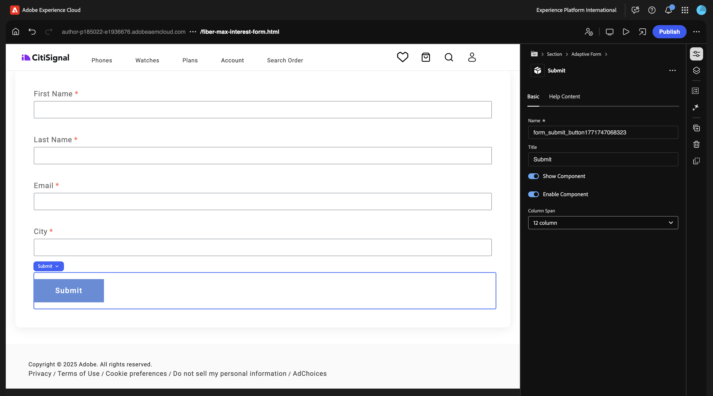
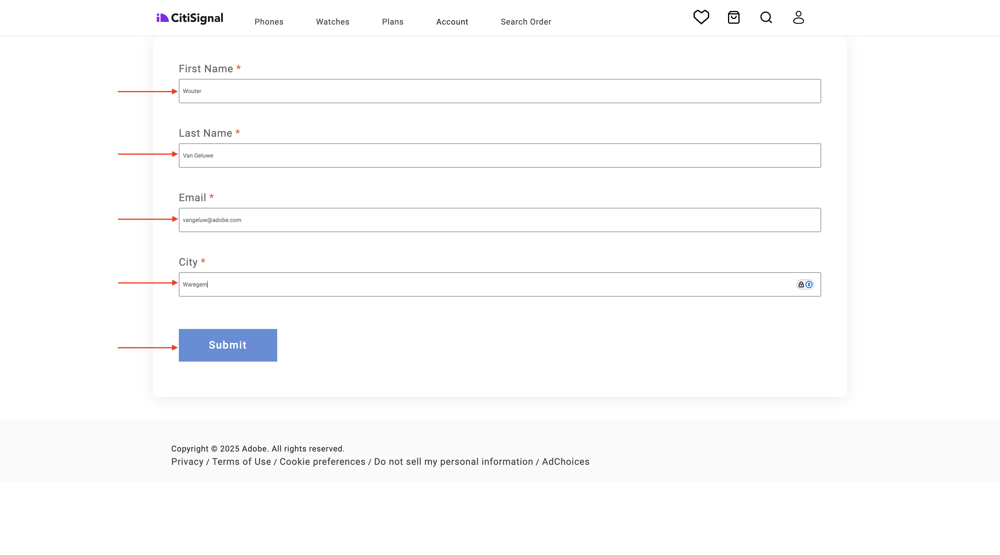

# 1.3.1 첫 번째 양식 만들기

>[!IMPORTANT]
>
>이 연습을 완료하려면 AEM Assets Dynamic Media가 활성화된 작동 중인 AEM Assets CS 작성 환경에 액세스할 수 있어야 합니다.
>
>환경이 없는 경우 [Adobe Experience Manager Cloud Service 및 Edge Delivery Services](./../../../modules/asset-mgmt/module2.1/aemcs.md){target="_blank"}(으)로 이동하세요. 거기에 있는 지침을 따르십시오, 그러면 당신은 이러한 환경에 액세스 할 수 있습니다.

>[!IMPORTANT]
>
>이전에 AEM Assets CS 환경에서 AEM CS 프로그램을 구성한 경우 AEM CS 샌드박스가 최대 절전 모드일 수 있습니다. 이러한 샌드박스의 최대 절전 모드 해제 시간이 10~15분 정도 걸리는 점을 감안할 때, 나중에 최대 절전 모드 해제 프로세스를 기다릴 필요가 없도록 지금 시작하는 것이 좋습니다.

## Edge Delivery Services에서 AEM Forms을 사용하기 위한 1.3.1.1 환경 요구 사항

첫 번째 양식을 구성하기 전에 아래 단계를 수행하기 전에 충족해야 하는 여러 요구 사항이 있습니다.

### 프로그램 설정

Cloud Manager 프로그램의 **솔루션 및 추가 기능**&#x200B;에서 **Forms**&#x200B;을(를) 활성화해야 합니다.


### 블록

Github 저장소에서 다음 블록을 사용할 수 있어야 합니다.

- **양식**
- **embed-adaptive-form**


### 스크립트

Github 저장소에서 다음 스크립트를 사용할 수 있어야 합니다.

- **form-editor-support.css**
- **form-editor-support.js**


또한 **editor-support.js** 파일에서 유니버설 편집기에서 양식 편집을 활성화하려면 다음 변경 작업을 수행해야 합니다.

- 함수 선언을 **function attachEventListners(main)**&#x200B;에서 **async function attachEventListners(main)**(으)로 변경합니다.
- 152행과 153행을 추가합니다.

```
const module = await import('./form-editor-support.js');
module.attachEventListners(main);
```


또한 **editor-support.js** 파일에서 다음과 같이 90-92줄을 변경합니다.

```
if (block.dataset.aueModel === 'form') {
        return true;
      } else if (newBlock) {
```


### paths.json

특히 **paths.json** 파일에서 Github 저장소 구성을 확인하십시오. 다음 줄은 파일에 있어야 합니다.

- 매핑에서: **&quot;/content/forms/af/:/forms/&quot;**
- 포함 내용: **&quot;/content/forms/af/&quot;**

```json
{
  "mappings": [
    "/content/CitiSignal/:/",
    "/content/CitiSignal/configuration:/.helix/config.json",
    "/content/CitiSignal/headers:/.helix/headers.json",
    "/content/CitiSignal/metadata:/metadata.json",
    "/content/CitiSignal.resource/enrichment/enrichment.json:/enrichment/enrichment.json",
    "/content/forms/af/:/forms/"
  ],
  "includes": [
    "/content/CitiSignal/",
    "/content/forms/af/"
  ]
}
```


이러한 요구 사항을 충족하면 첫 번째 양식을 만들 수 있습니다.

## 1.3.1.2 양식 만들기

[https://my.cloudmanager.adobe.com](https://my.cloudmanager.adobe.com){target="_blank"}(으)로 이동합니다. 선택해야 하는 조직은 `--aepImsOrgName--`입니다. 환경을 엽니다.


**Forms**(으)로 이동합니다.


**Forms 및 문서**(으)로 이동합니다.


**만들기**&#x200B;를 클릭한 다음 **적응형 양식**&#x200B;을 선택합니다.


**Edge Delivery Services**&#x200B;을(를) 선택한 다음 **빈 페이지**&#x200B;을(를) 선택하십시오. **만들기**&#x200B;를 클릭합니다.


그럼 이걸 보셔야죠 다음 필드를 채웁니다.

- **제목**: `Fiber Max Interest Form`
- **이름**: **제목** 필드를 기반으로 자동으로 채워야 합니다.
- **Github URL**: 웹 사이트에 연결된 Github 리포지토리의 경로를 제공합니다

**만들기**&#x200B;를 클릭합니다.


**만들기**&#x200B;를 클릭하면 **유니버설 편집기**&#x200B;가 자동으로 열리고 다음과 같은 메시지가 표시됩니다. 아이콘을 클릭하여 **콘텐츠 트리**&#x200B;를 엽니다.


**콘텐츠 트리**&#x200B;에서 개체 **적응형 양식**&#x200B;을(를) 선택하십시오.


그런 다음 **+** 아이콘을 클릭하여 새 요소를 추가하고 **텍스트 입력**&#x200B;을 선택합니다.


**콘텐츠 트리**&#x200B;에서 **텍스트 입력** 필드를 선택합니다.


**기본** 보기로 이동합니다. 이걸 보셔야죠

다음 필드를 채웁니다.

- **이름**: `first-name`
- **제목**: `First Name`

그런 다음 **유효성 검사**(으)로 이동합니다.


스위치를 뒤집어 이 필드를 필수 필드로 만듭니다. 다음 필드를 채웁니다.

- **오류 메시지**: `Enter your first name`
- **패턴**: `[A-Za-z][A-Za-z ]+`
- **패턴 오류 메시지**: `Letters only!`


**콘텐츠 트리**&#x200B;에서 필드 **적응형 양식**&#x200B;을(를) 선택하십시오. **+** 아이콘을 클릭한 다음 **텍스트 입력**&#x200B;을 선택합니다.


**콘텐츠 트리**&#x200B;에서 새로 만든 필드 **텍스트 입력**&#x200B;을(를) 선택하십시오. **속성**(으)로 이동합니다.


**기본** 보기로 이동합니다. 이걸 보셔야죠

다음 필드를 채웁니다.

- **이름**: `last-name`
- **제목**: `Last Name`

그런 다음 **유효성 검사**(으)로 이동합니다.


스위치를 뒤집어 이 필드를 필수 필드로 만듭니다. 다음 필드를 채웁니다.

- **오류 메시지**: `Enter your last name`
- **패턴**: `[A-Za-z][A-Za-z ]+`
- **패턴 오류 메시지**: `Letters only!`


**콘텐츠 트리**&#x200B;에서 필드 **적응형 양식**&#x200B;을(를) 선택하십시오. **+** 아이콘을 클릭한 다음 **텍스트 입력**&#x200B;을 선택합니다.


**콘텐츠 트리**&#x200B;에서 새로 만든 필드 **텍스트 입력**&#x200B;을(를) 선택하십시오. **속성**(으)로 이동합니다.


**기본** 보기로 이동합니다. 이걸 보셔야죠

다음 필드를 채웁니다.

- **이름**: `email`
- **제목**: `Email`

그런 다음 **유효성 검사**(으)로 이동합니다.


스위치를 뒤집어 이 필드를 필수 필드로 만듭니다. 다음 필드를 채웁니다.

- **오류 메시지**: `Enter your email address`
- **패턴**: `^[^@]+@[^@]+\.[^@]+$`
- **패턴 오류 메시지**: `Please verify your email address!`


**콘텐츠 트리**&#x200B;에서 필드 **적응형 양식**&#x200B;을(를) 선택하십시오. **+** 아이콘을 클릭한 다음 **텍스트 입력**&#x200B;을 선택합니다.


**콘텐츠 트리**&#x200B;에서 새로 만든 필드 **텍스트 입력**&#x200B;을(를) 선택하십시오.


**기본** 보기로 이동합니다. 이걸 보셔야죠

다음 필드를 채웁니다.

- **이름**: `city`
- **제목**: `city`

그런 다음 **유효성 검사**(으)로 이동합니다.


스위치를 뒤집어 이 필드를 필수 필드로 만듭니다. 다음 필드를 채웁니다.

- **오류 메시지**: `Enter your city`
- **패턴**: `[A-Za-z][A-Za-z ]+`
- **패턴 오류 메시지**: `Letters only!`


**게시**&#x200B;를 클릭합니다.


**게시**&#x200B;를 다시 클릭합니다.


을(를) 클릭하여 양식을 엽니다.


그러면 신청서를 작성은 가능한데, 아직 제출은 안 되십니다.


양식을 게시한 후 이제 다음과 같은 모습의 Edge Delivery Services 도메인에서도 사용할 수 있습니다.

`https://main--techinsidersXX-citisignal-aem-accs--woutervangeluwe.aem.page/forms/fiber-max-interest-form`


## 1.3.1.3 양식 제출

양식을 제출하려면 다음 두 가지 사항이 필요합니다.

- **제출** 단추
- **제출** 작업

또한 이 연습에서는 Google 스프레드시트를 사용하여 이 양식의 제출을 기록해야 합니다.

### Google 스프레드시트

[https://drive.google.com](https://drive.google.com)&#x200B;(으)로 이동하여 새 스프레드시트를 만듭니다.


파일 이름을 `citisignal-fiber-max-interest`로 지정합니다.

1행의 A-B-C-D 셀에 다음 필드 이름을 입력합니다.

- 이름
- 성
- 이메일
- 도시

그런 다음 **공유**&#x200B;를 클릭합니다.


**편집기** 수준의 액세스 권한이 있는 **forms@adobe.com**&#x200B;과(와) 파일을 공유합니다.

그런 다음 **링크 복사**&#x200B;를 클릭합니다.

**보내기**&#x200B;를 클릭합니다.


다음 단계에서는 복사한 링크를 사용해야 합니다.

### 전송 단추

**제출** 단추를 구성하려면 **콘텐츠 트리**(으)로 이동하여 **적응형 양식**&#x200B;을 선택하고 **+** 아이콘을 클릭한 다음 **제출**&#x200B;을 선택합니다.


그럼 이걸 보셔야죠



### 제출 액션

제출 액션은 유니버설 편집기용 확장의 일부입니다.

>[!NOTE]
>
>**양식 속성 편집** 아이콘이 보이지 않는 경우 이 확장은 사용 중인 환경에 대해 아직 활성화되지 않았습니다. 이 확장을 사용하려면 [https://experience.adobe.com/#/aem/extension-manager](https://experience.adobe.com/#/aem/extension-manager)&#x200B;(으)로 이동하여 **양식 속성 편집** 확장을 활성화하십시오.
>
>

**양식 속성 편집** 아이콘을 클릭합니다.


**스프레드시트로 제출**&#x200B;을 선택합니다. 이전에 만든 Google 시트의 URL을 붙여 넣습니다.

**저장 및 닫기**&#x200B;를 클릭합니다.


>[!NOTE]
>
>오류 401 - 승인되지 않음 이 표시되면 그렇지 않을 수 있습니다. 왜냐면 환경이 Google Sheets에서 작동하도록 활성화되지 않았기 때문입니다. Adobe 담당자에게 문의하여 환경을 활성화하십시오.

**게시**&#x200B;를 클릭합니다.


**게시**&#x200B;를 다시 클릭합니다.


그런 다음 사이트를 새로 고치고 양식을 작성한 다음 **제출**&#x200B;을 클릭할 수 있습니다.



그런 다음 제출이 성공해야 합니다.


그런 다음 Google 시트를 보면 여기에서 성공한 제출도 표시됩니다.


이제 이 연습을 성공적으로 완료했습니다.

## 다음 단계

[Edge Delivery Services이 있는 Adobe Experience Manager Forms](./aemforms.md){target="_blank"}(으)로 돌아가기

[모든 모듈로 돌아가기](./../../../overview.md){target="_blank"}
