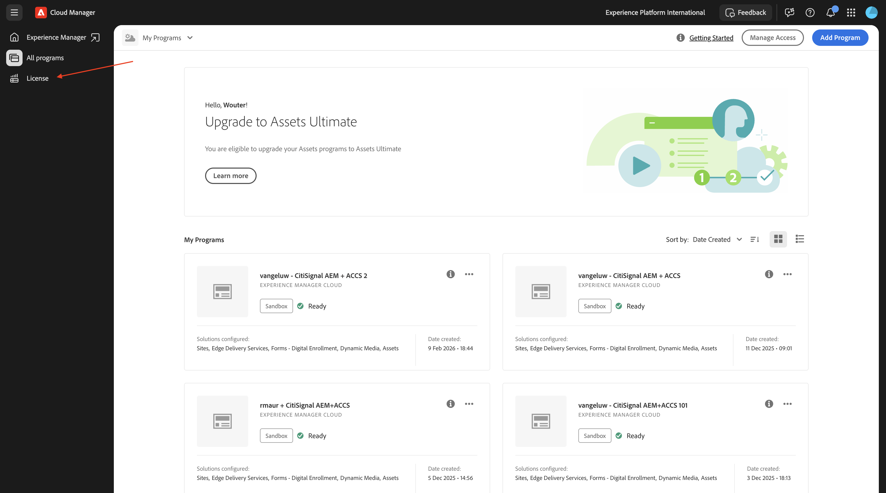
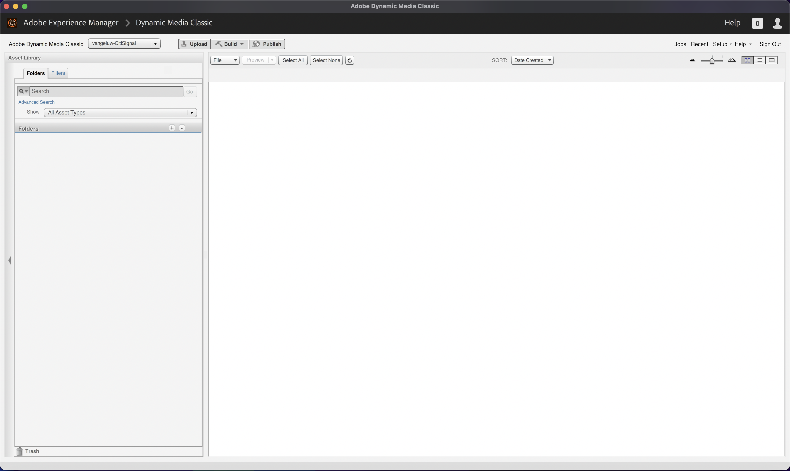
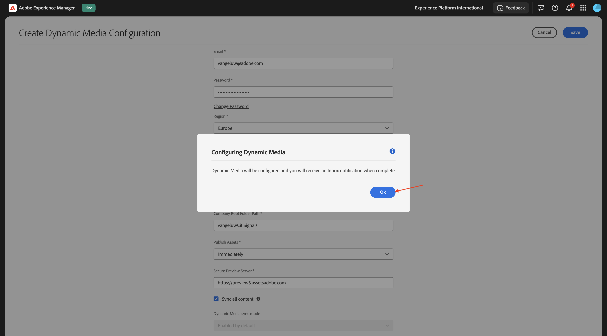
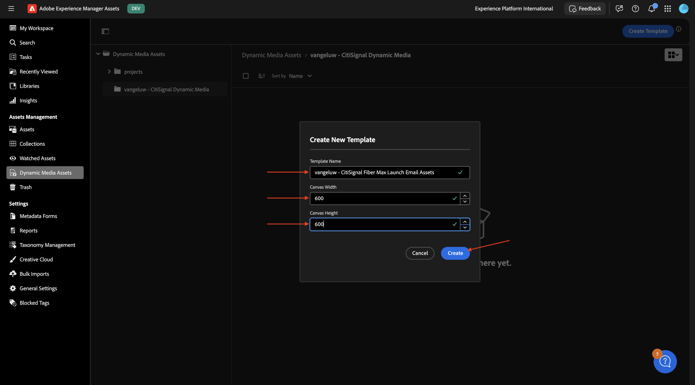
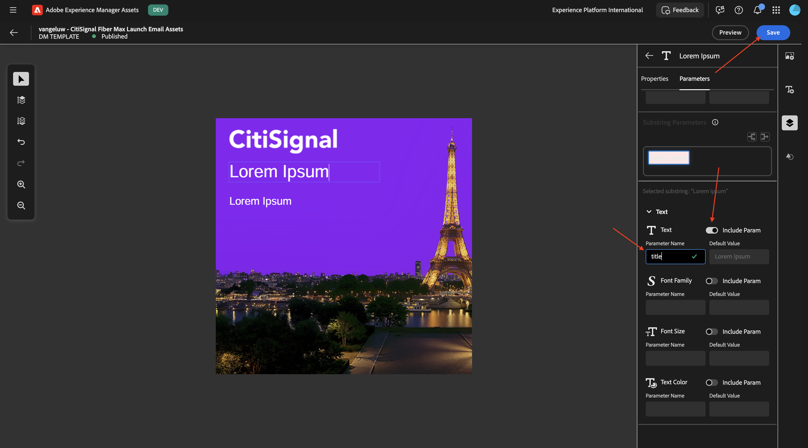
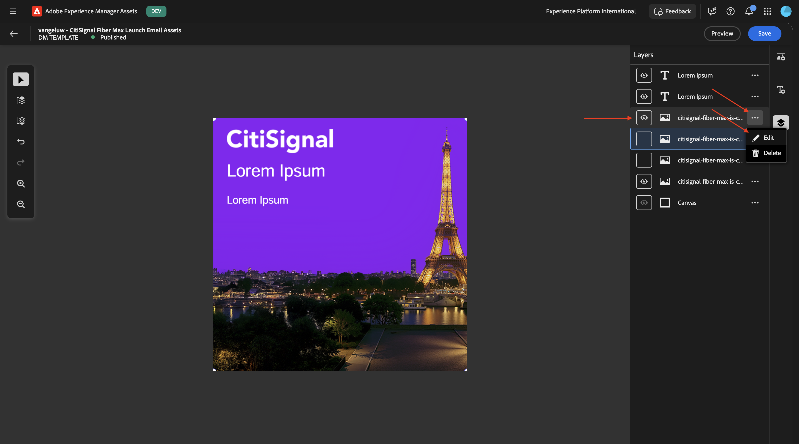
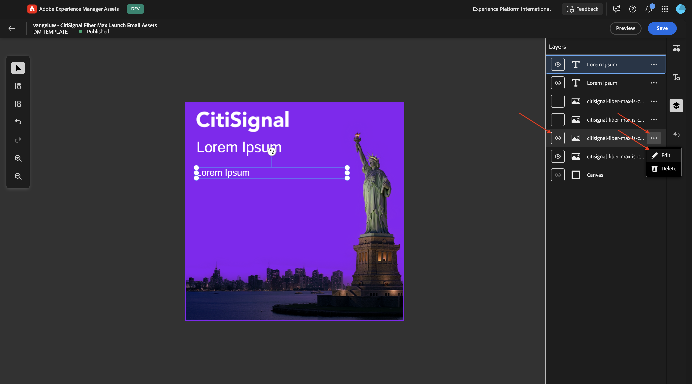
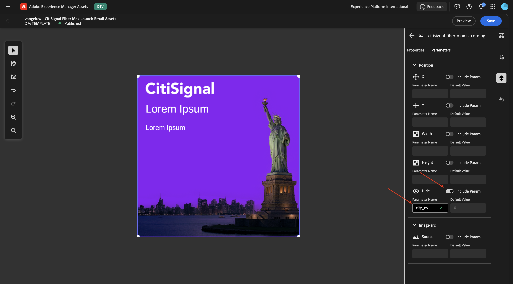
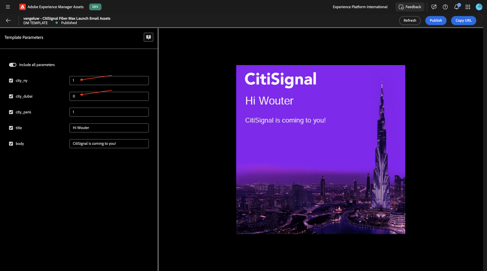
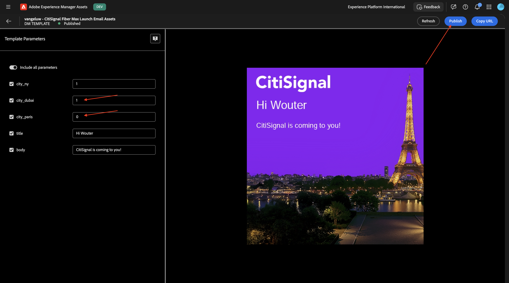

# 1.4.1 에셋 및 Dynamic Media 템플릿 만들기

>[!IMPORTANT]
>
>이 연습을 완료하려면 AEM Assets Dynamic Media가 활성화된 작동 중인 AEM Assets CS 작성 환경에 액세스할 수 있어야 합니다.
>
>환경이 없는 경우 [Adobe Experience Manager Cloud Service 및 Edge Delivery Services](./../../../modules/asset-mgmt/module2.1/aemcs.md){target="_blank"}(으)로 이동하세요. 거기에 있는 지침을 따르십시오, 그러면 당신은 이러한 환경에 액세스 할 수 있습니다.

>[!IMPORTANT]
>
>이전에 AEM Assets CS 환경에서 AEM CS 프로그램을 구성한 경우 AEM CS 샌드박스가 최대 절전 모드일 수 있습니다. 이러한 샌드박스의 최대 절전 모드 해제 시간이 10~15분 정도 걸리는 점을 감안할 때, 나중에 최대 절전 모드 해제 프로세스를 기다릴 필요가 없도록 지금 시작하는 것이 좋습니다.

## 1.4.1.1 Dynamic Media 회사 만들기

[https://my.cloudmanager.adobe.com](https://my.cloudmanager.adobe.com){target="_blank"}(으)로 이동합니다. 선택해야 하는 조직은 `--aepImsOrgName--`입니다.

**Dynamic Media 회사**(으)로 스크롤합니다. 새 Dynamic Media 회사를 만들려면 **+** 아이콘을 클릭하십시오.

다음 정보를 입력합니다.

- **회사 이름**: `--aepUserLdap---CitiSignal`.
- **회사 지역**: 가장 가까운 지역을 선택하십시오.
- **회사 관리자 전자 메일**: 관리자 전자 메일을 입력합니다.

**만들기**&#x200B;를 클릭합니다.

그럼 이걸 보셔야죠

이제 아래 이메일과 같이 임시 암호가 포함된 이메일을 받게 됩니다. 암호를 변경하거나 메일을 받지 못한 경우 암호를 검색하려면 **Adobe Dynamic Media Classic 데스크톱 앱**&#x200B;을 설치해야 합니다. 설치 지침은 [https://experienceleague.adobe.com/en/docs/dynamic-media-classic/using/intro/dynamic-media-classic-desktop-app](https://experienceleague.adobe.com/en/docs/dynamic-media-classic/using/intro/dynamic-media-classic-desktop-app)에서 확인할 수 있습니다.

지침을 따르고, 앱이 시스템에 설치되면 여기로 돌아오십시오.

**Adobe Dynamic Media Classic 데스크톱 앱**&#x200B;을 엽니다. 암호를 알고 있는 경우 여기에 암호를 입력하고 지침에 따라 처음 로그인할 때 암호를 변경하십시오.

암호를 모르는 경우 **암호를 잊으셨습니까?** 링크를 클릭하고 지침에 따라 암호를 재설정한 다음 여기로 돌아와서 로그인하십시오.

로그인에 성공하면 다음과 유사한 화면이 표시됩니다.

## 1.4.1.2 AEM에서 Dynamic Media 구성

[https://my.cloudmanager.adobe.com](https://my.cloudmanager.adobe.com){target="_blank"}(으)로 이동합니다. 선택해야 하는 조직은 `--aepImsOrgName--`입니다.

Cloud Manager 프로그램(`--aepUserLdap-- - CitiSignal AEM+ACCS`)을 열려면 클릭하세요.

환경을 클릭합니다.

환경의 URL을 클릭합니다.

**도구**, **클라우드 서비스**, **Dynamic Media 구성**(으)로 이동합니다.

**전역**(확인란을 선택하지 않음)을 선택한 다음 **만들기**&#x200B;를 클릭합니다.

다음 정보를 입력합니다.

- **제목**: 이 제목: `--aepUserLdap-- - CitiSignal`을(를) 사용합니다.
- **전자 메일**: 전자 메일 주소를 입력하세요.
- **암호**: Dynamic Media 계정 암호를 입력하십시오.
- **지역**: Dynamic Media 회사를 만들 때 선택한 지역을 선택합니다. 이 예제에서는 **유럽**&#x200B;입니다.

**Dynamic Media에 연결**&#x200B;을 클릭합니다.

그럼 이걸 보셔야죠 다음을 구성합니다.

- **회사**: `--aepUserLdap-- - CitiSignal`을(를) 선택하십시오.
- **Assets 게시**&#x200B;를 **즉시**(으)로 설정합니다.
- **모든 콘텐츠 동기화**&#x200B;에 대한 확인란을 선택하십시오.

**저장**&#x200B;을 클릭합니다.

이제 DYNAMIC Media 구성이 완료되었습니다. **확인**&#x200B;을 클릭합니다.

## 1.4.1.3 자산 내보내기

[citisignal-fiber-max-is-coming.psd](./assets/citisignal-fiber-max-is-coming.psd){target="_blank"} 파일을 다운로드하고 Adobe Photoshop으로 엽니다.

그럼 이걸 보셔야죠 CitiSignal은 뉴욕, 파리, 두바이 등 3개 도시에서 Fibre Max의 롤아웃을 계획하고 있습니다.

특정 레이어를 표시하거나 숨기면 디자이너가 만든 이미지를 볼 수 있습니다.

다음은 Photoshop PSD 템플릿에서 이미지 파일을 내보내는 지침입니다. 원하는 경우 완료된 이미지를 [citisignal-dm-email-assets.zip](./assets/citisignal-dm-email-assets.zip){target="_blank"}에서 다운로드하고 바탕 화면에 파일의 압축을 풀 수도 있습니다.

이것은 뉴욕 버전입니다.

이것은 두바이의 버전입니다.

이것이 파리버전입니다.

앞으로 CitiSignal에서 Fibre Max를 롤아웃할 다른 도시도 많이 있을 것이므로 이 파일에 새로운 계층이 생성될 수 있습니다. 현재로서는 이미 언급한 3개 도시에 초점을 맞추고 있다.

이러한 변형을 AEM Assets Dynamic Media와 함께 사용하려면 각 도시의 레이어를 이미지로 내보내야 합니다. 이렇게 하려면 **파일** > **내보내기** > **레이어를 파일로 이동...**.

그럼 이런 걸 보셔야겠네요 파일을 내보낼 위치를 선택하고 **PNG-8** 파일 형식을 선택한 다음 **실행**&#x200B;을 클릭합니다.

몇 초 후에 이 메시지가 표시됩니다. **확인**&#x200B;을 클릭합니다.

그런 다음 선택한 내보내기 위치에서 이러한 파일을 사용할 수 있습니다.

## 1.4.1.4 AEM Assets CS에 에셋 업로드

[https://experience.adobe.com/](https://experience.adobe.com/){target="_blank"}(으)로 이동합니다. **Experience Manager Assets**(으)로 이동합니다.

`--aepUserLdap-- - CitiSignal AEM + ACCS`(으)로 지정해야 하는 리포지토리를 선택하십시오.

**Assets**(으)로 이동한 다음 **폴더 만들기**&#x200B;를 클릭합니다.

폴더의 경우 `--aepUserLdap-- - CitiSignal Dynamic Media` 이름을 사용하십시오. **만들기**&#x200B;를 클릭합니다.

방금 만든 폴더를 두 번 클릭하여 엽니다.

**Assets 추가**&#x200B;를 클릭합니다.

**찾아보기**&#x200B;를 클릭한 다음 **파일 찾아보기**&#x200B;를 선택합니다.

이전 단계에서 내보낸 4개의 PNG 파일을 선택합니다.

**업로드**&#x200B;를 클릭합니다.

이제 AEM Assets CS에서 이미지를 사용할 수 있습니다.

몇 분 정도 기다린 후 **Adobe Dynamic Media Classic 데스크톱 앱**&#x200B;을 여세요. 이제 Dynamic Media에서 업로드된 이미지를 사용할 수도 있습니다.

## 1.4.1.5 Dynamic Media 템플릿 구성

왼쪽 메뉴에서 **Dynamic Media Assets**(으)로 이동합니다. `--aepUserLdap-- - CitiSignal Dynamic Media` 폴더를 열려면 클릭하세요. 그런 다음 **템플릿 만들기**&#x200B;를 클릭합니다.

다음 정보를 입력합니다.

- **템플릿 이름**: `--aepUserLdap-- - CitiSignal Fiber Max Launch Email Assets`
- **캔버스 너비**: `600px`
- **캔버스 높이**: `600px`

**만들기**&#x200B;를 클릭합니다.

그럼 이걸 보셔야죠 **이미지 추가** 아이콘을 클릭합니다.

**citisignal-fiber-max-is-coming_citisignal-background.png** 파일을 캔버스로 드래그하여 캔버스에 맞춥니다.

그런 다음 **citisignal-fiber-max-is-coming_citisignal-newyork.png** 파일을 캔버스로 드래그하여 캔버스에 맞춥니다.

그런 다음 **citisignal-fiber-max-is-coming_citisignal-dubai.png** 파일을 캔버스로 드래그하여 캔버스에 맞춥니다.

그런 다음 **citisignal-fiber-max-is-coming_citisignal-paris.png** 파일을 캔버스로 드래그하여 캔버스에 맞춥니다.

이제 템플릿에 3개의 변형이 모두 서로 다른 레이어로 동시에 제공됩니다. **레이어** 아이콘을 클릭하여 특정 레이어를 표시하거나 숨길 수 있습니다. 이 아이콘을 클릭하면 현재 모든 레이어가 표시됩니다.

레이어 두 개를 숨기면 이미지의 모양을 제어할 수 있습니다. 이 예제에서는 **Paris**&#x200B;에 대한 레이어와 배경 레이어만 표시됩니다.

그런 다음 텍스트 레이어를 추가해야 합니다. **텍스트 레이어** 아이콘을 클릭합니다.

그럼 이걸 보셔야죠

여기 예를 들어 텍스트 필드를 맞춤형으로 자유롭게 조정할 수 있습니다. **스마트 텍스트 크기 조정** 옵션을 활성화하여 이후 단계에서 삽입한 실제 텍스트가 제대로 표시되도록 하는 것을 잊지 마십시오.

두 번째 텍스트 레이어를 추가하여 다음과 같이 만듭니다. **스마트 텍스트 크기 조정** 옵션을 활성화하여 이후 단계에서 삽입한 실제 텍스트가 제대로 표시되도록 하는 것을 잊지 마십시오.

첫 번째 텍스트 레이어를 선택합니다. 세 점 **..**&#x200B;을(를) 클릭한 다음 **편집**&#x200B;을(를) 선택합니다.

그럼 이걸 보셔야죠 아래로 스크롤합니다.

**Text** 필드를 활성화하려면 **switcher** 아이콘을 클릭하십시오. **매개 변수 이름**&#x200B;을(를) `title`(으)로 변경합니다.

두 번째 텍스트 레이어를 선택합니다. 세 점 **..**&#x200B;을(를) 클릭한 다음 **편집**&#x200B;을(를) 선택합니다.

그럼 이걸 보셔야죠 아래로 스크롤합니다.

**Text** 필드를 활성화하려면 **switcher** 아이콘을 클릭하십시오. **매개 변수 이름**&#x200B;을(를) `body`(으)로 변경합니다.

**파리**&#x200B;에 대한 레이어를 선택하세요. 세 점 **..**&#x200B;을(를) 클릭하고 **편집**&#x200B;을(를) 클릭합니다.

**매개 변수**(으)로 이동합니다. 필드 **숨기기**&#x200B;를 사용하도록 설정하고 **매개 변수 이름**: `city_paris`을(를) 입력하십시오. **저장**&#x200B;을 클릭합니다.

**Dubai**&#x200B;에 대한 레이어를 선택하십시오. 세 점 **..**&#x200B;을(를) 클릭하고 **편집**&#x200B;을(를) 클릭합니다.

**매개 변수**(으)로 이동합니다. 필드 **숨기기**&#x200B;를 사용하도록 설정하고 **매개 변수 이름**: `city_dubai`을(를) 입력하십시오. **저장**&#x200B;을 클릭합니다.

**New York**&#x200B;의 레이어를 선택하세요. 세 점 **..**&#x200B;을(를) 클릭하고 **편집**&#x200B;을(를) 클릭합니다.

**매개 변수**(으)로 이동합니다. 필드 **숨기기**&#x200B;를 사용하도록 설정하고 **매개 변수 이름**: `city_ny`을(를) 입력하십시오. **저장**&#x200B;을 클릭합니다.

**미리 보기**&#x200B;를 클릭합니다.

**모든 매개 변수를 포함**&#x200B;하기 위해 전환기를 활성화하고 스크린샷에 표시된 대로 일부 입력 변수를 변경합니다. 제공된 입력에 따라 이미지가 동적으로 변경되는 것을 보아야 합니다. 필드 **city_paris**, **city_dubai** 및 **city_ny**&#x200B;의 경우 값이 0이면 이 이미지가 숨겨지지 않으며 값이 1이면 이 이미지가 숨겨집니다.

이제 일부 변수를 변경하면 다른 이미지가 표시됩니다.

이제 변수를 더 변경하여 다른 이미지가 표시됩니다.

이제 Dynamic Media 템플릿이 성공적으로 구성되었습니다. 다음 연습에서는 해당 템플릿을 Adobe Journey Optimizer의 이메일 캠페인과 함께 사용합니다.

## 다음 단계

다음 단계: [Adobe Journey Optimizer에서 Dynamic Media 템플릿 사용](./ex2.md){target="_blank"}

[Adobe Experience Manager Assets 및 Dynamic Media](./aemassetsdm.md){target="_blank"}(으)로 돌아가기

[모든 모듈로 돌아가기](./../../../overview.md){target="_blank"}
