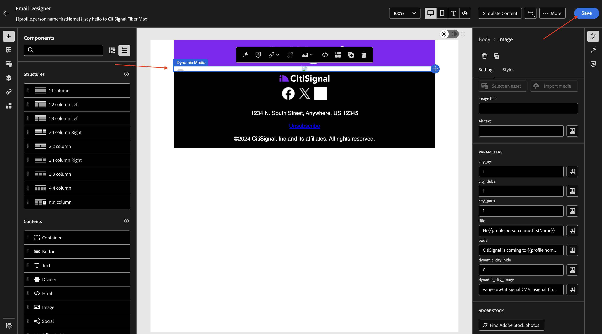
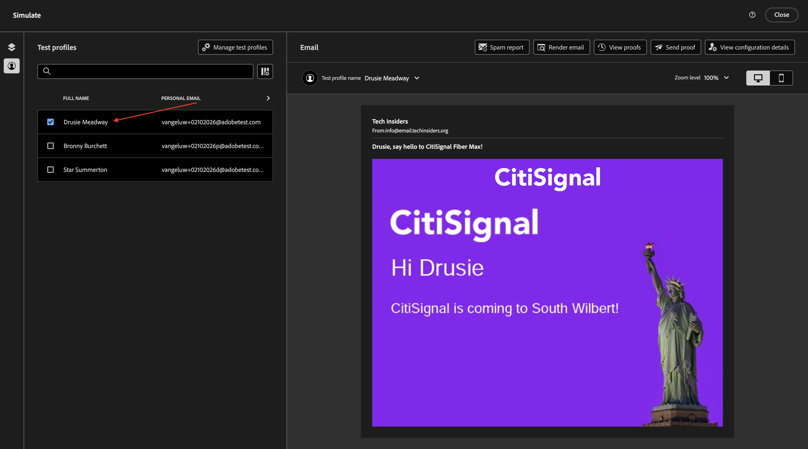
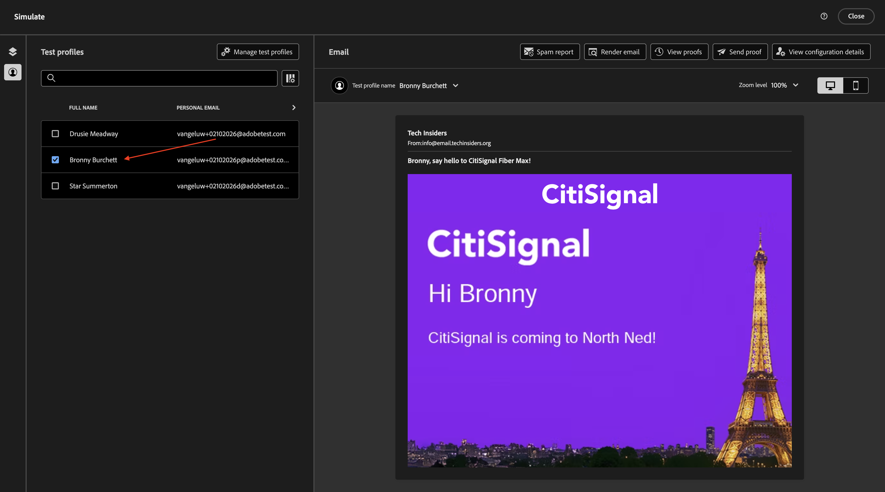

# 1.4.2 Adobe Journey Optimizer에서 Dynamic Media 템플릿 사용

## 1.4.2.1 Adobe Journey Optimizer에서 캠페인 만들기

[Adobe Journey Optimizer](https://experience.adobe.com)&#x200B;(으)로 이동하여 Adobe Experience Cloud에 로그인합니다. **Journey Optimizer**&#x200B;을(를) 클릭합니다.


Journey Optimizer의 **Home** 보기로 리디렉션됩니다. 먼저 올바른 샌드박스를 사용하고 있는지 확인하십시오. 사용할 샌드박스를 `--aepSandboxName--`이라고 합니다. 그러면 샌드박스 **의**&#x200B;홈`--aepSandboxName--` 보기에 있게 됩니다.


이제 캠페인을 만듭니다. 들어오는 경험 이벤트 또는 대상 항목 또는 종료에 의존하여 1개의 특정 고객에 대한 여정을 트리거하는 이전 연습의 이벤트 기반 여정과 달리, 캠페인은 뉴스레터, 일회성 프로모션 또는 일반 정보와 같은 고유한 콘텐츠나 생일 캠페인 및 미리 알림과 같이 정기적으로 전송되는 유사한 콘텐츠로 전체 대상을 한 번 타겟팅합니다.

메뉴에서 **캠페인**(으)로 이동하여 **캠페인 만들기**&#x200B;를 클릭합니다.


**예약됨 - 마케팅**&#x200B;을 선택하고 **만들기**&#x200B;를 클릭합니다.


캠페인 생성 화면에서 다음을 구성합니다.

- **이름**: `--aepUserLdap-- - CitiSignal Fiber Max DM Email Campaign`.

**작업**&#x200B;을 클릭합니다.


**+ 작업 추가**&#x200B;를 클릭한 다음 **전자 메일**&#x200B;을 선택합니다.


기존 **전자 메일 구성**&#x200B;을 선택한 다음 **콘텐츠 편집**&#x200B;을 클릭하세요.


그러면 이걸 보게 될 거야. **제목 줄**&#x200B;에 대해 다음 항목을 사용하십시오.

```
{{profile.person.name.firstName}}, say hello to CitiSignal Fiber Max!
```

**콘텐츠 편집**&#x200B;을 클릭합니다.


**처음부터 디자인**&#x200B;을 선택하십시오.


그럼 이걸 보셔야죠


2x **1:1 열**&#x200B;을(를) 캔버스에 추가합니다.


**조각**(으)로 이동하고 **헤더** 조각을 첫 번째 1:1 열로 드래그한 다음 **바닥글** 조각을 두 번째 1:1 열로 드래그합니다.


2개의 조각 사이에 새 1:1 열을 추가한 다음 해당 1 **열에**&#x200B;이미지:1를 추가하십시오. 그런 다음 **찾아보기**&#x200B;를 클릭합니다.


Dynamic Media 템플릿을 저장한 폴더로 이동합니다. Dynamic Media 템플릿을 선택한 다음 **선택**&#x200B;을 클릭합니다.


그럼 이걸 보셔야죠 너도 dynamic media 템플릿의 매개 변수를 변경할 수 있는 **PARAMETERS**&#x200B;을(를) 확인합니다.


## 1.4.2.2 Dynamic Media 템플릿 개인화

이전 연습에서 설명한 대로 이제 AJO은 Dynamic Media 템플릿의 일부가 되는 값을 동적으로 결정해야 합니다.

이전 연습의 **미리 보기** 단계와 마찬가지로 **city_paris**, **city_dubai** 및 **city_ny** 필드를 1로 설정해야 합니다. 즉, 이 이미지는 숨겨집니다.

필드 **title**&#x200B;에 대해 개인화 아이콘을 클릭합니다.


기본 텍스트를 `Hi {{profile.person.name.firstName}}`(으)로 바꿉니다. **저장**&#x200B;을 클릭합니다.


필드 **body**&#x200B;에 대해 개인화 아이콘을 클릭합니다.


기본 텍스트를 `CitiSignal is coming to {{profile.homeAddress.city}}!`(으)로 바꿉니다. **저장**&#x200B;을 클릭합니다.


필드 **`dynamic_city_hide`**&#x200B;이(가) 0으로 설정되어 있는지 확인하십시오. 필드 **`dynamic_city_image`**&#x200B;의 개인화 아이콘을 클릭합니다.


기본 텍스트를 `--aepUserLdap--CitiSignalDM/citisignal-fiber-max-is-coming_citisignal-{{profile._experienceplatform.individualCharacteristics.fiber_rollout.closest_rollout_city}}-1`(으)로 바꿉니다. **저장**&#x200B;을 클릭합니다.


그럼 이걸 보셔야죠 이미지가 여기에서 더 이상 렌더링되지 않습니다. 이메일 편집기의 컨텍스트에서 동적 변수를 사용할 수 없기 때문에 예상합니다.

**저장**&#x200B;을 클릭합니다.



구성을 테스트하고 **콘텐츠 시뮬레이션**&#x200B;을 클릭한 다음 **콘텐츠 시뮬레이션**&#x200B;을 선택합니다.


그럼 이런 걸 보셔야겠네요 사용 가능한 테스트 프로필이 없는 경우 **테스트 프로필 관리**&#x200B;로 이동하여 추가할 수 있습니다.

이 사용 사례를 테스트하는 데 필요한 데이터가 포함된 테스트 프로필을 사용할 수 있게 되면 한 프로필에서 다른 프로필로 전환하여 변경 사항이 동적으로 발생하는지 확인할 수 있습니다.

다음은 롤아웃 도시인 뉴욕과 연결된 프로필입니다.



다음은 롤아웃 도시 파리에 연결된 프로필입니다.



다음은 롤아웃 도시 두바이에 연결된 프로필입니다.

Click **Close**.


이제 이 연습을 완료했습니다. 이메일 캠페인을 게시할 필요가 없습니다.

## 다음 단계

[Adobe Experience Manager Assets 및 Dynamic Media](./aemassetsdm.md){target="_blank"}(으)로 돌아가기

[모든 모듈로 돌아가기](./../../../overview.md){target="_blank"}