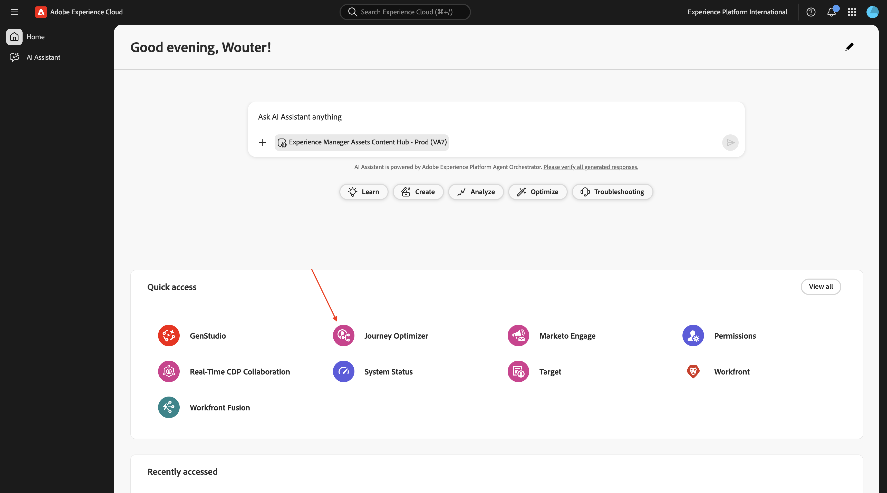
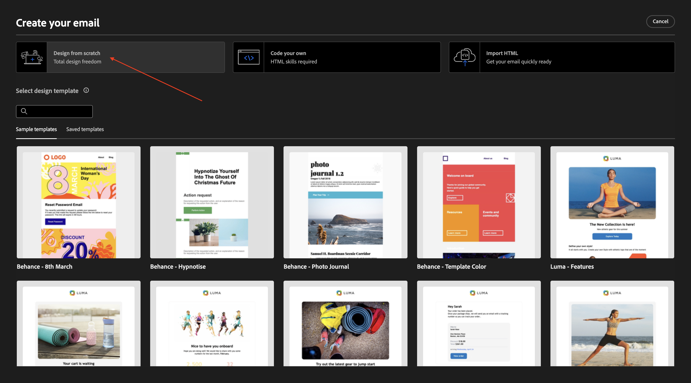
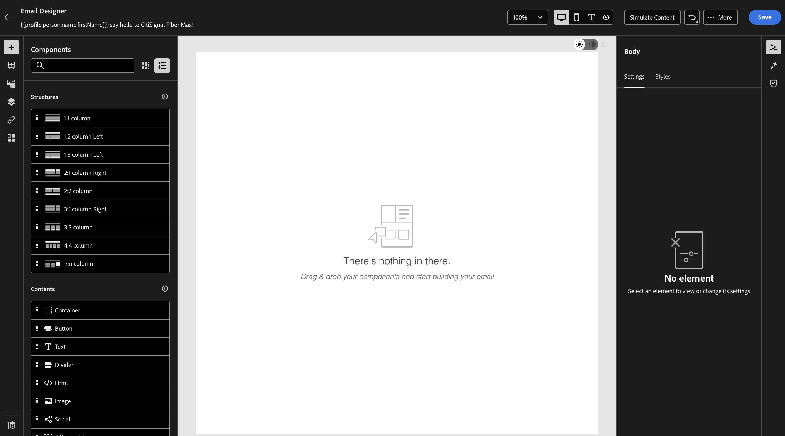
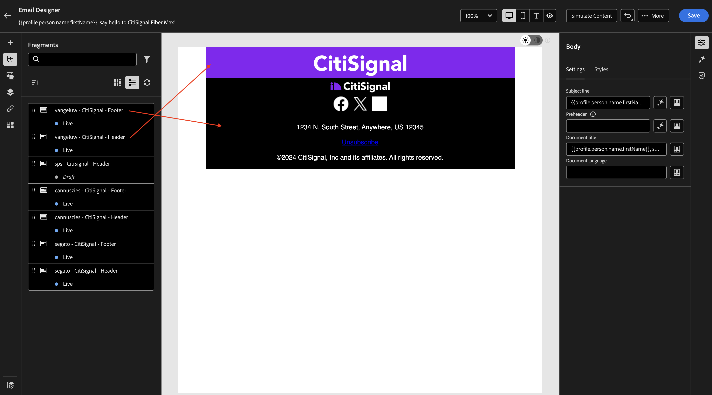

# 1.4.2 Adobe Journey Optimizer에서 Dynamic Media 템플릿 사용

## 1.4.2.1 Adobe Journey Optimizer에서 캠페인 만들기

[Adobe Journey Optimizer](https://experience.adobe.com)&#x200B;(으)로 이동하여 Adobe Experience Cloud에 로그인합니다. **Journey Optimizer**&#x200B;을(를) 클릭합니다.



Journey Optimizer의 **Home** 보기로 리디렉션됩니다. 먼저 올바른 샌드박스를 사용하고 있는지 확인하십시오. 사용할 샌드박스를 `--aepSandboxName--`이라고 합니다. 그러면 샌드박스 **의**&#x200B;홈`--aepSandboxName--` 보기에 있게 됩니다.


이제 캠페인을 만듭니다. 들어오는 경험 이벤트 또는 대상 항목 또는 종료에 의존하여 1개의 특정 고객에 대한 여정을 트리거하는 이전 연습의 이벤트 기반 여정과 달리, 캠페인은 뉴스레터, 일회성 프로모션 또는 일반 정보와 같은 고유한 콘텐츠나 생일 캠페인 및 미리 알림과 같이 정기적으로 전송되는 유사한 콘텐츠로 전체 대상을 한 번 타겟팅합니다.

메뉴에서 **캠페인**(으)로 이동하여 **캠페인 만들기**&#x200B;를 클릭합니다.


**예약됨 - 마케팅**&#x200B;을 선택하고 **만들기**&#x200B;를 클릭합니다.


캠페인 생성 화면에서 다음을 구성합니다.

- **이름**: `--aepUserLdap-- - CitiSignal Fiber Max DM Email Campaign`.

**작업**&#x200B;을 클릭합니다.


**+ 작업 추가**&#x200B;를 클릭한 다음 **전자 메일**&#x200B;을 선택합니다.


기존 **전자 메일 구성**&#x200B;을 선택한 다음 **콘텐츠 편집**&#x200B;을 클릭하세요.


그러면 이걸 보게 될 거야. **제목 줄**&#x200B;에 대해 다음 항목을 사용하십시오.

```
{{profile.person.name.firstName}}, say hello to CitiSignal Fiber Max!
```

**콘텐츠 편집**&#x200B;을 클릭합니다.


**처음부터 디자인**&#x200B;을 선택하십시오.



그럼 이걸 보셔야죠



2x **1:1 열**&#x200B;을(를) 캔버스에 추가합니다.


**조각**(으)로 이동하고 **헤더** 조각을 첫 번째 1:1 열로 드래그한 다음 **바닥글** 조각을 두 번째 1:1 열로 드래그합니다.



2개의 조각 사이에 새 1:1 열을 추가한 다음 해당 1 **열에**&#x200B;이미지:1를 추가하십시오. 그런 다음 **찾아보기**&#x200B;를 클릭합니다.


Dynamic Media 템플릿을 저장한 폴더로 이동합니다. Dynamic Media 템플릿을 선택한 다음 **선택**&#x200B;을 클릭합니다.


그럼 이걸 보셔야죠


## 다음 단계

[Adobe Experience Manager Assets 및 Dynamic Media](./aemassetsdm.md){target="_blank"}(으)로 돌아가기

[모든 모듈로 돌아가기](./../../../overview.md){target="_blank"}
