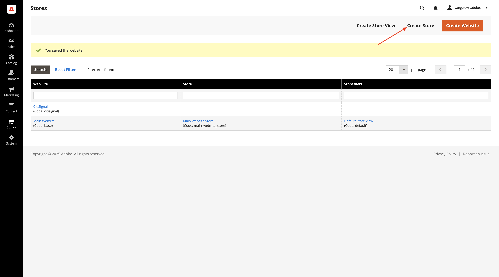
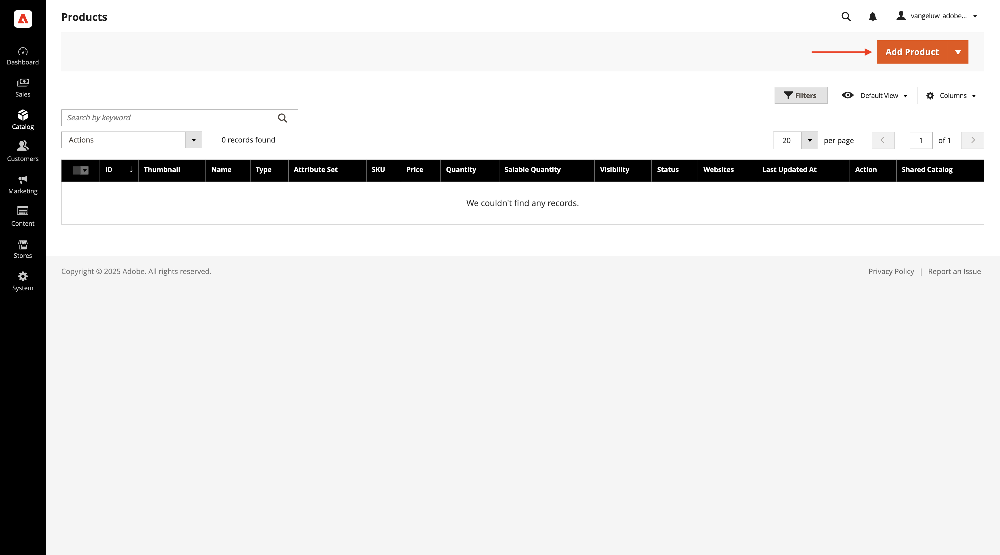
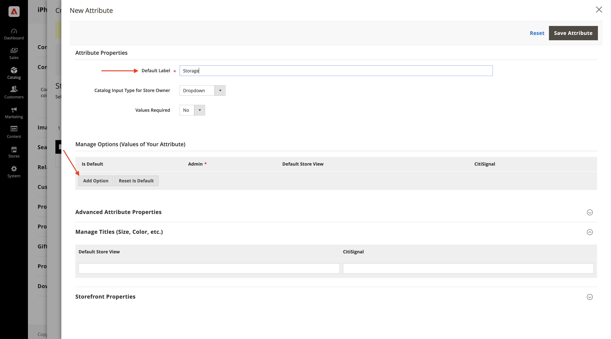
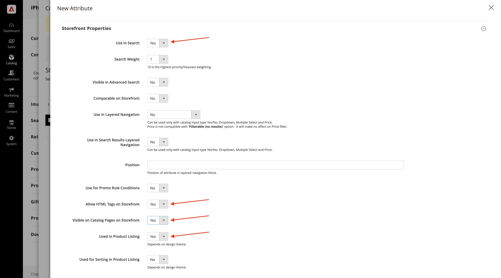

# 1.5.1 Adobe Commerce as a Cloud Service 시작하기

[https://experience.adobe.com/](https://experience.adobe.com/){target="_blank"}(으)로 이동합니다. 이름이 `--aepImsOrgName--`이어야 하는 올바른 환경에 있는지 확인하십시오. **Commerce**&#x200B;을(를) 클릭합니다.

## 1.5.1.1 ACCS 인스턴스 만들기

그럼 이걸 보셔야죠 **+ 인스턴스 추가**&#x200B;를 클릭합니다.

다음과 같이 필드를 채웁니다.

- **인스턴스 이름**: `--aepUserLdap-- - ACCS`
- **환경**: `Sandbox`
- **지역**: `North America`

**인스턴스 추가**&#x200B;를 클릭합니다.

현재 인스턴스를 만들고 있습니다. 5~10분 정도 소요될 수 있습니다.

인스턴스가 준비되면 인스턴스를 클릭하여 엽니다.

## 1.5.1.2 CitiSignal 스토어를 설정합니다.

그럼 이걸 보셔야죠 **Adobe ID으로 로그인**&#x200B;을 클릭한 다음 로그인합니다.

로그인하면 이 홈페이지가 표시됩니다. 첫 번째 단계는 Commerce에 CitiSignal 스토어를 설정하는 것입니다. **스토어**&#x200B;를 클릭합니다.

**모든 스토어**&#x200B;를 클릭합니다.

**웹 사이트 만들기**&#x200B;를 클릭합니다.

다음과 같이 필드를 채웁니다.

- **이름**: `CitiSignal`
- **코드**: `citisignal`

**웹 사이트 저장**&#x200B;을 클릭합니다.

그럼 다시 오셔야 합니다 **스토어 만들기**&#x200B;를 클릭합니다.

다음과 같이 필드를 채웁니다.

- **웹 사이트**: `CitiSignal`
- **이름**: `CitiSignal`
- **코드**: `citisignal`
- **루트 범주**: `Default Category`

**스토어 저장**&#x200B;을 클릭합니다.

그럼 다시 오셔야 합니다 **스토어 보기 만들기**&#x200B;를 클릭합니다.

다음과 같이 필드를 채웁니다.

- **스토어**: `CitiSignal`
- **이름**: `CitiSignal`
- **코드**: `citisignal`
- **상태**: `Enabled`

**스토어 보기 저장**&#x200B;을 클릭합니다.

그러면 이 메시지가 표시됩니다. **확인**&#x200B;을 클릭합니다.

그럼 다시 오셔야 합니다 **CitiSignal** 웹 사이트를 클릭하여 엽니다.

이 웹 사이트를 기본 웹 사이트로 설정하려면 확인란을 선택하십시오.

**웹 사이트 저장**&#x200B;을 클릭합니다.

그럼 다시 오셔야 합니다

## 1.5.1.3 범주 및 제품 구성

**카탈로그**(으)로 이동한 다음 **범주**&#x200B;을 선택합니다.

**기본 범주**&#x200B;을 선택한 다음 **하위 범주 추가**&#x200B;를 클릭합니다.

`Phones` 이름을 입력한 다음 **저장**&#x200B;을 클릭합니다.

**기본 범주**&#x200B;을 선택한 다음 **하위 범주 추가**&#x200B;를 다시 클릭합니다.

`Watches` 이름을 입력한 다음 **저장**&#x200B;을 클릭합니다.

그런 다음 2개의 카테고리를 만들어야 합니다.

그런 다음 **카탈로그**(으)로 이동한 다음 **제품**&#x200B;을 선택합니다.

그럼 이걸 보셔야죠 **제품 추가**&#x200B;를 클릭합니다.

다음과 같이 제품을 구성합니다.

- **제품 이름**: `iPhone Air`
- **SKU**: `iPhone-Air`
- **가격**: `999`
- **수량**: `10000`
- **범주**: `Phones` 선택

**저장**&#x200B;을 클릭합니다.

**구성**(으)로 스크롤한 다음 **구성 만들기**&#x200B;를 클릭합니다.

그럼 이걸 보셔야죠 **새 특성 만들기**&#x200B;를 클릭합니다.

**기본 레이블**&#x200B;을(를) `Storage`(으)로 설정한 다음 **옵션 관리**&#x200B;에서 **옵션 추가**&#x200B;를 클릭합니다.

3개 열 모두에서 이름 `256GB`을(를) 사용하여 첫 번째 옵션을 구성한 다음 **옵션 추가**&#x200B;를 다시 클릭합니다.

3개 열 모두에서 이름 `512GB`을(를) 사용하여 두 번째 옵션을 구성한 다음 **옵션 추가**&#x200B;를 다시 클릭합니다.

3개 열 모두에서 이름 `1TB`을(를) 사용하여 세 번째 옵션을 구성합니다.

**Storefront 속성**(으)로 스크롤합니다. 다음 옵션을 **예**(으)로 설정하십시오.

- **검색에 사용**
- **Storefront에서 HTML 태그 허용**
- **Storefront의 카탈로그 페이지에 표시**
- **제품 목록에 사용**

위로 스크롤하여 **특성 저장**&#x200B;을 클릭합니다.

그럼 이걸 보셔야죠 **color** 및 **storage**&#x200B;의 특성을 모두 선택하고 **다음**&#x200B;을 클릭합니다.

그럼 이걸 보셔야죠 이제 사용 가능한 색상 옵션을 추가해야 합니다. 이렇게 하려면 **새 값 만들기**&#x200B;를 클릭하세요.

값 `Sky-Blue`을(를) 입력하고 **새 값 만들기**&#x200B;를 클릭합니다.

값 `Light-Gold`을(를) 입력하고 **새 값 만들기**&#x200B;를 클릭합니다.

값 `Cloud-White`을(를) 입력하고 **새 값 만들기**&#x200B;를 클릭합니다.

값 `Space-Black`을(를) 입력하십시오. **모두 선택** 클릭

**저장소**&#x200B;에서 3개의 옵션을 모두 선택하고 **다음**&#x200B;을 클릭합니다.

기본 설정을 그대로 두고 **다음**&#x200B;을 클릭합니다.

그럼 이걸 보셔야죠 **제품 생성**&#x200B;을 클릭합니다.

각 제품의 **수량**&#x200B;을(를) `10000`(으)로 설정합니다. **저장**&#x200B;을 클릭합니다.

**웹 사이트의 제품**(으)로 스크롤한 다음 **CitiSignal**&#x200B;에 대한 확인란을 선택하십시오.

**저장**&#x200B;을 클릭합니다.

**확인**&#x200B;을 클릭합니다.

그럼 이걸 보셔야죠 **뒤로**&#x200B;를 클릭합니다.

이제 제품 카탈로그에 제품 **iPhone Air** 및 해당 변형이 표시됩니다.

다음 단계: [AEM Sites CS/EDS Storefront에 ACCS 연결](./ex2.md){target="_blank"}

[Adobe Commerce as a Cloud Service](./accs.md){target="_blank"}(으)로 돌아가기

[모든 모듈로 돌아가기](./../../../overview.md){target="_blank"}
