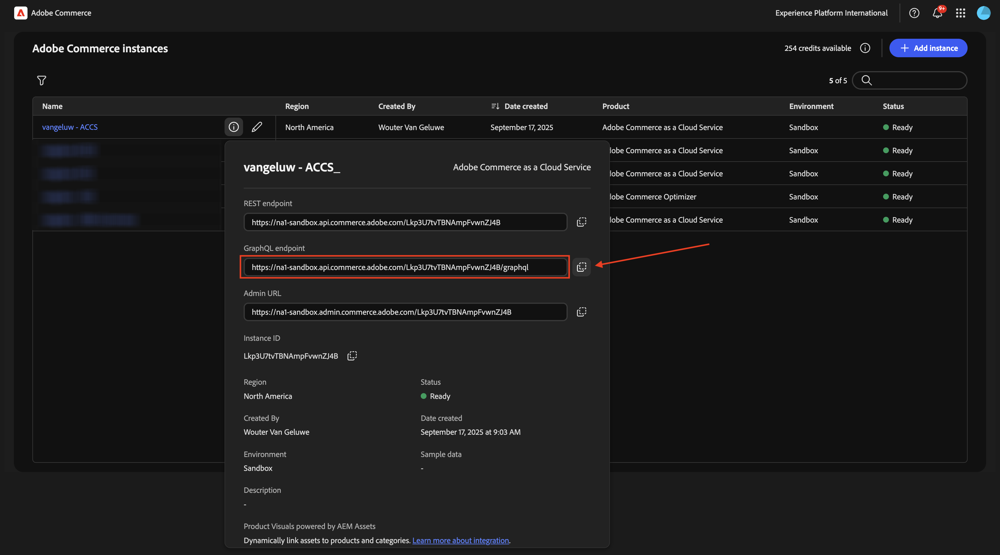

# 1.5.2 AEM Sites CS/EDS Storefront에 ACCS 연결

>[!IMPORTANT]
>
>이 연습을 완료하려면 EDS 환경이 있는 작업 중인 AEM Sites 및 Assets CS에 액세스할 수 있어야 합니다.
>
>아직 이러한 환경이 없다면 연습 [Adobe Experience Manager Cloud Service 및 Edge Delivery Services](./../../../modules/asset-mgmt/module2.1/aemcs.md){target="_blank"}로 이동하십시오. 거기에 있는 지침을 따르십시오, 그러면 당신은 이러한 환경에 액세스 할 수 있습니다.

>[!IMPORTANT]
>
>이전에 AEM Sites 및 Assets CS 환경에서 AEM CS 프로그램을 구성한 경우 AEM CS 샌드박스가 최대 절전 모드일 수 있습니다. 이러한 샌드박스의 최대 절전 모드 해제 시간이 10~15분 정도 걸리는 점을 감안할 때, 나중에 최대 절전 모드 해제 프로세스를 기다릴 필요가 없도록 지금 시작하는 것이 좋습니다.

이 연습에서는 AEM Sites CS/EDS Storefront를 ACCS 백엔드에 연결합니다. 현재 AEM Sites CS/EDS Storefront를 열고 **휴대폰** 제품 목록 페이지로 이동하면 아직 제품이 표시되지 않습니다.

이 연습을 마치면 AEM Sites CS/EDS Storefront의 **휴대폰** 제품 목록 페이지에 이전 연습에서 구성한 제품이 표시됩니다.

[https://experience.adobe.com/](https://experience.adobe.com/){target="_blank"}(으)로 이동합니다. 이름이 `--aepImsOrgName--`이어야 하는 올바른 환경에 있는지 확인하십시오. **Commerce**&#x200B;을(를) 클릭합니다.

ACCS 인스턴스 옆에 있는 **정보** 아이콘을 클릭합니다(이름: `--aepUserLdap-- - ACCS`).

그럼 이걸 보셔야죠 **GraphQL 끝점**&#x200B;을 복사합니다.

[https://da.live/app/adobe-commerce/storefront-tools/tools/config-generator/config-generator](https://da.live/app/adobe-commerce/storefront-tools/tools/config-generator/config-generator)&#x200B;(으)로 이동합니다. 이제 AEM Sites CS Storefront를 ACCS 백엔드에 연결하는 데 사용할 config.json 파일을 생성해야 합니다.

**구성 생성기** 페이지에서 복사한 **GraphQL 끝점** URL을 붙여 넣으십시오.

**생성**&#x200B;을 클릭합니다.

전체 생성된 JSON 페이로드를 복사합니다.

AEM Sites CS/EDS 환경을 설정할 때 작성된 GitHub 저장소로 이동합니다. 해당 저장소는 연습 [1.1.2 AEM CS 환경 설정](./../../../modules/asset-mgmt/module2.1/ex3.md){target="_blank"}에서 만들어졌으며, 이름은 **citisignal-aem-accs**&#x200B;이어야 합니다.

루트 디렉터리에서 아래로 스크롤하고 클릭하여 **config.json** 파일을 엽니다.

**편집** 아이콘을 클릭합니다.

현재 텍스트를 모두 제거하고 **구성 생성기** 페이지에 복사한 JSON 페이로드를 붙여 넣으십시오.

**변경 위임...**&#x200B;을 클릭합니다.

**변경 위임**&#x200B;을 클릭합니다.

**config.json** 파일이 업데이트되었습니다. 몇 분 안에 웹 사이트에서 변경 사항을 볼 수 있습니다. 변경 사항이 정상적으로 선택되었는지 확인하는 방법은 **휴대폰** 제품 페이지로 이동하는 것입니다. 이제 페이지에 **iPhone Air**&#x200B;이(가) 표시됩니다.

이제 제품이 성공적으로 표시되지만 아직 제품에 사용할 수 있는 이미지가 없습니다. 다음 연습에서는 제품 이미지에 대해 AEM Assets CS와 링크를 설정합니다.

다음 단계: [AEM Assets CS에 ACCS 연결](./ex3.md){target="_blank"}

[Adobe Commerce as a Cloud Service](./accs.md){target="_blank"}(으)로 돌아가기

[모든 모듈로 돌아가기](./../../../overview.md){target="_blank"}
