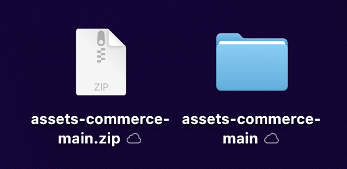
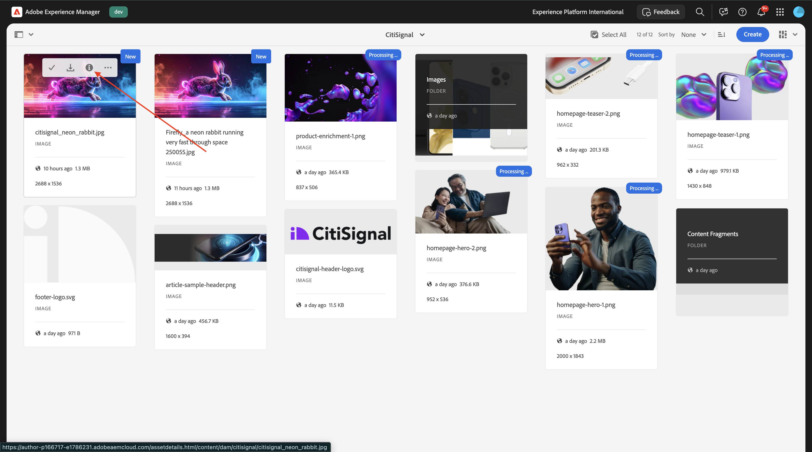
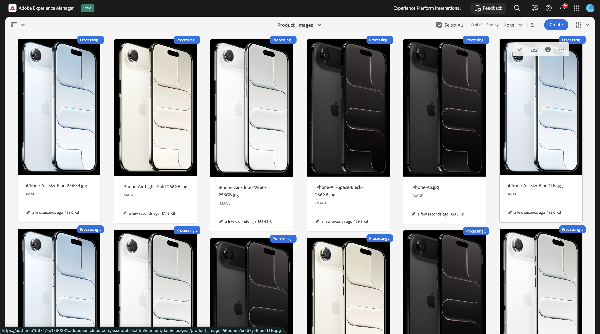
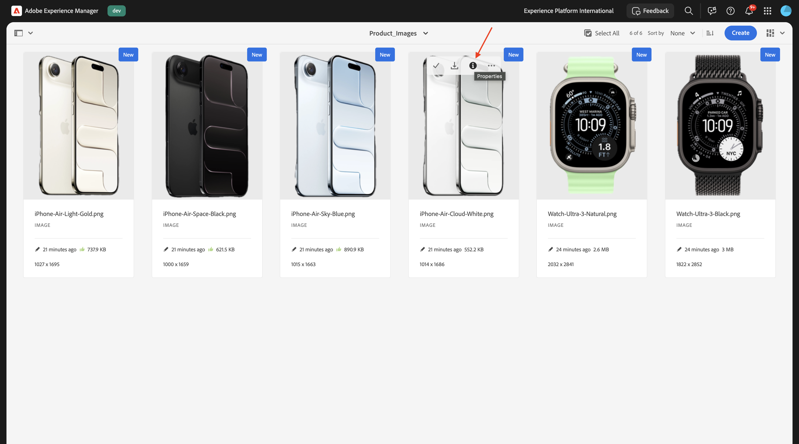
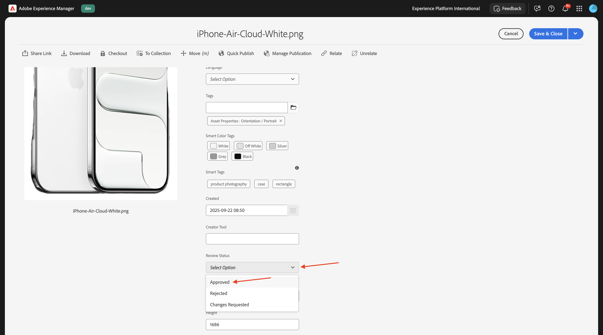
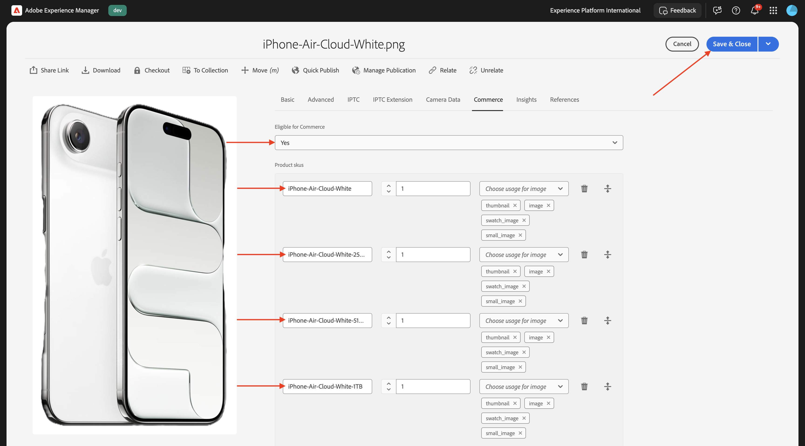

# 1.5.3 AEM Assets CS에 ACCS 연결

>[!IMPORTANT]
>
>이 연습을 완료하려면 EDS 환경이 있는 작업 중인 AEM Sites 및 Assets CS에 액세스할 수 있어야 합니다.
>
>아직 이러한 환경이 없다면 연습 [Adobe Experience Manager Cloud Service 및 Edge Delivery Services](./../../../modules/asset-mgmt/module2.1/aemcs.md){target="_blank"}로 이동하십시오. 거기에 있는 지침을 따르십시오, 그러면 당신은 이러한 환경에 액세스 할 수 있습니다.

>[!IMPORTANT]
>
>이전에 AEM Sites 및 Assets CS 환경에서 AEM CS 프로그램을 구성한 경우 AEM CS 샌드박스가 최대 절전 모드일 수 있습니다. 이러한 샌드박스의 최대 절전 모드 해제 시간이 10~15분 정도 걸리는 점을 감안할 때, 나중에 최대 절전 모드 해제 프로세스를 기다릴 필요가 없도록 지금 시작하는 것이 좋습니다.

이전 연습을 마친 후에는 ACCS에서 제품을 반품한 것을 웹사이트에 올릴 수 있었지만 아직 이미지가 남아 있지 않았다. 이 연습이 끝나면 이미지가 반환되는 것을 볼 수 있습니다.


## 1.5.3.1 파이프라인 구성 업데이트

[https://my.cloudmanager.adobe.com](https://my.cloudmanager.adobe.com){target="_blank"}(으)로 이동합니다. 선택해야 하는 조직은 `--aepImsOrgName--`입니다.

Cloud Manager 프로그램(`--aepUserLdap-- - CitiSignal AEM+ACCS`)을 열려면 클릭하세요.


아래로 살짝 이동한 다음 **파이프라인** 탭에서 **저장소 정보 액세스**&#x200B;를 클릭합니다.


그럼 이걸 보셔야죠 **암호 생성**&#x200B;을 클릭합니다.


**암호 생성**&#x200B;을 다시 클릭합니다.


그러면 사용 가능한 암호가 있어야 합니다. 그런 다음 **Git 명령줄** 필드 옆에 있는 **복사** 아이콘을 클릭합니다.


컴퓨터에서 선택한 위치에 새 디렉터리를 만들고 이름을 **AEM 파이프라인 GitHub**&#x200B;로 지정합니다.


폴더를 마우스 오른쪽 단추로 클릭한 다음 **폴더의 새 터미널**&#x200B;을 선택합니다.


그럼 이걸 보셔야죠


터미널 창에 이전에 복사한 **Git 명령줄** 명령을 붙여넣습니다.


사용자 이름을 입력해야 합니다. Cloud Manager의 프로그램 파이프라인에서 사용자 이름을 복사하고 **저장소 정보 액세스**&#x200B;한 다음 **enter**&#x200B;를 누르십시오.


그런 다음 암호를 입력해야 합니다. Cloud Manager의 프로그램 파이프라인에서 암호를 복사하고 **저장소 정보 액세스**&#x200B;한 다음 **enter**&#x200B;를 누르십시오.


1분 정도 걸릴 수 있습니다. 완료되면 프로그램의 파이프라인에 연결된 Git 저장소의 로컬 복사본이 제공됩니다.


**AEM 파이프라인 GitHub** 디렉터리에 새 디렉터리가 표시됩니다. 디렉토리를 엽니다.


해당 디렉토리에 있는 모든 파일을 선택하고 모두 삭제합니다.


디렉터리가 비어 있는지 확인합니다.


[https://github.com/ankumalh/assets-commerce](https://github.com/ankumalh/assets-commerce)&#x200B;(으)로 이동합니다. **&lt;> 코드**&#x200B;를 클릭한 다음 **ZIP 다운로드**&#x200B;를 선택합니다. 파일을 다운로드한 다음 바탕 화면에 놓습니다.


그런 다음 **assets-commerce-main.zip** 파일을 바탕 화면에 복사하고 압축을 풉니다. **assets-commerce-main** 폴더를 엽니다.



**assets-commerce-main** 디렉터리의 모든 파일을 프로그램의 파이프라인 저장소 디렉터리의 빈 디렉터리로 복사합니다.


그런 다음 **Microsoft Visual Studio Code**&#x200B;를 열고 **Microsoft Visual Studio Code**&#x200B;에서 프로그램의 파이프라인 리포지토리가 포함된 폴더를 엽니다.


왼쪽 메뉴에서 **검색**(으)로 이동하여 `<my-app>`을(를) 검색합니다. `<my-app>`의 모든 발생 횟수를 `--aepUserLdap--citisignalaemaccs`(으)로 바꾸어야 합니다.

**모두 바꾸기** 아이콘을 클릭합니다.


**바꾸기**&#x200B;를 클릭합니다.


이제 새 파일을 프로그램의 파이프라인 저장소에 연결된 Git 저장소에 다시 업로드할 준비가 되었습니다. 이렇게 하려면 **AEM 파이프라인 GitHub** 폴더를 열고 새 파일이 포함된 폴더를 마우스 오른쪽 단추로 클릭합니다. **폴더에서 새 터미널**&#x200B;을 선택하세요.


그럼 이걸 보셔야죠 `git add .` 명령을 붙여 넣고 **enter**&#x200B;를 누르십시오.


그럼 이걸 보셔야죠 `git commit -m "add assets integration"` 명령을 붙여 넣고 **enter**&#x200B;를 누르십시오.


그럼 이걸 보셔야죠 `git push origin main` 명령을 붙여 넣고 **enter**&#x200B;를 누르십시오.


그럼 이걸 보셔야죠 이제 변경 사항이 프로그램의 파이프라인 Git 저장소에 배포되었습니다.


Cloud Manager으로 돌아가서 **닫기**&#x200B;를 클릭합니다.


파이프라인의 Git 저장소를 변경한 후 **배포에 배포** 파이프라인을 다시 실행해야 합니다. 세 점 **..**&#x200B;을(를) 클릭하고 **실행**&#x200B;을(를) 선택합니다.


**실행**&#x200B;을 클릭합니다. 파이프라인 배포를 실행하는 데 10~15분 정도 걸릴 수 있습니다. 파이프라인 배포가 성공적으로 완료될 때까지 기다렸다가 계속해야 합니다.


## 1.5.3.2 ACCS에서 AEM Assets 통합 사용

ACCS 인스턴스로 돌아갑니다. 왼쪽 메뉴에서 **스토어**(으)로 이동한 다음 **구성**&#x200B;을 선택합니다.


메뉴에서 아래로 스크롤하여 **ADOBE 서비스**(으)로 이동한 다음 **AEM Assets 통합**&#x200B;을 엽니다. 그럼 이걸 보셔야죠


다음 변수를 입력합니다.

- **AEM Assets 프로그램 ID**: AEM CS 작성자 URL에서 프로그램 ID를 가져올 수 있습니다. 이 예제에서 프로그램 ID는 `166717`입니다.


- **AEM Assets 환경 ID**: AEM CS 작성자 URL에서 환경 ID를 가져올 수 있습니다. 이 예제에서 환경 ID는 `1786231`입니다.


- **자산 선택기 IMS 클라이언트 ID**: `1`(으)로 설정됨
- **동기화 사용**: `Yes`(으)로 설정
- **시각화 소유자**: `AEM Assets`(으)로 설정
- **자산 일치 규칙**: `Match by product SKU`
- **제품 SKU 특성 이름별 일치**: `commerce:skus`

**구성 저장**&#x200B;을 클릭합니다.


그럼 이걸 보셔야죠


## 1.5.3.3 config.json 업데이트

AEM Sites CS/EDS 환경을 설정할 때 작성된 GitHub 저장소로 이동합니다. 해당 저장소는 연습 [1.1.2 AEM CS 환경 설정](./../../../modules/asset-mgmt/module2.1/ex3.md){target="_blank"}에서 만들어졌으며, 이름은 **citisignal-aem-accs**&#x200B;이어야 합니다.

루트 디렉터리에서 아래로 스크롤하고 클릭하여 **config.json** 파일을 엽니다. 파일을 변경하려면 **편집** 아이콘을 클릭하십시오.


5 `"commerce-endpoint": "https://na1-sandbox.api.commerce.adobe.com/XXX/graphql",`행 아래에 아래 코드 조각을 추가하십시오.

```json
 "commerce-assets-enabled": "true",
```

**변경 내용 커밋...**&#x200B;을 클릭합니다.


**변경 내용 커밋**&#x200B;을 클릭합니다.


이제 변경 사항이 저장되었으며 곧 게시됩니다. 변경 사항이 상점 전면에서 보이려면 몇 분 정도 걸릴 수 있습니다.


## 1.5.3.4 AEM Assets CS에서 Commerce 필드 확인

AEM CS 작성자 환경에 로그인하고 **Assets**(으)로 이동합니다.


**파일**(으)로 이동합니다.


**CitiSignal** 폴더를 엽니다.


에셋 위로 마우스를 가져간 후 **정보** 아이콘을 클릭합니다.



이제 2개의 새 메타데이터 특성이 포함된 **Commerce** 탭이 표시됩니다.


이제 AEM Assets CS 환경이 Commerce 통합을 지원합니다. 이제 제품 이미지 업로드를 시작할 수 있습니다.

## 1.5.3.4 제품 업로드 Assets 및 제품에 대한 링크

[여기에 제품 이미지를 다운로드하세요](./images/Product_Images.zip). 파일을 다운로드한 후 바탕 화면으로 내보냅니다.


**만들기**&#x200B;를 클릭한 다음 **폴더**&#x200B;를 선택합니다.


**제목** 및 **이름** 필드에 **Product_Images** 값을 입력하십시오. **만들기**&#x200B;를 클릭합니다.


을(를) 클릭하여 방금 만든 폴더를 엽니다.


**만들기**&#x200B;를 클릭한 다음 **파일**&#x200B;을 선택합니다.


바탕 화면의 **Product_Images** 폴더로 이동하여 모든 파일을 선택한 다음 **열기**&#x200B;를 클릭합니다.


**업로드**&#x200B;를 클릭합니다.


그러면 폴더에서 이미지를 사용할 수 있습니다. **iPhone-Air-Light-Gold.png** 제품 위로 마우스를 가져간 후 **속성** 아이콘을 클릭합니다.



아래로 스크롤하여 필드 **검토 상태**&#x200B;를 **승인됨**(으)로 설정합니다. AEM Assets CS - ACCS 통합은 승인된 이미지에만 작동합니다.


위로 스크롤하여 **Commerce** 탭으로 이동한 다음 **제품 sku**&#x200B;에서 **추가**&#x200B;를 클릭합니다.


이 제품에 대해 다음 SKU를 추가합니다.

| 키 | 값 | 사용 |
|:-------------:| :---------------:| :---------------:| 
| `iPhone-Air-Light-Gold` | `1` | `thumbnail, image, swatch_image, small_image` |
| `iPhone-Air-Light-Gold-256GB` | `1` | `thumbnail, image, swatch_image, small_image` |
| `iPhone-Air-Light-Gold-512GB` | `1` | `thumbnail, image, swatch_image, small_image` |
| `iPhone-Air-Light-Gold-1TB` | `1` | `thumbnail, image, swatch_image, small_image` |

그럼 이걸 드셔보세요 **저장 및 닫기**&#x200B;를 클릭합니다.


**iPhone-Air-Space-Black.png** 제품 위로 마우스를 가져간 후 **속성** 아이콘을 클릭합니다.


아래로 스크롤하여 필드 **검토 상태**&#x200B;를 **승인됨**(으)로 설정합니다. AEM Assets CS - ACCS 통합은 승인된 이미지에만 작동합니다.


위로 스크롤하여 **Commerce** 탭으로 이동한 다음 **제품 sku**&#x200B;에서 **추가**&#x200B;를 클릭합니다.


이 제품에 대해 다음 SKU를 추가합니다.

| 키 | 값 | 사용 |
|:-------------:| :---------------:| :---------------:| 
| `iPhone-Air-Space-Black` | `1` | `thumbnail, image, swatch_image, small_image` |
| `iPhone-Air-Space-Black-256GB` | `1` | `thumbnail, image, swatch_image, small_image` |
| `iPhone-Air-Space-Black-512GB` | `1` | `thumbnail, image, swatch_image, small_image` |
| `iPhone-Air-Space-Black-1TB` | `1` | `thumbnail, image, swatch_image, small_image` |
| `iPhone-Air` | `1` | `thumbnail, image, swatch_image, small_image` |

그럼 이걸 드셔보세요 **저장 및 닫기**&#x200B;를 클릭합니다.


**iPhone-Air-Sky-Blue.png** 제품 위로 마우스를 가져간 후 **속성** 아이콘을 클릭합니다.


아래로 스크롤하여 필드 **검토 상태**&#x200B;를 **승인됨**(으)로 설정합니다. AEM Assets CS - ACCS 통합은 승인된 이미지에만 작동합니다.


위로 스크롤하여 **Commerce** 탭으로 이동한 다음 **제품 sku**&#x200B;에서 **추가**&#x200B;를 클릭합니다.


이 제품에 대해 다음 SKU를 추가합니다.

| 키 | 값 | 사용 |
|:-------------:| :---------------:| :---------------:| 
| `iPhone-Air-Sky-Blue` | `1` | `thumbnail, image, swatch_image, small_image` |
| `iPhone-Air-Sky-Blue-256GB` | `1` | `thumbnail, image, swatch_image, small_image` |
| `iPhone-Air-Sky-Blue-512GB` | `1` | `thumbnail, image, swatch_image, small_image` |
| `iPhone-Air-Sky-Blue-1TB` | `1` | `thumbnail, image, swatch_image, small_image` |

그럼 이걸 드셔보세요 **저장 및 닫기**&#x200B;를 클릭합니다.


**iPhone-Air-Cloud-White.png** 제품 위로 마우스를 가져간 후 **속성** 아이콘을 클릭합니다.



아래로 스크롤하여 필드 **검토 상태**&#x200B;를 **승인됨**(으)로 설정합니다. AEM Assets CS - ACCS 통합은 승인된 이미지에만 작동합니다.



위로 스크롤하여 **Commerce** 탭으로 이동한 다음 **제품 sku**&#x200B;에서 **추가**&#x200B;를 클릭합니다.


이 제품에 대해 다음 SKU를 추가합니다.

| 키 | 값 | 사용 |
|:-------------:| :---------------:| :---------------:| 
| `iPhone-Air-Cloud-White` | `1` | `thumbnail, image, swatch_image, small_image` |
| `iPhone-Air-Cloud-White-256GB` | `1` | `thumbnail, image, swatch_image, small_image` |
| `iPhone-Air-Cloud-White-512GB` | `1` | `thumbnail, image, swatch_image, small_image` |
| `iPhone-Air-Cloud-White-1TB` | `1` | `thumbnail, image, swatch_image, small_image` |

그럼 이걸 드셔보세요 **저장 및 닫기**&#x200B;를 클릭합니다.



이제 모든 **iPhone Air** 이미지에 자산이 승인되었음을 나타내는 **녹색 엄지손가락 위로**&#x200B;가 표시됩니다.


## 1.5.3.5 AEM Sites CS/EDS Storefront에서 제품 이미지 확인

>[!NOTE]
>
>위에서 변경한 사항이 성공적으로 배포되기까지 최대 15분이 소요될 수 있습니다. 이미지가 아직 표시되지 않는 경우 15분 정도 기다린 후 다시 시도하십시오.

통합이 작동하는지 확인하려면 CitiSignal 웹 사이트를 열어야 합니다.

웹 사이트에 액세스하려면 GitHub 사용자 계정으로 XXX를 바꾼 후 `main--citisignal-aem-accs--XXX.aem.page` 및/또는 `main--citisignal-aem-accs--XXX.aem.live`(이 예에서는 `woutervangeluwe`)로 이동하십시오.

따라서 이 예에서 전체 URL은 다음과 같이 됩니다.
`https://main--citisignal-aem-accs--woutervangeluwe.aem.page` 및/또는 `https://main--citisignal-aem-accs--woutervangeluwe.aem.live`.

그럼 이걸 보셔야죠 **휴대폰**(으)로 이동합니다.


그러면 **iPhone Air**&#x200B;에 대한 제품 이미지가 표시됩니다. **iPhone Air**&#x200B;을(를) 클릭합니다.


그럼 이걸 보셔야죠 색상 및 저장 옵션을 변경하면 선택한 내용에 따라 이미지가 동적으로 변경되는 것을 볼 수 있습니다.


다음은 색상을 **Light-Gold**(으)로 변경하고 저장소 크기를 **256GB**(으)로 변경하는 예입니다.


다음 단계: [요약 및 이점](./summary.md){target="_blank"}

[Adobe Commerce as a Cloud Service](./accs.md){target="_blank"}(으)로 돌아가기

[모든 모듈로 돌아가기](./../../../overview.md){target="_blank"}
