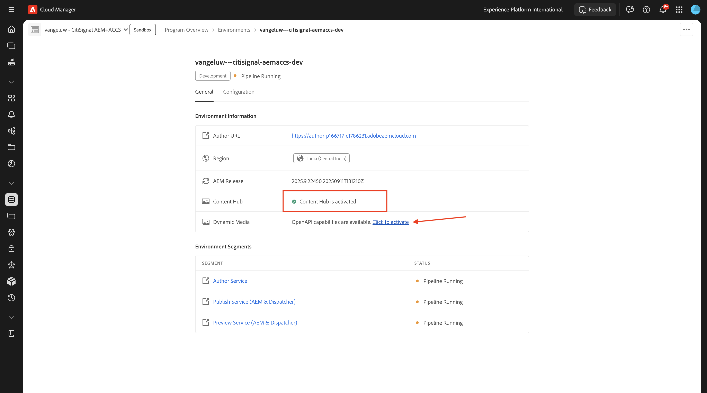
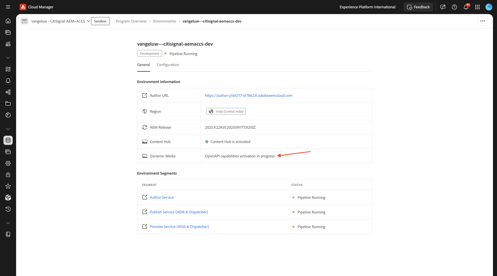

# 1.1.1 Cloud Manager 프로그램 만들기

[https://my.cloudmanager.adobe.com](https://my.cloudmanager.adobe.com){target="_blank"}(으)로 이동합니다. 선택해야 하는 조직은 `--aepImsOrgName--`입니다. 그러면 이런 것을 보게 될 겁니다. **프로그램 추가**&#x200B;를 클릭합니다.

**프로그램 이름**&#x200B;의 경우 `--aepUserLdap-- - CitiSignal AEM+ACCS`을(를) 사용하십시오. **샌드박스 설정** 옵션을 선택하십시오. **계속**&#x200B;을 클릭합니다.

다음 옵션이 선택되어 있는지 확인합니다.

- 사이트
- 양식
- 자산

옵션 목록을 열려면 **Assets**&#x200B;의 화살표를 클릭하십시오.

다음 옵션이 선택되어 있는지 확인합니다.

- Content Hub

목록에서 아래로 스크롤합니다.

다음 옵션이 선택되어 있는지 확인합니다.

- Edge Delivery Services
- Dynamic Media

**만들기**&#x200B;를 클릭합니다.

환경을 만드는 데 10~20분 정도 소요됩니다.

환경이 만들어지고 사용할 준비가 되면 이메일 확인을 받게 되며 그 후 다시 여기로 돌아올 수 있습니다.

전자 메일 확인을 받으면 [https://my.cloudmanager.adobe.com](https://my.cloudmanager.adobe.com){target="_blank"}(으)로 돌아갑니다. 그러면 프로그램의 상태가 **준비**(으)로 변경되었습니다. 프로그램을 클릭하여 엽니다.

**파이프라인** 탭을 살펴보십시오. 세 점 **..**&#x200B;을(를) 클릭한 다음 **실행**&#x200B;을(를) 클릭합니다.

**실행**&#x200B;을 클릭합니다.

그런 다음 **환경** 탭에서 세 점 **..**&#x200B;을(를) 클릭하고 **세부 정보 보기**&#x200B;를 클릭합니다.

그러면 다음 연습에서 필요한 **작성자** 환경의 URL을 포함한 환경 세부 정보가 표시됩니다.

**Content Hub** 줄을 보고 **활성화하려면 클릭**&#x200B;을 선택하세요.

**활성화**&#x200B;를 클릭합니다.

**Content Hub** 활성화가 시작되었습니다. 10분 이상 걸릴 수 있습니다.

약 10분 후에 **Content Hub**의 활성화가 완료됩니다.
그런 다음 **Dynamic Media** 줄을 보고 **활성화하려면 클릭**&#x200B;을 선택하세요.

**활성화**&#x200B;를 클릭합니다.

**Dynamic Media** 활성화가 시작되었습니다. 10분 이상 걸릴 수 있습니다.

약 10분 후 **Dynamic Media**&#x200B;의 활성화가 완료됩니다.

파이프라인 실행이 완료되면 다음 연습을 계속할 수 있습니다.

다음 단계: [AEM CS 환경 설정](./ex2.md){target="_blank"}

[Adobe Experience Manager Cloud Service 및 Edge Delivery Services으로 돌아가기](./aemcs.md){target="_blank"}

[모든 모듈로 돌아가기](./../../../overview.md){target="_blank"}
