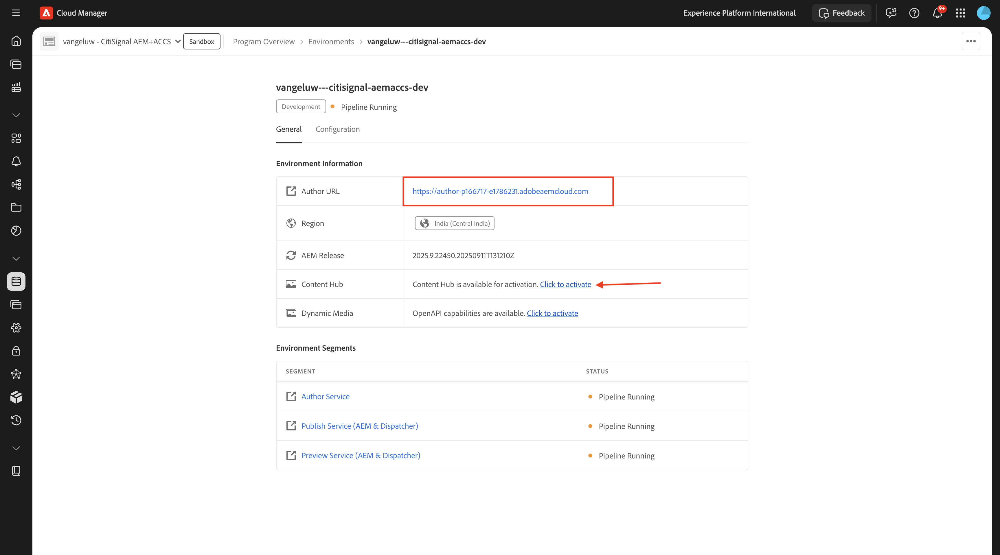

# 1.1.1 Cloud Manager 프로그램 만들기

[https://my.cloudmanager.adobe.com](https://my.cloudmanager.adobe.com){target="_blank"}(으)로 이동합니다. 선택해야 하는 조직은 `--aepImsOrgName--`입니다. 그러면 이런 것을 보게 될 겁니다. **프로그램 추가**&#x200B;를 클릭합니다.

{zoomable="yes"}

**프로그램 이름**&#x200B;의 경우 `--aepUserLdap-- - CitiSignal`을(를) 사용하십시오. **계속을 클릭합니다**.

{zoomable="yes"}

다음 옵션이 선택되어 있는지 확인합니다.

- 사이트
- 에셋
- Edge Delivery Services

**만들기**&#x200B;를 클릭합니다.

{zoomable="yes"}

환경을 만드는 데 10~20분 정도의 시간이 소요됩니다.

{zoomable="yes"}

기다리는 동안 연습 [1.1.2](./ex2.md){target="_blank"}(으)로 시작할 수 있습니다.

환경이 만들어지고 사용할 준비가 되면 이메일 확인을 받게 되며 그 후 다시 여기로 돌아올 수 있습니다.

{zoomable="yes"}

전자 메일 확인을 받으면 [https://my.cloudmanager.adobe.com](https://my.cloudmanager.adobe.com){target="_blank"}(으)로 돌아갑니다. 그러면 프로그램의 상태가 **준비**(으)로 변경되었습니다. 프로그램을 클릭하여 엽니다.

{zoomable="yes"}

**파이프라인** 탭을 살펴보십시오. 세 점 **..**&#x200B;을(를) 클릭한 다음 **실행**&#x200B;을(를) 클릭합니다.

{zoomable="yes"}

**실행**&#x200B;을 클릭합니다.

{zoomable="yes"}

그런 다음 **환경** 탭에서 세 점 **..**&#x200B;을(를) 클릭하고 **세부 정보 보기**&#x200B;를 클릭합니다.

{zoomable="yes"}

그러면 다음 연습에서 필요한 **작성자** 환경의 URL을 포함한 환경 세부 정보가 표시됩니다.

{zoomable="yes"}

파이프라인 실행이 완료되면 다음 연습을 계속할 수 있습니다.

다음 단계: [1.1.2 문서 기반 웹 사이트 만들기](./ex2.md){target="_blank"}

[Adobe Experience Manager Cloud Service 및 Edge Delivery Services으로 돌아가기](./aemcs.md){target="_blank"}

[모든 모듈로 돌아가기](./../../../overview.md){target="_blank"}
