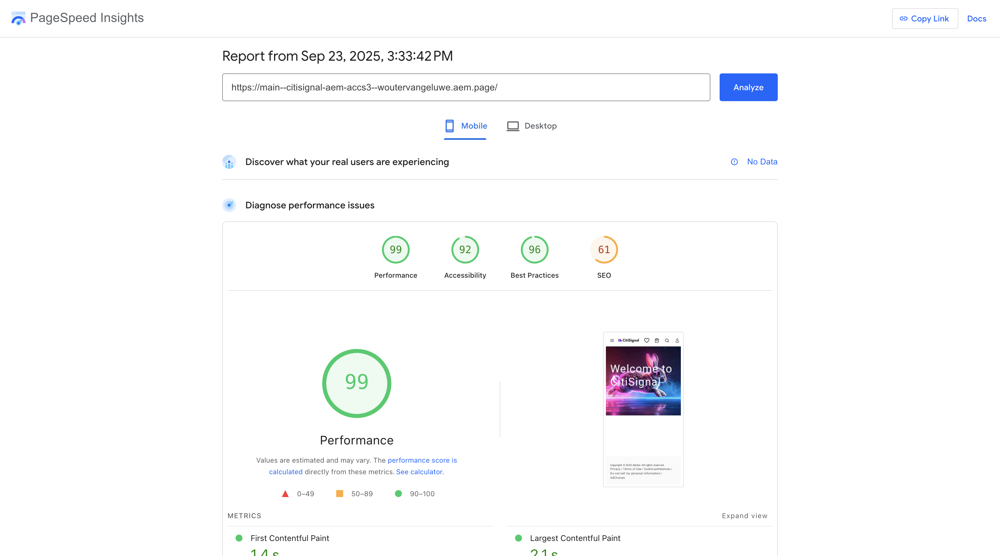
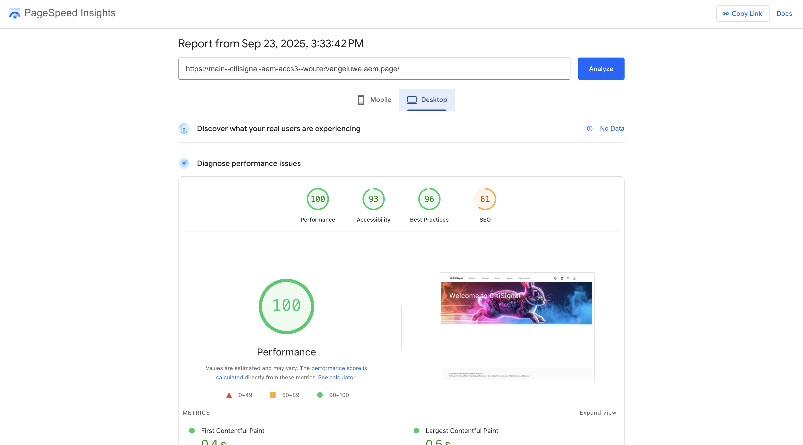

# 1.1.2 AEM CS 환경 설정

## 1.1.2.1 GitHub 저장소 설정

[https://github.com](https://github.com){target="_blank"}(으)로 이동합니다. **로그인**&#x200B;을 클릭합니다.

자격 증명을 입력합니다. **로그인**&#x200B;을 클릭합니다.

로그인하면 GitHub 대시보드가 표시됩니다.

[https://github.com/adobe-rnd/aem-boilerplate-xcom](https://github.com/adobe-rnd/aem-boilerplate-xcom){target="_blank"}(으)로 이동합니다. 그러면 이걸 보게 될 거야. **이 템플릿 사용**&#x200B;을 클릭한 다음 **새 저장소 만들기**&#x200B;를 클릭합니다.

**저장소 이름**&#x200B;에 대해 `citisignal-aem-accs`을(를) 사용합니다. 가시성을 **개인**(으)로 설정합니다. **저장소 만들기**&#x200B;를 클릭합니다.

몇 초 후에 저장소가 생성됩니다.

그런 다음 [https://github.com/apps/aem-code-sync](https://github.com/apps/aem-code-sync){target="_blank"}(으)로 이동합니다. **설치** 또는 **구성**&#x200B;을 클릭합니다.

GitHub 사용자 계정 옆에 있는 **계속** 단추를 클릭합니다.

GitHub 사용자 계정 옆에 있는 **구성**&#x200B;을 클릭합니다.

**저장소만 선택**&#x200B;을 클릭한 다음 방금 만든 저장소를 추가합니다.

아래로 스크롤하고 **저장**&#x200B;을 클릭합니다.

그러면 이 확인을 받게 됩니다.

## 1.1.2.2 파일 fstab.yaml 업데이트

GitHub 리포지토리에서 을(를) 클릭하여 `fstab.yaml` 파일을 엽니다.

**편집** 아이콘을 클릭합니다.

이제 3행에서 필드 **url**&#x200B;의 값을 업데이트해야 합니다.

GitHub 저장소의 설정과 함께 특정 AEM Sites CS 환경의 URL로 현재 값을 바꾸어야 합니다.

URL `https://author-p130360-e1272151.adobeaemcloud.com/bin/franklin.delivery/adobe-rnd/aem-boilerplate-xcom/main`의 현재 값입니다.

URL의 세 가지 부분을 업데이트해야 합니다

`https://XXX/bin/franklin.delivery/YYY/ZZZ/main`

XXX는 AEM CS Author 환경의 URL로 대체되어야 합니다.

YYY는 GitHub 사용자 계정으로 대체해야 합니다.

ZZZ는 이전 연습에서 사용한 GitHub 저장소의 이름으로 대체해야 합니다.

[https://my.cloudmanager.adobe.com](https://my.cloudmanager.adobe.com){target="_blank"}(으)로 이동하여 AEM CS 작성자 환경의 URL을 찾을 수 있습니다. **프로그램**&#x200B;을 클릭하여 엽니다.

그런 다음 **환경** 탭에서 세 점 **..**&#x200B;을(를) 클릭하고 **세부 정보 보기**&#x200B;를 클릭합니다.

그러면 **작성자** 환경의 URL을 포함한 환경 세부 정보가 표시됩니다. URL을 복사합니다.

XXX = `author-p166717-e1786231.adobeaemcloud.com`

GitHub 사용자 계정 이름의 경우 브라우저의 URL에서 쉽게 찾을 수 있습니다. 이 예제에서 사용자 계정 이름은 `woutervangeluwe`입니다.

YYY = `woutervangeluwe`

GitHub 저장소 이름의 경우 GitHub에서 연 브라우저 창에서도 찾을 수 있습니다. 이 경우 저장소 이름은 `citisignal`입니다.

ZZZ = `citisignal-aem-accs`

이 3개의 값을 결합하면 `fstab.yaml` 파일에 구성해야 하는 새 URL이 만들어집니다.

`https://author-p166717-e1786231.adobeaemcloud.com/bin/franklin.delivery/woutervangeluwe/citisignal-aem-accs/main`

**변경 내용 커밋...**&#x200B;을 클릭합니다.

**변경 내용 커밋**&#x200B;을 클릭합니다.

`fstab.yaml` 파일이 업데이트되었습니다.

## 1.1.2.3 CitiSignal 자산 업로드

[https://my.cloudmanager.adobe.com](https://my.cloudmanager.adobe.com){target="_blank"}(으)로 이동합니다. **프로그램**&#x200B;을 클릭하여 엽니다.

그런 다음 작성자 환경의 URL을 클릭합니다.

**Adobe으로 로그인**&#x200B;을 클릭합니다.

그러면 작성자 환경이 표시됩니다.

URL은 다음과 같이 표시됩니다. `https://author-p166717-e1786231.adobeaemcloud.com/ui#/aem/aem/start.html?appId=aemshell`

이제 AEM의 **CRX 패키지 관리자** 환경에 액세스해야 합니다. 이렇게 하려면 URL에서 `ui#/aem/aem/start.html?appId=aemshell`을(를) 제거하고 `crx/packmgr`(으)로 바꾸십시오. 즉, URL은 다음과 같이 표시됩니다.
`https://author-p166717-e1786231.adobeaemcloud.com/crx/packmgr`.
패키지 관리자 환경을 로드하려면 **Enter**&#x200B;를 누르십시오.

**패키지 업로드**&#x200B;를 클릭합니다.

업로드할 패키지를 찾으려면 **찾아보기**&#x200B;를 클릭하세요.

업로드할 패키지는 **citsignal-assets.zip**&#x200B;이며 [https://tech-insiders.s3.us-west-2.amazonaws.com/one-adobe/citisignal-assets.zip](https://tech-insiders.s3.us-west-2.amazonaws.com/one-adobe/citisignal-assets.zip){target="_blank"}에서 다운로드할 수 있습니다.

패키지를 선택하고 **열기**&#x200B;를 클릭합니다.

**확인**&#x200B;을 클릭합니다.

그러면 패키지가 업로드됩니다.

그런 다음 방금 업로드한 패키지에서 **설치**&#x200B;를 클릭합니다.

**설치**&#x200B;를 클릭합니다.

몇 분 후에 패키지가 설치됩니다.

이제 이 창을 닫을 수 있습니다.

## 1.1.2.4 CitiSignal 자산 게시

[https://my.cloudmanager.adobe.com](https://my.cloudmanager.adobe.com){target="_blank"}(으)로 이동합니다. **프로그램**&#x200B;을 클릭하여 엽니다.

그런 다음 작성자 환경의 URL을 클릭합니다.

**Adobe으로 로그인**&#x200B;을 클릭합니다.

그러면 작성자 환경이 표시됩니다. **Assets**&#x200B;을(를) 클릭합니다.

**파일**&#x200B;을 클릭합니다.

**CitiSignal** 폴더를 클릭하여 선택한 다음 **게시 관리**&#x200B;를 클릭합니다.

**다음**&#x200B;을 클릭합니다.

**게시**&#x200B;를 클릭합니다.

이제 자산이 게시되었습니다.

## 1.1.2.5 CitiSignal 웹 사이트 만들기

[https://my.cloudmanager.adobe.com](https://my.cloudmanager.adobe.com){target="_blank"}(으)로 이동합니다. **프로그램**&#x200B;을 클릭하여 엽니다.

그런 다음 작성자 환경의 URL을 클릭합니다.

**Adobe으로 로그인**&#x200B;을 클릭합니다.

그러면 작성자 환경이 표시됩니다. **사이트**&#x200B;를 클릭합니다.

**만들기**&#x200B;를 클릭한 다음 **템플릿의 사이트**&#x200B;를 클릭합니다.

**가져오기**&#x200B;를 클릭합니다.

이제 사이트에 대해 사전 구성된 템플릿을 가져와야 합니다. [여기](./../../../assets/aem/citisignal-aem-sites-commerce-with-edge-delivery-services-template-0.4.0.zip){target="_blank"}에서 템플릿을 다운로드할 수 있습니다. 파일을 바탕 화면에 저장합니다.

그런 다음 `citisignal-aem-sites-commerce-with-edge-delivery-services-template-0.4.0.zip` 파일을 선택하고 **열기**&#x200B;를 클릭합니다.

그러면 이걸 보게 될 거야. 업로드한 템플릿을 클릭하여 선택한 다음 **다음**&#x200B;을 클릭합니다.

이제 세부 사항을 작성해야 합니다.

- 사이트 제목: **CitiSignal** 사용
- 사이트 이름: **CitiSignal** 사용
- GitHub URL: 이전에 사용 중이던 GitHub 저장소의 URL을 복사합니다.

그럼 이걸로 드셔보세요 **만들기**&#x200B;를 클릭합니다.

이제 사이트를 만드는 중입니다. 몇 분 정도 걸릴 수 있습니다. **확인**&#x200B;을 클릭합니다.

몇 분 후에 화면을 새로 고치면 새로 만든 CitiSignal 웹 사이트가 표시됩니다.

## 1.1.2.6 파일 경로.json 업데이트

GitHub 리포지토리에서 을(를) 클릭하여 `paths.json` 파일을 엽니다.

**편집** 아이콘을 클릭합니다.

이제 3, 4, 5, 6, 7, 10행의 `aem-boilerplate-commerce` 텍스트를 `CitiSignal`(으)로 바꾸십시오.

**변경 내용 커밋**&#x200B;을 클릭합니다.

**변경 내용 커밋**&#x200B;을 클릭합니다.

`paths.json` 파일이 업데이트되었습니다.

## 1.1.2.7 CitiSignal 웹 사이트 게시

**CitiSignal** 앞의 확인란을 클릭합니다. 그런 다음 **게시 관리**&#x200B;를 클릭합니다.

**다음**&#x200B;을 클릭합니다.

**하위 설정 포함**&#x200B;을 클릭합니다.

**하위 항목 포함** 확인란을 클릭하여 선택한 다음 다른 확인란을 클릭하여 선택을 취소합니다. **확인**&#x200B;을 클릭합니다.

**게시**&#x200B;를 클릭합니다.

그러면 다시 여기로 보내집니다. **CitiSignal**&#x200B;을 클릭하고 **인덱스** 앞의 확인란을 선택한 다음 **편집**&#x200B;을 클릭합니다.

그러면 웹 사이트가 **유니버설 편집기**&#x200B;에서 열립니다.

이제 GitHub 사용자 계정(이 예에서는 `main--citisignal-aem-accs--XXX.aem.page`)으로 XXX를 바꾼 후 `main--citisignal-aem-accs--XXX.aem.live` 및/또는 `woutervangeluwe`(으)로 이동하여 웹 사이트에 액세스할 수 있습니다.

이 예에서 전체 URL은 다음과 같이 됩니다.
`https://main--citisignal-aem-accs--woutervangeluwe.aem.page` 및/또는 `https://main--citisignal-aem-accs--woutervangeluwe.aem.live`.

에셋을 먼저 게시해야 하므로 모든 에셋이 올바르게 표시되기까지 시간이 걸릴 수 있습니다.

그러면 다음과 같은 결과가 표시됩니다.

## 1.1.2.8 테스트 페이지 성능

[https://pagespeed.web.dev/](https://pagespeed.web.dev/){target="_blank"}(으)로 이동합니다. URL을 입력하고 **분석**&#x200B;을 클릭합니다.

그러면 모바일과 데스크탑 시각화 모두에서 웹 사이트가 높은 점수를 받는 것을 볼 수 있습니다.

**모바일**:

**데스크톱**:

다음 단계: [사용자 지정 블록 개발](./ex4.md){target="_blank"}

[Adobe Experience Manager Cloud Service 및 Edge Delivery Services으로 돌아가기](./aemcs.md){target="_blank"}

[모든 모듈로 돌아가기](./../../../overview.md){target="_blank"}
