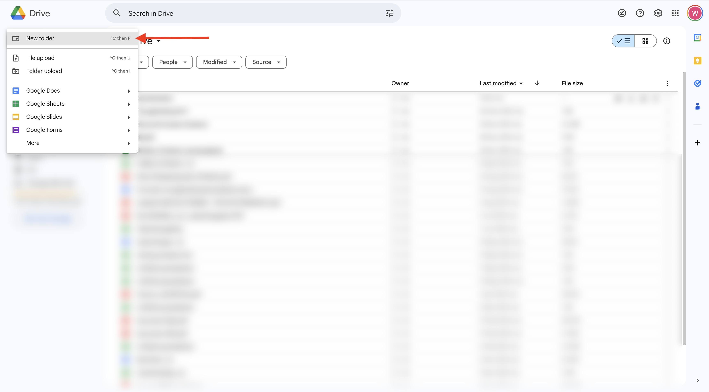
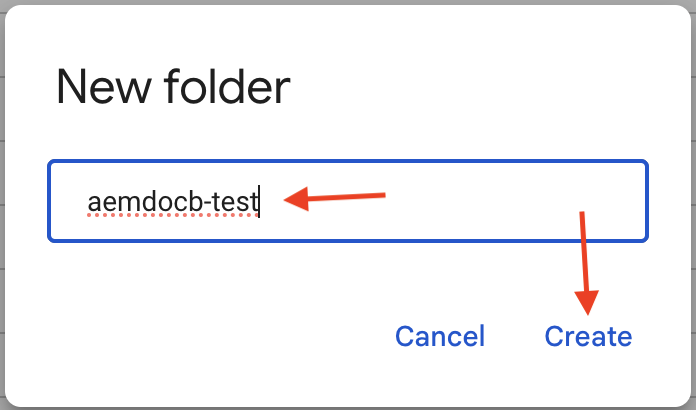
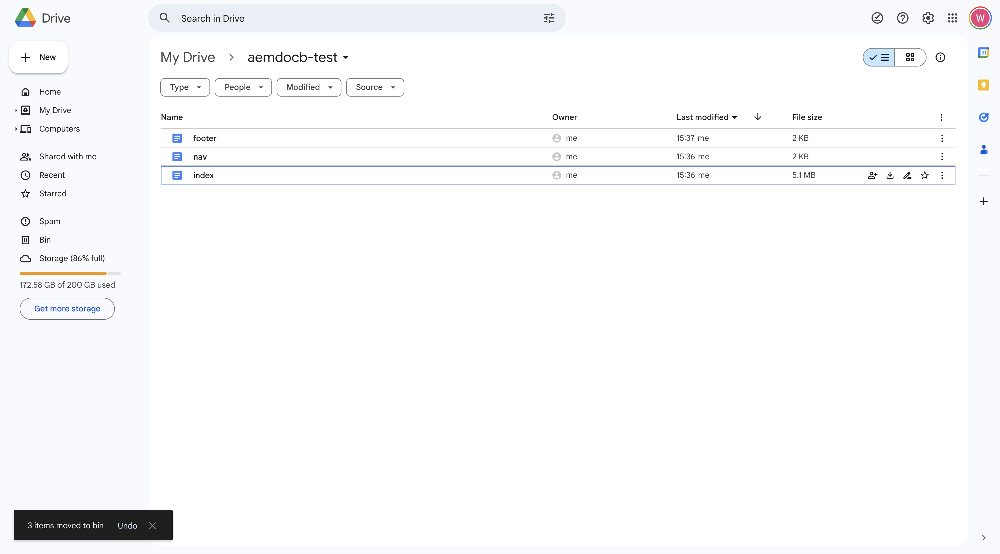
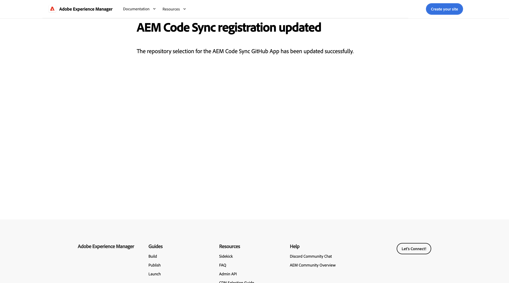
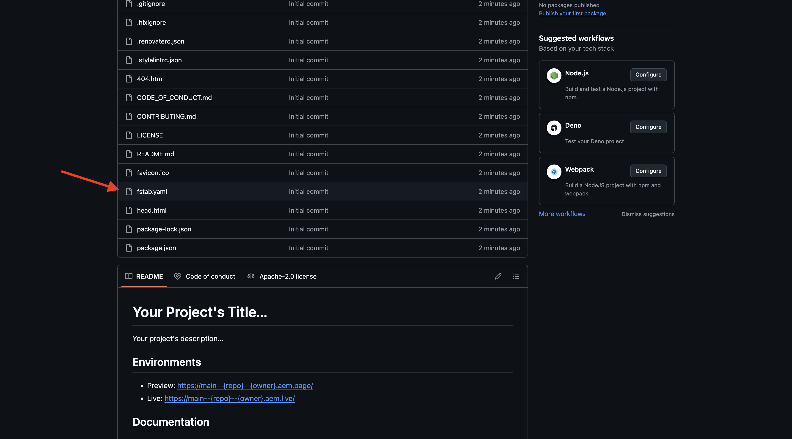
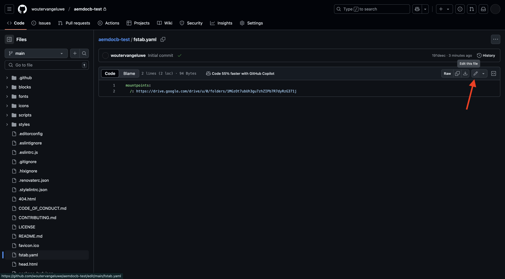
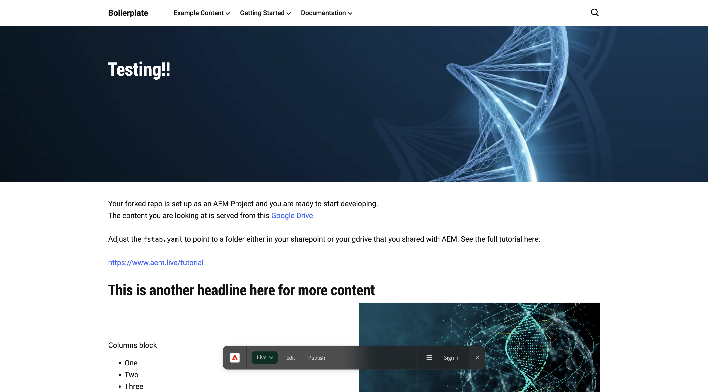
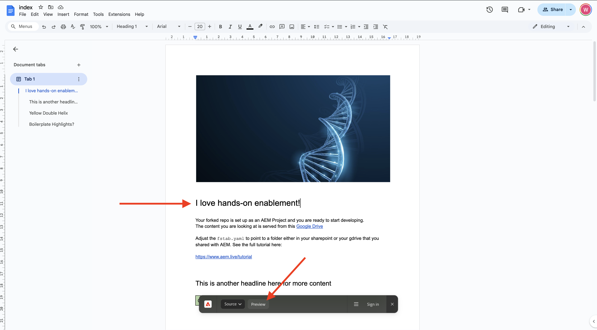

# 1.1.2 문서 기반 웹 사이트 만들기

Cloud Manager 프로그램이 만들어지기를 기다리는 동안 문서 기반의 첫 웹 사이트를 설정할 시간이 충분합니다. 아래 연습은 [aem.live 개발자 자습서](https://www.aem.live/developer/tutorial){target="_blank"}를 기반으로 합니다. 시작하려면 아래 단계를 따르십시오.

## 1.1.2.1 Google 드라이브 설정

[https://drive.google.com](https://drive.google.com){target="_blank"}(으)로 이동합니다. **+ 새로 만들기**&#x200B;를 클릭한 다음 **새 폴더**&#x200B;를 클릭합니다.

{zoomable="yes"}

폴더 이름을 `aemdocb-test`(으)로 지정합니다. **만들기**&#x200B;를 클릭합니다.

{zoomable="yes"}

[aemboilerplate.zip](./../../../assets/aem/aemboilerplate.zip){target="_blank"} 파일을 다운로드하여 컴퓨터에서 추출하십시오.

{zoomable="yes"}

해당 폴더에 3개의 파일이 표시됩니다. 이러한 파일을 새 Google 드라이브 폴더에 복사합니다.

{zoomable="yes"}

이제 이러한 파일을 기본 Google 파일로 변환해야 합니다. 이렇게 하려면 각 파일을 연 다음 **파일** > **Google Docs으로 저장**&#x200B;으로 이동합니다.

{zoomable="yes"}

3개의 모든 파일에 대해 이 작업을 수행해야 하며, 그 후에 Google 드라이브 폴더에 6개의 파일이 표시됩니다.

{zoomable="yes"}

그러면 이 항목이 폴더에 저장됩니다.

{zoomable="yes"}

문서 기반 작성 데모가 작동하려면 이제 Google 드라이브 폴더를 전자 메일 주소 **helix@adobe.com**&#x200B;과(와) 공유해야 합니다. 폴더 이름을 클릭하고 **공유**&#x200B;를 클릭한 다음 **공유**&#x200B;를 다시 클릭합니다.

{zoomable="yes"}

전자 메일 주소 **helix@adobe.com**&#x200B;을(를) 입력하고 **보내기**&#x200B;를 클릭합니다.

{zoomable="yes"}

그런 다음 다음 연습에서 필요할 때 Google 드라이브 폴더의 URL을 복사하여 적어 두십시오. 폴더 이름을 클릭하고 **공유**&#x200B;를 클릭한 다음 **링크 복사**&#x200B;를 클릭합니다.

{zoomable="yes"}

`https://drive.google.com/drive/folders/1PNIOFeptIfszSebawT-Y_bwB4_anQWk5?usp=drive_link`

URL이 다음과 같이 표시되도록 쿼리 문자열 매개 변수 `?usp=drive_link`을(를) 제거해야 합니다.

`https://drive.google.com/drive/folders/1PNIOFeptIfszSebawT-Y_bwB4_anQWk5`

## 1.1.2.2 GitHub 저장소 설정

[https://github.com](https://github.com){target="_blank"}(으)로 이동합니다. **로그인**&#x200B;을 클릭합니다.

{zoomable="yes"}

자격 증명을 입력합니다. **로그인**&#x200B;을 클릭합니다.

{zoomable="yes"}

로그인하면 GitHub 대시보드가 표시됩니다.

{zoomable="yes"}

[https://github.com/adobe/aem-boilerplate](https://github.com/adobe/aem-boilerplate){target="_blank"}(으)로 이동합니다. 그러면 이걸 보게 될 거야. **이 템플릿 사용**&#x200B;을 클릭한 다음 **새 저장소 만들기**&#x200B;를 클릭합니다.

{zoomable="yes"}

**저장소 이름**&#x200B;에 대해 `aemdocb-test`을(를) 사용합니다. 가시성을 **개인**(으)로 설정합니다. **저장소 만들기**&#x200B;를 클릭합니다.

{zoomable="yes"}

몇 초 후에 저장소가 생성됩니다.

{zoomable="yes"}

그런 다음 [https://github.com/apps/aem-code-sync](https://github.com/apps/aem-code-sync){target="_blank"}(으)로 이동합니다. **구성**&#x200B;을 클릭합니다.

{zoomable="yes"}

GitHub 계정을 클릭합니다.

{zoomable="yes"}

**저장소만 선택**&#x200B;을 클릭한 다음 방금 만든 저장소를 추가합니다. **설치**&#x200B;를 클릭합니다.

{zoomable="yes"}

그러면 이 확인을 받게 됩니다.

{zoomable="yes"}

## 1.1.2.3 파일 fstab.yaml 업데이트

GitHub 리포지토리에서 을(를) 클릭하여 `fstab.yaml` 파일을 엽니다.

{zoomable="yes"}

**편집** 아이콘을 클릭합니다.

{zoomable="yes"}

이제 2행의 필드 **url**&#x200B;에 대한 값을 업데이트해야 합니다.

{zoomable="yes"}

GitHub 저장소의 설정과 함께 특정 AEM CS 환경의 URL로 현재 값을 바꾸어야 합니다.

URL `https://drive.google.com/drive/u/0/folders/1MGzOt7ubUh3gu7zhZIPb7R7dyRzG371j`의 현재 값입니다.

해당 값을 Google 드라이브 폴더 `https://drive.google.com/drive/folders/1PNIOFeptIfszSebawT-Y_bwB4_anQWk5`에서 복사한 URL로 바꿉니다. **변경 내용 커밋...**&#x200B;을 클릭합니다.

{zoomable="yes"}

**변경 내용 커밋**&#x200B;을 클릭합니다.

{zoomable="yes"}

## 1.1.2.4 AEM Sidekick 확장 설치

[https://chromewebstore.google.com/detail/aem-sidekick/ccfggkjabjahcjoljmgmklhpaccedipo](https://chromewebstore.google.com/detail/aem-sidekick/ccfggkjabjahcjoljmgmklhpaccedipo){target="_blank"}(으)로 이동합니다. **Chrome에 추가**&#x200B;를 클릭합니다.

{zoomable="yes"}

**AEM Sidekick** 확장을 고정합니다.

{zoomable="yes"}

## 1.1.2.5 문서 기반 웹 사이트 미리보기 및 게시

Google 드라이브 폴더로 돌아갑니다. 작업 표시줄에서 **AEM Sidekick** 확장을 클릭합니다. 그러면 폴더에 AEM Sidekick 막대 팝업이 표시됩니다.

{zoomable="yes"}

Google 드라이브 폴더에서 3개의 파일을 선택합니다. **미리 보기**&#x200B;를 클릭합니다.

{zoomable="yes"}

**미리 보기**&#x200B;를 다시 클릭합니다.

{zoomable="yes"}

클릭하여 녹색 대화 상자 팝업을 닫습니다.

{zoomable="yes"}

Google 드라이브 폴더에서 3개의 파일을 다시 선택합니다. 이제 **게시**&#x200B;를 클릭하세요.

{zoomable="yes"}

**게시**&#x200B;를 클릭합니다.

{zoomable="yes"}

녹색 대화 상자를 다시 닫으려면 를 클릭합니다. 이제 **인덱스** 파일을 선택하고 **URL 복사**&#x200B;를 클릭한 다음 **실시간 URL 복사**&#x200B;를 클릭합니다.

{zoomable="yes"}

복사된 URL은 다음과 같이 표시됩니다. `https://main--aemdocb-test--woutervangeluwe.aem.live/`.

위의 URL에서:

- **main**&#x200B;은(는) GitHub 저장소의 분기를 참조합니다.
- **aemdocb-test**&#x200B;이(가) GitHub 저장소 이름을 참조합니다.
- **wutervangeluwe**&#x200B;이(가) GitHub 사용자 계정 이름을 참조합니다.
- **.live**&#x200B;이(가) AEM 인스턴스의 라이브 환경을 참조합니다.
- **.live**&#x200B;을(를) **.page**(으)로 바꾸어 AEM 인스턴스의 미리 보기 환경을 열 수 있습니다.

새 브라우저 창을 열고 URL로 이동합니다.

{zoomable="yes"}

## 1.1.2.6 변경 후 변경 사항 게시

Google 드라이브로 돌아가서 Google에서 **index** filer를 엽니다.

{zoomable="yes"}

**테스트** 텍스트를 선택한 다른 텍스트로 바꾸십시오. **미리 보기**&#x200B;를 클릭합니다.

{zoomable="yes"}

그러면 웹 사이트의 미리보기 버전이 열립니다. 변경 내용을 검토하고 **게시**&#x200B;를 클릭합니다.

{zoomable="yes"}

그러면 웹 사이트의 라이브 버전이 표시됩니다.

{zoomable="yes"}

위의 연습은 문서 기반 작성을 직접 시작하고 체험할 수 있는 좋은 방법이었습니다. 이제 CitiSignal을 데모 브랜드로 사용하여 나만의 데모 웹 사이트를 설정하는 다음 연습을 계속할 수 있습니다.

다음 단계: [1.1.3 AEM CS 환경 설정](./ex3.md){target="_blank"}

[Adobe Experience Manager Cloud Service 및 Edge Delivery Services으로 돌아가기](./aemcs.md){target="_blank"}

[모든 모듈로 돌아가기](./../../../overview.md){target="_blank"}
