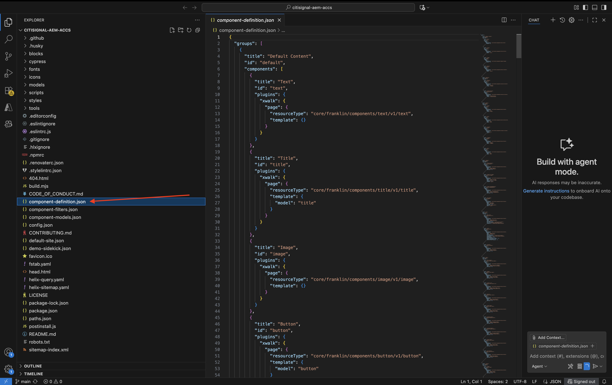
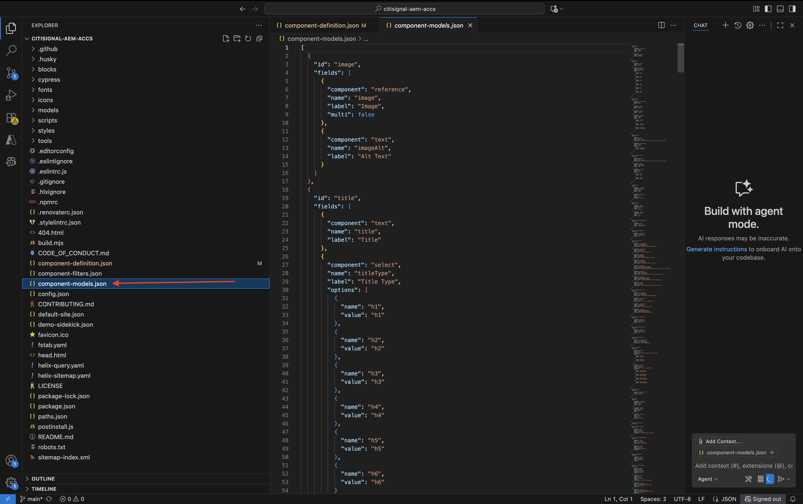
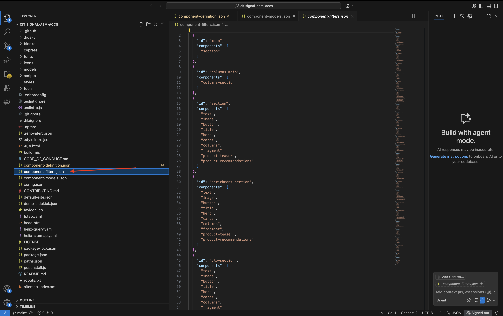
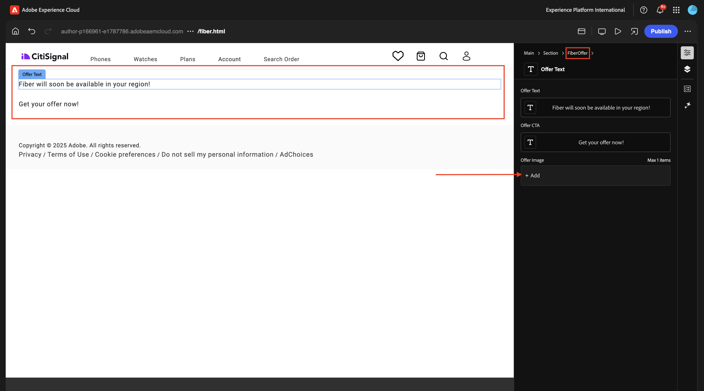

# 1.1.3 기본 사용자 지정 블록 개발

## 1.1.3.1 로컬 개발 환경 설정

[https://desktop.github.com/download/](https://desktop.github.com/download/){target="_blank"}(으)로 이동하여 **Github Desktop**&#x200B;을 다운로드하여 설치하십시오.


Github Desktop이 설치되면 이전 연습에서 만든 GitHub 저장소로 이동합니다. **&lt;> 코드**&#x200B;을 클릭한 다음 **GitHub Desktop으로 열기**&#x200B;를 클릭합니다.


그러면 GitHub 저장소가 GitHub Desktop에서 열립니다. **로컬 경로**&#x200B;를 자유롭게 변경하십시오. **복제**&#x200B;를 클릭합니다.


이제 로컬 폴더가 만들어집니다.


Visual Studio 코드를 엽니다. **파일** > **폴더 열기**(으)로 이동합니다.


GitHub 설정에서 **citsignal-aem-accs**&#x200B;에 사용하는 폴더를 선택하십시오.


이제 Visual Studio 코드에서 해당 폴더가 열리고 새 블록을 만들 준비가 된 것입니다.


## 1.1.3.2 기본 사용자 지정 블록 만들기

Adobe에서는 3단계 접근 방식으로 블록을 개발할 것을 권장합니다.

- 블록에 대한 정의와 모델을 생성하고 검토하고 프로덕션으로 가져옵니다.
- 새 블록으로 콘텐츠를 만듭니다.
- 새 블록의 장식과 스타일을 구현합니다.

### component-definition.json

Visual Studio 코드에서 **component-definition.json** 파일을 엽니다.



**블록**&#x200B;이 표시될 때까지 아래로 스크롤합니다. 구성 요소 **카드**&#x200B;의 닫는 대괄호 아래에 커서를 설정합니다.


이 코드를 붙여넣고 코드 블록 뒤에 쉼표 **,**&#x200B;을(를) 입력하십시오.

```json
{
  "title": "FiberOffer",
  "id": "fiberoffer",
  "plugins": {
    "xwalk": {
      "page": {
        "resourceType": "core/franklin/components/block/v1/block",
        "template": {
          "name": "FiberOffer",
          "model": "fiberoffer",
          "offerText": "<p>Fiber will soon be available in your region!</p>",
          "offerCallToAction": "Get your offer now!",
          "offerImage": ""
        }
      }
    }
  }
}
```

변경 내용을 저장합니다.


### component-models.json

Visual Studio 코드에서 **component-models.json** 파일을 엽니다.



마지막 항목이 표시될 때까지 아래로 스크롤합니다. 마지막 구성 요소의 닫는 대괄호 옆에 커서를 설정합니다.


쉼표 **,**&#x200B;을(를) 입력한 다음 Enter 키를 누르고 다음 줄에 이 코드를 붙여넣습니다.

```json
{
  "id": "fiberoffer",
  "fields": [
     {
       "component": "richtext",
       "name": "offerText",
       "value": "",
       "label": "Offer Text",
       "valueType": "string"
     },
     {
       "component": "richtext",
       "valueType": "string",
       "name": "offerCallToAction",
       "label": "Offer CTA",
       "value": ""
     },
     {
       "component": "reference",
       "valueType": "string",
       "name": "offerImage",
       "label": "Offer Image",
        "multi": false
     }
   ]
}
```

변경 내용을 저장합니다.


### component-filters.json

Visual Studio 코드에서 **component-filters.json** 파일을 엽니다.



**section**&#x200B;에서 쉼표 `,`을(를) 입력하고 현재 마지막 줄 뒤에 구성 요소 `"fiberoffer"`의 ID를 붙여 넣으십시오.

변경 내용을 저장합니다.


## 1.1.3.3 변경 내용 커밋

이제 프로젝트에서 GitHub 저장소로 다시 커밋해야 하는 몇 가지 변경 사항을 만들었습니다. 이렇게 하려면 **GitHub Desktop**&#x200B;을 엽니다.

그러면 **변경 내용**&#x200B;에서 편집한 3개의 파일이 표시됩니다. 변경 사항을 검토합니다.


PR 이름 `Fiber Offer custom block`을(를) 입력하십시오. **주 데이터베이스에 커밋**&#x200B;을 클릭합니다.


그럼 이걸 보셔야죠 **원본 푸시**&#x200B;를 클릭합니다.


몇 초 후 변경 사항이 GitHub 리포지토리에 푸시되었습니다.


브라우저에서 GitHub 계정으로 이동하고 CitiSignal용으로 만든 저장소로 이동합니다. 그런 다음 변경 사항이 수신되었음을 나타내는 이와 같은 메시지가 표시됩니다.


## 1.1.3.4 블록에 블록 추가

기본 견적 블록이 정의되어 CitiSignal 프로젝트에 커밋되었으므로 기존 페이지에 **fiberoffer** 블록을 추가할 수 있습니다.

[https://my.cloudmanager.adobe.com](https://my.cloudmanager.adobe.com){target="_blank"}(으)로 이동합니다. **프로그램**&#x200B;을 클릭하여 엽니다.


그런 다음 **환경** 탭에서 세 점 **..**&#x200B;을(를) 클릭하고 **세부 정보 보기**&#x200B;를 클릭합니다.


그러면 환경 세부 정보가 표시됩니다. **작성자** 환경의 URL을 클릭합니다.

>[!NOTE]
>
>환경이 최대 절전 모드일 수 있습니다. 이 경우 먼저 환경의 최대 절전 모드를 해제해야 합니다.


그러면 AEM 작성자 환경이 표시됩니다. **사이트**(으)로 이동합니다.


**CitiSignal**(으)로 이동합니다. **만들기**&#x200B;를 클릭하고 **페이지**&#x200B;를 선택합니다.


**페이지**&#x200B;를 선택하고 **다음**&#x200B;을 클릭합니다.


다음 값을 입력합니다.

- 제목: **파이버**
- 이름: **파이버**
- 페이지 제목: **파이버**

**만들기**&#x200B;를 클릭합니다.


**열기**&#x200B;를 선택합니다.


그럼 이걸 보셔야죠


빈 영역을 클릭하여 **섹션** 구성 요소를 선택합니다. 그런 다음 오른쪽 메뉴에서 더하기 **+** 아이콘을 클릭합니다.


그러면 사용 가능한 블록 목록에 사용자 지정 블록이 표시됩니다. 클릭하여 선택합니다.


그러면 편집기에 **오퍼 텍스트**, **오퍼 CTA** 및 **오퍼 이미지**&#x200B;와 같은 필드가 추가됩니다. **오퍼 이미지** 필드에서 **+ 추가**&#x200B;를 클릭하여 이미지를 선택합니다.



그럼 이걸 보셔야죠 **citisode** 폴더를 열려면 클릭하세요.


**product-enrichment-1.png** 이미지를 선택하십시오. **선택**&#x200B;을 클릭합니다.


그럼 이걸 드셔보세요 **게시**&#x200B;를 클릭합니다.


**게시**&#x200B;를 다시 클릭합니다.


이제 새 페이지가 게시되었습니다.

## 1.1.3.5 탐색 메뉴에 새 페이지 추가

AEM Sites 개요에서 **CitiSignal**(으)로 이동하여 **Header/nav** 파일의 확인란을 선택합니다. **편집**&#x200B;을 클릭합니다.


미리 보기 화면에서 **텍스트** 필드를 선택한 다음 화면 오른쪽의 **텍스트** 필드를 클릭하여 편집합니다.


탐색 메뉴에 `Fiber` 텍스트를 포함한 메뉴 옵션을 추가합니다. **파이버** 텍스트를 선택하고 **링크** 아이콘을 클릭합니다.


**URL** `/content/CitiSignal/fiber.html`에 입력한 다음 **V** 아이콘을 클릭하여 확인합니다.


그럼 이걸 드셔보세요 **완료**&#x200B;를 클릭합니다.


그럼 이걸 드셔보세요 **게시**&#x200B;를 클릭합니다.


**게시**&#x200B;를 다시 클릭합니다.


이제 GitHub 사용자 계정(이 예에서는 `main--citisignal--XXX.aem.page/us/en/`)으로 XXX를 바꾼 후 `main--citisignal--XXX.aem.live/us/en/` 및/또는 `woutervangeluwe`(으)로 이동하여 웹 사이트에 대한 변경 사항을 볼 수 있습니다.

이 예에서 전체 URL은 다음과 같이 됩니다.
`https://main--citisignal--woutervangeluwe.aem.page/us/en/` 및/또는 `https://main--citisignal--woutervangeluwe.aem.live/us/en/`.

그럼 이걸 보셔야죠 **파이버**&#x200B;를 클릭합니다.


다음은 기본 사용자 지정 블록이지만 이제 웹 사이트에서 렌더링됩니다.


다음 단계: [고급 사용자 지정 블록](./ex4.md){target="_blank"}

[Adobe Experience Manager Cloud Service 및 Edge Delivery Services으로 돌아가기](./aemcs.md){target="_blank"}

[모든 모듈로 돌아가기](./../../../overview.md){target="_blank"}
