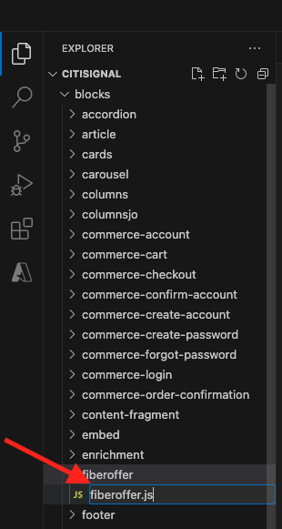
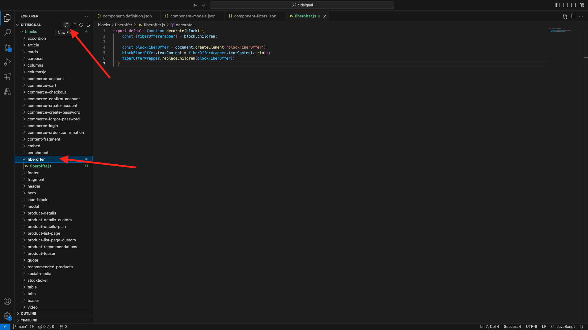
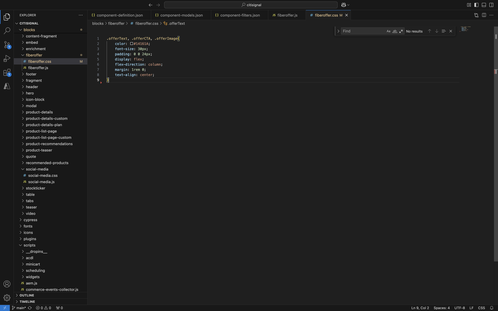
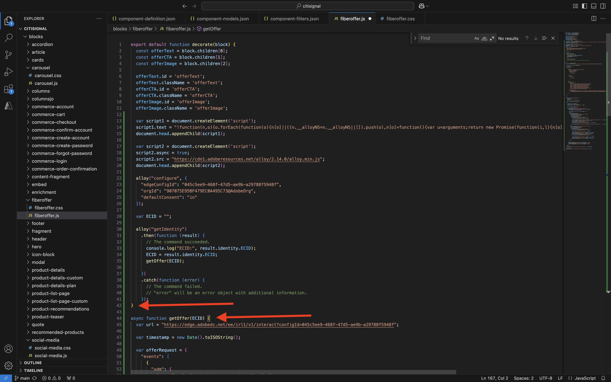

# 1.1.5 고급 사용자 지정 블록

이전 연습에서는 웹 사이트에 **오퍼 텍스트**, **오퍼 CTA** 및 **오퍼 이미지**&#x200B;와 같은 필드를 표시하는 기본 사용자 지정 블록인 **파이버 오퍼**&#x200B;를 구성했습니다.

이제 이 블록에서 작업을 계속할 수 있습니다.

{zoomable="yes"}

## 1.1.5.1 블록 스타일 지정

작업 중인 **fiberoffer** 블록이 있으므로 스타일을 적용할 수 있습니다.

Visual Studio Code로 돌아가서 **블록** 폴더를 엽니다. 이제 각 폴더가 특정 블록을 참조하는 여러 폴더를 볼 수 있습니다. **fiberoffer** 블록을 더 고급화하려면 이제 사용자 지정 블록에 대한 폴더를 만들어야 합니다.

{zoomable="yes"}

**블록** 폴더를 선택한 다음 **새 폴더 만들기** 아이콘을 클릭합니다.

{zoomable="yes"}

폴더 이름을 `fiberoffer`로 지정하고 **enter**&#x200B;를 누르십시오.

{zoomable="yes"}

새 **fiberoffer** 폴더를 선택하고 **새 파일 만들기** 아이콘을 클릭합니다.

{zoomable="yes"}

이제 새 파일이 만들어집니다. 이름 **fiberoffer.js**&#x200B;을(를) 입력하고 Enter 키를 누릅니다.

{zoomable="yes"}

이제 **fiberoffer.js** 파일에 다음 JavaScript을 추가하여 블록 데코레이션을 구현할 수 있습니다.

파일을 저장합니다.

```js
export default function decorate(block) {
  const offerText = block.children[0];
  const offerCTA = block.children[1];
  const offerImage = block.children[2];

  offerText.id = 'offerText';
  offerText.className = 'offerText';
  offerCTA.id = 'offerCTA';
  offerCTA.className = 'offerCTA';
  offerImage.id = 'offerImage';
  offerImage.className = 'offerImage';
}
```

{zoomable="yes"}

새 **fiberoffer** 폴더를 선택하고 **새 파일 만들기** 아이콘을 다시 클릭합니다.

{zoomable="yes"}

이제 새 파일이 만들어집니다. **fiberoffer.css** 이름을 입력하고 Enter 키를 누르십시오.

{zoomable="yes"}

다음 CSS 코드를 복사하여 새로 만든 파일에 붙여넣습니다.

```js
.offerText, .offerCTA, .offerImage{
    color: #14161A;
    font-size: 30px;
    padding: 0 0 24px;
    display: flex;
    flex-direction: column;
    margin: 1rem 0;
    text-align: center;
}
```

변경 내용을 저장합니다.

{zoomable="yes"}

이제 프로젝트에서 GitHub 저장소로 다시 커밋해야 하는 몇 가지 변경 사항을 만들었습니다. 이렇게 하려면 **GitHub Desktop**&#x200B;을 엽니다.

그러면 **변경 내용**&#x200B;에서 방금 편집한 2개의 파일이 표시됩니다. 변경 사항을 검토합니다.

PR 이름 `js css`을(를) 입력하십시오. **주 데이터베이스에 커밋**&#x200B;을 클릭합니다.

{zoomable="yes"}

그럼 이걸 보셔야죠 **원본 푸시**&#x200B;를 클릭합니다.

{zoomable="yes"}

브라우저에서 GitHub 계정으로 이동하고 CitiSignal용으로 만든 저장소로 이동합니다. 그런 다음 변경 사항이 수신되었음을 나타내는 이와 같은 메시지가 표시됩니다.

{zoomable="yes"}

이제 GitHub 사용자 계정(이 예에서는 `woutervangeluwe`)으로 XXX를 바꾼 후 `main--citisignal--XXX.aem.page/us/en` 및/또는 `main--citisignal--XXX.aem.live/us/en`(으)로 이동하여 웹 사이트에 대한 변경 사항을 볼 수 있습니다.

이 예에서 전체 URL은 다음과 같이 됩니다.
`https://main--citisignal--woutervangeluwe.aem.page/us/en` 및/또는 `https://main--citisignal--woutervangeluwe.aem.live/us/en`.

그러면 페이지에 스타일이 적용된 상태로 이 항목이 표시됩니다.

{zoomable="yes"}

## 1.1.5.2 외부 끝점에서 논리 추가 및 데이터 로드

이 연습에서는 Adobe의 웹 SDK에 대한 &#39;원시&#39; 구성을 수행하고 Adobe Journey Optimizer Offer Decisioning에 다음 최상의 오퍼를 요청합니다.

명확하게 하기: 이는 AEM as a Cloud Service용 Web SDK의 모범 사례 구현이 아닙니다. 다음 연습에서는 이를 위해 개발된 특정 플러그인을 사용하여 데이터 수집을 구현합니다.

이 연습은 **alloy.js** 라이브러리를 사용하여 외부 JS 라이브러리를 로드하고 요청을 보내는 것과 같은 JavaScript의 몇 가지 기본 사항을 보여 주기 위한 것입니다.

**alloy.js** 라이브러리는 웹 SDK을 연결하는 라이브러리로서, 웹 사이트에서 Adobe의 Edge Network 및 Adobe Experience Platform, Adobe Analytics, Adobe Target 등과 같은 애플리케이션으로 요청을 보낼 수 있습니다.

블록의 스타일을 위해 추가한 이전 코드 아래에 이 코드를 추가합니다.

```javascript
var script1 = document.createElement('script');
  script1.text = "!function(n,o){o.forEach(function(o){n[o]||((n.__alloyNS=n.__alloyNS||[]).push(o),n[o]=function(){var u=arguments;return new Promise(function(i,l){n[o].q.push([i,l,u])})},n[o].q=[])})}(window,['alloy']);"
  document.head.appendChild(script1);

  var script2 = document.createElement('script');
  script2.async = true;
  script2.src = "https://cdn1.adoberesources.net/alloy/2.14.0/alloy.min.js";
  document.head.appendChild(script2);

  alloy("configure", {
    "edgeConfigId": "045c5ee9-468f-47d5-ae9b-a29788f5948f",
    "orgId": "907075E95BF479EC0A495C73@AdobeOrg",
    "defaultConsent": "in"
  });
```

그럼 이걸 드셔보세요

추가한 첫 번째 스크립트 태그(script1)는 Web SDK에서 사용하는 함수로 **alloy**&#x200B;라는 창 개체를 만듭니다.

두 번째 스크립트 태그(script2)는 Adobe의 CDN에서 alloy.js 라이브러리를 비동기적으로 로드합니다.

세 번째 코드 블록은 기본적으로 데이터를 특정 Adobe IMS 조직 및 데이터스트림에 보내도록 alloy 개체를 구성합니다.

**시작하기** 모듈에서 `--aepUserLdap-- - One Adobe Datastream`(이)라는 데이터 스트림을 이미 구성했습니다. 위 코드의 필드 **edgeConfigId**&#x200B;이(가) 구성된 데이터 스트림의 ID를 참조합니다.

지금은 **edgeConfigId** 필드를 변경할 필요가 없습니다. 다음 연습에서는 **MarTech** 플러그인을 사용하여 이 작업을 수행할 수 있습니다.

{zoomable="yes"}

이제 이 항목을 사용할 수 있습니다.

{zoomable="yes"}

그런 다음 추가한 이전 코드 아래에 이 블록을 추가합니다.

```javascript
var ECID = "";

  alloy("getIdentity")
    .then(function (result) {
      // The command succeeded.
      console.log("ECID:", result.identity.ECID);
      ECID = result.identity.ECID;
      getOffer(ECID);

    })
    .catch(function (error) {
      // The command failed.
      // "error" will be an error object with additional information.
    });
```

이 코드 블록은 ECID(Experience Cloud ID)의 값을 검색하는 데 사용됩니다. ECID는 브라우저의 고유 디바이스 식별자입니다.

위의 코드에서 볼 수 있듯이 ECID가 검색되면 다른 함수가 호출됩니다. 이 함수를 **getOffer()**&#x200B;이라고 하며 다음에 추가합니다.

{zoomable="yes"}

그런 다음 아래 코드를 추가합니다.

```javascript
async function getOffer(ECID) {
  var url = "https://edge.adobedc.net/ee/irl1/v1/interact?configId=045c5ee9-468f-47d5-ae9b-a29788f5948f";

  var timestamp = new Date().toISOString();

  var offerRequest = {
    "events": [
      {
        "xdm": {
          "eventType": "decisioning.propositionDisplay",
          "timestamp": timestamp,
          "_experienceplatform": {
            "identification": {
              "core": {
                "ecid": ECID
              }
            }
          },
          "identityMap": {
            "ECID": [
              {
                "id": ECID
              }
            ]
          }
        },
        "query": {
          "personalization": {
            "schemas": [
              "https://ns.adobe.com/personalization/default-content-item",
              "https://ns.adobe.com/personalization/html-content-item",
              "https://ns.adobe.com/personalization/json-content-item",
              "https://ns.adobe.com/personalization/redirect-item",
              "https://ns.adobe.com/personalization/ruleset-item",
              "https://ns.adobe.com/personalization/message/in-app",
              "https://ns.adobe.com/personalization/message/content-card",
              "https://ns.adobe.com/personalization/dom-action"
            ],
            "decisionScopes": [
              "eyJ4ZG06YWN0aXZpdHlJZCI6ImRwczpvZmZlci1hY3Rpdml0eToxYTI3ODk3NzAzYTY5NWZmIiwieGRtOnBsYWNlbWVudElkIjoiZHBzOm9mZmVyLXBsYWNlbWVudDoxYTI0ZGM2MWJmYjJlMjIwIn0=",
              "eyJ4ZG06YWN0aXZpdHlJZCI6ImRwczpvZmZlci1hY3Rpdml0eToxYTI3ODk3NzAzYTY5NWZmIiwieGRtOnBsYWNlbWVudElkIjoiZHBzOm9mZmVyLXBsYWNlbWVudDoxYTI0ZGM0MzQyZjJlMjFlIn0="
            ]
          }
        }
      }
    ]
  }

  try {
    const response = await fetch(url, {
      method: "POST",
      headers: {
        "Content-Type": "application/json"
      },
      body: JSON.stringify(offerRequest),
    });

    if (response.status === 200) {
      var body = await response.json();
      console.log("Offer Decisioning Response: ", body);

      const decisions = body["handle"];

      decisions.forEach(decision => {
        if (decision["type"] == "personalization:decisions") {
          console.log("Offer Decisioning decision detail: ", decision);
          const payloads = decision["payload"];

          if (payloads === undefined || payloads.length == 0) {
            //do nothing
          } else {
            payloads.forEach(payload => {
              if (payload["placement"]["name"] == "Web - Image") {
                console.log("Web-Image payload");
                const items = payload["items"];
                items.forEach(item => {
                  if (item["id"].includes("dps:fallback-offer")) {
                    console.log("Item details: ", item);
                    const deliveryURL = item["data"]["deliveryURL"];

                    document.querySelector("#offerImage").innerHTML = "";
                  } else if (item["id"].includes("dps:personalized-offer")) {
                    console.log("Item details: ", item);
                    const deliveryURL = item["data"]["deliveryURL"];
                    console.log("Web-Image Personalized Offer Content: ", deliveryURL)

                    document.querySelector("#offerImage").innerHTML = "";
                  }
                });
              } else if (payload["placement"]["name"] == "Web - JSON") {
                console.log("Web-JSON payload");
                const items = payload["items"];
                items.forEach(item => {
                  if (item["id"].includes("dps:fallback-offer")) {
                    const content = JSON.parse(item["data"]["content"]);

                    console.log("Web-JSON Fallback Content: ", content)

                    document.querySelector("#offerText").innerHTML = content.text;
                    document.querySelector("#offerCTA").innerHTML = content.cta;
                  } else if (item["id"].includes("dps:personalized-offer")) {
                    const content = JSON.parse(item["data"]["content"]);

                    console.log("Web-JSON Personalized Offer Content: " + content);

                    document.querySelector("#offerText").innerHTML = content.text;
                    document.querySelector("#offerCTA").innerHTML = content.cta;
                  }
                });
              }
            });
          }
          document.querySelector("#offerImage").style.display = "block";
          document.querySelector("#offerText").style.display = "block";
          document.querySelector("#offerCTA").style.display = "block";
        }
      });
    } else {
      console.warn("Offer Decisioning Response unsuccessful:", response.body);
    }
  } catch (error) {
    console.error("Error when getting Offer Decisioning Response:", error);
  }
}
```

이 코드 블록을 이 예제의 42행에 표시된 닫는 대괄호 아래에 붙여 넣는 것이 매우 중요합니다. 방금 붙여 넣은 코드는 이 파일에 있어야 하는 별도의 함수로, 위의 **기본 함수**&#x200B;에 중첩할 수 없습니다.

{zoomable="yes"}

붙여넣은 코드 블록은 일반적으로 웹 SDK/alloy.js에서 수행하는 요청을 시뮬레이션합니다. 이 예제에서는 **edge.adobedc.net**&#x200B;에 대해 **fetch** 요청을 수행합니다.

요청에는 이 ECID에서 확인해야 하는 오퍼에 대한 결정을 Adobe Journey Optimizer Offer Decisioning에 요청할 수 있는 2개의 **결정 범위**&#x200B;가 지정되었습니다.

응답이 수신되면 이 코드는 응답을 구문 분석하여 표시해야 하는 이미지의 URL과 오퍼 텍스트 및 오퍼 CTA과 같은 것이 포함된 JSON 응답과 같은 것을 필터링하고 다음 웹 사이트에 표시합니다.

이 접근 방식은 활성화 목적으로만 사용되며 데이터 수집을 구현하는 모범 사례는 아닙니다.

변경 내용을 저장합니다. 그런 다음 **Github Desktop**&#x200B;을 열고 PR에 이름을 지정한 다음 **main에 커밋**&#x200B;을 클릭합니다.

{zoomable="yes"}

**원본 푸시**&#x200B;를 클릭합니다.

{zoomable="yes"}

이제 GitHub 사용자 계정(이 예에서는 `woutervangeluwe`)으로 XXX를 바꾼 후 `main--citisignal--XXX.aem.page/us/en` 및/또는 `main--citisignal--XXX.aem.live/us/en`(으)로 이동하여 웹 사이트에 대한 변경 사항을 볼 수 있습니다.

이 예에서 전체 URL은 다음과 같이 됩니다.
`https://main--citisignal--woutervangeluwe.aem.page/us/en` 및/또는 `https://main--citisignal--woutervangeluwe.aem.live/us/en`.

그럼 이걸 보셔야죠

{zoomable="yes"}

다음 단계: [1.1.6 AEM Edge Delivery Services MarTech 플러그인](./ex6.md){target="_blank"}

[Adobe Experience Manager Cloud Service 및 Edge Delivery Services으로 돌아가기](./aemcs.md){target="_blank"}

[모든 모듈로 돌아가기](./../../../overview.md){target="_blank"}
