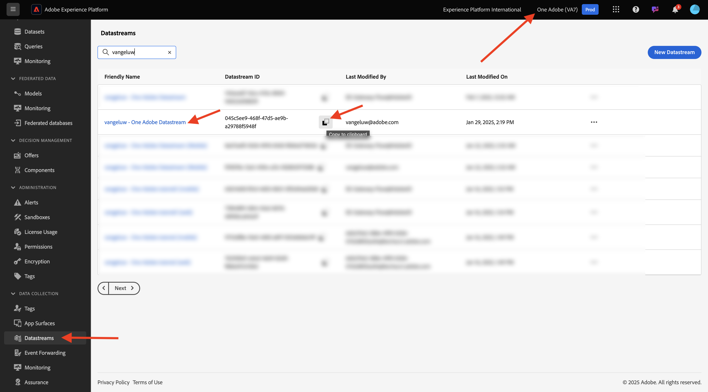
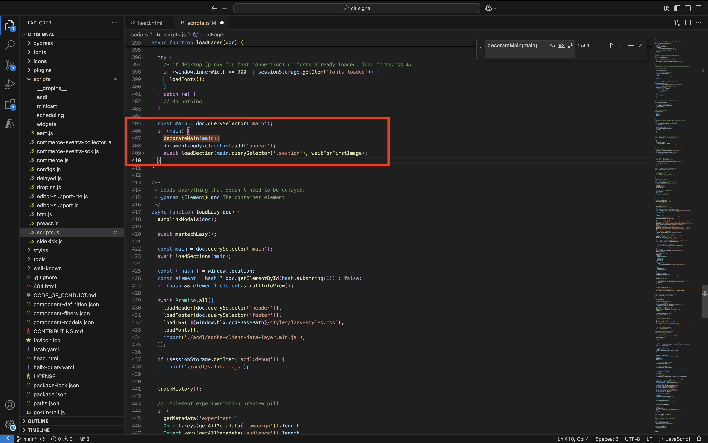
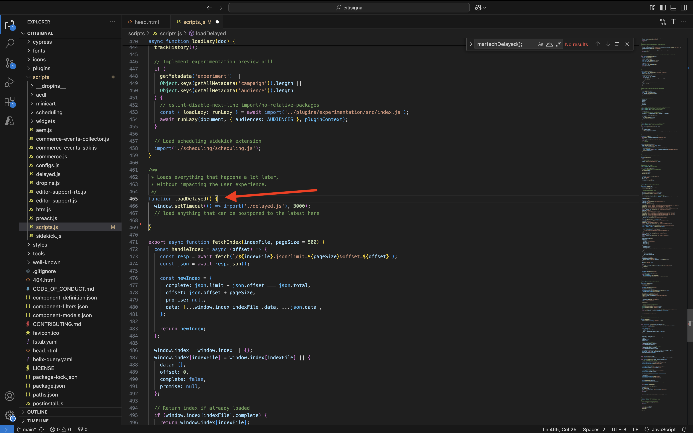
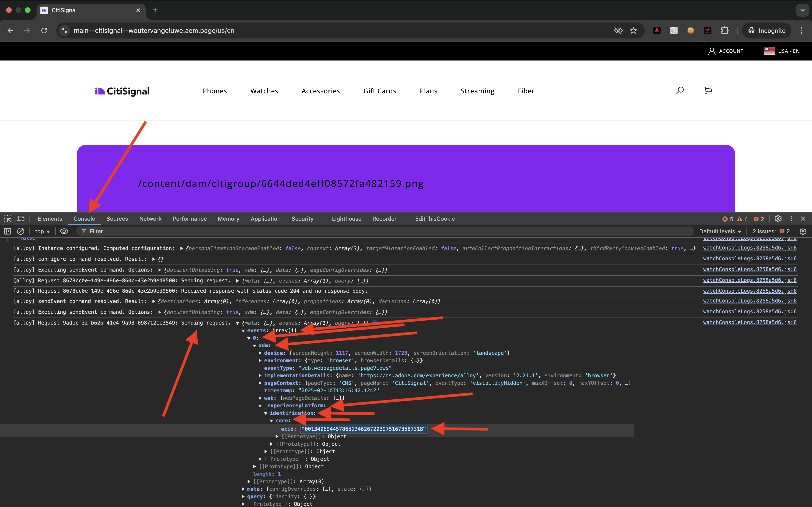

# 1.1.6 AEM Edge Delivery Services MarTech 플러그인

AEM MarTech 플러그인을 사용하면 AEM 프로젝트에 대한 전체 MarTech 스택을 빠르게 설정할 수 있습니다.

>[!NOTE]
>
>이 플러그인은 현재 공동 혁신 프로젝트를 통해 AEM 엔지니어링과 협력하여 고객이 사용할 수 있습니다. [https://github.com/adobe-rnd/aem-martech](https://github.com/adobe-rnd/aem-martech)에서 자세한 정보를 찾을 수 있습니다.

## 1.1.6.1 플러그 인을 저장소에 추가합니다.

**citsignal** GitHub 리포지토리에 사용 중인 폴더로 이동합니다. 폴더 이름을 마우스 오른쪽 단추로 클릭한 다음 **폴더의 새 터미널**&#x200B;을 선택합니다.

{zoomable="yes"}

그러면 이걸 보게 될 거야. 다음 명령을 붙여 넣고 **enter**&#x200B;를 누르십시오.

```
git subtree add --squash --prefix plugins/martech https://github.com/adobe-rnd/aem-martech.git main
```

그럼 이걸 보셔야죠

{zoomable="yes"}

**citsignal** GitHub 리포지토리에 사용 중인 폴더로 이동하여 **plugins** 폴더를 엽니다. 이제 이름이 **martech**&#x200B;인 폴더가 표시됩니다.

{zoomable="yes"}

## 1.1.6.2 head.html

Visual Studio 코드에서 **head.html** 파일을 엽니다. 아래 코드를 복사하여 **head.html** 파일에 붙여넣습니다.

```javascript
<link rel="preload" as="script" crossorigin="anonymous" href="/plugins/martech/src/index.js"/>
<link rel="preload" as="script" crossorigin="anonymous" href="/plugins/martech/src/alloy.min.js"/>
<link rel="preconnect" href="https://edge.adobedc.net"/>
<!-- change to adobedc.demdex.net if you enable third party cookies -->
```

변경 내용을 저장합니다.

{zoomable="yes"}

## 1.1.6.3 scripts.js

Visual Studio 코드에서 **scripts** 폴더로 이동하여 **scripts.js** 파일을 엽니다. 아래 코드를 복사하여 기존 가져오기 스크립트 아래의 **scripts.js** 파일에 붙여넣습니다.

```javascript
import {
  initMartech,
  updateUserConsent,
  martechEager,
  martechLazy,
  martechDelayed,
} from '../plugins/martech/src/index.js';
```

변경 내용을 저장합니다.

{zoomable="yes"}

Visual Studio 코드의 **scripts.js** 파일에서 다음 코드를 찾습니다.

```javascript
const AUDIENCES = {
  mobile: () => window.innerWidth < 600,
  desktop: () => window.innerWidth >= 600,
  // define your custom audiences here as needed
};
```

**const AUDIENCES = {...};**&#x200B;에서 아래 코드를 붙여 넣습니다.

```javascript
  const isConsentGiven = true;
  const martechLoadedPromise = initMartech(
    // The WebSDK config
    // Documentation: https://experienceleague.adobe.com/en/docs/experience-platform/web-sdk/commands/configure/overview#configure-js
    {
      datastreamId: "XXX",
      orgId: "XXX",
      defaultConsent: 'in',
      onBeforeEventSend: (payload) => {
        // set custom Target params 
        // see doc at https://experienceleague.adobe.com/en/docs/platform-learn/migrate-target-to-websdk/send-parameters#parameter-mapping-summary
        payload.data.__adobe.target ||= {};

        // set custom Analytics params
        // see doc at https://experienceleague.adobe.com/en/docs/analytics/implementation/aep-edge/data-var-mapping
        payload.data.__adobe.analytics ||= {};
      },

      // set custom datastream overrides
      // see doc at:
      // - https://experienceleague.adobe.com/en/docs/experience-platform/web-sdk/commands/datastream-overrides
      // - https://experienceleague.adobe.com/en/docs/experience-platform/datastreams/overrides
      edgeConfigOverrides: {
        // Override the datastream id
        // datastreamId: '...'

        // Override AEP event datasets
        // com_adobe_experience_platform: {
        //   datasets: {
        //     event: {
        //       datasetId: '...'
        //     }
        //   }
        // },

        // Override the Analytics report suites
        // com_adobe_analytics: {
        //   reportSuites: ['...']
        // },

        // Override the Target property token
        // com_adobe_target: {
        //   propertyToken: '...'
        // }
      },
    },
    // The library config
    {
      launchUrls: ["XXX"],
      personalization: !!getMetadata('target') && isConsentGiven,
    },
  );
```

{zoomable="yes"}

위의 코드에서 고유한 환경의 변수로 대체해야 하는 두 가지 변수가 있습니다.

- `datastreamId: "XXX"`
- `orgId: "XXX"`
- `launchUrls: ["XXX"]`

다음 지침에 따라 이러한 변수를 찾을 수 있습니다.

### datastreamId

[https://platform.adobe.com/](https://platform.adobe.com/)&#x200B;(으)로 이동한 다음 왼쪽 메뉴에서 **데이터스트림**(으)로 이동합니다. 올바른 샌드박스에 있는지 확인하십시오. 샌드박스는 `--aepSandboxName--`이어야 합니다. 이 자습서의 시작 섹션에서 만든 `--aepUserLdap-- - One Adobe Datastream`(이)라는 이름의 데이터 스트림을 검색합니다. **복사** 아이콘을 클릭하여 **데이터 스트림 ID**&#x200B;을(를) 복사하고 `datastreamId:` 옆에 있는 자리 표시자 값 `XXX`을(를) 바꾸어 **scripts.js** 파일의 Visual Studio 코드에 붙여넣습니다.

{zoomable="yes"}

### orgId

[https://platform.adobe.com/](https://platform.adobe.com/)&#x200B;(으)로 이동한 다음 왼쪽 메뉴에서 **쿼리**(으)로 이동합니다. **자격 증명**&#x200B;에서 **사용자 이름**(으)로 **IMS 조직 ID**&#x200B;을(를) 찾을 수 있습니다. **복사** 아이콘을 클릭하여 **IMS 조직 ID**&#x200B;을(를) 복사하고 `orgId:` 옆에 있는 자리 표시자 값 `XXX`을(를) 바꾸어 **scripts.js** 파일의 Visual Studio 코드에 붙여넣습니다.

{zoomable="yes"}

### launchUrls

[https://platform.adobe.com/](https://platform.adobe.com/)&#x200B;(으)로 이동한 다음 왼쪽 메뉴에서 **태그**(으)로 이동합니다. LDAP를 사용하여 속성을 검색합니다. LDAP는 `--aepUserLdap--`이어야 합니다. 웹 속성을 엽니다.

{zoomable="yes"}

왼쪽 메뉴에서 **환경**(으)로 이동한 다음 **개발** 환경에 대한 **설치** 아이콘을 클릭합니다.

{zoomable="yes"}

필요한 URL을 찾을 수 있지만, URL은 HTML `<script></script>` 태그 내에 있습니다. `https`부터 시작되는 부분만 `.min.js`까지 복사해야 합니다.

{zoomable="yes"}

URL은 다음과 같습니다. `https://assets.adobedtm.com/b754ed1bed61/b9f7c7c484de/launch-5fcd90e5b482-development.min.js`. 오류를 일으킬 수 있는 다른 텍스트가 복사되지 않도록 하십시오. Visual Studio 코드의 **scripts.js** 파일에서 `launchUrls:` 배열의 자리 표시자 값 `XXX`을(를) 바꿉니다.

이제 필요한 세 가지 변수가 있습니다. `scripts.js` 파일은 다음과 같이 표시됩니다.

{zoomable="yes"}

다음으로 검색하여 이 코드 블록을 찾습니다.

```javascript
const main = doc.querySelector('main');
  if (main) {
    decorateMain(main);
    document.body.classList.add('appear');
    await loadSection(main.querySelector('.section'), waitForFirstImage);	
  }
```

{zoomable="yes"}

다음 코드 블록으로 바꿉니다.

```javascript
const main = doc.querySelector('main');
  if (main) {
    decorateMain(main);
    document.body.classList.add('appear');
    await Promise.all([
      martechLoadedPromise.then(martechEager),
      loadSection(main.querySelector('.section'), waitForFirstImage)
    ]);
  }
```

{zoomable="yes"}

그런 다음 을(를) 검색하고 `async function loadLazy(doc) {`(으)로 스크롤합니다.

{zoomable="yes"}

`autolinkModals(doc);` 줄 아래에 다음 코드 줄을 추가합니다.

```javascript
await martechLazy();
```

{zoomable="yes"}

그런 다음 `function loadDelayed() {`행을 검색하고 아래로 스크롤합니다.

{zoomable="yes"}

이 코드 블록을 `// load anything that can be postponed to the latest here`행에 추가합니다.

```javascript
window.setTimeout(() => {
    martechDelayed();
    return import('./delayed.js');
  }, 3000);
```

{zoomable="yes"}

그런 다음 `window.adobeDataLayer.push`이(가) 포함된 줄을 검색하고 이동합니다.

{zoomable="yes"}

`pageContext` 개체가 이와 같이 정의됩니다. 이제 `pageContext` 아래에 개체를 두 개 추가해야 합니다.

```javascript
	pageContext: {
      pageType,
      pageName: document.title,
      eventType: 'visibilityHidden',
      maxXOffset: 0,
      maxYOffset: 0,
      minXOffset: 0,
      minYOffset: 0,
    }
```

추가해야 하는 코드입니다.

```javascript
	,
    _experienceplatform: {
      identification:{
        core:{
          ecid: sessionStorage.getItem("com.adobe.reactor.dataElements.ECID")
        }
      }
    },
    web: {
      webPageDetails:{
        name: document.title,
        URL: window.location.href
      }
    }
```

**window.adobeDataLayer.push**&#x200B;은(는) 이제 다음과 같이 표시됩니다.

```javascript
  window.adobeDataLayer.push({
    pageContext: {
      pageType,
      pageName: document.title,
      eventType: 'visibilityHidden',
      maxXOffset: 0,
      maxYOffset: 0,
      minXOffset: 0,
      minYOffset: 0,
    },
    _experienceplatform: {
      identification:{
        core:{
          ecid: sessionStorage.getItem("com.adobe.reactor.dataElements.ECID")
        }
      }
    },
    web: {
      webPageDetails:{
        name: document.title,
        URL: window.location.href
      }
    }
  });
```

{zoomable="yes"}

이제 **scripts.js** 파일에서 필요한 모든 사항을 변경했습니다.

GitHub Desktop Client를 열고 변경 사항을 커밋합니다.

{zoomable="yes"}

**원본 푸시**&#x200B;를 클릭하여 변경 내용을 GitHub 리포지토리에 푸시합니다.

{zoomable="yes"}

## Tags 속성의 1.1.6.4 ACDL 확장

AEM Edge Delivery Services MarTech 플러그인이 제대로 작동하려면 용 확장을 추가해야 합니다.

[https://experience.adobe.com/#/data-collection/](https://experience.adobe.com/#/data-collection/)&#x200B;(으)로 이동합니다. 이름이 `--aepUserLdap-- - One Adobe (DD/MM/YYYY)`인 웹용 Tags 속성을 검색하여 엽니다.

{zoomable="yes"}

**확장**, **카탈로그**(으)로 이동합니다. 확장 **Adobe 클라이언트 데이터 레이어**&#x200B;를 클릭한 다음 **설치**&#x200B;를 클릭합니다.

{zoomable="yes"}

그럼 이걸 보셔야죠 지금은 아무것도 바꿀 필요가 없습니다. **라이브러리에 저장**&#x200B;을 클릭합니다.

{zoomable="yes"}

그러면 확장이 Tags 속성에 추가됩니다.

{zoomable="yes"}

**Publishing Flow**(으)로 이동하여 **Main** 라이브러리를 엽니다. **변경된 모든 리소스 추가**&#x200B;를 클릭한 다음 **개발에 저장 및 빌드**&#x200B;를 클릭합니다.

{zoomable="yes"}

이제 변경 사항이 배포되었습니다.

## 1.1.6.5 Adobe Experience Platform Edge Network으로 데이터 보내기

이제 GitHub 사용자 계정(이 예에서는 `woutervangeluwe`)으로 XXX를 바꾼 후 `main--citisignal--XXX.aem.page/us/en/` 및/또는 `main--citisignal--XXX.aem.live/us/en/`(으)로 이동하여 웹 사이트에 대한 변경 사항을 볼 수 있습니다.

이 예에서 전체 URL은 다음과 같이 됩니다.
`https://main--citisignal--woutervangeluwe.aem.page/us/en/` 및/또는 `https://main--citisignal--woutervangeluwe.aem.live/us/en/`.

>[!NOTE]
>
>시크릿 웹 페이지를 열어 깔끔한 새 프로필로 데이터 수집을 시작하는지 확인하십시오. 이렇게 하면 디버깅 및 문제 해결이 더 쉬워집니다.

{zoomable="yes"}

Chrome에서 **추가 도구** > **개발자 도구**&#x200B;로 이동하여 **개발자 도구**&#x200B;을 엽니다.

{zoomable="yes"}

**콘솔** 보기에서는 `[alloy]`(으)로 시작하는 여러 줄이 표시됩니다. 요청을 살펴보십시오. 요청 중 하나는 이와 같이 표시되고 이미지에 표시된 요청 본문이 있어야 합니다.

`[alloy] Request 55a9ddbc-0521-4ba3-b527-3da2cb35328a: Sending request.`

페이로드를 열고 `events[0].xdm._experienceplatform.identification.core.ecid` 필드로 드릴다운한 다음 ECID를 복사합니다.

{zoomable="yes"}

## 1.1.6.6 Adobe Experience Platform에서 고객 프로필 보기

URL [https://experience.adobe.com/platform](https://experience.adobe.com/platform)로 이동하여 Adobe Experience Platform에 로그인합니다.

로그인하면 Adobe Experience Platform 홈페이지에 접속하게 됩니다.

{zoomable="yes"}

계속하려면 **샌드박스**&#x200B;를 선택해야 합니다. 선택할 샌드박스 이름이 ``--aepSandboxName--``입니다. 적절한 샌드박스를 선택하면 화면이 변경되고 이제 전용 샌드박스에 있습니다.

{zoomable="yes"}

왼쪽 메뉴에서 **고객** > **프로필** > **찾아보기**(으)로 이동합니다. **ECID**&#x200B;의 **ID 네임스페이스**&#x200B;을(를) 선택한 다음 이전 단계에서 복사한 **ECID**&#x200B;을(를) 지나갑니다. **보기**&#x200B;를 클릭합니다. 그러면 목록에 프로필이 표시되는 것을 볼 수 있습니다. 클릭하여 엽니다.

{zoomable="yes"}

그러면 ECID가 표시되는 **프로필 대시보드** 개요가 표시됩니다. 그런 다음 **이벤트**(으)로 이동합니다.

{zoomable="yes"}

**이벤트**&#x200B;에서 eventType이 **web.webpagedetails.pageViews**&#x200B;인 이벤트를 포함한 여러 경험 이벤트가 표시됩니다. 수집된 모든 이벤트를 보려면 **JSON 보기**&#x200B;를 클릭하십시오.

{zoomable="yes"}

**JSON** 보기에서 eventType **web.webpagedetails.pageViews**&#x200B;로 이벤트를 확인하여 **페이지 이름** 및 **페이지 URL**&#x200B;과 같은 항목을 봅니다.

{zoomable="yes"}

이제 이 연습을 완료했습니다.

다음 단계: [요약 및 이점](./summary.md){target="_blank"}

[Adobe Experience Manager Cloud Service 및 Edge Delivery Services으로 돌아가기](./aemcs.md){target="_blank"}

[모든 모듈로 돌아가기](./../../../overview.md){target="_blank"}
