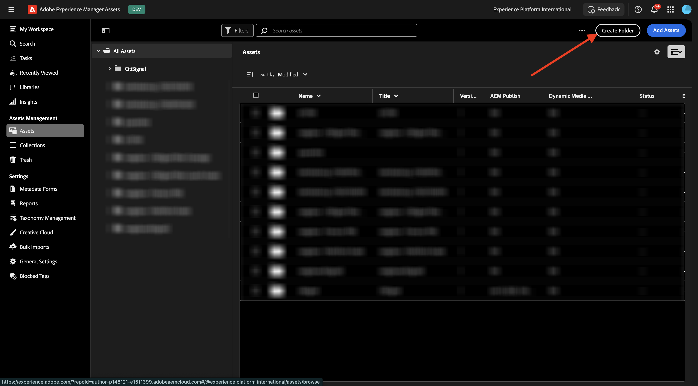
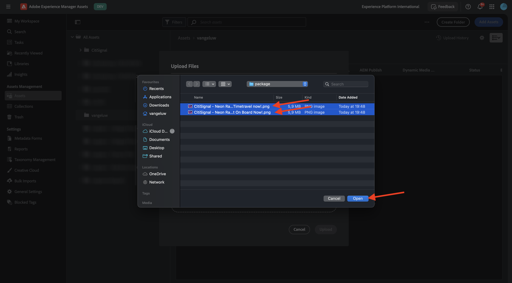

# 1.2.1 AEM Assets 시작하기

[https://experience.adobe.com/](https://experience.adobe.com/){target="_blank"}(으)로 이동합니다. 이름이 `--aepImsOrgName--`이어야 하는 올바른 환경에 있는지 확인하십시오.

**Adobe Experience Manager Assets**&#x200B;을(를) 엽니다.

할당된 AEM Assets CS 환경을 선택합니다. 이 경우 선택할 환경은 `--aepUserLdap-- - CitiSignal dev author`입니다.

그럼 이걸 보셔야죠 **Assets**(으)로 이동합니다.

`--aepUserLdap-- - CitiSignal Fiber Campaign` 폴더를 사용해야 합니다. 아직 존재하지 않으면 **폴더 만들기**&#x200B;를 클릭하세요.

폴더 이름 `--aepUserLdap--`을(를) 입력하고 **만들기**&#x200B;를 클릭합니다.

새로 만든 폴더를 엽니다. 이전 연습 중 하나에서 이름이 `CitiSignal - Neon Rabbit - Get On Board Now!.png` 및 `CitiSignal - Neon Rabbit - Timetravel now!.png`인 2개의 이미지를 만들었습니다. 이제 이러한 이미지가 아직 없는 경우 이 폴더에 업로드해야 합니다.

이 파일이 더 이상 없는 경우 [여기](./images/CitiSignal_Neon_Rabbit.zip){target="_blank"}에서 다운로드할 수 있습니다.

**Assets 추가**&#x200B;를 클릭합니다.

위에서 언급한 2개의 이미지를 선택합니다. **열기를 클릭합니다**.

**업로드**&#x200B;를 클릭합니다.

이미지 중 하나를 클릭하여 선택합니다.

**세부 정보**&#x200B;를 클릭합니다.

이제 특정 파일의 사용 가능한 메타데이터가 표시됩니다.

오른쪽 메뉴에서 **표현물**(으)로 이동합니다. 그런 다음 선택한 이미지에 대해 미리 정의된 다양한 렌디션을 다운로드하는 기능과 함께 표시됩니다.

오른쪽 메뉴에서 **가위** 아이콘을 클릭합니다. Adobe Express에서 제공하는 다양한 편집 작업을 확인할 수 있습니다. **배경 제거**&#x200B;를 클릭합니다.

몇 초 후에 변경 사항을 적용하거나 새 파일을 다운로드할 수 있는 기능과 함께 이와 유사한 항목이 표시됩니다. 팝업을 닫습니다.

클립 **이미지 자르기**.

다양한 자르기 크기의 일부 변형을 테스트할 수 있습니다.

오른쪽 메뉴에서 **작업**(으)로 이동합니다. **작업 할당**&#x200B;을 클릭합니다.

**작업 제목**&#x200B;을(를) `Review image & approve`(으)로 설정합니다. 자신을 할당하십시오. **만들기**&#x200B;를 클릭합니다.

알림에서 **보기**&#x200B;를 클릭합니다.

또는 화면을 새로 고쳐 새로 만든 작업이 **관련 작업** 목록에 표시되는지 확인합니다. 작업의 세부 정보를 보려면 **열기** 단추를 클릭하십시오.

그럼 이런 걸 보셔야겠네요 **승인**&#x200B;을 클릭합니다.

**승인**&#x200B;을 클릭하여 확인합니다.

이제 AEM Assets에서 에셋이 승인되었습니다.

다음 단계: [요약 및 이점](./summary.md){target="_blank"}

[Adobe Experience Manager Assets](./aemassets.md){target="_blank"}(으)로 돌아가기

[모든 모듈로 돌아가기](./../../../overview.md){target="_blank"}
