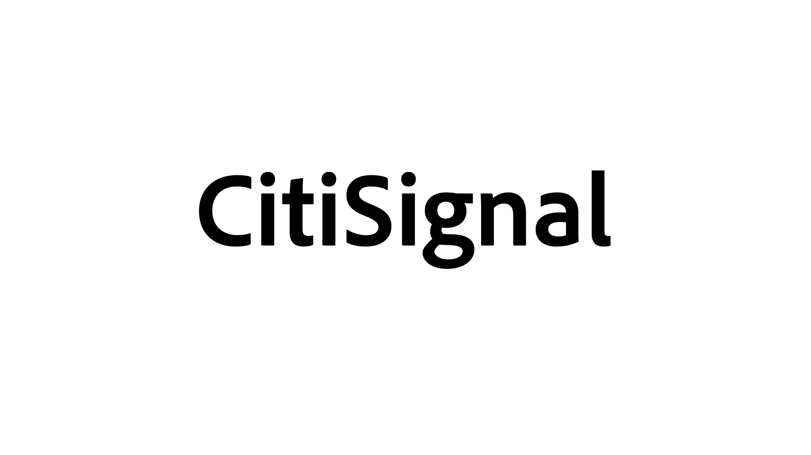
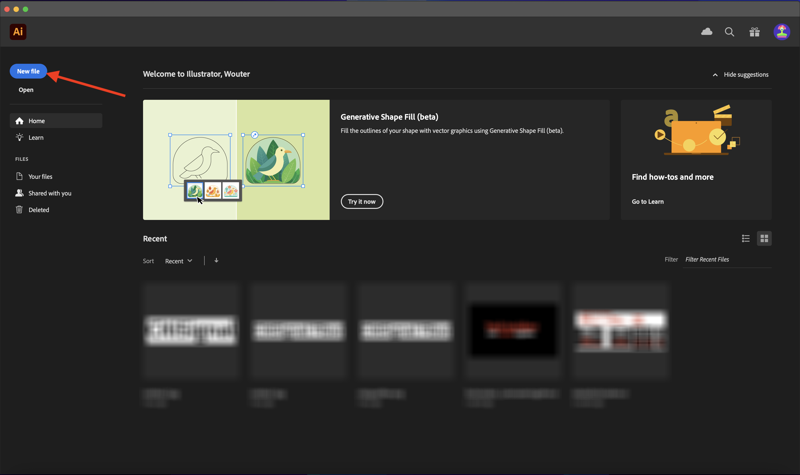
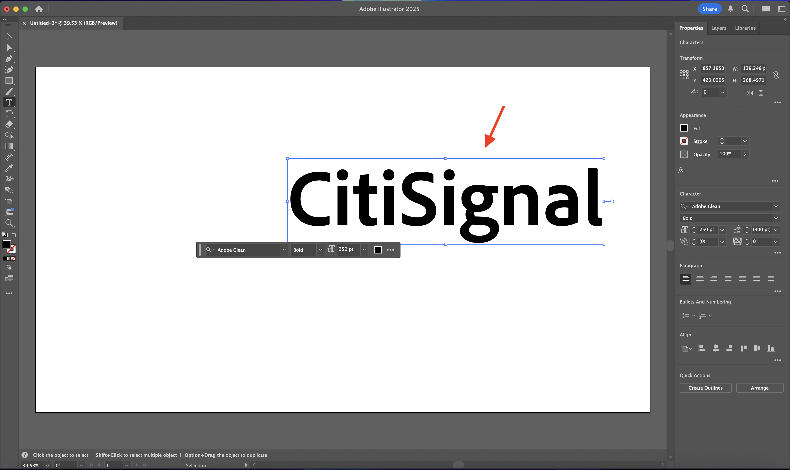

# 1.1.1 Firefly Services 시작하기

Postman 및 Adobe I/O을 사용하여 Adobe Firefly Services API를 쿼리하는 방법에 대해 알아봅니다.

## 1.1.1.1 필수 구성 요소

이 연습을 계속하려면 [Adobe I/O 프로젝트](./../../../modules/getting-started/gettingstarted/ex6.md)의 설정을 완료해야 하며 [Postman](./../../../modules/getting-started/gettingstarted/ex7.md) 또는 [PostBuster](./../../../modules/getting-started/gettingstarted/ex8.md)와 같이 API와 상호 작용하는 응용 프로그램을 구성해야 합니다.

## 1.1.1.2 API 기본 사항

API 요청에는 여러 유형이 있습니다.

- **GET**: 상태 보고서 가져오기와 같이 API 끝점에서 정보를 검색하려고 할 때 사용됩니다.
- **POST**: Adobe Firefly Services에서 새 이미지를 생성하도록 하는 것과 같이 새로운 작업을 수행해야 할 때 사용됩니다
- **PUT**: 기존 데이터를 완전히 업데이트하는 데 사용됩니다.
- **PATCH**: 기존 데이터를 선택적으로 업데이트하는 데 사용됩니다.
- **DELETE**: 데이터를 삭제하는 데 사용됩니다.

API를 사용하여 작업할 때 다양한 API 엔드포인트에서 응답 코드가 반환되는 것을 볼 수도 있습니다.

예상할 수 있는 5가지 유형의 응답이 있습니다.

- **1xx 정보 응답**: 요청을 받았습니다. 프로세스를 계속합니다.
- **2xx 성공**: 요청이 정상적으로 수신, 확인 및 수락되었습니다.
- **3xx 리디렉션**: 요청을 완료하려면 추가 작업을 수행해야 합니다.
- **4xx 클라이언트 오류**: 요청에 잘못된 구문이 포함되어 있거나 완료할 수 없습니다.
- **5xx 서버 오류**: 서버가 올바른 요청을 수행하지 못했습니다.

다음은 일반적인 응답 코드의 예입니다.

- **200 OK**: 좋습니다. 요청이 완료되었습니다.
- **201 생성됨**: 예를 들어 이미지가 생성되었습니다
- **202 수락됨**: 양호한 수준이며 요청이 수락되어 처리됩니다.
- **401 권한 없음**: 올바르지 않습니다. 액세스 토큰이 유효하지 않을 수 있습니다.
- **403 사용할 수 없음**: 올바르지 않습니다. 실행하려는 작업에 필요한 권한이 없을 수 있습니다.
- **404 찾을 수 없음**: 올바르지 않습니다. 연결하려는 URL이 없을 수 있습니다.
- **429 요청이 너무 많음**: 좋지 않습니다. 짧은 기간에 많은 요청을 보냈을 수 있습니다. 나중에 다시 시도하십시오.

## 1.1.1.3 탐색 firefly.adobe.com - 1단계

Adobe Firefly Services을 살펴보도록 하겠습니다. 자세한 내용은 CitiSignal 이미지 생성 예제를 참조하십시오. CitiSignal 디자인 팀이 CitiSignal 브랜드 이름의 네온 버전을 생성하려고 합니다. 이를 위해 Adobe Firefly Services을 사용하고 싶어합니다.

이를 실현하기 위해 가장 먼저 필요한 것은 CitiSignal 브랜드 이름의 흑백 버전이며 다음과 같은 모습입니다.



### 1.1.1.3.1 컴포지션 참조 이미지 만들기

[이 샘플 이미지](./images/CitiSignal.jpg)를 사용하거나 직접 텍스트를 만들어 실험해 볼 수 있습니다. Adobe Illustrator에서 아래 단계에 따라 고유한 이미지 파일을 만듭니다. 미리 정의된 이미지를 사용하는 경우 아래 섹션을 건너뛰고 **1.1.1.2단계로 이동합니다.2 직접 이미지 생성**.

**Adobe Illustrator**&#x200B;을(를) 엽니다. **새 파일**&#x200B;을 클릭합니다.



**Web-Large 1920 x 1080px**&#x200B;을(를) 선택합니다. **만들기**&#x200B;를 클릭합니다.


그럼 이걸 드셔보세요 **T** 텍스트 아이콘을 클릭합니다.


그럼 이걸 드셔보세요


글꼴 유형을 원하는 글꼴로 변경합니다. 이 경우 글꼴 유형은 **Adobe Clean Bold**&#x200B;입니다.


글꼴 크기를 원하는 크기로 변경합니다(이 경우 **250pt**).


그럼 이걸 드셔보세요


텍스트를 원하는 대로 변경하십시오. 이 경우 **CitiSignal**.



파일에서 텍스트를 가운데로 맞춥니다.


**파일 > 내보내기 > 웹용으로 저장(기존)으로 이동**


그럼 이걸 드셔보세요 **저장**&#x200B;을 클릭합니다.


파일 이름을 지정하고 바탕 화면에 저장합니다. **저장**&#x200B;을 클릭합니다.


### 1.1.1.3.2 이미지 생성

[https://firefly.adobe.com](https://firefly.adobe.com)&#x200B;(으)로 이동합니다. **프로필** 아이콘을 클릭하고 올바른 **계정**&#x200B;에 로그인했는지 확인하십시오. 올바른 계정 번호는 `--aepImsOrgName--`입니다. 필요한 경우 **프로필 전환**&#x200B;을 클릭하여 해당 계정으로 전환합니다.


프롬프트 `neon light lettering on a brick wall of a night club`을(를) 입력하십시오. **생성**&#x200B;을 클릭합니다.


그러면 이와 비슷한 것을 드셔야 합니다 이러한 이미지는 아직 유용하지 않습니다. **컴포지션**&#x200B;에서 **이미지 업로드**&#x200B;를 클릭합니다.


앞에서 만든 이미지를 선택하십시오(이 경우 **CitiSignal.jpg**). **열기**&#x200B;를 클릭한 다음 **생성**&#x200B;을 클릭합니다.


그러면 이와 비슷한 것을 드셔야 합니다 컴포지션 참조의 응용 프로그램이 아직 훌륭하지 않습니다. 변경하려면 **강도** 슬라이더를 최대값으로 변경하십시오. **생성**&#x200B;을 다시 클릭합니다.


이제 CitiSignal 브랜드 이름의 네온 버전을 보여주는 몇 가지 이미지가 있으며 이를 사용하여 더 이상 반복할 수 있습니다.


이제 Firefly을 사용하여 몇 분 만에 디자인 문제를 해결하는 방법을 배웠습니다.

## 1.1.1.4 탐색 firefly.adobe.com - 2단계

[https://firefly.adobe.com/generate/image](https://firefly.adobe.com/generate/image)&#x200B;(으)로 이동합니다. 그럼 이걸 보셔야죠 **모델** 드롭다운 목록을 클릭합니다. Adobe Firefly Services에는 3개의 사용 가능한 버전이 있습니다.

- Firefly 이미지 3
- Firefly 이미지 4
- Firefly Image 4 Ultra


>[!NOTE]
>
>Firefly Image 3 및 Image 4는 Adobe Firefly Services을 사용하는 모든 사용자가 사용할 수 있으며 Firefly Image 4 Ultra에는 Firefly Pro 라이센스가 필요합니다.

이 연습에 사용할 **Firefly 이미지 3**&#x200B;을(를) 선택하려면 클릭하세요.


`Horses in a field` 프롬프트를 입력하고 **생성**&#x200B;을 클릭합니다.


그러면 이와 비슷한 것을 볼 수 있을 겁니다.


그런 다음 브라우저에서 **개발자 도구**&#x200B;를 엽니다.


그럼 이걸 보셔야죠 **네트워크** 탭으로 이동합니다. 그런 다음 **생성**&#x200B;을 다시 클릭합니다.


검색어 **generate-async**&#x200B;을(를) 입력하십시오. 그러면 이름이 **generate-async**&#x200B;인 요청이 표시됩니다. 선택한 다음 **페이로드**(으)로 이동하십시오. 그러면 요청 세부 정보가 표시됩니다.


여기에 표시되는 요청은 Firefly Services의 서버측 백엔드에 전송된 요청입니다. 여기에는 몇 가지 중요한 매개 변수가 포함되어 있습니다.

- **prompt**: Firefly에서 생성할 이미지 종류를 요청하는 메시지입니다.

- **시드**: 이 요청에서 시드가 무작위로 생성되었습니다. Firefly에서 이미지를 생성할 때마다 기본적으로 시드 라는 난수를 선택하여 프로세스를 시작합니다. 이 난수는 각 이미지를 고유하게 만드는 요소에 기여하며, 매우 다양한 이미지를 생성하려는 경우에 유용합니다. 그러나 여러 요청에 대해 서로 유사한 이미지를 생성하려는 경우가 있을 수 있습니다. 예를 들어 Firefly에서 Firefly의 다른 옵션(예: 스타일 사전 설정, 참조 이미지 등)을 사용하여 수정할 이미지를 생성하는 경우 이후 HTTP 요청에서 해당 이미지의 시드를 사용하여 이후 이미지의 무작위성을 제한하고 원하는 이미지에 로그인합니다.


UI를 다시 살펴보십시오. **종횡비**&#x200B;을 **와이드스크린(16:9)**(으)로 변경합니다.


**효과**&#x200B;까지 아래로 스크롤하고 **테마**&#x200B;로 이동한 다음 **아트 데코**&#x200B;와 같은 효과를 선택하십시오.


**개발자 도구**&#x200B;가 브라우저에 열려 있는지 확인하십시오. 그런 다음 **생성**&#x200B;을 클릭하고 전송되는 네트워크 요청을 검사합니다.


이제 네트워크 요청의 세부 사항을 검사할 때 다음을 볼 수 있습니다.

- **프롬프트**&#x200B;이(가) 이전 요청과 비교하여 변경되지 않았습니다.
- **시드**&#x200B;이(가) 이전 요청과 비교하여 변경되었습니다.
- **크기**&#x200B;이(가) **종횡비**&#x200B;의 변경에 따라 변경되었습니다.
- **스타일**&#x200B;이(가) 추가되었으며 선택한 **art_deco** 효과에 대한 참조가 있습니다.


다음 연습에서는 **seed** 숫자 중 하나를 사용해야 합니다. 선택의 시드 번호를 적으십시오.

>[!NOTE]
>
>시드 번호는 **생성**&#x200B;을 클릭할 때 선택된 임의의 번호입니다. 여러 **생성**&#x200B;된 요청에서 생성된 이미지에 일관된 모양과 느낌을 주려면 향후 요청에서 선택한 **시드 번호**&#x200B;를 기억하고 지정하는 것이 중요합니다.

다음 연습에서는 Firefly Services을 사용하여 유사한 작업을 수행한 다음 UI 대신 API를 사용합니다. 이 예제에서 시드 숫자는 두 마리의 말이 머리를 마주보고 서로를 바라보는 첫 번째 이미지의 **142194**&#x200B;입니다.

## 1.1.1.5 Adobe I/O - access_token

**Adobe IO - OAuth** 컬렉션에서 이름이 **POST - 액세스 토큰 가져오기**&#x200B;인 요청을 선택하고 **전송**&#x200B;을 선택합니다. 응답에는 새 **accesstoken**&#x200B;이(가) 포함되어야 합니다.


## 1.1.1.6 Firefly Services API, 텍스트 2 이미지, 이미지 3

유효하고 새로운 access_token이 있으므로 첫 번째 요청을 Firefly Services API로 전송할 준비가 되었습니다.

**FF - Firefly Services 기술 내부자** 컬렉션에서 **POST - Firefly - T2I V3**(이)라는 요청을 선택합니다. **Body**(으)로 이동하여 프롬프트를 확인합니다. **보내기**&#x200B;를 클릭합니다.

여기서 사용 중인 요청은 **동기** 요청으로, 몇 초 내에 요청된 이미지가 포함된 응답을 제공합니다.

>[!NOTE]
>
>Firefly Image 4 및 Image 4 Ultra의 릴리스에서는 비동기 요청을 위해 동기 요청이 더 이상 사용되지 않습니다. 이 자습서에서 아래에 비동기 요청에 대한 연습을 찾을 수 있습니다.


응답에서 이미지 URL을 복사(또는 클릭)하고 웹 브라우저에서 열어 이미지를 봅니다.


`horses in a field`을(를) 묘사하는 멋진 이미지를 볼 수 있습니다.


요청 **POST - Firefly - T2I V3**&#x200B;의 **본문**&#x200B;에서 필드 `"promptBiasingLocaleCode": "en-US"` 아래에 다음을 추가하고 변수 `XXX`을(를) Firefly Services UI에서 임의로 사용한 시드 번호 중 하나로 바꿉니다. 이 예제에서 **seed** 숫자는 `142194`입니다.

```json
,
  "seeds": [
    XXX
  ]
```

**보내기**&#x200B;를 클릭합니다. 그러면 Firefly Services에서 생성한 새 이미지가 포함된 응답을 받게 됩니다. 이미지를 열어 봅니다.


그런 다음 사용된 **seed**&#x200B;을(를) 기반으로 약간의 차이가 있는 새 이미지가 표시됩니다. 시드 `142194`은(는) 두 마리의 말이 머리를 마주보고 서 있었다.


그런 다음 요청의 **본문**&#x200B;에서 **POST - Firefly - T2I V3**&#x200B;을(를) **시드** 개체 아래에 **스타일** 개체를 붙여 넣으십시오. 이렇게 하면 생성된 이미지의 스타일이 **art_deco**(으)로 변경됩니다.

```json
,
  "contentClass": "art",
  "styles": {
    "presets": [
      "art_deco"
    ],
    "strength": 50
  }
```

그럼 이걸 드셔보세요 **보내기**&#x200B;를 클릭합니다.


이미지 URL을 클릭하여 엽니다.


이제 이미지가 약간 변경되었습니다. 스타일 사전 설정을 적용할 때 시드 이미지는 더 이상 이전과 동일한 방식으로 적용되지 않습니다. 전반적으로, 생성 AI를 사용할 때 동일한 인풋 매개 변수의 조합이 동일한 이미지가 생성된다고 보기는 매우 어렵습니다.


요청의 **Body**&#x200B;에서 **seeds** 개체에 대한 코드를 제거합니다. **보내기**&#x200B;를 클릭한 다음 응답에서 얻은 이미지 URL을 클릭합니다.

```json
,
  "seeds": [
    XXX
  ]
```


이제 이미지가 다시 약간 변경되었습니다.


## 1.1.1.7 Firefly Services API, 세대 확장

**FF - Firefly Services 기술 내부자** 컬렉션에서 **POST - Firefly - Gen Expand**(이)라는 요청을 선택하고 요청의 **Body**(으)로 이동합니다.

- **크기**: 원하는 해상도를 입력하십시오. 여기에 입력한 값은 이미지의 원래 크기보다 커야 하며 3999보다 클 수 없습니다.
- **image.source.url**: 이 필드에는 확장해야 하는 이미지에 대한 링크가 필요합니다. 이 예제에서는 변수를 사용하여 이전 연습에서 생성된 이미지를 참조합니다.

- **수평 정렬**: 허용되는 값은 `"center"`,`"left`, `"right"`입니다.
- **수직 정렬**: 허용되는 값은 `"center"`,`"top`, `"bottom"`입니다.


응답에 포함된 이미지 URL을 클릭합니다.


이제 이전 연습에서 생성된 이미지가 3999x3999의 해상도로 확장되었음을 알 수 있습니다.


배치 정렬을 변경하면 출력도 약간 달라집니다. 이 예제에서는 배치가 **left, bottom**(으)로 변경되었습니다. **보내기**&#x200B;를 클릭한 다음 을(를) 클릭하여 생성된 이미지 URL을 엽니다.


그런 다음 원본 이미지가 다른 배치에서 사용되어 전체 이미지에 영향을 준다는 것을 확인해야 합니다.


## 1.1.1.8 Firefly Services API, 텍스트 2 이미지, 이미지 4 및 이미지 4 Ultra

Firefly Image Model 4의 최신 릴리스에서는 몇 가지 기능이 개선되었습니다.

- Firefly Image Model 4는 향상된 정의 및 세부 사항을 통해 2K 해상도 출력을 제공합니다.
- Firefly Image Model 4는 텍스트 렌더링, 인간, 동물 및 아키텍처에서 상당한 개선을 제공합니다.
- Firefly Image Model 4는 IP 친화적이고 상업적으로 안전한 생성 AI에 대한 Adobe의 약속을 유지합니다.

Firefly Image Model 4는 사람, 동물 및 세부 장면에 대한 뛰어난 이미지를 제공하며 Image Model 4 Ultra를 사용하여 초현실적인 인간 상호 작용, 건축 요소 및 복잡한 풍경을 통한 이미지를 생성할 수 있습니다&#x200B;.

### 1.1.1.8.1 image4_standard

**FF - Firefly Services 기술 내부자** 컬렉션에서 **POST - Firefly - T2I V4**(이)라는 요청을 선택하고 요청의 **헤더**(으)로 이동합니다.

요청의 URL이 **Firefly Services API, 텍스트 2 이미지, 이미지 3** 요청(**https://firefly-api.adobe.io/v3/images/generate**)과 다릅니다. 이 URL은 **https://firefly-api.adobe.io/v3/images/generate-async**&#x200B;을 가리킵니다. URL에 **-async**&#x200B;을(를) 추가하면 비동기 끝점을 사용하고 있음을 의미합니다.

**Header** 변수에서 **x-model-version**&#x200B;이라는 새 변수를 볼 수 있습니다. Firefly Image 4 및 Image 4 Ultra와 상호 작용할 때 필요한 헤더입니다. 이미지를 생성할 때 Firefly Image 4 또는 Image 4 Ultra를 사용하려면 헤더의 값을 `image4_standard` 또는 `image4_ultra`(으)로 설정해야 합니다. 이 예제에서는 `image4_standard`을(를) 사용합니다.

**x-model-version**&#x200B;을(를) `image4_standard` 또는 `image4_ultra`(으)로 설정하지 않으면 Firefly Services에서 기본적으로 현재 `image3`을(를) 사용합니다.


요청의 **본문**(으)로 이동합니다. 본문에서 4개의 이미지 변형이 요청되고 있음을 알 수 있습니다. 프롬프트가 이전과 변경되지 않았으며, 여전히 **필드의 말**&#x200B;을(를) 생성하도록 요청하고 있습니다. **보내기** 클릭


그러면 즉시 응답을 받게 됩니다. 사용한 이전의 동기 요청과 달리 이 응답에는 생성된 이미지의 이미지 URL이 포함되어 있지 않습니다. 여기에는 시작한 작업의 상태 보고서 URL과 실행 중인 작업을 취소할 수 있는 다른 URL이 포함되어 있습니다.


실행 중인 작업의 상태 보고서를 확인하려면 **FF - Firefly Services 기술 내부자** 컬렉션에서 **GET - Firefly - 상태 보고서 가져오기** 요청을 선택합니다. 클릭하여 연 다음 **보내기**&#x200B;를 클릭합니다.


그러면 방금 시작한 이미지 생성 작업의 상태 보고서가 표시됩니다. **status** 필드를 **running**(이)로 설정할 수 있습니다. 즉, 작업이 아직 완료되지 않았습니다. 이 예제에서 작업 상태는 **성공**(으)로 설정되어 있습니다. 즉, 요청한 이미지가 생성되었습니다.


응답에서 아래로 조금 스크롤하면 Adobe Firefly Services에서 반환되는 총 4개의 이미지 변형이 표시됩니다. 이미지 중 하나의 URL을 클릭(또는 복사)하여 브라우저에서 엽니다.


그러면 필드에 있는 **말의 비현실적인 이미지를 볼 수 있습니다**.


### 1.1.1.8.2 image4_ultra

**FF - Firefly Services 기술 내부자** 컬렉션에서 이름이 **POST - Firefly - T2I V4**&#x200B;인 요청으로 돌아가서 요청의 **헤더**(으)로 이동합니다.

**x-model-version** 변수를 `image4_ultra`(으)로 변경합니다. 이 예제에서는 `image4_standard`을(를) 사용합니다.


요청의 **본문**(으)로 이동합니다. 본문에서는 Firefly Image 4 Ultra와 마찬가지로 이미지 변형 수를 1로 변경하고 동시에 하나의 이미지만 생성할 수 있습니다. 프롬프트가 이전과 변경되지 않았으며, 여전히 **필드의 말**&#x200B;을(를) 생성하도록 요청하고 있습니다. **보내기** 클릭


응답에는 시작한 작업의 상태 보고서 URL이 다시 포함되어 있으며 실행 중인 작업을 취소할 수 있는 다른 URL이 포함되어 있습니다.


실행 중인 작업의 상태 보고서를 확인하려면 **FF - Firefly Services 기술 내부자** 컬렉션에서 **GET - Firefly - 상태 보고서 가져오기** 요청을 선택합니다. 클릭하여 연 다음 **보내기**&#x200B;를 클릭합니다.


그러면 방금 시작한 이미지 생성 작업의 상태 보고서가 표시됩니다. **status** 필드를 **running**(이)로 설정할 수 있습니다. 즉, 작업이 아직 완료되지 않았습니다. 이 예제에서 작업 상태는 **성공**(으)로 설정되어 있습니다. 즉, 요청한 이미지가 생성되었습니다.


그러면 필드에 있는 **말의 비현실적인 이미지를 볼 수 있습니다**.


## 다음 단계

[Microsoft Azure 및 사전 서명된 URL을 사용하여 Firefly 프로세스 최적화](./ex2.md){target="_blank"}(으)로 이동

[Adobe Firefly Services 개요](./firefly-services.md){target="_blank"}로 돌아가기

[모든 모듈](./../../../overview.md){target="_blank"}(으)로 돌아가기
