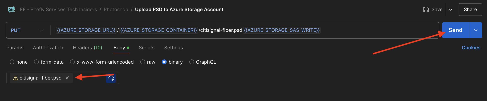
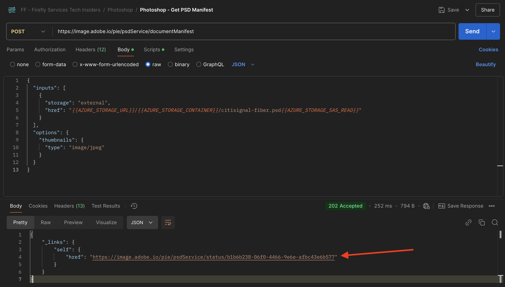

# 1.1.3 Photoshop API 작업

Photoshop API 및 Firefly Services을 사용하여 작업하는 방법을 알아봅니다.

## 1.1.3.1 필수 구성 요소

이 연습을 계속하려면 [Adobe I/O 프로젝트](./../../../modules/getting-started/gettingstarted/ex6.md)의 설정을 완료해야 하며 [Postman](./../../../modules/getting-started/gettingstarted/ex7.md) 또는 [PostBuster](./../../../modules/getting-started/gettingstarted/ex8.md)와 같이 API와 상호 작용하는 응용 프로그램을 구성해야 합니다.

## 1.1.3.2 Adobe I/O - access_token

**Adobe IO - OAuth** 컬렉션에서 이름이 **POST - 액세스 토큰 가져오기**&#x200B;인 요청을 선택하고 **전송**&#x200B;을 선택합니다. 응답에는 새 **accesstoken**&#x200B;이(가) 포함되어야 합니다.


## 1.1.3.3 프로그래밍 방식으로 PSD 파일과 상호 작용

데스크톱에 [citsignal-fiber.psd](./../../../assets/ff/citisignal-fiber.psd){target="_blank"}를 다운로드합니다.

Photoshop에서 **citisignal-fiber.psd**&#x200B;를 엽니다.


**레이어** 창에서 파일의 디자이너가 각 레이어에 고유한 이름을 지정했습니다. Photoshop에서 PSD 파일을 열어 레이어 정보를 볼 수 있지만 프로그래밍 방식으로 수행할 수도 있습니다.

첫 번째 API 요청을 Photoshop API로 전송하겠습니다.

### Photoshop API - Hello World

다음으로 모든 권한 및 액세스가 올바르게 설정되었는지 테스트하기 위해 Photoshop API에 대해 알아보겠습니다.

**Photoshop** 컬렉션에서 **Photoshop Hello(테스트 인증) 요청을 엽니다.** 질문에 답합니다. **보내기**&#x200B;를 선택합니다.


**Photoshop API에 오신 것을 환영합니다!** 응답을 받게 됩니다.


그런 다음 PSD 파일 **citisignal-fiber.psd**&#x200B;과(와) 프로그래밍 방식으로 상호 작용하려면 저장소 계정에 업로드해야 합니다. Azure 스토리지 탐색기를 사용하여 컨테이너에 끌어다 놓아 수동으로 수행할 수 있지만, 이번에는 API를 통해 수행해야 합니다.

### Azure에 PSD 업로드

Postman에서 **Azure 저장소 계정에 PSD 업로드** 요청을 엽니다. 이전 연습에서는 이제 사용할 Postman에서 다음 환경 변수를 구성했습니다.

- `AZURE_STORAGE_URL`
- `AZURE_STORAGE_CONTAINER`
- `AZURE_STORAGE_SAS_READ`
- `AZURE_STORAGE_SAS_WRITE`

**PSD을 Azure 저장소 계정에 업로드** 요청에서 볼 수 있듯이 URL은 이러한 변수를 사용하도록 구성되어 있습니다.


**Body**&#x200B;에서 **citisignal-fiber.psd** 파일을 선택합니다.


화면이 다음과 같아야 합니다. **보내기**&#x200B;를 선택합니다.



Azure에서 이 빈 응답을 다시 가져와야 합니다. 즉, 파일은 Azure 저장소 계정의 컨테이너에 저장됩니다.


Azure Storage Explorer를 사용하여 파일을 보는 경우 폴더를 새로 고치십시오.


### Photoshop API - 매니페스트 가져오기

그런 다음 PSD 파일의 매니페스트 파일을 가져와야 합니다.

Postman에서 요청 **Photoshop - PSD 매니페스트 가져오기**&#x200B;를 엽니다. **본문**(으)로 이동합니다.

본문은 다음과 같아야 합니다.

```json
  {
    "inputs": [
      {
        "storage": "external",
        "href": "{{AZURE_STORAGE_URL}}/{{AZURE_STORAGE_CONTAINER}}/citisignal-fiber.psd{{AZURE_STORAGE_SAS_READ}}"
      }
    ],
    "options": {
      "thumbnails": {
        "type": "image/jpeg"
      }
    }
  }
```

**보내기**&#x200B;를 선택합니다.

응답에서 이제 링크가 표시됩니다. Photoshop의 작업이 완료되는 데 시간이 걸릴 수 있으므로 Photoshop은 대부분의 수신 요청에 대한 응답으로 상태 파일을 제공합니다. 요청의 상황을 이해하려면 상태 파일을 읽어야 합니다.



상태 파일을 읽으려면 **Photoshop - PS 상태 가져오기** 요청을 여십시오. 이 요청에서 변수를 URL로 사용하고 있음을 확인할 수 있습니다. 이 URL은 보낸 이전 요청인 **Photoshop - PSD 매니페스트 가져오기**&#x200B;에 의해 설정된 변수입니다. 변수가 각 요청의 **스크립트**&#x200B;에 설정되어 있습니다. **보내기**&#x200B;를 선택합니다.


화면이 다음과 같아야 합니다. 현재 상태가 **보류 중**(으)로 설정되어 있습니다. 즉, 프로세스가 아직 완료되지 않았습니다.


상태가 **성공**(으)로 변경될 때까지 **Photoshop - PS 상태 가져오기**&#x200B;에서 두 번 더 보내기를 선택하십시오. 몇 분 정도 걸릴 수 있습니다.

응답을 사용할 수 있으면 json 파일에 PSD 파일의 모든 레이어에 대한 정보가 포함되어 있는 것을 볼 수 있습니다. 이 정보는 레이어 이름이나 레이어 ID와 같은 것을 식별할 수 있으므로 유용합니다.


예를 들어 `2048x2048-cta` 텍스트를 검색합니다. 화면은 다음과 같아야 합니다.


### Photoshop API - SmartObject 바꾸기

그런 다음 이전 연습 중 하나에서 Firefly을 사용하여 생성한 이미지를 사용하여 citigsignal-fiber.psd 파일의 배경을 변경해야 합니다.

Postman에서 **Photoshop - SmartObject 바꾸기** 요청을 열고 **본문**(으)로 이동합니다.

화면은 다음과 같아야 합니다.

- 먼저 입력 파일을 지정했습니다. `citisignal-fiber.psd`
- 두 번째로 변경할 레이어와 사용할 새 배경 파일이 지정됩니다
- 셋째, 출력 파일이 지정되었습니다. `citisignal-fiber-replacedbg.psd`

```json
  {
    "inputs": [
        {
            "storage": "azure",
            "href": "{{AZURE_STORAGE_URL}}/{{AZURE_STORAGE_CONTAINER}}/citisignal-fiber.psd{{AZURE_STORAGE_SAS_READ}}"
        }
    ],
    "options": {
        "layers": [
            {
                "name": "2048x2048-image",
                "input": {
                    "href": "{{FIREFLY_COMPLETED_ASSET_URL}}",
                    "storage": "external"
                }
            }
        ]
    },
    "outputs": [
        {
            "storage": "azure",
            "href": "{{AZURE_STORAGE_URL}}/{{AZURE_STORAGE_CONTAINER}}/citisignal-fiber-replacedbg.psd{{AZURE_STORAGE_SAS_WRITE}}",
            "type": "vnd.adobe.photoshop",
            "overwrite": true
        }
    ]
}
```

원본 입력 파일을 재정의하지 않으려는 경우 출력 파일의 이름이 다릅니다.

**보내기**&#x200B;를 선택합니다.


이전과 마찬가지로 응답에는 진행 상황을 계속 추적하는 상태 파일을 가리키는 링크가 포함되어 있습니다.


상태 파일을 읽으려면 **Photoshop - PS 상태 가져오기** 요청을 열고 **보내기**&#x200B;를 선택하십시오. 상태가 즉시 **성공**(으)로 설정되지 않은 경우 몇 초 정도 기다린 후 **보내기**&#x200B;를 다시 선택하십시오.

출력 파일을 다운로드할 URL을 선택합니다.


파일을 컴퓨터에 다운로드한 후 **citisignal-fiber-replacedbg.psd**&#x200B;을 엽니다. 다음과 같이 배경 이미지가 유사한 이미지로 변경되었음을 알 수 있습니다.


Azure 저장소 탐색기를 사용하여 컨테이너에서 이 파일을 볼 수도 있습니다.


### Photoshop API - 텍스트 변경

그런 다음 API를 사용하여 call to action에 대한 텍스트를 변경해야 합니다.

Postman에서 **Photoshop - 텍스트 변경** 요청을 열고 **본문**(으)로 이동합니다.

화면은 다음과 같아야 합니다.

- 먼저, 입력 파일 `citisignal-fiber-replacedbg.psd`을(를) 지정합니다. 이 파일은 배경 이미지를 변경할 때 이전 단계에서 생성된 파일입니다
- 두 번째로 변경할 레이어가 지정되고 변경할 텍스트가 지정됩니다
- 셋째, 출력 파일이 지정되었습니다. `citisignal-fiber-changed-text.psd`

```json
  {
  "inputs": [
    {
      "storage": "external",
      "href": "{{AZURE_STORAGE_URL}}/{{AZURE_STORAGE_CONTAINER}}/citisignal-fiber-replacedbg.psd{{AZURE_STORAGE_SAS_READ}}"
    }
  ],
  "options": {
    "layers": [
      {
        "name": "2048x2048-cta",
        "text": {
          "content": "Get Fiber now!"
        }
      }
    ]
  },
  "outputs": [
    {
      "storage": "azure",
      "href": "{{AZURE_STORAGE_URL}}/{{AZURE_STORAGE_CONTAINER}}/citisignal-fiber-changed-text.psd{{AZURE_STORAGE_SAS_WRITE}}",
      "type": "vnd.adobe.photoshop",
      "overwrite": true
    }
  ]
}
```

원본 입력 파일을 재정의하지 않으려는 경우 출력 파일의 이름이 다릅니다.

**보내기**&#x200B;를 선택합니다.


이전과 마찬가지로 응답에는 진행 상황을 계속 추적하는 상태 파일을 가리키는 링크가 포함되어 있습니다.


상태 파일을 읽으려면 **Photoshop - PS 상태 가져오기** 요청을 열고 **보내기**&#x200B;를 선택하십시오. 상태가 즉시 **성공**(으)로 설정되지 않은 경우 몇 초 정도 기다린 후 **보내기**&#x200B;를 다시 선택하십시오.

출력 파일을 다운로드할 URL을 선택합니다.


파일을 컴퓨터에 다운로드한 후 **citsignal-fiber-changed-text.psd**&#x200B;을 엽니다. call to action의 자리 표시자가 **지금 Fibre 가져오기!** 텍스트로 대체되었습니다.


Azure 저장소 탐색기를 사용하여 컨테이너에서 이 파일을 볼 수도 있습니다.


## 다음 단계

[Firefly 사용자 지정 모델 API](./ex4.md){target="_blank"}(으)로 이동

[Adobe Firefly Services 개요](./firefly-services.md){target="_blank"}로 돌아가기

[모든 모듈](./../../../overview.md){target="_blank"}(으)로 돌아가기