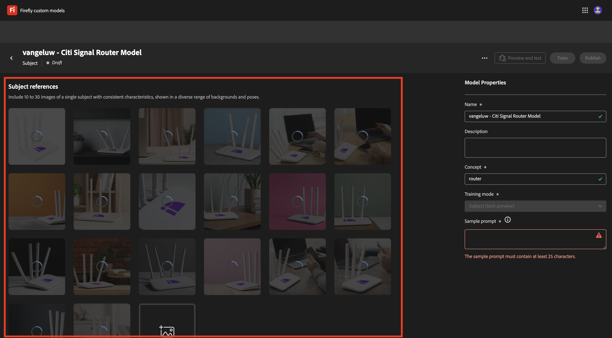

# 1.1.4 Firefly 사용자 지정 모델 API

## 1.1.4.1 Firefly 사용자 지정 모델이란 무엇입니까?

Firefly 사용자 지정 모델을 사용하면 이미지에 텍스트 기능을 사용하여 브랜드에 맞는 이미지 변형을 생성할 수 있습니다. 이러한 모델을 나만의 이미지로 교육하면 브랜드의 정체성을 반영하는 콘텐츠를 생성할 수 있습니다.
스타일 또는 주제를 변형하여 새로운 아이디어를 탐색하고, 다른 환경을 시각화하고, 혁신적인 콘텐츠를 생성하고, 콘텐츠를 특정 세그먼트에 맞춤화할 수 있습니다.

Firefly 맞춤형 모델을 사용하여 다음을 수행할 수 있습니다.

- 온브랜드 아이디어 및 개념 만들기
- 일관된 스타일로 문자 테마 제작
- 일관된 브랜드 스타일을 만들어 캠페인을 빠르게 확장

이를 위해 Firefly 맞춤형 모델 은 다음을 지원합니다.

- 사용자 정의 주제 모델
- 사용자 정의 스타일 모델

### 사용자 정의 주제 모델

개체든 문자든 특정 주제에 대한 사용자 정의 모델을 교육할 때 대상자의 필수 기능을 식별하고 모델이 다양한 컨텍스트와 위치에서 이를 복제하도록 지원하는 것이 목표입니다.

주제 모델을 교육할 때 다음 특성을 가진 이미지를 찾습니다.

- 개체 일관성: 피사체가 이미지에서 광범위하게 다르게 보이지 않도록 하면서 피사체와 동일한 제조업체 및 모델의 이미지를 제공합니다. 여러 색상을 혼합하지 않도록 하고 이미지 간에 공통적인 테마나 패턴을 유지합니다. 그러나, 당신의 주제는 장면, 포즈, 의상, 배경에 따라 다를 수 있습니다.
- 오브젝트 초점: 불필요한 산만함 없이 명확한 초점 안에 피사체의 이미지를 사용하십시오. 피사체를 이미지의 중앙 근처에 두며 이미지 면적의 25% 이상을 차지하도록 합니다.
- 환경 컨텍스트: 다양한 보기 및 컨텍스트에서 주체의 이미지를 제공하여 다양한 조명 조건에서 보여 줍니다. 배경이 흰색이나 투명한 이미지를 사용할 수 있지만 보다 복잡한 환경도 섞어 사용하는 것이 좋습니다.
- 다른 개체 사용 안 함: 배경에 있거나 문자와 연관된 큰 항목을 사용하지 마십시오. 이미지에 표시된 모든 큰 항목은 모델에서 기억되며 교육 데이터 세트의 동일한 항목과 유사하게 생성된 이미지에 표시됩니다.

### 사용자 정의 스타일 모델

스타일에 대해 교육된 사용자 정의 모델은 메시지가 표시되면 에셋의 모양과 느낌을 식별하여 유사한 이미지를 생성합니다.

효과적인 스타일 모델을 교육하려면

- 유사한 미학 제공: 동일한 모양과 느낌을 유지하면서 다양한 장면과 오브젝트를 보여 주는 이미지를 포함합니다.
- 다양한 이미지 사용: 모델이 원치 않는 개체 또는 주제에 너무 많이 집중하지 않도록 할 수 있는 한 많은 이미지를 사용하십시오.
- 고정 구 피하기: 고정 패턴은 다른 구문보다 가중치가 큽니다. 예를 들어 모든 캡션에 &quot;배경이 단색 검은색&quot; 또는 &quot;귀여운 만화 스타일&quot;이 포함된 경우 모델은 이 구문에 따라 달라지며, 이 구문이 없는 테스트 프롬프트는 원하는 결과를 생성하지 않습니다.

## 1.1.4.2 사용자 지정 모델 구성

[https://firefly.adobe.com/](https://firefly.adobe.com/)&#x200B;(으)로 이동합니다. **사용자 지정 모델**&#x200B;을 클릭합니다.

{zoomable="yes"}

이 메시지가 표시됩니다. 계속하려면 **동의**&#x200B;를 클릭하세요.

{zoomable="yes"}

그럼 이걸 보셔야죠 **모델 교육**&#x200B;을 클릭합니다.

{zoomable="yes"}

다음 필드를 구성합니다.

- **이름**: `--aepUserLdap-- - Citi Signal Router Model` 사용
- **교육 모드**: **제목(기술 미리 보기) 선택**
- **개념**: `router` 입력
- **저장 위치**: 드롭다운 목록을 열고 **+ 새 프로젝트 만들기** 클릭

{zoomable="yes"}

새 프로젝트에 이름을 지정하십시오. `--aepUserLdap-- - Custom Models`. **만들기**&#x200B;를 클릭합니다.

{zoomable="yes"}

그럼 이걸 보셔야죠 **계속**&#x200B;을 클릭합니다.

{zoomable="yes"}

이제 교육할 사용자 정의 모델에 대한 참조 이미지를 제공해야 합니다. **컴퓨터에서 이미지 선택**&#x200B;을 클릭합니다.

{zoomable="yes"}

참조 이미지 [여기](https://one-adobe-tech-insiders.s3.us-west-2.amazonaws.com/CitiSignal_router.zip)를 다운로드하십시오. 다운로드 파일의 압축을 풀고 해당 파일을 제공합니다.

{zoomable="yes"}

다운로드 이미지 파일이 포함된 폴더로 이동합니다. 모두 선택하고 **열기**&#x200B;를 클릭합니다.

{zoomable="yes"}

그러면 이미지가 로드되는 것을 볼 수 있습니다.

{zoomable="yes"}

몇 분 후에 이미지가 올바르게 로드됩니다. 일부 이미지에 오류가 있는 것은 이미지의 캡션이 생성되지 않았거나 너무 길지 않기 때문입니다. 오류가 있는 각 이미지를 검토하고 요구 사항을 충족하고 이미지를 설명하는 캡션을 입력합니다.

{zoomable="yes"}

모든 이미지에 요구 사항을 충족하는 캡션이 추가되더라도 샘플 프롬프트를 제공해야 합니다. &#39;router&#39;라는 단어를 사용하는 프롬프트를 입력하십시오. 이를 완료하면 모델 교육을 시작할 수 있습니다. **교육**&#x200B;을 클릭합니다.

{zoomable="yes"}

그러면 이걸 보게 될 거야. 모델을 교육하는 데 20~30분 이상 걸릴 수 있습니다.

{zoomable="yes"}

20~30분 후 모델이 이제 교육되어 게시될 수 있습니다. **게시**&#x200B;를 클릭합니다.

{zoomable="yes"}

**게시**&#x200B;를 다시 클릭합니다.

{zoomable="yes"}

**사용자 지정 모델 공유** 팝업을 닫습니다.

{zoomable="yes"}

## 1.1.4.3 UI에서 사용자 지정 모델 사용

[https://firefly.adobe.com/cme/train](https://firefly.adobe.com/cme/train)&#x200B;(으)로 이동합니다. 사용자 정의 모델을 클릭하여 엽니다.

{zoomable="yes"}

**미리 보기 및 테스트**&#x200B;를 클릭합니다.

{zoomable="yes"}

그런 다음 실행되기 전에 입력한 샘플 프롬프트가 표시됩니다.

{zoomable="yes"}

## 1.1.4.4 Firefly Services 사용자 지정 모델 API에 대해 사용자 지정 모델을 사용하도록 설정합니다.

사용자 지정 모델이 교육되면 API를 통해서도 사용할 수 있습니다. 연습 1.1.1에서는 API를 통해 Firefly Services과의 상호 작용을 위해 Adobe I/O 프로젝트를 이미 구성했습니다.

[https://firefly.adobe.com/cme/train](https://firefly.adobe.com/cme/train)&#x200B;(으)로 이동합니다. 사용자 정의 모델을 클릭하여 엽니다.

{zoomable="yes"}

세 점 **..**&#x200B;을(를) 클릭한 다음 **공유**&#x200B;를 클릭합니다.

{zoomable="yes"}

Firefly 사용자 지정 모델에 액세스하려면 Adobe I/O 프로젝트의 **기술 계정 전자 메일**&#x200B;에 사용자 지정 모델을 공유해야 합니다.

**기술 계정 전자 메일**&#x200B;을 검색하려면 [https://developer.adobe.com/console/projects](https://developer.adobe.com/console/projects)&#x200B;(으)로 이동하십시오. 프로젝트를 열려면 클릭하세요. 프로젝트 이름은 `--aepUserLdap-- One Adobe tutorial`입니다.

{zoomable="yes"}

**OAuth 서버 간**&#x200B;을 클릭합니다.

{zoomable="yes"}

**기술 계정 전자 메일**&#x200B;을 복사하려면 클릭하세요.

{zoomable="yes"}

**기술 계정 전자 메일**&#x200B;을 붙여넣고 **편집하려면 초대**&#x200B;를 클릭하세요.

{zoomable="yes"}

이제 **기술 계정 전자 메일**&#x200B;에서 사용자 지정 모델에 액세스할 수 있습니다.

{zoomable="yes"}

## 1.1.4.5 Firefly Services 사용자 지정 모델 API와 상호 작용

연습 1.1.1 Firefly Services 시작에서 이 파일 [postman-ff.zip](./../../../assets/postman/postman-ff.zip)을 로컬 데스크톱에 다운로드한 다음 Postman에서 해당 컬렉션을 가져왔습니다.

Postman을 열고 **FF - 사용자 지정 모델 API** 폴더로 이동합니다.

{zoomable="yes"}

**1 요청을 엽니다. FF - getCustomModels** 및 **보내기**&#x200B;를 클릭합니다.

{zoomable="yes"}

이전에 만든 사용자 지정 모델(`--aepUserLdap-- - Citi Signal Router Model`)이 응답의 일부로 표시됩니다. 필드 **assetId**&#x200B;은(는) 다음 요청에서 참조되는 사용자 지정 모델의 고유 식별자입니다.

{zoomable="yes"}

**2 요청을 엽니다.** 비동기 이미지를 생성합니다. 이 예에서는 사용자 정의 모델을 기반으로 2개의 변형을 생성하도록 요청합니다. 이 경우 `a white router on a volcano in Africa`인 프롬프트를 자유롭게 업데이트하십시오.

**보내기**&#x200B;를 클릭합니다.

{zoomable="yes"}

응답에 필드 **jobId**&#x200B;이(가) 있습니다. 이 2개의 이미지를 생성하는 작업이 현재 실행 중이며 다음 요청을 사용하여 상태를 확인할 수 있습니다.

{zoomable="yes"}

요청 **3을(를) 엽니다. CM 상태**&#x200B;을(를) 가져오고 **보내기**&#x200B;를 클릭합니다. 그런 다음 상태가 실행 중으로 설정되어 있는지 확인해야 합니다.

{zoomable="yes"}

몇 분 후 **3 요청에 대해 다시**&#x200B;보내기&#x200B;**를 클릭하세요. CM 상태**&#x200B;을(를) 가져옵니다. 그런 다음 상태가 **성공**(으)로 변경되고 출력의 일부로 두 개의 이미지 URL이 표시됩니다. 두 파일을 모두 열려면 를 클릭합니다.

{zoomable="yes"}

이 예에서 생성된 첫 번째 이미지입니다.

{zoomable="yes"}

이 예에서 생성된 두 번째 이미지입니다.

{zoomable="yes"}

이제 이 연습을 완료했습니다.

## 다음 단계

[요약 및 혜택](./summary.md){target="_blank"}(으)로 이동

[Photoshop API 작업](./ex3.md){target="_blank"}(으)로 돌아가기

[Adobe Firefly Services 개요](./firefly-services.md){target="_blank"}로 돌아가기
