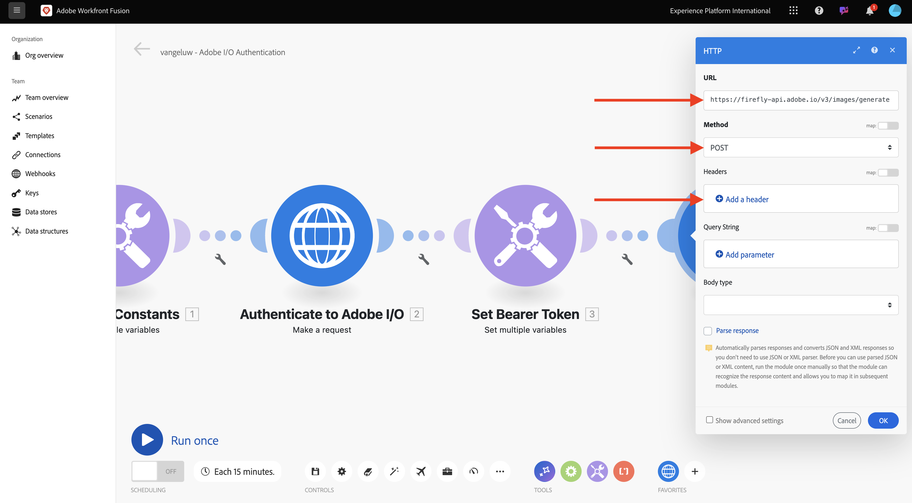
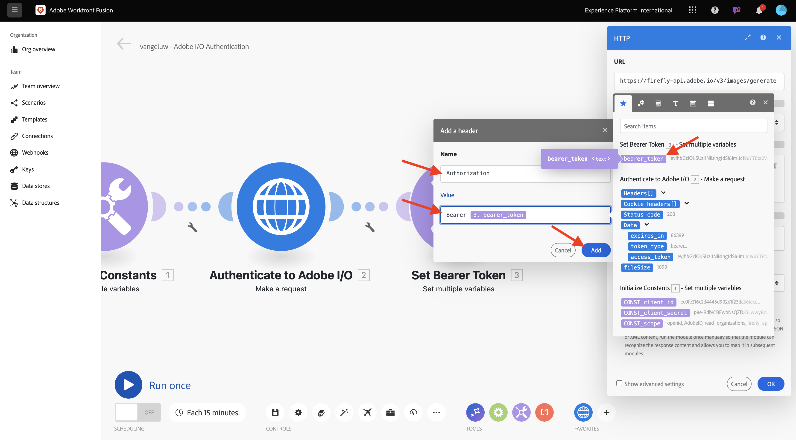
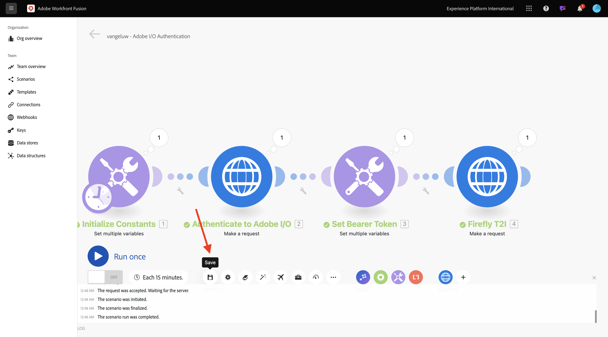
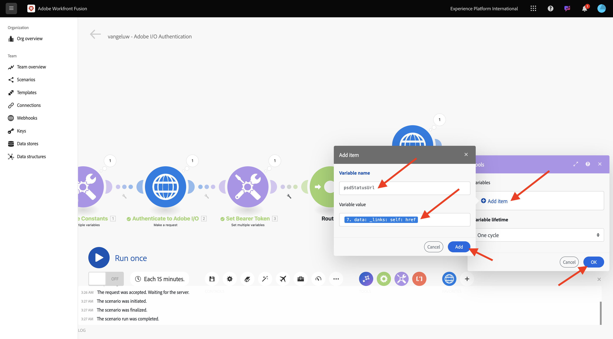
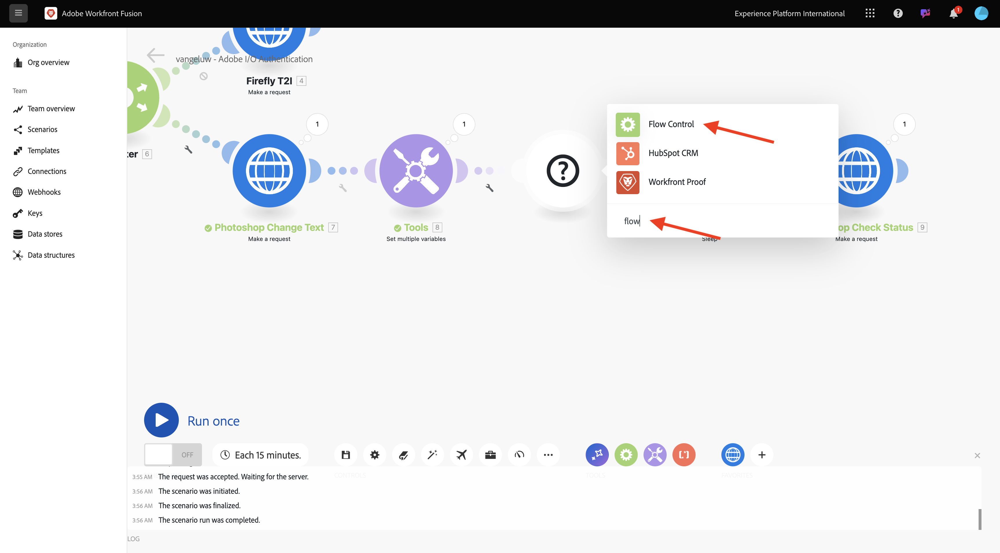
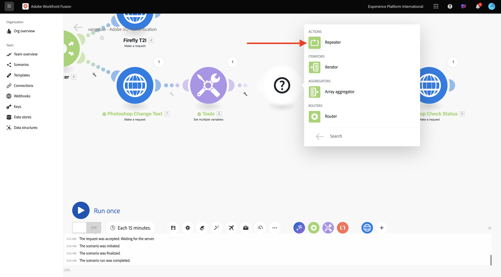
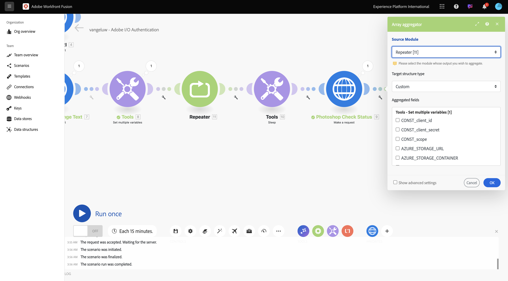
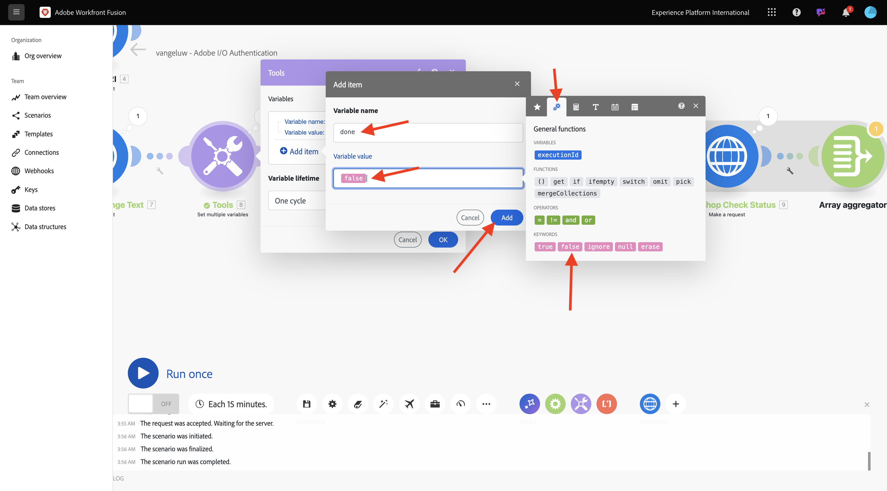
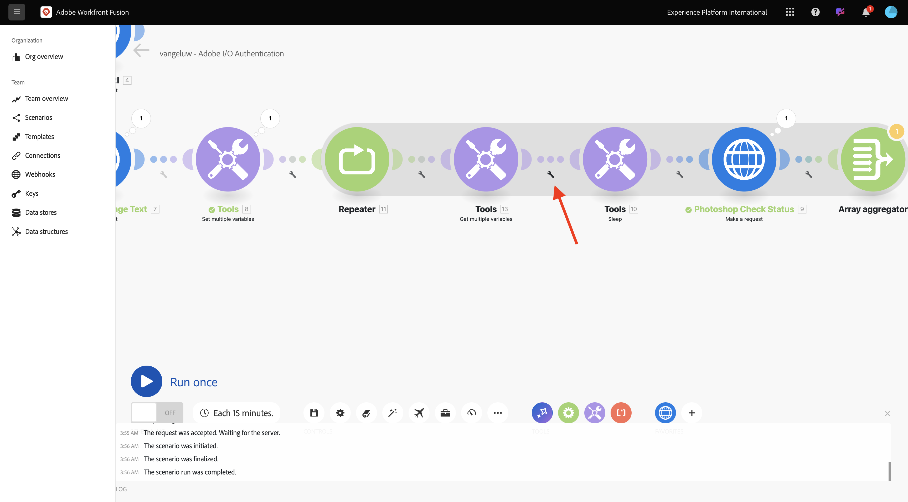
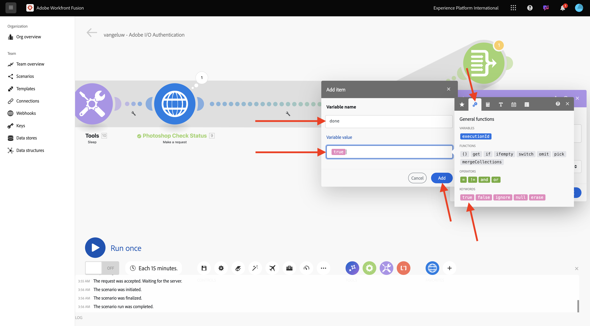

# 1.2.2 Workfront Fusion에서 Adobe API 사용

Workfront Fusion에서 Adobe API를 사용하는 방법에 대해 알아봅니다.

## 1.2.2.1 Firefly 텍스트를 사용하여 Workfront Fusion으로 API를 이미징합니다

두 번째 **여러 변수 설정** 노드 위로 마우스를 가져간 후 **+**&#x200B;을(를) 선택하여 다른 모듈을 추가합니다.


**http**&#x200B;을(를) 검색하고 **HTTP**&#x200B;을(를) 선택하십시오.


**요청**&#x200B;을 선택합니다.


다음 변수를 선택합니다.

- **URL**: `https://firefly-api.adobe.io/v3/images/generate`
- **메서드**: `POST`

**헤더 추가**&#x200B;를 선택합니다.



다음 헤더를 입력합니다.

| 키 | 값 |
|:-------------:| :---------------:| 
| `x-api-key` | `CONST_client_id`에 대해 저장된 변수 |
| `Authorization` | `Bearer ` + `bearer_token`에 대해 저장된 변수 |
| `Content-Type` | `application/json` |
| `Accept` | `*/*` |

`x-api-key`에 대한 세부 정보를 입력하십시오. **추가**&#x200B;를 선택합니다.


**헤더 추가**&#x200B;를 선택합니다.


`Authorization`에 대한 세부 정보를 입력하십시오. **추가**&#x200B;를 선택합니다.



**헤더 추가**&#x200B;를 선택합니다. `Content-Type`에 대한 세부 정보를 입력하십시오. **추가**&#x200B;를 선택합니다.


**헤더 추가**&#x200B;를 선택합니다. `Accept`에 대한 세부 정보를 입력하십시오. **추가**&#x200B;를 선택합니다.


**본문 유형**&#x200B;을(를) **원시**(으)로 설정합니다. **콘텐츠 형식**&#x200B;의 경우 **JSON(application/json)**&#x200B;을(를) 선택하십시오.


이 페이로드를 **콘텐츠 요청** 필드에 붙여 넣으십시오.

```json
{
	"numVariations": 1,
	"size": {
		"width": 2048,
      "height": 2048
    },
    "prompt": "Horses in a field",
    "promptBiasingLocaleCode": "en-US"
}
```

**구문 분석 응답**&#x200B;에 대한 상자를 선택합니다. **확인**&#x200B;을 선택합니다.


**한 번 실행**&#x200B;을 선택하세요.


화면이 다음과 같아야 합니다.


**선택네 번째 노드 HTTP의** 아이콘으로 응답을 볼 수 있습니다. 응답에 이미지 파일이 표시됩니다.


이미지 URL을 복사하여 브라우저 창에서 엽니다. 화면은 다음과 같아야 합니다.


**HTTP**&#x200B;를 마우스 오른쪽 단추로 클릭하고 **Firefly T2I**(으)로 이름을 바꿉니다.


변경 내용을 저장하려면 **저장**&#x200B;을 선택하세요.



## 1.2.2.2 Workfront Fusion에서 Photoshop API 사용

**전달자 토큰 설정** 및 **Firefly T2I** 노드 중에서 **렌치**&#x200B;을(를) 선택하십시오. **라우터 추가**&#x200B;를 선택하십시오.


**Firefly T2I** 개체를 마우스 오른쪽 단추로 클릭하고 **복제**&#x200B;를 선택합니다.


복제된 개체를 **Router** 개체 가까이 끌어다 놓습니다. **Router**&#x200B;에 자동으로 연결됩니다. 화면은 다음과 같아야 합니다.


이제 **Firefly T2I** HTTP 요청을 기반으로 동일한 복사본이 있습니다. **Firefly T2I** HTTP 요청의 일부 설정은 **Photoshop API**&#x200B;와 상호 작용해야 하는 설정과 유사합니다. 이 작업은 시간 절약입니다. 이제 요청 URL 및 페이로드와 같이 동일하지 않은 변수만 변경하면 됩니다.

**URL**&#x200B;을(를) `https://image.adobe.io/pie/psdService/text`(으)로 변경합니다.


**요청 콘텐츠**&#x200B;를 아래 페이로드로 바꾸기:

```json
  {
    "inputs": [
      {
        "storage": "external",
        "href": "{{AZURE_STORAGE_URL}}/{{AZURE_STORAGE_CONTAINER}}/citisignal-fiber.psd{{AZURE_STORAGE_SAS_READ}}"
      }
    ],
    "options": {
      "layers": [
        {
          "name": "2048x2048-button-text",
          "text": {
            "content": "Click here"
          }
        },
        {
          "name": "2048x2048-cta",
          "text": {
            "content": "Buy this stuff"
          }
        }
      ]
    },
    "outputs": [
      {
        "storage": "azure",
        "href": "{{AZURE_STORAGE_URL}}/{{AZURE_STORAGE_CONTAINER}}/citisignal-fiber-changed-text.psd{{AZURE_STORAGE_SAS_WRITE}}",
        "type": "vnd.adobe.photoshop",
        "overwrite": true
      }
    ]
  }
```


이 **콘텐츠 요청**&#x200B;이 제대로 작동하려면 일부 변수가 없습니다.

- `AZURE_STORAGE_URL`
- `AZURE_STORAGE_CONTAINER`
- `AZURE_STORAGE_SAS_READ`
- `AZURE_STORAGE_SAS_WRITE`

첫 번째 노드로 돌아가서 **상수 초기화**&#x200B;를 선택한 다음 이러한 각 변수에 대해 **항목 추가**&#x200B;를 선택하십시오.


| 키 | 예제 값 |
|:-------------:| :---------------:| 
| `AZURE_STORAGE_URL` | `https://vangeluw.blob.core.windows.net` |
| `AZURE_STORAGE_CONTAINER` | `vangeluw` |
| `AZURE_STORAGE_SAS_READ` | `?sv=2023-01-03&st=2025-01-13T07%3A36%3A35Z&se=2026-01-14T07%3A36%3A00Z&sr=c&sp=rl&sig=4r%2FcSJLlt%2BSt9HdFdN0VzWURxRK6UqhB8TEvbWkmAag%3D` |
| `AZURE_STORAGE_SAS_WRITE` | `?sv=2023-01-03&st=2025-01-13T17%3A21%3A09Z&se=2025-01-14T17%3A21%3A09Z&sr=c&sp=racwl&sig=FD4m0YyyqUj%2B5T8YyTFJDi55RiTDC9xKtLTgW0CShps%3D` |

Postman으로 돌아가서 **환경 변수**&#x200B;를 열어 변수를 찾을 수 있습니다.


이 값을 Workfront Fusion에 복사하고 이 4개 변수 각각에 대해 새 항목을 추가합니다.

화면이 다음과 같아야 합니다. **확인**&#x200B;을 선택합니다.


그런 다음 복제된 HTTP 요청으로 돌아가 **요청 콘텐츠**&#x200B;를 업데이트합니다. Postman에서 복사한 변수인 **요청 콘텐츠**&#x200B;에 검정색 변수가 있습니다. Workfront Fusion에서 방금 정의한 변수로 변경해야 합니다. 검정색 텍스트를 삭제하고 올바른 변수로 교체하여 각 변수를 하나씩 바꿉니다.


**입력** 섹션에서 다음 3가지 사항을 변경합니다. **확인**&#x200B;을 선택합니다.


**출력** 섹션에서 다음 3가지 변경 작업을 수행합니다. **확인**&#x200B;을 선택합니다.


복제된 노드를 마우스 오른쪽 단추로 클릭하고 **이름 바꾸기**&#x200B;를 선택합니다. 이름을 **Photoshop 텍스트 변경**(으)로 변경합니다.


화면은 다음과 같아야 합니다.


**한 번 실행**&#x200B;을 선택하세요.


**Photoshop 텍스트 변경** 노드에서 **검색** 아이콘을 선택하여 응답을 확인합니다. 상태 파일에 대한 링크와 함께 이와 같은 응답이 있어야 합니다.


Photoshop API 상호 작용을 계속하기 전에 **Firefly T2I** 노드에 대한 경로를 비활성화하여 해당 API 끝점에 불필요한 API 호출을 보내지 마십시오. **렌치** 아이콘을 선택한 다음 **경로 비활성화**&#x200B;를 선택합니다.


화면은 다음과 같아야 합니다.


그런 다음 다른 **여러 변수를 설정** 노드를 추가하십시오.


**Photoshop Change Text** 노드 뒤에 배치합니다.


**여러 변수 설정** 노드를 선택하고 **항목 추가**&#x200B;를 선택합니다. 이전 요청의 응답에서 변수 값을 선택합니다.

| 변수 이름 | 변수 값 |
|:-------------:| :---------------:| 
| `psdStatusUrl` | `data > _links > self > href` |

**추가**&#x200B;를 선택합니다.



**확인**&#x200B;을 선택합니다.


**Photoshop 텍스트 변경** 노드를 마우스 오른쪽 단추로 클릭하고 **복제**&#x200B;를 선택합니다.


방금 만든 **여러 변수를 설정** 노드 뒤에 복제된 HTTP 요청을 드래그합니다.


복제된 HTTP 요청을 마우스 오른쪽 단추로 클릭하고 **이름 바꾸기**&#x200B;를 선택한 다음 이름을 **Photoshop 확인 상태**(으)로 변경합니다.


을(를) 선택하여 HTTP 요청을 엽니다. 이전 단계에서 만든 변수를 참조하도록 URL을 변경하고 **메서드**&#x200B;을(를) **GET**(으)로 설정합니다.


빈 옵션을 선택하여 **Body**&#x200B;을(를) 제거합니다.


**확인**&#x200B;을 선택합니다.


**한 번 실행**&#x200B;을 선택하세요.


상태가 **실행 중**(으)로 설정된 **status** 필드가 포함된 응답이 나타납니다. Photoshop이 프로세스를 완료하는 데 2초 정도 소요됩니다.


응답을 완료하는 데 시간이 조금 더 필요하다는 것을 알았으므로 이 HTTP 요청 앞에 타이머를 추가하여 즉시 실행되지 않도록 하는 것이 좋을 수 있습니다.

**도구** 노드를 선택한 다음 **절전 모드**&#x200B;를 선택하십시오.


**여러 변수 설정**&#x200B;과(와) **Photoshop 검사 상태** 사이에 **절전 모드** 노드를 배치하십시오. **지연**&#x200B;을(를) **5**&#x200B;초로 설정하십시오. **확인**&#x200B;을 선택합니다.


화면이 다음과 같아야 합니다. 아래 구성의 문제는 5초의 기다림으로도 충분할 수 있지만 충분하지 않을 수 있다는 것입니다. 실제로는 상태가 **성공**&#x200B;이 될 때까지 5초마다 상태를 확인하는 do...while 루프와 같은 보다 지능적인 솔루션을 사용하는 것이 좋습니다. 따라서 다음 단계에서 이러한 전술을 구현할 수 있습니다.


**여러 변수 설정**&#x200B;과(와) **절전 모드** 사이의 **렌치** 아이콘을 선택하십시오. **모듈 추가**&#x200B;를 선택합니다.


`flow`을(를) 검색한 다음 **흐름 제어**&#x200B;를 선택합니다.



**반복**&#x200B;을 선택합니다.



**반복**&#x200B;을(를) **20**(으)로 설정합니다. **확인**&#x200B;을 선택합니다.


그런 다음 **Photoshop 확인 상태**&#x200B;에서 **+**&#x200B;을(를) 선택하여 다른 모듈을 추가합니다.


**흐름**&#x200B;을 검색하고 **흐름 제어**&#x200B;을(를) 선택하십시오.


**배열 집계**&#x200B;를 선택하십시오.


**Source 모듈**&#x200B;을(를) **반복**(으)로 설정합니다. **확인**&#x200B;을 선택합니다.



화면은 다음과 같아야 합니다.


**렌치** 아이콘을 선택하고 **모듈 추가**&#x200B;를 선택합니다.


**도구**&#x200B;를 검색하고 **도구**&#x200B;을(를) 선택하십시오.


**여러 변수 가져오기**&#x200B;를 선택합니다.


**+ 항목 추가**&#x200B;를 선택하고 **변수 이름**&#x200B;을(를) `done`(으)로 설정합니다.


**확인**&#x200B;을 선택합니다.


이전에 구성한 **여러 변수 설정** 노드를 선택하십시오. **done** 변수를 초기화하려면 여기에서 `false`(으)로 설정해야 합니다. **+ 항목 추가**&#x200B;를 선택합니다.


**변수 이름**&#x200B;에 `done` 사용

상태를 설정하려면 부울 값이 필요합니다. 부울 값을 찾으려면 **gear**&#x200B;을 선택한 다음 `false`을(를) 선택하십시오. **추가**&#x200B;를 선택합니다.



**확인**&#x200B;을 선택합니다.


그런 다음 구성한 **여러 변수 가져오기** 노드 뒤에 있는 **렌치** 아이콘을 선택합니다.



**필터 설정**&#x200B;을 선택합니다. 이제 **완료** 변수의 값을 확인해야 합니다. 해당 값이 **false**(으)로 설정된 경우 루프의 다음 부분을 실행해야 합니다. 값이 **true**(으)로 설정된 경우 프로세스가 이미 완료되었으므로 루프의 다음 부분을 계속할 필요가 없습니다.


레이블은 **사용 완료되었습니까?** 질문에 답합니다. 이미 존재하는 변수 **완료**&#x200B;을(를) 사용하여 **조건**&#x200B;을(를) 설정합니다. 연산자는 **같음**(으)로 설정되어야 하고 값은 부울 변수 `false`이어야 합니다. **확인**&#x200B;을 선택합니다.


그런 다음 노드 **Photoshop 검사 상태**&#x200B;와(과) **배열 집계** 사이에 공간을 만드십시오. 그런 다음 **렌치** 아이콘을 선택하고 **라우터 추가**&#x200B;를 선택합니다. Photoshop 파일의 상태를 확인한 후 2개의 경로가 있어야 하므로 이 작업을 수행하는 것입니다. 상태가 `succeeded`이면 **완료**&#x200B;의 변수를 `true`(으)로 설정해야 합니다. 상태가 `succeeded`과(와) 같지 않으면 루프가 계속됩니다. 라우터에서 확인 및 설정을 할 수 있습니다.


라우터를 추가한 후 **렌치** 아이콘을 선택하고 **필터 설정**&#x200B;을 선택합니다.


레이블은 **완료**&#x200B;를 사용합니다. 응답 필드 **data.outputs[].status**&#x200B;을(를) 선택하여 **Photoshop 검사 상태** 노드의 응답을 사용하여 **조건**&#x200B;을(를) 설정합니다. 연산자는 **같음**(으)로 설정되고 값은 `succeeded`이어야 합니다. **확인**&#x200B;을 선택합니다.


그런 다음 물음표가 있는 빈 노드를 선택하고 **도구**&#x200B;를 검색합니다. 그런 다음 **도구**&#x200B;를 선택합니다.


**여러 변수 설정**&#x200B;을 선택합니다.


이 라우터 분기를 사용하면 Photoshop 파일 작성 상태가 정상적으로 완료되었음을 의미합니다. 즉, do...while 루프는 더 이상 Photoshop에서 상태를 계속 확인할 필요가 없으므로 변수 `done`을(를) `true`(으)로 설정해야 합니다.

**변수 이름**&#x200B;의 경우 `done`을(를) 사용하십시오.

**변수 값**&#x200B;의 경우 부울 값 `true`을(를) 사용해야 합니다. **톱니바퀴** 아이콘을 선택한 다음 `true`을(를) 선택하십시오. **추가**&#x200B;를 선택합니다.



**확인**&#x200B;을 선택합니다.


그런 다음 방금 만든 **여러 변수 설정** 노드를 마우스 오른쪽 단추로 클릭하고 **복제**&#x200B;를 선택합니다.


복제된 노드를 끌어 **배열 집계**&#x200B;와(과) 연결합니다. 그런 다음 노드를 마우스 오른쪽 단추로 클릭하고 **이름 바꾸기**&#x200B;를 선택하고 이름을 `Placeholder End`(으)로 변경합니다.


기존 변수를 제거하고 **+ 항목 추가**&#x200B;를 선택합니다. **변수 이름**&#x200B;의 경우 `placeholder`을(를) 사용하고 **변수 값**&#x200B;의 경우 `end`을(를) 사용합니다. **추가**&#x200B;를 선택한 다음 **확인**&#x200B;을 선택합니다.


시나리오를 저장하려면 **저장**&#x200B;을 선택하세요. 그런 다음 을 선택합니다.   **한 번 실행**.


그런 다음 시나리오가 실행되며 성공적으로 완료됩니다. 구성한 do...while 루프가 제대로 작동합니다. 아래 실행에서는 **도구 > 여러 변수 가져오기** 노드의 버블을 기반으로 **반복**&#x200B;이 20번 실행되었음을 볼 수 있습니다. 해당 노드 후에 상태를 확인하는 필터를 구성했으며 상태가 **성공**&#x200B;과 같지 않은 경우에만 다음 노드가 실행되었습니다. 첫 번째 실행에서 상태가 이미 **성공**&#x200B;이었으므로 이 실행에서는 필터 뒤에 부분이 한 번만 실행되었습니다.


**Photoshop 확인 상태** HTTP 요청에서 버블을 클릭하고 **상태** 필드로 드릴다운하여 새 Photoshop 파일의 생성 상태를 확인할 수 있습니다.


이제 여러 단계를 자동화하는 반복 가능한 시나리오의 기본 버전을 구성했습니다. 다음 연습에서는 복잡성을 추가하여 반복할 것입니다.

## 다음 단계

[Workfront Fusion을 사용한 프로세스 자동화](./ex3.md){target="_blank"}(으)로 이동

[Workfront Fusion을 사용한 Creative 워크플로 자동화로 돌아가기](./automation.md){target="_blank"}

[모든 모듈](./../../../overview.md){target="_blank"}(으)로 돌아가기
