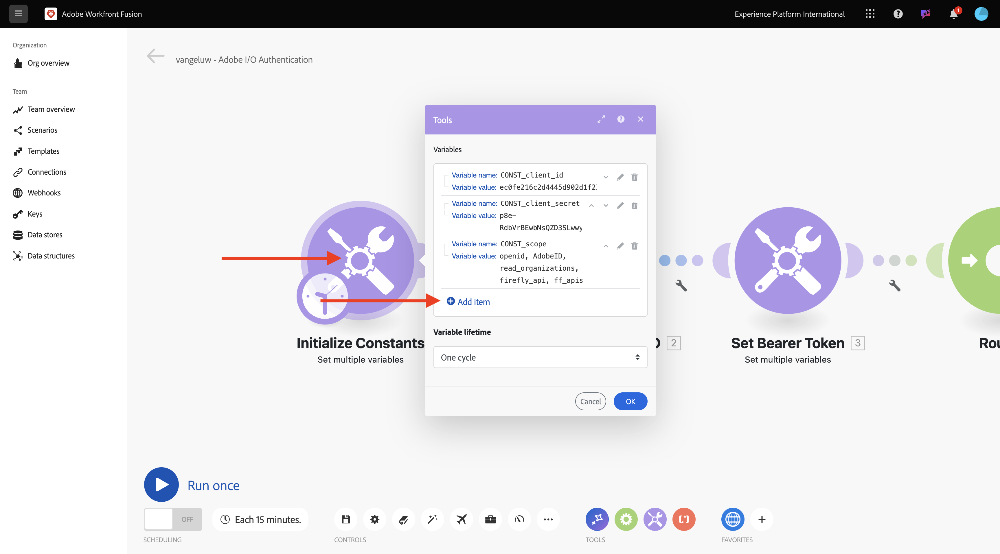
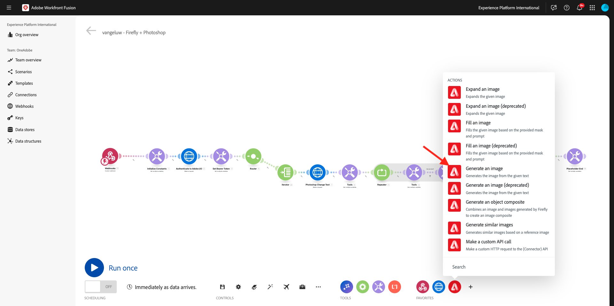
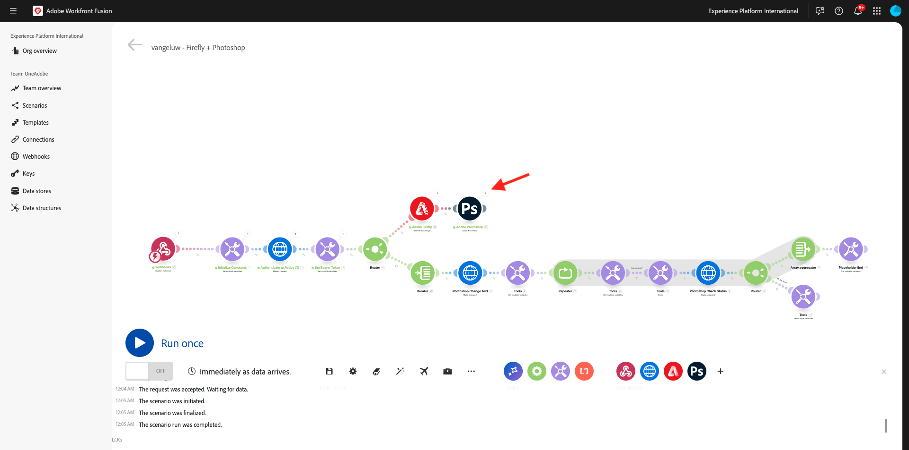
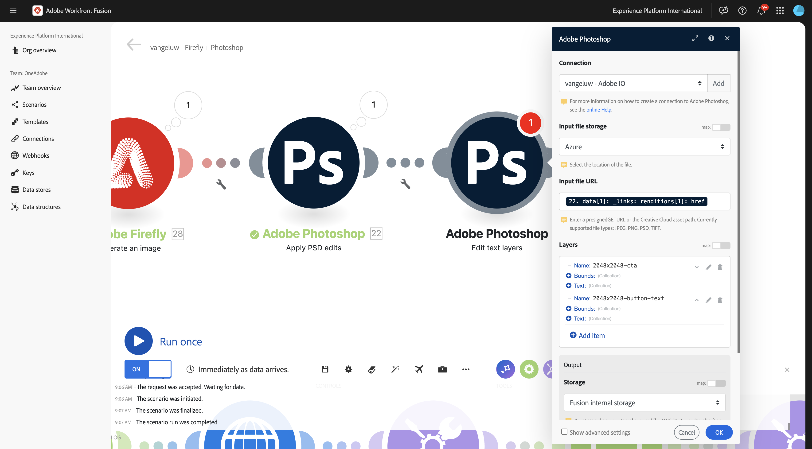
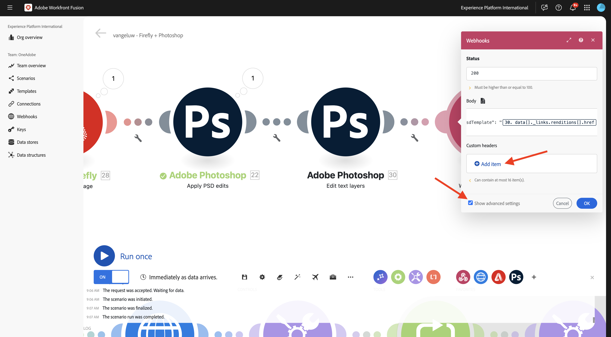

# 1.2.4 커넥터를 사용한 자동화

이제 Photoshop용 Workfront Fusion에서 기본 제공 커넥터를 사용하기 시작하고 Firefly 텍스트-2 이미지 요청과 Photoshop 요청을 하나의 시나리오로 연결합니다.

## 1.2.4.1 업데이트 변수

커넥터 설정을 계속하기 전에 **Initialize Constants** 모듈에 다음 변수를 추가해야 합니다.

- `AZURE_STORAGE_URL`
- `AZURE_STORAGE_CONTAINER`
- `AZURE_STORAGE_SAS_READ`
- `AZURE_STORAGE_SAS_WRITE`

첫 번째 노드로 돌아가서 **상수 초기화**&#x200B;를 선택한 다음 이러한 각 변수에 대해 **항목 추가**&#x200B;를 선택하십시오.



| 키 | 예제 값 |
|:-------------:| :---------------:| 
| `AZURE_STORAGE_URL` | `https://vangeluw.blob.core.windows.net` |
| `AZURE_STORAGE_CONTAINER` | `vangeluw` |
| `AZURE_STORAGE_SAS_READ` | `?sv=2023-01-03&st=2025-01-13T07%3A36%3A35Z&se=2026-01-14T07%3A36%3A00Z&sr=c&sp=rl&sig=4r%2FcSJLlt%2BSt9HdFdN0VzWURxRK6UqhB8TEvbWkmAag%3D` |
| `AZURE_STORAGE_SAS_WRITE` | `?sv=2023-01-03&st=2025-01-13T17%3A21%3A09Z&se=2025-01-14T17%3A21%3A09Z&sr=c&sp=racwl&sig=FD4m0YyyqUj%2B5T8YyTFJDi55RiTDC9xKtLTgW0CShps%3D` |

Postman으로 돌아가서 **환경 변수**&#x200B;를 열어 변수를 찾을 수 있습니다.


이 값을 Workfront Fusion에 복사하고 이 4개 변수 각각에 대해 새 항목을 추가합니다.

화면이 다음과 같아야 합니다. **확인**&#x200B;을 선택합니다.


## 1.2.4.2 웹후크를 사용하여 시나리오를 활성화하십시오.

지금까지 수동으로 시나리오를 실행하여 테스트했습니다. 이제 외부 환경에서 활성화할 수 있도록 웹후크로 시나리오를 업데이트하겠습니다.

**+**&#x200B;을(를) 선택하고 **Webhook**&#x200B;을(를) 검색한 다음 **Webhooks**&#x200B;을(를) 선택하십시오.


**사용자 지정 웹후크**&#x200B;를 선택하십시오.


**사용자 지정 Webhook** 모듈을 시나리오의 시작 부분으로 드래그합니다. 그런 다음 **시계** 아이콘을 선택하고 **사용자 지정 웹후크** 모듈로 끌어옵니다.


그럼 이걸 보셔야죠 그런 다음 첫 번째 모듈의 빨간색 점을 두 번째 모듈의 자주색 점 쪽으로 드래그합니다.


그럼 이걸 보셔야죠 그런 다음 **사용자 지정 Webhook** 모듈을 클릭합니다.


**추가를 클릭합니다**.


**Webhook 이름**&#x200B;을(를) `--aepUserLdap-- - Firefly + Photoshop Webhook`(으)로 설정합니다. **저장**&#x200B;을 클릭합니다.


이제 웹후크 URL을 사용할 수 있습니다. URL을 복사하려면 **클립보드에 주소 복사**&#x200B;를 클릭하세요.


Postman을 열고 **FF - Firefly Services 기술 내부자** 컬렉션에 새 폴더를 추가합니다.


폴더 이름을 `--aepUserLdap-- - Workfront Fusion`(으)로 지정합니다.


방금 만든 폴더에서 세 점 **..**&#x200B;을(를) 선택하고 **요청 추가**&#x200B;를 선택합니다.


**메서드 형식**&#x200B;을(를) **POST**(으)로 설정하고 주소 표시줄에 웹후크의 URL을 붙여 넣습니다.


변수 요소를 외부 소스에서 Workfront Fusion 시나리오로 제공할 수 있도록 사용자 지정 본문을 보내야 합니다.

**본문**(으)로 이동한 다음 **원시**&#x200B;을(를) 선택합니다.


아래 텍스트를 요청 본문에 붙여넣습니다. **보내기**&#x200B;를 선택합니다.

```json
{
    "psdTemplate": "citisignal-fiber.psd",
    "xlsFile": "placeholder",
    "prompt":"misty meadows",
    "cta": "Buy this now!",
    "button": "Click here to buy!"
}
```


Workfront Fusion으로 돌아가면 사용자 지정 웹후크에 **확인 완료**&#x200B;라는 메시지가 나타납니다.


## 1.2.4.3 Adobe Firefly 커넥터

새 모듈을 추가하려면 **+** 아이콘을 클릭하십시오.


검색어 `Adobe Firefly`을(를) 입력한 다음 **Adobe Firefly**&#x200B;을(를) 선택하십시오.


**이미지 생성**&#x200B;을 선택합니다.



**Adobe Firefly** 모듈을 클릭하여 연 다음 **추가**&#x200B;를 클릭하여 새 연결을 만듭니다.


다음 필드를 채웁니다.

- **연결 이름**: `--aepUserLdap-- - Firefly connection` 사용
- **환경**: **프로덕션**&#x200B;을 사용합니다.
- **유형**: **개인 계정**&#x200B;을 사용하세요.
- **클라이언트 ID**: 이름이 **인 Adobe I/O 프로젝트에서**&#x200B;클라이언트 ID`--aepUserLdap-- - One Adobe tutorial`을(를) 복사합니다.
- **클라이언트 암호**: 이름이 **인 Adobe I/O 프로젝트에서**&#x200B;클라이언트 암호`--aepUserLdap-- - One Adobe tutorial`을(를) 복사합니다.

Adobe I/O 프로젝트 **여기**&#x200B;에서 **클라이언트 ID** 및 [클라이언트 암호](https://developer.adobe.com/console/projects.){target="_blank"}를 찾을 수 있습니다.


모든 필드를 작성한 후 **계속**&#x200B;을 클릭하세요. 그러면 연결이 자동으로 확인됩니다.


그런 다음 들어오는 **사용자 지정 Webhook**&#x200B;에서 시나리오에 제공된 변수 **prompt**&#x200B;을(를) 선택합니다.


**모델 버전** **프롬프트**&#x200B;을(를) **image4 표준**(으)로 설정합니다. **확인**&#x200B;을 클릭합니다.


변경 내용을 저장하려면 **저장**&#x200B;을 클릭하고 구성을 테스트하려면 **한 번 실행**&#x200B;을 클릭하십시오.


Postman으로 이동하여 요청에서 메시지를 확인한 다음 **보내기**&#x200B;를 클릭합니다.


[보내기]를 클릭한 후 Workfront Fusion으로 돌아가서 **Adobe Firefly** 모듈에서 버블 아이콘을 클릭하여 세부 정보를 확인합니다.


**OUTPUT**&#x200B;에서 **세부 정보** > **url**(으)로 이동하여 **Adobe Firefly**&#x200B;에서 생성된 이미지의 URL을 찾습니다.


URL을 복사하여 브라우저에 붙여넣습니다. 이제 Postman 요청에서 보낸 프롬프트를 나타내는 이미지가 표시됩니다(이 경우 **안개 초원**).


## 1.2.4.2 PSD 파일의 배경 변경

이제 더 많은 기본 제공 커넥터를 사용하여 시나리오를 보다 스마트하게 업데이트하게 됩니다. 또한 Firefly의 출력을 Photoshop에 연결하므로 PSD 파일의 배경 이미지가 Firefly 이미지 생성 작업의 출력을 사용하여 동적으로 변경됩니다.

그럼 이걸 보셔야죠 그런 다음 **Adobe Firefly** 모듈 위로 마우스를 가져간 후 **+** 아이콘을 클릭합니다.


검색 메뉴에서 `Photoshop`을(를) 입력한 다음 **Adobe Photoshop** 작업을 클릭합니다.


**PSD 편집 적용**&#x200B;을 선택합니다.


그럼 이걸 보셔야죠 Adobe Photoshop에 새 연결을 추가하려면 **추가**&#x200B;를 클릭하십시오.


다음과 같이 연결을 구성합니다.

- 연결 유형: **Adobe Photoshop(서버 간) 선택**
- 연결 이름: `--aepUserLdap-- - Adobe I/O` 입력
- 클라이언트 ID: 클라이언트 ID 붙여넣기
- 클라이언트 암호: 클라이언트 암호 붙여넣기

**계속**&#x200B;을 클릭합니다.


**클라이언트 ID** 및 **클라이언트 암호**&#x200B;를 찾으려면 [https://developer.adobe.com/console/home](https://developer.adobe.com/console/home){target="_blank"}(으)로 이동하여 이름이 `--aepUserLdap-- One Adobe tutorial`인 Adobe I/O 프로젝트를 여십시오. **OAuth Server-to-Server**(으)로 이동하여 클라이언트 ID와 클라이언트 암호를 찾으십시오. 이러한 값을 복사하여 Workfront Fusion의 연결 설정에 붙여넣습니다.


**계속**&#x200B;을 클릭하면 자격 증명을 확인하는 동안 팝업 창이 짧게 표시됩니다. 완료되면 이 항목을 볼 수 있습니다.


이제 Fusion을 사용할 PSD 파일의 파일 위치를 입력해야 합니다. **저장소**&#x200B;에 대해 **Azure**&#x200B;을(를) 선택하고 **파일 위치**&#x200B;에 대해 `{{1.AZURE_STORAGE_URL}}/{{1.AZURE_STORAGE_CONTAINER}}/{{1.AZURE_STORAGE_SAS_READ}}`을(를) 입력하십시오. 두 번째 `/` 옆에 커서를 놓습니다. 그런 다음 사용 가능한 변수를 찾아 아래로 스크롤하여 **psdTemplate** 변수를 찾습니다. 변수를 선택하려면 **psdTemplate** 변수를 클릭하십시오.


그럼 이걸 보셔야죠


**레이어**&#x200B;가 표시될 때까지 아래로 스크롤합니다. **항목 추가**&#x200B;를 클릭합니다.


그럼 이걸 보셔야죠 이제 파일의 배경에 사용되는 Photoshop PSD 템플릿에 레이어의 이름을 입력해야 합니다.


**citisignal-fiber.psd** 파일에서 배경에 사용되는 레이어를 찾습니다. 이 예제에서는 해당 레이어의 이름을 **2048x2048-background**&#x200B;로 지정합니다.


Workfront Fusion 대화 상자에 이름 **2048x2048-background**&#x200B;을(를) 붙여 넣습니다.


**입력**&#x200B;이 표시될 때까지 아래로 스크롤합니다. 이제 배경 레이어에 삽입해야 할 항목을 정의해야 합니다. 이 경우 동적으로 생성된 이미지가 포함된 **Adobe Firefly** 모듈의 출력을 선택해야 합니다.

**저장소**&#x200B;에 대해 **외부**&#x200B;을(를) 선택하십시오. **파일 위치**&#x200B;의 경우 `{{XX.details[].url}}`Adobe Firefly **모듈의 출력에서 변수**&#x200B;을(를) 복사하여 붙여 넣어야 하지만 이 예제에서는 **5**&#x200B;인 **Adobe Firefly** 모듈의 시퀀스 번호로 변수의 **XX**&#x200B;을(를) 바꾸어야 합니다.


그런 다음 **편집**&#x200B;이 표시될 때까지 아래로 스크롤합니다. **편집**&#x200B;을(를) **예**(으)로 설정하고 **유형**&#x200B;을(를) **레이어**(으)로 설정합니다. **추가를 클릭합니다**.


그럼 이걸 보셔야죠 그런 다음 작업의 출력을 정의해야 합니다. **출력**&#x200B;에서 **항목 추가**&#x200B;를 클릭합니다.


**저장소**&#x200B;에 대해 **Azure**&#x200B;를 선택하고 `{{1.AZURE_STORAGE_URL}}/{{1.AZURE_STORAGE_CONTAINER}}/citisignal-fiber-replacedbg.psd{{1.AZURE_STORAGE_SAS_WRITE}}`파일 위치&#x200B;**에 이**&#x200B;을(를) 붙여 넣은 다음 **유형**&#x200B;에서 **vnd.adobe.photoshop**&#x200B;을 선택합니다. **고급 설정 표시**&#x200B;를 사용하려면 클릭하세요.


**고급 설정**&#x200B;에서 **예**를 선택하여 같은 이름의 파일을 덮어씁니다.
**추가를 클릭합니다**.


그럼 이걸 드셔보세요 **확인**&#x200B;을 클릭합니다.


변경 내용을 저장하려면 **저장**&#x200B;을 클릭하고 구성을 테스트하려면 **한 번 실행**&#x200B;을 클릭하십시오.


Postman으로 이동하여 요청에서 메시지를 확인한 다음 **보내기**&#x200B;를 클릭합니다.


그럼 이걸 보셔야죠 **Adobe Photoshop - PSD 편집 적용** 모듈에서 버블을 클릭합니다.



이제 새 PSD 파일이 성공적으로 생성되어 Microsoft Azure 스토리지 계정에 저장되었음을 확인할 수 있습니다.


## 1.2.4.3 PSD 파일의 텍스트 레이어 변경

그런 다음 **Adobe Photoshop - PSD 편집 적용** 모듈을 마우스로 가리킨 다음 **+** 아이콘을 클릭합니다.


**Adobe Photoshop**&#x200B;을(를) 선택합니다.


**텍스트 레이어 편집**&#x200B;을 선택합니다.


그럼 이걸 보셔야죠 먼저 이전에 구성한 Adobe Photoshop 연결을 선택합니다. 이 연결을 `--aepUserLdap-- Adobe I/O`(으)로 지정해야 합니다.


**입력 파일**&#x200B;의 경우 **입력 파일 저장소**&#x200B;에 대해 **Azure**&#x200B;를 선택하고 이전 요청에서 출력을 선택하십시오. **Adobe Photoshop - PSD 편집 적용**. ``{{XX.data[].`_links`.renditions[].href}}``(XX를 이전 모듈의 시퀀스 번호로 바꾸기 Adobe Photoshop - PSD 편집 적용)과 같이 정의할 수 있습니다.

그런 다음 **레이어**&#x200B;에서 **+항목 추가**&#x200B;를 클릭하여 업데이트해야 하는 텍스트 레이어를 추가합니다.


두 가지 변경 사항이 있습니다. **citisignal-fiber.psd** 파일의 CTA 텍스트와 단추 텍스트를 업데이트해야 합니다.

레이어 이름을 찾으려면 **citisignal-fiber.psd** 파일을 엽니다. 파일에서 call to action이 포함된 레이어의 이름은 **2048x2048-cta**&#x200B;입니다.


**citisignal-fiber.psd** 파일에서 call to action이 포함된 레이어의 이름이 **2048x2048-button-text**&#x200B;이라는 것도 볼 수 있습니다.


먼저 **2048x2048-cta** 레이어에 적용할 변경 사항을 구성해야 합니다. 대화 상자의 **이름** 아래에 이름 **2048x2048-cta**&#x200B;을(를) 입력하십시오.


**텍스트** > **컨텐츠**&#x200B;가 표시될 때까지 아래로 스크롤합니다. Webhook 페이로드에서 변수 **cta**&#x200B;을(를) 선택하십시오. **추가를 클릭합니다**.


그럼 이걸 보셔야죠 **레이어** 아래의 **+항목 추가**&#x200B;를 클릭하여 업데이트해야 하는 다음 텍스트 레이어를 추가합니다.


대화 상자의 **이름** 아래에 이름 **2048x2048-button-text**&#x200B;을(를) 입력하십시오.


**텍스트** > **컨텐츠**&#x200B;가 표시될 때까지 아래로 스크롤합니다. Webhook 페이로드에서 변수 **button**&#x200B;을 선택합니다. **추가를 클릭합니다**.


그럼 이걸 보셔야죠



**출력**&#x200B;이 표시될 때까지 아래로 스크롤합니다. **저장소**&#x200B;에 대해 **Azure**&#x200B;를 선택하세요. **파일 위치**&#x200B;에 대해 아래 위치를 입력하십시오. 생성된 모든 파일에 고유한 이름이 있는지 확인하는 데 사용되는 파일 이름에 `{{timestamp}}` 변수를 추가했는지 확인하십시오. 또한 **Type**&#x200B;을(를) **vnd.adobe.photoshop**(으)로 설정하십시오.

`{{1.AZURE_STORAGE_URL}}/{{1.AZURE_STORAGE_CONTAINER}}/citisignal-fiber-changed-text-{{timestamp}}.psd{{1.AZURE_STORAGE_SAS_WRITE}}`

**Type**&#x200B;을(를) **vnd.adobe.photoshop**(으)로 설정합니다. **확인**&#x200B;을 클릭합니다.


변경 내용을 저장하려면 **저장**&#x200B;을 클릭하세요.


## 1.2.4.4 Webhook 응답

Photoshop 파일에 이러한 변경 사항을 적용한 후 이 시나리오를 활성화한 응용 프로그램으로 다시 전송되는 **Webhook 응답**&#x200B;을 구성해야 합니다.

**Adobe Photoshop - 텍스트 레이어 편집** 모듈 위로 마우스를 가져간 후 **+** 아이콘을 클릭합니다.


`webhooks`을(를) 검색하고 **Webhook**&#x200B;을(를) 선택하십시오.


**Webhook 응답**&#x200B;을 선택합니다.


그럼 이걸 보셔야죠 **본문**&#x200B;에 아래 페이로드를 붙여 넣습니다.

```json
{
    "newPsdTemplate": ""
}
```


`{{XX.data[]._links.renditions[].href}}` 변수를 복사하여 붙여 넣고 **XX**&#x200B;을(를) 마지막 **Adobe Photoshop - 텍스트 레이어 편집** 모듈의 시퀀스 번호로 바꿉니다(이 경우 **7**).


**고급 설정 표시**&#x200B;에 대한 확인란을 활성화한 다음 **항목 추가**&#x200B;를 클릭합니다.



**Key** 필드에 `Content-Type`을(를) 입력합니다. **값** 필드에 `application/json`을(를) 입력하십시오. **추가를 클릭합니다**.


그럼 이걸 드셔보세요 **확인**&#x200B;을 클릭합니다.


**자동 맞춤**&#x200B;을 클릭합니다.


그럼 이걸 보셔야죠 변경 내용을 저장하려면 **저장**&#x200B;을 클릭한 다음 시나리오를 테스트하려면 **한 번 실행**&#x200B;을 클릭하십시오.


Postman으로 돌아가서 **보내기**&#x200B;를 클릭합니다. 여기에 사용되는 프롬프트는 **안개 있는 초원**&#x200B;입니다.


그러면 시나리오가 활성화되고, 잠시 후 새로 생성된 PSD 파일의 URL이 포함된 응답이 Postman에 표시됩니다.


미리 알림: Workfront Fusion에서 시나리오가 실행되면 각 모듈 위의 버블을 클릭하여 각 모듈에 대한 정보를 볼 수 있습니다.


그런 다음 Azure Storage Explorer를 사용하여 Azure Storage Explorer에서 새로 만든 PSD 파일을 두 번 클릭하여 찾아 열 수 있습니다.


그러면 배경이 **안개 낀 초원**&#x200B;으로 바뀌면서 파일이 이렇게 표시됩니다.


시나리오를 다시 실행한 다음 다른 프롬프트를 사용하여 Postman에서 새 요청을 보내면 시나리오가 얼마나 쉽고 재사용되는지 볼 수 있습니다. 이 예제에서 사용 중인 새 프롬프트는 **햇볕이 잘 드는 사막**&#x200B;입니다.


그리고 몇 분 후 새 배경과 함께 새 PSD 파일이 생성되었습니다.


## 다음 단계

[1.2.3 Frame.io 및 Workfront Fusion으로 이동](./ex3.md){target="_blank"}

[Workfront Fusion을 사용한 Creative 워크플로 자동화로 돌아가기](./automation.md){target="_blank"}

[모든 모듈](./../../../overview.md){target="_blank"}(으)로 돌아가기
