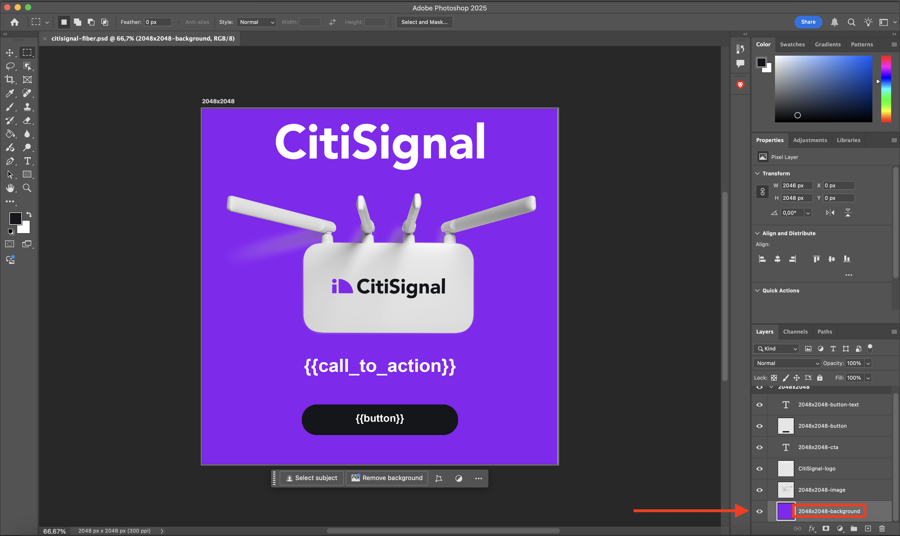
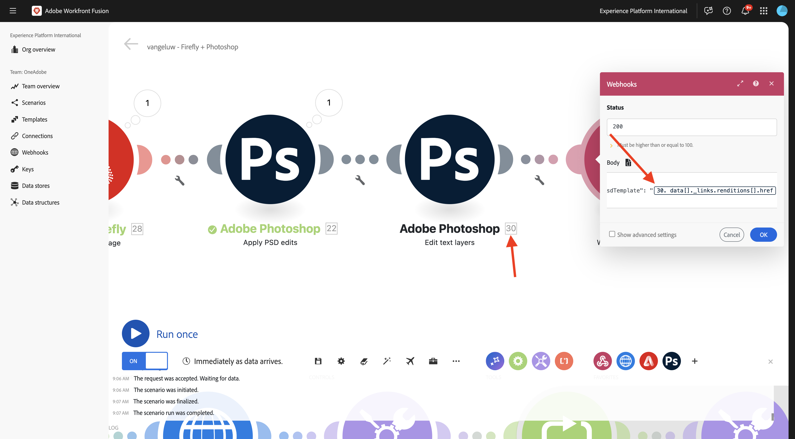
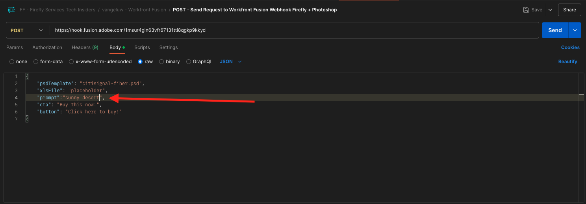

# 1.2.4 커넥터를 사용한 자동화

이제 Photoshop용 Workfront Fusion에서 기본 제공 커넥터를 사용하기 시작하고 Firefly 텍스트-2 이미지 요청과 Photoshop 요청을 하나의 시나리오로 연결합니다.

## 1.2.4.1 시나리오 복제 및 준비

왼쪽 메뉴에서 **시나리오**(으)로 이동하여 폴더 `--aepUserLdap--`을(를) 선택합니다. 그러면 이전에 만든 `--aepUSerLdap-- - Adobe I/O Authentication` 시나리오가 표시됩니다.


화살표를 클릭하여 드롭다운 메뉴를 열고 **복제**&#x200B;를 선택합니다.


복제된 시나리오의 **Name**&#x200B;을(를) `--aepUserLdap-- - Firefly + Photoshop`(으)로 설정하고 적절한 **대상 팀**&#x200B;을(를) 선택하십시오. 새 웹후크를 추가하려면 **추가**&#x200B;를 클릭하십시오.


**Webhook 이름**&#x200B;을(를) `--aepUserLdap-- - Firefly + Photoshop Webhook`(으)로 설정합니다. **저장**&#x200B;을 클릭합니다.


그럼 이걸 보셔야죠 **저장**&#x200B;을 클릭합니다.


그럼 이걸 보셔야죠 **Webhook** 노드를 클릭합니다.


**클립보드에 주소 복사**&#x200B;를 클릭한 다음 **데이터 구조 다시 확인**&#x200B;을 클릭합니다.


Postman을 엽니다. 이전에 사용하던 동일한 폴더에 새 요청을 추가합니다.


다음 설정이 적용되었는지 확인하십시오.

- 요청 이름: `POST - Send Request to Workfront Fusion Webhook Firefly + Photoshop`
- 요청 유형: `POST`
- 요청 URL: Workfront Fusion Scenario의 웹후크에서 복사한 URL을 붙여넣습니다.

**본문**(으)로 이동하여 **본문 유형**&#x200B;을(를) **원시** - **JSON**(으)로 설정합니다. **Body**&#x200B;에 다음 페이로드를 붙여 넣습니다.

```json
{
    "psdTemplate": "citisignal-fiber.psd",
    "xlsFile": "placeholder",
    "prompt":"misty meadows",
    "cta": "Buy this now!",
    "button": "Click here to buy!"
}
```

이 새 페이로드는 시나리오에서 하드 코딩되는 대신 시나리오 외부에서 모든 변수 정보를 제공하도록 합니다. 엔터프라이즈 시나리오에서 조직은 재사용 가능한 방식으로 시나리오를 정의해야 합니다. 즉, 시나리오에서 하드 코딩하지 않고 여러 변수를 입력 변수로 제공해야 합니다.

그럼 이걸 드셔보세요 **보내기**&#x200B;를 클릭합니다.


Workfront Fusion 웹후크가 아직 입력을 기다리고 있습니다.


**보내기**&#x200B;를 클릭하면 메시지가 **확인됨**&#x200B;으로 변경됩니다. **확인**&#x200B;을 클릭합니다.


## 1.2.4.2 Firefly T2I 노드 업데이트

**Firefly T2I** 노드를 클릭합니다. 그럼 이걸 보셔야죠 이 요청의 프롬프트는 이전에 필드의 **말**(으)로 하드코딩되었습니다. 이제 하드코딩된 텍스트를 제거하고 웹후크에서 들어오는 필드로 대체합니다.


필드 **말의**&#x200B;을(를) 제거하고 **Webhook** 변수에서 찾을 수 있는 변수 **prompt**(으)로 바꿉니다. 변경 내용을 저장하려면 **확인**&#x200B;을 클릭하세요.


## 1.2.4.2 PSD 파일의 배경 변경

이제 기본 제공 커넥터를 사용하여 시나리오를 보다 스마트하게 업데이트하게 됩니다. 또한 Firefly의 출력을 Photoshop에 연결하므로 PSD 파일의 배경 이미지가 Firefly 이미지 생성 작업의 출력을 사용하여 동적으로 변경됩니다.

이전 연습에서는 **Firefly T2I** 경로를 비활성화했습니다. 이제 실행을 취소해야 합니다. 경로를 다시 활성화하려면 **중지** 아이콘을 클릭하십시오.


그러면 **stop** 아이콘이 사라집니다. 그런 다음 이전 연습의 구성에 대한 다른 경로에서 **렌치** 아이콘을 클릭하고 **경로 비활성화**&#x200B;를 선택합니다.


그럼 이걸 보셔야죠 그런 다음 **Firefly T2I** 노드 위로 마우스를 가져간 후 **+** 아이콘을 클릭합니다.


검색 메뉴에서 `Photoshop`을(를) 입력한 다음 **Adobe Photoshop** 동작을 클릭합니다.


**PSD 편집 적용**&#x200B;을 선택합니다.


그럼 이걸 보셔야죠 Adobe Photoshop에 새 연결을 추가하려면 **추가**&#x200B;를 클릭하십시오.


다음과 같이 연결을 구성합니다.

- 연결 유형: **Adobe Photoshop(서버 간) 선택**
- 연결 이름: `--aepUserLdap-- - Adobe IO` 입력
- 클라이언트 ID: 클라이언트 ID 붙여넣기
- 클라이언트 암호: 클라이언트 암호 붙여넣기

**계속을 클릭합니다**.


**클라이언트 ID** 및 **클라이언트 암호**&#x200B;를 찾으려면 [https://developer.adobe.com/console/home](https://developer.adobe.com/console/home){target="_blank"}(으)로 이동하여 이름이 `--aepUserLdap-- One Adobe tutorial`인 Adobe I/O 프로젝트를 여십시오. **OAuth Server-to-Server**(으)로 이동하여 클라이언트 ID와 클라이언트 암호를 찾으십시오. 이러한 값을 복사하여 Workfront Fusion의 연결 설정에 붙여넣습니다.


**계속**&#x200B;을 클릭하면 자격 증명을 확인하는 동안 팝업 창이 짧게 표시됩니다. 완료되면 이 항목을 볼 수 있습니다.


이제 Fusion을 사용할 PSD 파일의 파일 위치를 입력해야 합니다. **저장소**&#x200B;에 대해 **Azure**&#x200B;을(를) 선택하고 **파일 위치**&#x200B;에 대해 `{{1.AZURE_STORAGE_URL}}/{{1.AZURE_STORAGE_CONTAINER}}/{{1.AZURE_STORAGE_SAS_READ}}`을(를) 입력하십시오. 두 번째 `/` 옆에 커서를 놓습니다. 그런 다음 사용 가능한 변수를 찾아 아래로 스크롤하여 **psdTemplate** 변수를 찾습니다. 변수를 선택하려면 **psdTemplate** 변수를 클릭하십시오.


그럼 이걸 보셔야죠


**레이어**&#x200B;가 표시될 때까지 아래로 스크롤합니다. **항목 추가**&#x200B;를 클릭합니다.


그럼 이걸 보셔야죠 이제 파일의 배경에 사용되는 Photoshop PSD 템플릿에 레이어의 이름을 입력해야 합니다.


**citisignal-fiber.psd** 파일에서 배경에 사용되는 레이어를 찾습니다. 이 예제에서는 해당 레이어의 이름을 **2048x2048-background**&#x200B;로 지정합니다.



Workfront Fusion 대화 상자에 이름 **2048x2048-background**&#x200B;을(를) 붙여 넣습니다.


**입력**&#x200B;이 표시될 때까지 아래로 스크롤합니다. 이제 배경 레이어에 삽입해야 할 항목을 정의해야 합니다. 이 경우 동적으로 생성된 이미지가 포함된 Firefly T2I 개체의 출력을 선택해야 합니다.

**저장소**&#x200B;에 대해 **외부**&#x200B;을(를) 선택하십시오. **파일 위치**&#x200B;의 경우 **Firefly T2I** 요청의 출력에서 변수 `data.outputs[].image.url`을(를) 검색하여 찾으십시오.


그런 다음 **편집**&#x200B;이 표시될 때까지 아래로 스크롤합니다. **편집**&#x200B;을(를) **예**(으)로 설정하고 **유형**&#x200B;을(를) **레이어**(으)로 설정합니다. **추가를 클릭합니다**.


그럼 이걸 보셔야죠 그런 다음 작업의 출력을 정의해야 합니다. **출력**&#x200B;에서 **항목 추가**&#x200B;를 클릭합니다.


**저장소**&#x200B;에 대해 **Azure**&#x200B;를 선택하고 **파일 위치**&#x200B;에 이 `{{1.AZURE_STORAGE_URL}}/{{1.AZURE_STORAGE_CONTAINER}}/citisignal-fiber-replacedbg.psd{{1.AZURE_STORAGE_SAS_WRITE}}`을(를) 붙여 넣은 다음 **유형**&#x200B;에서 **vnd.adobe.photoshop**&#x200B;을 선택합니다. **고급 설정 표시**&#x200B;를 사용하려면 클릭하세요.


**고급 설정**&#x200B;에서 **예**를 선택하여 같은 이름의 파일을 덮어씁니다.
**추가를 클릭합니다**.


그럼 이걸 드셔보세요 **확인**&#x200B;을 클릭합니다.


## 1.2.4.3 PSD 파일의 텍스트 레이어 변경

### 클릭 유도 문안 텍스트

그런 다음 **Adobe Photoshop - PSD 편집 적용** 노드를 마우스로 가리키고 **+** 아이콘을 클릭합니다.


**Adobe Photoshop**&#x200B;을(를) 선택합니다.


**텍스트 레이어 편집**&#x200B;을 선택합니다.


그럼 이걸 보셔야죠 먼저 이전에 구성한 Adobe Photoshop 연결을 선택합니다. 이 연결을 `--aepUserLdap-- Adobe IO`(으)로 지정해야 합니다.

이제 이전 단계의 출력인 **입력 파일**&#x200B;의 위치를 정의해야 하며 **레이어**&#x200B;에서 변경할 텍스트 레이어의 **이름**&#x200B;을 입력해야 합니다.


**입력 파일**&#x200B;의 경우 **입력 파일 저장소**&#x200B;에 대해 **Azure**&#x200B;을(를) 선택하고 이전 요청인 **Adobe Photoshop - PSD 편집 적용**&#x200B;의 출력을 선택하십시오. `data[]._links.renditions[].href`에서 가져올 수 있습니다.


**citisignal-fiber.psd** 파일을 엽니다. 파일에서 콜 투 액션이 포함된 레이어의 이름이 **2048x2048-cta**&#x200B;임을 알 수 있습니다.


대화 상자의 **이름** 아래에 이름 **2048x2048-cta**&#x200B;을(를) 입력하십시오.


**텍스트** > **컨텐츠**&#x200B;가 표시될 때까지 아래로 스크롤합니다. Webhook 페이로드에서 변수 **cta**&#x200B;을(를) 선택하십시오.


**출력**&#x200B;이 표시될 때까지 아래로 스크롤합니다. **저장소**&#x200B;에 대해 **Azure**&#x200B;를 선택하세요. **파일 위치**&#x200B;에 대해 아래 위치를 입력하십시오. 생성된 모든 파일에 고유한 이름이 있는지 확인하는 데 사용되는 파일 이름에 `{{timestamp}}` 변수를 추가했는지 확인하십시오. 또한 **Type**&#x200B;을(를) **vnd.adobe.photoshop**(으)로 설정하십시오. **확인**&#x200B;을 클릭합니다.

`{{1.AZURE_STORAGE_URL}}/{{1.AZURE_STORAGE_CONTAINER}}/citisignal-fiber-changed-text-{{timestamp}}.psd{{1.AZURE_STORAGE_SAS_WRITE}}`


### 단추 텍스트

방금 만든 노드를 마우스 오른쪽 단추로 클릭하고 **복제**&#x200B;를 선택합니다. 이렇게 하면 두 번째 유사한 개체가 생성됩니다.


그럼 이걸 보셔야죠 먼저 이전에 구성한 Adobe Photoshop 연결을 선택합니다. 이 연결을 `--aepUserLdap-- Adobe IO`(으)로 지정해야 합니다.

이제 이전 단계의 출력인 **입력 파일**&#x200B;의 위치를 정의해야 하며 **레이어**&#x200B;에서 변경할 텍스트 레이어의 **이름**&#x200B;을 입력해야 합니다.


**입력 파일**&#x200B;에 대해 **입력 파일 저장소**&#x200B;에 대해 **Azure**&#x200B;을(를) 선택하고 이전 요청인 **Adobe Photoshop - 텍스트 레이어 편집**&#x200B;에서 출력을 선택하십시오. `data[]._links.renditions[].href`에서 가져올 수 있습니다.

**citisignal-fiber.psd** 파일을 엽니다. 파일에서 콜 투 액션이 포함된 레이어의 이름이 **2048x2048-button-text**&#x200B;이라는 것을 알 수 있습니다.


대화 상자의 **이름** 아래에 이름 **2048x2048-cta**&#x200B;을(를) 입력하십시오.


**텍스트** > **컨텐츠**&#x200B;가 표시될 때까지 아래로 스크롤합니다. Webhook 페이로드에서 변수 **cta**&#x200B;을(를) 선택하십시오.


**출력**&#x200B;이 표시될 때까지 아래로 스크롤합니다. **저장소**&#x200B;에 대해 **Azure**&#x200B;를 선택하세요. **파일 위치**&#x200B;에 대해 아래 위치를 입력하십시오. 생성된 모든 파일에 고유한 이름이 있는지 확인하는 데 사용되는 파일 이름에 `{{timestamp}}` 변수를 추가했는지 확인하십시오. 또한 **Type**&#x200B;을(를) **vnd.adobe.photoshop**(으)로 설정하십시오. **확인**&#x200B;을 클릭합니다.

`{{1.AZURE_STORAGE_URL}}/{{1.AZURE_STORAGE_CONTAINER}}/citisignal-fiber-changed-text-{{timestamp}}.psd{{1.AZURE_STORAGE_SAS_WRITE}}`


변경 내용을 저장하려면 **저장**&#x200B;을 클릭하세요.


## 1.2.4.4 Webhook 응답

Photoshop 파일에 이러한 변경 사항을 적용한 후 이 시나리오를 활성화한 응용 프로그램으로 다시 전송되는 **Webhook 응답**&#x200B;을 구성해야 합니다.

**Adobe Photoshop - 텍스트 레이어 편집** 노드 위로 마우스를 가져간 후 **+** 아이콘을 클릭합니다.


**Webhook**&#x200B;을(를) 검색하고 **Webhook**&#x200B;을(를) 선택하십시오.


**Webhook 응답**&#x200B;을 선택합니다.


그럼 이걸 보셔야죠 **본문**&#x200B;에 아래 페이로드를 붙여 넣습니다.

```json
{
    "newPsdTemplate": ""
}
```


이전 요청의 출력에서 `data[]._links.renditions[].href` 경로를 선택하십시오. **고급 설정 표시**&#x200B;에 대한 확인란을 활성화한 다음 **항목 추가**&#x200B;를 클릭합니다.



**Key** 필드에 `Content-Type`을(를) 입력합니다. **값** 필드에 `application/json`을(를) 입력하십시오. **저장**&#x200B;을 클릭합니다.


그럼 이걸 드셔보세요 **확인**&#x200B;을 클릭합니다.


**자동 맞춤**&#x200B;을 클릭합니다.


그럼 이걸 보셔야죠 **한 번 실행**&#x200B;을 클릭합니다.


Postman으로 돌아가서 **보내기**&#x200B;를 클릭합니다. 여기에 사용되는 프롬프트는 **안개 있는 초원**&#x200B;입니다.


그러면 시나리오가 활성화되고, 잠시 후 새로 생성된 PSD 파일의 URL이 포함된 응답이 Postman에 표시됩니다.


미리 알림: Workfront Fusion에서 시나리오가 실행되면 각 노드 위의 버블을 클릭하여 각 노드에 대한 정보를 볼 수 있습니다.


그런 다음 Azure Storage Explorer를 사용하여 Azure Storage Explorer에서 새로 만든 PSD 파일을 두 번 클릭하여 찾아 열 수 있습니다.


그러면 배경이 **안개 낀 초원**&#x200B;으로 바뀌면서 파일이 이렇게 표시됩니다.


시나리오를 다시 실행한 다음 다른 프롬프트를 사용하여 Postman에서 새 요청을 보내면 시나리오가 얼마나 쉽고 재사용되는지 볼 수 있습니다. 이 예제에서 사용 중인 새 프롬프트는 **햇볕이 잘 드는 사막**&#x200B;입니다.



그리고 몇 분 후 새 배경과 함께 새 PSD 파일이 생성되었습니다.


## 다음 단계

[Firefly Services 자동화의 요약 및 이점](./summary.md){target="_blank"}(으)로 이동

[Adobe Firefly 서비스 자동화](./automation.md){target="_blank"}(으)로 돌아가기

[모든 모듈](./../../../overview.md){target="_blank"}(으)로 돌아가기
