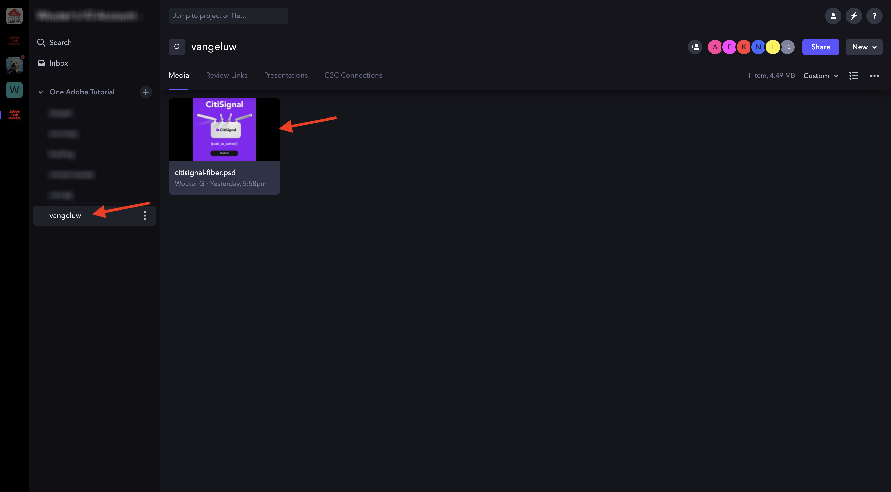
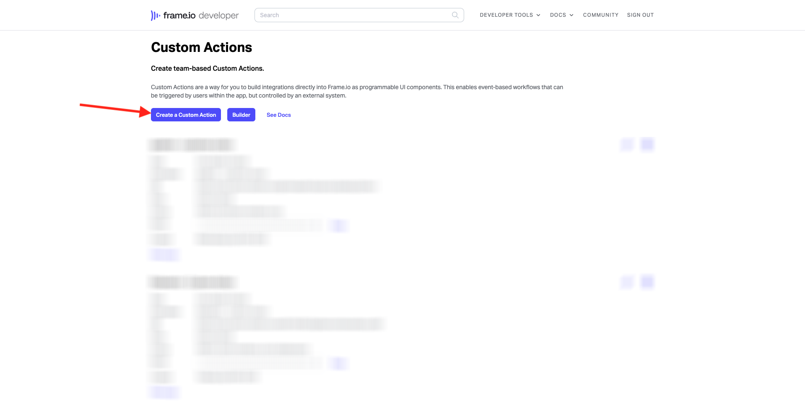

# 1.2.5 프레임 I/O 및 Workfront Fusion

이전 연습에서는 시나리오를 `--aepUserLdap-- - Firefly + Photoshop` 구성하고, 시나리오를 트리거하도록 들어오는 웹후크를 구성하고, 시나리오가 성공적으로 완료되면 웹후크 응답을 구성했습니다. 그런 다음 Postman을 사용하여 해당 시나리오를 트리거했습니다. Postman은 테스트를 위한 훌륭한 도구 이지만 실제 비즈니스 시나리오에서 비즈니스 사용자는 Postman을 사용하여 시나리오를 트리거하지 않습니다. 대신 다른 애플리케이션을 사용하고 다른 애플리케이션이 Workfront Fusion에서 시나리오를 활성화할 것으로 기대합니다. 이 연습에서는 프레임 I/O를 사용하여 이 작업을 수행합니다.

## 1.2.5.1 프레임 I/O 액세스

>[!NOTE]
>
>이 연습을 성공적으로 완료하려면 프레임 I/O 계정에서 관리자 사용자여야 합니다. 아래 연습은 프레임 I/O V3용으로 작성되었으며 이후 단계 프레임 I/O V4용으로 업데이트됩니다.

https://app.frame.io/projects](https://app.frame.io/projects) 로 [이동합니다.

**+ 아이콘을** 클릭하여 프레임 I/O에서 자신의 프로젝트를 만듭니다.

이름을 `--aepUserLdap--` 입력하고 프로젝트&#x200B;**만들기 버튼을 클릭합니다**.

그러면 왼쪽 메뉴에 프로젝트가 표시됩니다.
이전 연습 중 하나에서는 데스크탑에 citisignal-fiber.psd](./../../../assets/ff/citisignal-fiber.psd){target="_blank"} 다운로드[했습니다. 해당 파일을 선택한 다음 방금 만든 프로젝트 폴더에 끌어다 놓습니다.

## 1.2.5.2 Workfront Fusion 및 프레임 I/O

이전 연습에서는 사용자 지정 웹후크로 시작하여 웹후크 응답으로 끝나는 시나리오를 `--aepUserLdap-- - Firefly + Photoshop`만들었습니다. 그런 다음 Postman을 사용하여 웹훅 사용을 테스트했지만 분명히 이러한 시나리오의 요점은 외부 애플리케이션 에서 호출하는 것입니다. 앞서 언급했듯이 프레임 I/O가 그 연습이 될 것이지만 프레임 I/O와 `--aepUserLdap-- - Firefly + Photoshop` 다른 Workfront Fusion 시나리오 사이에 필요합니다. 이제 해당 시나리오를 구성합니다.

왼쪽 메뉴에서 시나리오로&#x200B;**이동하여**&#x200B;폴더를 `--aepUserLdap--`선택합니다. 새 시나리오만들기 클릭합니다&#x200B;****.

라는 이름을 `--aepUserLdap-- - Frame IO Custom Action`사용합니다.

캔버스에서 **물음표 개체를** 클릭합니다. 검색 상자에 텍스트를 `webhook` 입력하고 Webhooks를&#x200B;**클릭합니다**.

사용자 지정 웹훅&#x200B;**을 클릭합니다**.

추가&#x200B;**를 클릭하여**&#x200B;새 웹훅 URL을 만듭니다.

**Webhook 이름의** 경우 을 사용합니다`--aepUserLdap-- - Frame IO Custom Action Webhook`. **저장**&#x200B;을 클릭합니다.

그러면 이것을 볼 수 있습니다. 다음 단계에서 필요하므로 이 화면을 열어 두고 그대로 두십시오. 다음 단계에서 [클립보드&#x200B;**에 주소 복사]를 클릭하여**&#x200B;웹후크 URL을 복사해야 합니다.

https://developer.frame.io/](https://developer.frame.io/) 로 [이동합니다. DEVELOPER TOOLS(개발자 도구&#x200B;**)를 클릭한**&#x200B;다음 Custom Actions(사용자 지정 작업&#x200B;**)를 선택합니다**.

사용자 지정 작업&#x200B;**만들기 클릭합니다**.

다음 값을 입력합니다.

- **NAME:** 사용 `vangeluw - Frame IO Custom Action Fusion`
- **설명**: 사용 `vangeluw - Frame IO Custom Action Fusion`
- **EVENT:** 를 사용합니다 `fusion.tutorial`.
- **URL**: Workfront Fusion에서 방금 생성한 Webhook의 URL을 입력합니다.
- **TEAM:** 적절한 프레임 I/O 팀(이 경우 **One Adobe Systems Tutorial**)을 선택합니다.

**제출을 클릭합니다**.

그러면 이것을 볼 수 있습니다.

https://app.frame.io/projects](https://app.frame.io/projects) 로 [돌아갑니다. 페이지 새로 고침.

페이지 새로 고친 후 자산 **citisignal-fiber.psd**&#x200B;에서 점 **** 3개...를 클릭합니다. 그러면 이전에 만든 사용자 지정 작업이 표시된 메뉴에 표시됩니다. 사용자 지정 작업 `vangeluw - Frame IO Custom Action Fusion`을 클릭합니다.

그러면 비슷한 **성공이 표시됩니다!** 팝업. 이 팝업은 Frame I/O와 Workfront Fusion 간의 통신 결과입니다.

화면을 다시 Workfront Fusion으로 변경합니다. 이제 **Custom Webhook 개체에 Successfully determined** 가 표시됩니다. **확인**&#x200B;을 클릭합니다.

Run Once(한 번&#x200B;**실행)를 클릭하여**&#x200B;테스트 모드를 활성화하고 프레임 I/O와의 통신을 다시 테스트합니다.

프레임 I/O로 돌아가서 사용자 지정 작업을 `vangeluw - Frame IO Custom Action Fusion` 다시 클릭합니다.

화면을 다시 Workfront Fusion으로 전환합니다. 이제 녹색 확인 표시와 1 **을 나타내는**&#x200B;풍선이 표시됩니다. 거품을 클릭하면 세부 정보를 볼 수 있습니다.

버블의 세부 정보 보기에는 프레임 I/O에서 수신된 데이터가 표시됩니다. 다양한 ID가 표시되어야 합니다. 예를 들어, 필드 **resource.id 에는 자산** citisignal-fiber.psd **의 프레임 I/O에 있는 고유 ID가 표시됩니다**

이제 Frame I/O와 Workfront Fusion 간에 통신이 설정되었으므로 구성을 계속할 수 있습니다.

## 1.2.5.3 프레임 I/O에 대한 사용자 지정 양식 응답을 제공합니다.

## 다음 단계

1.2.6 프레임 I/O로 [이동하여 AEM Assets에 퓨전](./ex6.md){target="_blank"}

Creative Workflow Automation with Workfront Fusion(으 [)로 돌아가기](./automation.md){target="_blank"}

모든 모듈로 [돌아가기](./../../../overview.md){target="_blank"}

