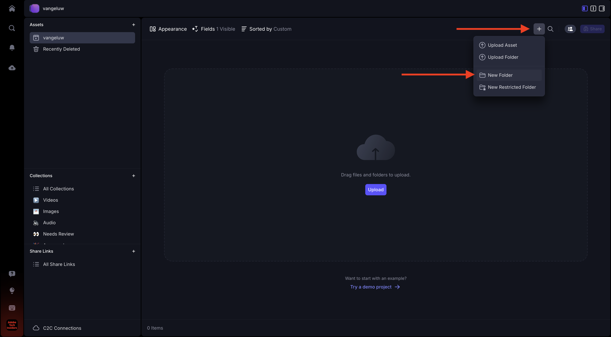
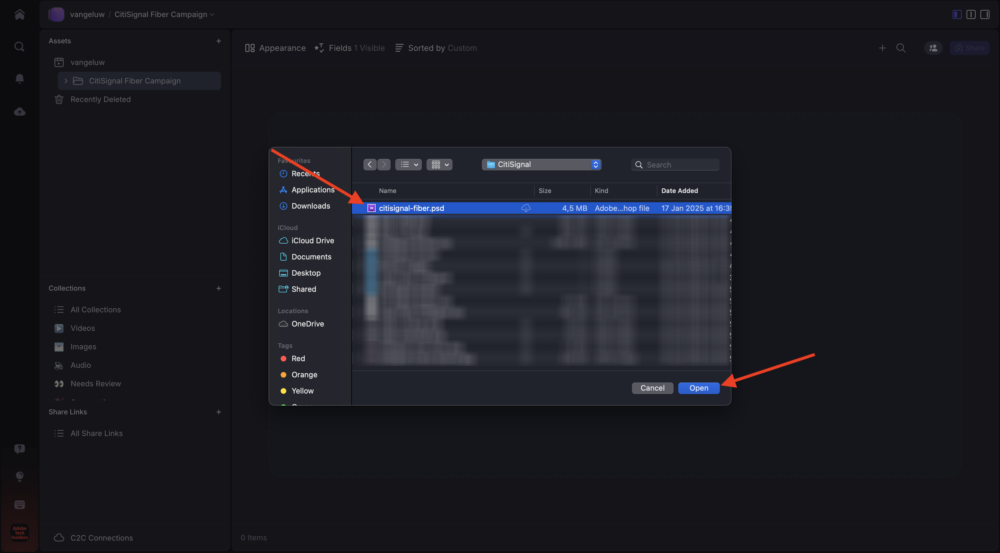
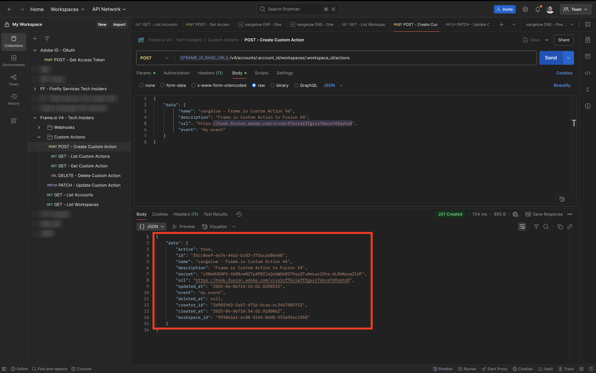
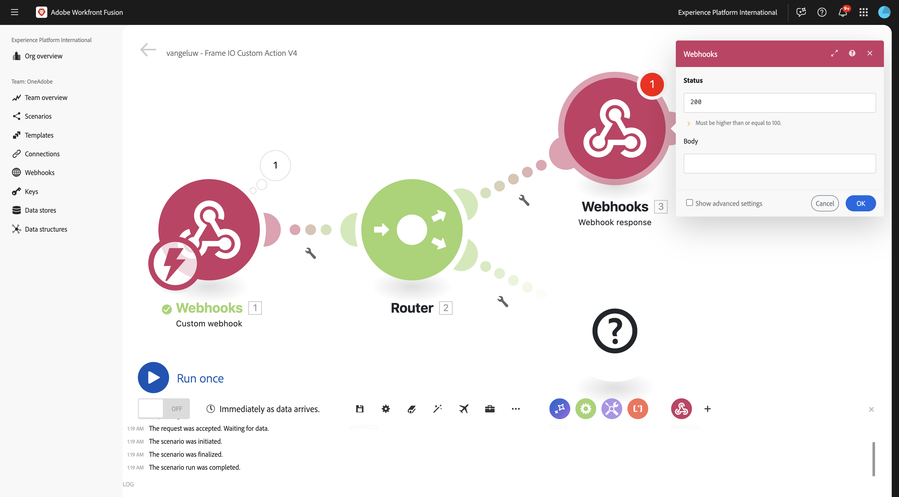
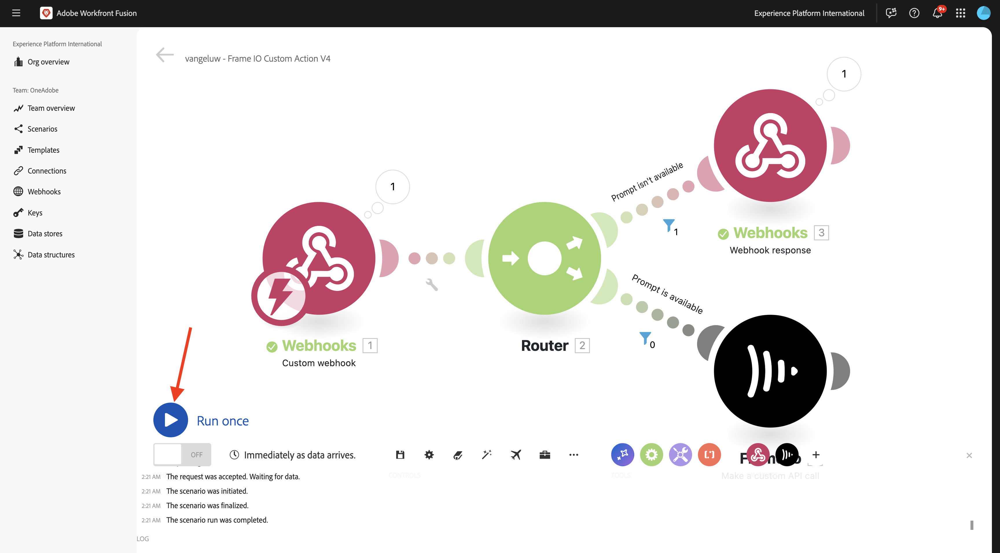
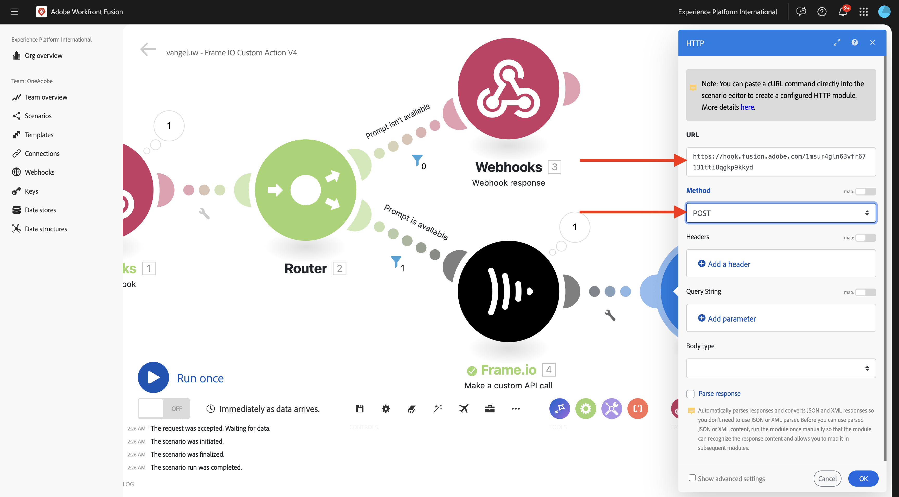
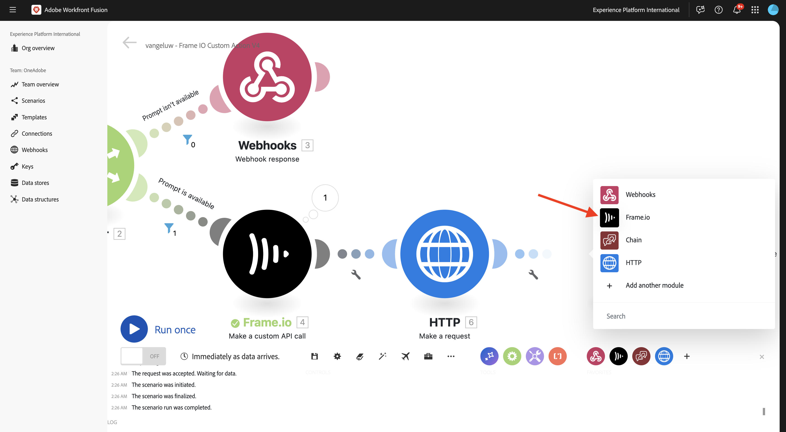

# 1.2.5 Frame.io 및 Workfront Fusion

이전 연습에서는 시나리오 `--aepUserLdap-- - Firefly + Photoshop`을(를) 구성하고 시나리오를 트리거하기 위해 들어오는 웹후크와 시나리오가 성공적으로 완료되면 웹후크 응답을 구성했습니다. 그런 다음 Postman을 사용하여 해당 시나리오를 트리거했습니다. Postman은 테스트를 위한 훌륭한 도구이지만 실제 비즈니스 시나리오에서는 비즈니스 사용자가 Postman을 사용하여 시나리오를 트리거하지 않습니다. 대신 다른 응용 프로그램을 사용하고 다른 응용 프로그램이 Workfront Fusion에서 시나리오를 활성화하기를 기대합니다. 이 연습에서는 Frame.io를 사용하여 수행할 작업이 바로 여기에 있습니다.

>[!NOTE]
>
>이 연습은 Frame.io V4용으로 만들어졌습니다. 이 연습에서 사용되는 아래 기능 중 일부는 현재 알파에 있으며 아직 일반적으로 사용할 수 없습니다.

## 1.2.5.1 필수 구성 요소

이 연습을 계속하기 전에 Adobe I/O 프로젝트에 **Frame.io API**&#x200B;를 추가하는 등 [Adobe I/O 프로젝트](./../../../modules/getting-started/gettingstarted/ex6.md) 설정을 완료하고 [Postman](./../../../modules/getting-started/gettingstarted/ex7.md) 또는 [PostBuster](./../../../modules/getting-started/gettingstarted/ex8.md)와 같이 API와 상호 작용할 응용 프로그램을 구성해야 합니다.

## 1.2.5.2 Frame.io 액세스

[https://next.frame.io/](https://next.frame.io/){target="_blank"}(으)로 이동합니다.


인스턴스 아이콘을 클릭하여 현재 로그인한 인스턴스를 확인합니다. 액세스 권한이 부여된 인스턴스를 선택하십시오. 이 인스턴스는 `--aepImsOrgName--`이어야 합니다.

**+ 새 프로젝트**&#x200B;을(를) 클릭하여 Frame.io에서 나만의 프로젝트를 만듭니다.


**Blank** 템플릿을 선택한 다음 프로젝트의 이름 `--aepUserLdap--`을(를) 입력하십시오. **새 프로젝트 만들기**&#x200B;를 클릭합니다.


그러면 왼쪽 메뉴에 프로젝트가 표시됩니다. **+** 아이콘을 클릭한 다음 **새 폴더**&#x200B;를 선택합니다.



`CitiSignal Fiber Campaign` 이름을 입력한 다음 폴더를 두 번 클릭하여 엽니다.


**업로드**&#x200B;를 클릭합니다.


이전 연습 중 하나에서 [citissignal-fiber.psd](./../../../assets/ff/citisignal-fiber.psd){target="_blank"}를 다운로드했습니다. 해당 파일을 선택하고 **열기**&#x200B;를 클릭합니다.



그러면 새로 만든 폴더에서 **citisignal-fiber.psd** 파일을 사용할 수 있습니다.


## 1.2.5.3 Workfront Fusion 및 Frame.io

이전 연습에서는 사용자 지정 Webhook으로 시작하여 Webhook 응답으로 끝나는 시나리오 `--aepUserLdap-- - Firefly + Photoshop`을(를) 만들었습니다. 그런 다음 Postman을 사용하여 웹후크의 사용을 테스트했지만, 이러한 시나리오의 핵심은 외부 애플리케이션에 의해 호출되는 것입니다. 앞에서 설명한 대로 Frame.io는 이러한 연습이 되지만 Frame.io와 `--aepUserLdap-- - Firefly + Photoshop` 사이에는 다른 Workfront Fusion 시나리오가 필요합니다. 이제 해당 시나리오를 구성합니다.

[https://experience.adobe.com/](https://experience.adobe.com/){target="_blank"}(으)로 이동합니다. **Workfront Fusion**&#x200B;을 엽니다.


왼쪽 메뉴에서 **시나리오**(으)로 이동하여 폴더 `--aepUserLdap--`을(를) 선택합니다. **새 시나리오 만들기**&#x200B;를 클릭합니다.


이름 `--aepUserLdap-- - Frame IO Custom Action V4`을(를) 사용합니다.


캔버스에서 **물음표 개체**&#x200B;를 클릭합니다. 검색 상자에 `webhook` 텍스트를 입력하고 **웹후크**&#x200B;를 클릭합니다.


**사용자 지정 웹후크**&#x200B;를 클릭합니다.


새 웹후크 URL을 만들려면 **추가**&#x200B;를 클릭하세요.


**Webhook 이름**&#x200B;의 경우 `--aepUserLdap-- - Frame IO Custom Action Webhook`을(를) 사용합니다. **저장**&#x200B;을 클릭합니다.


그럼 이걸 보셔야죠 다음 단계에서 필요할 것이므로 이 화면을 열어 두십시오. **클립보드에 주소 복사**&#x200B;를 클릭하여 다음 단계에서 웹후크 URL을 복사해야 합니다.


## 1.2.5.4 Frame.io V4 사용자 지정 작업 API

Postman으로 이동하여 컬렉션 **Adobe IO - OAuth**&#x200B;에서 요청 **POST - 액세스 토큰 가져오기**&#x200B;를 엽니다. **Params** 아래의 **scope** 필드를 확인하십시오. **범위** 필드에 `frame.s2s.all` 범위가 포함되어야 합니다. 누락된 경우 추가해 주십시오. 그런 다음 **보내기**&#x200B;를 클릭하여 새 **access_token**&#x200B;을(를) 요청합니다.


그런 다음 **Frame.io V4 - 기술 내부자** 컬렉션에서 **GET - 계정 목록** 요청을 엽니다. **보내기**&#x200B;를 클릭합니다.


그러면 하나 이상의 계정이 포함된 유사한 응답이 표시됩니다. 응답을 검토하고 사용 중인 Frame.io V4 계정에 대한 필드 **id**&#x200B;을(를) 찾습니다. Frame.io V4 사용자 인터페이스에서 계정 이름을 찾을 수 있습니다.


필드 **id**&#x200B;의 값을 복사합니다.


왼쪽 메뉴에서 **환경**(으)로 이동하여 사용 중인 환경을 선택합니다. 변수 **`FRAME_IO_ACCOUNT_ID`**&#x200B;을(를) 찾아 **초기 값** 열과 **현재 값** 열 모두에 이전 요청에서 얻은 **id**&#x200B;을(를) 붙여 넣습니다. **저장**&#x200B;을 클릭합니다.


왼쪽 메뉴에서 **컬렉션**(으)로 돌아갑니다. **Frame.io V4 - 기술 내부자**&#x200B;에서 **GET - 작업 공간 나열** 요청을 엽니다. **보내기**&#x200B;를 클릭합니다.


그러면 하나 이상의 계정이 포함된 유사한 응답이 표시됩니다. 응답을 검토하고 사용 중인 Frame.io V4 Workspace에 대한 필드 **id**&#x200B;을(를) 찾습니다. 필드 **id**&#x200B;의 값을 복사합니다.


왼쪽 메뉴에서 **환경**(으)로 이동하여 사용 중인 환경을 선택합니다. 변수 **`FRAME_IO_WORKSPACE_ID`**&#x200B;을(를) 찾아 **초기 값** 열과 **현재 값** 열 모두에 이전 요청에서 얻은 **id**&#x200B;을(를) 붙여 넣습니다. **저장**&#x200B;을 클릭합니다.


왼쪽 메뉴에서 **컬렉션**(으)로 돌아갑니다. **사용자 지정 작업** 폴더의 **Frame.io V4 - 기술 내부자** 컬렉션에서 **POST - 사용자 지정 작업 만들기** 요청을 엽니다.

요청의 **본문**(으)로 이동합니다. 필드 **name**&#x200B;을(를) `--aepUserLdap--  - Frame.io Custom Action V4`(으)로 변경한 다음 필드 **url**&#x200B;을(를) Workfront Fusion에서 복사한 Webhook URL 값으로 변경합니다.

**보내기**&#x200B;를 클릭합니다.


이제 Frame.io V4 사용자 지정 작업이 만들어졌습니다.



[https://next.frame.io/](https://next.frame.io/){target="_blank"}(으)로 돌아가서 프로젝트 `--aepUserLdap--`에서 만든 **CitiSignal 파이버 캠페인** 폴더로 이동합니다. 페이지를 새로 고칩니다.


페이지를 새로 고친 후 자산 **citisignal-fiber.psd**&#x200B;에서 세 점 **..**&#x200B;을(를) 클릭하고 **사용자 지정 작업** 메뉴를 엽니다. 그러면 이전에 만든 사용자 지정 작업이 표시되는 메뉴에 나타납니다. 사용자 지정 작업 `--aepUserLdap-- - Frame IO Custom Action Fusion V4`을(를) 클릭합니다.


그러면 유사한 **사용자 지정 작업** 팝업이 표시됩니다. 이 팝업은 Frame.io와 Workfront Fusion 간의 통신으로 인해 발생합니다.


화면을 다시 Workfront Fusion으로 변경합니다. 이제 사용자 지정 Webhook 개체에 **확인됨**&#x200B;이(가) 표시됩니다. **확인**&#x200B;을 클릭합니다.


**한 번 실행**&#x200B;을 클릭하여 테스트 모드를 사용하도록 설정하고 Frame.io와의 통신을 다시 테스트합니다.


Frame.io로 돌아가서 사용자 지정 작업 `--aepUserLdap-- - Frame IO Custom Action Fusion V4`을(를) 다시 클릭합니다.


화면을 다시 Workfront Fusion으로 전환합니다. 이제 녹색 확인 표시와 **1**&#x200B;을(를) 표시하는 버블이 표시됩니다. 세부 정보를 보려면 버블을 클릭합니다.


버블의 상세 보기에는 Frame.io에서 받은 데이터가 표시됩니다. 여러 가지 신분증이 보일 겁니다 예를 들어 필드 **resource.id**&#x200B;은(는) 자산 **citsignal-fiber.psd**&#x200B;의 Frame.io에 있는 고유 ID를 표시합니다.


이제 Frame.io와 Workfront Fusion 간에 통신이 설정되었으므로 구성을 계속할 수 있습니다.

## 1.2.5.5 Frame.io에 사용자 지정 양식 응답을 제공합니다.

사용자 지정 작업이 Frame.io에서 호출되면 Frame.io는 Workfront Fusion에서 응답을 받게 됩니다. 이전 연습에서 작성한 시나리오로 돌아가면 표준 Photoshop PSD 파일을 업데이트하는 데 여러 변수가 필요합니다. 이러한 변수는 사용한 페이로드에 정의되어 있습니다.

```json
{
    "psdTemplate": "citisignal-fiber.psd",
    "xlsFile": "placeholder",
    "prompt":"misty meadows",
    "cta": "Buy this now!",
    "button": "Click here to buy!"
}
```

따라서 시나리오 `--aepUserLdap-- - Firefly + Photoshop`을(를) 성공적으로 실행하려면 **prompt**, **cta**, **button** 및 **psdTemplate**&#x200B;과 같은 필드가 필요합니다.

처음 세 개의 필드 **prompt**, **cta**, **button**&#x200B;에는 사용자가 사용자 지정 작업을 호출할 때 Frame.io에서 수집해야 하는 사용자 입력이 필요합니다. 따라서 Workfront Fusion 내에서 수행해야 하는 첫 번째 작업은 이러한 변수를 사용할 수 있는지 여부를 확인하는 것입니다. 없을 경우 Workfront Fusion에서 해당 변수를 입력하도록 요청해 Frame.io에 다시 응답해야 합니다. 이를 위해서는 Frame.io에서 양식을 사용하는 것이 좋습니다.

Workfront Fusion으로 돌아가서 시나리오 `--aepUserLdap-- - Frame IO Custom Action`을(를) 엽니다. **사용자 지정 Webhook** 개체 위에 마우스를 놓고 **+** 아이콘을 클릭하여 다른 모듈을 추가합니다.


`Flow Control`을(를) 검색하고 **흐름 제어**&#x200B;를 클릭합니다.


**라우터**&#x200B;를 클릭하여 선택하십시오.


그럼 이걸 보셔야죠


**을(를) 클릭하세요?** 개체를 클릭한 다음 클릭하여 **웹후크**&#x200B;를 선택합니다.


**Webhook 응답**&#x200B;을 선택합니다.


그럼 이걸 보셔야죠



아래 JSON 코드를 복사하여 필드 **본문**&#x200B;에 붙여넣습니다.


```json
{
  "title": "What do you want Firefly to generate?",
  "description": "Enter your Firefly prompt.",
  "fields": [
    {
      "type": "text",
      "label": "Prompt",
      "name": "Prompt",
      "value": ""
    },
    {
      "type": "text",
      "label": "CTA Text",
      "name": "CTA Text",
      "value": ""
    },
    {
      "type": "text",
      "label": "Button Text",
      "name": "Button Text",
      "value": ""
    }
  ]
}
```

아이콘을 클릭하여 JSON 코드를 정리하고 미화합니다. 그런 다음 **확인**&#x200B;을 클릭합니다.


변경 내용을 저장하려면 **저장**&#x200B;을 클릭하세요.


그런 다음 프롬프트가 없는 경우에만 시나리오의 이 경로가 실행되도록 필터를 설정해야 합니다. **렌치** 아이콘을 클릭한 다음 **필터 설정**&#x200B;을 선택합니다.


다음 필드를 구성합니다.

- **레이블**: `Prompt isn't available`을(를) 사용합니다.
- **조건**: `{{1.data.Prompt}}`을(를) 사용합니다.
- **기본 연산자**: **존재하지 않음**&#x200B;을 선택합니다.

>[!NOTE]
>
>Workfront Fusion의 변수는 `{{1.data.Prompt}}` 구문을 사용하여 수동으로 지정할 수 있습니다. 변수의 숫자는 시나리오의 모듈을 참조합니다. 이 예제에서는 시나리오의 첫 번째 모듈이 **Webhooks**&#x200B;이고 시퀀스 번호가 **1**&#x200B;인 것을 볼 수 있습니다. 즉, `{{1.data.Prompt}}` 변수가 시퀀스 번호가 1인 모듈에서 **data.Prompt** 필드에 액세스합니다. 시퀀스 번호는 때때로 다를 수 있으므로 이러한 변수를 복사/붙여넣을 때 주의를 기울이고 사용된 시퀀스 번호가 올바른지 항상 확인합니다.

**확인**&#x200B;을 클릭합니다.


그럼 이걸 보셔야죠 먼저 **저장** 아이콘을 클릭한 다음 **한 번 실행**&#x200B;을 클릭하여 시나리오를 테스트합니다.


그럼 이걸 보셔야죠


Frame.io로 돌아가서 자산 **citisignal-fiber.psd**&#x200B;에서 사용자 지정 작업 `--aepUserLdap-- - Frame IO Custom Action Fusion`을(를) 다시 클릭합니다.


이제 Frame.io 내에 프롬프트가 표시됩니다. 아직 필드를 작성하지 않고 양식을 제출하지 않습니다. 이 프롬프트는 방금 구성한 Workfront Fusion의 응답을 기반으로 표시됩니다.


Workfront Fusion으로 다시 전환하고 **Webhook 응답** 모듈에서 버블을 클릭합니다. **INPUT** 아래에 양식에 대한 JSON 페이로드가 포함된 본문이 표시됩니다. **한 번 실행**&#x200B;을 다시 클릭합니다.


그러면 다시 보게 될 거야.


Frame.io로 돌아가서 표시된 대로 필드를 채웁니다.

- **프롬프트**: 우주를 가로지르는 미래형 레이저 빔
- **CTA**: 지금 시간여행!
- **단추 텍스트**: 시작합니다!

**제출을 클릭합니다**.


그런 다음 Frame.io에 다음과 같은 팝업이 표시됩니다.


Workfront Fusion으로 다시 전환하고 **사용자 지정 Webhook** 모듈에서 버블을 클릭합니다. 이제 작업 1의 **OUTPUT**&#x200B;에서 **단추 텍스트**, **CTA 텍스트** 및 **프롬프트**&#x200B;와 같은 필드를 포함하는 새 **데이터** 개체를 볼 수 있습니다. 시나리오에서 이러한 사용자 입력 변수를 사용할 수 있으므로 구성을 계속할 수 있습니다.


## 1.2.5.6 Frame.io에서 파일 위치를 검색합니다.

이전에 설명한 대로 이 시나리오가 작동하려면 **prompt**, **cta**, **button** 및 **psdTemplate**&#x200B;과 같은 필드가 필요합니다. 이제 처음 3개의 필드를 이미 사용할 수 있지만 사용할 **psdTemplate**&#x200B;이(가) 여전히 없습니다. **citisignal-fiber.psd** 파일이 Frame.io에서 호스팅되므로 **psdTemplate**&#x200B;에서 Frame.io 위치를 참조합니다. 해당 파일의 위치를 검색하려면 Workfront Fusion에서 Frame.io 연결을 구성하고 사용해야 합니다.

Workfront Fusion으로 돌아가서 시나리오 `--aepUserLdap-- - Frame IO Custom Action V4`을(를) 엽니다. **을(를) 마우스로 가리키시겠습니까?** 모듈입니다. **+** 아이콘을 클릭하여 다른 모듈을 추가하고 `frame`을(를) 검색합니다. **Frame.io**&#x200B;을 클릭합니다.


**Frame.io**&#x200B;을 클릭합니다.


**사용자 지정 API 호출 만들기**&#x200B;를 클릭합니다.


Frame.io 연결을 사용하려면 먼저 구성해야 합니다. **추가**&#x200B;를 클릭하여 추가합니다.


**연결 유형** **IMS Server to Server**&#x200B;을(를) 선택하고 `--aepUserLdap-- - Adobe I/O - Frame.io S2S` 이름을 입력하십시오.


그런 다음 **시작** 모듈의 일부로 구성한 Adobe I/O 프로젝트의 **클라이언트 ID** 및 **클라이언트 암호**&#x200B;을(를) 입력해야 합니다. Adobe I/O 프로젝트 [여기](https://developer.adobe.com/console/projects.){target="_blank"}에서 **클라이언트 ID** 및 **클라이언트 암호**&#x200B;를 찾을 수 있습니다.


Workfront Fusion의 시나리오로 돌아갑니다. 연결 설정 창의 각 필드에 **클라이언트 ID** 및 **클라이언트 암호**&#x200B;의 값을 붙여 넣습니다. **계속**&#x200B;을 클릭합니다. 이제 Workfront Fusion에서 연결을 테스트합니다.


연결을 성공적으로 테스트하면 **연결**&#x200B;에 자동으로 표시됩니다. 이제 연결에 성공했으며 파일 위치를 포함하여 Frame.io에서 모든 자산 세부 사항을 가져오려면 구성을 완료해야 합니다. 이렇게 하려면 **리소스 ID**&#x200B;를 사용해야 합니다.


**리소스 ID** 필드는 초기 **사용자 지정 Webhook** 통신의 일부로 Frame.io에서 Workfront Fusion과 공유되며 **resource.id** 필드에서 찾을 수 있습니다.

**Frame.io 모듈 구성의 경우 - 사용자 지정 API 호출**&#x200B;을(를) 수행하려면 URL `/v4/accounts/{{1.account_id}}/files/{{1.resource.id}}`을(를) 사용하십시오.

>[!NOTE]
>
>Workfront Fusion의 변수는 `{{1.account_id}}` 및 `{{1.resource.id}}` 구문을 사용하여 수동으로 지정할 수 있습니다. 변수의 숫자는 시나리오의 모듈을 참조합니다. 이 예제에서는 시나리오의 첫 번째 모듈이 **Webhooks**&#x200B;이고 시퀀스 번호가 **1**&#x200B;인 것을 볼 수 있습니다. 즉, 변수 `{{1.account_id}}` 및 `{{1.resource.id}}`이(가) 시퀀스 번호가 1인 모듈에서 해당 필드에 액세스합니다. 시퀀스 번호는 때때로 다를 수 있으므로 이러한 변수를 복사/붙여넣을 때 주의를 기울이고 사용된 시퀀스 번호가 올바른지 항상 확인합니다.

그런 다음 **쿼리 문자열**&#x200B;에서 **+ 항목 추가**&#x200B;를 클릭합니다.


이 값을 입력하고 **추가**&#x200B;를 클릭합니다.

| 키 | 값 |
|:-------------:| :---------------:| 
| `include` | `media_links.original` |


이제 이 항목을 사용할 수 있습니다. **확인**&#x200B;을 클릭합니다.


그런 다음 프롬프트가 없는 경우에만 시나리오의 이 경로가 실행되도록 필터를 설정해야 합니다. **렌치** 아이콘을 클릭한 다음 **필터 설정**&#x200B;을 선택합니다.


다음 필드를 구성합니다.

- **레이블**: `Prompt is available`을(를) 사용합니다.
- **조건**: `{{1.data.Prompt}}`을(를) 사용합니다.
- **기본 연산자**: **존재**&#x200B;를 선택합니다.

>[!NOTE]
>
>Workfront Fusion의 변수는 `{{1.data.Prompt}}` 구문을 사용하여 수동으로 지정할 수 있습니다. 변수의 숫자는 시나리오의 모듈을 참조합니다. 이 예제에서는 시나리오의 첫 번째 모듈이 **Webhooks**&#x200B;이고 시퀀스 번호가 **1**&#x200B;인 것을 볼 수 있습니다. 즉, `{{1.data.Prompt}}` 변수가 시퀀스 번호가 1인 모듈에서 **data.Prompt** 필드에 액세스합니다. 시퀀스 번호는 때때로 다를 수 있으므로 이러한 변수를 복사/붙여넣을 때 주의를 기울이고 사용된 시퀀스 번호가 올바른지 항상 확인합니다.

**확인**&#x200B;을 클릭합니다.


이제 이 항목을 볼 수 있습니다. 변경 내용을 저장한 다음 **한 번 실행**&#x200B;을 클릭하여 시나리오를 테스트합니다.


Frame.io로 돌아가서 자산 **citisignal-fiber.psd**&#x200B;에서 사용자 지정 작업 `--aepUserLdap-- - Frame IO Custom Action Fusion V4`을(를) 다시 클릭합니다.


이제 Frame.io 내에 프롬프트가 표시됩니다. 아직 필드를 작성하지 않고 양식을 제출하지 않습니다. 이 프롬프트는 방금 구성한 Workfront Fusion의 응답을 기반으로 표시됩니다.


Workfront Fusion으로 다시 전환합니다. **한 번 실행**&#x200B;을 다시 클릭합니다.



Frame.io로 돌아가서 표시된 대로 필드를 채웁니다. **제출을 클릭합니다**.

- **프롬프트**: 우주를 가로지르는 미래형 레이저 빔
- **CTA**: 지금 시간여행!
- **단추 텍스트**: 시작합니다!


Workfront Fusion으로 다시 전환하고 **Frame.io - 사용자 지정 API 호출 만들기** 모듈에서 버블을 클릭합니다.


이제 **OUTPUT** > **Body** > **데이터**&#x200B;에서 특정 에셋 **citisignal-fiber.psd**&#x200B;에 대한 많은 메타데이터를 볼 수 있습니다.


이 사용 사례에 필요한 특정 정보는 **citissignal-fiber.psd** 파일의 위치 url입니다. 이 URL은 필드 **media_links** > **원본** > **download_url**(으)로 스크롤하여 찾을 수 있습니다.


이제 이 사용 사례가 작동하는 데 필요한 모든 정보(**prompt**, **cta**, **button** 및 **psdTemplate**)를 사용할 수 있습니다.

## 1.2.5.7 Workfront 호출 시나리오

이전 연습에서는 `--aepUserLdap-- - Firefly + Photoshop` 시나리오를 구성했습니다. 이제 해당 시나리오를 약간 변경해야 합니다.

다른 탭에서 시나리오 `--aepUserLdap-- - Firefly + Photoshop`을(를) 열고 첫 번째 **Adobe Photoshop - PSD 편집 적용** 모듈을 클릭합니다. 이제 입력 파일이 Microsoft Azure의 동적 위치를 사용하도록 구성되어 있음을 알 수 있습니다. 이 사용 사례에서 입력 파일이 더 이상 Microsoft Azure에 저장되지 않고 대신 Frame.io 저장소를 사용하는 경우 이러한 설정을 변경해야 합니다.


**저장소**&#x200B;을(를) **외부**(으)로 변경하고 **파일 위치**&#x200B;을(를) 변경하여 들어오는 **사용자 지정 Webhook** 모듈에서 가져온 **psdTemplate** 변수만 사용합니다. **확인**&#x200B;을 클릭한 다음 **저장**&#x200B;을 클릭하여 변경 내용을 저장합니다.


**사용자 지정 Webhook** 모듈을 클릭한 다음 **클립보드에 주소 복사**&#x200B;를 클릭합니다. 다른 시나리오에서 URL을 사용해야 하므로 URL을 복사해야 합니다.


시나리오 `--aepUserLdap-- - Frame IO Custom Action V4`(으)로 돌아갑니다. **Frame.io - 사용자 지정 API 호출** 모듈을 마우스로 가리킨 다음 **+** 아이콘을 클릭합니다.


`http`을(를) 입력한 다음 **HTTP**&#x200B;을(를) 클릭합니다.


**요청**&#x200B;을 선택합니다.


사용자 지정 Webhook의 URL을 **URL** 필드에 붙여 넣습니다. **메서드**&#x200B;을(를) **POST**(으)로 설정합니다.



**본문 유형**&#x200B;을(를) **원시**(으)로 설정하고 **콘텐츠 유형**&#x200B;을(를) **JSON(application/json)**(으)로 설정합니다.
아래 JSON 페이로드를 필드 **콘텐츠 요청**&#x200B;에 붙여넣고 **응답 구문 분석**&#x200B;에 대한 확인란을 활성화하십시오.

```json
{
    "psdTemplate": "citisignal-fiber.psd",
    "xlsFile": "placeholder",
    "prompt":"misty meadows",
    "cta": "Buy this now!",
    "button": "Click here to buy!"
}
```

이제 정적 페이로드가 구성되었지만 이전에 수집된 변수를 사용하여 동적으로 변해야 합니다.


필드 **psdTemplate**&#x200B;의 경우 정적 변수 **citisignal-fiber.psd**&#x200B;을 변수 **`Body > data > media_links > original > download_url`**(으)로 바꾸십시오.


필드 **prompt**, **cta** 및 **button**&#x200B;의 경우 정적 변수를 Frame.io에서 들어오는 webhook 요청에 의해 시나리오에 삽입된 동적 변수로 바꾸십시오. 동적 변수는 필드 **data.Prompt**, **data.CTA Text** 및 **data.Button Text**&#x200B;입니다.

**구문 분석 응답**&#x200B;에 대한 확인란도 활성화하십시오.

**확인**&#x200B;을 클릭합니다.


변경 내용을 저장하려면 **저장**&#x200B;을 클릭하세요.


## 1.2.5.8 Frame.io에 새 자산 저장

다른 Workfront Fusion 시나리오가 호출되면 사용 가능한 새 Photoshop PSD 템플릿이 표시됩니다. 이 PSD 파일은 이 시나리오의 마지막 단계인 Frame.io에 다시 저장해야 합니다.

**HTTP - 요청** 모듈에 마우스를 가져다 대고 **+** 아이콘을 클릭합니다.


**Frame.io**&#x200B;을(를) 선택하십시오.



**사용자 지정 API 호출 만들기**&#x200B;를 선택합니다.


Frame.io 연결이 자동으로 선택됩니다.


**Frame.io 모듈 구성의 경우 - 사용자 지정 API 호출**&#x200B;을(를) 수행하려면 URL `/v4/accounts/{{1.account_id}}/folders/{{4.body.data.parent_id}}/files/remote_upload`을(를) 사용하십시오.

>[!NOTE]
>
>앞에서 설명한 대로 Workfront Fusion의 변수는 `{{1.account_id}}` 및 `{{4.body.data.parent_id}}` 구문을 사용하여 수동으로 지정할 수 있습니다. 변수의 숫자는 시나리오의 모듈을 참조합니다.
>&#x200B;>이 예제에서는 시나리오의 첫 번째 모듈이 **Webhooks**&#x200B;이고 시퀀스 번호가 **1**&#x200B;인 것을 볼 수 있습니다. 즉, `{{1.account_id}}` 변수가 시퀀스 번호가 1인 모듈에서 해당 필드에 액세스합니다.
>&#x200B;>이 예제에서는 시나리오의 네 번째 모듈이 **Frame.io - 사용자 지정 API 호출 만들기**&#x200B;이고 시퀀스 번호가 **4**&#x200B;인 것을 볼 수 있습니다. 즉, `{{4.body.data.parent_id}}` 변수가 시퀀스 번호가 4인 모듈에서 해당 필드에 액세스합니다.
>&#x200B;>모듈의 시퀀스 번호가 다른 경우 올바른 모듈에 연결되도록 위 URL의 변수를 업데이트해야 합니다.


필드 **메서드**&#x200B;을(를) **POST**(으)로 변경합니다.

아래 JSON 코드 조각을 복사하여 필드 **Body**&#x200B;에 붙여넣습니다.

```json
{
  "data": {
    "name": "citisignal-fiber-{{timestamp}}.psd",
    "source_url": "{{6.data.newPsdTemplate}}"
  }
}
```

>[!NOTE]
>
>Workfront Fusion의 변수는 `{{6.data.newPsdTemplate}}` 구문을 사용하여 수동으로 지정할 수 있습니다. 변수의 숫자는 시나리오의 모듈을 참조합니다. 이 예제에서는 시나리오의 여섯 번째 모듈을 **HTTP - 요청 만들기**&#x200B;라고 하고 시퀀스 번호가 **6**&#x200B;인 것을 볼 수 있습니다. 즉, `{{6.data.newPsdTemplate}}` 변수가 시퀀스 번호가 6인 모듈에서 **data.newPsdTemplate** 필드에 액세스합니다.
>&#x200B;>모듈의 시퀀스 번호가 다른 경우 올바른 모듈에 연결되도록 위 URL의 변수를 업데이트해야 합니다.

**확인**&#x200B;을 클릭합니다.


변경 내용을 저장하려면 **저장**&#x200B;을 클릭하세요.


## 1.2.5.9 엔드 투 엔드 사용 사례 테스트

시나리오 `--aepUserLdap-- - Frame IO Custom Action`에서 **한 번 실행**&#x200B;을 클릭합니다.


Frame.io로 돌아가서 자산 **citisignal-fiber.psd**&#x200B;에서 사용자 지정 작업 `--aepUserLdap-- - Frame IO Custom Action Fusion V4`을(를) 다시 클릭합니다.


이제 Frame.io 내에 프롬프트가 표시됩니다. 아직 필드를 작성하지 않고 양식을 제출하지 않습니다. 이 프롬프트는 방금 구성한 Workfront Fusion의 응답을 기반으로 표시됩니다.


Workfront Fusion으로 다시 전환합니다. 시나리오 `--aepUserLdap-- - Frame IO Custom Action V4`에서 **한 번 실행**&#x200B;을 클릭합니다.


Workfront Fusion에서 `--aepUserLdap-- - Firefly + Photoshop` 시나리오를 열고 해당 시나리오에서 **한 번 실행**&#x200B;을 클릭합니다.


Frame.io로 돌아가서 표시된 대로 필드를 채웁니다. **제출을 클릭합니다**.

- **프롬프트**: 우주를 가로지르는 미래형 레이저 빔
- **CTA**: 지금 시간여행!
- **단추 텍스트**: 시작합니다!


1~2분 후 Frame.io에 새 에셋이 자동으로 표시되는 것을 볼 수 있습니다. 새 자산을 두 번 클릭하여 엽니다.


이제 모든 사용자 입력 변수가 자동으로 적용되었음을 명확하게 확인할 수 있습니다.


이제 이 연습을 성공적으로 완료했습니다.

## 다음 단계

[1.2.6 Frame.io에서 AEM Assets으로 이동](./ex6.md){target="_blank"}

[Workfront Fusion을 사용한 Creative 워크플로 자동화로 돌아가기](./automation.md){target="_blank"}

[모든 모듈](./../../../overview.md){target="_blank"}(으)로 돌아가기

